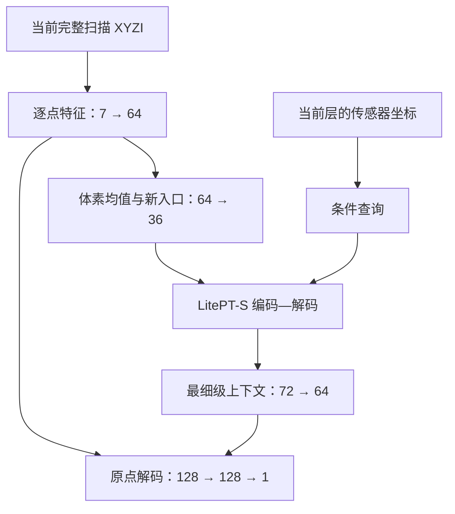

# AJAE V3：数据、模型、训练与评价方案

本方案研究：在单帧LiDAR中，利用观测位置与同帧结构关系，正确分割正常点与异常点，重点改善少回波、低矮、远距及遮挡变化弱的异常与困难正常结构之间的区分。**合成异常只提供训练监督，不作为创新点。**

V3保留LitePT-S编码—解码骨架，采用逐点学习入口、深层条件关系注意力和单一异常输出。**保留骨架不等于继承1152训练路线：本版以原始预训练为默认起点，重新定义训练风险、短程试验与分层评价。**

本文件是待验证的方法方案；下述步数、学习率、子集规模和分组边界是首轮实验约定，不是已经完成的实验结果。

## 一、数据方案

### 1. 任务定义

输入为当前完整扫描：

$$
P=\{(\mathbf x_i,I_i)\}_{i=1}^{N},
\qquad \mathbf x_i=(x_i,y_i,z_i),
$$

输出为每个实际回波的异常分数：

$$
f_\theta(P)=(s_1,\ldots,s_N).
$$

每个点可以利用同一扫描中的其他可见结构。推理不使用相邻帧、插入前扫描、语义标签或对象身份。

输入保留原始传感器坐标、朝向和强度，不做随机旋转、强度截断或随机删点。2.5—50米是监督与正式评价范围，范围外的实际回波仍作为上下文进入网络。

### 2. 数据划分与用途

| 数据 | 规模 | 用途 |
|---|---|---|
| 206原始正常扫描 | 449帧 | 训练背景与原始正常监督 |
| 206固定合成世界 | 240个世界、107,760个世界帧 | 异常及插入后正常监督 |
| 201原始正常扫描 | 682帧 | 独立正常来源上的误报评价 |
| 201固定合成世界 | 120个世界 | 独立来源的合成验证与配对诊断 |
| 真实val19 | 19条公开开发序列 | 真实异常评价、模型选择与分组分析 |

合成世界共享原始背景，107,760个世界帧不等于同等数量的独立场景。201与val19不参与梯度训练或训练统计拟合；val19已经用于开发，不称为未见测试集。

继续使用已完成放置修复的固定合成池。物体在世界中的形状、位置、朝向与材质保持一致，各帧实际回波由射线观测和遮挡竞争产生。多帧信息仅用于数据构造，网络仍逐帧独立预测。

既有30个生成条件格用于覆盖不同形态、高度和正常背景，不转化为网络预测类别。

### 3. 标签与有效点

| 回波类别 | 处理 |
|---|---|
| 检测范围内实际插入的回波 | 异常标签1 |
| 原始有效raw标签非0、非2的回波 | 正常标签0 |
| 原生raw标签2 | 单独隔离，不作为合成异常或正常监督 |
| raw标签0、缺失回波 | 不参与检测损失 |
| 范围外实际回波 | 作为上下文，不参与范围内检测损失 |

忽略监督的实际回波仍可作为上下文；没有回波的位置不建立点。

训练保留零异常帧和仅1—4个异常回波的帧，不使用正式评价“整帧至少5个异常点”的筛选条件。

### 4. 插入前后配对

每个训练样本包含原始扫描$P^-$和插入后扫描$P^+$，两者分别通过同一个网络：

$$
s^-=f_\theta(P^-),\qquad s^+=f_\theta(P^+).
$$

- 新增回波只在插入后扫描中接受异常监督。
- 保留下来的正常回波在两张扫描中均接受正常监督。
- 被遮挡而消失的原始正常回波只在原始扫描中接受监督。
- 新增点与旧点即使占用同一存储位置，也不视为同一回波。

配对表达的是“背景点在邻域变化后仍可能正常”，不要求其两次特征或分数完全相等，也不把插入前后扫描视为场景几何完全相同的可见性干预对。

沿用已核验的201重复记录处理，同一实际观测只计算一次，输出恢复到原始记录；一般同坐标不同强度回波仍分别保留。评价点集分母保持一致。

### 5. 早期诊断所需属性

固定数据池与标签协议保持不变。为评价整理每个实例观测的有效回波数、距离、可信高度及合成遮挡记录，并记录属性来源和缺失情况。这些属性用于分组分析，不输入网络。

训练中的实例均衡只使用生成过程已有的可靠对象身份。若一帧包含多个对象但身份不可恢复，采用后文明确的帧均衡备选，不能用聚类结果冒充真实实例。评价小集的帧号、实例身份和分组规则在首轮训练前固定；旧1152的失败案例单列复盘，不决定主要困难集。

## 二、模型方案

### 1. 总体结构

**原始回波编码 → 5厘米体素特征汇总 → LitePT-S编码—解码 → 原点细节与上下文融合 → 单一异常分数。**

观测条件直接作用于骨干已有的深层注意力；网络不输入法向、曲率、密度阈值、邻距统计或手工异常分数。

原始点特征到最终输出的连接是细节跳接。所有模块共同服务于一个逐点判别结果，不设置独立的基础分数和关系修正分数。

### 2. 逐点编码与体素入口

对点$i$，令$\mathbf o_i$表示其相对所在5厘米格几何中心的米制偏移：

$$
p_i=
\operatorname{GELU}
\left[
\operatorname{LN}
\left(W_p[\mathbf x_i,I_i,\mathbf o_i]+b_p\right)
\right]\in\mathbb R^{64}.
$$

7维输入由XYZI和三个格内偏移构成。每个回波先获得自己的表示，再进行汇总。

设$\pi(i)$为点所属体素，$n_u$为体素$u$内回波数：

$$
v_u=\frac{1}{n_u}\sum_{i:\pi(i)=u}p_i.
$$

$v_u$为64维特征。回波数仅作均值分母，不作为额外异常特征；不拼接最大值、独立位置数或其他统计量。

新的骨干入口为：

$$
e_u=
\operatorname{GELU}
\left[
\operatorname{LN}
\left(\operatorname{SparseConv}_{64\rightarrow36}(v)_u\right)
\right].
$$

使用保持活动体素位置的稀疏卷积，核大小为5，输出36维。新入口采用LayerNorm；骨干内部原有归一化结构保留。

逐点特征$p_i$同时保留到最终解码。均值汇总可能弱化少数点的贡献，细节跳接提供另一条可学习通路，但不宣称信息无损或必然解决少回波漏检。

### 3. LitePT-S骨架

| 编码层 | 格步长 | 通道数 | 块数 | 主要运算 |
|---|---:|---:|---:|---|
| 第1层 | 0.05米 | 36 | 2 | 稀疏卷积 |
| 第2层 | 0.10米 | 72 | 2 | 池化与稀疏卷积 |
| 第3层 | 0.20米 | 144 | 2 | 池化与稀疏卷积 |
| 第4层 | 0.40米 | 252 | 6 | 条件PointROPE注意力 |
| 第5层 | 0.80米 | 504 | 2 | 条件PointROPE注意力 |

层间下采样步幅均为2，保持原有投影后最大值聚合。这里的层间最大值聚合，与原始点进入第一个体素时的均值汇总是不同环节。

解码沿用对应层跳接与上采样，通道依次为252、144、72、72，最终得到5厘米层的72维特征。解码端不新增注意力块。

后两级分别有14和28个注意力头，每头18维，最大窗口为1024。保留原有交替空间序列化方式，不随机打乱顺序；随机深度和注意力丢弃均为0。格步长不等于感受野上限，有限层数的窗口交互也不保证任意两点直接相互访问。

### 4. 深层观测条件关系

网络需要学习：在当前观测位置下，哪些可见结构对判断该点是否异常更有用。

条件来自当前层token在原始传感器坐标中的代表位置$\mathbf x_i^{(\ell)}$：

$$
\mathbf c_i=\mathbf x_i^{(\ell)}/50.
$$

50米仅为固定数值缩放，不截断坐标。粗层代表位置沿用子单元坐标的均值，不解释为按原始回波数加权的真实物体质心。

每个深层注意力块分别使用一个$3\rightarrow32\rightarrow C$的两层感知机：

$$
\Delta q_i=W_2\operatorname{GELU}(W_1\mathbf c_i+b_1),
$$

其中$C$为252或504，最后一层不设偏置。将输出拆分到各个注意力头，在位置旋转编码之前调整查询：

$$
\widetilde q_i=R(g_i)(q_i+\Delta q_i),
\qquad
\widetilde k_i=R(g_i)k_i.
$$

$g_i$为当前层的网格坐标，$R$为LitePT原有的PointROPE位置旋转。每个头的关系权重为：

$$
a_{ij}=
\operatorname{softmax}_{j\in\mathcal W(i)}
\left[
\frac{(q_i+\Delta q_i)^\top
R(g_i)^\top R(g_j)k_j}{\sqrt{18}}
\right].
$$

其新增作用是：

$$
\frac{\Delta q_i^\top R(g_i)^\top R(g_j)k_j}{\sqrt{18}},
$$

即观测位置、相对位置编码与邻点内容之间的交互。随后按$a_{ij}$聚合原有value，并沿用原残差、输出投影和前馈网络。

这个机制只用于已有的8个深层注意力块，不在浅层另建关系分支，不把距离或稀疏程度直接加到异常分数上。

原骨干和逐点编码本身也包含XYZ，因此这里检验的是**显式观测位置通路的作用**，不能称原模型完全没有观测信息。该机制也不等同于完整可见性建模或恢复被遮挡的场景。

### 5. 逐点解码与评分

将最细层72维特征$f_u$投影到64维：

$$
h_u=
\operatorname{GELU}
\left[
\operatorname{LN}(W_cf_u+b_c)
\right].
$$

恢复每个原始点的上下文，与其独立特征拼接：

$$
z_i=\operatorname{GELU}
\left(W_d[p_i,h_{\pi(i)}]+b_d\right)\in\mathbb R^{128},
$$

$$
s_i=w_s^\top z_i+b_s.
$$

评分结构为$128\rightarrow128\rightarrow1$。同一体素中的点共享上下文，但保留各自的$p_i$和输出。训练与排序评价直接使用未截断的异常logit，不做逐帧分数归一化。

从逐点编码、体素汇总、骨干到评分头保持同一计算图，由同一个异常目标共同学习。手工选择仅限网络容量、计算层级和任务协议；不预先规定何种几何必须判为异常。

## 三、训练方案

### 1. 初始化：1152作为对照，不再作为默认父模型

1152的兼容权重可能提供有用表示，也可能保留旧目标、旧输入和旧采样形成的偏置。加载兼容骨干本身不会把已删除的评分分支重新接回网络；真正需要检验的是表示是否有利于新任务。

上一版同时继承1152权重、极低骨干学习率、固定BN统计和固定1024步预算，缺少独立理由。本版解除这组绑定。

| 路线 | 编码器与解码器初始化 | 用途 |
|---|---|---|
| P：默认主线 | 原始LitePT-S nuScenes语义预训练的兼容参数 | 利用已有点云表示，避免预设旧异常路线必须延续 |
| T：初始化对照 | 1152中与P完全相同的一组兼容参数 | 检验旧异常训练历史带来加速还是负担 |
| R：后续独立消融 | 全模型随机初始化 | 检验预训练依赖；需要独立学习率与充分预算，不在128步落后时直接否定 |

LitePT作者已公开nuScenes的LitePT-S权重，见[官方模型表](https://github.com/prs-eth/LitePT#model-zoo)。原始预训练也包含语义先验，不能称为没有语义监督历史；本次只核实了公开来源，尚未核验工作区中的具体权重文件。

P、T均只迁移结构与语义对应的骨干层；不能只凭张量形状相同认定可复用。两支使用完全相同的迁移范围，并公开来源、覆盖范围和未匹配部分。T额外拥有此前的异常任务训练历史，同等后续预算比较的是迁移表现，不代表两支的历史总训练成本相同。

以下模块在两支中均从同一随机状态开始：

| 部分 | 初始化 |
|---|---|
| 逐点$7\rightarrow64$编码 | 新初始化 |
| $64\rightarrow36$稀疏卷积入口及LayerNorm | 新初始化 |
| 最细层$72\rightarrow64$投影 | 新初始化 |
| 8个条件查询模块 | 第一层随机，最后一层权重为0 |
| $128\rightarrow128\rightarrow1$评分头 | 新初始化；最后权重正常随机、偏置为0 |

重新建立优化器和学习率轨迹，不继承旧动量、旧训练步号、旧评分阈值或旧模型选优门槛。条件查询初始为0不代表整个新模型复现旧分数。

所有可学习模块从第1步联合优化。保留骨干原有归一化类型，但重新建立BN运行统计，仅用206训练扫描更新；BN仿射参数可学习。评价时固定训练所得统计，201和val19不得更新它们。

新入口会改变特征分布，因此不默认冻结旧统计。梯度累积不会扩大单次BN统计的样本量；如果小批次统计不稳定，单独比较归一化策略，不能把统计尚未适应直接解释为某种初始化无效。

### 2. 训练目标：源帧均衡、帧内实例均衡的全点判别

训练目标改为更直接的二元分割风险。完整扫描参与前向，所有有效监督点参与损失，不再按“低支持、受影响正常”等手工条件挑选监督点。

设$\mathcal S$为449张训练源帧，$\mathcal W_s$为源帧$s$对应的固定世界集合。每次均匀选择源帧，再均匀选择其世界：

$$
s\sim U(\mathcal S),\qquad w\sim U(\mathcal W_s).
$$

这里的世界有效性由固定的数据与标签协议决定，不以是否产生异常回波筛选。零异常帧、1—4点帧全部保留。

令$J_{s,w}$为当前插入后扫描中具有有效异常回波的实例集合，$A_{s,w,j}$为实例$j$的有效回波。先在实例内平均，再在当前帧内平均：

$$
a_{s,w}=
\frac{1}{|J_{s,w}|}
\sum_{j\in J_{s,w}}
\frac{1}{|A_{s,w,j}|}
\sum_{i\in A_{s,w,j}}\operatorname{softplus}(-s_i^+).
$$

无有效异常实例时$a_{s,w}=0$。这样，同一帧内一个3点实例不会仅因点数少，就比300点实例获得低100倍的异常损失权重。

分别对两张扫描的有效正常点取均值：

$$
n^+_{s,w}=\frac{1}{|N^+_{s,w}|}
\sum_{i\in N^+_{s,w}}\operatorname{softplus}(s_i^+),
\qquad
n^-_s=\frac{1}{|N^-_s|}
\sum_{i\in N^-_s}\operatorname{softplus}(s_i^-).
$$

相应正常集合为空时，该项为0。总体风险为：

$$
\mathcal R(\theta)=
\mathbb E_{s\sim U(\mathcal S)}
\mathbb E_{w\sim U(\mathcal W_s)}
\left[
\frac12 a_{s,w}
+\frac14 n^+_{s,w}
+\frac14 n^-_s
\right].
$$

每次参数更新对实际抽取的8个请求直接平均。原始正常由均匀源帧抽样控制，不因某个源帧具有更多世界副本而增加总体权重。

这里明确改变了旧的全局点总体风险：现在是**源帧等权、帧内实例等权、实例内回波等权**。它不是全数据物体等权，同一物体的多帧观测仍会重复参与。

三个系数只是损失系数。零异常帧仍计入请求平均，其异常项为0，其他系数不重新分配；因此不能宣称实际正负贡献永远各占一半，需同时记录非空异常帧比例。

若可靠实例身份不可用，备选定义是对当前帧所有异常点取均值，只称“帧均衡”，并在一轮对照中统一采用这一口径。不能通过连通域或聚类补造实例标签。

实例均衡会提高少回波实例的相对影响，也可能放大其标签噪声；需核对已有生成身份与回波标签的对应。它不保证低矮、远距和弱遮挡条件自然均衡，也不保证困难正常不被大量普通正常点稀释，这些问题由早期评价检验。

不叠加几何规则分数、教师蒸馏、重建、一致性或手工困难分组权重。合成和上述均衡方式均作为训练设计，不作为论文创新主张。

### 3. 抽样与首轮优化

源帧、世界采用上述简单均匀抽样；不再使用旧80%/20%覆盖混合、重要性校正或困难正常查询配额。记录实际覆盖率，但不强迫每个短周期覆盖全部107,760个世界帧。

| 项目 | 首轮设置 |
|---|---|
| 优化器 | AdamW，$\beta=(0.9,0.999)$，$\epsilon=10^{-8}$ |
| P、T兼容骨干峰值学习率 | $10^{-5}$ |
| 所有新模块峰值学习率 | $10^{-4}$ |
| 权重衰减 | 线性与卷积权重0.01；偏置与归一化仿射0 |
| 每批输入 | 2对原始/插入后扫描；每张仍为完整扫描 |
| 梯度累积 | 4批后更新，共8个请求、16个扫描视图 |
| 损失范围 | 全部有效点，不做困难点抽样 |
| 梯度裁剪 | 累积后全局范数1.0 |
| 第一轮种子 | 20260917；P、T共享训练请求与新模块初始状态 |
| 预热 | 前16次更新由峰值10%线性升至100% |
| 预热之后 | 先保持平台学习率，不把128步短试验末尾当作收敛终点 |

第$t$次更新的学习率因子为：

$$
f(t)=
\begin{cases}
0.1+0.9(t-1)/15,&1\le t\le16,\\
1,&t>16\text{，直至进入明确的衰减阶段。}
\end{cases}
$$

这些是启动值。如果骨干实际更新极弱，可以对P、T同等比较$3\times10^{-5}$；如果出现持续不稳定，先检查归一化和梯度，再降低学习率。不能只给某条路线额外调参后宣称初始化更好。

若全点损失超出资源预算，可用均匀点抽样估计同一实例内和正常帧内均值，仍保持完整扫描上下文；这是明确记录的计算备选，不恢复手工困难提案，也不能改变对照双方的损失口径。

### 4. 训练分段：先取得反馈，再分配长程预算

| 阶段 | 参数更新数 | 要解决的问题 |
|---|---|---|
| 接通与适应 | 0—16 | 新入口、归一化、评分头和梯度是否正常；不凭随机头的早期AP判断最终能力 |
| 短程探索 | 16—128 | 目标弱异常开始受益了吗？困难正常误报是否上升？P和T的适应速度如何？ |
| 候选确认 | 128—256 | 完整评价能否支持小集趋势；必要时保留两支继续比较 |
| 延长训练 | 256—512起 | 依据学习曲线决定是否增加预算；512和1024仅为可能的大节点 |

默认P、T各训练128步，在该节点完整验证。若一支在弱异常、正常误报和总体表现上有一致优势，优先继续；差异小或方向矛盾时两支均延至256步。128步只能筛选适应效率与明显风险，不能证明另一种初始化的最终上限。

前256步保持同一预热后平台调度，使128步继续到256步时无需重启。之后以连续三个小评节点和最近一次完整评价共同判断：若仍有一致改善，继续原学习率；若目标指标停滞且训练已经稳定，统一将学习率减半，再观察128步。连续两次降率仍无完整评价支持的改善时结束当前候选。

任何继续、降率和停止都记录理由；机制对照复用最终确定的训练配方及预算。若中途改变损失或采样总体，建立新的实验路线，不能把改变前后的曲线当成同一个训练目标。

1152仅作为历史性能参照，不要求新模型在每个早期节点的所有指标均超过它。随机初始化若作为正式结论的一部分，需单独给予合理优化与更长预算。

### 5. 每个短节点需要看到什么

| 记录 | 用途 |
|---|---|
| 异常、插入后正常、原始正常三项损失及其波动 | 区分异常学习、正常抑制与两者冲突 |
| 源帧、世界、实例观测覆盖；零异常与少回波比例 | 判断短程是否实际接触了目标条件 |
| 各参数组梯度、裁剪频率、相对参数更新幅度 | 判断骨干是否几乎未动、新模块是否独占训练 |
| 条件查询输出及其梯度变化 | 核对该通路是否被使用，不把幅值当性能证据 |
| BN统计变化、训练与评价分数分布 | 发现统计未适应或评分尺度漂移 |
| 各分组损失与漏检、误报曲线 | 及早看见总体损失下降掩盖的困难组退步 |
| 实际训练及评价耗时、峰值显存 | 判断更密评价的反馈是否值得其成本 |

分组记录不参与额外加权。各曲线以参数更新数和累计扫描视图数为横轴，同时报告墙钟时间，避免批量变化导致“同样步数”不可比。

## 四、评价方案

### 1. 固定小面板：总体、弱异常、正常误报分别观察

训练前一次性确定固定小集；各候选在完全相同的帧和有效点集上比较，不随当前模型失败情况滚动替换。

| 面板 | 首版预算 | 选择与用途 |
|---|---:|---|
| G：val19总体小集 | 57帧 | 每条序列3帧，按时间段分散抽取官方合格帧；看总体趋势并产生统一工作阈值 |
| H：val19目标困难小集 | 最多48帧 | 依据GT、可信属性和正常结构选取；覆盖少回波、低矮、远距，兼顾困难正常；不按1152或候选分数筛选 |
| N：201正常小集 | 48帧 | 32帧按时间分层抽取，16帧补充可信困难正常结构；两部分误报分开报告 |
| S：201合成配对小集 | 16对 | 固定世界与帧，覆盖弱遮挡变化、少回波和配对困难正常；含零异常诊断 |

G每条序列尽量覆盖前、中、后时间段，在非空时间段内随机抽取，随机种子固定；不足3帧时使用实际可用帧并披露。G用于稳定的开发趋势，不是完整val19点分布的无偏代表。

H优先保证不同序列、物体和属性覆盖，限制连续相邻帧占满预算；同一帧可有多个属性标签。尽量与G分开，必要重叠明确记录。G、H与N均输入完整扫描，不裁剪成目标物体或局部区域。

N的困难部分可覆盖路缘、细杆、植被、稀疏远处正常结构等可信正常区域；按GT或人工核对定义。其48帧混合误报率不冒充整条201序列的自然误报率。

小集帧数是计算预算，不是样本量充分的保证。缺少某类可信标注时先报告缺口，不用旧低支持计数顶替；若某组过少，只在一轮试验结束后统一扩充，并重新评估全部候选。

S只采用201来源，与206梯度训练分离；同源合成世界仍共享背景，不能算作大量独立场景。合成结果独立于真实结果呈现。

### 2. 评价节奏

| 节点 | 评价规模 | 用途 |
|---|---|---|
| 0、8步 | 嵌套微型面板：N 8帧、G 19帧、H最多16帧、S 4对 | 看数值、统计适应和明显异常趋势；0步不做完整验证 |
| 16、32、64、96步 | 完整小面板G、H、N、S | 频繁观察目标组、正常误报和总体变化 |
| 128步 | 两种初始化的完整201＋完整val19；同时S | 首次大节点，检验小集趋势并决定后续预算 |
| 128步之后 | 每64步一次小面板 | 跟踪改善、退步和平台期 |
| 256、512步；若继续则1024步 | 当前候选的完整201＋完整val19；同时S | 确认继续、降率或结束的依据 |
| 最终选中的任意步 | 完整201＋完整val19 | 最终候选必须有对应权重的完整结果 |

微型面板从标准小面板中固定抽取，工作阈值由其自身G的19帧确定；其指标单独显示，不与57帧G对应的标准小面板混接成同口径曲线。所有小评节点保存对应权重，完整节点由同次全量预测提取小集指标，不重复推理。

同一模型、同一帧在不同分组中复用一次预测。训练和评价耗时均记录；如标准小评过于昂贵，可在完成首轮后统一调整频率，不删掉目标困难组来换取便宜的总体分数。

旧152/108困难范围不再限制新面板，也不要求照搬旧32帧合成范围。已有失败案例可以作为附加复盘，但不进入主要选优规则。

### 3. 工作阈值：优先在共同低误报工作点比较

每个模型、每个检查点重新从该次G预测计算工作阈值，不能沿用1152的原始logit阈值，也不能给各个困难组单独选阈值。

主工作点为G中正常点误报率不超过1%的经验阈值$\tau_{1\%}^{G}$，取满足约束且尽可能保留异常召回的阈值；并列分数按统一保守规则处理。将它原样应用于H和N，报告实际达到的误报率。

辅助工作点$\tau_{95}^{G}$由G的异常点召回达到约95%确定，用于观察高召回时的正常误报代价。若分数并列或样本少，报告实际达到的召回，不插值伪造精确95%。

| 指标口径 | 阈值来源 | 评价对象 |
|---|---|---|
| 小评主工作点 | 同次G正常点的1%FPR | G总体、H目标异常与困难正常、N正常误报 |
| 小评高召回工作点 | 同次G异常点约95%召回 | G的FPR95及H、N误报诊断 |
| 完整正式工作点 | 完整val19官方有效点 | 完整val19与各分组、完整201 |
| 合成配对工作点 | 同次真实G；大节点使用完整val19 | 同一阈值评价S的异常和配对正常 |

1%约束只在阈值来源的正常点集上成立，不保证H或201也恰为1%。这种外推后的误报正是需要观察的结果。

大节点同时保留“小集阈值下的小集曲线”和“全量阈值下的正式结果”，两者分别标明，不把阈值来源变化误读成训练突变。必要时补充完整val19的0.1%低误报工作点，边界同样提前固定。

纯正常201不报告无定义的异常AP或FPR95，只报告共享阈值下的正常误报数、点误报率和帧级误报负载。帧级负载包括每帧误报点数及误报点比例的中位数、95分位，不将“任意一个误报点”直接当作物体告警。

### 4. 目标问题必须从早期直接分组评价

主要分组依据当前“序列—帧—实例”的观测，不能用整帧异常点数代替单个实例点数。

| 研究条件 | 首版分组定义 | 证据要求 |
|---|---|---|
| 少回波 | 实例有效回波1—4、5—19、20—99、至少100 | 使用真实实例身份；未知身份不冒充实例统计 |
| 远距 | 实例有效回波距离中位数位于2.5—10、10—20、20—35、35—50米 | 固定为实例属性；边界采用左闭右开，最后一档含50米 |
| 低矮 | 可信物体物理高度不超过0.30米，另列0.30—0.50米、超过0.50米 | 使用已有尺寸、可靠框或独立人工核验；不是绝对z或可见点竖直跨度 |
| 遮挡变化弱 | 每个插入对象导致的原始背景有效回波消失数$D_j$为0、1—4、5—19、至少20 | 需要射线与对象归属；能确定分母时另报相对变化比例 |
| 困难正常 | 可信正常结构标签、少支持正常与配对受影响正常分别报告 | 不把异常邻域所有点都当正常，也不把稀疏直接当异常 |

低矮0.30米和遮挡变化计数边界是本轮拟定的分析约定，不是已经核实的基线论文定义。训练前依据实际标注确认可用性并冻结；不能看到候选结果后再选有利边界。

少回波、远距和低矮可以重叠，分别报告，并展示少回波×距离、低矮×距离的交叉分布；不足样本的格子报告计数，不给稳定性结论。实例等权指标中，同一观测在一个合并目标集合内只计一次。

**“遮挡变化弱”指异常出现后对背景可见回波改变很小，不等于异常自身被遮挡得少。** 多个对象同帧时，$D_j$需由生成器的射线遮挡归属确定；无法归属时只报告帧级$D$，不能将整帧变化赋给每个实例。

如果生成器可可靠给出对象$j$的影响射线集合，令$B_j$为该集合内插入前实际存在的有效背景回波数，比例为$D_j/B_j$。$B_j=0$记为不可定义，不记为0；不得把整帧点数或任意邻域点数替作分母。若现有记录不足，只报告“少背景回波消失”代理计数及已知背景条件，不声称具有完整可见性度量。

S在预算内尽量同时包含小$D_j$且有异常回波、较大$D_j$且有异常回波、零异常回波三类。比较时同时看异常回波数、距离和背景可受遮挡机会，避免把背景本就没有回波误读为更困难的可见性条件。

单帧真实扫描通常没有“同一场景未放置异常时”的对应观测，因此不能从密度、距离或邻域数量推断真实反事实遮挡变化。真实遮挡相关主张需要额外可信依据；缺少时，真实结果只支持已标注的少回波、低矮和远距，合成配对支持受控条件下的机制诊断。

低支持仍可作为附加分析：2米内少于8个其他独立位置；受影响正常可按距新增或消失回波2米内分组。它们不再决定训练抽样，也不能取代主要研究条件。特别是少回波异常可能紧邻密集地面，低支持异常不能代表全部弱异常。

### 5. 正式范围与微小异常补充范围

官方主表保持既定的标签、2.5—50米范围及“合格帧至少5个异常点”规则，按官方有效点全局合并排序；报告AP、FPR95、R@1%FPR，并补充AUROC。

如果某个实例只有1—4点，但其所在帧满足官方资格，该实例仍进入官方范围内的少回波组。

另外建立明确标注的微小异常补充范围：对有可信标签、检测范围内整帧仅1—4个异常点的扫描作诊断，H中预留最多12帧覆盖此类样本，实际数量不足时如实披露。它们不被混入官方AP/FPR95；使用G或完整val19确定的同一阈值，报告实例与点召回以及正常误报。

完整节点遍历val19中全部具有可信标签、范围内整帧仅1—4个异常点的扫描，不限于H中的最多12帧；即使官方主表排除这些帧，也单独预测和报告。缺少此类帧或可靠身份时直接说明证据缺口，不能声称已经验证最弱整帧样本。

每个异常分组报告点数、实例观测数、不同物体数（仅在可跨帧关联时）、序列数、检出点数、点召回及实例等权点召回：

$$
R_{\mathrm{inst}}(\tau)=
\frac{1}{M}\sum_{j=1}^{M}
\frac{\sum_{i\in A_j}\mathbf 1[s_i\ge\tau]}{|A_j|}.
$$

该指标是实例平均的点召回，不是物体检出率；观测次数不冒充独立物体数。正常分组报告误报数、点误报率与帧级负载；配对保留正常用同一模型、同一阈值比较插入前后，不要求分数不变。

### 6. 候选选择与证据标准

早期主要看三条曲线：**共同低误报工作点下目标异常的实例等权召回、困难正常/201误报、总体表现。** 不把困难集AP当总体AP，也不将多个重叠分组随意加权成一个新总分。

选优按以下规则推进：

1. 小面板用于定位问题和分配下一阶段预算；除数值错误或持续崩溃，不凭8或16步的单点结果淘汰路线。
2. 在大节点比较完整val19的目标弱异常召回、完整201误报、官方总体指标，保留没有被另一候选全面压过的方案。
3. 目标组持续改善且全量评价支持时可以继续，即便尚未超过1152所有指标；若收益只来自误报激增，不称为更好的区分能力。
4. 目标改善与总体退步同时存在时明确报告取舍，不强行宣称唯一最佳；论文主要结论需要在可接受的正常误报代价下成立，不能仅靠困难小集提升。
5. 优先路线进入主要结论前采用至少3个训练种子复核。统计以序列为基本聚类单位，尽可能考虑物体重复，报告各组样本支持和波动。

当前没有依据设定“允许损失多少总体AP”或统一的误报容忍值。因此首轮保留取舍表，不通过事后设置一个有利加权分数解决冲突。

1152旧模型的既有记录为AP 76.435100%、FPR95 0.212716%、R@1%FPR 98.873130%、AUROC 99.940656%。它用于历史比较；只有相同分母和评价协议下的结果才可直接对照，不成为新模型硬性准入线。

COVAL继续作为项目既有综述确定的主要强基线，最终在同一官方评价口径下比较，并披露训练、预训练和监督差异。val19已用于开发与选优，小集反复查看或后来完整跑一遍，都不会使它成为未见测试集；最终论文应尽可能补充未用于调参的测试证据。

### 7. 区分初始化、训练配方与关系机制的贡献

先用相同模型和新训练配方比较P、T初始化，再在确定的初始化与预算下比较模型机制，避免一次改变所有因素后无法解释收益。

| 对照 | 唯一需要隔离的变化 | 其余条件 |
|---|---|---|
| P与T | 原始预训练与1152骨干的训练历史 | 相同迁移层、新模块初始状态、BN策略、请求序列、损失、评价和调参预算 |
| A：完整V3，与B：普通注意力 | 是否加入条件查询通路 | 相同新入口、骨干、评分头及最终训练配方 |
| A与C：常量条件 | 真实归一化坐标与固定$[1,1,1]$条件 | 条件模块容量相同，其他设置一致 |
| 新风险与点均衡风险 | 实例/帧均衡是否影响目标组 | 仅在需要解释训练配方收益时补做；两者均使用全点输入与监督 |

A、B、C使用逐张量相同的公共参数初始值、相同训练请求序列，以及事先确定的同一学习率轨迹和总更新数；不再由各分支的小集结果分别触发降率或早停。

A优于B不能单独排除新增容量的影响；A进一步优于C才更支持显式位置依赖的价值。新的损失、预训练来源或更大训练预算带来的收益，也不能直接归到条件关系模块。

最终主张依赖完整真实评价、目标条件分组、困难正常误报及受控机制对照共同支持。短程小面板的作用是尽早提供这些方向的证据，让训练决策及时可解释。
