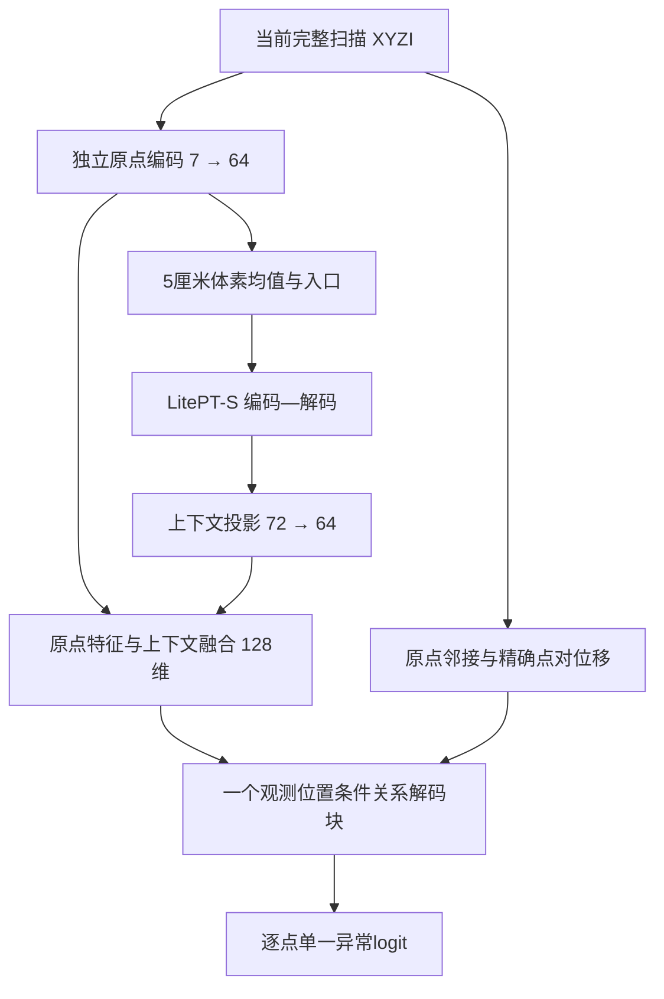

# AJAE V3：数据、模型、训练与评价方案（完善版）

本方案研究：**在单帧LiDAR中，利用观测位置与同帧结构关系，正确分割正常点与异常点，重点改善少回波、低矮、远距及遮挡变化弱的异常与困难正常结构之间的区分。** 合成异常提供监督，不作为创新点。

统一主线是：**LitePT-S提取场景上下文，原始回波关系解码器在最终判别前直接读取原点与邻点的细粒度信息；训练同时约束实例均衡的异常风险和正常点的高损失尾部；评价在低误报工作点检验目标收益。**

本版替换上一版8个深层Q条件修改，不把新关系解码器叠加在旧条件分支上。仍只有一个异常输出、一个分割目标，全部可学习模块联合训练。

这是根据理论审查完善的待验证方案，尚无本结构的训练结果。下述参数是首轮约定，不能据此宣称性能或新颖性已经成立。

## 一、数据方案

### 1. 任务定义

输入为当前完整扫描：

$$
P=\{(\mathbf x_i,I_i)\}_{i=1}^{N},
\qquad \mathbf x_i=(x_i,y_i,z_i),
$$

输出为每个实际回波的异常分数：

$$
f_\theta(P)=(s_1,\ldots,s_N).
$$

每个点可以利用同一扫描中的其他可见结构。推理不使用相邻帧、插入前扫描、语义标签或对象身份。

输入保留原始传感器坐标、朝向和强度，不做随机旋转、强度截断或随机删点。2.5—50米是监督与正式评价范围，范围外的实际回波仍作为上下文进入网络。

### 2. 数据划分与用途

| 数据 | 规模 | 用途 |
|---|---|---|
| 206原始正常扫描 | 449帧 | 训练背景与原始正常监督 |
| 206固定合成世界 | 240个世界、107,760个世界帧 | 异常及插入后正常监督 |
| 201原始正常扫描 | 682帧 | 独立正常来源上的误报评价 |
| 201固定合成世界 | 120个世界 | 独立来源的合成验证与配对诊断 |
| 真实val19 | 19条公开开发序列 | 真实异常评价、模型选择与分组分析 |

合成世界共享原始背景，107,760个世界帧不等于同等数量的独立场景。201与val19不参与梯度训练或训练统计拟合；val19已经用于开发，不称为未见测试集。

继续使用已完成放置修复的固定合成池。物体在世界中的形状、位置、朝向与材质保持一致，各帧实际回波由射线观测和遮挡竞争产生。多帧信息仅用于数据构造，网络仍逐帧独立预测。

既有30个生成条件格用于覆盖不同形态、高度和正常背景，不转化为网络预测类别。

### 3. 训练标签与有效点

| 回波类别 | 处理 |
|---|---|
| 检测范围内实际插入的回波 | 异常标签1 |
| 原始有效raw标签非0、非2的回波 | 正常标签0 |
| 原生raw标签2 | 单独隔离，不作为合成异常或正常监督 |
| raw标签0、缺失回波 | 不参与检测损失 |
| 范围外实际回波 | 作为上下文，不参与范围内检测损失 |

忽略监督的实际回波仍可作为上下文；没有回波的位置不建立点。

训练保留零异常帧和仅1—4个异常回波的帧，不使用正式评价“整帧至少5个异常点”的筛选条件。

### 4. 插入前后配对

每个训练样本包含原始扫描$P^-$和插入后扫描$P^+$，两者分别通过同一个网络：

$$
s^-=f_\theta(P^-),\qquad s^+=f_\theta(P^+).
$$

- 新增回波只在插入后扫描中接受异常监督。
- 保留下来的正常回波在两张扫描中均接受正常监督。
- 被遮挡而消失的原始正常回波只在原始扫描中接受监督。
- 新增点与旧点即使占用同一存储位置，也不视为同一回波。

两张扫描提供互补监督，配对用于匹配诊断。当前损失不使用配对身份建立耦合约束，因此不把独立BCE称为配对关系学习，也不要求两次特征或分数相等。模型在每张当前扫描中独立建立邻接，不读取插入前后差分。

沿用已核验的201重复记录处理，同一实际观测只计算一次，输出恢复到原始记录；一般同坐标不同强度回波仍分别保留。评价点集分母保持一致。

### 5. 早期诊断所需属性

固定数据池与标签协议保持不变。为评价整理每个实例观测的有效回波数、距离、可信高度及合成遮挡记录，并记录属性来源和缺失情况。这些属性用于分组分析，不输入网络。

训练中的实例均衡只使用生成过程已有的可靠对象身份。若一帧包含多个对象但身份不可恢复，采用后文明确的帧均衡备选，不能用聚类结果冒充真实实例。评价小集的帧号、实例身份和分组规则在首轮训练前固定；旧1152的失败案例单列复盘，不决定主要困难集。

### 6. 监督可信性与覆盖清点

沿用固定数据池，但在训练前形成以下可审阅的记录：

| 检查 | 要确认的事实 | 出现缺口时的处理 |
|---|---|---|
| 异常语义 | 合成对象确实对应本任务的道路异常；插入身份不是异常的语义定义 | 修正已确认的标签问题；不按模型高损失直接删除样本 |
| 回波与对象身份 | 新增、保留、消失回波的身份可靠，实例归属不由几何聚类臆造 | 身份缺失使用明确的帧均衡备选，分组不能伪称实例统计 |
| 生成来源痕迹 | 正常/异常强度、量化和坐标中是否有明显特殊取值或处理差异 | 记录并核查来源；物理射线正确不自动排除此类捷径 |
| 合成验证独立性 | 206与201是否共享对象资产、形状、材质和生成规则 | 如实报告重叠；独立背景不等于独立生成器或未知形态 |
| 目标支持 | 少回波、低矮、远距、小背景变化组的观测、源帧、对象及资产数 | 区分真实缺样本与属性未知，不能把二者都填成0 |
| 困难正常支持 | 路缘、细杆、植被、远处稀疏正常等可信正常结构是否实际存在 | 缺少哪类就限制哪类结论，不假设全点监督自然补齐覆盖 |

以上是对已定数据的核验，不新增生成器贡献。不要为消除位置相关性而强行抹平所有坐标分布；观测位置本身也是要研究的有效信息。

可用一个仅访问单点XYZI的轻量诊断模型，仅在206训练，分别评价201合成与真实val19，检查生成域到真实域的迁移。合成表现好而真实失效只提示捷径风险，不能单独定位原因；201使用同一生成器，也不能独立证明没有生成痕迹。

## 二、模型方案

### 1. 统一结构与设计理由

本版把新增关系计算放在原始回波分辨率：查询点与邻点都保留独立特征，点对位移直接由原始坐标计算，最终判别不必仅依赖池化后的混合token。

| 目标困难 | 同一结构如何提供可学习路径 | 需要验证的边界 |
|---|---|---|
| 少回波 | 每个原点仍有自己的查询和评分，直接访问邻点原始特征 | 邻域与特征仍有限，不保证微小证据必然被利用 |
| 低矮 | 精确相对位移与邻近地面/路缘的可见关系进入判别 | 不输入地面规则分数，也不保证观测足以恢复真实高度 |
| 远距 | 观测位置与相对位移共同编码，学习不同位置下结构的意义 | K近邻的物理范围随采样变化，位置捷径仍需对照排除 |
| 背景遮挡变化弱 | 使用当前可见形态与上下文，不依赖插入前后变化量作为输入 | 不恢复未观测反事实；合成分组只检验该条件下的行为 |
| 困难正常 | 相同关系算子可结合上下文判断稀疏、边界是否正常 | 模型容量不能代替正常风险和正常样本覆盖 |

### 2. 原点编码、体素入口与骨干

保留原始XYZI和相对5厘米格几何中心的米制偏移$\mathbf o_i$：

$$
p_i=\operatorname{GELU}\!\left(\operatorname{LN}
(W_p[\mathbf x_i,I_i,\mathbf o_i]+b_p)\right)\in\mathbb R^{64}.
$$

点所属体素记为$\pi(i)$。骨干入口使用：

$$
v_u=\frac1{n_u}\sum_{i:\pi(i)=u}p_i,
\qquad
b_u=\operatorname{GELU}\!\left(\operatorname{LN}
(\operatorname{SparseConv}_{64\to36}(v)_u)\right).
$$

稀疏卷积核大小为5，保持活动体素位置。均值分母不另作密度特征；原点$p_i$保留供解码直接读取。

| 编码层 | 格步长 | 通道 | 块数 | 运算 |
|---|---:|---:|---:|---|
| 1 | 0.05米 | 36 | 2 | 原有稀疏卷积 |
| 2 | 0.10米 | 72 | 2 | 原有稀疏卷积 |
| 3 | 0.20米 | 144 | 2 | 原有稀疏卷积 |
| 4 | 0.40米 | 252 | 6 | 原有PointROPE注意力 |
| 5 | 0.80米 | 504 | 2 | 原有PointROPE注意力 |

下采样步幅2，沿用骨干投影后的最大值聚合。后两层为14/28个头，每头18维，最大窗口1024；保留原有空间序列化顺序，随机深度与注意力丢弃为0。

解码通道252、144、72、72，通过跳接与上采样恢复5厘米层特征$f_u$。骨干内部不再新增条件查询；其浅层卷积和深层注意力本身仍学习同帧结构。[LitePT原论文](https://arxiv.org/html/2512.13689v2)

上下文和原点融合为：

$$
h_u=\operatorname{GELU}\!\left(\operatorname{LN}(W_cf_u+b_c)\right)
\in\mathbb R^{64},
$$

$$
u_i=\operatorname{GELU}\!\left(\operatorname{LN}
(W_u[p_i,h_{\pi(i)}]+b_u^{\mathrm{proj}})\right)\in\mathbb R^{128}.
$$

同格点共享$h_u$但不共享整个$u_i$。后文每个邻点$j$也使用自己的$u_j$，不能用一个体素代表点替代所有邻点。

### 3. 原点邻域与观测位置条件关系

对每个原始点$i$，在当前完整扫描中取31个XYZ欧氏距离最近的其他回波，加上自身，共$K=32$。不足时只使用实际存在的点，不复制回波充数；等距按固定身份排序。两张配对扫描各自独立建邻接。

不附加2米等硬半径，不用标签、实例边界、法向、密度阈值或异常候选来选邻点。K是计算预算；固定邻接是结构归纳偏置，网络对可学习参数仍端到端训练。范围外和忽略标签的实际回波可作上下文。

定义无截断的数值缩放：

$$
c_i=\frac{\mathbf x_i}{50\,\mathrm m},
\qquad
\delta_{ij}=\frac{\mathbf x_j-\mathbf x_i}{1\,\mathrm m}.
$$

用一个$6\to32\to128$的MLP联合编码位置与位移：

$$
\phi([c,\delta])=W_2\operatorname{GELU}(W_1[c,\delta]+b_1),
\qquad
e_{ij}=\phi([c_i,\delta_{ij}])-\phi([c_i,0]).
$$

末层不设偏置。零位移中心化使$e_{ii}=0$，去掉新增几何value路径中的查询位置常量；它不增加参数，也不是独立创新。减去的常量在注意力softmax中本来就会抵消，因此不能声称中心化创造了新的注意力能力。

位置在联合MLP中可以改变对相同位移的解释；该函数也可能学成弱条件或无条件形式，由对照判断。原点token本身已有XYZ，不能称这里首次提供了位置信息，更不能声称完全排除了位置捷径。

### 4. 一个关系解码块与一个输出

关系块宽128，4个头，每头32维。令$\bar u_i=\operatorname{LN}(u_i)$：

$$
q_i^a=W_Q^a\bar u_i,\qquad
k_j^a=W_K^a\bar u_j,\qquad
v_j^a=W_V^a\bar u_j.
$$

将$e_{ij}$拆为4个头，在原点邻域$\mathcal N(i)$内计算：

$$
\alpha_{ij}^a=
\operatorname{softmax}_{j\in\mathcal N(i)}
\left[\frac{(q_i^a)^\top(k_j^a+e_{ij}^a)}{\sqrt{32}}\right],
$$

$$
m_i=\operatorname{Concat}_{a=1}^4
\sum_{j\in\mathcal N(i)}\alpha_{ij}^a(v_j^a+e_{ij}^a),
\qquad
\widehat u_i=u_i+W_Om_i,
$$

$$
z_i=\widehat u_i+\operatorname{FFN}(\operatorname{LN}(\widehat u_i)),
\qquad
s_i=w_s^\top\operatorname{LN}(z_i)+b_s.
$$

FFN为$128\to256\to128$，中间GELU；关系块不设dropout。最终仅有一个128到1的线性异常读出，不输出基础分数、关系修正分数或额外规则分数。训练与排序使用原始logit，不逐帧归一化。

细粒度旁路现在包含两部分：自己的$p_i$，以及邻点独立$p_j$和精确$\delta_{ij}$。这保证存在绕过体素压缩的实际计算路径，不保证所有信息无损或性能必然提高。

点云注意力与位置编码已有充分先例，不能把“增加原点注意力”本身当作创新。需要证明的是该条件关系在本课题目标上的必要性及实际收益。[Point Transformer](https://arxiv.org/abs/2012.09164)

### 5. 范围、资源与可解释边界

K近邻可能跨越空隙，也可能漏掉较远的有效结构；骨干上下文提供额外范围，但不保证全局任意点直接交互。记录邻域物理距离和异常/正常混合情况，不把注意力可视化当有效性的证明。

关系算子的代价约为$O(NKd+Nd^2)$，邻居检索另计。$N=10^5,K=32,d=128$时，单份FP16边特征约0.82GB，完整训练需求更大。可采用数学等价的按查询分块计算，邻居仍取自完整扫描；分块降低部分峰值需求，不是显存足够的保证。不能靠删掉难点改变模型定义。

没有回波的位置不预测；同样的当前XYZI与可见结构若对应不同潜在语义，单帧方法无法保证无误区分。统一目标是利用已有可辨识证据，不恢复不存在的反事实观测。

## 三、训练方案

### 1. 初始化与联合学习

| 路线 | 骨干起点 | 用途 |
|---|---|---|
| P：默认 | 原始LitePT-S nuScenes语义预训练的兼容编码—解码参数 | 利用通用点云表示，摆脱1152任务路线的默认约束 |
| T：对照 | 1152中与P相同范围的兼容参数 | 判断旧异常训练历史是否有迁移价值 |
| R：独立消融 | 随机初始化 | 检验预训练依赖，需要独立合理预算，不用128步排名否定 |

原始权重由作者公开，具体文件与迁移层在实验前核验；形状相同不自动代表语义兼容。P与T迁移范围相同；T已有额外历史训练，因此相同后续预算不是相同总成本。[LitePT官方模型表](https://github.com/prs-eth/LitePT#model-zoo)

逐点编码、64到36入口、72到64上下文投影、128维融合、整个原点关系块和最终读出均新初始化；公共新参数在对照间逐张量一致。关系MLP与输出投影采用正常随机初始化，不继承旧条件模块或旧评分头。

所有模块从第1步共同优化，重新建立优化器、调度和训练步号。新入口采用LN；骨干原有归一化类型保留，BN仿射可学习，运行统计重建且只用206训练视图更新。评价固定训练统计，不能用201或val19适配。

梯度累积不增加单次BN统计样本量。归一化不稳定时单独检验相同BN策略，不与初始化结论混淆。预训练含语义历史，不能描述为从未用过语义监督。

### 2. 抽样与异常风险

均匀选择449张源帧中的$s$，再均匀选择其固定世界$w$：

$$
s\sim U(\mathcal S),\qquad w\sim U(\mathcal W_s).
$$

有效世界由冻结数据协议决定，不按是否产生异常回波筛选。完整原始与插入后扫描前向，所有有效监督点参与风险；不再按手工几何条件分配查询配额。

对于当前扫描中的非空异常实例集合$J_{s,w}$及其有效回波$A_{s,w,j}$：

$$
a_{s,w}=\frac1{|J_{s,w}|}\sum_{j\in J_{s,w}}
\frac1{|A_{s,w,j}|}\sum_{i\in A_{s,w,j}}
\operatorname{softplus}(-s_i^+).
$$

空实例集合令$a_{s,w}=0$。同帧3点和300点异常实例具有相同的实例损失系数。多帧重复观测仍会重复参与，不称全数据独立物体等权。

若实例身份不可用，统一使用帧内异常点均值备选，并明确其只实现帧均衡。不能在同一对照中混用两种风险口径。

### 3. 正常风险：全体均值与高损失尾部共同约束

仅用正常全点均值，可能让极少困难正常点的误报被大量容易正常点稀释。本版把每张扫描的正常风险改为一个均值—上尾混合风险；仍是同一二元分割任务，没有额外头或几何困难标签。

对有效正常集合$N$，令$M=|N|$，$\ell_i=\operatorname{softplus}(s_i)$。定义：

$$
\mu(N)=\frac1M\sum_{i\in N}\ell_i,
\qquad
C_\alpha(N)=\min_{\eta\in\mathbb R}
\left[\eta+\frac1{\alpha M}\sum_{i\in N}(\ell_i-\eta)_+\right],
$$

$$
n(N)=(1-\lambda)\mu(N)+\lambda C_\alpha(N),
\qquad \alpha=0.01,\quad\lambda=0.5.
$$

$C_\alpha$是最高损失1%正常点的经验上尾均值；$\eta$由当前损失分位数确定，不是新增网络参数。边界为非整数时采用分数权重，并列值均分对应边界权重；$\alpha M<1$时为最大损失。正常集合为空时整项为0。

全部正常点仍通过$\mu$参与学习，高分正常通过尾部项获得更强约束。尾部点由当前预测误差决定，不能预先用距离、密度、曲率或物体类别指定。

当$\alpha M$为整数且无边界并列时，尾部点对其自身BCE的系数是$50.5/M$，其他点为$0.5/M$；这是相对全点均值的损失系数变化，不是实际网络参数梯度的固定比例。上尾聚合是已有通用训练思想，不作为本项目创新。[Average Top-k Loss](https://arxiv.org/abs/1705.08826)

训练上尾1%不是允许1%误报，也不是评价工作阈值。它可能放大误标正常，或过度压制异常召回；必须保留既定忽略规则，核查尾部集中情况，不能因某点损失高就删掉它的标签。该风险不保证所有困难正常类型自动得到充分覆盖。

### 4. 单一总风险及边界处理

记$n^+_{s,w}=n(N^+_{s,w})$、$n^-_s=n(N^-_s)$。两个分数集合都由同一完整新网络对各自扫描、各自邻接重新预测；原始视图不使用插入后上下文或旧模型分数。下式省略训练BN的批次统计随机性：

$$
\mathcal R(\theta)=\mathbb E_{s,w}
\left[\tfrac12a_{s,w}+\tfrac14n^+_{s,w}+\tfrac14n^-_s\right].
$$

每次参数更新对8个请求直接平均。空项为0，系数不转移；零异常请求保留，不把正常损失翻倍。

这里是源帧均衡、帧内实例均衡、正常均值/上尾混合的任务风险，已不同于旧全局点总体风险。原始正常由均匀源帧选择控制，不因副本数量增加源帧权重。

非空异常帧比例$\rho$影响正例实际贡献，不能把三个系数称为严格正负各半。常数分数的最优值为$\log\rho$（两正常项非空、$\rho>0$）；这不表示排序必然变差，需区分尺度漂移与位置相关的偏置。

两视图独立风险没有配对耦合项，不宣称它学习反事实干预或强制正常不变性。也不再添加教师、重建、边界或一致性目标。

正式正常尾部始终从每张扫描的全部有效正常分数计算，不能在点子样本或查询分块中分别取1%后冒充同一风险。资源受限时优先保持数学等价计算；近似损失需单独声明和复核。

### 5. 优化设置

| 项目 | 首轮约定 |
|---|---|
| 优化器 | AdamW，$\beta=(0.9,0.999)$，$\epsilon=10^{-8}$ |
| 兼容骨干峰值学习率 | $10^{-5}$ |
| 所有新模块峰值学习率 | $10^{-4}$ |
| 权重衰减 | 线性、卷积权重0.01；偏置及归一化仿射0 |
| 每批 | 2对原始/插入后完整扫描 |
| 梯度累积 | 4批，8请求、16扫描视图后更新 |
| 梯度裁剪 | 累积后全局范数1.0 |
| 种子 | 20260917；比较路线共享请求顺序与公共参数初值 |
| 预热 | 前16步由峰值10%线性升至100% |
| 后续 | 先保持平台，不在128步短试末尾强行衰减 |

预热因子为$0.1+0.9(t-1)/15$，$1\le t\le16$；之后为1，直至进入明确衰减阶段。骨干几乎不更新时可公平比较$3\times10^{-5}$，不只给某一初始化额外调参。

先检查原点关系计算的真实资源需求。若批量必须改变，公开有效批量、归一化影响、总视图和实际时间，并使对照一致；不以不等计算预算宣称结构优越。

### 6. 覆盖先于短程淘汰

保持简单均匀采样，但训练前用固定种子预生成最多1024步的请求前缀，仅查元数据，不训练、不择优换种子，也不按困难组重排。若有效批量改变，按实际每步请求数重新确定前缀及曝光节点，保持对照一致。

曝光组固定为：实例有效回波1—4；可信物理高度不超过0.30米且有异常回波；实例有效点距离中位数35—50米且有异常回波；可靠对象归属的背景消失数$D_j\le4$且有异常回波。距离端点包含35与50米，各组均使用2.5—50米内有效异常点。有缺失属性的观测记为未知，不能自动分入或排除后声称完整覆盖。对每组预先记录首次达到以下最低曝光条件的节点：

- 至少20个不同的$(s,w)$请求；
- 至少5个不同源帧；
- 对象身份可靠时，至少5个不同世界—对象身份。

将节点向上取整到128步倍数。20/5是防止零覆盖或极少覆盖的首轮约定，不是统计充分性；世界—对象身份也不等于独立形状资产。交叉组另外报告，不给每个交叉格子强行设采样配额。

| 观察 | 明确行动 |
|---|---|
| 128步已覆盖且训练稳定 | 用完整评价比较适应效率，决定继续哪条路线 |
| 尚未到某目标组曝光节点 | 可以评价数值与误报风险；不能用该组无改善判机制无效，相关候选续到共同节点 |
| 固定池存在样本但前缀曝光不足 | 明确覆盖预算缺口；保持共同抽样可延长，或另立采样试验，不静默改风险 |
| 固定池没有该组，或可信属性缺失 | 分别标记数据缺口或不可评价；增加步数不能补出不存在的证据 |
| 1024步前缀仍不满足最低条件 | 开训前即说明该组不具备首轮机制裁决条件，不等待128步后再猜原因 |

128/256仍照常完整验证。若早期只有覆盖不足，保留候选；若出现明显数值失败，可处理数值问题，不必盲目延长。

### 7. 训练阶段与诊断

0—16步检查接通、BN适应与资源；16—128步观察弱异常与正常尾部；128—256步确认初始化与总体趋势。P、T默认各128步，覆盖或比较不稳定时续到共同预算。随机初始化需要独立充分预算。

前256步保持同一平台调度。之后只有在目标实际受训、训练稳定、连续三个小评节点无一致改善且最近完整评价支持停滞时，才将学习率减半，再观察128步；连续两次降率仍无完整评价支持的收益，则结束当前候选。覆盖不足、缺标注和阈值不稳定不能冒充收敛。

每个节点记录：三项总风险；两正常视图各自均值与上尾；尾部集中在何种样本；目标条件的实际曝光；骨干/关系块更新幅度；BN与分数分布；邻域物理范围及同格混合；实际耗时与显存。记录只用于诊断，不自动增加分组权重。

横轴同时给更新数、累计视图和墙钟时间。正式机制对照随后固定共同学习率轨迹与总预算，不由各分支各自触发早停。

## 四、评价方案

### 1. 固定小面板：总体、弱异常、正常误报分别观察

训练前一次性确定固定小集；各候选在完全相同的帧和有效点集上比较，不随当前模型失败情况滚动替换。

| 面板 | 首版预算 | 选择与用途 |
|---|---:|---|
| G：val19总体小集 | 57帧 | 每条序列3帧，按时间段分散抽取官方合格帧；看总体趋势并产生统一工作阈值 |
| H：val19目标困难小集 | 最多48帧 | 依据GT、可信属性和正常结构选取；覆盖少回波、低矮、远距，兼顾困难正常；不按1152或候选分数筛选 |
| N：201正常小集 | 48帧 | 32帧按时间分层抽取，16帧补充可信困难正常结构；两部分误报分开报告 |
| S：201合成配对小集 | 16对 | 固定世界与帧，覆盖弱遮挡变化、少回波和配对困难正常；含零异常诊断 |

G每条序列尽量覆盖前、中、后时间段，在非空时间段内随机抽取，随机种子固定；不足3帧时使用实际可用帧并披露。G用于稳定的开发趋势，不是完整val19点分布的无偏代表。

H优先保证不同序列、物体和属性覆盖，限制连续相邻帧占满预算；同一帧可有多个属性标签。尽量与G分开，必要重叠明确记录。G、H与N均输入完整扫描，不裁剪成目标物体或局部区域。

N的困难部分可覆盖路缘、细杆、植被、稀疏远处正常结构等可信正常区域；按GT或人工核对定义。其48帧混合误报率不冒充整条201序列的自然误报率。

小集帧数是计算预算，不是样本量充分的保证。缺少某类可信标注时先报告缺口，不用旧低支持计数顶替；若某组过少，只在一轮试验结束后统一扩充，并重新评估全部候选。

S只采用201来源，与206梯度训练分离；同源合成世界仍共享背景，不能算作大量独立场景。合成结果独立于真实结果呈现。

### 2. 评价节奏

| 节点 | 评价规模 | 用途 |
|---|---|---|
| 0、8步 | 嵌套微型面板：N 8帧、G 19帧、H最多16帧、S 4对 | 看数值、统计适应和明显异常趋势；0步不做完整验证 |
| 16、32、64、96步 | 完整小面板G、H、N、S | 频繁观察目标组、正常误报和总体变化 |
| 128步 | 两种初始化的完整201＋完整val19；同时S | 首次大节点，检验小集趋势并决定后续预算 |
| 128步之后 | 每64步一次小面板 | 跟踪改善、退步和平台期 |
| 256、512步；若继续则1024步 | 当前候选的完整201＋完整val19；同时S | 确认继续、降率或结束的依据 |
| 任意用于初始化取舍或结束候选的共同曝光节点（例如384步） | 完整201＋完整val19；同时S | 不能用达到曝光条件之前的完整结果作裁决 |
| 最终选中的任意步 | 完整201＋完整val19 | 最终候选必须有对应权重的完整结果 |

微型面板从标准小面板中固定抽取，工作阈值由其自身G的19帧确定；其指标单独显示，不与57帧G对应的标准小面板混接成同口径曲线。所有小评节点保存对应权重，完整节点由同次全量预测提取小集指标，不重复推理。

同一模型、同一帧在不同分组中复用一次预测。训练和评价耗时均记录；如标准小评过于昂贵，可在完成首轮后统一调整频率，不删掉目标困难组来换取便宜的总体分数。

旧152/108困难范围不再限制新面板，也不要求照搬旧32帧合成范围。已有失败案例可以作为附加复盘，但不进入主要选优规则。

### 3. 双低误报工作点与完整分割指标

每个检查点从同次G的正常点确定0.1%和1%FPR两个工作阈值，并原样应用于H、N和S。并列分数采用满足误报约束的保守阈值，记录实际FPR；不沿用1152的logit阈值，不给每个困难组单独调阈值。

微型面板由自身G19帧确定阈值，0.1%尾部只作早期诊断。标准小集由G57确定；大节点另用完整val19官方正常点确定正式阈值，并保留G阈值下的小集曲线。各口径分别显示，不能混接。

1%并不必然意味着稀有异常场景中有足够精度，0.1%也不保证部署可用性。两者都是预先固定的研究工作点，约束只在阈值来源的正常点集成立；应用到201或困难正常时报告实际误报。

对G以及完整val19的同一有效点集，除AP、R@0.1%FPR、R@1%FPR外，报告每个共享阈值下的：

$$
\operatorname{Precision}=\frac{TP}{TP+FP},\quad
\operatorname{Recall}=\frac{TP}{TP+FN},\quad
\operatorname{IoU}=\frac{TP}{TP+FP+FN}.
$$

分母为0时记不可定义。不同面板异常占比不同，精度不能跨面板直接解释为模型进步。H主要报告目标组点召回、实例平均点召回，以及对应可信困难正常区域的误报；不能拿仅正例组的TP/FN和其他点集的FP拼出IoU。

困难正常区域的定义在训练前固定，例如GT/人工核验的路缘、细杆及目标附近正常结构；空间邻域只界定诊断范围，不能替代正常标签。

辅助报告约95%召回时的误报代价。正式FPR95严格沿用官方点级程序首个召回超过0.95的ROC工作点，并固定程序版本；G上的相应阈值只作开发诊断。[STU官方点级评价](https://github.com/kumuji/stu_dataset/blob/main/compute_point_level_ood.py)

纯正常201不报告无定义的异常AP或FPR95；在共享阈值下报告正常误报数、点误报率，以及每帧误报数/比例的中位数和95分位。N中32帧代表部分和16帧困难部分分开报告，不把任何单点误报称为物体告警。

小集点数多不等于独立样本多。低误报阈值对序列构成与并列分数的敏感性需披露；无法稳定区分候选时保留候选，不能靠挑某一工作点宣布改进。

### 4. 目标问题必须从早期直接分组评价

主要分组依据当前“序列—帧—实例”的观测，不能用整帧异常点数代替单个实例点数。

| 研究条件 | 首版分组定义 | 证据要求 |
|---|---|---|
| 少回波 | 实例有效回波1—4、5—19、20—99、至少100 | 使用真实实例身份；未知身份不冒充实例统计 |
| 远距 | 实例有效回波距离中位数位于2.5—10、10—20、20—35、35—50米 | 固定为实例属性；边界采用左闭右开，最后一档含50米 |
| 低矮 | 可信物体物理高度不超过0.30米，另列0.30—0.50米、超过0.50米 | 使用已有尺寸、可靠框或独立人工核验；不是绝对z或可见点竖直跨度 |
| 遮挡变化弱 | 每个插入对象导致的原始背景有效回波消失数$D_j$为0、1—4、5—19、至少20 | 需要射线与对象归属；能确定分母时另报相对变化比例 |
| 困难正常 | 可信正常结构标签、少支持正常与配对受影响正常分别报告 | 不把异常邻域所有点都当正常，也不把稀疏直接当异常 |

低矮0.30米和遮挡变化计数边界是本轮拟定的分析约定，不是已经核实的基线论文定义。训练前依据实际标注确认可用性并冻结；不能看到候选结果后再选有利边界。

少回波、远距和低矮可以重叠，分别报告，并展示少回波×距离、低矮×距离的交叉分布；不足样本的格子报告计数，不给稳定性结论。实例等权指标中，同一观测在一个合并目标集合内只计一次。

**“遮挡变化弱”指异常出现后对背景可见回波改变很小，不等于异常自身被遮挡得少。** 多个对象同帧时，$D_j$需由生成器的射线遮挡归属确定；无法归属时只报告帧级$D$，不能将整帧变化赋给每个实例。

如果生成器可可靠给出对象$j$的影响射线集合，令$B_j$为该集合内插入前实际存在的有效背景回波数，比例为$D_j/B_j$。$B_j=0$记为不可定义，不记为0；不得把整帧点数或任意邻域点数替作分母。若现有记录不足，只报告“少背景回波消失”代理计数及已知背景条件，不声称具有完整可见性度量。

S在预算内尽量同时包含小$D_j$且有异常回波、较大$D_j$且有异常回波、零异常回波三类。比较时按异常回波数、距离和背景可受遮挡机会匹配或分层；无法匹配时只作描述，避免把背景本就没有回波误读为更困难的可见性条件。

单帧真实扫描通常没有“同一场景未放置异常时”的对应观测，因此不能从密度、距离或邻域数量推断真实反事实遮挡变化。真实遮挡相关主张需要额外可信依据；缺少时，真实结果只支持已标注的少回波、低矮和远距，合成配对支持受控条件下的机制诊断。

低支持仍可作为附加分析：2米内少于8个其他独立位置；受影响正常可按距新增或消失回波2米内分组。它们不再决定训练抽样，也不能取代主要研究条件。特别是少回波异常可能紧邻密集地面，低支持异常不能代表全部弱异常。

### 5. 正式范围与微小异常补充范围

正式val19标签按raw=2为异常、raw=0忽略、其余有效点为正常处理；训练中隔离原生raw=2的规则不适用于真实评价。官方主表保持2.5—50米（含端点）及“合格帧至少5个异常点”规则，按官方有效点全局合并排序；报告AP、FPR95，并补充R@0.1%FPR、R@1%FPR、AUROC及共享阈值下的精度/IoU。

如果某个实例只有1—4点，但其所在帧满足官方资格，该实例仍进入官方范围内的少回波组。

另外建立明确标注的微小异常补充范围：对有可信标签、检测范围内整帧仅1—4个异常点的扫描作诊断，H中预留最多12帧覆盖此类样本，实际数量不足时如实披露。它们不被混入官方AP/FPR95；使用G或完整val19确定的同一阈值，报告实例与点召回以及正常误报。

完整节点遍历val19中全部具有可信标签、范围内整帧仅1—4个异常点的扫描，不限于H中的最多12帧；即使官方主表排除这些帧，也单独预测和报告。缺少此类帧或可靠身份时直接说明证据缺口，不能声称已经验证最弱整帧样本。

每个异常分组报告点数、实例观测数、不同物体数（仅在可跨帧关联时）、序列数、检出点数、点召回及实例等权点召回：

$$
R_{\mathrm{inst}}(\tau)=
\frac{1}{M}\sum_{j=1}^{M}
\frac{\sum_{i\in A_j}\mathbf 1[s_i\ge\tau]}{|A_j|}.
$$

该指标是实例平均的点召回，不是物体检出率；观测次数不冒充独立物体数。正常分组报告误报数、点误报率与帧级负载；配对保留正常用同一模型、同一阈值比较插入前后，不要求分数不变。

### 6. 候选选择与证据标准

早期主要看三条曲线：**共同低误报工作点下目标异常的实例等权召回、困难正常/201误报、总体表现。** 不把困难集AP当总体AP，也不将多个重叠分组随意加权成一个新总分。

选优按以下规则推进：

1. 小面板用于定位问题和分配下一阶段预算；除数值错误或持续崩溃，不凭8或16步的单点结果淘汰路线。
2. 在大节点比较完整val19的目标弱异常召回、完整201误报、官方总体指标，保留没有被另一候选全面压过的方案。
3. 目标组持续改善且全量评价支持时可以继续，即便尚未超过1152所有指标；若收益只来自误报激增，不称为更好的区分能力。
4. 目标改善与总体退步同时存在时明确报告取舍，不强行宣称唯一最佳；论文主要结论需要在可接受的正常误报代价下成立，不能仅靠困难小集提升。
5. 优先路线进入主要结论前采用至少3个训练种子复核。val19统计以序列为聚类单位，尽可能考虑物体重复；201只有一条正常来源序列，其时间段波动不能解释为跨场景泛化，多种子也不能替代独立场景。

首轮以普通关系对照为主要方法参照：若目标召回更好但对应困难正常误报也明显增加，只列为取舍候选；只有完整评价和重复实验支持目标收益、且正常误报未出现有意义的恶化时，才称为共同改善。差异小于估计波动时记为未分胜负。当前没有依据事后制定有利的AP/FPR加权分数。

1152旧模型的既有记录为AP 76.435100%、FPR95 0.212716%、R@1%FPR 98.873130%、AUROC 99.940656%。它用于历史比较；只有相同分母和评价协议下的结果才可直接对照，不成为新模型硬性准入线。

COVAL继续作为项目既有综述确定的主要强基线，最终在同一官方评价口径下比较，并披露训练、预训练和监督差异。val19已用于开发与选优，小集反复查看或后来完整跑一遍，都不会使它成为未见测试集；最终论文应尽可能补充未用于调参的测试证据。

### 7. 分开验证关系、条件和正常风险

先在相同新模型与风险下比较P/T初始化；再在选定公共起点上做下面的结构对照。全部采用相同数据、归一化、请求序列、公共参数初值和固定学习率轨迹/预算，不做结构×初始化×风险的全排列。

| 分支 | 定义 | 回答的问题 |
|---|---|---|
| D0：逐点解码 | 使用同样的$u_i$和最终读出，以逐点残差MLP替代关系块 | 在已有骨干上下文之外，额外原点关系是否有价值？ |
| D1：相对关系 | 完整关系块，但$e^0_{ij}=\phi([0,\delta_{ij}])-\phi([0,0])$ | 普通原点几何关系能达到什么表现？ |
| D2：位置内容 | 采用D1的关系；将$b_i=\phi([c_i,0])-\phi([0,0])$加到聚合消息，再经过同一$W_O$ | 同样提供位置内容，是否足以解释收益？ |
| D3：本版完整模型 | $e_{ij}=\phi([c_i,\delta_{ij}])-\phi([c_i,0])$ | 联合解释观测位置与相对几何是否更有效？ |

D2的残差更新明确为：

$$
\widehat u_i^{D2}=u_i+W_O(m_i^{D1}+b_i).
$$

各分支独立训练；“共享”只指同一分支内部各点及各次调用共用参数。D2式中的$m_i^{D1}$表示采用D1的计算形式、由D2自身参数得到的消息，不调用另一个已训练的D1模型。

D0令$z_i=u_i+\operatorname{MLP}_{128\to512\to128}(\operatorname{LN}(u_i))$，隐藏层采用GELU，随后接相同最终读出；这一宽度用于近似参数匹配，不保证计算量相同。

D1、D2、D3中的$\phi$均为相同宽度的单个共享MLP；D2的两种调用共用参数，不新增第二个位置网络。D3与D2参数总量相同但函数形式与计算量不同；D1的坐标输入列恒0，不能称有效容量完全相同。D0尽量匹配有效参数并披露参数/计算差异，不用无效参数凑数。

D1优于D0支持新增原点关系的作用；D3优于D1及D2，更支持联合条件关系相对普通关系和后置位置内容的价值。D1仍通过原token获得XYZ，不能称完全不使用位置。上述对照是机制证据，不是严格因果识别。

若要正式声称“绕过体素汇总的邻点细节是收益来源”，再做一个限定对照：保留查询点$p_i$和精确位移，但邻点内容不再包含独立$p_j$，只保留上下文通路；其容量变化如实披露。没有这项证据时只陈述通路存在，不陈述它已被证明有效。

结构对照全部采用同一正常均值/上尾风险。随后只在固定D3上比较$\lambda=0$与$\lambda=0.5$，隔离正常风险修改的收益。若尾部保护明显压低目标召回，再单独检验$\lambda=0.25$；不同时扩展多个超参数网格，不把损失收益归给关系模块。

### 8. 方案判定与后续行动

| 结果 | 下一步 |
|---|---|
| D3相对D1/D2提高目标召回，困难正常误报受控 | 在完整评价与多种子中确认，才支持条件关系主张 |
| D1与D3相当 | 保留有用的原点关系，弱化或删除条件创新主张，不因名称预设必须保留 |
| D2与D3相当 | 现有证据未显示联合关系优于位置内容，不能声称它是关键；相当也可能来自噪声或双方均无收益 |
| 仅训练风险变化有效 | 将收益归于训练设计；不足以证明核心模型贡献 |
| 目标信号仍在原点关系中混淆 | 结合混合度、邻域物理范围和失败实例定位一个瓶颈，再单独改动；不追加多套评分 |
| 目标条件缺少可信数据或曝光 | 补充证据或限制主张，不宣称结构无效或已解决该组 |
| 小集提升但完整评价不支持 | 以完整结果判断，保留对小集偏差的记录 |

理论上，本版补充了原点细关系直达评分的路径，并使正常高损失尾部进入训练风险；它们分别回应信息压缩和困难正常约束两个缺口。真实泛化、条件机制价值及相对COVAL的新颖性仍需实证与完整文献差异核验，不预先承诺。
