# AJAE Fine-Grained Experiment Execution State Machine

> Current authoritative baseline: repository `main` and all historical evidence recorded in this document. E50–E56 and E57-v2 have formally PASSed; the current formal node is E58. The old commit `44fd6d13798e826b2cac8371de26a7d17707dadc` is retained only as the historical baseline from the E22-v2 period and no longer represents the current workspace state.

> Basis: [AJAE Mainline Plan](</home/jasongao/Study/AJAE/AJAE%E6%96%B0%E4%B8%BB%E7%BA%BF%E6%96%B9%E6%A1%88.md>). This document decomposes the mainline plan's immutable constraints, four Decision Gates, B0–B5 controls, normal-motion safety, object-scale diagnostics, development discipline, and one-time real-OOD validation into fine-grained experiment nodes that can be executed sequentially.

## 0. Operating Rules

1. **Execute only the currently unlocked experiment.** A successor experiment is unlocked only after the current experiment passes, unless the current node explicitly defines a FAIL branch.
2. **Each experiment answers exactly one local question.** A failure may not be reinterpreted as “the whole Gate failed, followed by internal exploration”; required diagnostic nodes are already specified in the state machine.
3. **A numerical threshold absent from the mainline plan may not be chosen after results are observed.** It must be written into the protocol and frozen, based on scientific tolerance and data scale, before that metric is first run formally.
4. **The 19 public real-anomaly sequences and 51 hidden-test sequences are strictly deferred.** The 19 may not be accessed before E97–E98 are complete; the 51 may not be used before Gate 4 passes.
5. **Any modification that changes the scientific method invalidates its downstream experiments.** Each FAIL route specifies the earliest node to which execution must return.
6. **PASS does not mean “the effect is strong.”** For mechanical or qualification experiments, PASS verifies only the stated local fact. For scientific experiments such as B1, B3, and B4, PASS supports the corresponding scientific claim.
7. **Every experiment must preserve a minimum evidence package:** command, resolved configuration, Git commit, seed when applicable, input data identity/hash, output artifact, log, adjudication script, and final PASS/FAIL result.
8. **Manual visual review must also be preregistered.** Before any image is viewed, freeze sample identities and sampling rules, camera and viewpoint, physical scale, lighting, background, point size or color scale, questions, number of reviewers, blinding, randomization, and adjudication criteria. Raw individual ratings, randomized order, and the unblinding key must enter the evidence package. Visualization may not override an automated FAIL. If visualization causes a method change, viewed samples become development evidence only. Formal visualization may not read the 19 public real anomalies or the 51 hidden-test sequences; train/201 is a development source only, and the 19 must still be used once only after the method is fully frozen.
9. **Design the whole phase first, then execute node by node.** All later nodes in a phase must be design-frozen once before the first formal result in that phase appears. Prerequisite nodes still unlock formal execution sequentially, but execution may not pause merely because a later node has not yet been designed.
10. **Separate design freeze from execution freeze.** The design freeze specifies the scientific question, sampling rules, metrics, thresholds, and failure branches. The execution freeze adds only the runner, source code, configuration, and input-artifact identities. Implementation identity may not change the scientific construct retroactively.
11. **Hard gates correspond only to direct risks.** Data leakage, label error, physical or rendering semantics, source leakage, B1>B0, B3>B1/B2, normal-motion safety, and real-OOD transfer may block the line. Ordinary correlation, ideal convergence rate, contact-band sample count, visual impression, and runtime percentiles are descriptive by default.
12. **Preflight may not inspect formal results.** A phase preflight may inspect only data identity, observable support, type/schema, resource budget, code path, and manifest. It may not compute a new result that will enter formal PASS/FAIL adjudication. If preflight finds inadequate observability, only a branch already frozen in this document may be used.
13. **Every FAIL must be classified.** Use only `implementation_defect`, `sample_or_observability_defect`, `qualification_specification_defect`, `scientific_failure`, or `descriptive_deviation`. The first three require a versioned revision. `descriptive_deviation` may not create a blocking branch.
14. **Maintain one authoritative implementation.** When a new qualification replaces an old entry point, formal code must delete or disable the old entry point. Training worlds and audit experiments may not use different implementations. In particular, before E23, placement must be unified on E21-v4 qualified-support-pool-only placement and E22-v2 grounding.
15. **Human-review nodes are non-blocking by default.** Unless human judgment is itself an irreplaceable core construct and real review resources exist, human panels are descriptive diagnostics only. They may not block the automated evidence chain, and AI roles may not impersonate independent human reviewers.

## 1. Experiment Execution Architecture

Each experiment number below is an independent node. Solid arrows denote the primary PASS path; dashed arrows denote important FAIL return paths. The `FAIL →` statement in the corresponding experiment record is more precise than the diagram and is authoritative.

```mermaid
flowchart TB
  subgraph P0["Phase 0 | Protocol, data discipline, and official STU runtime qualification"]
    E00["E00 Workspace and protocol snapshot freeze"]
    E01["E01 Access protection for the 19 public real anomalies"]
    E02["E02 Access protection for the 51 hidden tests"]
    E03["E03 Official STU dependency import"]
    E04["E04 Official STU checkpoint instantiation"]
    E05["E05 STU forward pass on one real frame"]
    E06["E06 STU freeze invariants"]
    E07["E07 Cache identity and cross-world isolation"]
    E00 --> E01 --> E02 --> E03 --> E04 --> E05 --> E06 --> E07
  end
  subgraph P1["Phase 1 | Canonical OS1-128 ray identity"]
    E08["E08 Slot count and empty-slot pattern"]
    E09["E09-v2 Recovery of 128 beam-row identities"]
    E10["E10-v3 Observable azimuth continuity and wrap identifiability"]
    E11["E11-v3 Final qualification of self-calibrated canonical physical rays"]
    E11D1["E11-D1 Audit of STU point-coordinate provenance"]
    E11D2["E11-D2 Interpretability as a frame-wide rigid transform"]
    E11D3["E11-D3 Interpretability by per-column timing or deskew"]
    E11D4A["E11-D4a Staggered/destaggered row-phase diagnosis"]
    E11D4B["E11-D4b Self-calibration of the Ouster projection model"]
    E11D4C["E11-D4c Cross-sequence intrinsic validation"]
    E12["E12 Multi-return reordering risk"]
    E13["E13 Raw-to-ray-to-raw count round trip"]
    E14["E14 Raw-to-ray-to-raw geometry round trip"]
    E15["E15 Multi-sequence ray qualification"]
    E08 --> E09 --> E10 --> E11 --> E12 --> E13 --> E14 --> E15
    E11 -. "FAIL diagnosis" .-> E11D1
    E11D1 -. "Frame-wide transform identified" .-> E11D2
    E11D1 -. "Timing or metadata obtained" .-> E11D3
    E11D2 -. "Versioned physical explanation obtained" .-> E11
    E11D3 -. "Versioned physical explanation obtained" .-> E11
    E11D1 -. "Public semantics insufficient; invert model" .-> E11D4A
    E11D4A --> E11D4B --> E11D4C
    E11D4C -. "Cross-sequence validity established" .-> E11
  end
  subgraph P2["Phase 2 | Procedural geometry, normal controls, and placement"]
    E16["E16 Finite and bounded primitive geometry"]
    E17["E17 Single-primitive ray intersection"]
    E18A["E18a Continuous-size qualification for multi-primitive CSG"]
    E18B["E18b CSG and continuous-deformation intersection stability"]
    E19["E19 Rejection of disconnected entities"]
    E20A["E20a Schema-6 geometry coverage: historical FAIL"]
    E20D2A["E20a-D2A Base-axis-ratio sampler qualification"]
    E20D2B["E20a-D2B Eccentric common-witness construction"]
    E18BV3["E18b-v4 Schema-7 new-domain intersection qualification"]
    E19V4["E19-v4 Schema-7 generator qualification"]
    E20AV2["E20a-v3 Schema-7 geometry-coverage PASS"]
    E20V1["E20-V1 Retired human review"]
    E20B["E20b-lite Simple-shortcut audit"]
    E21["E21-v4 Qualified support-region pool PASS"]
    E22["E22-v2 Continuous grounding and burial PASS"]
    E23["E23 Collision with observed normal geometry"]
    E24["E24 Collision among inserted entities"]
    E25["E25-new Coverage-oriented legal normal-control generation"]
    E26["E26-v2 Complete world specification under the new control distribution"]
    E26V1["E26-V1 Human review of placement scenes"]
    E16 --> E17 --> E18A --> E18B --> E19 --> E20A
    E20A -. "Post-FAIL attribution" .-> E20D2A
    E20D2A --> E20D2B --> E18BV3 --> E19V4 --> E20AV2 --> E20B --> E21 --> E22 --> E23 --> E24 --> E25 --> E26
    E20AV2 -. "Retired human review" .-> E20V1
    E26 -. "Non-blocking description" .-> E26V1
  end
  subgraph P3["Phase 3 | Mechanical chain for first-return counterfactual rendering"]
    E27["E27 Normal-control geometry hit"]
    E28["E28 Anomaly-proxy geometry hit"]
    E29["E29 Non-degenerate return probability"]
    E30["E30 Valid normal-control return"]
    E31["E31 Valid anomaly-proxy return"]
    E32["E32 Inserted-object occlusion of background"]
    E33["E33 Normal-foreground occlusion of inserted objects"]
    E34["E34 New return and rejection on empty rays"]
    E35["E35 Intensity support range"]
    E36["E36 Shared rendering path for normal controls and proxies"]
    E37["E37 Shared-frame consistency across overlapping windows"]
    E27 --> E28 --> E29 --> E30 --> E31 --> E32 --> E33 --> E34 --> E35 --> E36 --> E37
  end
  subgraph P4["Phase 4 | Gate 1: sensor consistency and anti-shortcut audit"]
    E38["E38 Per-beam refresh under the new control distribution"]
    E39["E39 Per-range return-rate consistency"]
    E40["E40 Beam-by-range intensity distribution"]
    E41["E41 Empty-to-valid proportion"]
    E42["E42 Single-entity visible-point distribution"]
    E43["E43 Change in visible-point count across consecutive frames"]
    E44["E44 Occlusion-rate distribution"]
    E45AOLD["E45A family Historical stopped branch"]
    E45B["E45B-v2 Control to proxy matching"]
    E45V1["E45-V1 Human blind test of source fingerprints"]
    E46["E46 Optional real-versus-rendered source diagnostic"]
    E47["E47 Optional source-difference attribution"]
    E48["E48 Normal-control versus anomaly-proxy difficulty classification"]
    E49["E49 Formal Gate 1 decision"]
    E38 --> E39 --> E40 --> E41 --> E42 --> E43 --> E44
    E44 --> E45B --> E48 --> E49
    E44 -. "Historical stopped branch" .-> E45AOLD
    E44 -. "Optional non-blocking diagnostic" .-> E46
    E46 -. "Optional attribution" .-> E47
    E46 -. "Optional non-blocking human review" .-> E45V1
  end
  subgraph P5["Phase 5 | Frozen STU point interface and five-frame coordinates"]
    E50["E50 128D STU high-level feature interface"]
    E51["E51 Sparse-voxel to raw-point inverse mapping"]
    E52["E52 Raw-point identity under shared voxels"]
    E53["E53 Official query assignment"]
    E54["E54 19D semantic evidence and reliability"]
    E55["E55 Actual AJAE input tensor"]
    E56["E56 Center-coordinate alignment"]
    E50 --> E51 --> E52 --> E53 --> E54 --> E55 --> E56
  end
  subgraph P6["Phase 6 | Fixed train/201 development testbed and evaluator"]
    E57["E57 Freeze 24 in-generator development worlds"]
    E58["E58 Freeze six held-out diagnostic worlds"]
    E59["E59 Descriptive N_vis, O, and d characterization"]
    E60["E60 Descriptive V=1..5 characterization"]
    E61["E61 Pure-normal and moving-normal development subsets"]
    E62["E62 Agreement between the custom and official evaluators"]
    E63["E63 Freeze development decision rules"]
    E57 --> E58 --> E59 --> E60 --> E61 --> E62 --> E63
  end
  subgraph P7["Phase 7 | Mechanical unit qualification of the AJAE model"]
    E64["E64 Temporal-identity voxel isolation"]
    E65["E65 Numerical qualification of mean-max pooling"]
    E66["E66 Time-difference-stratified neighborhoods"]
    E67["E67 Empty cross-frame branch and gate"]
    E68["E68 Same-frame residual survival path"]
    E69["E69 Same-frame 3-NN upsampling"]
    E70["E70 Empty-class safety of balanced BCE"]
    E71["E71 Unit test of the probability-fusion formula"]
    E64 --> E65 --> E66 --> E67 --> E68 --> E69 --> E70 --> E71
  end
  subgraph P8["Phase 8 | Gate 2: effectiveness of anomaly-proxy supervision"]
    E72["E72 B0 frozen-STU single-frame reference"]
    E73["E73 B1 single-frame smoke training"]
    E74["E74 B1 with three independent training seeds"]
    E75["E75 Proxy-supervision effect: B1 versus B0"]
    E76["E76 B1 normal-safety audit"]
    E77["E77 Formal Gate 2 decision"]
    E72 --> E73 --> E74 --> E75 --> E76 --> E77
  end
  subgraph P9["Phase 9 | Gate 3: identifiable gain from cross-frame information"]
    E78["E78 B2 five-frame control without cross-frame information"]
    E79["E79 B3 five-frame smoke training"]
    E80["E80 B3 with three independent training seeds"]
    E81["E81 B3 versus B1"]
    E82["E82 B3 versus B2"]
    E83["E83 Normal-motion safety for the five-frame model"]
    E84["E84 Formal Gate 3 decision"]
    E78 --> E79 --> E80 --> E81 --> E82 --> E83 --> E84
  end
  subgraph P10["Phase 10 | Temporal-position calibration and B4 fusion"]
    E85["E85 Diagnostic of position score q"]
    E86["E86 True overlapping-point identity and m_p coverage"]
    E87["E87 B4 fusion evaluation"]
    E88["E88 B4 versus B3"]
    E88V1["E88-V1 Visual diagnostic of model output"]
    E85 --> E86 --> E87 --> E88
    E85 -. "B4 disabled" .-> E89
    E88 -. "Optional non-blocking visualization" .-> E88V1
  end
  subgraph P11["Phase 11 | Mechanism, safety, object scale, and causal ablation"]
    E89["E89 Within-entity score variance"]
    E90["E90 Anomaly-boundary leakage"]
    E91["E91 Visibility trend over V=1..5"]
    E92["E92 Correctness of the B5 causal window"]
    E93["E93 B5 causal performance"]
    E94["E94 Computational cost and input fairness"]
    E89 --> E90 --> E91 --> E92 --> E93 --> E94
  end
  subgraph P12["Phase 12 | Method freeze"]
    E95["E95 Execute the final-model selection rule"]
    E96["E96 Freeze threshold and DBSCAN"]
    E97["E97 AJAE Method Freeze Manifest v1"]
    E98["E98 Freeze-integrity drill"]
    E95 --> E96 --> E97 --> E98
  end
  subgraph P13["Phase 13 | One-time real-OOD confirmation and final test"]
    E99["E99 Locked inference on 19 real-OOD sequences"]
    E100["E100 Official point-level metrics on real OOD"]
    E101["E101 Object-level metrics on real OOD"]
    E102["E102 Safety on real normal motion"]
    E103["E103 Gate 4 transfer decision"]
    E104["E104 Final submission on 51 hidden tests"]
    E99 --> E100 --> E101 --> E102 --> E103 --> E104
  end
  E07 --> E08
  E15 --> E16
  E26 --> E38
  E37 -. "Existing E27–E37 mechanical qualification retained" .-> E38
  E49 --> E50
  E56 --> E57
  E63 --> E64
  E71 --> E72
  E77 --> E78
  E84 --> E85
  E88 --> E89
  E94 --> E95
  E98 --> E99
  E48 -. "FAIL: redesign hard proxies" .-> E20A
  E49 -. "Gate 1 FAIL" .-> E08
  E75 -. "Gate 2 FAIL" .-> E38
  E76 -. "Safety FAIL" .-> E38
  E81 -. "B3 <= B1" .-> E64
  E82 -. "B3 <= B2" .-> E64
  E83 -. "Motion-safety FAIL" .-> E64
  E85 -. "q-position bias" .-> E85
  E90 -. "Boundary-leakage FAIL" .-> E64
  E98 -. "Freeze-integrity FAIL" .-> E97
  E103 -. "Gate 4 FAIL: stop research cycle" .-> STOP["STOP current research cycle"]
  E104 --> DONE["AJAE COMPLETE"]
```



## 2. Phase-to-Claim Mapping

- **Phases 0–4: Gate 1.** Establish that the canonical rays and first-return counterfactual renderer are sufficiently trustworthy and do not leave an obvious source shortcut.
- **Phases 5–7: training-interface qualification.** Establish that the frozen STU point interface, five-frame coordinates, development worlds, evaluator, and AJAE mechanical structure operate as designed.
- **Phase 8: Gate 2.** Establish that anomaly-proxy supervision itself is effective on new backgrounds: B1 improves over B0 while preserving normal safety.
- **Phase 9: Gate 3.** Establish that cross-frame information provides identifiable gain: B3>B1 and B3>B2, with moving-normal safety.
- **Phases 10–11: fusion and mechanism.** Determine whether B4 has incremental value, whether the spatiotemporal-consensus mechanism has supporting evidence, and the cost of the causal variant.
- **Phase 12: Method Freeze.** Freeze everything that can affect results.
- **Phase 13: Gate 4 and hidden test.** Confirm proxy-to-real-OOD transfer once, and only then permit use of the 51 hidden tests.

# Phase 0 | Protocol, Data Discipline, and Official STU Runtime Qualification

## E00 | Workspace and Protocol Snapshot Freeze

Experiment ID: E00
Design-freeze commit/hash: Not recorded.
Execution-freeze commit/hash: Not recorded.
Date: Not recorded.
Git commit / clean state: The experiment must record Git commit, branch, and dirty state; no completed record is present.
Data identities: Not applicable; no training is run.
Input artifact hashes: The protocol/development configuration hash and STU checkpoint hash must be recorded; no completed record is present.
Random namespaces / seeds: Not applicable.
Command and resolved config: The resolved environment and experiment registry must be recorded; no command is recorded.
Resource and disk preflight: Python, PyTorch, and CUDA environment identities must be recorded; no completed preflight is present.
Artifacts and hashes: The experiment registry and version-controlled protocol files are required; no artifact identity is recorded.
Primary construct: Establish the unique traceable starting point for every later experiment.
Primary result: No formal execution result is recorded.
PASS / FAIL / OUTCOME: OUTCOME — design recorded; execution status not recorded.
Failure classification: Not applicable unless execution fails.
Unlocked next node: Conditional on PASS, E01.
Invalidated downstream evidence: If the snapshot is not traceable, all later experiments lack a valid common origin.
Descriptive observations: None specified.
Notes: Record the Git commit/branch/dirty state, protocol and development-configuration hashes, STU checkpoint hash, renderer/generator versions, and Python/PyTorch/CUDA environment, then generate the experiment registry without training. PASS requires every later experiment to bind uniquely to this snapshot and all critical protocol files to be version-controlled. FAIL applies if an untraceable uncommitted core file remains, a configuration source is unknown, or an artifact cannot be bound to a version. On FAIL, organize, commit, and freeze the current protocol snapshot, then rerun E00.

## E01 | Access Protection for the 19 Public Real Anomalies

Experiment ID: E01
Design-freeze commit/hash: Not recorded.
Execution-freeze commit/hash: Not recorded.
Date: Not recorded.
Git commit / clean state: Not recorded.
Data identities: The public/validation set of 19 real-anomaly sequences; labels and results must remain unread before method freeze.
Input artifact hashes: Not recorded.
Random namespaces / seeds: Not applicable.
Command and resolved config: Not recorded.
Resource and disk preflight: Not applicable.
Artifacts and hashes: Freeze-guard or physical-permission records are required; no artifact identity is recorded.
Primary construct: Ensure that no side path can read the confirmation set before method freeze.
Primary result: No formal execution result is recorded.
PASS / FAIL / OUTCOME: OUTCOME — design recorded; execution status not recorded.
Failure classification: Not applicable unless execution fails.
Unlocked next node: Conditional on PASS, E02.
Invalidated downstream evidence: Any bypass that exposes labels or results invalidates the untouched-confirmation status.
Descriptive observations: None specified.
Notes: Search the full repository for loaders related to public/validation/19. Add a freeze guard or physical permission isolation to every label/result entry point. Test access protection only; do not read confirmation labels. PASS requires every entry point to reject and log access before freeze. FAIL applies if any path can read labels outside the official evaluator. On FAIL, close the bypass and rerun E01.

## E02 | Access Protection for the 51 Hidden Tests

Experiment ID: E02
Design-freeze commit/hash: Not recorded.
Execution-freeze commit/hash: Not recorded.
Date: Not recorded.
Git commit / clean state: Not recorded.
Data identities: The hidden/test set of 51 sequences.
Input artifact hashes: Not recorded.
Random namespaces / seeds: Not applicable.
Command and resolved config: Not recorded.
Resource and disk preflight: Not applicable.
Artifacts and hashes: Final-submission-only protection is required; no artifact identity is recorded.
Primary construct: Ensure that development cannot touch the final hidden test before Gate 4.
Primary result: No formal execution result is recorded.
PASS / FAIL / OUTCOME: OUTCOME — design recorded; execution status not recorded.
Failure classification: Not applicable unless execution fails.
Unlocked next node: Conditional on PASS, E03.
Invalidated downstream evidence: Any development-time access invalidates hidden-test isolation.
Descriptive observations: None specified.
Notes: Inspect loaders, paths, scripts, and environment variables for hidden/test/51 and establish protection that opens only at final submission. PASS requires development mode to be unable to read or generate results related to the 51 hidden tests. FAIL applies if a development path can access the hidden test. On FAIL, close access and rerun E02.

## E03 | Official STU Dependency Import

Experiment ID: E03
Design-freeze commit/hash: Not recorded.
Execution-freeze commit/hash: Not recorded.
Date: Not recorded.
Git commit / clean state: Not recorded.
Data identities: No data are loaded.
Input artifact hashes: Official STU module and dependency versions must be identified; no hashes are recorded.
Random namespaces / seeds: Not applicable.
Command and resolved config: Import the official STU dependency chain only; exact command is not recorded.
Resource and disk preflight: Verify compatibility of Hydra, OmegaConf, MinkowskiEngine, PyTorch3D, and PyTorch; no completed preflight is recorded.
Artifacts and hashes: Import log required; no artifact identity is recorded.
Primary construct: Verify that the workspace has the minimum environment required to call the official STU implementation.
Primary result: No formal execution result is recorded.
PASS / FAIL / OUTCOME: OUTCOME — design recorded; execution status not recorded.
Failure classification: Not applicable unless execution fails.
Unlocked next node: Conditional on PASS, E04.
Invalidated downstream evidence: Missing dependencies, incompatible versions, or ABI conflicts block all official STU execution.
Descriptive observations: None specified.
Notes: Do not load data or train. PASS requires the complete official module chain to import without a missing dependency or ABI conflict. FAIL applies to any missing dependency, version incompatibility, or import failure. On FAIL, repair only the environment or dependency and rerun E03.

## E04 | Official STU Checkpoint Instantiation

Experiment ID: E04
Design-freeze commit/hash: Not recorded.
Execution-freeze commit/hash: Not recorded.
Date: Not recorded.
Git commit / clean state: Not recorded.
Data identities: No dataset sample is used.
Input artifact hashes: The official configuration and checkpoint hash must be recorded; no completed identity is present.
Random namespaces / seeds: Not applicable.
Command and resolved config: Construct STU using the official configuration and checkpoint specified by the mainline; exact command is not recorded.
Resource and disk preflight: Not recorded.
Artifacts and hashes: Weight-loading log, including missing and unexpected keys, required; no artifact identity is recorded.
Primary construct: Verify compatibility between the designated official weights and the current code interface.
Primary result: No formal execution result is recorded.
PASS / FAIL / OUTCOME: OUTCOME — design recorded; execution status not recorded.
Failure classification: Not applicable unless execution fails.
Unlocked next node: Conditional on PASS, E05.
Invalidated downstream evidence: An incompatible checkpoint, configuration, or API blocks official STU inference.
Descriptive observations: Missing and unexpected state-dictionary keys must be reported.
Notes: PASS requires complete model construction and weight loading that agrees with official expectations, with no unexplained key mismatch. FAIL applies to checkpoint/configuration/API incompatibility. On FAIL, repair checkpoint/configuration binding and rerun E04.

## E05 | STU Forward Pass on One Real Frame

Experiment ID: E05
Design-freeze commit/hash: Not recorded.
Execution-freeze commit/hash: Not recorded.
Date: Not recorded.
Git commit / clean state: Not recorded.
Data identities: One real frame from train/206.
Input artifact hashes: Official STU configuration and checkpoint identities inherited from E04; exact hashes are not recorded here.
Random namespaces / seeds: Not applicable.
Command and resolved config: Run the official STU forward path on one real train/206 frame; exact command is not recorded.
Resource and disk preflight: Not recorded.
Artifacts and hashes: Key-output tensors and execution log required; no artifact identities are recorded.
Primary construct: Demonstrate that actual train/206 data, rather than a toy tensor, can traverse the official forward path.
Primary result: No formal execution result is recorded.
PASS / FAIL / OUTCOME: OUTCOME — design recorded; execution status not recorded.
Failure classification: Not applicable unless execution fails.
Unlocked next node: Conditional on PASS, E06.
Invalidated downstream evidence: A failed real-input forward pass blocks all later STU-interface claims.
Descriptive observations: All key output shapes and finite-value checks must be reported.
Notes: PASS requires a successful real-frame forward pass with no NaN or Inf and legal output shapes. FAIL applies if real input cannot run or output is abnormal. On FAIL, repair input adaptation or the official interface and rerun E05.

## E06 | STU Freeze Invariants

Experiment ID: E06
Design-freeze commit/hash: Not recorded.
Execution-freeze commit/hash: Not recorded.
Date: Not recorded.
Git commit / clean state: Not recorded.
Data identities: Informal smoke-backward fixture; no dataset identity is specified.
Input artifact hashes: STU identity inherited from E04; no exact hash is recorded here.
Random namespaces / seeds: Not recorded.
Command and resolved config: Perform one informal smoke backward pass and one optimizer step; exact command is not recorded.
Resource and disk preflight: Not recorded.
Artifacts and hashes: Parameter and buffer hashes before and after the optimizer step are required; no completed artifact is recorded.
Primary construct: Verify that STU is actually frozen in AJAE, rather than merely described as frozen or omitted from the optimizer.
Primary result: No formal execution result is recorded.
PASS / FAIL / OUTCOME: OUTCOME — design recorded; execution status not recorded.
Failure classification: Not applicable unless execution fails.
Unlocked next node: Conditional on PASS, E07.
Invalidated downstream evidence: Any trainable STU parameter, nonempty STU gradient, changed parameter/buffer, or mode change invalidates the frozen-backbone contract.
Descriptive observations: Report `requires_grad`, optimizer/STU parameter-set overlap, gradients, parameter hashes, buffer hashes, and evaluation mode.
Notes: Set `requires_grad=False`; require the optimizer parameter set to be disjoint from the STU parameter set; require empty STU gradients; compare parameter and buffer hashes before and after one optimizer step; and keep evaluation mode. PASS requires parameters, buffers, gradients, and mode state all to remain unchanged. On FAIL, repair freezing, evaluation mode, or optimizer construction and rerun E06.

## E07 | Cache Identity and Cross-World Isolation

Experiment ID: E07
Design-freeze commit/hash: Not recorded.
Execution-freeze commit/hash: Not recorded.
Date: Not recorded.
Git commit / clean state: Not recorded.
Data identities: Two counterfactual worlds sharing the same `frame_id`.
Input artifact hashes: Cache identity must include world identity, frame identity, renderer/generator version, and STU identity; exact hashes are not recorded.
Random namespaces / seeds: Not recorded.
Command and resolved config: Compare cached and uncached outputs for the two-world same-frame counterexample; exact command is not recorded.
Resource and disk preflight: Not recorded.
Artifacts and hashes: Cache-hit/miss trace and pointwise output comparison required; no completed artifact identity is recorded.
Primary construct: Prevent incorrect reuse of rendering or STU features for the same `frame_id` in different counterfactual worlds.
Primary result: No formal execution result is recorded.
PASS / FAIL / OUTCOME: OUTCOME — design recorded; execution status not recorded.
Failure classification: Not applicable unless execution fails.
Unlocked next node: Conditional on PASS, E08.
Invalidated downstream evidence: A cache key containing only `frame_id`, cross-world contamination, or cached/uncached disagreement invalidates downstream world-specific evidence.
Descriptive observations: Report cache identities, hit/miss behavior, and pointwise equality.
Notes: PASS requires no erroneous cross-world hit and pointwise equality between cached and uncached outputs. On FAIL, repair cache identity and rerun E07.

# Phase 1 | Canonical OS1-128 Ray Identity

## E08 | Slot Count and Empty-Slot Pattern

Experiment ID: E08
Design-freeze commit/hash: Not recorded.
Execution-freeze commit/hash: Not recorded.
Date: Not recorded.
Git commit / clean state: Not recorded.
Data identities: Multiple raw frames; exact frame identities are not recorded in this node.
Input artifact hashes: Not recorded.
Random namespaces / seeds: Not applicable.
Command and resolved config: Count total slots, valid slots, empty-slot patterns, and abnormal frames across multiple frames; exact command is not recorded.
Resource and disk preflight: Not recorded.
Artifacts and hashes: Not recorded.
Primary construct: Determine whether the raw-file slot structure is stable enough to support a physical-ray audit.
Primary result: No formal execution result is recorded in this node.
PASS / FAIL / OUTCOME: OUTCOME — design recorded; execution status not recorded.
Failure classification: Not applicable unless execution fails.
Unlocked next node: Conditional on PASS, E09-v2.
Invalidated downstream evidence: An irregular slot structure blocks physical-ray reconstruction.
Descriptive observations: Total-slot count, valid-slot count, empty-slot pattern, and abnormal-frame pattern.
Notes: PASS requires either a stable structure or an explicit rule for handling every abnormal pattern. FAIL applies when the slot structure has no stable rule. On FAIL, parse the raw encoding and slot semantics before rerunning E08.

## E09-v1 | Recovery of 128 Beams and Elevations — Historical FAIL, Never Rewrite

Experiment ID: E09-v1
Design-freeze commit/hash: Not recorded.
Execution-freeze commit/hash: Not recorded.
Date: Not recorded.
Git commit / clean state: Not recorded.
Data identities: All 449 frames of train/206; 131,072 fixed slots interpreted as 128 rows by 1,024 columns.
Input artifact hashes: Not recorded.
Random namespaces / seeds: Not applicable.
Command and resolved config: For every row in every frame, compute the median elevation of real returns; exact command is not recorded.
Resource and disk preflight: Not recorded.
Artifacts and hashes: Not recorded.
Primary construct: The original protocol jointly tested recovery of vertical beam-row identity and approximate cross-frame invariance of each row's median elevation. Preregistered conditions were exactly 128 rows per frame, a real return in every row, global adjacent-row separation of at least $0.15^\circ$, and cross-frame deviation of each row's median elevation from its reference no greater than $0.10^\circ$.
Primary result: All 128 rows existed and had real returns in every frame; row medians remained strictly ordered, with no crossing or permutation; minimum within-frame adjacent-row separation was $0.215376^\circ$. Maximum cross-frame row-median deviation was $0.348507^\circ$, exceeding $0.10^\circ$. The 0.99 quantile and maximum of same-slot directional residuals were $0.611656^\circ$ and $1.703179^\circ$.
PASS / FAIL / OUTCOME: FAIL — permanent historical result.
Failure classification: `qualification_specification_defect` in the later unified taxonomy; the source describes it as a specification defect.
Unlocked next node: No direct successor. A versioned protocol revision leads to E09-v2.
Invalidated downstream evidence: The FAIL may never be rewritten as PASS. The later defect classification does not cancel the original FAIL and may not use observed results to relax E11.
Descriptive observations: The stable ordering supports recoverable row topology despite failure of the physical-direction-invariance condition.
Notes: Post hoc semantic review established that the $0.10^\circ$ cross-frame row-median condition measured invariance of physical direction rather than recoverability of ordered beam-row identity. It therefore overlapped E11's construct. All E09-v1 inputs, preregistered criteria, results, and the FAIL remain historical evidence.

## E09 Protocol Revision | Separate Row Identity from Physical Direction

Experiment ID: E09 protocol revision
Design-freeze commit/hash: Not recorded.
Execution-freeze commit/hash: Not applicable; this is a protocol revision.
Date: Not recorded.
Git commit / clean state: Not recorded.
Data identities: Inherits E09-v1 and train/206.
Input artifact hashes: Not recorded.
Random namespaces / seeds: Not applicable.
Command and resolved config: Not applicable.
Resource and disk preflight: Not applicable.
Artifacts and hashes: Versioned protocol record; exact identity is not recorded.
Primary construct: E09-v2 tests only whether the topology and identity of 128 ordered beam rows can be recovered deterministically in every frame. E11 independently tests cross-frame stability of the unit physical direction of a canonical ray/slot and whether $\rho_f(r)$ can be constructed safely.
Primary result: The $0.10^\circ$ fixed cross-frame elevation condition from E09-v1 was removed from E09-v2.
PASS / FAIL / OUTCOME: OUTCOME — protocol revised.
Failure classification: `qualification_specification_defect` for the superseded E09-v1 construct; E09-v1 itself remains FAIL.
Unlocked next node: E09-v2.
Invalidated downstream evidence: Removing the E09-v1 condition may not be interpreted as evidence that E11 passed.
Descriptive observations: None beyond the retained E09-v1 evidence.
Notes: E09-v1's complete input, preregistered adjudication, results, and FAIL conclusion remain unchanged as historical evidence.

## E09-v2 | Recovery of 128 Beam-Row Identities

Experiment ID: E09-v2
Design-freeze commit/hash: Not recorded.
Execution-freeze commit/hash: Not recorded.
Date: Not recorded.
Git commit / clean state: Executed after the protocol-revision commit; exact commit is not recorded.
Data identities: All 449 audited frames of train/206; 131,072 raw slots per frame; 128 candidate rows; 1,024 candidate columns per row.
Input artifact hashes: Not recorded.
Random namespaces / seeds: None; recovery is fixed and deterministic.
Command and resolved config: Apply the E08 all-zero-XYZ empty-slot rule; assign row IDs 0–127 in descending order of the median elevation of valid returns; read and process every raw scan independently twice.
Resource and disk preflight: Not recorded.
Artifacts and hashes: Canonical summary SHA-256 `966baf6e2ea0cf86c9bbe9ee42834cfc8dbc228803188ea1ddd5e16d23b1161d`.
Primary construct: Test only row topology and identity, not cross-frame invariance of an individual ray or a whole row's absolute physical direction. Frozen PASS conditions required exactly 128 rows and 1,024 candidate slots per row; at least 512 real returns per row per frame; strictly decreasing median elevation; the same identity permutation 0–127 in every frame; no crossing; every within-frame adjacent-row median gap at least $0.10^\circ$, preserving non-overlapping $\pm0.05^\circ$ ordering bands; and exact two-run reproduction. The $0.10^\circ$ tolerance predated E09-v2 and was based on the OS1-128 mean vertical spacing of about $0.35^\circ$, not selected from new E09-v2 results. No cross-frame fixed-elevation condition or equivalent was allowed.
Primary result: PASS. All 449/449 frames recovered 128 rows. Every candidate-row ordering was the same identity permutation 0–127, with no crossing or permutation. The minimum real-return support was 645 per row per frame. The minimum within-frame adjacent-row median-elevation gap was $0.215376^\circ$. Both independent raw-file executions produced identical row IDs, support counts, medians, adjacent gaps, summaries, and SHA-256.
PASS / FAIL / OUTCOME: PASS.
Failure classification: Not applicable.
Unlocked next node: E10-v3 according to the final state transition recorded in this node.
Invalidated downstream evidence: This PASS does not establish cross-frame invariance of the physical direction of any row, column, slot, or canonical ray; E11 remains the independent adjudicator.
Descriptive observations: Minimum support 645; minimum adjacent gap $0.215376^\circ$.
Notes: FAIL would apply to an incorrect row count or candidate-slot count, support below the frozen minimum, row crossing or permutation, an adjacent median gap below $0.10^\circ$, or failure of exact reproduction. On FAIL, stop unlocking E10 and inspect the row-recovery rule or raw-slot topology. Any new definition must be versioned and frozen before rerun.

## E10-v1 | Azimuth-Column Continuity — Historical FAIL, Never Rewrite

Experiment ID: E10-v1
Design-freeze commit/hash: Not recorded.
Execution-freeze commit/hash: Not recorded.
Date: Not recorded.
Git commit / clean state: Not recorded.
Data identities: All 449 audited raw train/206 frames; 1,024 candidate columns; 128 candidate rows per column.
Input artifact hashes: Not recorded.
Random namespaces / seeds: None; execution was deterministic and repeated twice.
Command and resolved config: For every frame, take the circular mean of the XY unit directions of all valid rows in each candidate column to obtain 1,024 representative azimuths. Test clockwise and counterclockwise hypotheses through a complete cycle, including last-column-to-first-column closure.
Resource and disk preflight: Not recorded.
Artifacts and hashes: Both independent executions produced SHA-256 `3fdb998866a8858b157555feb7673de598408afd132442de59bcce33600328ac`.
Primary construct: Test column topology, cyclic order, and repeatable recovery without requiring any fixed column to have the same absolute cross-frame azimuth phase. Frozen PASS conditions required exactly 1,024 columns and 128 candidate rows per column; at least 64 real returns per column per frame; a finite non-degenerate circular mean; exactly one direction hypothesis with all 1,024 cyclic increments in $[0.10^\circ,0.60^\circ]$; one common direction and identity ordering 0–1023 over all 449 frames; no permutation or internal jump; exact two-run reproduction; and no cross-frame absolute-phase comparison. The nominal OS1-128 column step is $360^\circ/1024=0.3515625^\circ$.
Primary result: FAIL. Minimum support was only 16 real returns per column per frame, below 64. Only 46/449 frames had a unique direction for which every cyclic increment lay in $[0.10^\circ,0.60^\circ]$. The formal cross-row circular-mean estimator produced 4,040 out-of-range increments. Both runs were identical, excluding nondeterminism.
PASS / FAIL / OUTCOME: FAIL — permanent historical result.
Failure classification: `qualification_specification_defect`; the cross-row circular-mean estimator mixed beam-specific azimuth offsets with visibility composition.
Unlocked next node: Only a versioned protocol revision could enter E10-v2.
Invalidated downstream evidence: E10-v2 may not overwrite E10-v1. A later diagnostic cannot convert the formal FAIL into PASS.
Descriptive observations: 3,331/4,040 out-of-range increments occurred even when both adjacent columns had at least 64 returns, excluding an explanation restricted to extremely sparse columns. Within the same beam row, all 55,682,452 pairs of adjacent valid columns had steps in $[0.291824^\circ,0.406113^\circ]$, with no reversal or out-of-range step. This supports the beam-offset/visibility-composition explanation but does not change the verdict.
Notes: FAIL conditions were insufficient column count or support, ambiguous direction or cross-frame direction flips, any cyclic increment outside the frozen interval, column permutation or internal jump, or failure of exact reproduction. E10-v1 remains permanently FAIL.

## E10 Protocol Revision | Remove Cross-Beam Aggregation and Compare Adjacent Columns Within Each Row

Experiment ID: E10 protocol revision 1
Design-freeze commit/hash: Not recorded.
Execution-freeze commit/hash: Not applicable.
Date: Not recorded.
Git commit / clean state: Not recorded.
Data identities: Inherits E09-v2 row identities and E10-v1 train/206 inputs.
Input artifact hashes: Not recorded.
Random namespaces / seeds: Not applicable.
Command and resolved config: Not applicable.
Resource and disk preflight: Not applicable.
Artifacts and hashes: Versioned protocol record; exact identity is not recorded.
Primary construct: E10-v2 inspects each of the 128 rows recovered by E09-v2 and compares only $(b,a)\rightarrow(b,a+1)$ within that row. It directly audits raw neighboring-slot XY azimuths, without estimating or correcting beam offsets.
Primary result: The E10-v1 interval $[0.10^\circ,0.60^\circ]$, 50% support principle, common scan direction, and exact two-run reproduction were retained unchanged. The interval was not narrowed to the post-FAIL observed range $[0.291824^\circ,0.406113^\circ]$. `minimum_real_returns_per_column_frame >= 64`, the cross-row circular mean, circular concentration, and column-composition statistics were removed because their observation unit had been rejected; this was not a threshold relaxation and was not replaced by another cross-row threshold.
PASS / FAIL / OUTCOME: OUTCOME — protocol revised.
Failure classification: Addresses the E10-v1 `qualification_specification_defect`.
Unlocked next node: E10-v2.
Invalidated downstream evidence: E11 still independently tests the cross-frame physical direction and azimuth phase of fixed $(b,a)$, deskew, and coordinate transforms; E10-v2 may not relax E11.
Descriptive observations: None beyond the retained E10-v1 evidence.
Notes: All listed retained and deleted conditions are part of the frozen revision.

## E10-v2 | Adjacent Azimuth-Column Continuity Within Each Beam Row — Historical FAIL, Never Rewrite

Experiment ID: E10-v2
Design-freeze commit/hash: Not recorded.
Execution-freeze commit/hash: Not recorded.
Date: Not recorded.
Git commit / clean state: Not recorded.
Data identities: All 449 train/206 frames; 128 E09-v2 rows per frame; 1,024 candidate columns per row; 57,472 row/frame units.
Input artifact hashes: Not recorded.
Random namespaces / seeds: None; every raw scan was read independently twice.
Command and resolved config: Compute the circular XY-azimuth increment for each truly adjacent pair $(b,a)\rightarrow(b,a+1)$ whose endpoints are both real returns. Never bridge an empty intermediate column. Evaluate $a=1023\rightarrow0$ separately as wrap-around. Test forward and reverse hypotheses with no beam-specific offset estimation or correction.
Resource and disk preflight: Not recorded.
Artifacts and hashes: Both runs produced SHA-256 `a573ccabf02eee71460f1c0452f408d53a14d0f392c5a30ff63610ffa385adb0`.
Primary construct: Test whether each recovered beam row forms a deterministic, continuous, single-direction azimuth scan. Frozen PASS conditions required the E09-v2 128-by-1,024 structure; at least 512 real adjacent internal edges per row/frame, inheriting the 50% principle; exactly one direction per row/frame with every observed non-wrap increment in $[0.10^\circ,0.60^\circ]$; a single common direction over all rows and frames; at least one observed real wrap-around edge per row over 449 frames; every observed wrap edge in the same interval and direction; exact two-run reproduction; and no cross-frame absolute-angle or phase test.
Primary result: FAIL. All 57,472 row/frame units selected the same unique negative scan direction. Minimum real internal-edge support was 632, above 512. All 55,638,667 internal edges lay in $[0.291824^\circ,0.406113^\circ]$, with zero violation of $[0.10^\circ,0.60^\circ]$. All 43,785 observed wrap edges passed, spanning $[0.342209^\circ,0.360947^\circ]$. Both runs were identical. The sole failed condition was that eight rows — 119, 120, and 122–127 — never had columns 1023 and 0 simultaneously observed in any of 449 frames.
PASS / FAIL / OUTCOME: FAIL — permanent historical result.
Failure classification: `sample_or_observability_defect` under the later unified taxonomy; the source records insufficient direct wrap-around observability rather than observed discontinuity.
Unlocked next node: E11 remained locked; only another versioned E10 revision was permitted.
Invalidated downstream evidence: E10-v2's FAIL must remain unchanged. The data did not refute wrap continuity for the eight rows, but did not provide the direct evidence required by the frozen protocol.
Descriptive observations: Endpoint audit found that at least one wrap endpoint in each of the eight rows was empty in every frame.
Notes: FAIL also would have applied to fewer than 512 real adjacent edges in any row/frame, any observed step outside the interval, ambiguous or split directions, a discontinuous wrap edge, reproduction failure, or violation of E09-v2 structure.

## E10 Second Protocol Revision | Unobservable Does Not Mean Discontinuous

Experiment ID: E10 protocol revision 2
Design-freeze commit/hash: Not recorded.
Execution-freeze commit/hash: Not applicable.
Date: Not recorded.
Git commit / clean state: Not recorded.
Data identities: Inherits E10-v2 train/206 inputs and endpoint occupancy.
Input artifact hashes: Not recorded.
Random namespaces / seeds: Not applicable.
Command and resolved config: Not applicable.
Resource and disk preflight: Not applicable.
Artifacts and hashes: Versioned protocol record; exact identity is not recorded.
Primary construct: E10-v3 asks whether every truly observable adjacent edge is continuous and whether an unobserved wrap edge can be labeled honestly as lacking evidence.
Primary result: E10-v2 remains permanently FAIL, including the fact that 8/128 rows lacked direct per-row wrap evidence. `minimum_observed_wraparound_edges_per_beam >= 1` was deleted. The unchanged conditions were $[0.10^\circ,0.60^\circ]$, at least 512 real internal adjacent edges per row/frame, one unique common direction, and exact two-run reproduction. No beam-offset correction, interpolation, fabricated wrap return, or cross-beam inference was added.
PASS / FAIL / OUTCOME: OUTCOME — protocol revised.
Failure classification: Addresses sample observability without treating missing evidence as a discontinuity.
Unlocked next node: E10-v3.
Invalidated downstream evidence: E10-v3 can unlock E11 only; it may not prejudge E11's fixed-$(b,a)$ physical-direction or azimuth-phase result.
Descriptive observations: An unobserved edge is neither classified as continuous nor discontinuous.
Notes: The mainline requires continuity of azimuth columns but does not require every beam row that permits empty slots to produce a direct return at both wrap endpoints.

## E10-v3 | Observable Azimuth-Column Continuity and Wrap Identifiability

Experiment ID: E10-v3
Design-freeze commit/hash: Not recorded.
Execution-freeze commit/hash: Not recorded.
Date: Not recorded.
Git commit / clean state: Not recorded.
Data identities: All 449 raw train/206 frames; 128 rows by 1,024 columns; 57,472 row/frame units.
Input artifact hashes: Not recorded.
Random namespaces / seeds: None; all raw files were read independently twice.
Command and resolved config: Retain E10-v2 within-row immediate-neighbor computation. Internal edges are $a=0\ldots1022$; wrap edges are $1023\rightarrow0$ and are counted separately. For rows without a wrap observation, inspect raw XYZ occupancy at columns 1023 and 0 over all 449 frames. Do not interpolate, correct, replace by filtering, or estimate across rows.
Resource and disk preflight: Not recorded.
Artifacts and hashes: Both executions produced SHA-256 `6945e938f0846f3acf0df31d455741d23fde0716306dff887bff3451ede48d61`.
Primary construct: Frozen PASS conditions required at least 512 real internal adjacent edges per row/frame; every observed internal edge in $[0.10^\circ,0.60^\circ]$ under one direction; exactly one legal direction for each of 57,472 row/frame units and the same direction globally; every observed wrap edge in the same interval and direction; structural proof for every never-observed wrap row that column 1023 or 0 was always empty in all 449 frames; confirmation of the unmodified 128-by-1,024 raw adjacency and sole all-zero-XYZ empty-slot rule; explicit labels `directly_identified_from_observed_returns` or `unidentifiable_from_observed_returns`; no fabricated edge; exact two-run reproduction; and the exact qualified conclusion recorded below. Cross-frame physical direction remained outside the construct.
Primary result: PASS. All 55,638,667 observable internal edges and all 43,785 observable wrap edges used the same negative direction, with zero violation of $[0.10^\circ,0.60^\circ]$. Minimum internal-edge support was 632 per row/frame. Wrap direction was directly identified for 120 rows, each recorded as `wraparound_direction = directly_identified_from_observed_returns`. At least one raw wrap endpoint was empty in every frame for rows 119, 120, and 122–127, so those eight were labeled `wraparound_direction = unidentifiable_from_observed_returns`. No unexplained missing row, interpolation, beam-offset correction, cross-beam substitution, or extra endpoint filtering occurred.
PASS / FAIL / OUTCOME: PASS.
Failure classification: Not applicable.
Unlocked next node: E11.
Invalidated downstream evidence: This PASS does not establish that fixed $(b,a)$ is a cross-frame-stable physical ray.
Descriptive observations: Frozen qualified conclusion: **All observable adjacent azimuth edges are continuous; wrap edges have direct evidence for 120/128 rows, while wrap edges for 8/128 rows are unidentifiable in train/206.** It must not be rewritten as direct validation of wrap continuity for all 128 rows.
Notes: FAIL would apply to any observed internal or wrap edge outside the interval, a non-unique or inconsistent direction, insufficient internal support, a never-observed wrap row not explained by raw structural emptiness, use of interpolation or correction, inconsistent identifiability labels, failed reproduction, or a conclusion exceeding the frozen qualification.

## E11-v1 | Cross-Frame Slot-to-Ray Direction Stability after Global Phase Alignment

Experiment ID: E11-v1
Design-freeze commit/hash: Not recorded.
Execution-freeze commit/hash: Not recorded.
Date: Not recorded.
Git commit / clean state: Not recorded.
Data identities: All 449 train/206 frames; E08 all-zero-XYZ occupancy; fixed $(b,a)$ topology from E09-v2 and E10-v3; 56,196,761 qualified real observations.
Input artifact hashes: The old `dev.json` audit covered only 17 frames and had no frozen conclusion, so it was excluded from E11-v1 evidence.
Random namespaces / seeds: None; fitting was deterministic and independently repeated.
Command and resolved config: Fit exactly one global azimuth phase $\phi_f$ per frame, with no beam-, column-, slot-, or local-time offset. Initialize $\phi_f=0$. With phase fixed, compute the equally weighted normalized mean of all aligned observed unit directions for each slot as the unique template. With the template fixed, compute the equally weighted circular mean of all observable slot azimuth differences in the frame as its sole phase. Fix $\phi_0=0$. Allow at most 100 iterations; require maximum circular phase change below $10^{-12}$ rad; then recompute the final template.
Resource and disk preflight: Not recorded.
Artifacts and hashes: `runs/ajae/e11_v1_stats.npz`, SHA-256 `5b0f581ed2df72fd67b8d2a43a38f75df18457c83b29c6941d94c9a34ebd8f82`.
Primary construct: After removing the unique frame-wide scan phase, decide whether fixed slot/$(b,a)$ still represents the same physical ray and fixed slot mapping is safe, or per-frame $\rho_f(r)$ is required. Residuals were $e_{f,b,a}=\arccos(\hat r_{f,b,a}^{aligned}\cdot\hat r_{b,a}^{ref})$. Only slots observed in at least two frames entered cross-frame residuals; always-empty slots were excluded and once-observed slots could not contribute a self-fit zero. Frozen thresholds were overall $Q_{0.99}<0.17578125^\circ$, overall maximum $<0.3515625^\circ$, and every one of the 128 per-beam, 1,024 per-column, and 449 per-frame $Q_{0.99}$ values below $0.17578125^\circ$. All residuals had to be finite, masks occupancy-derived, and both executions exactly identical. Previously observed $0.611656^\circ$ and $1.703179^\circ$ values could not influence thresholds.
Primary result: FAIL. Alternating fitting converged in four iterations, with final phase change $3.79\times10^{-14}$ rad. $\phi_f$ lay only in $[-0.0000313^\circ,0.0000896^\circ]$, showing global scan phase was not the main residual source. Residual median was $0.078154^\circ$, $Q_{0.95}=0.302594^\circ$, $Q_{0.99}=0.533029^\circ$, and maximum $1.641949^\circ$. The 99th percentile exceeded the half-column threshold and the maximum exceeded one column.
PASS / FAIL / OUTCOME: FAIL.
Failure classification: `scientific_failure` of the fixed-slot physical-ray premise at the frozen resolution; it does not reject AJAE as a whole.
Unlocked next node: E12 remained locked. Enter the explicit per-frame $\rho_f(r)$ beam/azimuth reconstruction branch and rerun E11 under a preregistered new version.
Invalidated downstream evidence: A fixed slot may not be used directly as a fixed physical ray. The AJAE network itself must not be modified in response.
Descriptive observations: All residuals were finite. 128/128 beams, 449/449 frames, and 840/1,024 columns had grouped $Q_{0.99}$ at or above $0.17578125^\circ$. Worst beam 63 was $0.661791^\circ$; worst column 257 was $0.718476^\circ$; worst frame 226 was $0.793871^\circ$. Six slots were observed in only one frame. Independent recomputation exactly reproduced phase, templates, slot counts, masks, and every grouped quantile array.
Notes: Qualified conclusion: **Slot topology is stable, but fixed slot/$(b,a)$ cannot safely be treated as a fixed physical ray at the frozen grid-resolution scale.** Fixing $\phi_0=0$ removed the global-rotation indeterminacy. PASS would have unlocked E12 and established fixed-$(b,a)$ physical-ray identity at the frozen scale. Any slot observed in only one frame independently made E11-v1 FAIL because its cross-frame direction was unidentifiable; it could not be counted as a zero residual. Any failure of a PASS condition, structured half-column tails, or a residual exceeding one full column was a FAIL.

## E11-v2 | Per-Frame Canonical-Ray-to-Slot Mapping Reconstruction

Experiment ID: E11-v2
Design-freeze commit/hash: Not recorded.
Execution-freeze commit/hash: Not recorded.
Date: Not recorded.
Git commit / clean state: Not recorded.
Data identities: All 449 train/206 frames; 128 beams; 1,024 columns; 131,072 canonical rays and raw slots per frame; 57,472 frame/beam shifts; 56,196,761 qualified observations.
Input artifact hashes: Existing `calibration.pt` fixed-file-column `azimuth_rad` was explicitly not used as mapping truth.
Random namespaces / seeds: None; alternating reconstruction, exhaustive shift search, and tie-breaking were deterministic and independently repeated.
Command and resolved config: Preserve E09-v2 beam identity and E10-v3's negative cyclic order. Permit only one integer cyclic shift $k_{f,b}\in\{0,\ldots,1023\}$ per frame/beam: $\operatorname{ray}_f(b,s)=(b,(s+k_{f,b})\bmod1024)$ and $\rho_f(b,a)=b\cdot1024+(a-k_{f,b})\bmod1024$. Keep empty slots in the complete bijection with normal-control distance $+\infty$. Initialize the direction template by equal-weight normalized raw row/column means; use same-beam periodic interpolation only to make never-observed raw-slot template directions finite, never as returns or residuals. With template fixed, exhaust all 1,024 shifts and maximize summed dot product over real observations, breaking exact ties by the smallest integer. With shifts fixed, update each template by the normalized equal-weight mean of real observations mapped to it. Set frame-0 shift to zero for each beam. Converge only when all $449\times128$ integer shifts remain unchanged, within 100 iterations. For every frame and every slot, the required identity round trip was `raw slot → (b,a) → rho_f(b,a) → raw slot`; for actual returns, count, occupancy, raw XYZI, XYZ, and range also had to be recovered elementwise, and empty slots could not create pseudo-returns.
Resource and disk preflight: Not recorded.
Artifacts and hashes: `runs/ajae/e11_v2_mapping.npz`, SHA-256 `343b896b0035b861ce283b6292f8ad796fe3948c565901486ec2df63452c5156`.
Primary construct: Test whether a deterministic, complete, order-preserving per-frame bijection $\rho_f:\mathcal R\rightarrow\mathcal S_f$ can restore stable physical direction for canonical rays at the thresholds frozen before E11-v1 results. No nearest-neighbor remapping, arbitrary non-cyclic permutation, interpolated return, or shared-slot collision was permitted. PASS required finite shifts and convergence within 100 iterations; a complete 131,072-to-131,072 bijection; exact raw-slot round trip; exact recovery of real-return count, occupancy, raw XYZI, XYZ, and range; no fabricated empty-slot return; overall $Q_{0.99}<0.17578125^\circ$ and maximum $<0.3515625^\circ$; all per-beam, per-column, and per-frame $Q_{0.99}<0.17578125^\circ$; finite residuals; exclusion of once-observed rays from cross-frame qualification; and exact two-run reproduction. Round-trip correctness alone could not establish physical correctness.
Primary result: FAIL. Alternating reconstruction converged in two iterations with shift-change counts $57,472\rightarrow0$. Every one of the $449\times128=57,472$ optimal integer cyclic shifts was zero; the data did not support a per-beam whole-column reindexing repair. All implementation conditions passed: every frame had a complete bijection, all slot identities round-tripped exactly, valid-point count, occupancy, XYZI, XYZ, and range were elementwise identical, and no empty slot gained a fabricated return. Independent reconstruction exactly reproduced shifts, templates, observation counts, eligibility masks, and grouped statistics. Directional residuals remained median $0.078193^\circ$, $Q_{0.95}=0.302601^\circ$, $Q_{0.99}=0.533035^\circ$, and maximum $1.641971^\circ$.
PASS / FAIL / OUTCOME: FAIL.
Failure classification: `scientific_failure` for the frozen mapping family; current return observations and ordered topology were insufficient to establish canonical physical-ray identity at the frozen scale.
Unlocked next node: E12 remained locked. E11-v1 and E11-v2 remain permanent FAIL results.
Invalidated downstream evidence: A renderer may not claim qualified ray identity from fixed slots or this per-beam cyclic-shift mapping. The AJAE network itself was not invalidated and must not be changed. Any next route requires new observable information or an explicitly revised physical model, such as sensor-packet metadata or a validated deskew/coordinate-time model; unconstrained permutation fitted to the same residuals is prohibited.
Descriptive observations: Worst beam 63, column 257, and frame 226 had $Q_{0.99}$ values $0.661910^\circ$, $0.718551^\circ$, and $0.793899^\circ$. Six canonical rays remained observed only once.
Notes: Frozen qualified conclusion: **Stable E09-v2 row identity and E10-v3 observable column order are insufficient to recover stable canonical physical-ray identity in train/206 at the frozen scale through a complete order-preserving cyclic slot mapping.** Setting each beam's frame-0 shift to zero only rolls that beam's canonical template and does not change any pairing residual. E11-v1's FAIL and residuals were used only to select the already reserved per-frame-mapping branch; they did not change half-column or one-column thresholds.

## E11-D1 | Audit of STU Point-Coordinate Provenance

Experiment ID: E11-D1
Design-freeze commit/hash: Not recorded.
Execution-freeze commit/hash: STU official repository `main` commit `8f0f09c2ca4bf7b665e0ae5919b4092ddae140a2` and its complete 19-commit Git history were frozen as audited external evidence; the AJAE execution-freeze identity is not recorded.
Date: Not recorded.
Git commit / clean state: The audited STU repository state was `8f0f09c2ca4bf7b665e0ae5919b4092ddae140a2`; the AJAE worktree state is not recorded.
Data identities: STU paper and supplementary material; the STU official repository and full Git history; the local official train release, including all 1,131 `.bin`, 1,131 `.label`, and four `.txt` files; train/206 `calib.txt`, `poses.txt`, and all 449 `.bin` files; STU official training and preprocessing loaders; and Ouster official XYZLut and data-layout documentation.
Input artifact hashes: No local input SHA-256 values were recorded. The external repository commit is recorded above.
Random namespaces / seeds: None; this was a deterministic, read-only provenance audit.
Command and resolved config: Inspect the paper's acquisition, ROS, KISS-ICP, motion-compensation, and export statements; search the current STU repository and its entire history for raw ROS/Ouster-to-`.bin` generation, deskew/dewarp, timestamps, packets, and Ouster metadata; inspect release file types and contents for per-point/per-column timestamps, PCAP, ROS bag, MCAP, OSF, CSV, or metadata JSON; trace the actual use of `poses.txt` and `calib.txt` in official loaders; and compare the released geometry with Ouster's official direction, beam-origin offset, stagger/destagger, and column-timing semantics. Only official generation code, official metadata, or a transformation directly verifiable from released files could identify provenance. SemanticKITTI packaging alone was not evidence of coordinate semantics. A paper statement that KISS-ICP “includes motion compensation” could not establish whether deskewed coordinates were written back to `.bin`.
Resource and disk preflight: Not applicable; the audit was read-only and used already available evidence.
Artifacts and hashes: [STU paper](https://arxiv.org/html/2505.02148); [STU official repository](https://github.com/kumuji/stu_dataset); [Ouster XYZLut definition](https://static.ouster.dev/sdk-docs/0.16.0/cpp/api_cpp/function_xyzlut_8h_1a12c135dd9366e302be6c9e6047895090.html); [Ouster data-layout documentation](https://docs.ouster.com/sdk-docs/features/processing/using-the-api.html). No separate local result artifact or hash was recorded.
Primary construct: Determine whether XYZ in the released STU `.bin` files is raw LiDAR/sensor-frame Cartesian geometry, geometry subjected to a whole-frame rigid transform, or geometry subjected to per-column/per-point motion compensation. Separately determine whether interpreting $XYZ/\lVert XYZ\rVert$ as a physical beam direction omits Ouster's beam-origin offset. If public evidence could not uniquely select `raw_lidar_or_sensor_cartesian`, `whole_frame_rigid_transformed`, or `per_column_or_per_point_motion_compensated`, the required outcome was `insufficient_released_evidence`; E11 residuals could not be used to guess a PASS answer. The beam-origin issue and deskew provenance were treated as distinct candidate explanations.
Primary result: `INSUFFICIENT RELEASED EVIDENCE`. The paper establishes 10 Hz OS1-128 acquisition through ROS, KISS-ICP postprocessing, KISS-ICP point-cloud motion compensation, and export of computed LiDAR poses in SemanticKITTI/KITTI format, but does not say whether deskewed coordinates were written into the released `.bin` files or used only inside odometry. The repository says only that the data generally follows SemanticKITTI format and contains no raw ROS/Ouster-to-`.bin` exporter or deskew, dewarp, packet, timestamp, or Ouster-metadata export logic anywhere in its current branch or full history. The train release contains no JSON, PCAP, ROS bag, MCAP, OSF, CSV, or timestamp files. Every train/206 `.bin` is 2,097,152 bytes, exactly $128\times1024\times4$ float32 values. The official loader interprets the fields only as `(x,y,z,intensity)`, while the official no-preprocessing loader creates a separate all-zero `time_array`, confirming that per-point time is absent from `.bin`. In train/206, `P0`–`P3` and `Tr` in `calib.txt` are identity transforms, while `poses.txt` contains 449 nontrivial whole-frame poses. Both official loaders read `.bin` first and then apply `poses.txt`, excluding the interpretation that the released XYZ was already transformed to global coordinates by those poses. Ouster XYZLut uses both unit `direction` and a beam-origin-dependent `offset`, so in general $XYZ=d\,\hat r+o$, not $XYZ=d\,\hat r$; when $o\ne0$, $XYZ/\lVert XYZ\rVert$ varies with range and is not itself the physical beam direction. Staggered/destaggered conversion requires metadata `pixel_shift_by_row`, and STU's four-field `.bin` preserves no column/point sampling time.
PASS / FAIL / OUTCOME: OUTCOME — `insufficient_released_evidence`.
Failure classification: `insufficient_released_evidence` under this diagnostic's frozen provenance taxonomy.
Unlocked next node: Under the original transition, E11-D2 could unlock only if a whole-frame rigid transform already applied to released XYZ was identified and invertible from released files. E11-D3 could unlock only if per-point/per-column timestamps and the applied deskew trajectory/model, or raw packets plus Ouster metadata sufficient to reconstruct them, became available. Neither condition was met. The immediately frozen next action was to request generation semantics or metadata from the data authors. A later explicit protocol revision added E11-D4a without altering this outcome.
Invalidated downstream evidence: E12 remained locked. The released evidence did not justify treating D4b-style parameters as factory metadata, treating $XYZ/\lVert XYZ\rVert$ as a sufficient physical-ray definition, or fitting an unconstrained permutation, a higher-capacity column shift, or a free ray mapping to E11 residuals.
Descriptive observations: The released `.bin` is local Cartesian data to which downstream code subsequently applies a whole-frame pose. Public evidence cannot distinguish uncorrected LiDAR/sensor-frame Cartesian output from per-column/per-point motion-compensated points still expressed in a local frame. The missing factory OS1-128 metadata also prevents constructing a metadata-verified corrected ray at this node.
Notes: This record preserves the original evidence boundary. The two official paths were specifically the Mask4Former3D preprocessing loader and the no-preprocessing loader; both read `.bin` before applying `poses.txt`. It does not infer deskew status from residuals, file format, or the mere presence of KISS-ICP motion compensation.

## E11-D1 Protocol Revision | Constrained Ouster-Model Inversion Branch

Experiment ID: E11-D1 protocol revision
Design-freeze commit/hash: Not recorded.
Execution-freeze commit/hash: Not applicable; this record revised the protocol before execution of the new branch.
Date: Not recorded.
Git commit / clean state: Not recorded.
Data identities: Inherits all E11-D1 evidence; the new branch uses train/206 and later train/201 under their node-specific freezes.
Input artifact hashes: Not recorded.
Random namespaces / seeds: Not applicable.
Command and resolved config: Add a constrained inversion branch based on Ouster's official projection equations. E11-D4a may identify only a fixed per-row column-phase structure; E11-D4b may decompose that structure into beam angles, beam-origin transform, and range; E11-D4c must test transfer to an independent sequence. Unconstrained permutation remains prohibited.
Resource and disk preflight: Not applicable.
Artifacts and hashes: Versioned protocol record; exact identity is not recorded.
Primary construct: Determine whether a physically constrained Ouster-form model can recover observable canonical-ray geometry despite insufficient released provenance metadata.
Primary result: E11-D1's `insufficient_released_evidence` outcome and every audit fact were retained unchanged. With explicit user approval, contacting the authors ceased to be the sole action capable of changing the execution route, and the E11-D4a → E11-D4b → E11-D4c constrained inversion branch was added.
PASS / FAIL / OUTCOME: OUTCOME — protocol revised.
Failure classification: Not applicable; the revision does not reclassify E11-D1.
Unlocked next node: E11-D4a.
Invalidated downstream evidence: None of E11-v1, E11-v2, or E11-D1 was rewritten. E12 remained locked until completion of the new branch and E11-v3.
Descriptive observations: The revision introduced no unconstrained slot or ray permutation.
Notes: The physical-provenance question and the constrained self-calibration question remain distinct.

## E11-D4a | Staggered/Destaggered Per-Row Phase-Structure Diagnosis

Experiment ID: E11-D4a
Design-freeze commit/hash: Not recorded.
Execution-freeze commit/hash: Not recorded.
Date: Not recorded.
Git commit / clean state: Not recorded.
Data identities: All 449 train/206 frames arranged as $128\times1024$ slots; only real XYZ returns were used.
Input artifact hashes: Not recorded.
Random namespaces / seeds: None; estimation and both reads were deterministic.
Command and resolved config: Inherit E10-v3's unique negative scan direction and set $\theta_a=-2\pi a/1024$. For each frame/beam, compute the equally weighted circular mean $\delta_{f,b}$ of $\operatorname{atan2}(y,x)-\theta_a$ using only real XYZ returns, with no interpolation across empty slots and at least 512 returns per frame/beam. Compute each frame's equally weighted common circular phase $g_f$ across 128 finite rows, define $q_{f,b}=\operatorname{wrap}(\delta_{f,b}-g_f)$, and take the equally weighted circular mean across 449 frames as fixed row phase $q_b$. With $\Delta_a=360^\circ/1024$, decompose $q_b$ into nearest integer shift $s_b=\operatorname{round}(q_b/\Delta_a)$ and sub-column remainder $\epsilon_b=q_b-s_b\Delta_a$, breaking an exact tie toward the smaller integer. This decomposition is descriptive and does not modify a slot or $\rho_f$.
Resource and disk preflight: Not recorded.
Artifacts and hashes: Two independent raw reads produced summary hash `5c5d93652ab5b56b7bac57bcf31ce9fce210d4056af71ef6b9133947e4035a19`.
Primary construct: Test whether the released $128\times1024$ arrangement contains a fixed per-beam column-phase structure stable across 449 frames and whether a common file column represents common azimuth across rows or needs a fixed row shift. All 57,472 frame/beam units had to meet support and yield finite phase. For $v_{f,b}=|\operatorname{wrap}(q_{f,b}-q_b)|$, every beam's $Q_{0.99}$ had to be below $0.17578125^\circ$ and every maximum below $0.3515625^\circ$. If stable and $\max_b|\operatorname{wrap}(q_b)|<0.17578125^\circ$, classify `common_azimuth_column_consistent`; if stable, that condition failed, and $s_b$ was nonconstant, classify `stable_nonconstant_row_phase_structure`; otherwise classify `unstable_or_unidentifiable`. Both reads had to reproduce every $\delta_{f,b}$, $g_f$, $q_{f,b}$, $q_b$, $s_b$, $\epsilon_b$, support count, quantile, and hash. Cross-sequence behavior was reserved for E11-D4c.
Primary result: `stable_nonconstant_row_phase_structure`. All 57,472/57,472 frame/beam units met support, with 645–1,024 real returns. Per-beam stability $Q_{0.99}$ ranged from $0.001198^\circ$ to $0.007091^\circ$, and the maximum stability residual over all samples was $0.007311^\circ$, all far below the preregistered half-column and one-column limits. Fixed row phase ranged from $-4.240333^\circ$ to $4.234426^\circ$. The decomposition yielded four nonconstant shifts $\{-12,-4,4,12\}$, exactly 32 rows each and exactly aligned with $b\bmod4=\{0,1,2,3\}$. Maximum absolute sub-column remainder was $0.068794^\circ$. Independent raw reads were elementwise identical.
PASS / FAIL / OUTCOME: PASS.
Failure classification: Not applicable.
Unlocked next node: E11-D4b. E12 remained locked.
Invalidated downstream evidence: E11-v1 and E11-v2 remained historical FAIL results, and E11-D1 remained `insufficient_released_evidence`. D4a alone could not recover factory physical rays or identify `pixel_shift_by_row`.
Descriptive observations: The released ordering contains a highly stable four-group row-phase structure compatible with an Ouster-style fixed per-row shift. In D4a, `pixel_shift_by_row`, beam azimuth offset, range dependence from beam origin, and deskew remained confounded.
Notes: A `common_azimuth_column_consistent` or `stable_nonconstant_row_phase_structure` outcome unlocked E11-D4b without rewriting prior results. An `unstable_or_unidentifiable` outcome would have kept D4b locked and would not have permitted a freer row permutation.

## E11-D4b | Self-Calibration of the Ouster Projection Model

Experiment ID: E11-D4b
Design-freeze commit/hash: Not recorded.
Execution-freeze commit/hash: Not recorded.
Date: Not recorded.
Git commit / clean state: Not recorded.
Data identities: train/206 frames 0–448. Even-numbered frames were the primary fitting split and odd-numbered frames were held out; the split was then reversed for an independent intrinsic-stability comparison. D4a's fixed row shifts $s_b$ were inherited without further search.
Input artifact hashes: Not recorded.
Random namespaces / seeds: None. Four fixed optimizer starts and deterministic lexicographic tie-breaking were used; the entire fit and evaluation were independently repeated twice.
Command and resolved config: With $\Delta_a=2\pi/1024$, use only the 259 shared parameters $\gamma$, $o_x$, $o_z$, and 128 pairs $\alpha_b,\beta_b$, with $\eta_{b,a}=\gamma-2\pi a/1024+s_b\Delta_a$, $o_{b,a}=(o_x\cos\eta_{b,a},o_x\sin\eta_{b,a},o_z)$, and $u_{b,a}=(\cos(\eta_{b,a}+\beta_b)\cos\alpha_b,\sin(\eta_{b,a}+\beta_b)\cos\alpha_b,\sin\alpha_b)$. Here $\gamma$ was the sole global column phase, $(o_x,o_z)$ was the two-dimensional beam-origin translation directly associated with the official `beam_to_lidar_transform`, and $\alpha_b,\beta_b$ were the 128 beam-elevation and azimuth-offset pairs. For each real point $X$, analytically eliminate range by $t=u_{b,a}^{\mathsf T}(X-o_{b,a})$, $\hat X=o_{b,a}+t u_{b,a}$, and $d=t+\sqrt{o_x^2+o_z^2}$. Prohibit frame-specific phase or beam parameters, free per-column offsets, point-specific transforms, and free permutations. Optimize $(\gamma,o_x,o_z)$ on all real fitting returns with $a\bmod16=0$, using Huber loss on orthogonal Cartesian line residuals with scale 0.05 m and SciPy `L-BFGS-B` with `maxiter=500`, `ftol=1e-12`, and `gtol=1e-9`. Four starts share D4a's common-phase consensus and use $(o_x,o_z)=(0,0),(0.05,0),(0.05,0.05),(0.05,-0.05)$ m. Select minimum objective, breaking exact ties lexicographically. Then estimate all 128 $\alpha_b,\beta_b$ pairs from all real returns in the fitting split. Constrain $\gamma$ within one column of D4a's all-frame common circular phase, $o_x\in[0,0.2]$ m, and $o_z\in[-0.2,0.2]$ m.
Resource and disk preflight: Not recorded.
Artifacts and hashes: Summary hash `6c02420a3208624a15eb5c64d50674ba36d7c0055903669486b088dbb1450224`. The resulting main-model artifact later used by D4c was `runs/ajae/e11_d4b_calibration.npz`, SHA-256 `42791278e2a6b36d975bbe9dc957c6f303b8b424c5b97cf54e42380ad191f253`.
Primary construct: Determine whether released XYZ identifies shared intrinsics constrained by Ouster's official projection equation and whether those intrinsics place held-out train/206 frames on the same physical rays without slot renumbering or frame-specific freedom. PASS required the main model's odd-frame angular residual to have overall $Q_{0.99}<0.17578125^\circ$ and global maximum $<0.3515625^\circ$, with every beam and every column $Q_{0.99}<0.17578125^\circ$; the odd-fit and even-fit beam-origin vectors to differ by less than 0.01 m; the two full $128\times1024$ direction grids to differ with $Q_{0.99}<0.17578125^\circ$ and maximum $<0.3515625^\circ$; all recovered held-out ranges to be positive; and exact two-run reproduction. Cartesian residuals, all grouped angular residuals, intrinsic values, bound hits, and split differences had to be reported without post-result thresholds.
Primary result: PASS. The even-frame fit used 28,159,594 real returns, including 1,759,401 points in the preregistered column subset for global robust optimization; the odd-frame holdout contained 28,037,173 real returns. Holdout angular residual median/$Q_{0.95}$/$Q_{0.99}$/maximum was $0.001913^\circ$/$0.008399^\circ$/$0.016540^\circ$/$0.055267^\circ$. Worst-beam and worst-column $Q_{0.99}$ values were $0.043730^\circ$ and $0.044768^\circ$. Holdout orthogonal Cartesian residual median/$Q_{0.95}$/$Q_{0.99}$/maximum was 0.000289/0.002395/0.004547/0.033336 m. Minimum recovered range was 1.071993 m and all were positive. The even-frame model recovered $(o_x,o_z)=(0.0166727,0.0381928)$ m; the independent odd-frame model recovered $(0.0167226,0.0382022)$ m, a 0.0000507 m Euclidean difference. Their complete-grid direction difference had $Q_{0.99}=0.000337^\circ$ and maximum $0.000345^\circ$. Main-model beam altitude ranged from $-21.499963^\circ$ to $20.810009^\circ$, and residual beam azimuth offset after removing D4a's integer shifts ranged from $-0.071500^\circ$ to $0.061394^\circ$. No parameter hit a frozen bound. Both executions were elementwise identical.
PASS / FAIL / OUTCOME: PASS.
Failure classification: Not applicable.
Unlocked next node: E11-D4c only. E12 remained locked.
Invalidated downstream evidence: The result prevented E11-v1/v2 from being interpreted as unstable slot topology. It did not identify factory metadata or establish cross-sequence validity.
Descriptive observations: D4a's row shifts, the beam-origin offset, and per-row beam angles jointly formed a highly stable Ouster-form ray model within train/206.
Notes: A D4b FAIL would have retained D4a's fixed-row-structure fact, prohibited freer frame- or point-specific rescue models, and required a separately revised data-driven canonical-ray fallback. Even this PASS establishes only a train/206 self-calibrated Ouster-form model; E11-D4c owns transfer qualification.

## E11-D4c-v1 | Cross-Sequence Validation of Self-Calibrated Intrinsics

Experiment ID: E11-D4c-v1
Design-freeze commit/hash: Not recorded.
Execution-freeze commit/hash: Not recorded.
Date: Not recorded.
Git commit / clean state: Not recorded.
Data identities: The sole model was the train/206 even-frame main model in `runs/ajae/e11_d4b_calibration.npz`. Validation used train/201 frames 4–681, totaling 678 frames. Frames 0–3 remained excluded under the already frozen internal-scan and duplicate-label exclusions in `protocol.json`. All 678 included `.bin` files were verified to contain exactly $128\times1024\times4$ float32 values.
Input artifact hashes: `runs/ajae/e11_d4b_calibration.npz`, SHA-256 `42791278e2a6b36d975bbe9dc957c6f303b8b424c5b97cf54e42380ad191f253`.
Random namespaces / seeds: None. No train/201 parameter was fitted, and the planned evaluation required two independent raw reads.
Command and resolved config: Apply the frozen D4b official-form model to train/201 without estimating a sequence phase, row shift, beam angle, beam origin, frame-specific parameter, or point transform. Do not read 201 labels. Compute point-to-fixed-ray angular residual, orthogonal Cartesian residual, and recovered range only after the preregistered support check. The frozen support condition required every one of 86,784 frame/beam units to contain at least 512 real returns. Other PASS conditions required all evaluated values finite; overall angular $Q_{0.99}<0.17578125^\circ$ and maximum $<0.3515625^\circ$; every one of 128 beam, 1,024 column, and 678 frame $Q_{0.99}$ values below $0.17578125^\circ$; all recovered ranges positive; and complete reproduction across two raw reads.
Resource and disk preflight: Not recorded.
Artifacts and hashes: No D4c PASS artifact was created because execution stopped at the first failed preregistered support check.
Primary construct: Test whether intrinsics recovered only from train/206 explain physical rays in the independent normal development sequence train/201 with zero adaptation. A PASS would establish cross-sequence qualification of the constrained geometry but still would not identify the parameters as factory metadata.
Primary result: FAIL. On the first complete read, the runner checked support first in preregistered order and found only 511 real returns at train/201 frame 4, beam 12, below the required 512. Execution stopped immediately. No directional residual was computed or selected, and no PASS artifact was produced. A read-only post-failure scope diagnosis found 2,371 of 86,784 frame/beam units below 512, spanning 183 frames and 30 beams; minimum support was 388 at frame 356, beam 0. The files retained strict $128\times1024$ slot topology, and the shortfall arose from empty returns.
PASS / FAIL / OUTCOME: FAIL.
Failure classification: `qualification_specification_defect`. The formal record initially established only a failed support condition. Subsequent review identified a construct mismatch because the D4a phase-estimation support threshold was not necessary for D4c ray-validity testing; this became the basis for the versioned D4c-v2 qualification revision.
Unlocked next node: None. E11-v3 and E12 remained locked pending an explicit pre-run decision and versioned protocol.
Invalidated downstream evidence: D4b could be retained only as an internal train/206 self-calibration result. D4c-v1 provided no formal evidence about whether the frozen directional-residual limits transfer across sequences, because those residuals were never evaluated.
Descriptive observations: The post-failure counts are scope diagnostics only and cannot rewrite the formal FAIL. Cross-sequence variation in visibility can change return counts without changing ray geometry.
Notes: The only valid conclusion at this version is that D4c-v1's support condition was not met. Whether D4b satisfied the frozen directional limits on train/201 remained unknown until D4c-v2.

## E11-D4c-v2 | Zero-Adaptation Cross-Sequence Validation on Actually Observed Returns

Experiment ID: E11-D4c-v2
Design-freeze commit/hash: Not recorded.
Execution-freeze commit/hash: Not recorded.
Date: Not recorded.
Git commit / clean state: Not recorded.
Data identities: The unchanged train/206 even-frame D4b main model and train/201 frames 4–681, totaling 678 frames and 86,784 frame/beam units.
Input artifact hashes: `runs/ajae/e11_d4b_calibration.npz`, SHA-256 `42791278e2a6b36d975bbe9dc957c6f303b8b424c5b97cf54e42380ad191f253`.
Random namespaces / seeds: None. Two independent raw reads and evaluations were required.
Command and resolved config: Preserve D4c-v1's frozen model, validation frames, angular limits, and reproduction conditions. Delete only the mismatched requirement that every frame/beam contain at least 512 returns. Evaluate every finite, non-all-zero XYZ return. Do not interpolate, add points, fabricate returns, borrow adjacent columns, read labels, or fit train/201 global phase, row shift, beam altitude, beam azimuth offset, beam origin, frame-specific parameter, or any other intrinsic. Empty slots have no directional residual. Report frame/beam support minimum, median, $Q_{0.01}$, $Q_{0.05}$, $Q_{0.25}$, $Q_{0.75}$, $Q_{0.95}$, $Q_{0.99}$, maximum, and counts below the historical 512 threshold; report each canonical ray's count over 678 frames and the number of zero-observation rays. The key coverage groups remain 128 beams, 1,024 columns, and 678 frames; any zero-observation full group is a systematic coverage FAIL. A zero-observation individual $(b,a)$ ray is labeled `unobservable`, receives no pseudo-residual, does not alone fail D4c-v2, and is deferred to E11-v3.
Resource and disk preflight: Not recorded.
Artifacts and hashes: Elementwise hash `1dcfa913641f8547d8939a177438907f3d602020acad6760fddeb3c2f48c8b32`; summary hash `e88d843401690403386ea65728eb4006f18d0c7797994a73019447d819f3a936`.
Primary construct: Ask whether the same Ouster-like intrinsics self-calibrated only on train/206 explain every actually observed train/201 return with zero adaptation. PASS required all observed residuals finite; every recovered range positive; overall angular $Q_{0.99}<0.17578125^\circ$ and maximum $<0.3515625^\circ$; every observable beam, column, and frame $Q_{0.99}<0.17578125^\circ$; no zero-observation key group; and elementwise reproduction of masks, supports, coverage classes, residuals, statistics, and hashes.
Primary result: PASS. The frozen model evaluated 77,782,123 train/201 returns with zero adaptation. All angular and orthogonal Cartesian residuals were finite; minimum recovered range was 0.910994 m and all ranges were positive. Angular residual median/$Q_{0.95}$/$Q_{0.99}$/maximum was $0.001860^\circ$/$0.006758^\circ$/$0.007872^\circ$/$0.064321^\circ$. Worst beam, column, and frame $Q_{0.99}$ values were $0.043732^\circ$ at beam 127, $0.044764^\circ$ at column 52, and $0.014995^\circ$ at frame 620. All 128 beams, 1,024 columns, and 678 frames had observations. Cartesian residual median/$Q_{0.95}$/$Q_{0.99}$/maximum was 0.000406/0.004479/0.007952/0.047042 m. Frame/beam support minimum/$Q_{0.01}$/$Q_{0.05}$/$Q_{0.25}$/median/$Q_{0.75}$/$Q_{0.95}$/$Q_{0.99}$/maximum was 388/467/585/827/952/998/1023/1024/1024. The historical below-512 count remained 2,371 units across 183 frames and 30 beams but did not affect geometry adjudication. Of 131,072 canonical rays, 130,699 had at least one train/201 return and 373 were `unobservable`; no points were added. Both evaluations were elementwise identical.
PASS / FAIL / OUTCOME: PASS.
Failure classification: E11-D4c-v1 remains a permanent FAIL caused by a qualification-construct mismatch; D4c-v2 itself has no failure classification.
Unlocked next node: E11-v3. E12 remained locked until E11-v3.
Invalidated downstream evidence: D4c-v1 was not rewritten as PASS. The result does not establish direct cross-sequence evidence for 373 zero-observation canonical rays and does not identify self-calibrated parameters as factory metadata.
Descriptive observations: Frozen scientific conclusion: **The same Ouster-like intrinsics self-calibrated only from train/206 explain every actually observed train/201 return without fitting any train/201 parameter and satisfy the preregistered ray-grid geometric limits.** This is zero-adaptation cross-sequence evidence, not factory-metadata identity evidence.
Notes: A D4c-v2 FAIL would have restricted D4b to train/206 and triggered a separately revised data-driven canonical-ray fallback. D4c-v1's historical FAIL remains unchanged.

## E11-v3 | Final Qualification of Self-Calibrated Canonical Physical-Ray Identity

Experiment ID: E11-v3
Design-freeze commit/hash: Not recorded.
Execution-freeze commit/hash: Not recorded.
Date: Not recorded.
Git commit / clean state: Not recorded.
Data identities: train/206 frames 0–448 and train/201 frames 4–681, without labels; all $128\times1024$ raw slots in every included frame; D4a fixed row shifts and the D4b even-frame main model frozen without sequence-, frame-, or point-specific refitting.
Input artifact hashes: Inherits `runs/ajae/e11_d4b_calibration.npz`, SHA-256 `42791278e2a6b36d975bbe9dc957c6f303b8b424c5b97cf54e42380ad191f253`, and the D4a result summarized by hash `5c5d93652ab5b56b7bac57bcf31ce9fce210d4056af71ef6b9133947e4035a19`.
Random namespaces / seeds: None. Two complete independent raw reads and final audits were required.
Command and resolved config: For released raw slot $(b,a)$, define $c=(a-s_b)\bmod1024$ and canonical identity $r=(b,c)$, with inverse $\rho_f(b,c)=\operatorname{raw\ slot}(b,(c+s_b)\bmod1024)$. Use only D4a's four frozen shift groups; the mapping is identical across frames. Set canonical encoder angle $\eta_c=\gamma-2\pi c/1024$, and use the D4b even-frame main model for beam origin and unit direction. An empty ray retains identity and normal range $+\infty$. For every frame, execute `raw slot → (b,c) → rho_f(b,c) → raw slot`; require a bijection and bit-identical round-trip XYZ and intensity with no fabricated return. For every actual return, calculate angular residual, orthogonal Cartesian residual, and recovered range from the canonical ray's beam origin. Report train/206 and train/201 separately at overall, beam, canonical-column, and frame levels. Every beam, canonical column, and included frame must contain at least one return. A $(b,c)$ with no return in one sequence is `model_defined_but_unobservable` and receives no pseudo-residual.
Resource and disk preflight: Not recorded.
Artifacts and hashes: Both complete audits produced summary hash `29dc63eec1b7647f38aff658e4ac373c88e86da201089aec4925d83fb1674740`.
Primary construct: Without using $XYZ/\lVert XYZ\rVert$, combine D4a's fixed destagger mapping with the Ouster-like intrinsics validated by D4b/D4c to decide whether $r=(b,c)$ has deterministic, invertible physical-ray identity at the frozen grid resolution. Each sequence independently had to meet overall angular $Q_{0.99}<0.17578125^\circ$ and maximum $<0.3515625^\circ$; every observable beam, canonical column, and frame $Q_{0.99}<0.17578125^\circ$; all observed residuals finite; all recovered ranges positive; full-slot bijection; bit-identical raw round trip; and exact two-run reproduction.
Primary result: PASS. The mappings $c=(a-s_b)\bmod1024$ and $a=(c+s_b)\bmod1024$ formed complete bijections on all 128 rows. All raw XYZI in 449 train/206 frames and 678 train/201 frames round-tripped bit-identically through `raw→ray→raw`. Train/206 evaluated 56,196,767 actual returns; angular residual median/$Q_{0.95}$/$Q_{0.99}$/maximum was $0.001913^\circ$/$0.008386^\circ$/$0.016528^\circ$/$0.055267^\circ$, with worst beam/canonical-column/frame $Q_{0.99}$ of $0.043732^\circ$/$0.045165^\circ$/$0.025624^\circ$. Train/201 evaluated 77,782,123 returns; the corresponding values were $0.001860^\circ$/$0.006758^\circ$/$0.007872^\circ$/$0.064321^\circ$, with worst beam/canonical-column/frame $Q_{0.99}$ of $0.043732^\circ$/$0.045165^\circ$/$0.014995^\circ$. All residuals were finite, all recovered ranges positive, and all 128 beams, 1,024 canonical columns, and included frames had real coverage. Train/206 had 383 zero-observation individual rays and train/201 had 373; 367 combined rays remained `model_defined_but_unobservable`. These share the sensor-model definition but do not claim direct return validation. Both audits were elementwise identical.
PASS / FAIL / OUTCOME: PASS.
Failure classification: Not applicable.
Unlocked next node: E12. All later renderers must use this self-calibrated canonical-ray grid and fixed $\rho_f$.
Invalidated downstream evidence: Later renderers may not revert to $XYZ/\lVert XYZ\rVert$ or use a free pointwise mapping. E11-v1/v2 and D4c-v1 remain permanent historical FAIL results for their respective invalid constructs.
Descriptive observations: Final scientific conclusion: **Normalized XYZ directions of file slots are not stable physical rays, but a fixed per-row destagger mapping plus self-calibrated beam origin and 128 beam-angle pairs yields canonical physical-ray identities that are stable across train/206 and independent train/201, reversible, and within the frozen grid-scale limits.** The parameters are not claimed to reproduce unreleased factory metadata.
Notes: An E11-v3 FAIL would have kept E12 locked and prohibited returning to normalized XYZ or rescuing the result with a free per-point mapping. The direct-data boundary for individually unobserved rays remains explicit.

## E12-v1 | Multi-Return Reordering Risk

Experiment ID: E12-v1
Design-freeze commit/hash: Not recorded.
Execution-freeze commit/hash: Not recorded.
Date: Not recorded.
Git commit / clean state: Not recorded.
Data identities: train/206 frames 0–448 and train/201 frames 4–681, without labels; 1,127 released `.bin` files; E11-v3's canonical mapping $c=(a-s_b)\bmod1024$ and fixed inverse bijection.
Input artifact hashes: Not recorded.
Random namespaces / seeds: None. The complete raw-file audit was independently executed twice.
Command and resolved config: Require every `.bin` to contain exactly $128\times1024\times4$ float32 fields interpreted as `(x,y,z,intensity)`, with exactly one raw slot mapped to each canonical ray. The v1 occupancy rule treated `x=y=z=0` as the sole empty record and classified an empty XYZ record carrying nonzero intensity as invalid ambiguity. A nonempty XYZ record represented one published return and all XYZI values had to be finite. Reconfirm from the E11-D1 provenance audit and official loader that no return index, return count, first/second/strongest marker, or parallel return array exists. Execute full-slot raw→canonical→raw and require bit-identical XYZ and intensity; occupancy change over frames must remain attached to the same canonical-ray slot. Reproduce masks, frame counts, per-ray observation counts, occupancy transitions, round-trip hashes, and summary hash twice.
Resource and disk preflight: Not recorded.
Artifacts and hashes: Summary hash `1bd58788bdca02c382062dbfcb8acd731afb6814558ca0f9f03a3aa2c61d838e`.
Primary construct: Determine whether the released STU interface provides exactly one fixed record slot per E11-v3 canonical ray, with cardinality limited to “no published return” or “one published return,” and excludes an observable published multi-return dimension or dynamic ray reassignment. This experiment does not claim that the physical OS1-128 can generate only one return and cannot infer whether upstream selected first, second, strongest, last, or another processed return from a four-field `.bin`.
Primary result: FAIL. All 2,654,561 empty-XYZ slots in train/206 and all 11,084,693 empty-XYZ slots in train/201 carried nonzero intensity and therefore violated the preregistered joint-empty-record condition. All other frozen checks passed: all 1,127 files had exactly $128\times1024\times4$ float32 fields; no XYZI value was nonfinite; each canonical ray had one fixed record slot per frame and published-return cardinality 0 or 1; the same bijection applied to all frames; every XYZI slot round-tripped bit-identically; only `(x,y,z,intensity)` was published; no return index/count/order or parallel multi-return array existed; and both reads were identical. A read-only post-failure diagnosis found that empty-XYZ intensity was not a single sentinel: train/206 contained 5,585 distinct float32 values from 0.000857 to 1.633714, and train/201 contained 5,710 from 0.000286 to 1.639429; all were finite and none was zero. Intensity therefore remains payload after XYZ is zeroed and cannot determine whether a return exists.
PASS / FAIL / OUTCOME: FAIL.
Failure classification: `qualification_specification_defect`; the joint XYZ-plus-intensity empty-record condition contradicted the XYZ-only occupancy semantics already frozen in E08 and used throughout E09–E11.
Unlocked next node: None. E13 remained locked. A versioned E12-v2 could restore only E08's XYZ-only occupancy definition while retaining every other check and conclusion boundary.
Invalidated downstream evidence: E12-v1 does not reject a stable single-published-return interface. It rejects only the erroneous requirement that empty XYZ imply zero intensity. It may not be rewritten as PASS.
Descriptive observations: The interface still had one stable slot per canonical ray, cardinality 0 or 1, no observable second-return container, and no dynamic ray mapping. These passing subchecks were insufficient to override the formal FAIL.
Notes: A valid eventual PASS conclusion must remain limited to a “stable single-published-return/empty-slot interface.” It may not be stated as “the sensor has no multiple returns” or “the released point is proven to be the raw first return.”

## E12-v2 | Audit of the Single-Published-Return Interface under XYZ-Only Occupancy

Experiment ID: E12-v2
Design-freeze commit/hash: Not recorded.
Execution-freeze commit/hash: Not recorded.
Date: Not recorded.
Git commit / clean state: Not recorded.
Data identities: train/206 frames 0–448 and train/201 frames 4–681; all 1,127 released scan files; the unchanged E11-v3 canonical mapping and inverse.
Input artifact hashes: Not recorded.
Random namespaces / seeds: None. Two independent complete raw reads and audits were required.
Command and resolved config: Restore E08's sole occupancy definition, $\operatorname{return\ exists}\iff XYZ\ne(0,0,0)$. Intensity is always payload and never enters occupancy; intensity in an empty-XYZ slot need not be zero but must survive raw→canonical→raw bit-identically. Inherit every other E12-v1 data, mapping, record-cardinality, format, dynamic-reordering, round-trip, and conclusion-boundary condition. Each file must be $128\times1024\times4$ float32; every canonical ray must have exactly one fixed slot per frame; nonempty-XYZ records must contain finite XYZI; per-ray cardinality is 0 or 1; the mapping must remain one fixed bijection; occupancy changes stay at the same canonical identity; no return index/count/order, first/second/strongest flag, parallel array, or dynamic assignment mechanism may exist; and both reads must reproduce masks, counts, transitions, round trips, and hashes elementwise.
Resource and disk preflight: Not recorded.
Artifacts and hashes: Summary hash `55332b8109db6ab1238c53a95538389d96569e84fd516461ca7cdd413f93e8f6`.
Primary construct: Test whether STU's released data forms a stable single-published-return/empty-slot canonical-ray interface under the already authoritative XYZ-only occupancy definition.
Primary result: PASS. Train/206's 449 frames contained 58,851,328 fixed slots: 56,196,767 published returns and 2,654,561 empty-XYZ slots. Train/201's 678 frames contained 88,866,816 fixed slots: 77,782,123 published returns and 11,084,693 empty-XYZ slots. All 1,127 files had exactly $128\times1024\times4$ float32 values; every canonical ray had exactly one fixed record slot per frame and cardinality 0 or 1; all nonempty-XYZ XYZI records were finite; and the interface contained only `(x,y,z,intensity)`, with no return index/count/order, first/second/strongest flag, or parallel return array. E11-v3's mapping remained the same bijection in every frame and all XYZI values round-tripped bit-identically. Empty→valid/valid→empty transitions were 598,025/597,885 in train/206 and 1,924,721/1,904,673 in train/201, always retaining canonical-ray identity. Empty-XYZ intensity was preserved as payload and did not enter occupancy. Both audits were elementwise identical.
PASS / FAIL / OUTCOME: PASS.
Failure classification: Not applicable. E12-v1's historical FAIL remains a `qualification_specification_defect`.
Unlocked next node: E13.
Invalidated downstream evidence: E12-v1 was not rewritten. No downstream result may claim the physical sensor lacks multiple-return capability or that the upstream selected return is known to be first, strongest, last, or any other specific policy.
Descriptive observations: Frozen scientific conclusion: **STU's released data forms a stable single-published-return/empty-slot canonical-ray interface.** The result excludes a published multi-return container and dynamic ray reorder but cannot identify the upstream single-return selection policy.
Notes: “First return” remains a renderer counterfactual modeling convention unless independent documentation establishes it.

## E13 | Raw-to-Ray-to-Raw Return-Count Round Trip

Experiment ID: E13
Design-freeze commit/hash: Not recorded.
Execution-freeze commit/hash: Not recorded.
Date: Not recorded.
Git commit / clean state: Not recorded.
Data identities: train/206 frames 0–448 and train/201 frames 4–681; 56,196,767 and 77,782,123 valid returns, respectively; E11-v3's fixed mapping and E12-v2's XYZ-only occupancy.
Input artifact hashes: Not recorded.
Random namespaces / seeds: None. Two complete independent reads were required.
Command and resolved config: Map each valid raw slot $(b,a)$ to its unique canonical column $c=(a-s_b)\bmod1024$, then apply the inverse $a=(c+s_b)\bmod1024$. Do not refit. Compare only counts, occupancy masks, and slot/ray identities. Do not use geometric nearest neighbors, interpolate, create returns, or read labels.
Resource and disk preflight: Not recorded.
Artifacts and hashes: Summary hash `21d80a127ab8aa60406b7cb5a50f03f092e588e177d41abbba89057c2e242cbf`.
Primary construct: Verify that the canonical-ray grid neither adds nor removes original valid returns. PASS required exact equality of raw, canonical, and restored valid-return counts in every frame; bit-identical restored occupancy; exactly one in-range canonical identity per valid raw slot without within-frame duplication; elementwise restoration of every valid raw slot with no loss, duplication, or conflict; and exact reproduction of frame counts, masks, identities, hashes, and summary across two reads. This node does not test range, direction, or XYZ fidelity.
Primary result: PASS. All 449 train/206 frames with 56,196,767 valid returns and all 678 train/201 frames with 77,782,123 valid returns entered the audit. Raw, canonical, and restored counts matched in every frame, with zero mismatched frame in either sequence. Restored occupancy was bit-identical to raw occupancy, with zero mismatched slot. All 133,978,890 valid-return raw-slot identities were restored elementwise, with zero identity mismatch and zero duplicated within-frame canonical ray. Both complete reads produced identical arrays and scalars.
PASS / FAIL / OUTCOME: PASS.
Failure classification: Not applicable.
Unlocked next node: E14.
Invalidated downstream evidence: None. A failure would have required repairing the mapping and rerunning E13 before E14.
Descriptive observations: Scientific conclusion: **The E11-v3 bijection adds or removes no published return in either allowed sequence and exactly preserves occupancy and slot/ray identity.**
Notes: This PASS establishes count and identity preservation only; E14 owns range, direction, and XYZ fidelity.

## E14 | Raw-to-Ray-to-Raw Geometry Round Trip

Experiment ID: E14
Design-freeze commit/hash: Not recorded.
Execution-freeze commit/hash: Not recorded.
Date: Not recorded.
Git commit / clean state: Not recorded.
Data identities: train/206 frames 0–448 and train/201 frames 4–681, without labels; 56,196,767 and 77,782,123 real returns, respectively; the E11-D4b even-frame main model and E11-v3 fixed bijection.
Input artifact hashes: Inherits `runs/ajae/e11_d4b_calibration.npz`, SHA-256 `42791278e2a6b36d975bbe9dc957c6f303b8b424c5b97cf54e42380ad191f253`.
Random namespaces / seeds: None. Two independent complete executions were required.
Command and resolved config: Do not refit any parameter. Convert the D4b artifact's encoder gauge to Cartesian bearing by adding Ouster encoder phase $\pi$; this is a coordinate convention, adds no degree of freedom, and does not alter the qualified physical ray. For each real point $X$, fixed beam origin $o$, and unit direction $u$, encode and decode by $t=u^{\mathsf T}(X-o)$, $d=t+\sqrt{o_x^2+o_z^2}$, and $\hat X=o+tu$. Here $t$ is ray distance from the beam origin for geometric intersection and $d$ is Ouster-form range. Empty rays remain empty and receive no pseudo-range. Do not reuse $XYZ/\lVert XYZ\rVert$, fit by frame or point, alter E11-v3 geometry, generate a return, or read labels.
Resource and disk preflight: Not recorded.
Artifacts and hashes: Summary hash `d924513af01c741f75d2c15d4b0488fb93b63625040f90ee24edf1294c631717`.
Primary construct: Verify that scalar range and physical direction do not become distorted in canonical encode/decode. PASS required every real return's $t$ and $d$ positive and finite; decoded count equal to raw count in every frame; maximum scalar re-encoding error below $10^{-9}$ m; maximum decoded-direction numerical error below $10^{-6}$ rad; inherited angular residual overall $Q_{0.99}<0.17578125^\circ$ and maximum $<0.3515625^\circ$; normalized Cartesian error $\lVert X-\hat X\rVert/\lVert X-o\rVert$ overall $Q_{0.99}<\sin(0.17578125^\circ)$ and maximum $<\sin(0.3515625^\circ)$; full reporting of absolute XYZ median, 95th percentile, 99th percentile, and maximum without inventing a post-result meter threshold; and elementwise two-run reproduction.
Primary result: PASS. All ray distances and Ouster-form ranges were positive and finite and every frame had zero return-count error. Maximum scalar round-trip error was $8.53\times10^{-14}$ m in train/206 and $1.14\times10^{-13}$ m in train/201; maximum decoded-direction numerical error was $3.33\times10^{-8}$ rad in both. Train/206 angular median/$Q_{0.95}$/$Q_{0.99}$/maximum was $0.001959^\circ$/$0.008409^\circ$/$0.016546^\circ$/$0.055604^\circ$; train/201 was $0.001855^\circ$/$0.006773^\circ$/$0.008026^\circ$/$0.064663^\circ$. Normalized Cartesian $Q_{0.99}$/maximum was 0.0002888/0.0009705 in train/206 and 0.0001401/0.0011286 in train/201, all below the frozen limits. Absolute XYZ median/$Q_{0.95}$/$Q_{0.99}$/maximum was 0.000290/0.002398/0.004566/0.034693 m in train/206 and 0.000407/0.004481/0.007954/0.045975 m in train/201. Both runs were elementwise identical.
PASS / FAIL / OUTCOME: PASS.
Failure classification: Not applicable.
Unlocked next node: E15.
Invalidated downstream evidence: None. A systematic range, direction, or coordinate bias would have required repairing ray calibration or round-trip semantics and rerunning E14.
Descriptive observations: Scientific conclusion: **E11-v3's fixed Ouster-like ray geometry performs stable scalar-distance encoding and physical-ray decoding in both allowed sequences; numerical round-trip error is negligible and the projection of released points onto canonical rays satisfies the existing grid-resolution limits.**
Notes: This result neither recovers factory metadata nor claims that released XYZ lies exactly on a factory ray. No fixed post-result metre threshold was added for absolute XYZ error because the lateral displacement produced by the same angular error varies with range.

## E15-v1 | Multi-Sequence Ray Qualification

Experiment ID: E15-v1
Design-freeze commit/hash: Not recorded.
Execution-freeze commit/hash: Not recorded.
Date: Not recorded.
Git commit / clean state: Not recorded.
Data identities: Only normal sequences train/206 frames 0–448 and independent normal development train/201 frames 4–681. Public validation, hidden test, and all labels were excluded. Both sequences used the identical E11-D4b even-frame geometry and E11-v3 mapping $c=(a-s_b)\bmod1024$.
Input artifact hashes: Bound E14 evidence by its summary hash `d924513af01c741f75d2c15d4b0488fb93b63625040f90ee24edf1294c631717`.
Random namespaces / seeds: None. Both sequences were each reread and audited twice.
Command and resolved config: For each sequence separately, verify finite float32 $128\times1024\times4$ files; all 128 raw beam rows; at least one real return per frame/beam; one common negative scan direction for every actually observed internal same-row adjacent edge; increments within inherited $[0.10^\circ,0.60^\circ]$; the same rule for every observed wrap edge; and classification of a never-observed wrap edge as unobservable only when at least one endpoint was structurally empty throughout the sequence. Report observable-edge support without redefining visibility as ray validity. Recheck fixed-mapping bijection, XYZ-only occupancy, published cardinality 0/1, exact count/mask/identity round trip, and the E14 numerical and geometric limits from the bound artifact. Do not refit or change thresholds.
Resource and disk preflight: Not recorded.
Artifacts and hashes: Summary hash `79251da83264d676a2074f876bb2914ce01e627163b81cccd04e0098279e3921`.
Primary construct: Confirm that E08–E14 are not accidental properties of one sequence. Both 206 and 201 had to pass every applicable condition with the same model and mapping and reproduce elementwise. A PASS would qualify the canonical-ray interface only for these two allowed normal sequences, not public anomalies, hidden test sequences, or factory metadata.
Primary result: FAIL. Train/206 passed independently: all 55,638,667 internal adjacent edges and 43,785 observed wrap edges used the negative direction, with increments in $[-0.406102^\circ,-0.291832^\circ]$ and $[-0.360949^\circ,-0.342215^\circ]$ and zero violation; all eight never-observed wrap beams had an endpoint structurally empty throughout the sequence. In train/201, all 76,323,285 internal edges and 55,374 observed wrap edges also used the same negative direction, with increments in $[-0.406456^\circ,-0.294689^\circ]$ and $[-0.364217^\circ,-0.340650^\circ]$ and zero violation. However, for train/201 beam 125, column 1023 and column 0 were each observed in only one of 678 frames and never in the same frame. The wrap edge had no direct observation, but neither endpoint was structurally empty over the entire sequence, so it fit no preregistered legal evidence class. Both sequences otherwise passed layout, finiteness, 128-row coverage, fixed-mapping bijection, count and identity round trip, and bound E14 limits; both complete reads were elementwise identical.
PASS / FAIL / OUTCOME: FAIL.
Failure classification: `qualification_specification_defect`, specifically an incomplete evidence-state definition for adjacent endpoints that are each observable but never co-observed. The run observed no azimuth discontinuity.
Unlocked next node: None. E16 remained locked. A versioned E15-v2 could add “separately observed but never co-observed” as an unidentifiable state; this result could not be rewritten.
Invalidated downstream evidence: E15-v1 did not qualify both sequences and therefore could not unlock Phase 2. It also did not invalidate the independently passing geometry, mapping, and observed-continuity checks.
Descriptive observations: The failure means that train/201 beam 125 could not be assigned to any frozen evidence category, not that a discontinuity was observed.
Notes: Under the then-current user stop condition, revision was not automatic. It required a separate versioned decision while E16 remained locked.

## E15-v2 | Multi-Sequence Ray Qualification with Three-State Wraparound Evidence

Experiment ID: E15-v2
Design-freeze commit/hash: Not recorded.
Execution-freeze commit/hash: Not recorded.
Date: Not recorded.
Git commit / clean state: Not recorded.
Data identities: The same train/206 frames 0–448 and train/201 frames 4–681, with the same fixed ray model, mapping, and exclusions as E15-v1.
Input artifact hashes: Inherits the E14 summary hash `d924513af01c741f75d2c15d4b0488fb93b63625040f90ee24edf1294c631717`.
Random namespaces / seeds: None. Two complete executions were required.
Command and resolved config: Preserve every E15-v1 condition except add a complete three-state wraparound classification. `observed_continuous` means both endpoints co-occurred in at least one frame and every actual wrap increment used the common negative direction and frozen interval. `observed_discontinuous` means endpoints co-occurred but any increment violated direction or interval; a single occurrence is an immediate FAIL. `unidentifiable_from_observed_returns` means the two endpoints never co-occurred anywhere in the audited sequence, covering both a structurally empty endpoint and endpoints observed separately but never together. For every unidentifiable wrap, record beam ID, observation-frame counts for columns 1023 and 0, joint count, and reason `structurally_empty_endpoint` or `separately_observed_never_coobserved`. Do not add points, interpolate, borrow another beam, or claim verified continuity. Continue to require finite layouts, 128-row coverage, fixed bijection, XYZ-only occupancy, cardinality 0/1, E13 round trips, E14 limits, continuous observed internal/wrap edges, no `observed_discontinuous`, full reporting, and elementwise reproduction.
Resource and disk preflight: Not recorded.
Artifacts and hashes: Summary hash `e39cddd13cee1d0247042f4e4fbec6c01cc41edaa0e7527a12e8b7255cdaf34d`.
Primary construct: Qualify canonical-ray identity, internal azimuth adjacency, and every observable wrap edge across both allowed normal sequences while representing never-co-observed wrap endpoints honestly as unidentifiable rather than discontinuous or continuous.
Primary result: PASS. In train/206, all 55,638,667 observed internal edges and 43,785 observed wrap edges were continuous; 120 beams were `observed_continuous`, zero were `observed_discontinuous`, and eight were `unidentifiable_from_observed_returns`, all because of structurally empty endpoints. In train/201, all 76,323,285 internal edges and 55,374 observed wrap edges were continuous, again yielding 120/0/8. Seven unidentifiable items had structurally empty endpoints. Beam 125 was `separately_observed_never_coobserved`, with column-1023/column-0/joint observation-frame counts 1/1/0. Both sequences passed layout, finiteness, per-frame/beam return coverage, fixed-mapping bijection, return-count and identity round trips, and E14 numerical/geometric limits. Repeated arrays, classes, hashes, and summaries were elementwise identical.
PASS / FAIL / OUTCOME: PASS.
Failure classification: Not applicable. E15-v1 remains a permanent evidence-state `qualification_specification_defect`.
Unlocked next node: E16.
Invalidated downstream evidence: E15-v1 was not rewritten. The PASS may not be described as direct observation of all 128 wrap edges in either sequence.
Descriptive observations: Frozen scientific conclusion: **Canonical-ray identity, internal azimuth adjacency, and all observable wrap edges are stable in train/206 and independent train/201; each sequence has eight wrap edges whose endpoints never co-occurred, so those edges are model-defined and lack direct observational validation.**
Notes: A FAIL would have kept E16 locked and required returning to the specific failed E08–E14 construct. This PASS qualifies only the two allowed normal sequences and does not recover factory metadata.

# Phase 2 | Procedural Geometry, Normal Controls, and Placement

## E16-v1 | Finite and Bounded Primitive Geometry

Experiment ID: E16-v1
Design-freeze commit/hash: Not recorded.
Execution-freeze commit/hash: Not recorded.
Date: Not recorded.
Git commit / clean state: Not recorded.
Data identities: 1,024 deterministic `ShapeSpec.sample` calls at seeds 0–1,023, each with `primitive_count=1` and default size range $[0.2,3.0]$ m.
Input artifact hashes: Not recorded.
Random namespaces / seeds: Seeds 0–1,023; complete execution repeated twice.
Command and resolved config: Require one primitive whose first operation is `union`; finite parameters and conservative radius; finite implicit/SDF values on a fixed $9\times9\times9$ Cartesian grid covering the conservative bound; and a resolution-31 geometry report with `bounded=true`, `closed=true`, `components=1`, finite ordered occupied bounds strictly inside the conservative radius, and maximum axis diameter in $[0.2,3.0]$ m. E16-v1 qualifies only single-superquadric numerical finiteness and boundedness; E17 owns intersection and E18 owns multi-primitive CSG and deformation combinations.
Resource and disk preflight: Not recorded.
Artifacts and hashes: Summary hash `2c22cdfb05d26d770a0a09e4e1dddc6b66360268048b5398fb7f216e893d789e`.
Primary construct: Require all 1,024 deterministic seeds to produce valid entities with zero allowed generation failure or proposal exhaustion and exact reproduction of parameter summaries, geometry statistics, and hashes. A PASS would establish only finite, closed, connected, bounded single-primitive output, not intersection or CSG/deformation stability.
Primary result: FAIL. All 1,024 seeds generated without exhaustion; every parameter, conservative radius, and grid SDF was finite; and all resolution-31 closed, bounded, and single-component checks passed. However, 21 samples exceeded the preregistered resolution-31 reported maximum diameter of 3.0 m: seeds 5, 120, 153, 176, 271, 276, 336, 444, 449, 498, 559, 639, 649, 728, 802, 821, 919, 938, 943, 972, and 987. Maximum reported diameter was 3.186417 m. Both executions were elementwise identical. A read-only diagnosis found that these 21 samples measured 3.003255–3.186417 m in the resolution-31 report with one-grid-step outward expansion, while the generator's resolution-41 acceptance report measured 2.627848–2.987266 m for the same deterministic samples, all at or below 3.0 m.
PASS / FAIL / OUTCOME: FAIL.
Failure classification: `qualification_specification_defect` caused by inconsistent resolution-dependent size definitions between generator acceptance and E16-v1 measurement.
Unlocked next node: None. E17 remained locked pending a preregistered authoritative size definition and E16 revision.
Invalidated downstream evidence: The result cannot be rewritten as PASS. It does not invalidate the passing numerical-finiteness, closure, boundedness, or single-component subchecks.
Descriptive observations: The observed failure contained a confirmed measurement-definition inconsistency. Choosing one authoritative size definition, changing resolution, or tightening generator acceptance would change measurement or generation distribution and therefore required design revision.
Notes: The exact 21 seeds were not special-cased. The user stop condition prevented an automatic design change at this node.

## E16-v2a Initial Implementation | Qualification of a Continuous Geometry-Size Meter

Experiment ID: E16-v2a initial implementation
Design-freeze commit/hash: Not recorded.
Execution-freeze commit/hash: Not recorded.
Date: Not recorded.
Git commit / clean state: Not recorded.
Data identities: Analytic fixtures: a radius-0.5 m sphere; an axis-aligned ellipsoid with semiaxes $(0.3,0.7,1.1)$ m; the same ellipsoid rotated by 0.4 rad around z. Deformed single-primitive fixtures: seeds 0, 5, 276, 559, 639, and 987.
Input artifact hashes: Not recorded.
Random namespaces / seeds: Fixed seeds listed above; two bitwise-reproduction runs.
Command and resolved config: Define generator size as the largest axis span of the axis-aligned bounding box of the continuous single-primitive implicit surface after twist, bend, taper, and low-frequency surface perturbation: $D_{\mathrm{continuous}}=\max_{j\in\{x,y,z\}}(u_j-l_j)$. Analytically solve the outermost continuous implicit-surface root along every undeformed spherical direction, apply the generator's forward deformation, and deterministically optimize all six signed Cartesian coordinates; add a uniform outward numerical margin of $10^{-6}$ m. Accept no mesh/voxel resolution. Analytic-coordinate error must be below $5\times10^{-6}$ m. Compare standard differential-evolution budget 80 iterations/population 10 with strict 160/15 and require every coordinate difference below $10^{-4}$ m. For each deformed fixture, evaluate 16,384 deterministic spherical surface directions and require all points inside strict bounds plus $2\times10^{-6}$ m. Bounds must remain finite, ordered, unchanged by calls to legacy resolution-31/41 reports, and bitwise reproducible.
Resource and disk preflight: Not recorded.
Artifacts and hashes: Summary hash `253412a49269d5e54f4adfe2c354f2a9798f93050bfe1f71e3a3a6a90ff93993`.
Primary construct: Qualify the continuous size meter itself for correctness, finiteness, convergence, resolution independence, and determinism before applying it to the 1,024 formal generator samples.
Primary result: FAIL. Maximum analytic coordinate error was $1.0\times10^{-6}$ m; every independent continuous surface point was inside the strict bounds; resolution-31/41 calls changed no bound; and both runs were bitwise identical. The sole failure was seed 276, where the standard budget missed the positive-x global extremum and differed from the strict budget by 0.004351 m, exceeding $10^{-4}$ m. The root cause was inadequate coverage of a narrow extremal region by the random-style initial population under the fixed standard budget.
PASS / FAIL / OUTCOME: FAIL.
Failure classification: `implementation_defect` in the first continuous optimizer implementation.
Unlocked next node: None. E16-v2b and E17 remained locked.
Invalidated downstream evidence: The failure did not change analytic fixtures, budgets, tolerances, PASS conditions, or the proposed continuous-size construct. The artifact remains a permanent historical FAIL.
Descriptive observations: The repaired implementation retained the same differential-evolution budget but added 2,048 deterministic Fibonacci-sphere probes solely to construct a fixed initial population. Probes did not themselves produce the size; final bounds still came from continuous root solving and continuous optimization.
Notes: Full requalification under the unchanged conditions was required after the implementation repair.

## E16-v2a | Qualification of the Repaired Continuous Geometry-Size Meter

Experiment ID: E16-v2a
Design-freeze commit/hash: Unchanged from the initial E16-v2a design; exact identity not recorded.
Execution-freeze commit/hash: Not recorded.
Date: Not recorded.
Git commit / clean state: Not recorded.
Data identities: The same three analytic fixtures and six deformed seeds 0, 5, 276, 559, 639, and 987 used by the initial implementation.
Input artifact hashes: Not recorded.
Random namespaces / seeds: Same fixed seeds; two complete bitwise-reproduction runs.
Command and resolved config: Use the unchanged continuous-size definition, root solver, standard 80/10 and strict 160/15 optimization budgets, analytic and convergence tolerances, 16,384 surface directions per deformed fixture, resolution-independence check, and bitwise reproduction requirements. The implementation repair adds 2,048 deterministic Fibonacci-sphere probes only as the fixed initial population inside the same `differential_evolution` budgets.
Resource and disk preflight: Not recorded.
Artifacts and hashes: Summary hash `f62684bb90f083d57f719c5fb730e3eff6c9f1c31163c82572c2dd4327d84ee0`.
Primary construct: Requalify the continuous size meter after repairing only its initial-population coverage.
Primary result: PASS. Maximum analytic-bound coordinate error across the three analytic fixtures was $1.0\times10^{-6}$ m, below $5\times10^{-6}$ m. Maximum standard-versus-strict coordinate difference across the six deformed fixtures was $1.495\times10^{-11}$ m, below $10^{-4}$ m. All 98,304 independent surface points lay inside strict bounds, with maximum exceedance 0. Resolution-31/41 report calls changed continuous bounds by 0. All bounds were finite and ordered, and both complete executions were bitwise identical.
PASS / FAIL / OUTCOME: PASS.
Failure classification: Not applicable. The initial implementation remains a permanent `implementation_defect` FAIL.
Unlocked next node: E16-v2b. E17 remained locked.
Invalidated downstream evidence: None. This result qualifies only the measurement procedure and does not adjudicate the generator's 1,024 formal samples.
Descriptive observations: Fixture seed 639 measured 3.004505 m continuously, suggesting that E16-v2b might identify a generator-bound violation. At E16-v2a this value was only a meter fixture result and could not substitute for full adjudication.
Notes: Fixed-resolution voxel occupancy bounds no longer define real geometry size.

## E16-v2b | Formal Single-Primitive Qualification under Continuous Size

Experiment ID: E16-v2b
Design-freeze commit/hash: Not recorded.
Execution-freeze commit/hash: Not recorded.
Date: Not recorded.
Git commit / clean state: Not recorded.
Data identities: Unchanged `ShapeSpec.sample(seed, primitive_count=1, size_m_range=(0.2,3.0))` for seeds 0–1,023.
Input artifact hashes: Inherits the E16-v2a meter summarized by `f62684bb90f083d57f719c5fb730e3eff6c9f1c31163c82572c2dd4327d84ee0`.
Random namespaces / seeds: Seeds 0–1,023; two bitwise-reproduction runs.
Command and resolved config: Use only qualified `continuous_bounds(maximum_iterations=80, population_size=10)` to define size as the maximum AABB span of the continuously deformed implicit surface. Do not read resolution-31/41 report diameter as size. Require successful generation, finite parameters/conservative radius/$9\times9\times9$ SDF, resolution-31 `bounded=true`, `closed=true`, `components=1`, finite ordered continuous bounds, and every continuous size in closed interval $[0.2,3.0]$ m with zero tolerated failure. Do not modify parameters, rescale failures, restore discrete diameter, or move the interval after observing results.
Resource and disk preflight: Not recorded.
Artifacts and hashes: Run hash `4e49dd05a6bba07039ae706515c6ee7aebfbcc725eccdbf64b8380a545d70bed`; summary hash `91078a6c49286586f5b5ffba6a153c9f230c91497752a9eca03bcba454b03348`.
Primary construct: Decide whether the unchanged single-primitive generator actually satisfies its frozen $[0.2,3.0]$ m range under the qualified continuous-size definition.
Primary result: FAIL. All 1,024 seeds generated successfully and passed finite-parameter, conservative-radius, grid-SDF, resolution-31 bounded/closed/single-component, and continuous-bound checks. Three samples violated the interval: seed 501 measured 3.014584 m; seed 639 measured 3.004505 m; and seed 688 measured 0.191660 m. The other 1,021 passed. Their resolution-41 acceptance diameters were 2.980474, 2.987266, and 0.204449 m, showing that the old discrete acceptance admitted continuously oversized and undersized geometry. Continuous-size minimum/median/maximum was 0.191660/1.533600/3.014584 m. Both runs were elementwise identical.
PASS / FAIL / OUTCOME: FAIL.
Failure classification: `scientific_failure` of the old generator's size-acceptance contract under the already qualified continuous construct, distinct from E16-v1's measurement defect.
Unlocked next node: None. E17 remained locked pending a versioned generator acceptance revision.
Invalidated downstream evidence: E16-v2a's meter qualification remains valid. This result cannot be rescued by special-casing seeds, reverting to discrete report diameter, rescaling observed failures, or shifting $[0.2,3.0]$ m.
Descriptive observations: Across 1,024 samples, continuous size ranged from 0.191660 to 3.014584 m with median 1.533600 m.
Notes: Any generation failure, nonfinite value, unbounded, nonclosed or disconnected geometry, invalid continuous bound, or size outside the interval was a FAIL. Continuing required changing generator acceptance or parameter sampling and preregistering a new version.

## E16-v3 | Single-Primitive Generator with Continuous-Size Acceptance

Experiment ID: E16-v3
Design-freeze commit/hash: Not recorded.
Execution-freeze commit/hash: Not recorded.
Date: Not recorded.
Git commit / clean state: Not recorded.
Data identities: Seeds 0–1,023; one final accepted object per seed; `primitive_count=1`; generator schema 2. The previous implicit implementation is identified as generator schema 1.
Input artifact hashes: Inherits the E16-v2a continuous meter and its summary hash `f62684bb90f083d57f719c5fb730e3eff6c9f1c31163c82572c2dd4327d84ee0`.
Random namespaces / seeds: Seeds 0–1,023 with the unchanged deterministic proposal stream and at most 64 proposals per seed; two complete independent generations.
Command and resolved config: Change only final single-primitive acceptance. After each candidate follows the original deterministic parameter sampling, continuous construction, and existing geometry checks, compute `continuous_bounds(maximum_iterations=80, population_size=10)` and accept only when $0.2\le D_{\mathrm{continuous}}\le3.0$ m. An undersized or oversized proposal continues along the same seed stream, with maximum 64. Resolution-41 bounds may be diagnostic but cannot adjudicate acceptance. Prohibit seed-specific treatment, proposal-distribution changes, post hoc range narrowing, or interval movement. Require finite parameters, conservative radius, grid SDF, resolution-31 bounded/closed/single-component report, finite ordered continuous bounds, and zero accepted size violation. Record schema, proposal count, total proposals and rejection rate, too-small, too-large, other construction/geometry rejections, and maximum count. Efficiency is descriptive at this node unless exhaustion or extreme rejection requires a separately preregistered experiment. Generator schema and the `render.py` source hash must jointly enter the renderer/generator identity in training caches so schema-1 and schema-2 worlds cannot mix.
Resource and disk preflight: Not recorded.
Artifacts and hashes: Run hash `cfee4448d8528bef74430e907e75b16acd8b2b255468d4e0d7ddbd35a7a28dc9`; summary hash `51991c5dd0dcfaf54fe04caa5bdc3199ab44ecf4d3c2c2dccd10bc38c1945034`.
Primary construct: Determine whether schema 2 uses the qualified continuous size as its final acceptance condition and deterministically produces finite, bounded, closed, connected single-primitive geometry within $[0.2,3.0]$ m without changing the proposal distribution.
Primary result: PASS. All 1,024 seeds produced a legal accepted single primitive within 64 proposals. Every parameter, conservative radius, grid SDF, resolution-31 bounded/closed/single-component check, and continuous bound passed. Accepted continuous-size minimum/median/maximum was 0.207511/1.603649/2.998929 m, with zero violation. There were 1,121 total proposals and 97 rejections, a proposal-weighted rejection rate of 8.65299%: three too small, 94 too large, and zero other construction/geometry rejection. Proposal counts were 1/2/3 for 936/79/9 seeds, with maximum 3. Both complete runs were elementwise identical.
PASS / FAIL / OUTCOME: PASS.
Failure classification: Not applicable. E16-v1 and E16-v2b remain permanent historical FAIL results.
Unlocked next node: E17.
Invalidated downstream evidence: Schema 1 caches may not be mixed with schema 2. This node does not qualify multi-primitive CSG, because E16-v2a had not qualified a multi-primitive continuous-size procedure; that remains E18's responsibility.
Descriptive observations: Scientific conclusion: **The schema-2 single-primitive path uses the qualified continuous-size criterion and deterministically produces finite, bounded, closed, connected objects in $[0.2,3.0]$ m.**
Notes: If illegal continuous sizes remained, the implementation would be repaired and E16-v3 rerun unchanged. Exhaustion or extreme rejection would have kept E17 locked and required a separate decision about proposal sampling.

## E17 | Single-Primitive Ray Intersection

Experiment ID: E17
Design-freeze commit/hash: Not recorded.
Execution-freeze commit/hash: Not recorded.
Date: Not recorded.
Git commit / clean state: Not recorded.
Data identities: Four analytic fixtures: spheres of radius 0.1 m and 1.5 m; a yaw-0.4 rad ellipsoid with semiaxes $(0.1,0.3,0.5)$ m; and a yaw-$-0.8$ rad ellipsoid with semiaxes $(0.3,0.7,1.5)$ m. Each is one centered `union` primitive with exponents $(1,1)$ and no twist, bend, taper, or surface perturbation.
Input artifact hashes: Not recorded.
Random namespaces / seeds: Deterministic Fibonacci directions; two complete executions.
Command and resolved config: Test authoritative `ShapeSpec.intersect` on its default `steps=96`, not a substitute high-sampling implementation. For each fixture construct 2,048 external hit rays, 512 inside-to-outside rays, and 1,024 radial outward misses, totaling 3,584 per fixture and 14,336 overall. External rays pass through a strict interior point at normalized ellipsoid radius 0.95; internal origins lie at normalized radius 0.4, excluding exact tangency and root ambiguity. Deterministically vary ray-direction norm; both oracle and implementation normalize it. Obtain analytic truth from the closed-form quadratic roots of the rotated-ellipsoid matrix, selecting nearest positive root for an external origin and positive exit root for an internal origin. Normalize the quadratic-form gradient as analytic outward normal.
Resource and disk preflight: Not recorded.
Artifacts and hashes: Run hash `3cb11e6585a9757edbde76ccdfad2c7b40565b823a926fc7aa33060fb0a2c7e1`; summary hash `b4bbfea528c2293da6887171092c0c0d280ed301456f5c3a8b0a551df61f1066`.
Primary construct: Determine whether default authoritative intersection recovers the nearest positive intersection and outward normal for basic single quadrics and rejects analytic misses. PASS required zero hit/miss error; every hit distance finite and positive; every miss distance $+\infty$; maximum distance error below $10^{-5}$ m; maximum absolute implicit-surface residual below $10^{-5}$ m; finite unit outward hit normals with maximum analytic angular error below $0.01^\circ$; exactly zero miss normals; and exact reproduction of distances, normals, masks, statistics, and hashes.
Primary result: PASS. Across 14,336 rays, 10,240 analytic hits and 4,096 analytic misses had zero classification error. Every hit distance was finite and positive and every miss was $+\infty$. Maximum absolute distance error was $1.180\times10^{-7}$ m; maximum absolute implicit residual was $1.174\times10^{-7}$ m. Maximum normal angular error was $3.257\times10^{-5}$ degrees and maximum unit-length error was $2.220\times10^{-16}$. All hit normals were finite and outward; all miss normals were exactly zero. Both complete executions were elementwise identical.
PASS / FAIL / OUTCOME: PASS.
Failure classification: Not applicable.
Unlocked next node: E18.
Invalidated downstream evidence: None. A classification, distance, surface, normal, or reproduction failure would have required repairing intersection and rerunning E17.
Descriptive observations: Scientific conclusion: **Default `ShapeSpec.intersect` stably recovers analytic nearest positive intersections and outward normals for undeformed single spheres and rotated ellipsoids and correctly rejects analytic misses.**
Notes: This qualification covers only basic single quadrics. Nonquadratic exponents, CSG, and twist/bend/taper/surface perturbation remain for E18.

## E18a-A | Qualification of a Continuous-Size Certificate for Composite Geometry

Experiment ID: E18a-A
Design-freeze commit/hash: Not recorded.
Execution-freeze commit/hash: Not recorded.
Date: Not recorded.
Git commit / clean state: Not recorded.
Data identities: Three analytic fixtures: union and intersection of radius-1 spheres centered at $x=\pm0.5$, and a radius-1 sphere minus an internal radius-0.35 sphere centered at $x=0.2$. Four deformed generated fixtures: seed/primitive-count 0/2, 1/3, 2/4, and 3/5.
Input artifact hashes: Not recorded.
Random namespaces / seeds: The four fixed generated seeds; deterministic nested Sobol probes; two bitwise-identical complete runs.
Command and resolved config: Define the certificate $L\le D_{\mathrm{continuous}}\le U$, where $U$ is the largest axis span of an analytic conservative outer AABB and $L$ is the largest axis-aligned chord between actual continuous boundary points. A later object can prove legal continuous size only with $L\ge0.2$ m and $U\le3.0$ m. Expand each primitive's continuous level-set AABB by maximum surface-perturbation amplitude; propagate sequential CSG by envelope for union, current-left bound for difference, and box intersection for intersection; propagate global twist, taper, and bend analytically; add $10^{-6}$ m outward margin. Inside the outer bound, use deterministic nested Sobol points to find continuous-SDF-verified interior witnesses and solve continuous roots in both directions along all three Cartesian axes. Standard search uses 4,096 probes and at most 64 interior chords; strict search uses 32,768 and 256. Each fixture also receives 131,072 independent continuous points for outer-bound counterexample search.
Resource and disk preflight: Not recorded.
Artifacts and hashes: Run hash `ed8148bc9cab329cc082d37f9728f399bd2266926d409b0488f4076d032811c7`; summary hash `88f65ea36bcc042f14f8be0cbb40ba0332744ac26a52714a9793c47c9192535b`.
Primary construct: Qualify a mesh-resolution-independent conservative continuous-size certificate for final connected multi-primitive/CSG geometry. PASS required finite ordered bounds and witnesses; analytic true AABBs entirely inside outer bounds within $2\times10^{-6}$ m; analytic maximum size inside $[L,U]$; analytic $U-L<0.35$ m; chord-endpoint absolute SDF residual below $10^{-8}$ m; strict nested-search $L$ no smaller than standard $L$ and identical standard/strict $U$; no independent inside point outside the outer bound; no change after resolution-31/41 report calls; and bitwise two-run reproduction.
Primary result: PASS. All three analytic true AABBs lay inside the conservative bound with zero violation; all analytic true maximum sizes were in standard $[L,U]$, with maximum standard certificate width 0.267951 m. Strict lower bounds were no smaller than standard for all seven fixtures, and standard/strict outer bounds were elementwise identical. Maximum chord-endpoint absolute continuous-SDF residual was $5.085\times10^{-14}$ m. Across 917,504 independent probes, 28,649 were true inside points and none lay outside the analytic outer bound. Resolution-31/41 calls changed no certificate. Both runs were bitwise identical.
PASS / FAIL / OUTCOME: PASS.
Failure classification: Not applicable.
Unlocked next node: E18a-B. E18b and E19 remained locked.
Invalidated downstream evidence: The meter PASS did not alter generator acceptance and did not qualify ray intersection.
Descriptive observations: Scientific conclusion: **The certificate supplies a mesh-resolution-independent continuous-size lower bound and conservative upper bound for connected multi-primitive/CSG final geometry; $L\ge0.2$ and $U\le3.0$ rigorously imply that true continuous maximum-axis size is within the frozen interval.**
Notes: E18 had not previously run, so splitting off E18a created no historical E18 FAIL. E18a-A and E18a-B are sequential layers, not failure-version suffixes.

## E18a-B-v1 | Schema-3 Full-Generator Continuous-Size Acceptance

Experiment ID: E18a-B-v1
Design-freeze commit/hash: Not recorded.
Execution-freeze commit/hash: Not recorded.
Date: Not recorded.
Git commit / clean state: Not recorded.
Data identities: 2,048 generation calls: default training path seeds 0–1,023 and fixed primitive counts 2, 3, 4, and 5 with seeds 0–255 each. Generator schema 3.
Input artifact hashes: Inherits E16-v3 for single primitives and E18a-A for multi-primitive certificates; no separate input SHA-256 is recorded.
Random namespaces / seeds: Frozen seed ranges above; unchanged deterministic streams; 64 proposals maximum per call; two complete executions.
Command and resolved config: Change only multi-primitive final acceptance. Single primitives continue using E16-v3 qualified continuous size. Multi-primitive candidates use the E18a-A standard certificate and are accepted only if $L\ge d_{\min}$ and $U\le d_{\max}$. Keep proposal distributions, 64-proposal limit, requested size interval, and existing construction checks unchanged. A certificate rejection means insufficient proof, not necessarily true geometric violation. Require all calls to finish within 64; finite parameters, conservative radii, and $9\times9\times9$ SDF; resolution-31 topology only for bounded/closed/connected status; elementwise agreement between recomputed continuous size/certificate and report; legal single-primitive size and multi-primitive certificate; and exact two-run reproduction. Freeze efficiency independently before execution: proposal-weighted rejection rate below 50%, proposal-count $Q_{0.99}\le8$, maximum $\le64$. Report group totals/rates, insufficient-lower-witness, conservative-upper-limit, and other rejection counts, plus proposal-count quantiles. Prohibit seed exceptions, distribution changes, narrowed requested range, or restoration of resolution-31/41 size acceptance.
Resource and disk preflight: Not recorded.
Artifacts and hashes: Run hash `6d98f725c4d1c5867e1a4f5bc9ec0ff893a38abc70d7709b00271f1c3e796c59`; summary hash `1a62ab9b9dc2f4beda72743a8b5feb4ab3b471daadff29c496bf842c060fb80b`.
Primary construct: Determine whether schema 3 both accepts only continuously certified final geometry and meets the preregistered generation-efficiency contract without changing proposal semantics.
Primary result: FAIL solely on efficiency. All 2,048 calls finished within 64. Accepted primitive-count frequencies 1–5 were 379/460/409/411/389. All parameter, SDF, resolution-31/41 non-size topology checks passed, and reports matched recomputed continuous sizes/certificates elementwise. Minimum accepted lower bound was 0.202296 m and maximum accepted conservative upper bound 2.997668 m; certificate violations, non-size failures, report mismatches, and proposal-accounting errors were all zero. However, 4,970 proposals produced 2,922 rejections, a 58.7928% rate above 50%. Proposal-count median/$Q_{0.90}$/$Q_{0.95}$/$Q_{0.99}$/maximum was 2/5/6/9/18, and $Q_{0.99}=9$ exceeded 8. Rejections were 56 insufficient lower evidence, 1,802 conservative upper bounds unable to prove the requested maximum, and 1,064 existing construction/geometry rejections. Fixed-count 2/3/4/5 rejection rates rose with complexity: 57.62%/61.39%/65.41%/68.97%. Both runs were bitwise identical.
PASS / FAIL / OUTCOME: FAIL.
Failure classification: `scientific_failure` of the preregistered schema-3 efficiency qualification; all correctness evidence passed and remains valid.
Unlocked next node: E18a-D1 attribution diagnosis. E18b and E19 remained locked.
Invalidated downstream evidence: The overall result cannot be rewritten as PASS from correctness alone. The data establish many old-upper-bound rejections but do not distinguish true oversize from certificate looseness, so proposal sampling may not yet be changed and the historical 50%/$Q_{0.99}\le8$ limits may not be relaxed.
Descriptive observations: Schema 3 accepted no demonstrated illegal object. The main observed bottleneck was 1,802 upper-bound rejections.
Notes: A correctness failure would have required repairing schema-3 acceptance under the same criteria. An efficiency-only failure required separate attribution before choosing what to revise.

## E18a-D1 | Attribution of Upper-Bound Rejections

Experiment ID: E18a-D1
Design-freeze commit/hash: Not recorded.
Execution-freeze commit/hash: Not recorded.
Date: Not recorded.
Git commit / clean state: Not recorded.
Data identities: Exactly the 1,802 proposals rejected for $U>3$ m before final acceptance across E18a-B-v1's 2,048 calls, recovered by read-only replay of identical seeds, requested primitive counts, and random streams. Seven analytic estimator fixtures: radius-0.1/1.5 spheres; yaw-0.4 ellipsoid with semiaxes $(0.1,0.3,0.5)$ m; union and intersection of radius-1 spheres centered at $x=\pm0.5$; radius-1 sphere minus an internal radius-0.35 sphere; and a sphere with nonzero twist.
Input artifact hashes: Parent E18a-B-v1 run and summary hashes `6d98f725c4d1c5867e1a4f5bc9ec0ff893a38abc70d7709b00271f1c3e796c59` and `1a62ab9b9dc2f4beda72743a8b5feb4ab3b471daadff29c496bf842c060fb80b`.
Random namespaces / seeds: Exact parent deterministic streams; independent deterministic Sobol probes; two full D1 reproductions.
Command and resolved config: Require replay to reproduce every final object hash, proposal count, rejection category, and totals 4,970/2,922/56/1,802/1,064. Do not alter generator, proposal distribution, 3 m limit, original certificate, or efficiency thresholds. For each rejected candidate build an independent interval $[\underline D_{\mathrm{HP}},\overline D_{\mathrm{HP}}]$ without calling `continuous_size_certificate`, `_continuous_outer_bounds`, `continuous_bounds`, or resolution-31/41 reports. Construct the lower bound only from finite SDF $\le10^{-9}$ actual inside/boundary points found by deterministic Sobol witnesses and continuous constrained-extremum optimization. Construct the upper bound by three-dimensional adaptive interval branch-and-bound from an independent spherical search domain: interval-invert bend, taper, and twist; propagate analytic superquadric implicit intervals, sequential CSG min/max/difference, and low-frequency surface displacement; exclude only boxes with implicit lower bound above zero; prioritize boxes by possible extremum along the current axis. Standard settings: $2^{14}$ Sobol probes, at most 8 optimization starts per axial extremum, 0.004 m termination width. Strict: nested $2^{16}$, 24 starts, 0.001 m. SLSQP uses `ftol=1e-12`, `maxiter=500`; discard failed/infeasible outputs rather than shrinking intervals. Limit each one-sided axis extremum to 250,000 boxes; unresolved items become `estimator_unresolved`. Qualify on analytic fixtures: true size inside both intervals, strict lower no smaller and strict upper no larger, strict maximum interval width below 0.01 m, and no inside point outside the strict bound among $2^{18}$ independent probes per fixture.
Resource and disk preflight: Not recorded.
Artifacts and hashes: `runs/ajae/e18a_d1_upper_attribution.npz`, SHA-256 `e0eb4f82bd4a7233ffacd3a2e32d42d82b7686219b0c8483e6c8f222c7652685`; run hash `a5f4fe7be9bf8b5c5fd22487a1e2737a1e1ec1629b36419bea223dd2bfa295c2`; summary hash `8d6acead5918abd06387525f44f0c2d2a5cde993021a3a327f7bf6fbceebe29f`.
Primary construct: Attribute each strict interval as `true_oversize` when $\underline D_{\mathrm{HP}}>3$ m, `certificate_looseness` when $\overline D_{\mathrm{HP}}\le3$ m, or `boundary_unresolved` otherwise, including estimator box-limit exhaustion. “Main cause” was frozen as strictly more than 50% of all 1,802 candidates. A `true_oversize` majority would allow only proposal-parameter/scale-allocation revision; a `certificate_looseness` majority would allow only improvement and requalification of the continuous upper bound without changing proposal distribution; otherwise stop to resolve ambiguity or choose one priority. This is an attribution diagnosis, not a directionally expected PASS, and cannot rewrite E18a-B-v1.
Primary result: PASS with a decisive `certificate_looseness` majority. All seven analytic true sizes fell inside standard and strict intervals; maximum strict analytic interval width was 0.001463 m, and $7\times2^{18}$ independent probes found no inside point outside strict bounds. Replay exactly restored all 2,048 final objects and parent totals. Of 1,802 rejected candidates, 232 (12.87%) were `true_oversize`, 1,502 (83.35%) `certificate_looseness`, and 68 (3.77%) `boundary_unresolved`; 66 unresolved objects hit the 250,000-box cap and were not forced into another class. Looseness counts over total upper-bound rejections for default and fixed counts 2/3/4/5 were 574/704, 232/288, 229/269, 230/261, and 237/280, so the issue was not isolated to one audit group. Both complete executions were elementwise identical.
PASS / FAIL / OUTCOME: PASS — attribution question resolved.
Failure classification: Not applicable. E18a-B-v1's efficiency FAIL remains unchanged.
Unlocked next node: A separately designed and independently qualified tighter but conservative official continuous upper bound, later E18a-D2. E18b and E19 remained locked.
Invalidated downstream evidence: The majority branch selected `continuous_upper_bound`; proposal distribution could not be modified and the historical 50%/$Q_{0.99}\le8$ conditions could not be relaxed.
Descriptive observations: Certificate looseness occurred across every audit group. Only 12.87% of upper-bound rejections had an independent lower witness proving true oversize.
Notes: The strict majority decision was frozen before execution. Work had to stop for design approval before implementing a revised bound and rerunning E18a-B under a versioned protocol.

## E18a-D2-v1 | Qualification of a Tight Conservative Continuous Upper Bound

Experiment ID: E18a-D2-v1
Design-freeze commit/hash: Not recorded.
Execution-freeze commit/hash: Not recorded.
Date: Not recorded.
Git commit / clean state: Not recorded.
Data identities: The seven E18a-D1 analytic fixtures and the same 1,802 historical upper-bound-rejected candidates from E18a-B-v1.
Input artifact hashes: Inherits `runs/ajae/e18a_d1_upper_attribution.npz`, SHA-256 `e0eb4f82bd4a7233ffacd3a2e32d42d82b7686219b0c8483e6c8f222c7652685`.
Random namespaces / seeds: Exact historical replay identities; deterministic geometry; two complete geometry computations. Timing was excluded from deterministic hashes.
Command and resolved config: Construct a cheap candidate outer bound using 256 fixed thin z layers. Expand each primitive's analytic continuous level-set bound by maximum surface displacement. In each layer, use its minimum $|z|$ relative to primitive center to compute an analytic superquadric cross-section support rectangle; propagate sequential CSG by envelope for union, left-set preservation for difference, and rectangle intersection for intersection; jointly interval-propagate twist sine/cosine, positive taper scale, and bend $z^2$ within the same layer; merge all layers. Intersect this layered AABB with the old conservative AABB, since both contain true geometry, and define candidate size by its maximum axis span. Fix 256 layers, time $O(256P)$ and memory $O(256)$ for $P\le5$. Prohibit Sobol, SLSQP, differential evolution, D1 3-D branch-and-bound, mesh/voxel resolution, and data-adaptive layer increases. Do not connect the candidate to schema 3.
Resource and disk preflight: On the frozen machine, time each of 1,802 objects single-threaded. Require median below 5 ms and $Q_{0.99}$ below 20 ms.
Artifacts and hashes: `runs/ajae/e18a_d2_tight_upper_bound.npz`, SHA-256 `559c06109b90b48a2adad3788bd90effef81dcacddb7d1f028216c69dde3e2db`; run hash `ec6834db4804008b9876cb935924843768dc5430d414700734aabaf187696523`; summary hash `3921ecf6c16720af52a5fad336f79278d59566ed0b37403a164a0997b55da09a`.
Primary construct: Determine whether the candidate is conservative, meaningfully tighter, and cheap on all 1,802 historical rejected objects. Analytic true size must not exceed the candidate and $7\times2^{18}$ independent probes must stay inside its AABB. Replay identities, hashes, and old $U$ must match D1. For every object require $U_{\mathrm{new}}\le U_{\mathrm{old}}$ and $\underline D_{\mathrm{HP}}\le U_{\mathrm{new}}$; any lower-bound counterexample is immediate FAIL. None of 232 `true_oversize` objects may obtain $U_{\mathrm{new}}\le3$ m. At least 75%, namely 1,127 of 1,502 `certificate_looseness` objects, must obtain $U_{\mathrm{new}}\le3$ m. Report median/$Q_{0.90}$/$Q_{0.99}$/maximum of $U_{\mathrm{old}}-U_{\mathrm{new}}$, $U_{\mathrm{old}}-\underline D_{\mathrm{HP}}$, and $U_{\mathrm{new}}-\underline D_{\mathrm{HP}}$. Reproduce all geometry elementwise twice.
Primary result: FAIL. All seven analytic sizes were below the candidate; no independent inside probe escaped the candidate; no historical object had $\underline D_{\mathrm{HP}}>U_{\mathrm{new}}$; and none of 232 true-oversize objects was falsely admitted. The candidate recovered 1,302/1,502 certificate-looseness objects, 86.68%, exceeding 75%. Single-thread median/$Q_{0.99}$/maximum was 0.253/0.438/0.834 ms, below 5/20 ms. The sole failed condition was universal $U_{\mathrm{new}}\le U_{\mathrm{old}}$: 19 objects violated it, with maximum excess 0.819920 m. Both runs were elementwise identical. A post-result identity diagnosis found all 19 were single primitives from the default mixed path. Their historical $U_{\mathrm{old}}$ came from E16-v3 global continuous optimization, whereas multi-primitive $U_{\mathrm{old}}$ came from E18a-A's analytic certificate; v1 incorrectly required a cheap replacement intended for multi-primitive certificates to dominate a different single-primitive optimizer.
PASS / FAIL / OUTCOME: FAIL.
Failure classification: `replacement-scope specification defect`.
Unlocked next node: None. The candidate could not enter the generator; E18a-B-v2, E18b, and E19 remained locked pending an approved E18a-D2-v2 scope revision.
Invalidated downstream evidence: The 19 objects could not be removed post hoc to convert this run to PASS. Generator, proposal distribution, size interval, historical efficiency threshold, and results remained unchanged.
Descriptive observations: Candidate conservatism, recovery rate, and runtime passed; only the mixed replacement-domain comparison failed.
Notes: A valid v2 had to freeze single primitives as outside the replacement domain, leave them on E16-v3, and evaluate the candidate only on the multi-primitive historical domain that schema 4 would actually replace.

## E18a-D2-v2 | Qualification of the Tight Conservative Upper Bound for Multi-Primitive Geometry

Experiment ID: E18a-D2-v2
Design-freeze commit/hash: Not recorded.
Execution-freeze commit/hash: Not recorded.
Date: Not recorded.
Git commit / clean state: Not recorded.
Data identities: All E18a-D1 historical upper-bound rejections with read-only-replayed `primitive_count > 1`; seven unchanged analytic fixtures. Of 1,802 historical objects, 19 single primitives were excluded by the preregistered replacement definition and 1,783 multi-primitive objects formed the formal domain.
Input artifact hashes: Inherits D1 artifact SHA-256 `e0eb4f82bd4a7233ffacd3a2e32d42d82b7686219b0c8483e6c8f222c7652685` and the unchanged D2-v1 candidate formula.
Random namespaces / seeds: Exact historical replay; deterministic fixed 256-layer computation; two complete runs.
Command and resolved config: Determine domain membership solely from replayed `primitive_count`, never D2-v1 result, pass status, or upper-bound difference. Reproduce D1 call index, proposal occurrence, object hash, and old bound elementwise. Leave all single primitives entirely on E16-v3 and outside historical relative-tightness, false-admission, looseness-recovery, and timing denominators. Inherit the 256-layer formula, $O(256P)$ time, $O(256)$ memory, analytic fixtures, $2^{18}$ independent probes per fixture, and prohibitions on global search, mesh/voxel methods, and adaptive layering. In the entire multi-primitive domain require $U_{\mathrm{new}}\le U_{\mathrm{old}}$, $\underline D_{\mathrm{HP}}\le U_{\mathrm{new}}$, zero false admission among D1 `true_oversize`, and at least 75% recovery among D1 `certificate_looseness`. The 75% condition is unchanged despite D2-v1's observed 86.68%; its count threshold is the replayed multi-primitive denominator times 75%, rounded up. Require analytic containment, median runtime below 5 ms, $Q_{0.99}$ below 20 ms, full looseness quantiles, and exact two-run reproduction. Do not modify the generator or connect the candidate before PASS.
Resource and disk preflight: Single-thread timing on the frozen machine for the 1,783-object replacement domain.
Artifacts and hashes: `runs/ajae/e18a_d2_v2_tight_upper_bound.npz`, SHA-256 `60cb44fbfac7afc4327b1b9086b880f93abb784d3508c41f3930e587c1b649f1`; run hash `fe28b0ccb4705103094df62b582daedde3fb55a24f299f1bc78707d6e81b4458`; summary hash `ae2c11473f90393ee2d8224aba7dff5dfa5ec022c3baa8a8d7625859611b08be`.
Primary construct: Requalify the candidate strictly on the multi-primitive/CSG replacement domain it would enter, preserving all scientific and efficiency thresholds.
Primary result: PASS. Replay restored all 1,802 D1 objects. The formal 1,783-object multi-primitive domain contained 214 `true_oversize`, 1,502 `certificate_looseness`, and 67 `boundary_unresolved`. No object had $U_{\mathrm{new}}>U_{\mathrm{old}}$ or $\underline D_{\mathrm{HP}}>U_{\mathrm{new}}$; none of the 214 true-oversize objects was falsely admitted. Analytic true-size violations and candidate-AABB containment violations among $7\times2^{18}$ probes were both zero. The new certificate recovered 1,302/1,502 looseness objects, 86.6844%, above 75% and the required 1,127. $U_{\mathrm{old}}-U_{\mathrm{new}}$ median/$Q_{0.90}$/$Q_{0.99}$/maximum was 1.993895/2.918876/3.692532/4.210985 m; $U_{\mathrm{new}}-\underline D_{\mathrm{HP}}$ was 0.292516/0.625705/1.013985/1.413670 m. Single-thread median/$Q_{0.99}$/maximum was 0.251/0.336/0.709 ms. Both runs were elementwise identical.
PASS / FAIL / OUTCOME: PASS.
Failure classification: Not applicable. E18a-D2-v1 remains a permanent `replacement-scope specification defect` FAIL.
Unlocked next node: E18a-B-v2. E18b and E19 remained locked.
Invalidated downstream evidence: The PASS qualifies only the multi-primitive/CSG replacement domain. It does not replace E16-v3's single-primitive continuous optimizer and does not itself prove full schema-4 generator efficiency.
Descriptive observations: The candidate was conservative, no looser than the old analytic certificate in its actual domain, recovered 86.6844% of independently established looseness cases, and stayed far below cost limits.
Notes: Generator, proposal distribution, $[0.2,3.0]$ m interval, and E18a-B's 50%/$Q_{0.99}\le8$ efficiency requirements remained untouched.

## E18a-B-v2 | Schema-4 Full-Generator Continuous-Size Acceptance

Experiment ID: E18a-B-v2
Design-freeze commit/hash: Not recorded.
Execution-freeze commit/hash: Not recorded.
Date: Not recorded.
Git commit / clean state: Not recorded.
Data identities: The same 2,048 calls as E18a-B-v1: default training seeds 0–1,023 and fixed primitive counts 2–5 with seeds 0–255 each. Generator schema 4.
Input artifact hashes: Inherits E16-v3 single-primitive bounds, E18a-A lower witnesses, and E18a-D2-v2 artifact SHA-256 `60cb44fbfac7afc4327b1b9086b880f93abb784d3508c41f3930e587c1b649f1`.
Random namespaces / seeds: Exact unchanged schema-3 seed streams, proposal limits, and rejection order; two independent complete generations.
Command and resolved config: Change only multi-primitive/CSG upper-bound acceptance. Single primitives retain E16-v3 `continuous_bounds` as both lower and upper bound and do not call the layered candidate. Multi-primitives retain E18a-A's actual continuous boundary-chord lower $L$ but use the D2-v2 256-layer conservative AABB maximum span $U_{\mathrm{tight}}$; accept only $L\ge d_{\min}$ and $U_{\mathrm{tight}}\le d_{\max}$. Reports must take outer bounds and upper size from the tight AABB, and lower size/witness from the original standard certificate. The old analytic AABB may enter the tight bound's conservative intersection but cannot independently adjudicate acceptance. Preserve seed mapping, primitive-count sampling, scale/axis-ratio/CSG/deformation distributions, requested interval, connectedness checks, 64-proposal maximum, and rejection order. Require all calls to finish; finite parameters/radii/grid SDF; resolution-31/41 only for bounded/closed/connected and resolution-independence checks; exact report-to-recomputation agreement; $L\ge0.2$ and $U_{\mathrm{tight}}\le3.0$; correct schema, proposal accounting, rejection counts, and final hashes. Retain original efficiency limits: rejection rate strictly below 50%, proposal-count $Q_{0.99}\le8$, maximum $\le64$, with complete group and reason reporting.
Resource and disk preflight: Not recorded.
Artifacts and hashes: `runs/ajae/e18a_b_v2_schema4_generator.npz`, SHA-256 `0ae880bd87272c6ed53e8bdade9ee2d6b43195a547f5e5dbc33f1a0a7bfb2039`; run hash `5286485cc61145ae7f47ede0770e8f8dd005a0bb17b981e0119ba638efb1f77c`; summary hash `7357df5a9cd91e08afd6c11297423faac462844c791bd5e4416d7e5e14221a89`.
Primary construct: Determine whether schema 4, with no proposal-distribution change, simultaneously satisfies continuous-geometry correctness, determinism, and the originally frozen efficiency contract.
Primary result: PASS. Both runs completed all 2,048 calls within 64 proposals. Accepted primitive-count frequencies 1–5 were 254/490/441/440/423. All finite-parameter, conservative-radius, grid-SDF, and resolution-31/41 bounded/closed/connected checks passed. Recomputed E16-v3 single-primitive bounds matched reports elementwise; recomputed E18a-A lower and D2-v2 tight upper bounds for multi-primitives matched reports elementwise. Minimum accepted lower bound was 0.202296 m and maximum upper bound 2.998756 m; continuous-qualification violations, report mismatches, non-size failures, and proposal-accounting errors were all zero. There were 3,020 proposals and 972 rejections, rate 32.1854%, strictly below 50%. Proposal-count median/$Q_{0.90}$/$Q_{0.95}$/$Q_{0.99}$/maximum was 1/3/3/5/8, passing $Q_{0.99}\le8$ and maximum $\le64$. Rejections were 36 insufficient lower evidence, 287 tight-upper-limit, and 649 other construction/geometry. Rejection rates for default and fixed counts 2/3/4/5 were 28.84%/21.95%/31.91%/37.41%/45.30%, with zero failed generation in every group. Both complete runs were elementwise identical.
PASS / FAIL / OUTCOME: PASS.
Failure classification: Not applicable. E18a-B-v1 remains a permanent efficiency FAIL with valid correctness evidence.
Unlocked next node: E18b. E19 remained locked.
Invalidated downstream evidence: Schema 3 is superseded for formal generation. This PASS does not establish complex CSG/deformation intersection correctness.
Descriptive observations: Scientific conclusion: **With all proposal parameter distributions and the single-primitive continuous-optimization path unchanged, schema 4's qualified tight conservative multi-primitive upper bound resolves E18a-B-v1's efficiency failure while giving every accepted formal object a valid continuous-size certificate.**
Notes: A correctness failure would have required repairing schema-4 acceptance under unchanged criteria. An efficiency-only failure would have stopped the line for a new judgment about proposal sampling.

## E18b-v1 | CSG and Continuous-Deformation Intersection Stability

Experiment ID: E18b-v1
Design-freeze commit/hash: Not recorded.
Execution-freeze commit/hash: Not recorded.
Date: Not recorded.
Git commit / clean state: Not recorded.
Data identities: Three analytic undeformed sphere-CSG fixtures: union and intersection of radius-1 spheres centered at $x=\pm0.5$ m, and a radius-1 outer sphere minus a radius-0.35 inner sphere centered at $x=0.2$ m. Six manual mechanism fixtures: nonquadratic-exponent CSG, bend only, twist only, taper only, low-frequency surface deformation only, and one object containing all three CSG operations plus all continuous deformations. Stress fixtures: 64 accepted schema-4 objects, primitive counts 2–5 and seeds 0–15 each. Total 73 objects.
Input artifact hashes: Inherits qualified E18a-D2-v2 and E18a-B-v2 geometry generation.
Random namespaces / seeds: Frozen seeds and deterministic Sobol ray construction; two complete executions.
Command and resolved config: Use 2,048 deterministic rays per analytic/mechanism fixture and 256 per stress object, totaling 34,816. Place origins outside the conservative sphere; direct half toward frozen Sobol targets inside the tight AABB and half along frozen Sobol sphere directions; normalize all directions. Test production `ShapeSpec.intersect(steps=96)` without object- or result-specific step changes. For analytic fixtures, derive the nearest positive root by independent analytic ray-sphere interval Boolean operations. For all others, an independent reference may call continuous `signed_distance` but not `intersect`, `_sampled_sdf_intersection`, or its scan/bisection implementation. On the analytic positive ray interval, standard and strict references use 4,097 and 16,385 equally spaced nodes to find the first outside-to-inside sign change, then SciPy `brentq(xtol=10^{-12}, rtol=10^{-14})`. Reference hit/miss must agree and shared-hit distance difference be below $5\times10^{-5}$ m. Strict no-sign-change rays with minimum absolute SDF $\le10^{-7}$ m are `reference_unidentifiable`; their fraction must be below 0.5% and reported per fixture. Reference normals use central differences at $\delta=10^{-6}\max(1,R)$ m and $2\delta$; require their angle $\le0.05^\circ$ for differentiability. At seams/non-differentiable points, test only finite unit normal and local outward condition $\operatorname{SDF}(p+\epsilon n)>\operatorname{SDF}(p-\epsilon n)$. Apply classifications before reading tested outputs.
Resource and disk preflight: Not recorded.
Artifacts and hashes: `runs/ajae/e18b_intersection_stability.npz`, SHA-256 `02ef60988e656d5474e21494cacee151c3ad1bcbce2501c48ee054ad65d906a3`; run hash `57c2b7538e8fa02dbe7b9b787063502268240f26fdd7e245b5becde5a92f4b3f`; summary hash `2ca1531b6e9b31732c0860540e2f6e328d54924f6b1befaae6a0d4a374ceafee`.
Primary construct: Determine whether production intersection returns the independent-reference nearest positive point, hit/miss class, and outward unit normal for continuously size-qualified union, difference, intersection, nonquadratic exponent, bend, twist, taper, surface deformation, and combinations. Reference qualification must pass first. On all adjudicable rays require zero classification mismatch; finite positive shared-hit distance with error $\le10^{-4}$ m; absolute continuous-SDF surface residual $\le10^{-5}$ m; strict $+\infty$ distance and zero normal on a shared miss; all hit normals finite, unit error $\le10^{-12}$, outward; differentiable-point angle $\le0.1^\circ$; at least 16 reference hits and 16 misses per object; full per-mechanism reporting; and exact two-run reproduction.
Primary result: FAIL. The independent reference qualified: standard/strict classification mismatch, reference failure, and unidentifiable grazing count were all zero; every object had at least 16 reference hits and misses. Production intersection missed nine true hits: two on the analytic two-sphere intersection; one on the low-frequency deformation fixture; and one each on stress count/seed 2/4, 2/9, 3/5, 3/9, 4/3, and 4/7. For all remaining shared hits, absolute distance median/$Q_{0.95}$/$Q_{0.99}$/maximum was $2.893\times10^{-8}$/$8.269\times10^{-8}$/$1.000\times10^{-7}$/$1.389\times10^{-7}$ m; surface residual was $1.592\times10^{-8}$/$6.159\times10^{-8}$/$8.192\times10^{-8}$/$1.329\times10^{-7}$ m. Maximum unit-normal error was $3.331\times10^{-16}$ and maximum differentiable normal-angle error $0.074943^\circ$; miss and outward contracts passed. Both runs were elementwise identical.
PASS / FAIL / OUTCOME: FAIL.
Failure classification: `implementation_defect` in fixed 96-point scanning: it missed narrow genuine inside intervals despite a qualified reference.
Unlocked next node: A versioned adaptive narrow-interval bracketing implementation and full E18b rerun. E19 remained locked.
Invalidated downstream evidence: The nine misses cannot be handled by a nonzero failure rate, simply increasing tested `steps`, deleting fixtures, or changing PASS conditions. E18a's size certificate and generator qualifications remain valid.
Descriptive observations: Read-only diagnosis measured true inside-chord widths 0.003886–0.055447 m versus original 96-grid spacing 0.009017–0.071524 m, only 10.10%–77.52% of one step, so all coarse samples could remain outside.
Notes: Only the nine failed rays' chord width and sampling interval could be diagnosed before designing a local adaptive bracketing repair.

## E18b-v2 | Intersection Stability after Adaptive Narrow-Interval Bracketing

Experiment ID: E18b-v2
Design-freeze commit/hash: Not recorded.
Execution-freeze commit/hash: Not recorded.
Date: Not recorded.
Git commit / clean state: Not recorded.
Data identities: Exactly the same 73 objects and 34,816 rays as E18b-v1, including every originally failed ray.
Input artifact hashes: Inherits the E18b-v1 reference and fixture identities; no separate input SHA-256 is recorded.
Random namespaces / seeds: Unchanged frozen deterministic rays and objects; two complete executions.
Command and resolved config: Keep `steps=96` as the coarse grid and retain the existing explicit sign-change path. Only when no coarse hit is found, the origin is outside, and both interval endpoints have positive SDF, launch deterministic local adaptive bracketing. If the smaller endpoint SDF is at most four times interval length, evaluate the midpoint. If the midpoint is inside, record an outside-to-inside bracket; if still outside, apply the same condition recursively to subintervals. Fix depth at 8 without object/result tuning. Process candidates in original ray-distance order, retain only the nearest positive bracket, and use the existing 18 bisection refinements. Do not increase global uniform steps and never fabricate a hit without a sign change. Inherit every v1 reference, convergence, grazing, per-object support, classification, distance, surface, normal, miss, outward, reporting, and reproduction condition.
Resource and disk preflight: Not recorded.
Artifacts and hashes: `runs/ajae/e18b_v2_intersection_stability.npz`, SHA-256 `e4294d51db05e1a4c1967bf8c7fcde5287a456b3cef48c330f01366e34095c53`; run hash `7f9eda581aa78b21091e50917ad3cebd3abfdcdd2b6f4b3659076709e06bd125`; summary hash `bf3a94268e9a8ad1b87a7af0156b73b3141eaa514539648c565c97a339b338ff`.
Primary construct: Reevaluate production intersection after a local bracketing repair under the unchanged scientific fixtures and zero-error requirements. If the qualified reference still found a classification error, stop rather than increasing recursion depth or relaxing failure rate.
Primary result: PASS. All references completed with zero failure, zero unidentifiable grazing ray, and zero inadequate per-object support; reference hit/miss totals were 12,706/22,110. Production had zero hit/miss mismatch and recovered all nine v1 misses. Shared-hit distance median/$Q_{0.95}$/$Q_{0.99}$/maximum was $2.893\times10^{-8}$/$8.268\times10^{-8}$/$1.000\times10^{-7}$/$1.389\times10^{-7}$ m; surface residual was $1.592\times10^{-8}$/$6.159\times10^{-8}$/$8.191\times10^{-8}$/$1.329\times10^{-7}$ m. Maximum unit-length error was $3.331\times10^{-16}$ and maximum differentiable-reference normal angle $0.074943^\circ$. One non-differentiable CSG seam passed the frozen finite/unit/outward checks. Miss contract, outwardness, and every mechanism-level failure rate passed. Both runs were elementwise identical.
PASS / FAIL / OUTCOME: PASS.
Failure classification: Not applicable. E18b-v1 remains a permanent intersection `implementation_defect` FAIL.
Unlocked next node: E19.
Invalidated downstream evidence: None. The result does not claim that no still-narrower segment exists anywhere in an unaudited parameter domain.
Descriptive observations: Scientific conclusion: **Across the frozen analytic, single-mechanism, combined-mechanism, and schema-4 stress domain, `ShapeSpec.intersect` with adaptive local bracketing stably matches independent nearest positive intersections, hit/miss classifications, and outward unit normals.**
Notes: E18a-A PASS unlocked E18a-B; E18a-B's unexplained efficiency FAIL led to D1; D1's looseness majority led to D2; D2-v2 PASS led to B-v2; B-v2 PASS led to E18b; and this E18b PASS unlocked E19. A failure at any layer required repair of that measurement, generation, or intersection construct; changing mechanism sets or proposal distributions required protocol revision.

## E19-v1 | Rejection of Disconnected Entities

Experiment ID: E19-v1
Design-freeze commit/hash: Not recorded.
Execution-freeze commit/hash: Not recorded.
Date: Not recorded.
Git commit / clean state: Not recorded.
Data identities: Fifteen analytic multi-component and fifteen analytic single-component fixtures. Two-sphere unions used radii 0.2/0.5/1.0 m and surface gaps or overlaps 0.02/0.05/0.10/0.20 m, totaling 12 in each class. Additional fixtures: two spheres cut by a thin flat ellipsoid through the $xy$ cross-section to form separated caps; two spheres minus wholly internal small spheres to form connected cavities; and connected versus last-sphere-disconnected three-sphere union chains. Stress objects: 128 accepted schema-4 objects, primitive counts 2–5 and seeds 0–31 each.
Input artifact hashes: Not recorded.
Random namespaces / seeds: Fixed analytic fixtures and stress seeds; two complete deterministic runs.
Command and resolved config: Enter each analytic multi-component fixture both through direct construction and an equivalent `ShapeSpec.from_dict` payload constructed directly from analytic parameters. Both must raise `RenderError` with reason `split into disconnected components` before renderer use, not an unrelated size, empty-volume, or nonfinite error. Every analytic connected fixture must pass direct construction and JSON round trip with identical parameters; `geometry_report` at resolutions 25/31/41/65 must report bounded, closed, and `components=1`. Apply the same four reports to 128 formal schema-4 objects. Do not replace fixtures or seeds. Require zero false admission/rejection and elementwise two-run reproduction.
Resource and disk preflight: Not recorded.
Artifacts and hashes: `runs/ajae/e19_connectivity_rejection.npz`, SHA-256 `b369a485d35544c2da398cd39d4f9845b533779a45e467855aeb389772e24c30`; run hash `d6811084c57eb4969685175dc545fb3548a95f6615b641a180451c998e9c2a2a`; summary hash `0c1b5458de8c3c57489e3c9a961a6e335a1b4ef6d9d9de50f8b084a4a51c03f3`.
Primary construct: Determine whether formal construction, deserialization, and generator validation reject continuously known multi-component CSG and retain known single-component CSG, ensuring one anomaly-proxy entity cannot contain multiple disconnected objects.
Primary result: FAIL. All 30 direct/deserialization entries for the 15 analytic disconnected fixtures were rejected with exact message `CSG result is split into disconnected components`, with zero accidental unrelated rejection. All 15 analytic connected fixtures passed both paths and all four resolutions. Among 128 schema-4 accepted objects, primitive-count-5 seeds 3, 5, and 22 were classified as multi-component at resolution 65, causing one report and one JSON-round-trip failure per object, six frozen violations total. Both runs were elementwise identical. A read-only resolution diagnosis found all three had one voxel component at 25/31/41 and 2–3 at 51/65. Seed 3 returned to one at 81 then two at 97/129; seed 22 had two at 81/97 then one at 129; seed 5 had 3/3/3/4/8 at 51/65/81/97/129.
PASS / FAIL / OUTCOME: FAIL.
Failure classification: `qualification_specification_defect`; nonmonotone voxel component count mixed possible narrow continuous connections with sampling phase and could not define continuous truth at any post hoc higher resolution.
Unlocked next node: A resolution-independent or convergent/conservative continuous-connectivity qualification. E20 remained locked.
Invalidated downstream evidence: The run proves that obvious analytic multi-components are rejected, but cannot establish that every schema-4 accepted object is continuously connected. No resolution may be chosen post hoc as truth, and small-gap fixtures or zero-tolerance requirements may not be removed.
Descriptive observations: The three stress objects' component counts varied nonmonotonically with resolution; all remained scientifically unresolved rather than proved disconnected.
Notes: Continuing required both a continuous-connectivity qualifier and an explicit decision about how it enters generator acceptance.

## E19-D1-v1 | Qualification of a Continuous Implicit-Geometry Connectivity Classifier

Experiment ID: E19-D1-v1
Design-freeze commit/hash: Not recorded.
Execution-freeze commit/hash: Not recorded.
Date: Not recorded.
Git commit / clean state: Not recorded.
Data identities: Eighteen analytic-truth continuous geometries, nine connected and nine disconnected: an obviously overlapping two-sphere union; separated two-sphere unions with 0.05/0.10/0.20 m gaps; two axis-separated ellipsoid unions; connected three-sphere narrow-bridge chains with 0.05/0.10 m overlaps and corresponding last-sphere-separated chains; two narrow two-sphere intersections with 0.05/0.10 m overlap; two internal spherical cavity differences; two cross-section cutters producing separated caps; one single primitive with nonzero bend/twist/taper; and one spherical low-frequency deformation whose perturbation-gradient bound is strictly below the radial implicit derivative and whose center stays inside. Unlabeled diagnostics: E19-v1 count-5 seeds 3, 5, and 22.
Input artifact hashes: Inherits E18a-D2-v2's conservative continuous AABB; no separate input SHA-256 is recorded.
Random namespaces / seeds: Fixed fixtures; $2^{18}$ independent continuous probes per analytic fixture; two complete 24-core runs.
Command and resolved config: Do not alter the generator. Produce `connected`, `disconnected`, or `unresolved` directly from continuous `signed_distance`, without reading historical voxel counts or treating any sampled center as a whole-cell truth. Partition the conservative AABB into nested dyadic boxes and outwardly interval-propagate `_undeform`, superquadric implicit functions, sequential CSG min/max/difference, and low-frequency sine displacement to obtain $[F_L,F_U]$. Only $F_U<0$ is `definitely_inside`, $F_L>0$ is `definitely_outside`; otherwise `boundary_unresolved`. Trigonometric intervals spanning extrema must return full $[-1,1]$. On the 6-neighbor cubical complex after removing definite-outside boxes, compute possible-domain component count $C_{\mathrm{sep}}$ among components containing definite-inside witnesses. $C_{\mathrm{sep}}\ge2$ is a conservative disconnected certificate. Possible-domain regions without an inside box are orphan unresolved. Connected may come only from listed continuous sufficient conditions: continuously bijectively deformed connected primitive; union of connected members with a real-inside witnessed connected overlap graph; nonempty intersection of convex ellipsoids; a spherical cavity strictly inside a sphere; or spherical low-frequency deformation with strictly positive radial derivative. No tolerance may rescue a failed inequality. Conflict between analytic connected and interval disconnected becomes unresolved and fails. Standard resolution is $2^6=64$ boxes per axis and strict $2^7=128$ on the same AABB boundaries. v1 identifies only if both layers have the same state, strict adds no orphan, and $C_{\mathrm{sep}}$ does not decrease. Require exact analytic truth, zero unresolved/error, certificate logging, finite ordered intervals, no independent enclosure counterexample, and exact reproduction.
Resource and disk preflight: Two full 24-core executions; no disk preflight recorded.
Artifacts and hashes: `runs/ajae/e19_d1_interval_connectivity.npz`, SHA-256 `4b307abfd203e6d83e4cf5b9e745c5280a3348d8b051f4b820d95aa96cdf1a5f`; run hash `dfdb1cc4ee4c7aca09c3d51f28973fde4769e66616613e64e5f6db3b15c06d65`; summary hash `31edb633475943bee780930039216c13ffaa1a4b535990e859f1948dccd9015d`.
Primary construct: Qualify a conservative three-state continuous-connectivity classifier at two exact nested finite scales, with disconnected decisions only from certified exterior separation and connected decisions only from analytic sufficient conditions.
Primary result: FAIL. Sixteen of 18 analytic fixtures were correctly identified and none was assigned the opposite truth, but the two 0.05 m separated fixtures ended `unresolved`, violating zero tolerance. `disconnected-sphere-gap-0.05` and `disconnected-three-sphere-gap-0.05` both had standard-layer $C_{\mathrm{sep}}=1$, two definite-inside components, and zero orphan, so separation was not proved. At strict layer both had $C_{\mathrm{sep}}=2$, two definite-inside components, zero orphan, and a conservative disconnected certificate, but v1 required identical layer states. The other seven disconnected fixtures were disconnected at both layers; all nine connected fixtures hit preregistered continuous sufficient conditions without interval conflict. Across $18\times2^{18}$ probes there was no interval enclosure counterexample, no new strict orphan, and no $C_{\mathrm{sep}}$ decrease. Unlabeled seeds 3/5/22 remained `unresolved` at both layers; strict statistics were respectively $(1,3,1)$, $(1,13,15)$, and $(1,4,0)$ for $C_{\mathrm{sep}}$, definite-inside components, and orphans. Both 24-core runs were elementwise identical.
PASS / FAIL / OUTCOME: FAIL.
Failure classification: `qualification_specification_defect` in the preregistered requirement that coarse and strict layers already have the same identified state, despite conservative one-way acquisition of new evidence at the nested strict layer.
Unlocked next node: E19-D1-v2 was approved. E19-v2 and E20 remained locked.
Invalidated downstream evidence: The classifier could not enter the generator. The strict-layer certificates did not retroactively make the two v1 cases PASS. Seeds 3/5/22 remained unresolved.
Descriptive observations: Interval arithmetic showed no sampled enclosure defect, and the strict layer conservatively separated the two narrow-gap cases. Whether `unresolved→identified` refinement was admissible required a new adjudication rule.
Notes: Increasing to 256 or another uniform resolution was prohibited as a rescue.

## E19-D1-v2 | Qualification of One-Way Refinement for Continuous Connectivity Certificates

Experiment ID: E19-D1-v2
Design-freeze commit/hash: Not recorded.
Execution-freeze commit/hash: Not recorded.
Date: Not recorded.
Git commit / clean state: Not recorded.
Data identities: The unchanged 18 analytic-truth fixtures and three unlabeled historical diagnostic objects from E19-D1-v1.
Input artifact hashes: Inherits the same continuous AABB and interval implementation as E19-D1-v1.
Random namespaces / seeds: The same deterministic boxes and $2^{18}$ independent probes per fixture; two complete 24-core executions.
Command and resolved config: Preserve all v1 fixtures, geometry, outward interval propagation, exact nested 64/128 layers, analytic connected conditions, interval disconnected conditions, $C_{\mathrm{sep}}$, orphan definition, generator/proposal distribution, and reproduction requirements. Change only final two-layer adjudication: standard `unresolved` may refine to strict `connected` or `disconnected`; identical identified states remain identified; `connected→disconnected` or `disconnected→connected` is FAIL and forced unresolved; any strict `unresolved` yields unresolved. Connected remains available only from v1's analytic continuous sufficient conditions; one possible-domain component cannot prove it. Disconnected still requires $C_{\mathrm{sep}}\ge2$, separation composed entirely of definite-outside boxes, and a definite-inside witness in every separated possible-domain component. Box centers, interpolation, and nonconservative distances cannot certify. Require all 18 final states identified and correct, zero opposite truth or unresolved; zero coarse-to-strict contradiction; no new strict orphan or decreasing $C_{\mathrm{sep}}$; valid analytic/interval certificates; finite ordered intervals; zero independent enclosure counterexample; and exact two-run reproduction. The two historical 0.05 m cases must be recomputed from scratch, not inherited as PASS.
Resource and disk preflight: Two complete 24-core executions; no disk preflight recorded.
Artifacts and hashes: `runs/ajae/e19_d1_v2_interval_connectivity.npz`, SHA-256 `9e43ab3b42f4423f9eea882c73a6abdfbe430889801a6ea87110bcbfeaea5e79`; run hash `fb1f319300125587d54a29b59032abbf84779aae83b3d5990e411d42860863db`; summary hash `fdb807ddd507e57e739efcd4bc277561ea7592022ca93e64a70939392c25e77d`.
Primary construct: Determine whether allowing only one-way acquisition of conservative evidence from an exact nested refinement preserves truth and avoids evidence reversal.
Primary result: PASS. All 18 analytic fixtures received correct identified states, with zero opposite truth and zero unresolved. All nine connected fixtures had frozen analytic sufficient conditions; all nine disconnected fixtures had strict $C_{\mathrm{sep}}\ge2$ interval separation certificates. Transitions were nine `connected→connected`, seven `disconnected→disconnected`, and two `unresolved→disconnected`; all other six transition classes were zero. The two refined cases were the v1 0.05 m two-sphere and three-sphere-last-gap fixtures. There was zero coarse-to-strict opposite-evidence reversal, independent-probe interval counterexample, new strict orphan, strict $C_{\mathrm{sep}}$ decrease, missing analytic connected certificate, or invalid interval disconnected certificate. Unlabeled seeds 3/5/22 remained `unresolved` at both layers with v1-identical statistics and would have to be rejected and resampled in a generator. Both complete 24-core runs were elementwise identical.
PASS / FAIL / OUTCOME: PASS.
Failure classification: Not applicable. E19-D1-v1 remains a permanent zero-tolerance qualification FAIL.
Unlocked next node: Only design of E19-v2 generator acceptance. E20 remained locked.
Invalidated downstream evidence: The result does not automatically qualify the schema-4 generator or relabel its unknown objects as connected.
Descriptive observations: Scientific conclusion: **Within the frozen analytic set types and 64→128 nested interval qualification, the classifier conservatively separates proved connected, proved disconnected, and currently unidentified states, and allowing `unresolved→identified` introduces no evidence reversal.**
Notes: A FAIL would have stopped the line without adding a 256-layer uniform rescue.

## E19-D2 | Qualification of a Star-Shaped Connectivity Certificate for General Perturbed Superquadrics

Experiment ID: E19-D2
Design-freeze commit/hash: Not recorded.
Execution-freeze commit/hash: Not recorded.
Date: Not recorded.
Git commit / clean state: Not recorded.
Data identities: Twenty positive analytic fixtures formed from five fixed semiaxis/exponent sets spanning spheres, ellipsoids, maximum/minimum axis ratio above 8, and exponent 0.3–2.5, each paired with four fixed nonzero frequency/phase/yaw perturbations and nonzero bend/twist/taper combinations. Their perturbation amplitude was fixed before execution at 0.5 times the corresponding strict critical amplitude and satisfied the existing $A\le0.25m_i$ parameter domain. Fifteen boundary fixtures: the five geometries with frequency $(12,15,18)$ and amplitude 0.999, 1.000, or 1.001 times theoretical critical amplitude. Hand-built connected/disconnected pure-union graph cases. Read-only coverage: first schema-4 proposal for single-primitive seeds 0–1,023 and fixed counts 2–5, seeds 0–255 each.
Input artifact hashes: Not recorded.
Random namespaces / seeds: Fixed fixtures; $2^{15}$ Sobol sphere directions and 17 fixed radii from the center to $2.5s_{i,\max}$ per positive; centered finite-difference check with step $10^{-6}s_{i,\max}$ on the first $2^{12}$ directions and the same 17 radii; complete run twice on 24 cores.
Command and resolved config: For primitive $i$ with semiaxes $(a_i,b_i,c_i)$, $m_i=\min(a_i,b_i,c_i)$, $s_{i,\max}=\max(a_i,b_i,c_i)$, center $o_i$, and positively homogeneous dimensionless superquadric gauge $H_i$, use $G_i(o_i+t u)=m_i(tH_i(u)-1)$ and $H_i(u)\ge1/(\sqrt3\,s_{i,\max})$. For production low-frequency displacement $h(x)=A/3\sum_{j=1}^{3}\sin(\omega_jx_j+\phi_j)$ with $|d h(o_i+t u)/dt|\le A/3\lVert\omega\rVert_2$, define $\delta_i=m_i/(\sqrt3\,s_{i,\max})-A/3\lVert\omega\rVert_2$. Issue `strict_radial_star_shaped` only if both $F_i(o_i)=G_i(o_i)-h(o_i)<0$ and $\delta_i>0$ under strict float64 comparisons with no tolerance. Strict radial increase gives a single inside interval from the center and hence connectedness. Apply production bend/twist/taper only afterward in the already established continuous-bijection domain. For a pure union, require every constituent's star certificate. Check each pair's two centers and 257 equally spaced center-line points; add an overlap edge only if a finite point is strictly inside both perturbed implicits. Issue `connected_union_graph` only if the graph is connected. Missing finite witnesses may cause unresolved but cannot create false connectivity. Difference, general intersection, and non-strict primitives remain unresolved.
Resource and disk preflight: Two complete 24-core runs; no disk preflight recorded.
Artifacts and hashes: `runs/ajae/e19_d2_star_connectivity.npz`, SHA-256 `718625fdd3ac566b7ba90ab9e8f08bbe410491b37387d7b2584c11ffdecd429f`; run hash `170303efef5b83ea265a84e5665284c93e5ee9081644364b7414c91dc28f9aa4`; summary hash `eedffc9965947b30189ff09e4ad7895d94e7695f6d7d2cced4a4a29cbd62b9dc`.
Primary construct: Prove general perturbed superquadrics star-shaped about their centers by a strict all-direction radial derivative lower bound and prove pure-union connectedness by a real-interior witnessed overlap graph. Positive fixtures must all certify. Among boundary fixtures, all 0.999 cases must certify and every actual $\delta_i\le0$ critical/above case must not. Actual analytic radial derivative and centered finite differences may not contradict the bound; numeric derivative allowance is $10^{-6}$ and cannot relax certificate inequalities. Forward/inverse global-deformation round trip must be finite with maximum error $\le10^{-10}$ m. Hand-built union graph cases must be classified correctly with zero false connected certificate. Two runs must reproduce all fixtures, coverage, certificates, bounds, and hashes. Schema-4 coverage is descriptive only and cannot fail D2 or tune the design.
Primary result: PASS. All 20 positive general-axis/exponent nonzero-perturbation fixtures obtained `strict_radial_star_shaped`, with centers strictly inside and positive lower bounds. All 15 boundary cases correctly issued or withheld certificates under strict comparison, with zero rule error. No analytic radial derivative over $2^{15}\times17$ checks fell below its theoretical lower bound; centered-difference counterexamples were zero and maximum centered-difference error $1.1882\times10^{-9}$. Bend/twist/taper maximum forward/inverse error was $8.8818\times10^{-16}$ m, below $10^{-10}$ m. Four hand-built connected/disconnected pure-union scenarios were correct with zero false connected certificate. In descriptive first-proposal coverage, 1,024/1,024 single primitives and all 3,584 constituent primitives in 1,024 multi-primitive proposals certified. All 394 pure-union proposals had every constituent certified and a connected overlap graph, yielding 394/394 final pure-union coverage. Both 24-core runs were elementwise identical.
PASS / FAIL / OUTCOME: PASS.
Failure classification: Not applicable.
Unlocked next node: E19-v2 generator-acceptance design. E20 remained locked.
Invalidated downstream evidence: This node does not qualify difference or general intersection and does not establish full-generator rejection rate or efficiency. Low coverage could not have failed D2 or authorized proposal-distribution changes.
Descriptive observations: Scientific conclusion: **Within the schema-4 parameter domain, strict radial lower bounds certify general perturbed superquadrics as star-shaped, and a real-inside overlap graph certifies connected pure unions of certified primitives.**
Notes: The proof uses that $F_i$ is strictly increasing on every ray from the center and ultimately tends to positive infinity, so the interior on that ray is a single interval beginning at the center. Withholding a certificate from a boundary fixture does not claim that the object is truly disconnected. E19-D1-v2 and E19-D2 jointly unlocked E19-v2, but neither alone qualified the production generator.

## E19-v2 | Production Generator Acceptance Driven by Continuous Connectivity Certificates

Experiment ID: E19-v2
Design-freeze commit/hash: Not recorded.
Execution-freeze commit/hash: Not recorded.
Date: 2026-08-26
Git commit / clean state: Not recorded.
Data identities: 2,048 generation calls inherited from E18a-B-v2: default training path seeds 0–1,023 and fixed primitive counts 2–5 with seeds 0–255 each. Regression fixtures: E19-D1-v2's nine analytic connected and nine analytic disconnected objects, plus historical schema-4 count-5 seeds 3, 5, and 22. Generator schema 5.
Input artifact hashes: Inherits E19-D1-v2 and E19-D2 artifacts with SHA-256 `9e43ab3b42f4423f9eea882c73a6abdfbe430889801a6ea87110bcbfeaea5e79` and `718625fdd3ac566b7ba90ab9e8f08bbe410491b37387d7b2584c11ffdecd429f`.
Random namespaces / seeds: Frozen schema-4 proposal streams and at most 64 proposals per call; two complete 24-core runs.
Command and resolved config: Keep proposal parameterization, random stream, primitive count/scale/axis ratio/exponent/CSG/deformation distributions, $[0.2,3.0]$ m continuous-size condition, 64-proposal limit, and schema-4 size certificates unchanged. Upgrade identity to schema 5 because acceptance changes. Accept only final continuous state `connected`; reject and resample `disconnected` and `unresolved` on the same stream while separately counting `connectivity_disconnected_rejections` and `connectivity_unresolved_rejections`. First apply E19-D2 center-inside/radial certificate per primitive and 257-point real-inside overlap graph for pure unions. Retain only D1-v2-qualified nonempty convex intersection, strictly contained spherical cavity, and single-primitive continuous-bijection analytic certificates; do not extend to unqualified difference/general intersection. Candidates without analytic connected proof must run the same nested outward interval 64→128 classifier: strict $C_{\mathrm{sep}}\ge2$ with inside witnesses gives disconnected, otherwise unresolved. Do not collapse all uncertified cases to unresolved or restore voxel component counts. Formal construction, `from_dict`, and generator use one authoritative continuous classifier. `geometry_report` retains bounded, closed, valid-volume, and finite-surface checks, but `components=1` comes from cached continuous connected evidence. Recompute every accepted certificate and size report. Preserve original efficiency limits: rejection rate strictly below 50%, proposal-count $Q_{0.99}\le8$, maximum $\le64$.
Resource and disk preflight: Two complete 24-core executions; no disk preflight recorded.
Artifacts and hashes: `runs/ajae/e19_v2_schema5_connectivity.npz`, SHA-256 `6821c2452d221fc0c3653c144bc71b6437d5644b00d5a599afc88b17d1eb4e38`; run hash `09453983db773653c9677d7b7d4231e7d827efdffabd2f191740493eb034ae14`; summary hash `6bb9462855af431a876d97f94c6ae6210c6d2412078168078ceb3dba63028bee`.
Primary construct: Determine whether the full schema-5 proposal stream can deterministically generate only anomaly proxies with formal continuous `connected` proof while retaining the already frozen efficiency contract and every previous size/numerical requirement.
Primary result: FAIL on efficiency only. All correctness conditions passed. All 2,048 calls succeeded and every accepted object had a continuous connected certificate, with zero accepted disconnected/unresolved. Certificates were 421 `strict_radial_star_shaped` and 1,627 `connected_union_graph`. All nine analytic connected fixtures passed direct and round-trip construction; all nine disconnected fixtures were rejected through both entries with `continuous CSG is certified disconnected`; historical seeds 3/5/22 remained unresolved and were rejected through both authoritative entries. Size certificates, finite parameters, valid-volume/closure diagnostics, round trips, reports, and proposal accounting had zero error. Accepted lower-bound minimum was 0.2044669704064817 m and upper-bound maximum 2.998755884719177 m. But 6,436 proposals yielded 2,048 accepts and 4,388 rejections, rate 68.17899316345556%, above 50%. Proposal-count `[Q0.50,Q0.90,Q0.95,Q0.99,max]` with `method=higher` was `[2,6,10,17,42]`; $Q_{0.99}=17>8$, although maximum 42 remained below 64. Rejections were 3,842 continuous-unresolved, 162 continuous-disconnected, 3 lower-size, 380 upper-size, and 1 other geometry, exactly summing to 4,388. Default and fixed-count 2/3/4/5 rejection rates were 56.01374570446735%/44.70842332613391%/66.3157894736842%/78.89530090684254%/84.688995215311%, with $Q_{0.99}$ 9/6/12/19/28 and maxima 13/7/14/27/42. Both runs were elementwise identical.
PASS / FAIL / OUTCOME: FAIL.
Failure classification: `scientific_failure` of schema-5 generation efficiency under the unchanged formal acceptance domain; correctness passed.
Unlocked next node: E19-D3 attribution diagnosis. E20 remained locked.
Invalidated downstream evidence: Schema 5 could not be declared qualified and the line could not relax 50%, $Q_{0.99}\le8$, or the 64-proposal cap. The 3,842 unresolved cases, 87.56% of all rejections, could not be described as truly disconnected.
Descriptive observations: The evidence supports a mismatch between the proposal distribution and the part of continuous connected geometry covered by existing strict certificates, but does not uniquely decide whether to change difference/intersection probability, CSG construction, or certificate coverage.
Notes: The next experiment had to distinguish proposal-distribution failure from certificate-coverage failure before any revision.

## E19-D3-v1 | Attribution of Continuously Unidentified Candidates

Experiment ID: E19-D3-v1
Design-freeze commit/hash: Not recorded.
Execution-freeze commit/hash: Not recorded.
Date: 2026-08-26
Git commit / clean state: Not recorded.
Data identities: Exactly 3,842 `continuous-unresolved` proposals recovered by read-only replay of E19-v2's 2,048 calls, identical seeds, fixed-count requests, and NumPy streams. Each identity includes audit group, seed, proposal occurrence, primitive count, full CSG operation sequence, canonical payload hash, and original unresolved output. At least 24 independent analytic qualification constructions spanning spheres, high-axis-ratio ellipsoids, general-exponent superquadrics, strict overlap/separation, 0.05 m bridge/gap, internal cavity, through-cut, nonempty/empty intersection, pure union, difference, intersection, mixed sequential CSG, and nonzero deformation/perturbation.
Input artifact hashes: Parent `runs/ajae/e19_v2_schema5_connectivity.npz`, SHA-256 `6821c2452d221fc0c3653c144bc71b6437d5644b00d5a599afc88b17d1eb4e38`.
Random namespaces / seeds: Exact parent replay; deterministic Sobol and tie/order rules; two complete 24-core executions.
Command and resolved config: Do not alter schema 5, proposal distribution, CSG probabilities, placement, size conditions, 64 limit, or E19-v2. The independent diagnostic may read only candidate parameters and continuous implicit functions, not `continuous_connectivity_certificate`, `_analytic_connectivity_source`, `_implicit_interval`, D1 64/128 labels, or voxel components. Independently outward-propagate bend/taper/twist, primitives, sequential CSG, and perturbation; use adaptive octree refinement only where intervals cross zero or witness graphs remain undecided. Emit mutually exclusive `strict_connected`, `strict_disconnected`, `likely_connected`, or `diagnostically_unresolved`. Strict connected comes only from independent continuous sufficient conditions with outward interval-positive margins; strict disconnected requires at least two separated possible-inside cover regions, each with a strict inside witness and separated by proved outside boxes; multiple discrete components alone are insufficient. Likely connected requires single-component standard and strict Sobol inside-witness graphs, recursive line subdivision proving continuous SDF $\le-10^{-8}$ on each edge, bottleneck refinement, no new strict orphan, and no opposite evidence; it is diagnostic only. Everything else or any budget hit is unresolved. Standard uses $2^{14}$ witnesses, 12 neighbors, 0.01 m max line step and min interval-box width; strict uses nested $2^{16}$, 16 neighbors, 0.005 m. Per object/layer caps are 250,000 interval boxes and 250,000 candidate path edges. Freeze qualification truth-error zero, at least four strict examples of each direction, no connected→strict-disconnected or disconnected→strict/likely-connected, no identified reversal, and zero interval counterexample among $2^{18}$ probes per fixture. Do not run formal objects if qualification fails.
Resource and disk preflight: Two complete 24-core runs; no disk preflight recorded.
Artifacts and hashes: Run hash `315ad92576b591a6fe503da16f6b34fcecf07781fea4a388ecfe8eff6b5bf2e4`; original summary hash `aa55e376a606922f483a8d22b5c7aa9f773b70b8872dc9a3efdca0096da605b4`. This output is retained only as invalid historical exploration.
Primary construct: Attribute the 3,842 unresolved candidates into `connected_but_uncertified = strict_connected + likely_connected`, `strict_disconnected`, or `diagnostically_unresolved`. “Majority” means strictly above 50%. Connected-but-uncertified majority selects expansion of strict difference/intersection/mixed-CSG certificate coverage without distribution change; strict-disconnected majority allows a versioned operation/placement revision; neither majority or unresolved at least 50% means diagnostic insufficiency. Likely connected can select research direction but never admit an object. Report `pure_union`, `difference_only`, `intersection_only`, and `difference_and_intersection`, crossed with counts 2–5; pure-union unresolved is an identity/certificate anomaly. Reproduce every identity, class, two-layer statistic, budget flag, and hash twice. D3 cannot rewrite E19-v2.
Primary result: FAIL — protocol implementation defect. Identity replay was valid: all 2,048 call-level final hashes, proposal counts, five rejection categories, primitive counts, and per-call unresolved occurrence counts matched the parent; exactly 3,842 unique proposals were restored; pure-union unresolved was zero; and both executions reproduced. However, strict-disconnected searched only a two-dimensional candidate separating plane instead of a three-dimensional possible-inside adaptive octree cover; likely-connected edges checked discrete SDF samples at the maximum-step constraint but did not prove each intervening segment box had outward interval upper bound $F\le-10^{-8}$; and some qualification overlap witnesses used floating negative point margins rather than outward interval margins. Therefore qualification statistics and all 3,579 `likely_connected` classifications failed the frozen semantics. Exploratory output was `likely_connected=3,579`, `diagnostically_unresolved=263`.
PASS / FAIL / OUTCOME: FAIL.
Failure classification: `protocol implementation defect`.
Unlocked next node: E19-D3-v2 after an implementation-only revision; schema 5 remained unchanged and E20 locked.
Invalidated downstream evidence: The 3,579 classifications and 93.15% exploratory proportion cannot choose `certificate_coverage`, enter a paper, alter generator acceptance, or support any scientific direction. The output is permanently labeled invalid exploration, not E19-D3 PASS.
Descriptive observations: Replay identity and deterministic reproduction were valid subresults; diagnostic evidence semantics were not.
Notes: The frozen independent `strict_connected` sufficient-condition families were: a strictly radially monotone intersection of all positive sets about a common kernel point; topology-preserving difference between an already certified connected host and a cutter that was disjoint or strictly contained with positive separation; and sequential unions composed through true-interior overlap paths. Every inequality required an outward-interval positive margin. v2 had to preserve samples, classes, Sobol counts, neighbors, steps, box widths, budgets, analytic qualification, 50% branching, and reproduction while correcting implementation to match them.

## E19-D3-v2 | Attribution Rerun Consistent with Preregistered Semantics

Experiment ID: E19-D3-v2
Design-freeze commit/hash: Unchanged from E19-D3-v1; exact identity not recorded.
Execution-freeze commit/hash: Not recorded.
Date: 2026-08-26
Git commit / clean state: Not recorded.
Data identities: The same 24 qualification constructions and exactly the same 3,842 historical unresolved proposals from E19-v2.
Input artifact hashes: Parent E19-v2 artifact SHA-256 `6821c2452d221fc0c3653c144bc71b6437d5644b00d5a599afc88b17d1eb4e38`.
Random namespaces / seeds: Exact v1 frozen replay and deterministic diagnostic streams; two full reruns from scratch.
Command and resolved config: Preserve every v1 sample, class, two-level Sobol count, neighbor count, maximum line step, minimum interval-box width, per-object budget, analytic qualification, 50% majority branch, and reproduction condition. Correct implementation only. For each likely-graph edge, cover every interval between adjacent discrete steps by an axis-aligned box and require an independent outward interval upper bound $F_{\mathrm{upper}}\le-10^{-8}$; omit the edge if any subsegment cannot prove it. Strict disconnected must start from a three-dimensional adaptive octree leaf cover containing every possible object point, discard only boxes with $F_{\mathrm{lower}}>0$, and conservatively connect remaining leaf closures; certify only if at least two disconnected possible-inside cover components each contain a strict inside witness. A 2-D empty plane is diagnostic only. Strict-connected point/overlap witnesses must have an independent strict negative interval upper bound on a degenerate box, and all original analytic sufficient conditions remain required; floating point values or sampled paths cannot certify. Re-run all 24 qualification scenes from scratch; v1 qualification cannot be inherited. Only after qualification may the same 3,842 objects be diagnosed. Qualification failure had to skip all 3,842 formal objects and stop further modification of the diagnostic design.
Resource and disk preflight: Two full executions; the recorded source states complete reproducibility but does not add a disk preflight.
Artifacts and hashes: `runs/ajae/e19_d3_v2_unresolved_attribution.npz`, SHA-256 `5fd3182e34ff4e36bc9868787ffa6d381bb280065515acb44158430f368de115`; array hash `8b1e17ce25d6ffc0595b177236c7fadfb6c86f3378f629de744fdef07bc18c4e`; summary hash `acf3dc628086813d151c81d33e90a6fbbcdf50b339059f8e8861d740a216e484`.
Primary construct: Re-run the unchanged attribution question with the diagnostic implementation matching its preregistered continuous-evidence semantics. Formal branching still uses a strict majority of all 3,842 objects; likely connected remains diagnostic and cannot become a production certificate.
Primary result: PASS, selecting insufficient certificate coverage. Qualification on 24 independent analytic constructions had zero truth-opposite error and zero interval-enclosure counterexample among $2^{18}$ independent probes. Twelve scenes obtained `strict_connected` and eight `strict_disconnected`; the 0.05 m narrow-gap scene obtained a strict disconnected certificate after 175,153 three-dimensional adaptive boxes without hitting the 250,000 cap. Read-only replay then had zero call-level identity error for final hashes, proposal counts, five rejection counts, requested count, and seed; per-call unresolved counts matched, exactly 3,842 unique proposals were restored, and pure-union unresolved remained zero. Formal four-level counts were `strict_connected=0`, `likely_connected=3,532`, `strict_disconnected=5`, and `diagnostically_unresolved=305`. Thus `connected_but_uncertified=3,532/3,842=91.93128578865173%`, strictly above 50%; strict disconnected was 0.1301405517959396% and diagnostic unresolved 7.938573659552317%. Ninety-five objects hit the interval-box budget and all remained unresolved. By CSG class: `difference_only` had 1,782/1,819 likely, 37 unresolved, 0 strict disconnected; `intersection_only` 1,133/1,252 likely, 118 unresolved, 1 strict disconnected; `difference_and_intersection` 617/771 likely, 150 unresolved, 4 strict disconnected. By primitive count 2/3/4/5, likely counts were 330/643/1,090/1,469 of totals 335/677/1,188/1,642; strict disconnected occurred only twice at count 4 and three times at count 5. Both from-scratch runs reproduced all identities, classes, two-layer component counts, inside witnesses, path-edge counts, interval-box counts, and budget flags elementwise.
PASS / FAIL / OUTCOME: PASS — attribution direction `certificate coverage`.
Failure classification: Not applicable. E19-v2 and E19-D3-v1 remain permanent FAIL results.
Unlocked next node: A newly designed and frozen cheap strict connectivity certificate for difference/intersection/mixed CSG. E20 remained locked at this point.
Invalidated downstream evidence: The result rules out the interpretation that a majority of E19-v2 unresolved proposals had been strictly proved disconnected. It does not admit any of 3,532 likely-connected proposals, rewrite E19-v2, change 50%/$Q_{0.99}\le8$, or qualify schema 5.
Descriptive observations: Existing formal sufficient conditions, especially for difference/intersection/mixed CSG, lacked coverage. Mixed CSG and higher primitive counts had more unresolved cases, but every CSG stratum still had an absolute majority of likely-connected diagnostics.
Notes: Proposal distribution and schema 5 remained unchanged. Because extending formal certificates would change qualification methodology, the state machine stopped for a design decision before E20.

## E19-v3 | Qualification of the Schema-6 Constructively Connected Anomaly Generator

Experiment ID: E19-v3
Design-freeze commit/hash: Not recorded.
Execution-freeze commit/hash: Not recorded.
Date: 2026-08-26
Git commit / clean state: Not recorded.
Data identities: The same 2,048 calls as E19-v2: default training seeds 0–1,023 and fixed primitive counts 2–5 with seeds 0–255 each. Generator schema 6. Single-primitive hashes for seeds 0, 501, and 688 were compared with schema 5.
Input artifact hashes: Inherits E16-v3 single-primitive bounds, E18a-A lower bounds, E18a-D2-v2 tight upper bounds, E18b-v2 authoritative intersection, and E19-D2 constituent star certificates.
Random namespaces / seeds: Frozen audit seeds; 64 proposals maximum; two independent 24-core runs. Single-primitive random streams had to remain byte-identical to schema 5.
Command and resolved config: Retire schema 5 from formal training after its correctness-PASS/efficiency-FAIL and D3-v2 attribution. Replace the training geometry family by constructive unions of 1–5 general superquadrics while retaining qualified bend, twist, taper, and low-frequency perturbation. Remove difference and intersection from the training proposal distribution but retain their generic `ShapeSpec` representation, historical artifact loading, and E18b regression capability. The first primitive remains centered. For each $i>0$, uniformly choose a parent from earlier primitives, uniformly choose one local principal axis and sign, sample $f\sim U[0.10,0.50)$, and place the new center at $f$ times the parent's corresponding semiaxis along that axis; rotate local x/y by parent yaw and leave z unchanged. New primitive scale remains base axes times $U[0.32,0.78)$; exponents remain $U[0.5,1.8)$; yaw remains $U[-\pi,\pi)$. Retain first-primitive, global size, axis-ratio, primitive-count, and deformation domains. Since perturbation amplitude $A\le0.25m_p$ and $f<0.50$, the parent implicit at the child center remains below $-0.25m_p<0$ in the worst case, and the child center is strictly inside the child; each addition has an analytic real-inside overlap edge to an earlier node. Require every constituent to pass `strict_radial_star_shaped` and use only E19-D2 continuous-bijection deformation domains. Retain $[0.2,3.0]$ m size and all previous finite/bounded/closed, JSON, report, intersection, proposal, and cache-identity contracts. Prohibit seed exceptions, size changes, discrete-mesh truth, treating likely connected as formal, unqualified local/multiscale deformation, or substituting a temporary diversity score for E20.
Resource and disk preflight: Two complete 24-core formal audits. No disk preflight is recorded.
Artifacts and hashes: `runs/ajae/e19_v3_schema6_constructive_union.npz`, SHA-256 `418d79a825ef51b3ec644a36b377f6bcb7c829c39e372806c35613a87f47a277`; run hash `983f3946084ef5b6670afd070fa088d54553667559dbd6e3806fe702da6343db`; summary hash `11ca663dcfd4bfdce046c0b00934fe1ef1ef46a33b431c4447a63c49c0412bc4`.
Primary construct: Determine whether schema 6 efficiently and deterministically produces continuously single-entity anomaly proxies through a constructive strict-inside overlap tree while retaining all established numerical and size qualifications. All 2,048 calls must succeed. Every proposal and accepted operation must be only `union`; connectivity disconnected/unresolved rejections must be zero. Every constituent must have a strict radial star certificate; every later center must lie strictly inside at least one earlier primitive; directed earlier-overlap edges must cover all nodes; final certificate must be `strict_radial_star_shaped` or `connected_union_graph`. All parameter, radius, grid-SDF, bounded/closed, JSON, continuous-size, and report errors must be zero. Preserve efficiency limits: rejection rate below 50%, proposal-count $Q_{0.99}$ with `method=higher` $\le8$, maximum $\le64$, and exact two-run reproduction.
Primary result: PASS. All 2,048 calls succeeded. There were 2,460 proposals, 2,048 accepts, and 412 size rejections, rate 16.747967479674797%, below 50%. Proposal-count median/$Q_{0.90}$/$Q_{0.95}$/$Q_{0.99}$/maximum was 1/2/2/3/5. Rejections were 5 lower-size, 407 upper-size, zero continuous-disconnected, zero continuous-unresolved, and zero other geometry. Default/fixed-count 2/3/4/5 rates were 14.3096%/16.8831%/20.0000%/19.2429%/20.0000%, with group $Q_{0.99}$ 3/3/4/3/3 and maxima 4/5/4/5/3. Every accepted object used only union. Certificates were 206 single-primitive `strict_radial_star_shaped` and 1,842 multi-primitive `connected_union_graph`. Constituent certificate, earlier-parent, tree, finiteness, and positive-margin errors were zero; minimum actual overlap margin was 0.03412405276314048 m. Final primitive counts 1–5 were 206/477/436/458/471, and all 2,048 canonical payload hashes were unique. All parameter/radius/grid-SDF/resolution-31/41 bounded-closed/JSON/size-recomputation/report/accounting errors were zero. Accepted lower minimum was 0.20032595178697435 m and upper maximum 2.999446800658856 m. Single-primitive parameter hashes for seeds 0/501/688 were byte-identical to schema 5. Both formal arrays were elementwise identical; independent recomputation confirmed hashes, thresholds, and 15 cross-group samples.
PASS / FAIL / OUTCOME: PASS.
Failure classification: Not applicable. One pre-result execution ended after both calculations because the aggregator applied `equal_nan=True` to string arrays and NumPy raised `TypeError`; it wrote no artifact and made no scientific adjudication. The repair selected elementwise comparison by dtype only and the entire protocol was rerun unchanged.
Unlocked next node: E20. E20 still required an executable statistical definition before running.
Invalidated downstream evidence: Schema 5 is retired from formal training. E19-v2's correctness-PASS/efficiency-FAIL and E19-D3-v2's attribution PASS remain permanent. A never-preregistered E19-D4 certificate-patch branch was canceled without recording a FAIL. Old schema-4 arbitrary-CSG development worlds are stale and cannot be manually migrated or presented as qualified; they must be regenerated from the authoritative source after the development-world protocol is frozen.
Descriptive observations: Full tests were 32 passed / 3 failed. All three failures came from the same known stale `dev.json` containing a schema-4 arbitrary-CSG fixed development world; one historical object was unresolved at the current continuous entry. This pre-existed schema 6 and is not a schema-6 generator regression. Scientific conclusion: **Schema 6 uses a constructive strict-interior overlap tree, qualified constituent star certificates, and continuous bijective deformation to efficiently and deterministically produce continuously single-entity anomaly proxies while inheriting continuous-size and numerical qualifications.**
Notes: This PASS does not establish geometric diversity, independence from scale/material, development-world qualification, or real-OOD transfer. Those remain E20 and later gates. The mainline change formally revises Sections 2.3–2.4 of the authoritative mainline-plan document cited above without changing AJAE, STU, canonical rays, renderer, normal controls, five-frame inputs, baselines, or later thresholds.

## E20a-v1 | Schema-6 Geometry-Coverage Qualification

Experiment ID: E20a-v1
Design-freeze commit/hash: Not recorded.
Execution-freeze commit/hash: Not recorded.
Date: 2026-08-26
Git commit / clean state: Not recorded.
Data identities: 8,192 accepted shapes from formal schema-6 default entry `ShapeSpec.sample_with_report(seed)` at seeds 0–8,191; no fixed primitive count, scene, placement, or formal material.
Input artifact hashes: Inherits the schema-6 generator qualified by E19-v3.
Random namespaces / seeds: Seeds 0–8,191; two independent full 24-process runs.
Command and resolved config: Record primitive count, continuous size and three spans, axis ratios, asymmetry, deformation strength, and union spread. For one primitive use E16-v3 continuous optimized AABB; for multiple use E18a-D2-v2's 256-layer tight conservative continuous outer AABB. Sort spans $\lambda_1\ge\lambda_2\ge\lambda_3>0$, define $D=\lambda_1$, $r_{21}=\lambda_2/\lambda_1$, $r_{31}=\lambda_3/\lambda_1$; multi-primitive quantities describe the qualified conservative AABB, not exact volume or minimum box. Estimate asymmetry with deterministic unshuffled 3-D Sobol points in that AABB: standard $2^{13}$ and strict $2^{15}$, retaining continuous SDF $\le0$ points; use inside-point centroid $c$, positive/negative spans $p_j,n_j$, and $A=\max_j|p_j-n_j|/(p_j+n_j)$. Require at least 128/512 inside points, layer difference $\le0.03$, and at most 81 `asymmetry_unresolved`; unresolved cannot count as asymmetric. Qualify sphere, ellipsoid, and overlapping-two-primitive fixtures first; sphere asymmetry $\le0.02$, ellipsoid axis-ratio error $\le0.01$. Define deformation strength as the RMS of $|twist|/0.65$, $|bend_x|/0.12$, $|bend_y|/0.12$, $|taper_x|/0.18$, $|taper_y|/0.18$, and $surface\_amplitude/(0.08\min(base\ scale))$. Define multi-primitive spread as maximum center distance divided by $D$, zero for one primitive.
Resource and disk preflight: Two full 24-process runs; no disk preflight recorded.
Artifacts and hashes: `runs/ajae/e20a_schema6_geometry_coverage.npz`, SHA-256 `78053948ea5d9ca36b19f687a61ba38a25ecaee2c09f0c4adebbffed60bb0f07`; array hash `1f5b4c29f3a8ade492413df552d62522e690008d00692cef4ca687351775ddaa`; summary hash `ff6bcd88037d836722e95175b7a739266567e47825d8a4b38e38c883a053bf3f`.
Primary construct: Test whether schema 6 covers preregistered geometry regions while retaining continuous-size, constructive-connectivity, and efficiency qualification. Size bins are small $[0.2,1.1333333333333333)$, medium $[1.1333333333333333,2.0666666666666664)$, large $[2.0666666666666664,3.0]$. Blocky requires $r_{31}\ge0.70$; flat $r_{21}\ge0.70$ and $r_{31}\le0.45$; elongated $r_{21}\le0.55$ and $r_{31}\le0.45$; asymmetric requires both layers $A\ge0.15$ and convergence; weak deformation $S_{def}\le0.45$; strong $S_{def}\ge0.65$; one primitive count=1, multi count 2–5. Each of 11 regions must contain at least 128, and each count 1–5 at least 512. The 128 threshold is 1.5625% of the total sample and excludes nominal coverage supported only by a tiny fringe; 512 is 6.25% and excludes a nearly absent formal complexity level. Regions may overlap and need not form an exhaustive partition. Require all generation and numerical domains valid, at most 81 unresolved, and exact reproduction. Do not move bins, use mesh size, add material/placement, special-case seeds, or modify schema 6 after results.
Primary result: FAIL. All 8,192 calls succeeded and all shape hashes were unique. Counts 1–5 were 1,717/1,670/1,553/1,649/1,603, all above 512. Continuous size min/median/max was 0.20945478034703036/1.6254688480595059/2.999958258919219 m; $r_{21}$ ranged 0.4849446337030581–0.99999459358603 and $r_{31}$ 0.4740544227215081–0.9977686607571975. All descriptors were finite and in domain. Minimum standard/strict inside counts were 1,340/5,390; 50 asymmetry estimates were unresolved, below 81. Fixtures passed; strict sphere asymmetry was 0.0017955358091529018 and ellipsoid axis-ratio error below 0.01. Passing regions were small 2,678, medium 2,812, large 2,702, blocky 6,124, single 1,717, multi 6,475, weak deformation 1,245, and strong 1,861. Failing regions were flat 0, elongated 0, and asymmetric 19, all below 128. Minimum $r_{31}=0.4740544227215081$ remained above 0.45. Strict asymmetry median/$Q_{0.95}$/$Q_{0.99}$/maximum was 0.02695424214928638/0.07989006402129747/0.12727210537819528/0.2674070465861041. Qualified asymmetric counts by primitive count 1–5 were 0/1/5/7/6. Both runs were elementwise identical.
PASS / FAIL / OUTCOME: FAIL.
Failure classification: `scientific_failure` of schema-6 preregistered geometry coverage.
Unlocked next node: E20a-D1 read-only attribution. Schema 7 was not yet designed; E20a-v2, E20b, and E21 remained locked.
Invalidated downstream evidence: The run rejects the claim that schema 6 covers the frozen flat, elongated, and asymmetric regions. It does not invalidate size, count, blocky, or deformation coverage. Thresholds and support counts cannot move post hoc.
Descriptive observations: A bounded inference was that base aspect sampling, secondary scale, and strict-inside placement jointly favored blocky outer boxes, while local perturbation and constructive unions gave weak global asymmetry. The run did not uniquely attribute mechanism and could not select a concrete modification.
Notes: Original E20 had not run and thus has no FAIL. For the frozen asymmetry measure, the positive and negative spans were explicitly $p_j=\max(x_j-c_j)$ and $n_j=\max(c_j-x_j)$. Pre-run review split the immediately observable geometry questions into E20a and E20b. Geometry-factor, material, and placement decoupling were not declared PASS; material moved to E35–E40 and placement until E21–E25 qualification.

## E20a-D1 | Attribution of Missing Shape Support

Experiment ID: E20a-D1
Design-freeze commit/hash: Not recorded.
Execution-freeze commit/hash: Not recorded.
Date: 2026-08-26–27
Git commit / clean state: Not recorded.
Data identities: Exact E20a-v1 seeds 0–8,191 and formal artifact, recovered by read-only schema-6 replay. Five paired diagnostic views per object: S0 `base_core`, first primitive only and no surface/bend/twist/taper; S1 `centered_union_core`, all actual primitive scales/exponents/yaws but all centers at origin and no deformations; S2 `offset_union_core`, actual child centers restored, still no deformations; S3 `surface_union`, actual low-frequency surface restored; S4 `final`, the original complete E20a-v1 object.
Input artifact hashes: Parent `runs/ajae/e20a_schema6_geometry_coverage.npz`, SHA-256 `78053948ea5d9ca36b19f687a61ba38a25ecaee2c09f0c4adebbffed60bb0f07`.
Random namespaces / seeds: Exact authoritative schema-6 event streams for every seed; two complete independent 24-process replays.
Command and resolved config: Do not modify `ShapeSpec.sample_with_report`, generator domain, proposal stream, acceptance, E20a region, or support threshold. Every replayed shape/report hash must match. At S0 record intrinsic sorted base ratios. Use E20a's continuous-AABB $D,r_{21},r_{31}$ at every stage. For diagnostic single-primitive counterfactuals retain E16-v3 continuous optimization, fixed optimizer seed, and $10^{-6}$ safety margin but uniformly use `maximum_iterations=160` and `population_size=15`; multi-primitives retain the 256-layer tight bound. S0/S1 asymmetry is analytically zero by central symmetry. For all S2/S3 objects apply E20a's nested $2^{13}/2^{15}$ asymmetry with difference $\le0.03$ and at most 81 unresolved per stage; S4 reads qualified E20a values. Recover actual parent/axis/sign from authoritative stream events, not ambiguous final offsets; recompute $f$ through parent yaw and axis length and require vector residual $\le10^{-12}$ m and $0.10\le f<0.50$. Report alternative feasible earlier parents but never substitute them. Define secondary relative scale as child geometric-mean semiaxis divided by base geometric-mean semiaxis; report per-object mean/max and child-$f$ mean/max.
Resource and disk preflight: Two runs took 2,618.524842419 s and 2,651.760578932 s on 24 processes. No disk preflight is recorded.
Artifacts and hashes: `runs/ajae/e20a_d1_shape_support_attribution.npz`, SHA-256 `3e2868b692b3360eae3f26069ea8207e14f8781f2ceb87504dfceb02814f863b`; array hash `d5bad92bbdb9580ad2812617aa2e2383db037a7e332a85da0662f319d93ca651`; summary hash `8e407e76f4cd7d7cc3d274dd0429de9f64e007ca4427b54052897dde02a514ec`.
Primary construct: Attribute flat/elongated/asymmetric loss across S0–S4. Report base intrinsic ratios and each stage's support and adjacent-stage median/$Q_{0.05}$/$Q_{0.95}$ changes. Inherit the original region definitions and threshold 128. If base intrinsic support is below 128 label `base_aspect_parameter_support_insufficient`. If S0 has support then the first later stage below 128 is the removal stage; if S0 lacks it, report any later recovery; if all stages lack it label `continuous_shape_support_insufficient_throughout`. For asymmetry, S1=0 is baseline; S2 below 128 gives `realized_offset_scale_union_insufficient_before_deformation`; later first loss or recovery identifies surface/global suppression/support. Within counts 2–5, Spearman-correlate maximum secondary scale and maximum $f$ with S2 $A,r_{31}$. $|\rho|\ge0.20$ is association only; exactly one factor in at least 3/4 groups is consistent, both is joint, neither unresolved. No association is causal. PASS requires complete identity/event/formula recovery, finite stage descriptors, converged S2/S3 audits, computable frozen statistics, and exact reproduction; it means attribution only, not schema qualification.
Primary result: PASS. All 8,192 shape/report hashes and every S4 descriptor/mask matched E20a-v1. All 16,135 child events were recovered; maximum construction residual was $1.5700924586837752\times10^{-16}$ m and actual $f$ ranged 0.10002010072361932–0.4999619459012056. Six hundred five children had multiple geometrically feasible earlier witnesses, maximum four, confirming that actual parent identity must come from stream history. S2/S3 unresolved counts were 25/61, both below 81, and all stage values were finite. Base intrinsic B and S0–S4 flat and elongated support were all zero. S0→S1 median changes in $r_{21},r_{31}$ were zero, with 5%–95% only about $10^{-12}$. S1→S2 $r_{31}$ median remained zero and 5%–95% was -0.035957190568819–0.04776774074298002; S2→S3 was -0.00807492231981386–0.010528439846455384; S3→S4 was -0.05691554253458974–0.08502705655384948. Labels were `base_aspect_parameter_support_insufficient` and `continuous_shape_support_insufficient_throughout`. Asymmetry S0/S1 was zero; S2/S3/S4 qualifying counts were 25/19/19, never 128. S1→S2 strict-$A$ median change was 0.007273474223817444 and $Q_{0.95}$ 0.07651218082976416; S2→S3 median $3.430248554839874\times10^{-5}$; S3→S4 median 0.011817119186540378. Label was `realized_offset_scale_union_insufficient_before_deformation`. Maximum-$f$ versus S2 asymmetry Spearman by count 2/3/4/5 was 0.2829201577074608/0.3501703300380288/0.28834973668815306/0.2367234954312719, yielding `offset_fraction_association`. Secondary-scale values were 0.18938851865894077/0.21342968768802373/0.18309699317621153/0.14900089292331054, only one above 0.20 and not consistent. Both factors versus S2 $r_{31}$ had absolute correlations at most 0.0383 and label `association_unresolved`. Both runs were elementwise identical.
PASS / FAIL / OUTCOME: PASS.
Failure classification: Not applicable. Two pre-result aborted runs created no artifact or adjudication: first, an erroneous unique inverse-parent requirement failed because one child fit two earlier z-axis constructions; authoritative event tracing repaired identity only. Second, the original 80/10 counterfactual optimizer stopped at item 1,664/8,192 after nonconvergence at seeds including 1713/S0, 1744/S3, and 2802/S0. Those were finite/nonempty/connected; all converged at 160/15 and matched 240/15 in all six coordinates, whereas 120/10 differed by 0.00011369444690001451 m for seed 2802. Uniform 160/15 was frozen before restarting, with no seed exception.
Unlocked next node: Separate qualification of base-aspect sampling E20a-D2A only. E20a-D2B and all downstream nodes remained locked until D2A.
Invalidated downstream evidence: Direct authority to implement a complete schema 7 was withdrawn. D1 qualifies no new $f$ range, overlap construction, or base-axis numeric domain and cannot change the generator itself.
Descriptive observations: Missing flat/elongated support originates at the base aspect-ratio domain and is never recovered. Asymmetry remains insufficient before deformation; offset fraction has consistent cross-count association with S2 asymmetry, whereas secondary relative scale does not. This supports studying expanded base-axis ratios and outward-eccentric growth with a strict overlap witness, but does not causally prove either modification.
Notes: Any schema 7 must retain union-only operations, primitive counts 1–5, and $[0.2,3.0]$ m; before E20a-v2 it must requalify continuous size, constructive connectivity, intersection, efficiency, and determinism in an E19-v3-style audit.

## E20a-D2A | Qualification of the Base Aspect-Ratio Sampler

Experiment ID: E20a-D2A
Design-freeze commit/hash: Preregistered commit `91be27a`.
Execution-freeze commit/hash: `91be27a`.
Date: 2026-08-27
Git commit / clean state: `src/render.py` was unchanged relative to the preregistered commit; formal schema 6 was not modified.
Data identities: 4,096 single-primitive audit objects at seeds 0–4,095, constructed only for a schema-7 candidate and containing one union primitive, zero offset, and zero surface/bend/twist/taper.
Input artifact hashes: Not recorded.
Random namespaces / seeds: Field-separated `SeedSequence([seed, stream_id])` with stream IDs family=2001, ratio=2002, axis permutation=2003, overall scale=2004, primitive count=2005, exponent=2006, deformation seed=2007, yaw=2008. Two complete 24-process runs.
Command and resolved config: Sample family probabilities general/blocky/flat/elongated = 0.40/0.20/0.20/0.20. For sorted semiaxes $(1,r_{21},r_{31})$: general samples each schema-6 ordinary relative factor $U[0.65,1.25]$, then sorts and divides by the maximum; blocky samples $r_{31}\sim U[0.75,1]$ and $r_{21}\sim U[r_{31},1]$; flat samples $r_{21}\sim U[0.75,1]$, $r_{31}\sim U[0.20,0.40]$; elongated samples $r_{21}\sim U[0.30,0.50]$, $r_{31}\sim U[0.15,\min(0.40,r_{21})]$. Sample all six axis permutations equally. Independently sample two exponents $U[0.55,1.65]$, primitive count uniformly 1–5, uint64 deformation seed, yaw $U[-\pi,\pi]$, and target overall diameter $U[0.2,3.0]$ m. Record but do not apply target diameter; fix longest audit semiaxis to 1 m so the construct is dimensionless aspect sampling, uncontaminated by physical lower bounds or final acceptance. Store internal `shape_family` only in the generation report, never AJAE inputs or labels. Do not modify production generator, proposal stream, cache identity, or `render.py`.
Resource and disk preflight: Two 24-process runs took 0.7630624800003716 s and 0.6063500649997877 s.
Artifacts and hashes: `runs/ajae/e20a_d2a_base_aspect_sampler.npz`, 528,004 bytes, SHA-256 `0e92143709a15f633862b8ebff8aa0c00785abf45e6cd921db86839c1c39bbdb`; array hash `badbc50332863181598f1d8f9958644883c492da5ae597325d7d73409159e2b1`; summary hash `13681e35d6d4857da6e94ddf202dfa4b9f4a9bce9dcb6c75aa13d5f687660062`.
Primary construct: Qualify explicit intrinsic general/blocky/flat/elongated support without relying on union or deformation and without binding family to overall scale, primitive count, exponent, deformation seed, yaw, or a fixed spatial axis. Counts must match the frozen family stream; all parameters must be finite and inside support; permutations must match their stream; every object must certify `strict_radial_star_shaped`. Counterfactually replace family or scale streams and require every other field's random values unchanged. Correlation is diagnostic and cannot replace structural stream isolation. Both runs must reproduce fields, certificates, hashes, and summaries.
Primary result: PASS. Frozen family counts general/blocky/flat/elongated were 1,647/846/809/794 and exactly matched output. Six permutation counts were 686/693/667/678/678/694. All 4,096 objects were finite, in family support, and `strict_radial_star_shaped`. Replacing the family stream changed family for 3,003 seeds while scale, count, exponent, deformation seed, yaw, and permutation remained elementwise unchanged. Replacing the scale stream changed every target scale while family, ratios, and all other independent fields remained unchanged. Both runs were elementwise identical and independent artifact recomputation found no support, order, certificate, or isolation counterexample.
PASS / FAIL / OUTCOME: PASS.
Failure classification: Not applicable.
Unlocked next node: E20a-D2B. Schema 7 and all downstream nodes remained locked.
Invalidated downstream evidence: This result does not generate multi-primitive objects, prove physical mapping of extreme ratios within $[0.2,3.0]$ m, establish a shared witness, intersection, final coverage, or generation efficiency, and does not replace schema 6.
Descriptive observations: The four-family base sampler itself satisfies intrinsic support, strict star-shapedness, field isolation, axis-permutation coverage, and determinism.
Notes: Mapping dimensionless aspect ratios to final physical size had to be frozen during schema-7 integration and verified by E19-v4.

## E20a-D2B | Qualification of an Eccentric Shared-Interior-Witness Construction

Experiment ID: E20a-D2B
Design-freeze commit/hash: Not recorded.
Execution-freeze commit/hash: Authoritative commit `c5898de`.
Date: 2026-08-27
Git commit / clean state: `src/render.py`, schema 6, overall scale, child-scale distribution, and deformation were unchanged.
Data identities: 4,096 deterministic independent parent-child constructions and 512 complete trees, with primitive counts 2–5 and 128 trees each, totaling 1,280 tree edges. All 16 parent/child family combinations had 256 independent edges. The audit covered all four-family crossings, yaw, exponent, and the existing low-frequency perturbation.
Input artifact hashes: Inherits the E20a-D2A qualified family sampler.
Random namespaces / seeds: Frozen parent/child and tree streams; two complete 24-process audits.
Command and resolved config: For a parent local principal-axis direction $u$, solve its unique radial boundary $R_p(u)$ and set $w=o_p+\tau_pR_p(u)u$ with $\tau_p\sim U[0.65,0.85)$. Solve child radial boundary $R_c(-u)$ and set $o_c=w+\tau_cR_c(-u)u$ with $\tau_c\sim U[0.55,0.80)$. Every generation edge must store authoritative $w$, and both continuous implicit values at it must have strict negative margin. Do not search post-generation for an accidental overlap. Require valid witnesses, full tree coverage, no nonfinite value, empty overlap, or disconnected tree, and exact two-run reproduction. Report but do not gate the fraction of child centers outside parents; defer final asymmetry to E20a-v2.
Resource and disk preflight: Two 24-process runs took 1.3423615129995596 s and 1.356556244998501 s.
Artifacts and hashes: `runs/ajae/e20a_d2b_shared_witness.npz`, 728,625 bytes, SHA-256 `fa283a02acfe46568e92c4b75a91532c1514e2acec6ce583172f8ece303c36f8`; array hash `eb543a102a2680afb748a8d570207b81aee88bc76bb562042bafe0c818ebc430`; summary hash `a836e1d4e07d5bba36d0184607a5ad04d9ecd5562ef64c462712186a0327a1ef`.
Primary construct: Determine whether a child can grow outward beyond its parent while a constructive formula supplies a point strictly inside both, preserving a connected-union tree without post hoc witness search.
Primary result: PASS. All 5,376 edges had strictly negative parent and child implicit values at the authoritative witness. Shared-interior margin minimum/$Q_{0.01}$/median was 0.023704686925583644/0.0321257642403067/0.0832795121702335 m. Worst edge was independent seed 2556, elongated parent/general child, with parent/child values -0.023704686925583644/-0.18564851592997586 m; worst tree-edge margin was 0.029041797002644396 m. Maximum shared-witness formula residual was $6.561418075534675\times10^{-14}$ m. Every constituent retained strict radial star certification; every binary object and complete tree obtained `connected_union_graph`; no nonfinite value, empty overlap, or broken tree occurred. Independent recomputation confirmed actual parent precedes child, active witnesses are finite, object hashes unique, and no post hoc parent replaced stream history. Descriptively, 3,645/4,096 independent child centers, 88.9892578125%, and 1,104/1,280 tree centers, 86.25%, lay outside parent geometry. Counts by primitive count 2/3/4/5 were 84/128, 210/256, 341/384, and 469/512. Center displacement min/median/$Q_{0.95}$/maximum was 0.26598944695621557/1.084399255339794/1.4752347112451356/1.7130895112816735 m. Both formal runs were elementwise identical.
PASS / FAIL / OUTCOME: PASS.
Failure classification: Not applicable. An initial command completed geometry but terminated before artifact writing/adjudication because NumPy does not permit `equal_nan=True` on string hash arrays. Only dtype-specific reproduction comparison was corrected, then both runs were repeated unchanged.
Unlocked next node: Schema-7 integration and freeze. E18b-v3 remained locked until implementation; E19-v4, E20a-v2, E20-V1, E20b, and E21 remained locked.
Invalidated downstream evidence: D2B qualifies only the eccentric shared-interior-witness mechanism. Outside-center fractions and displacement are descriptive and were not converted into gates; final asymmetry remained untested.
Descriptive observations: Most children grew with centers outside parent geometry while retaining a constructive strict shared-interior witness and connected graph.
Notes: D2A and D2B qualified two local components only. This run did not implement schema 7.

## Schema 7 Integration | Implemented and Frozen Candidate

Experiment ID: Schema 7 integration freeze
Design-freeze commit/hash: Not recorded.
Execution-freeze commit/hash: Not applicable; this is an implementation/design freeze rather than a scientific qualification result.
Date: 2026-08-27
Git commit / clean state: Not recorded.
Data identities: The schema-7 production generator candidate; D2A seed 0–4,095 stream-regression set; targeted schema tests; regressions excluding explicitly stale `dev.json` evidence.
Input artifact hashes: D2A and D2B qualified artifacts, SHA-256 `0e92143709a15f633862b8ebff8aa0c00785abf45e6cd921db86839c1c39bbdb` and `fa283a02acfe46568e92c4b75a91532c1514e2acec6ce583172f8ece303c36f8`.
Random namespaces / seeds: Preserve legacy main-stream consumption positions for retired schema-6 axis factors and embedded fractions so later unchanged fields retain their original positions. Use qualified field-separated D2A streams for family/ratio/permutation, invariant across proposal retry for one object seed. Separate D2B $\tau_p/\tau_c$ by seed, field number, proposal, and child index.
Command and resolved config: Upgrade `PROCEDURAL_GENERATOR_SCHEMA` to 7. Replace only old aspect-ratio sampling with D2A's four-family sampler and old child-center embedding with D2B's constructive shared-interior witness. Keep 1–5 union-only primitives with forced witness, $[0.2,3.0]$ m, existing continuous deformation, and difference/intersection disabled. Add `shape_family`, actual-generation-order `child_parent_indices`, `shared_witnesses_undeformed_m`, and parent/child witness margin to `ShapeGenerationReport`; forbid family and construction evidence from AJAE inputs or labels. Preserve overall half-scale, primitive count, secondary scale, root/secondary exponent, yaw, surface, bend/twist/taper, continuous size/certificates, and 64 proposals. Draw surface perturbation before witness construction and solve child translation jointly with global-coordinate phase through one scalar root; no post hoc parent or witness replacement. Include schema identity in generation report, manifest, and cache identity.
Resource and disk preflight: Not recorded.
Artifacts and hashes: `src/render.py` SHA-256 `53f7037ffd9f10135dd6bade1904d7c77b51e4b8481c174027c0e36be00ff377`; candidate renderer/generator identity `ea868183f1e982c8fa8e3fd959eced32d121e58f0b1daac8876f5409cc5a83d4`.
Primary construct: Integrate the two locally qualified components into one authoritative, versioned candidate without claiming that their composition has passed intersection, size, efficiency, determinism, or coverage.
Primary result: Implemented and frozen without scientific PASS. D2A streams reproduced family counts 1,647/846/809/794 on seeds 0–4,095. Targeted schema-7 tests were 5 passed, 32 deselected; regressions excluding stale `dev.json` evidence were 34 passed, 3 deselected. The three stale development-world failures under the E19-v3/E57 boundary remained unchanged and were neither migrated nor represented as current evidence.
PASS / FAIL / OUTCOME: OUTCOME — schema-7 candidate implemented and frozen; not yet qualified.
Failure classification: Not applicable.
Unlocked next node: E18b-v3 intersection regression over the new flat, elongated, and eccentric domain.
Invalidated downstream evidence: Schema 6 remained the formal generator until qualification. E19-v4 and all later nodes stayed locked; no visualization was allowed. Extreme-aspect minimum-half-scale and size/efficiency risks were deliberately left for E19-v4.
Descriptive observations: The only geometry changes were the D2A base-aspect family and D2B shared-witness construction.
Notes: Candidate implementation identity alone is not a scientific result.

## E18b-v3 | Schema-7 New-Domain Intersection Regression

Experiment ID: E18b-v3
Design-freeze commit/hash: Protocol commit `d081a88dd07b22b2477cc280e7942415e454c4df`.
Execution-freeze commit/hash: `d081a88dd07b22b2477cc280e7942415e454c4df`.
Date: 2026-08-27
Git commit / clean state: Frozen `src/render.py` was unchanged during the run.
Data identities: Ninety-six schema-7 objects, 24 each from flat, elongated, eccentric multi-primitive stress, and blocky control. Scan seeds 0–4,095 in order; each accepted object enters at most one stratum. Priority is any still-unfilled eccentric primitive-count quota, then flat, elongated, blocky. Take earliest 24 for each family and earliest six for eccentric counts 2–5. Frozen ordered seeds: `[19,23,34,35,39,43,46,48,50,51,54,66,67,70,74,89,90,91,94,95,96,97,100,106,37,60,61,64,65,69,73,76,78,79,80,88,92,98,99,105,124,137,143,147,148,149,150,154,12,21,24,36,38,41,1,6,9,15,16,18,4,10,13,22,44,59,0,2,3,5,7,17,14,28,31,32,47,83,84,87,93,102,103,113,115,116,118,126,127,138,145,151,152,179,182,187]`.
Input artifact hashes: Object manifest SHA-256 `2f0a674caec51ac43566c0293b305526e6d421c8c2f0100bbbad8113c716781a`; ray-identity SHA-256 `656a7a1c1d0d1ad0aad69c4e6e682f30ff16d8107fe5e75cc7ab050f231b1135`; complete execution manifest SHA-256 `ac67451a6bf7a6028931c7e7086eac6254b9d7262bda9336ac746cca87ddb24e`.
Random namespaces / seeds: For object index, `Sobol(d=7,scramble=True,bits=64,seed=1803000+object_index).random_base2(m=8)` creates 256 rays. Two complete 24-process runs.
Command and resolved config: Origin at $2.25R$ sphere. First 128 rays target Sobol points in `tight_continuous_outer_bounds(z_slabs=256,safety_margin_m=1e-6)`; last 128 use independent Sobol sphere directions; normalize all. Independent references call only continuous `signed_distance` on the conservative positive interval with 4,097/16,385 nodes and `brentq(xtol=1e-12,rtol=1e-14)`. References must agree in class and shared-hit root within $5\times10^{-5}$ m; strict no-change with min $|\mathrm{SDF}|\le10^{-7}$ is unidentifiable, total below 0.5%. Require at least 16 reference hits/misses per object. Inherit E18b-v2 zero class mismatch, max distance $\le10^{-4}$ m, surface residual $\le10^{-5}$ m, unit-normal error $\le10^{-12}$, differentiable normal angle $\le0.1^\circ$, miss $+\infty$/zero normal, outward hits, and exact reproduction. Do not alter production `steps`, objects, rays, generator, or visualize. During the ordered seed 0–4,095 scan, any schema-7 generation failure within 64 proposals, or any still-unfilled stratum after seed 4,095, was a `sampling qualification failure`; no failed seed could be skipped and neither the scan range nor any stratum definition could be changed.
Resource and disk preflight: Two 24-process runs took 8.98214685899984 s and 9.461855233001188 s.
Artifacts and hashes: Runner SHA-256 `b478946d6d77ab0995ce2882db7e7e4cc506099f0140c1c4562a3d3c3f511867`; `runs/ajae/e18b_v3_schema7_intersection.npz`, 1,594,438 bytes, SHA-256 `be5ec66e825fc66aec0ddc2bb676d7e3e374f0e4a270d1ef4a6f8d81954c6d20`; elementwise hash `0e608d4074f8b9f495b1a4e1e7cc3cb7ba5accc67235d460e04197ad625a929f`; summary hash `3fac245f379ae7946424085fbd7d0c0985db6f6ac36773958c9af80bddaf8810`.
Primary construct: Test production nearest-root intersection on the new thin, elongated, eccentric schema-7 domain, as a focused parameter-domain regression rather than a repeat of arbitrary-CSG theory.
Primary result: FAIL. Object/ray identities matched the freeze. Reference failures and unidentifiable rays were zero; qualified reference hit/miss was 7,347/17,229 with per-object minima 55/152. Production class mismatch was zero; maximum surface residual $1.547612\times10^{-7}$ m; maximum unit-normal error $3.331\times10^{-16}$; miss, outward, and reproduction checks passed. But two shared hits returned later rather than nearest roots. `elongated-seed-99/ray-36`: reference/production 4.3844959571405315/4.4852485680520235 m, error 0.10075261091149201 m. `eccentric_multi_primitive-seed-15/ray-68`: 3.7124355859608693/3.8602502040639055 m, error 0.1478146181030362 m. Overall distance median/$Q_{0.95}$/$Q_{0.99}$/maximum was $2.526\times10^{-8}$/$8.798\times10^{-8}$/$1.105\times10^{-7}$/0.1478146181030362 m; both normals also referenced different surfaces and exceeded $0.1^\circ$. Dense diagnosis found first inside chords 0.006489475452047699 and 0.02761501535529831 m versus coarse intervals 0.04275932923087434 and 0.04082466504344694 m, followed by a wider observable inside interval. E18b-v2 adapted only rays with no coarse hit; a later coarse bracket therefore prevented subdivision before it.
PASS / FAIL / OUTCOME: FAIL.
Failure classification: `implementation_defect` in nearest-root candidate search scope, not schema-7 size, connectivity, or distribution.
Unlocked next node: E18b-v4 versioned repair. E19-v4 remained locked.
Invalidated downstream evidence: The result is permanent and may not be repaired by replacing seeds, expanding the scan, deleting rays, increasing `steps`, or visualizing.
Descriptive observations: Only two rays failed, both because a narrow earlier segment preceded a wide later segment; hit/miss class itself remained correct.
Notes: Formal regression did not repeat arbitrary-CSG theoretical qualification.

## E18b-v4 | Schema-7 Intersection Requalification after Nearest-Root Candidate-Scope Repair

Experiment ID: E18b-v4
Design-freeze commit/hash: Protocol commit `20c02688db27840d983a5b8153868502807ecbb4`.
Execution-freeze commit/hash: Implementation commit `90a19f01fca562bc0400f531c4d969a2108deab8`.
Date: 2026-08-27
Git commit / clean state: `src/render.py` SHA-256 `ccdddb12b96104360deb245dabffcf8449c9e568c70dd7202cdc3e850b5413d9` after the repair.
Data identities: Exactly E18b-v3's 96 objects and 24,576 rays, unchanged manifests and independent references; targeted regression includes the two v3 failures.
Input artifact hashes: Inherits v3 object/ray/execution hashes `2f0a674caec51ac43566c0293b305526e6d421c8c2f0100bbbad8113c716781a`, `656a7a1c1d0d1ad0aad69c4e6e682f30ff16d8107fe5e75cc7ab050f231b1135`, and `ac67451a6bf7a6028931c7e7086eac6254b9d7262bda9336ac746cca87ddb24e`.
Random namespaces / seeds: Unchanged v3 rays; two complete 24-process runs.
Command and resolved config: Repair only nearest-root candidate scope. For every ray whose conservative-interval origin is outside, apply existing depth-8 positive-interval subdivision to all candidate intervals before the current best coarse bracket and retain the earliest explicit outside-to-inside sign-change bracket. Concretely expand `adaptive_rows = flatnonzero(~has_hit & ~starts_inside)` to all `~starts_inside` rays and add initial-candidate constraint `interval_lo < bracket_lo[interval_ray]`. Keep `steps=96`, $\min(v_l,v_h)\le4\,\mathrm{width}$, depth 8, explicit sign change, 18 bisections, and normal implementation unchanged. First require targeted nearest-root regression and unchanged manifests; then inherit every v3 criterion.
Resource and disk preflight: Two 24-process formal runs took 9.269418022000536 s and 9.02336941700014 s.
Artifacts and hashes: Runner SHA-256 `00c860c47c190c2aeb06103e661907889aa0fddb828de490886ac2be5e9fb455`; `runs/ajae/e18b_v4_schema7_intersection.npz`, 1,594,431 bytes, SHA-256 `bcc638285bf96e293b8340a52e9d190c738944e7fc26921ada1855e891ad4718`; elementwise hash `c8c1cb44f560c4527684f8fb385126c40939a7b730a4b661916d6c60c92672ea`; summary hash `d055c1ad4aa81bbc14c7df94d4f1b0e122782a35bae9c36f9279062638e36ec4`; renderer/generator cache identity `791ed731effe2b3b9c3b3d9c2af6959c7487c769eeaaff62c6feeeb647a611ee`.
Primary construct: Requalify the identical schema-7 intersection domain after expanding only the intervals searched before an already found coarse hit.
Primary result: PASS. Targeted nearest-root regression passed. All 96 objects, 24,576 rays, references, object hashes, and masks remained elementwise identical; production distance changed only at global v3 indices 9,764 and 14,660. Reference failure, unidentifiable, class mismatch, and outward failures were zero; hit/miss remained 7,347/17,229 and miss contract passed. Distance median/$Q_{0.95}$/$Q_{0.99}$/maximum was $2.524\times10^{-8}$/$8.781\times10^{-8}$/$1.099\times10^{-7}$/$1.357\times10^{-7}$ m; maximum surface residual $1.548\times10^{-7}$ m; maximum unit-normal error $3.331\times10^{-16}$; maximum differentiable normal angle $0.005225^\circ$. All frozen conditions passed. Targeted regression was 7 passed/32 deselected; regression excluding stale `dev.json` evidence was 36 passed/3 deselected. Both runs were elementwise identical.
PASS / FAIL / OUTCOME: PASS.
Failure classification: Not applicable. E18b-v3 remains a permanent nearest-root `implementation_defect` FAIL.
Unlocked next node: E19-v4. E20a-v2 and visualization remained locked.
Invalidated downstream evidence: None. This does not establish schema-7 size, efficiency, or coverage.
Descriptive observations: The repair affected exactly the two known distances and left every scientific identity and reference unchanged.
Notes: The PASS only says the added schema-7 thin, elongated, and eccentric domain did not exceed the repaired intersect routine on the frozen rays.

## E19-v4 | Schema-7 Generator Qualification

Experiment ID: E19-v4
Design-freeze commit/hash: Preregistered commit `048675c39198a33f091de45e5f7745e31b9bc6cf`.
Execution-freeze commit/hash: `048675c39198a33f091de45e5f7745e31b9bc6cf`.
Date: 2026-08-27
Git commit / clean state: `src/render.py` SHA-256 `ccdddb12b96104360deb245dabffcf8449c9e568c70dd7202cdc3e850b5413d9`; renderer/generator identity `791ed731effe2b3b9c3b3d9c2af6959c7487c769eeaaff62c6feeeb647a611ee`.
Data identities: E19-v3's 2,048 calls: default `ShapeSpec.sample_with_report(seed)` seeds 0–1,023 and fixed counts 2–5, seeds 0–255 each; at most 64 proposals per call.
Input artifact hashes: Inherits qualified E18b-v4 intersection and schema-7 integration.
Random namespaces / seeds: Frozen schema-7 proposal streams; two independent complete 24-process audits.
Command and resolved config: Recompute and compare single-primitive E16-v3 size or multi-primitive E18a-A+D2-v2 size, every constituent star certificate, stored actual parent and shared-interior witness, full earlier-parent overlap tree, continuous-connectivity source, union-only operations, resolution-31/41 finite-volume and closed-boundary report, fixed $9\times9\times9$ finite SDF, JSON/object-hash round trip, report counts, and schema-7 source cache identity. The witness must be strictly inside actual parent and child and recomputed margin must match report; no post hoc parent/witness. Preserve efficiency gates: total rejection rate below 50%, proposal-count $Q_{0.99}$ with `method=higher` $\le8$, maximum $\le64$. Save totals, accept counts, rate, median/$Q_{0.90}$/$Q_{0.95}$/$Q_{0.99}$/maximum, detailed rejection reasons, audit-group statistics, family-by-candidate-count event table, and worst accepted witness margin as preregistered descriptions only. Because the report aggregates some reasons, use a read-only Python trace of actual counter increments and caught `RenderError` within existing `sample_with_report`; do not modify or reproduce generator decisions.
Resource and disk preflight: Two 24-process runs took 202.0665953480002 s and 209.74226902100054 s.
Artifacts and hashes: Runner SHA-256 `7f452f4fd2b7ea1ea9fc86025a769f59d1e4d078ce59e91c1ead4b19bb5adfb6`; `runs/ajae/e19_v4_schema7_generator.npz`, 160,631 bytes, SHA-256 `f9fc5a4cba4105df28064fddf3d87cd7a0d8207e7c660e2fbf8f74d03061c5a3`; elementwise hash `318306d79812b1ca1c1b5699bb07950bc1936deefd9b3717f745f67c74356898`; summary hash `7d5dac79650ab0b1401c2ac11859b469805d5f4ac2808d4eac887d7ac46146f9`.
Primary construct: Determine whether integrated schema 7 satisfies continuous size, constructive connectivity, numeric validity, determinism, and the unchanged generation-efficiency limits across the full 2,048-call audit.
Primary result: PASS. All 2,048 calls accepted within 64. There were 2,810 proposals, 2,048 accepts, and 762 rejections, rate 0.2711743772241993. Proposal-count median/$Q_{0.90}$/$Q_{0.95}$/$Q_{0.99}$/maximum was 1/2/3/4/7, passing all efficiency gates. Every correctness check passed. Certificates were 245 `strict_radial_star_shaped` and 1,803 `connected_union_graph`; all 2,048 hashes were unique. Accepted lower-size minimum was 0.20983809599022316 m and upper maximum 2.998239771240387 m. Worst authoritative shared-interior margin among multi-primitives was 0.003434259447993994 m, strictly positive and descriptive only. Rejections were 699 tight-upper above 3 m, 6 lower-size below 0.2 m, and 57 half-scales outside production $(0.02,5]$ m. The 57 were originally aggregated as `other_geometry`, all exactly message `primitive half-scales must lie in (0.02, 5] metres`; there were zero constituent-star, witness, tree, continuous-disconnected/unresolved, nonfinite, or unknown rejection. Rejection rates by candidate count 1–5 were 0.0160643/0.2176/0.277409/0.322137/0.359352. Accepted counts 1–5 were 245/489/435/444/435; family counts general/blocky/flat/elongated were 818/368/434/428. Both runs were elementwise identical and independent read-only audit confirmed event count, correctness, source hashes, and cache identity.
PASS / FAIL / OUTCOME: PASS.
Failure classification: Not applicable.
Unlocked next node: E20a-v2. E20-V1, E20b, and E21 remained locked pending coverage.
Invalidated downstream evidence: Schema 7 became the formal generator. This result does not establish flat/elongated/asymmetric final-geometry support or visual quality.
Descriptive observations: Extreme aspect ratios and eccentric multi-part growth increased size/domain rejections, but the unchanged proposal distribution still generated valid objects well inside frozen efficiency limits.
Notes: A correctness failure would have stopped immediately. A correctness-PASS/efficiency-FAIL would have preserved thresholds and used saved attribution for a new diagnosis rather than changing 3 m, 64 proposals, family ranges, or witness construction.

## E20a-v2 | Schema-7 Geometry-Coverage Qualification under the Original Asymmetry Meter

Experiment ID: E20a-v2
Design-freeze commit/hash: Preregistered commit `6a71bdb25c81b202bf87c1c3a1ec5a141ba2826c`.
Execution-freeze commit/hash: `6a71bdb25c81b202bf87c1c3a1ec5a141ba2826c`.
Date: 2026-08-27
Git commit / clean state: `src/render.py` SHA-256 `ccdddb12b96104360deb245dabffcf8449c9e568c70dd7202cdc3e850b5413d9`; renderer/generator identity `791ed731effe2b3b9c3b3d9c2af6959c7487c769eeaaff62c6feeeb647a611ee`.
Data identities: Formal schema-7 default seeds 0–8,191, totaling 8,192 accepted objects; no placement or formal material. Same analytic sphere, ellipsoid, and overlap-union fixtures as E20a-v1.
Input artifact hashes: Inherits qualified schema 7 from E18b-v4 and E19-v4.
Random namespaces / seeds: Seeds 0–8,191; two independent full 24-process runs.
Command and resolved config: Change only the tested generator from schema 6 to qualified schema 7. Inherit the original continuous AABB, $D,r_{21},r_{31}$, nested Sobol asymmetry, deformation strength, union spread, fixtures, domains, reproduction, all 11 region definitions, support 128 per region, and 512 per primitive count. Asymmetry remains $2^{13}/2^{15}=8,192/32,768$ points, inside minimum 128/512, interlayer difference $\le0.03$, unresolved $\le81$. `shape_family` cannot substitute for measured final geometry or enter AJAE inputs/labels. Before execution, restore the historical meter and reproduce fixture spans, ratios, asymmetry, point counts, and PASS dictionaries exactly. Runner differs only in schema assertion, experiment name, and output name. If flat/elongated pass but asymmetric fails, diagnose only asymmetry; if asymmetric passes but flat/elongated fail, diagnose scale/union dilution; any measurement/correctness/other-region/count failure stops all downstream work. Do not change generator, thresholds, seeds, meter, or view images.
Resource and disk preflight: Two 24-process formal runs took 459.1272452330013 s and 467.32040848700126 s.
Artifacts and hashes: Runner SHA-256 `bebea0887c6d27fdbec4643007f64f7bd140b089799e7e63edcd3f100579447a`; `runs/ajae/e20a_v2_schema7_geometry_coverage.npz`, 2,343,036 bytes, SHA-256 `addeb0983ee1f58d32dcba027e27dc02ee90994e135cf9564ecfe71b0798e14c`; array hash `44289d38d56e2ac64034cee83d1e68d70e13b156f72f2542082cbd951d55567c`; summary hash `44c4a1f7f898168549fe7e40f33357fcc9e0e8415df6a39ffdb493e78a912d55`.
Primary construct: Re-run the unchanged geometry-coverage construct on schema 7 and require both coverage and the inherited asymmetry-measurement qualification.
Primary result: FAIL. All 8,192 calls succeeded, all shape and report hashes were unique, both runs reproduced every parameter/report/descriptor/mask/statistic, and fixtures/domains passed. Measured final-geometry support passed every region: flat 1,030, elongated 722, asymmetric 2,629, small/medium/large 2,545/2,903/2,744, blocky 3,475, single/multi 1,985/6,207, weak/strong deformation 1,220/1,893; counts 1–5 were 1,985/1,740/1,541/1,499/1,427. $D$ ranged 0.20253187522404575–2.999849815614289 m, $r_{21}$ 0.1916887181251575–0.9998535104706826, $r_{31}$ 0.11769986137627449–0.9981032878804145. No family label substituted for measurement. The sole failure was asymmetry convergence: minimum inside counts 396/1,581 exceeded 128/512 and all values were finite, but 130 objects had $|A_{8192}-A_{32768}|>0.03$, above allowed 81. Difference median/$Q_{0.95}$/$Q_{0.99}$/maximum was 0.0052208797344841795/0.020969218311738175/0.03509860789256189/0.10442312327211156; unresolved counts by primitive count were 1/22/18/41/48. The failure was neither empty volume, insufficient inside points, nonfinite value, nor generation error.
PASS / FAIL / OUTCOME: FAIL.
Failure classification: `qualification_specification_defect` in the original two-budget asymmetry measurement for new eccentric complex geometry; schema-7 generation itself remains qualified by E19-v4.
Unlocked next node: E20a-D3 measurement diagnosis. E20-V1, E20b, and E21 remained locked.
Invalidated downstream evidence: Passing region counts cannot override the measurement FAIL or establish full 8,192-object coverage qualification. Only 8,062 resolved objects support a bounded observation of abundant candidate support. E20a-v2 remains permanent and does not revoke E19-v4.
Descriptive observations: All 130 unresolved cases were caused solely by interlayer difference; larger primitive counts contributed more cases.
Notes: No image was viewed and schema 7 was not modified while awaiting a user decision on measurement design.

## E20a-D3 | Diagnosis of Asymmetry-Estimator Convergence

Experiment ID: E20a-D3
Design-freeze commit/hash: Preregistered commit `cf94d66621b744636940670c7579f697747a5910`.
Execution-freeze commit/hash: `cf94d66621b744636940670c7579f697747a5910`.
Date: 2026-08-27
Git commit / clean state: Schema 7 and E20a-v2 remained unchanged.
Data identities: All 130 E20a-v2 unresolved objects, stratified by primitive count 1–5 as 1/22/18/41/48, plus 130 resolved controls with identical count quotas selected solely by ascending `SHA256('E20a-D3-control-v1|count|shape_hash')` without reading asymmetry. Unresolved/control seed-list SHA-256 values `d2a493a69fc3bb3a48bafbb03a8ad80269115c1d67c7138e98dae245274744c8` and `26b612379290bf5ed4a59ad3411ea1d00d9f946a43a7c2fa5ad0b76a49696895`; ordered 260-object manifest SHA-256 `9dc76b5a76ec3e016e73f1d67958cbc5be0691c2603e65621f9895f3878dd8e4`.
Input artifact hashes: Parent E20a-v2 artifact SHA-256 `addeb0983ee1f58d32dcba027e27dc02ee90994e135cf9564ecfe71b0798e14c`.
Random namespaces / seeds: Same unshuffled 3-D Sobol nested sequence; two complete 24-process runs.
Command and resolved config: Pure measurement diagnosis only. Do not modify schema 7, E20a-v2, unresolved cap 81, interlayer 0.03, asymmetry threshold 0.15, or coverage counts; D3 cannot yield coverage PASS. Reconstruct identical shape/report/AABB and use same `signed_distance<=0`, centroid, and $A$ formula at nested prefixes $2^{13},2^{15},2^{17},2^{19}$, saving $A_{13},A_{15},A_{17},A_{19}$, inside counts, and three differences. First require exact reproduction of parent low-budget values/counts. Define `high_budget_stable` by $|A_{17}-A_{19}|\le0.01$ and `clearly_contracted` by $|A_{17}-A_{19}|\le0.5|A_{13}-A_{15}|$; both give qualified convergence. At least 104/130 unresolved qualified and 124/130 controls stable supports low original budget. At least 26/130 unresolved still above 0.03, or fewer than 117/130 stable controls, supports estimator inadequacy at $2^{19}$. Both or neither is mixed/inconclusive. Classification-sensitive means $A_{17},A_{19}$ straddle 0.15 or $|A_{19}-0.15|\le|A_{17}-A_{19}|$; at least 26/130 is substantial. Always report distance to 0.15; never add D3 objects to E20a-v2 counts.
Resource and disk preflight: Two 24-process runs took 9.098420185997384 s and 9.120897729000717 s.
Artifacts and hashes: Runner SHA-256 `73476601856bc46f96ea420f7b158a0c62546272821785d11e75d792caf27d4a`; `runs/ajae/e20a_d3_asymmetry_convergence.npz`, 40,885 bytes, SHA-256 `03c71a1648eb5fa7f42fa7e75c98445e3c824eb1c7078ea910326f58f4886007`; array hash `0879719928f64e90a5a177121ce2c79005044d8780be72d779fc539d0f818dbb`; summary hash `17e853c1bcde27996d88258c4b8b5f3d6864a0128c3d29cdf228d4ab3567a67a`.
Primary construct: Decide whether E20a-v2 failed because $2^{13}/2^{15}$ was insufficient or because the uniform-AABB Sobol estimator remained unsuitable by $2^{19}$, while separately measuring classification sensitivity.
Primary result: PASS with attribution to insufficient original sampling budget. All identities, AABBs, $A_{13}/A_{15}$, and low-budget counts reproduced. Among unresolved objects, 113/130 (86.9231%) met both stability and contraction, above 104; 127/130 controls (97.6923%) were high-budget stable, above 124. Zero unresolved object remained above 0.03, below 26, and control stability did not fall below 117. Thus low-budget support held and high-budget-unsuitable support did not. Unresolved median differences for 13→15, 15→17, 17→19 were 0.0366955218036969/0.005201450063311408/0.0034466050223427476; final $Q_{0.95}$/$Q_{0.99}$/maximum was 0.014483024313515655/0.02185112929000016/0.022295823194576514. Control medians were 0.0052205184327779874/0.0035481749732158945/0.0015045674310770474. Classification sensitivity was small: 76 stayed at or above 0.15, 50 below, four crossed, and four were sensitive under the uncertainty rule, below 26. Distance from $A_{19}$ to 0.15 minimum/median/$Q_{0.95}$ was 0.0006550978752596082/0.0645994159575838/0.18667222924075458. Both runs were elementwise identical.
PASS / FAIL / OUTCOME: PASS — diagnosis attributed failure to the original two-layer sampling budget.
Failure classification: Not applicable. Before protocol commit, one unresolved seed 129 and one control seed 143 were run to verify low-budget reproduction and the command also printed their $A_{17}/A_{19}$. This was disclosed; the already hashed manifest and all numeric decision rules remained unchanged.
Unlocked next node: A separately approved and qualified versioned high-budget asymmetry protocol, E20a-D4. E20-V1, E20b, and E21 remained locked.
Invalidated downstream evidence: D3 cannot add 76 objects to E20a-v2, use $A_{19}$ as truth, modify schema 7, or relax any coverage/meter threshold. E20a-v2 remains permanent.
Descriptive observations: The convergence pattern supports inadequacy of 8,192/32,768 points for eccentric schema-7 geometry, not general drift of the estimator at 524,288 points.
Notes: Continuing required full measurement-protocol qualification and then a full 8,192-object E20a rerun, not patching only 130 historical objects.

## E20a-D4-v1 | Qualification of a High-Budget Asymmetry Measurement Protocol

Experiment ID: E20a-D4-v1
Design-freeze commit/hash: Preregistered commit `90a47af558f5cd20044141739ca0c545f8e0587a`.
Execution-freeze commit/hash: `90a47af558f5cd20044141739ca0c545f8e0587a`.
Date: 2026-08-27
Git commit / clean state: `src/render.py` SHA-256 `ccdddb12b96104360deb245dabffcf8449c9e568c70dd7202cdc3e850b5413d9`; schema 7 unchanged.
Data identities: A deterministic 256-object qualification set from E20a-v2 seeds 0–8,191 excluding all 260 D3 objects and selected without asymmetry/D3 values. Stratify by primitive count 1–5 and family into 20 cells, 12–13 per cell; within cells rotate across original size bins and union-spread bins `single`, $[0,1/3)$, $[1/3,2/3)$, $[2/3,+\infty)$ with prefixed SHA-256 order. Final small/medium/large counts 83/83/90 and spread counts 51/56/94/55. Seed-list hash `dc56238fe4b3a41b9463e2b03f8d94fa85f25023d033614213845f99daaa6bd0`; stratified shape manifest hash `406462d90d2472f22b565bf18ff5a46d727d14746342494f701737b9121b589d`; original three fixtures retained.
Input artifact hashes: Parent E20a-v2 SHA-256 `addeb0983ee1f58d32dcba027e27dc02ee90994e135cf9564ecfe71b0798e14c`.
Random namespaces / seeds: Same unshuffled Sobol prefixes $2^{17},2^{19},2^{21}$; two 24-process runs. Before submission only a manifest-only path ran, printing none of the three asymmetry values.
Command and resolved config: Keep E20a AABB, Sobol, `signed_distance<=0`, volume centroid, and axis-span formula. Ask whether $2^{17}/2^{19}$ can become standard/strict; $2^{21}$ is qualification reference only, not truth and never enters E20a-v3. Save all three values/counts/differences/identities/costs. Reproduce shape/report/AABB. Minimum inside counts 128/512/512; all finite. Fixtures finite/deterministic, sphere $A\le0.02$ at all layers, each fixture difference $17→19\le0.03$, $19→21\le0.01$. Require at least 244/256 meeting each absolute bound; overall median and $Q_{0.95}$ of second difference no more than half the first; every count×family cell at least 90% passing both and its second-difference median no more than half its first. Report classification sensitivity, point counts, size/spread strata, and cost without extra gates. D4 PASS would permit a separately preregistered full E20a-v3; FAIL prohibits mechanical $2^{21}/2^{23}$ escalation.
Resource and disk preflight: Two 24-process runs took 19.030373799003428 s and 21.773450364999007 s.
Artifacts and hashes: Runner SHA-256 `dce6692ff74d1e95627c09a86d7325f7e17075bd4fc3c03338dd71194a2a421a`; `runs/ajae/e20a_d4_asymmetry_protocol.npz`, 39,951 bytes, SHA-256 `db76298bb04192d9d0c864ebc08ac47cdc970f9e1498f1c9d912067852325d96`; scientific-array hash excluding cost `c175408588ffbbf31751f165d9f9d65fc0946638b58259738aa890972dc13120`; summary hash `be980585ad140ec923898cb6f397add807f1a4527e3b650a9dcb8f27c185d060`. Raw full-array hashes were `b361392b0ca00e03dc5d4295012ffabd0419842e00ff1cb047424a4e5feda818` and `422c12208376f3b037a0259397a5b10169ecbad836600f63b99e23e1ff5a5570`, differing only because allowed `object_seconds` was mistakenly hashed.
Primary construct: Qualify both absolute stability and an additional ideal at-least-halving convergence-rate condition for the proposed high-budget meter before using it formally.
Primary result: FAIL solely on the preregistered halving condition. Set identity was unique and disjoint from D3; all shape/report/AABBs reproduced. Minimum inside counts were 6,372/25,365/101,396; all values finite and fixtures passed. Absolute stability was 256/256 for $|A_{17}-A_{19}|\le0.03$ and 256/256 for $|A_{19}-A_{21}|\le0.01$. Difference median/$Q_{0.95}$/maximum was 0.001030974722402822/0.006290163161781121/0.020283514059584756 then 0.0007457821679207714/0.0034847950511063333/0.00973559699081561. Every one of 20 cells passed both absolute proportions. Only two objects crossed 0.15 between $A_{19}/A_{21}$; four were uncertainty-sensitive. But median contraction ratio was 0.72337580322302 and $Q_{0.95}$ ratio 0.5540070998920765, both above 0.5; 13/20 cells' second-difference median did not halve. The differing raw hashes were entirely a reporting implementation defect from including runtime; independent comparison proved scientific arrays identical. This defect neither caused nor rescued the FAIL.
PASS / FAIL / OUTCOME: FAIL.
Failure classification: `qualification_specification_defect`, assigned by the later principal-investigator adjudication. The at-least-halving condition measured an ideal convergence rate rather than E20a's actual construct of stable $A\ge0.15$ classification under frozen absolute tolerances.
Unlocked next node: After explicit post-result protocol adjudication, E20a-v3 was permitted directly; E20a-D4-v2 was canceled.
Invalidated downstream evidence: D4-v1 remains the only D4 attempt and permanent FAIL; it is not rewritten as PASS. $2^{17}/2^{19}$ did not receive a separate D4 PASS. No mechanical $2^{21}/2^{23}$ chain was allowed.
Descriptive observations: Independent absolute-stability evidence was uniformly strong across all 256 objects and 20 strata; only the ideal rate condition failed.
Notes: Future long-term blocking was restricted to anomaly-proxy credibility, renderer source leakage, label correctness, B1 versus B0 supervision value, B3 versus B1/B2 temporal gain, moving-normal safety, or real-OOD transfer, not ordinary auxiliary-metric correlation or ideal decimal convergence.

## E20a-D4 Post-Result Protocol Adjudication | Validation-Scope Reduction

Experiment ID: E20a-D4 post-result protocol adjudication
Design-freeze commit/hash: Not recorded.
Execution-freeze commit/hash: Not applicable.
Date: 2026-08-27
Git commit / clean state: Not recorded.
Data identities: E20a-D3 and the nonoverlapping E20a-D4-v1 256-object qualification set.
Input artifact hashes: D3 artifact SHA-256 `03c71a1648eb5fa7f42fa7e75c98445e3c824eb1c7078ea910326f58f4886007`; D4 artifact SHA-256 `db76298bb04192d9d0c864ebc08ac47cdc970f9e1498f1c9d912067852325d96`.
Random namespaces / seeds: Not applicable.
Command and resolved config: Reclassify the sole D4 failure as a qualification-specification defect because D3 established original budget insufficiency and D4 showed universal absolute stability across an independent set and every stratum. Remove the ideal exact-halving condition from the long-term blocking chain, cancel D4-v2, and permit E20a-v3 with $2^{17}/2^{19}$ while retaining all original absolute coverage/meter limits. Do not rewrite D4-v1 data or result.
Resource and disk preflight: Not applicable.
Artifacts and hashes: Versioned protocol decision; exact artifact identity not recorded.
Primary construct: Align validation scope with the actual scientific construct—stable region classification under absolute tolerance—without erasing the formally failed overstrict experiment.
Primary result: The principal investigator ruled that D4-v1 remains FAIL, but its unique failure criterion does not eliminate a core scientific uncertainty and must not generate an endless convergence-rate chain. E20a-D4-v2 was canceled and no additional convergence experiment was added.
PASS / FAIL / OUTCOME: OUTCOME — protocol scope revised.
Failure classification: D4-v1 classified `qualification-specification defect`.
Unlocked next node: E20a-v3 full 8,192-object rerun.
Invalidated downstream evidence: None of D4-v1's observations was lost or rewritten. Its FAIL cannot be cited as a high-budget-meter PASS; E20a-v3 must itself satisfy every retained absolute requirement.
Descriptive observations: D3 and D4 used disjoint samples and together showed budget insufficiency plus absolute stability; the ideal halving rate alone was removed from future qualification.
Notes: This revision implements the standing principle that auxiliary numerical convergence rates do not become indefinite mainline blockers when the frozen absolute scientific classification is stable.

## E20a-v3 | Schema-7 Geometry-Coverage Qualification with the High-Budget Asymmetry Meter

Experiment ID: E20a-v3
Design-freeze commit/hash: Preregistered commit `f4350d58d1ee2c910225f1436fd8101a43d83d19`.
Execution-freeze commit/hash: `f4350d58d1ee2c910225f1436fd8101a43d83d19`.
Date: 2026-08-27
Git commit / clean state: `src/render.py` SHA-256 `ccdddb12b96104360deb245dabffcf8449c9e568c70dd7202cdc3e850b5413d9`; qualified schema 7 unchanged.
Data identities: Full formal schema-7 default seeds 0–8,191, rebuilt from scratch in each run. Before submission, only seeds 0, 4,095, and 8,191 were rebuilt to check shape/report identity and non-asymmetry descriptors; no $A_{17}/A_{19}$ was computed or printed.
Input artifact hashes: Inherits E20a-v2 artifact SHA-256 `addeb0983ee1f58d32dcba027e27dc02ee90994e135cf9564ecfe71b0798e14c` for unchanged identity comparisons.
Random namespaces / seeds: Seeds 0–8,191; same unshuffled nested Sobol sequence, now $2^{17}/2^{19}$; two complete 24-process runs.
Command and resolved config: Change only standard/strict asymmetry budgets from $2^{13}/2^{15}$ to $2^{17}/2^{19}$. Do not patch only the old 130 unresolved objects; fully regenerate all 8,192. Do no placement, formal material, or image viewing. Preserve continuous AABB, `signed_distance<=0`, volume centroid, positive/negative spans, $D/r_{21}/r_{31}$, deformation strength, union spread, and fixtures. Minimum inside points remain 128/512; interlayer difference $\le0.03$; asymmetry requires both layers $A\ge0.15$; unresolved $\le81$. All 11 regions retain support 128 and counts 1–5 support 512. `shape_family` cannot substitute for measurement and $A_{21}$ does not enter. Require exact shape/report/AABB identity with E20a-v2, all descriptors recomputed, identical scientific arrays/fixtures across runs, and exclude runtime from hashes. A remaining measurement-unresolved failure stops an indefinite $A$ branch; a true coverage shortfall may diagnose the generator.
Resource and disk preflight: Two 24-process runs took 525.2880537629972 s and 531.9286682789971 s.
Artifacts and hashes: Runner SHA-256 `c5954ed51f9801a868f305eea2652b6cd7a67611d7a045c7bf578e5f64d59005`; `runs/ajae/e20a_v3_schema7_geometry_coverage.npz`, 2,400,528 bytes, SHA-256 `1dda79688dc76020f19ae9a5e839856eb50e27db4cb8dd0e4b197e2310aa9ef4`; scientific-array hash `14d534505ba4f80405f7333ce1b84b79f8fbee740ef7220b7378750d9bdba1af`; summary hash `a621214bbf650409b6b0f62c3d892edfc1b96d4f104d195d5ef857bcaf032c5d`.
Primary construct: Fully qualify schema-7 final continuous-geometry coverage under the retained absolute asymmetry-measurement contract using the approved higher budget.
Primary result: PASS. Every identity, unchanged descriptor, and fixture matched E20a-v2. Only 1/8,192 object was unresolved, below 81: seed 3081 with $A_{17}=0.19992087103156353$, $A_{19}=0.16823165641512156$, difference 0.031689214616441974; there was no inside-count or nonfinite problem. Minimum standard/strict inside counts were 6,372/25,365. Interlayer-difference median/$Q_{0.95}$/$Q_{0.99}$/maximum was 0.001188198298830767/0.006440462051511541/0.010910114201940553/0.031689214616441974. All 11 measured final-geometry regions exceeded 128: small 2,545, medium 2,903, large 2,744, blocky 3,475, flat 1,030, elongated 722, asymmetric 2,803, single 1,985, multi 6,207, weak deformation 1,220, strong deformation 1,893. Counts 1–5 were 1,985/1,740/1,541/1,499/1,427, all above 512. No family label substituted. Both scientific arrays were identical and independent read-only audit reconfirmed all counts and hashes.
PASS / FAIL / OUTCOME: PASS.
Failure classification: Not applicable. E20a-v1, E20a-v2, and E20a-D4-v1 remain permanent historical FAIL results.
Unlocked next node: One-time E20-V1 human-review node under its then-current design. E20b-lite and E21 remained locked until the later E20-V1 scope revision.
Invalidated downstream evidence: None. This PASS ends the asymmetry-meter branch; no D5 or further convergence qualification is permitted.
Descriptive observations: Scientific conclusion: **Schema 7 has qualified support in every preregistered final continuous-geometry region and primitive-count stratum under the retained absolute measurement rules.**
Notes: E20-V1 required a frozen 192-object panel and at least two genuinely independent human reviewers; an automated agent or repeated rating by one person could not impersonate two reviewers.

## E20-V1 | Retired Blinded Human Geometry Review

Experiment ID: E20-V1
Design-freeze commit/hash: Material-generation protocol commit `2bcffc77e840b9ac663e27aaf5577d590fb04fb5`.
Execution-freeze commit/hash: `2bcffc77e840b9ac663e27aaf5577d590fb04fb5` for panel generation; the required human-rating execution was never completed.
Date: 2026-08-27
Git commit / clean state: Not recorded.
Data identities: 192 unique objects drawn from the E20a-v3 artifact: 32 each from flat, elongated, blocky, asymmetric, near-metric-boundary, and uniform-full-distribution strata, with no cross-stratum duplicate. Each stratum first selected up to 16 single and 16 multi using stratum-isolated SHA-256 order; shortages were filled only from that stratum using another prefix. Flat/elongated/blocky/near-boundary/uniform were 16/16; asymmetric was 0 single/32 multi because the full E20a-v3 population contained zero single-asymmetric and 2,803 multi-asymmetric. Final display order used an independent prefix hash.
Input artifact hashes: Seed list SHA-256 `a8b742b21a3f44f97bfd58245f69749507ea6a9dd3581935c831b088a2a0eb1e`; private manifest SHA-256 `51f161c827b312a5929d54d50f1d33d4277f34d6d0249a5132db85beda712501`; public blind manifest SHA-256 `8864b9d6974b8712c1969d5b0993761823aa180e2ee3d37200966d2717282df6`.
Random namespaces / seeds: Deterministic prefixed SHA-256 selection and independent display-order hash. No seed was chosen visually.
Command and resolved config: Near-boundary score is minimum normalized absolute distance to two size boundaries, $r_{31}=0.70$, $r_{21}=0.70$, $r_{21}=0.55$, $r_{31}=0.45$, $A_{17}=0.15$, $A_{19}=0.15$, and deformation 0.45/0.65, only for asymmetry-resolved objects. For display only, mesh the continuous SDF zero level set in expanded continuous AABB, with 160 intervals on maximum span and at least 33 points/axis; this cannot update geometry qualification. Center by AABB. Four 1,200×1,200 PNG views: front elev 0/azim -90 orthographic, side 0/0 orthographic, top 90/-90 orthographic, perspective 25/-45; common $[-1.6,1.6]$ m axes, equal scale, white background, gray surface, fixed lighting, no text/seed/family/metric/stratum/PASS. R1/R2 receive only public manifest, panels, instructions, and separate sheets and must rate independently without private key or each other's answers. Ask hard defect, complete single entity, nearest family, obvious normal STU resemblance, and obvious near-duplicate. Aggregate hard-defect $\le5\%$, complete $\ge95\%$; each of four target strata at least 70% majority aligned, with two reviewers requiring both; Cohen's $\kappa\ge0.60$ separately for hard defect and completeness. If identical constant ratings make kappa undefined, report undefined and observed agreement 1.0 and treat as perfect agreement. Defined $\kappa<0.60$ is INCONCLUSIVE. Resemblance/duplicate are descriptive. Save only R1/R2 aliases; institutional ethics requirement remains for the user to determine.
Resource and disk preflight: Panel generation used 24 processes. No disk preflight recorded.
Artifacts and hashes: Public directory `runs/ajae/e20_v1_blind`; private key `runs/ajae/e20_v1_private_key.csv`, SHA-256 `ab8e1d1ec4791e79eaf42c0105ba7f6a8b3db47c76b6117bf565e0feac697919`, permission 0600; runner SHA-256 `5f9834b2c3ee66ff7a6ef8b8dd6e046174e62d990f297967d57cbdf720881c85`; render-record hash `e71b445a66ccb8b7417d7c9a5a474c09784889f65fe4debff728836ad3862501`; public-material hash excluding later summary `210d557418466e0f109fbfbd9d0db391f8afab3c62cffe2f4949414e1e97a74c`; summary SHA-256 `df1d09cbbcacaa4278a81d9b950536dbfbd02e2dfd7910d1dc6ef140e59b8d02`.
Primary construct: Originally intended to provide a blinded two-human check of visible hard artifacts, completeness as one entity, and recognizability of four target geometric strata. It could not override automated E20a failure.
Primary result: OUTCOME — materials prepared, required formal review not completed, node later retired. All 192 PNGs were generated, total 15,112,237 bytes, individual 10,799–283,926 bytes; minimum mesh had 9,467 vertices and 18,930 triangles. Mechanical checks only, without opening/interpreting images, confirmed all files, uniform dimensions, nonwhite rendering in all quadrants, minimum quadrant nonwhite fraction 0.00023055555555555554. The public directory contains panels, blind manifest, two empty 192-row rating sheets, instructions, and summary. The principal investigator later viewed all frozen panels and reported that objects looked strange but showed no generation errors. This is one descriptive visual sanity check only. Two independent raters, per-object ratings, family judgment, and kappa were never completed; R1/R2 sheets remain blank and no rates or agreement may be fabricated.
PASS / FAIL / OUTCOME: OUTCOME — `MATERIALS PREPARED / PENDING HUMAN RATINGS`, then retired without PASS or FAIL.
Failure classification: Not applicable; retirement was an explicit scope revision, not a failed human experiment.
Unlocked next node: After scope revision, E20b-lite. E21 remained locked until E20b-lite PASS.
Invalidated downstream evidence: E20-V1 may not be reported as PASS and may not report hard-defect, completeness, recognition, or inter-rater rates. The principal investigator's global observation supports only “no obvious generation error was noticed visually.”
Descriptive observations: Small objects occupied little of the common 3.2 m field as expected from uniform physical scale; this did not change display rules. Human reclassification no longer removed a core uncertainty because E20a-v3 already qualified the four target regions quantitatively over 8,192 final continuous geometries.
Notes: Schema-7 qualification remains E19-v4 plus E20a-v3. If a defined Cohen's $\kappa<0.60$, the outcome was INCONCLUSIVE, the instructions had to be revised, and the same fixed sample had to be rerated; this could not directly fail the generator. “Looks like a normal category” was assigned to E48, while “near duplicate” was assigned to the diversity discussion; both were descriptive here. No personal names, contacts, or sensitive information were collected.

## E20b-lite | Audit of Near-Deterministic Shortcuts among Generation Factors

Experiment ID: E20b-lite
Design-freeze commit/hash: Preregistered commit `3e64854`.
Execution-freeze commit/hash: `3e64854`.
Date: 2026-08-27
Git commit / clean state: Not recorded.
Data identities: Directly read all 8,192 frozen E20a-v3 schema-7 objects; geometry was not regenerated or replaced. Deterministic split produced 6,092 train and 2,100 test objects.
Input artifact hashes: Parent E20a-v3 artifact SHA-256 `1dda79688dc76020f19ae9a5e839856eb50e27db4cb8dd0e4b197e2310aa9ef4`.
Random namespaces / seeds: 75%/25% split by independently prefixed SHA-256 of shape hash; decision tree `random_state=20260827`. Complete analysis repeated twice.
Command and resolved config: The node was initially non-executable because its split, conditional cells, models, baselines, numerical thresholds, and repetition rule had not yet been frozen. The final criteria below were preregistered without using E20a results to choose thresholds. Targets: primitive count 1–5; size small/medium/large; aspect category blocky/flat/elongated/other; deformation weak/middle/strong. Within each primitive count, require at least 16 in every size, aspect, and deformation category. Four prediction tasks: predict count from diameter, two ratios, and deformation; size from count, ratios, deformation; aspect from count, diameter, deformation; deformation from count, diameter, ratios. Exclude any continuous variable or mask directly defining the target, plus `shape_family`, seed, hash, proposal/rejection counts, union spread, asymmetry, and human-review information. Require every target class in train/test. Models: standardized continuous variables and one-hot count when used, L2 logistic regression with `C=1`, `class_weight=balanced`, `max_iter=5000`; shallow tree `max_depth=3`, `min_samples_leaf=64`, `class_weight=balanced`, `random_state=20260827`. Only a frozen model/task with both test balanced accuracy $\ge0.95$ and minimum class recall $\ge0.90$ is a near-deterministic shortcut FAIL. Ordinary correlation, moderate predictability, and distribution difference are descriptive.
Resource and disk preflight: Not recorded.
Artifacts and hashes: `runs/ajae/e20b_lite_factor_shortcut.npz`, 31,697 bytes, SHA-256 `49c48093cc673fddc129a1d4049ac7e3297b9e8bf8414a1d4dbe8e921e2b810c`; scientific-array hash `6bb87cbcdf5cececdbf5fc63ffaedffc498622f8171d77aa75285f1b126a1a46`; summary hash `69323de8e7f89114e2e1cb4b0ae358a500ad6dc9b2467c922f4c4dd4bd22e77d`.
Primary construct: Check whether primitive count, continuous scale, aspect region, and deformation strength contain a nearly deterministic low-capacity shortcut for predicting another generation factor, without requiring statistical independence.
Primary result: PASS. Every target class appeared in train/test. Across 55 primitive-count×size/aspect/deformation conditional cells, minimum support was 92, above 16. None of eight task/model combinations triggered the joint shortcut rule. Logistic/tree balanced accuracies were: primitive count 0.2214/0.2427, size 0.3695/0.3671, aspect 0.3094/0.3022, deformation 0.3397/0.3304. Highest was 0.3695, far below 0.95. Both formal analyses reproduced split, labels, predictions, confusion matrices, metrics, and hashes elementwise.
PASS / FAIL / OUTCOME: PASS.
Failure classification: Not applicable. The first invocation terminated before writing an artifact because the reproduction comparison applied numeric `NaN` handling to string hash arrays. Only the comparison implementation was corrected and the full unchanged analysis rerun.
Unlocked next node: E21. Phase 2 geometry-distribution qualification chain closed.
Invalidated downstream evidence: None. The result does not assert statistical independence or rule out more complex relationships learnable by a high-capacity model.
Descriptive observations: Under the frozen low-capacity audits, no simple combination of generation factors nearly determined another factor.
Notes: Material/geometry and placement/geometry independence remain assigned to the formal sensor and placement chains, not E20b-lite.

## E21-v1 | Local Support-Plane Estimation

Experiment ID: E21-v1
Design-freeze commit/hash: Source-bound commit `08fe85b8488ea2370ea9cb59d1f5ac8be4c7db4d`.
Execution-freeze commit/hash: Preregistered commit `8625a39`; implementation commit `ad7f26d`.
Date: 2026-08-27
Git commit / clean state: Source commit had been pushed; clean state not otherwise recorded.
Data identities: train/206 only, center frames 2–446. Planned 512 real-return anchors: road=40 256, parking=44 128, sidewalk=48 128; planned near/middle/far quotas road 86/85/85 and parking/sidewalk 43/43/42. No train/201, real-anomaly validation, or hidden test.
Input artifact hashes: Not recorded.
Random namespaces / seeds: Semantic-specific frozen SplitMix64 identity hashes over `(frame,slot)`, with frame/slot tie-break and separate within-semantic fallback hash. Planned two complete 24-process runs.
Command and resolved config: Qualify whether local planes are stable enough for later placement, not ground truth normals or suspension/burial. Select anchors by sensor Euclidean range near $[0,20)$, middle $[20,40)$, far $[40,120]$ m without appearance/flatness. For each anchor collect same-semantic real returns only in the five-frame window $[-2,-1,0,1,2]$, transform by `poses.txt` to world coordinates, and take horizontal-XY radii 0.75/1.0/1.25 m, retaining source frame/slot. Require 32 points each or `insufficient_support`. At each scale, take minimum-eigenvector of centered covariance; second-largest eigenvalue $\le10^{-12}\,\mathrm{m^2}$, decomposition failure, or nonfinite is degenerate. Compute first plane residual, retain exactly $\lceil0.9N\rceil$ smallest with frozen identity tie-break, recenter and refit by SVD. Orient $n_g^\top e_z>0$ and $b_g=-n_g^\top\bar x$; reject if height at anchor XY is nonfinite. Center-scale residual median $\le0.03$ m and $Q_{0.95}\le0.08$ m; small/large normal angle $\le5^\circ$ and predicted anchor-height difference $\le0.08$ m. Failed anchors are legal `unqualified_support_patch`, but every accepted patch satisfies all. Analytic 0°/5°/10° slopes use a 51×51 grid over $[-1.25,1.25]^2$ with $z=\tan(\alpha)x+0.002\sin(7x+3y)$ and origin anchor; normal error $\le0.5^\circ$, height error $\le0.01$ m. PASS planned overall 410/512, road 192, parking 96, sidewalk 96 and exact reproduction.
Resource and disk preflight: Execution terminated during sample construction before plane fitting; no resource or disk preflight recorded.
Artifacts and hashes: No E21 experiment artifact was created.
Primary construct: Determine whether the frozen semantic/range-stratified anchor sample exists and whether its local support planes achieve frozen stability rates.
Primary result: FAIL before fitting. Parking candidate pool was empty, so the runner correctly refused substitution and stopped while creating the 512-anchor list. Read-only census over all 449 train/206 frames found road 9,120,296 returns, parking 0, sidewalk 822,847, other-ground=49 43,899, semantic 60 zero. In center frames 2–446 counts were 9,017,876/0/813,492/43,763 over 445/0/445/442 frames. Near/middle/far counts were road 8,616,445/389,582/11,849; parking 0/0/0; sidewalk 682,777/128,483/2,232; semantic 49 26,361/17,255/147.
PASS / FAIL / OUTCOME: FAIL.
Failure classification: `sample-frame specification defect`; 128 parking anchors were mathematically impossible in the sole allowed sequence.
Unlocked next node: Versioned E21-v2 sampling revision only. E22 remained locked.
Invalidated downstream evidence: No residual, stability, or qualification-rate result exists. Parking may not be silently replaced by semantic 49, quotas redistributed, or this result rewritten.
Descriptive observations: The released train/206 labels contain no parking=44 return.
Notes: E21 owns support-plane stability only; E22 owns suspension/burial. The three analytic slope fixtures guarded only against implementation error and did not create an E21-D1 branch.

## E21-v2 | Local Support Planes after Replacing the Unobservable Semantic

Experiment ID: E21-v2
Design-freeze commit/hash: Protocol-bound remote commit `283e984`.
Execution-freeze commit/hash: Preregistered commit `dd98e3c`.
Date: 2026-08-27
Git commit / clean state: Revision had been pushed; clean state not otherwise recorded.
Data identities: train/206 center frames 2–446; road 256, sidewalk 128, other-ground=49 128; near/middle/far quotas road 86/85/85, sidewalk and other-ground 43/43/42.
Input artifact hashes: Not recorded.
Random namespaces / seeds: Same v1 identity hash and two complete 24-process runs.
Command and resolved config: Change only parking=44 to observable other-ground=49 and corresponding quota labels. Inherit every v1 five-frame, range, hashing, same-semantic, 0.75/1/1.25 m, 32-point, 10% trim, covariance/SVD, residual, stability, analytic-regression, and reproduction condition. PASS requires at least 410/512 overall, road 192/256, sidewalk 96/128, other-ground 96/128; every accepted patch must satisfy all. Conclusion can cover only road, sidewalk, other-ground; parking remains unobservable.
Resource and disk preflight: Two 24-process runs; no disk preflight recorded.
Artifacts and hashes: `runs/ajae/e21_v2_support_plane.npz`, 1,382,102 bytes, SHA-256 `81fc46b44dbd7c9989a9d8321db69bcaeb3a53ee15c712fb24b251370207c988`; array hash `0c9989b4291ce73bb6d518a694bba096e16806d941e7251deb5de52520194502`; summary hash `f6e47887bc0e5a377915d29455e9f666fd131fbb09a54cdaee760a2797eb13f8`.
Primary construct: Test the unchanged fixed-radius plane qualifier on an implementable semantic sample.
Primary result: FAIL. Both runs qualified 228/512, 44.53125%, below 410/512 and 80%. Road/sidewalk/other-ground were 130/256, 50/128, 48/128, all below 192/96/96. Near/middle/far were 157/172, 71/171, 0/169. Of 284 rejections, 252 were `insufficient_support` at 0.75 m, 26 center $Q_{0.95}$ residual, 4 median residual, and 2 cross-scale normal. Every accepted plane satisfied all quality limits and all three analytic slopes passed. Both runs were elementwise identical.
PASS / FAIL / OUTCOME: FAIL.
Failure classification: `qualification_specification_defect` from mismatch between frozen fixed local support/range stratification and actual LiDAR density; the numerical plane fitter itself passed analytic and accepted-patch checks.
Unlocked next node: E21-v3 versioned radius/sampling revision. E22 remained locked.
Invalidated downstream evidence: Parking remains unvalidated. The result cannot move existing thresholds or be described as a plane-fitting numerical failure.
Descriptive observations: Insufficient same-semantic support dominated, and no far anchor qualified.
Notes: A new protocol had to determine how range strata, neighborhood radius, and point-count support correspond to observed density.

## E21-v3 | Adaptive-Radius Random-Ground-Anchor Qualification

Experiment ID: E21-v3
Design-freeze commit/hash: Not recorded.
Execution-freeze commit/hash: Preregistered commit `1b8ab10`.
Date: 2026-08-27
Git commit / clean state: Not recorded.
Data identities: train/206 center frames 2–446, all real road/sidewalk/other-ground candidates in sensor range 0–120 m; direct frozen identity-hash samples of 256/128/128 without forced range quotas.
Input artifact hashes: Not recorded.
Random namespaces / seeds: Frozen semantic SplitMix64 identity hashes; two complete 24-process runs.
Command and resolved config: Make the last test of whether a randomly sampled ground return can directly qualify. Remove forced near/middle/far quotas. For anchor sensor range $d$, set center radius $R(d)=\operatorname{clip}(d/20,1,3)$ m and three radii $0.75R,R,1.25R$. Within 20 m this is 0.75/1/1.25 m; with range it expands to maximum 3 m. Retain 32 same-semantic points per scale, 10% trim, covariance/SVD, median $\le0.03$, $Q_{0.95}\le0.08$, normal $\le5^\circ$, height $\le0.08$, analytic regressions, exact reproduction, and the same overall/category thresholds. Report but do not gate bins 0–10, 10–20, 20–30, 30–40, 40–50, 50–120 m and radius distribution. PASS closes E21 and unlocks E22. FAIL permanently ends random-anchor qualification and permits only a deterministic qualified support-patch pool; do not tune the formula again.
Resource and disk preflight: Two 24-process runs; no disk preflight recorded.
Artifacts and hashes: `runs/ajae/e21_v3_support_plane.npz`, 3,423,768 bytes, SHA-256 `a9d80f9866c8df0f23d4866cbdb4c1375ac8dfab4c149001607dfcaae0838620`; array hash `b24e15cc4f19b4937411f4c46c47ff6543d51e78e887b65d10533ef45d5b9b23`; summary hash `3f44437cc1b7fd2a9bcda81a346a87338bf97fffdf6aea89ecbc46fc075c9009`.
Primary construct: Determine whether adaptive physical neighborhoods make random ground returns qualify at both overall and semantic coverage requirements.
Primary result: FAIL despite overall PASS. Both runs qualified 415/512, 81.0546875%, meeting 410/512 and 80%. But road/sidewalk/other-ground were 249/256, 86/128, 80/128; only road met 192/96/96. Descriptive range qualification was 287/309, 96/115, 27/69, 5/17, 0/2 for 0–10 through 40–50; no 50–120 anchor was sampled. Radius min/median 1.0 m, $Q_{0.95}=1.4531$, $Q_{0.99}=1.7425$, max 2.4336. Insufficient support fell from 252 to 34; remaining rejection reasons were 53 $Q_{0.95}$ residual, 5 median, 5 normal, 34 support. Every 415 accepted plane and all analytic regressions passed. Both runs were elementwise identical.
PASS / FAIL / OUTCOME: FAIL.
Failure classification: `qualification_specification_defect` of using arbitrary ground returns as placement anchors with required semantic coverage; overall success cannot override semantic failure.
Unlocked next node: Only E21-v4 qualified support-patch-pool design after approval. E22 remained locked.
Invalidated downstream evidence: The random-anchor route ended permanently; the radius formula cannot be tuned further.
Descriptive observations: Adaptive radius corrected most density mismatch, but sidewalk and other-ground category coverage remained below threshold.
Notes: The next design had to qualify pool scale, categories, frames, spatial dispersion, and range rather than an arbitrary-anchor success rate.

## E21-v4 | Qualified Support-Patch Pool

Experiment ID: E21-v4
Design-freeze commit/hash: Not recorded.
Execution-freeze commit/hash: Preregistered commit `4db5fe7`.
Date: 2026-08-27
Git commit / clean state: Not recorded.
Data identities: Every real road=40, sidewalk=48, and other-ground=49 return in train/206 center frames 2–446 and sensor range 0–120 m, thinned in world XY to one representative per center-frame × raw-semantic × 0.5 m × 0.5 m cell by minimum frozen semantic SplitMix64 `(frame,slot)` hash and slot tie-break. All representatives were evaluated.
Input artifact hashes: Not recorded.
Random namespaces / seeds: Frozen semantic identity hashes; two complete 24-process runs.
Command and resolved config: Do not requalify arbitrary-anchor success or the plane estimator. Apply E21-v3 unchanged: $R(d)=\operatorname{clip}(d/20,1,3)$ m, radii $0.75R/R/1.25R$, at least 32 same-semantic returns each, 10% residual trim, center median $\le0.03$ m, $Q_{0.95}\le0.08$ m, normal difference $\le5^\circ$, anchor-height difference $\le0.08$ m. Only representatives passing all enter $\mathcal P_{support}$. PASS simultaneously requires pool total $\ge2,048$; road $\ge1,024$, sidewalk $\ge256$, other-ground $\ge128$; at least 356 center frames; at least 512 distinct world 2 m × 2 m cells; range 0–20 m $\ge1,024$, 20–30 $\ge128$, 30–50 $\ge32$; 50–120 descriptive. Require exact candidate/pool/plane reproduction.
Resource and disk preflight: Two 24-process runs over all 445 allowed frames; no disk preflight recorded.
Artifacts and hashes: `runs/ajae/e21_v4_support_pool.npz`, 208,686,666 bytes, SHA-256 `0e6e7299157f5e9ced0716f6dd14881c66ba1bca0cc9c372550e56f426ea844d`; array hash `c0154a8db9404de397375aca3ec8d257cccd2e8f0ac92c0447a8b303acb81774`; summary hash `b0ff651189649f212f3551c586d20d08023a4a15ec10704e260c774087846ac2`.
Primary construct: Determine whether train/206 contains a qualified support-patch pool with enough scale, semantic coverage, frames, spatial dispersion, and range for deterministic world-generator sampling.
Primary result: PASS. From 939,667 0.5 m-cell representatives, 772,656 qualified, rate 82.2266%. Counts were road 685,074, sidewalk 81,878, other-ground 5,704. All 445 center frames were covered and the pool occupied 1,161 world 2 m cells. Range counts were 0–10 206,033, 10–20 400,918, 20–30 142,508, 30–50 23,040, 50–120 157. Thus 0–20 total 606,951, and all frozen limits were far exceeded. Every pool entry satisfied point, residual, and multiscale stability conditions. Both runs were elementwise identical.
PASS / FAIL / OUTCOME: PASS.
Failure classification: Not applicable. E21-v1/v2/v3 remain permanent historical FAIL results.
Unlocked next node: E22; E21 closed.
Invalidated downstream evidence: Future placements may sample only through this qualified-pool interface, never arbitrary ground returns. The PASS does not prove grounded objects or sufficient far-range visible returns.
Descriptive observations: The qualified pool is large but has only 157 entries beyond 50 m; that range was explicitly descriptive.
Notes: E22 owns suspension and burial; later rendering/matching owns far-return evidence.

## E22-v1 | Suspension and Burial Check

Experiment ID: E22-v1
Design-freeze commit/hash: Not recorded.
Execution-freeze commit/hash: Preregistered commit `62db28f`.
Date: 2026-08-27
Git commit / clean state: Not recorded.
Data identities: 1,024 placements. Supports are qualified E21-v4 entries from artifact SHA-256 `0e6e7299157f5e9ced0716f6dd14881c66ba1bca0cc9c372550e56f426ea844d`, quotas road/sidewalk/other-ground 512/256/256 by smallest frozen E22 semantic SplitMix64 `(frame,slot)` hashes. Shapes are schema-7 default seeds 0–1,023 paired in order with sorted supports.
Input artifact hashes: E21-v4 support pool SHA-256 `0e6e7299157f5e9ced0716f6dd14881c66ba1bca0cc9c372550e56f426ea844d`.
Random namespaces / seeds: Shape seeds 0–1,023; yaw from `SeedSequence([shape_seed,2201])` in $[-\pi,\pi)$; 16,384 deterministic Fibonacci surface directions; two full 24-process runs.
Command and resolved config: Map local +z to support normal by authoritative ground rotation. Contact is center plane at anchor XY. Compute standard continuous minimum with `ShapeSpec.minimum_z_m(xy_resolution=33,z_steps=129)` and translate by $t=contact-h_{min}^{standard}n_g$; do not use mesh vertices. Independently recompute with `minimum_z_m(xy_resolution=65,z_steps=257)`, transform strict lowest point to world, and require $|d_{min}=n_g^Tx+b_g|\le0.01$ m. From outside $1.05r_{bound}$, intersect 16,384 rays toward local origin using production default 96-step path. Require fraction deeper than plane by 0.02 m $\le0.02$ and at least eight surface points within $|n_g^Tx+b_g|\le0.02$ m. Any generation/nonfinite/plane/yaw/transform/minimum/intersection/post-placement geometry error is a hard error, zero allowed. At least 1,014/1,024 must meet all three. Report semantic/count/size/aspect/family/range strata without new balance gates. Reproduce every identity, transform, metric, decision, and hash. E22 tested only each object against its own support plane; observed non-ground structures belonged to E23 and other inserted entities to E24. Under the frozen PASS branch, no E22-V1 would be added and E23 would unlock directly.
Resource and disk preflight: Two full 24-process runs; no disk preflight recorded.
Artifacts and hashes: `runs/ajae/e22_ground_contact.npz`, 330,855 bytes, SHA-256 `3a93c68e9e2bdf983f9696326cbac950fdb5be76939959dde8dff63ff9d1d6e1`; array hash `4a9d5efaf348cd4e9eca34605715aed2717cd96b4b9068faedefc669a983fb3d`; summary hash `1d5af8e02ee364c706914946bf85df6fa9238407bdcef65b607136f47975b1a4`.
Primary construct: Determine whether continuous placement yields reasonable ground contact under 1 cm lowest-point, 2 cm/2% burial, and an additional discrete contact-band proxy, with 99% qualification.
Primary result: FAIL. Only 942/1,024 met all three, 91.9921875%, below 1,014. Hard errors were zero. Among 82 failures, 79 failed only the at-least-eight contact-band points, two only $|d_{min}|$, one both. Thus 80 had fewer than eight points, three exceeded 1 cm, none exceeded burial fraction. $|d_{min}|$ median/$Q_{0.95}$/$Q_{0.99}$/maximum was $2.20\times10^{-8}$ m/$8.41\times10^{-5}$ m/0.001726 m/0.022103 m. Burial median/$Q_{0.95}$/$Q_{0.99}$ was zero and maximum $6.10\times10^{-5}$. Contact count minimum/median/$Q_{0.95}$/maximum was 0/142/2,584.7/7,399. Maximum surface implicit residual $2.25\times10^{-7}$. Semantic failures were 45/512, 18/256, 19/256. By family, flat/elongated/general/blocky insufficient-contact counts were 27/214, 28/192, 16/414, 9/204; descriptive only. Both runs were elementwise identical.
PASS / FAIL / OUTCOME: FAIL.
Failure classification: `qualification_specification_defect`; the at-least-eight discrete contact-band proxy did not directly define suspension or large-area burial and dominated failure.
Unlocked next node: Approved E22-v2 revision only. E23 remained locked.
Invalidated downstream evidence: The FAIL remains permanent. Data show no large-area burial and do not support calling all 82 cases systematic suspension/burial. Contact threshold, sampling, and minimum solver remained unchanged until revision.
Descriptive observations: Fixed surface-direction sampling undersampled contact bands especially for flat and elongated families.
Notes: Scientific conclusion is limited to failure of the frozen v1 placement-and-contact audit at 99%.

## E22-v2 | Continuous Grounding and Burial Qualification

Experiment ID: E22-v2
Design-freeze commit/hash: Not recorded.
Execution-freeze commit/hash: Preregistered commit `55b2bc4`.
Date: 2026-08-27
Git commit / clean state: Not recorded.
Data identities: 1,024 new independent placements. Supports use E21-v4 quotas 512/256/256 but new SplitMix64 namespaces `0xE2220000+semantic_index`. Shapes use nonoverlapping schema-7 seeds 1,000,000–1,001,023.
Input artifact hashes: Same E21-v4 pool SHA-256 `0e6e7299157f5e9ced0716f6dd14881c66ba1bca0cc9c372550e56f426ea844d`.
Random namespaces / seeds: New support namespaces above; yaw `SeedSequence([shape_seed,2202])`; same 16,384 Fibonacci surface directions; two full 24-process runs.
Command and resolved config: Delete only the proxy requirement of eight points in ±2 cm. Retain placement, `minimum_z_m(33,129)` translation, independent `minimum_z_m(65,257)`, $|d_{min}|\le0.01$ m, 16,384 production intersections, and burial fraction $\le0.02$ below 0.02 m. Continue to compute identical contact-band count and report total minimum/median/$Q_{0.05}$/$Q_{0.95}$ and family/size/count strata, but never adjudicate on it; do not replace it by 4/2 points, change band width, or increase sampling. Hard errors remain zero. A placement passes iff the two physical conditions pass; require 1,014/1,024 and exact reproduction.
Resource and disk preflight: Two complete 24-process runs; no disk preflight recorded.
Artifacts and hashes: `runs/ajae/e22_v2_ground_contact.npz`, 337,377 bytes, SHA-256 `67eb1f5f9d075e7a9b624d3b662185d9b1536196c32801c9396689b447d1ac8f`; array hash `2c77cda0a0b46eb41220da85743bdbe7f7a0f1b9ee646d48481e71733adf0180`; summary hash `5d33561ceb993b5d6d031d7b01a6aaab0274d603f10dff5ab41a921b27b89bb3`.
Primary construct: Qualify continuous ground contact and conspicuous burial using only the two direct physical conditions, on a sample independent of v1.
Primary result: PASS. Both runs had 1,021/1,024 passing, 99.70703125%, above 1,014. Hard errors were zero. The three failures only exceeded $|d_{min}|$: seeds 1,000,594, 1,000,728, 1,000,821 with -0.013832, -0.023928, +0.030261 m. No placement failed burial. $|d_{min}|$ median/$Q_{0.95}$/$Q_{0.99}$/maximum was $2.08\times10^{-8}$ m/$5.23\times10^{-5}$ m/0.001508 m/0.030261 m. Burial median/$Q_{0.95}$/$Q_{0.99}$ was zero, maximum $6.10\times10^{-5}$. Descriptive contact-count minimum/$Q_{0.05}$/median/$Q_{0.95}$/maximum was 0/4/155.5/2,797.25/7,137; 85 would fail the retired eight-point rule. Maximum surface residual $2.22\times10^{-7}$. Both runs were elementwise identical.
PASS / FAIL / OUTCOME: PASS.
Failure classification: Not applicable. E22-v1 remains a permanent proxy-gate FAIL.
Unlocked next node: E23; E22 closed.
Invalidated downstream evidence: None. Contact counts cannot rewrite E22-v1 or enter v2 adjudication.
Descriptive observations: Scientific conclusion: **After continuous-minimum placement on E21-v4 qualified planes, schema-7 objects attain 99% qualification under the frozen 1 cm continuous-contact and 2 cm/2% conspicuous-burial audit.**
Notes: This does not establish clearance from observed walls/vehicles or other inserted entities; E23 and E24 own those questions.

## Phase 2C Legacy E23–E26 Unified Placement/World-Builder Freeze

Experiment ID: Phase 2C legacy E23–E26 interface freeze
Design-freeze commit/hash: Not recorded.
Execution-freeze commit/hash: Not applicable; implementation prerequisite for the original E23–E26 only.
Date: Not recorded.
Git commit / clean state: Not recorded.
Data identities: Original E23–E26 production placement/world-builder path.
Input artifact hashes: E21-v4 and E22-v2 qualified inputs.
Random namespaces / seeds: Defined in each original node.
Command and resolved config: Before implementation, unify placement so train/206 uses only E21-v4 `qualified=true` support entries and E22-v2 continuous grounding. AABB/sphere is broad phase only, never E23/E24 final collision truth. Delete or redirect old formal `place_object` calls using arbitrary ground search and sphere-final collision. `WorldSpec` stores final immutable entities; `WorldGenerationReport` stores support identity, all streams, proposal index, and rejection reason. World-format upgrade leaves old schema-4 `dev.json` invalid; E57 must regenerate from authoritative source and cannot migrate objects.
Resource and disk preflight: Not applicable.
Artifacts and hashes: Interface freeze only; no independent scientific artifact.
Primary construct: Establish one authoritative production path before sequential E23 → E24 → E25 → E26 qualification.
Primary result: The interface prerequisite was frozen. It is not a separate scientific PASS.
PASS / FAIL / OUTCOME: OUTCOME — legacy execution interface frozen.
Failure classification: Not applicable.
Unlocked next node: Original E23.
Invalidated downstream evidence: This one-time freeze does not override later E24-v2, E25-v2, E25-v3, E25-new, or E26-v2, each versioned from new evidence and principal-investigator decisions.
Descriptive observations: None.
Notes: Original nodes executed sequentially; later revisions supersede only their stated scope.

## E23 | Qualification of Rejection for Collision with Observed Normal Geometry

Experiment ID: E23
Design-freeze commit/hash: Not recorded.
Execution-freeze commit/hash: Authoritative placement commit `3c59748`.
Date: Not recorded.
Git commit / clean state: Not recorded.
Data identities: 1,024 placements. Qualified E21-v4 supports, road/sidewalk/other-ground quotas 512/256/256 under identity prefix `E23-support-v1`; schema-7 shape seeds 2,000,000–2,001,023. Obstacles are all 44,774,648 real non-ground returns from train/206 frames 0–448 in world coordinates, excluding raw semantic 0 and ground 40/44/48/49/60.
Input artifact hashes: E21-v4 support pool SHA-256 `0e6e7299157f5e9ced0716f6dd14881c66ba1bca0cc9c372550e56f426ea844d`.
Random namespaces / seeds: Yaw `SeedSequence([shape_seed,2301])`; frozen support stream; at most 128 placements per object; two complete 24-process runs.
Command and resolved config: In tight continuous AABB expanded 0.05 m, transform obstacle points to object-local coordinates and evaluate continuous `signed_distance`. Reject immediately as `observed_normal_deep_penetration` if any $F_G(x)<-0.05$ m; one point is enough because a false positive only resamples. Fixtures for sphere, ellipsoid, schema-7 flat and elongated use surface offsets +0.10,+0.02,-0.02,-0.06,-0.15 m. SDF/class error zero; -0.06/-0.15 reject, others not. Each shape follows frozen support proposals, E22-v2 grounding, then collision; rejection changes support only, never shape. Require fixtures zero error, 1,024/1,024 within 128, zero final deep point, zero hard error, exact support/shape/yaw/proposal/obstacle/minimum-SDF/decision/hash reproduction. Report proposals/rejections by strata without an additional efficiency gate.
Resource and disk preflight: Two 24-process runs took 167.945488 s and 171.687548 s.
Artifacts and hashes: `runs/ajae/e23_observed_collision.npz`, 2,145,213 bytes, SHA-256 `bddf2b3dc8dddee3eded3f4129413c2576c8a6c03e8ba6ed74773fe9dd8a094a`; scientific-array hash `2f4f74fa6db0964b92e7728941e90e1288b6a85d56db56990eb33f3908349320`.
Primary construct: Test whether authoritative placement rejects candidates with clear deeper-than-5-cm penetration into actually observed non-ground normal returns and finds alternatives deterministically.
Primary result: PASS. All 1,024 shapes placed within 128; fixture, generation, transform, hard, and final penetration errors were zero. Quotas stayed 512/256/256. Proposal count minimum/median/mean/$Q_{0.95}$/maximum was 1/1/1.6845703125/4/37. All 701 rejected proposals were deep penetration. Road/sidewalk/other-ground mean counts were 1.199219/1.554688/2.785156 and retry fractions 15.625%/32.421875%/44.53125%, descriptive only. Shape identities were unique and exact range; no accepted minimum obstacle SDF was below -0.05 m. Both runs were elementwise identical.
PASS / FAIL / OUTCOME: PASS.
Failure classification: Not applicable.
Unlocked next node: E24; E23 closed.
Invalidated downstream evidence: None. It does not establish absence of collision among inserted entities.
Descriptive observations: Scientific conclusion: **The frozen support-pool placement interface rejects candidates penetrating observed train/206 non-ground returns by more than 5 cm and finds an acceptable placement for every frozen schema-7 object within 128 proposals.**
Notes: An accepted collision would be `implementation_defect`; widespread exhaustion would be `scientific_failure`. The threshold could not be relaxed or rescued by hidden-surface reconstruction.

## E24-v1 | Qualification of Obvious Pair-Penetration Rejection

Experiment ID: E24-v1
Design-freeze commit/hash: Not recorded.
Execution-freeze commit/hash: Accounting-fix commit `8640f29`.
Date: Not recorded.
Git commit / clean state: Not recorded.
Data identities: 512 world seeds 2,100,000–2,100,511, each 2–6 anomaly proxies only. Count stream `default_rng(SeedSequence([world_seed,2401])).integers(2,7)`. Entity shape seed `3000000+(world_seed-2100000)*6+entity_index`; yaw `SeedSequence([shape_seed,2402])`; material seed `shape_seed+2403`; support namespace `E24-support-v1` and stream `(world_seed-2100000)*6+entity_index`.
Input artifact hashes: Not recorded.
Random namespaces / seeds: Above frozen streams; 128 support proposals per entity; two 24-process runs.
Command and resolved config: Pair detector declares broad-phase safe if tight AABBs expanded 0.05 m do not intersect. Otherwise inspect both directions using schema-7 primitive centers, shared witnesses, size-certificate inside witnesses, 8,192 deterministic continuous surface points, all actual inside points among 8,192 Sobol AABB probes, and for normal-control hulls all vertices, triangle centroids, and equal-count deterministic surface points. Any real point with other-object $F<-0.05$ m is `obvious_pair_penetration` and rejects the later object. It excludes obvious, not arbitrary infinitesimal, overlap. Fixtures include sphere/sphere, ellipsoid/ellipsoid, schema7/schema7, hull/schema7 at separated, tangent, 2 cm shallow, 6 cm and 15 cm deep states; separated/tangent/2 cm not rejected, 6/15 cm must evidence penetration. Sequentially ground via E22, reject observed geometry via E23, then compare pair; resample only current entity, never prior ones or geometry. The formal command and artifact path were frozen in the E24 fields of `protocol.json` before both 24-process runs. Require fixture zero, 512/512 worlds, final E22/E23, zero final pair penetration, zero nonfinite/identity/accounting error, exact reproduction.
Resource and disk preflight: Two 24-process runs took 640.950329 s and 643.296815 s.
Artifacts and hashes: `runs/ajae/e24_pair_collision.npz`, 1,524,959 bytes, SHA-256 `53c515346e65d226407fe866871ac4bb91a17072b1a48157b9479690447495ce`; scientific-array hash `54fee2b11c47e1eb1a1a0b2dd0f4bbb3974ddaff0604195eb208877956c79146`.
Primary construct: Determine whether sequential multi-entity generation avoids obvious volumetric interpenetration while retaining E22/E23 legality.
Primary result: FAIL. Fixtures, generation/transform/index/accounting hard errors were zero. Only 504/512 worlds completed. Exhausted seeds were 2,100,078, 2,100,143, 2,100,144, 2,100,306, 2,100,372, 2,100,373, 2,100,421, 2,100,467. Disabling pair rejection reproduced the same failures. Their shapes 3,000,471, 3,000,861, 3,000,864, 3,001,836, 3,002,233, 3,002,240, 3,002,528, 3,002,803 had E22 strict-versus-standard minimum differences 0.026810/0.025941/0.010355/0.013374/0.042941/0.031238/0.025357/0.028660 m, all above 0.01 and independent of support. All 504 completed worlds had zero E22/E23 errors and zero final pair penetration; seven candidate proposals were rejected for pair penetration. Completed-world total proposal minimum/median/mean/$Q_{0.95}$/maximum was 2/5/4.966270/9/16, descriptive only. Both runs were elementwise identical.
PASS / FAIL / OUTCOME: FAIL.
Failure classification: `qualification_specification_defect`; the original fixed-shape sample silently upgraded E22-v2's distribution-level 99% qualification into a per-fixed-shape invariant without a shape rejection/resampling contract. The pair detector did not fail.
Unlocked next node: E24-v2. E25 remained locked.
Invalidated downstream evidence: The 504-world subset cannot override eight incomplete worlds. Do not repair eight seeds, relax E22's 1 cm, increase support proposals, or attribute the result to pair collision.
Descriptive observations: Original collision accounting was corrected before this run so placement exhaustion was not mislabeled as a hard error.
Notes: The direct blocker was eight intrinsically E22-ineligible shapes, not final pair intersection.

## E24-v2 | Deterministic Per-Entity Shape-Proposal Streams

Experiment ID: E24-v2
Design-freeze commit/hash: Frozen commit `44ee77b`.
Execution-freeze commit/hash: Implementation commit `e98e5d2`.
Date: Not recorded.
Git commit / clean state: Not recorded.
Data identities: Same 512 world identities, entity-count streams, 2–6 anomaly proxies, supports, E22-v2, E23, pair detector, and 5 cm rule as v1; 2,054 accepted entities total.
Input artifact hashes: Not recorded.
Random namespaces / seeds: For world index $w=world\_seed-2{,}100{,}000$, entity $e$, slot $s=6w+e$, shape proposal $q\in\{0,\ldots,63\}$ uses $shape\_seed(q)=3{,}000{,}000+s+3{,}072q$. $q=0$ preserves original identity; stride 3,072 is 512×6. Yaw/material remain `SeedSequence([shape_seed,2402])` and `shape_seed+2403`; unchanged `E24-support-v1`; 128 placements per eligible shape; two 24-process runs.
Command and resolved config: Before any support proposal, independently test shape grounding eligibility exactly as authoritative placement: `minimum_z_m(33,129)` versus `minimum_z_m(65,257)` difference $\le0.01$ m and burial fraction among the same 16,384 Fibonacci surface points below standard minimum by more than 0.02 m $\le0.02$. Record ineligible shape as `grounding_rejection`, consume no support, and continue the same shape stream. Fix the first eligible shape, then run unchanged support placements through E22, E23, and pair detector; E23/pair rejection changes support only. Fail on 64-shape or 128-placement exhaustion. Require 20 fixtures zero; all worlds; final E22/E23/pair zero; exact identities, histories, JSON, reproduction; hard error zero. Report efficiency without added gates.
Resource and disk preflight: Two 24-process runs took 637.553061 s and 639.125174 s.
Artifacts and hashes: `runs/ajae/e24_v2_pair_collision.npz`, 1,553,237 bytes, SHA-256 `bc339b980a6d644212c761053e9e32e23ad96135ceb5651846691328954b058d`; scientific-array hash `c236e63f31605ae45b31f600891a721796b163d18376eb4c4f637dbf82df1c25`.
Primary construct: Test complete multi-entity sampling after making upstream distribution-level eligibility explicit through deterministic shape rejection/resampling, without changing collision or grounding semantics.
Primary result: PASS. All 512 worlds and 2,054 proxies completed. Fixture, shape exhaustion, placement exhaustion, hard, final E22/E23, and final pair errors were zero. Shape stream consumed 2,062 proposals. The eight historical seeds became `grounding_rejection` before support and their second proposals passed; all other 2,046 entities passed first. Shape-count min/median/mean/$Q_{0.95}$/max was 1/1/1.003895/1/2; grounding rejection 8/2,062=0.387973%, without exceptions. Entities consumed 2,549 support proposals; per-entity min/median/mean/$Q_{0.95}$/max 1/1/1.240993/2/7. Rejections were 487 observed-normal deep penetration and 8 pair penetration; pair rate 0.313849% of support proposals. All world seeds 2,100,000–2,100,511, canonical JSONs, entity/report lengths, and histories independently matched. Both runs were elementwise identical.
PASS / FAIL / OUTCOME: PASS.
Failure classification: Not applicable. E24-v1 remains permanent and is not a pair-detector failure.
Unlocked next node: E25 under its already frozen design; no E25 redesign at this transition.
Invalidated downstream evidence: None. A v2 FAIL would have established inadequate legal full-world sampling support under 64/128 caps.
Descriptive observations: Scientific conclusion: **With unchanged E22, E23, and pair detector, deterministic per-entity shape rejection/resampling constructs all frozen worlds within fixed shape/placement caps with zero final violation.**
Notes: This formalizes that a downstream generator requiring per-sample legality must explicitly resample when its upstream qualification is distribution-level.

## Historical E25 | Template, Support-Semantic, and Pose Qualification for the Old Random-Placement Normal-Control Distribution

Experiment ID: Historical E25
Design-freeze commit/hash: Original design-freeze commit not recorded. Canonical template-library hash `de5dfd765ac7d4fe4bb4644c40ecafdd80cdc31a3d0b6fc4fccd8e84a9fd906b`.
Execution-freeze commit/hash: Repaired frozen implementation commit `963d8cb8bac037de6fd6c6a081ed7152535ab02e`.
Date: Not recorded.
Git commit / clean state: Commit recorded above; clean state not recorded.
Data identities: Deterministically extracted templates from every train/206 instance-ID observation in the allowed classes. A template required at least 32 real returns and a finite nondegenerate 3D convex hull. Retain at most 64 per class by identity hash. Classes with at least four templates were `active_class`; smaller classes were `inactive_unobservable_class` and received no fabricated templates. Formal preflight over all 449 train/206 frames produced 256 templates: car=10, truck=18, other-vehicle=20, and person=30 each had 64 and were active; bicycle=11, motorcycle=15, bicyclist=31, and motorcyclist=32 were `inactive_unobservable_class`. Both broad groups were active and all 256 template identities were unique. Formal sample: 1,024 control placements, rotating across active broad groups and using hashed identities within class; templates could repeat while support, pose, and material streams remained independent. The mixed fixture used accepted control index 0 plus the first E22-eligible schema-7 proxy from shape seed 5,000,000 with stride 3,072.
Input artifact hashes: Canonical template-library hash `de5dfd765ac7d4fe4bb4644c40ecafdd80cdc31a3d0b6fc4fccd8e84a9fd906b`.
Random namespaces / seeds: Control index $i\in[0,1023]$ used control seed $2{,}500{,}000+i$. Vehicle-like and person/rider-like broad groups alternated by parity of $i$; active semantics rotated in ascending order within group and templates cycled in identity-hash order. Axis scales used `SeedSequence([control_seed,2501])` and $U[0.9,1.1]$ independently; pose perturbation used `SeedSequence([control_seed,2502])`, with $U[-15^\circ,15^\circ]$ for car/truck/other-vehicle and $U[-\pi,\pi)$ for person; material seed was `control_seed+2503`. Support namespace was `E25-support-v1` with stream equal to control index. The mixed proxy used support stream `E25-mixed-fixture-v1`.
Command and resolved config: Scientific question: whether normal-controls came from real train/206 normal instances and were placed only at basically semantically allowed locations already passing E22–E24. Active-class preflight required at least 32 templates in total and at least one active class. An entirely unobservable broad group narrowed only the E25 class claim; fewer than 32 total templates would be `sample_or_observability_defect` without external CAD. Support semantics: vehicle-like classes 10 car, 11 bicycle, 15 motorcycle, 18 truck, and 20 other-vehicle could use only qualified road=40; person/rider-like classes 30 person, 31 bicyclist, and 32 motorcyclist could use qualified road=40 or sidewalk=48; other-ground=49 was excluded; parking=44 was unobservable in train/206 and outside the claim. A deterministic local-XY PCA supplied the horizontal template axis: the first nonzero principal component of the largest eigenvector was made positive, and the axis was pre-rotated to local +x. Vehicle, bicycle, motorcycle, and rider axes aligned to the support source frame's ego-trajectory world tangent plus the frozen perturbation. Vehicle, truck, and other-vehicle used $U[-15^\circ,15^\circ]$; bicycle, motorcycle, and rider used $U[-30^\circ,30^\circ]$; person used $U[-\pi,\pi)$. For internal frames the tangent was the centered difference of neighboring LiDAR world positions, with one-sided differences at endpoints, projected and normalized in world XY; degeneracy fell back to the frame pose's world +x projection. Near-isotropic PCA still used the trajectory tangent. Local +z aligned to the support normal. A support change changed only trajectory tangent and did not resample scale, template, material, or perturbation. Each object had at most 128 proposals and ran E22 then E23; multi-entity fixtures additionally ran E24. The mixed fixture used the control as the existing entity and required final E22/E23 plus the E24 pair detector. Formal command, implementation identity, and artifact path were written to `protocol.json` before execution. PASS required active-class preflight; zero class–support, identity, scale, pose, transform, E22, E23, and mixed-fixture errors; 1,024/1,024 placements within 128; the mixed control/proxy fixture passing E24; and two elementwise-identical complete runs. Human judgment that a placement “looked like a real traffic scene” was not required.
Resource and disk preflight: Final formal command ran twice with 24 processes, taking 97.082646 s and 100.313903 s. No disk preflight was recorded.
Artifacts and hashes: Preliminary invalid artifact `runs/ajae/e25_normal_control.npz`, 1,994,700 bytes, SHA-256 `c254987a0bc05865048e412201065bf88759d3ef3a7bae93c14f8aa4387f6898`, was deleted before rerunning the same command. Final `runs/ajae/e25_normal_control.npz`, 2,002,631 bytes, SHA-256 `b2d98a01b68b030fdd3bba348a933ef02733deb0bbebbaf845ab2b5b17b90bee`; scientific-array hash `a4437aeadd3c444145c84c4fa4cc71b801a29ea8d9e7454789f68114613aa7b5`; mixed control/proxy fixture hash `f260151c44d8891902bdb6b7b464aa96571897b0311e520e7c5c49f7e1422da9`.
Primary construct: Legality and deterministic constructibility of normal-controls under the old random-placement distribution, using real observable train/206 normal templates, frozen support semantics, scale, trajectory-oriented pose, and the E22–E24 placement path.
Primary result: PASS for the old distribution. The first two elementwise-identical runs completed only 1,018/1,024 controls; six fixed controls exhausted all 128 proposals with `PlacementError: deterministic surface ray missed the inserted geometry`: indices 28, 174, 412, 558, 796, 942 and seeds 2,500,028, 2,500,174, 2,500,412, 2,500,558, 2,500,796, 2,500,942. Across the 1,018 completed controls, class–support, scale, pose, final E22/E23, and mixed-fixture errors were zero. This was an `implementation_defect`, not an E25 scientific ruling: deterministic surface sampling had incorrectly treated local origin as an interior point for every shape, while these six real-instance hulls excluded it, so some rays from an exterior sphere toward origin missed the hull. The repair used the convex-hull vertex mean as the strictly interior convergence point for `NormalTemplateShape` only and set the exterior sphere by its farthest-vertex distance; the schema-7 path was unchanged. A regression with local origin outside the hull was added and all 45 tests passed. After repair, all 1,024/1,024 controls completed within 128; exhaustion, hard, class–support, scale, pose, final E22/E23, and mixed-fixture errors were zero, and the two final runs were elementwise identical. Independent recomputation found seeds exactly 2,500,000–2,501,023 without duplicates; accepted counts person 512, car 171, truck 171, other-vehicle 170; every active class used all 64 unique templates, 256 total. Supports were road 972 and sidewalk 52; every vehicle-like object used road and every person used road or sidewalk. Actual scale range was 0.90003458–1.09972148; maximum absolute vehicle-like perturbation was 14.988022°, and person perturbations ranged from -179.184416° to 179.577023°. Per-object support proposals minimum/median/mean/$Q_{0.95}$/maximum were 1/1/1.315430/3/8, total 1,347.
PASS / FAIL / OUTCOME: PASS — historical evidence restricted to the old normal-control distribution.
Failure classification: Final result: not applicable. Preliminary incomplete run: `implementation_defect`, repaired without changing schema-7 geometry or the scientific protocol.
Unlocked next node: Historical E26; the result originally unlocked the old-distribution world-builder qualification.
Invalidated downstream evidence: This PASS cannot replace E25-new and does not qualify the current coverage-oriented normal-control distribution. It makes no placement claim for the four inactive classes and cannot replace E26's complete immutable-world and cache-order checks.
Descriptive observations: Under the frozen old distribution, the actually observable car, truck, other-vehicle, and person convex-hull templates from train/206 could deterministically construct 1,024 legal normal-controls through the same E22–E24 authoritative placement path.
Notes: This record is permanently historical. Its applicability boundary is the old random-placement control distribution only. If an entire broad group was unobservable, E45 and E48 retained responsibility for testing whether the actually observable template set was sufficient to remove source confounding and avoid near-saturation of the proxy task.

## E25-v2 | Normal-Control Placement Guided by Real-Normal Observations from train/206

Experiment ID: E25-v2
Design-freeze commit/hash: Commit `3acd7b0`.
Execution-freeze commit/hash: Commit `3acd7b0`.
Date: The one-run decision was made 2026-08-28; formal run date otherwise not recorded.
Git commit / clean state: Commit recorded above; clean state not recorded.
Data identities: Historical E25 PASS and the formal E45A and E45A-v2 FAILs remain permanent. E25-v2 changed only normal-control support-location selection. It retained all 256 real train/206 templates, production template identity streams, independent axis scales $U[0.9,1.1]$, class semantics, trajectory-aligned pose, E22, E23, E24, renderer, return probability, intensity, and schema-7 proxy. train/201 remained reserved for independent downstream checking and was forbidden from target-bank construction and acceptance. A train/206 target unit was a real instance–frame observation with semantic car=10, truck=18, other-vehicle=20, or person=30; official range 2.5–50 m; at least 16 real returns; an opportunity to form a finite 3D hull; and binding to the nearest E21-v4 qualified support of an allowed semantic. Full preflight yielded 4,827 units over 448 frames and 49 real instances, with distance-bin counts [866,2115,1149,580,117] and occlusion-bin counts [1182,3389,256] for $[0,0.25)$, $[0.25,0.75)$, and $[0.75,1]$. The target bank was extracted once from raw train/206. Formal control sample: 256 fixtures, exactly one occurrence of every frozen template in semantic/library order, control seed $2{,}500{,}000+$ fixture index.
Input artifact hashes: E21-v4 qualified support pool was the authoritative support source; its hash was not restated in this section. Sensor calibration path `runs/ajae/calibration.pt`; input hash not restated. No train/201 or E46 output was an input.
Random namespaces / seeds: Control seeds 2,500,000–2,500,255. For each fixture, template, scale, pose perturbation, and material were fixed before target proposals. Targets came only from the same raw semantic with a nonempty legal support stream. The template source instance came first, then targets sorted by absolute frame distance from the template source and frozen unit hash, with at most 128 targets. Within a target, support rows came from target frame ±2, exact support semantic, exact distance bin, and exact 45° azimuth sector; order was original-frame 8-neighbor volumetric-density error, world-XY distance from reference support, range error, azimuth error, and frozen support hash, with at most 128 placements.
Command and resolved config: Every location went through authoritative `place_object` for E22 and E23; multi-entity worlds still used E24. Under formal sensor/native-return nearest-distance competition, each legal location produced range, median beam, $N_{vis}$, occlusion, and local density. Acceptance required a train/206 real-normal observation with identical raw semantic, support semantic, distance bin, and 45° sector plus all original E45A calipers: distance difference $\le2$ m; median-beam difference $\le4$; $|\Delta\log(1+N_{vis})|\le0.25$; occlusion difference $\le0.10$; $|\Delta\log(1+\mathrm{density})|\le0.25$. Object choice could not use 201 or E46 results. Scientifically equivalent execution optimization cached material and E22 eligibility per template; support-row placement per template; sensor result per frame/support row; target covariates; exact stratification; target-frame rays; and identity random values under complete deterministic inputs. Bounding spheres and local object boxes only conservatively excluded rays or obstacle points that could not hit or deeply penetrate. Hull penetration used half-space block elimination only for points proven outside; if penetration existed, the retained set still contained the global minimum SDF, and absent penetration retained exact full-SDF computation. Candidates failing the first four conditions did not expand full slot-competition arrays; candidates that might pass entered the original renderer slot-recovery, intensity, label, and packing path through a compact exact trace, followed by authoritative five-variable E45-unit rechecking. A 16-object expanded-coverage diagnostic completed 16/16 within the fixed 128×128 bounds with proposal counts [620,2817,10018,33,3695,5009,112,3713,663,2911,12798,13,1192,251,11789,3886]; it proved only existence in that fixed domain and was not the formal qualification. Target extraction was fixed at four processes. Formal control execution used 12 processes, numerical libraries single-threaded, and worker recycling after at most 16 objects. Tasks were scheduled from highest to lowest frozen maximum-proposal-count × template-hull-plane count, then restored to fixture order. PASS required 256/256 completed, 256 unique templates, no target or location exhaustion, zero hard/E22/E23/exact-stratification/five-caliper errors, and accepted targets spanning at least 100 frames, 32 real instances, all five distance bins, and all three occlusion bins. By the user's 2026-08-28 decision, formal qualification ran once and made no two-run elementwise-reproduction claim. Command: `python -m src.render qualify-e25-v2 --data-root /home/jasongao/Data/STU --support-pool runs/ajae/e21_v4_support_pool.npz --calibration runs/ajae/calibration.pt --target-output runs/ajae/e25_v2_real_targets.npz --output runs/ajae/e25_v2_normal_control.npz --processes 12`.
Resource and disk preflight: A legacy 16-process implementation made the same-class long tail take at least 38.8 minutes versus about 6.5 minutes in one process. An 8-process legacy run remained incomplete after 75 minutes and produced no control artifact. A later run started under the old two-run rule was also terminated by the user before producing a control artifact; none was a formal ruling. Before/after optimization, templates 0, 1, and 2 had identical complete scientific-array hash `7cdb90db8fec53f920c509bb010badbc784c6f867ea7d1944230094111572fe0`, while one-process wall time fell from 100.27 s to 16.45 s. A 12-template concurrency check at 4, 8, and 12 processes had scientific hash `dcb1fe1f8b37c06e655c96a2933f3a4773ea802ea1860c397d7d4750a3665927` in all cases; the set was dominated by one long tail and took about 153 s at each setting. The single formal control run took 1,597.157847 s. Disk preflight not recorded.
Artifacts and hashes: Formal target artifact `runs/ajae/e25_v2_real_targets.npz`, 9,067,765 bytes, SHA-256 `957860c8b45a6dcc1a35e0815a7c7fcc045ed488d4089155ddda948e8f31d4d4`. Formal control artifact `runs/ajae/e25_v2_normal_control.npz`, 582,952 bytes, SHA-256 `7f5b5ec8e18f833d8ccaba58da5a9c037dfcfb73c9bf820003320781f2f8a020`; scientific-array hash `5af6724f22e680007f5b0c8ededb7e748082e51728dcd41978dddf82db6e7229`.
Primary construct: Whether a train/206 real-normal-observation-conditioned placement generator could produce every frozen normal-control while satisfying the unchanged strict E45A observation calipers, without using train/201 or classifier outcomes.
Primary result: FAIL. Target extraction succeeded with the 4,827 units, 448 frames, and 49 real instances above. Of 256 fixtures, 254 completed and two exhausted 128 target proposals with zero hard errors. Failed fixtures 169 and 173, seeds 2,500,169 and 2,500,173, were other-vehicle templates `be7c3c90fd4bfd0cf50dd3fc15ca513bc2b43aa45cb819680dfebd3eb769ee38` and `04985717493a2eab40aa4697c3806416486714185617dec49ffeda6770c2185b`. Each actually evaluated 15,539 supports; placement/condition rejections were 10,286/5,253 and 10,456/5,083. Completion by class was car 64/64, truck 64/64, other-vehicle 62/64, person 64/64, so direct exhaustion was confined to two extreme other-vehicle tails and did not establish general class-wide infeasibility. Recomputed on only the 254 truly accepted controls, coverage was 117 center frames, 27 real instances, distance bins [5,203,41,5,0], and occlusion bins [88,164,2]. Thus 254/256, two exhaustions, fewer than 32 real instances, and an empty 40–50 m bin independently violated PASS. Although the bank contained 117 targets at 40–50 m, only eight had nonempty support streams and the formal search evaluated zero targets in that bin; the run cannot be described as having tried and rejected far candidates. The formal metadata's distance [5,203,43,5,0], occlusion [88,166,2], and 118-frame counts incorrectly included the two exhausted records' last attempted targets. `support_proposals=998,588` also mechanically counted a theoretical 128 supports per earlier target; conserved actual evaluated candidates were 816,594. These reporting defects did not change FAIL. Post-run read-only audit exposed an earlier target-bank semantic defect: exact Euclidean distance from each E21-v4 reference support anchor to the reconstructed train/206 instance world-XY convex hull put 2,556/4,827 inside, 2,962 inside or within 0.5 m, and 1,865 beyond 0.5 m (38.6368%); counts beyond 1/2/5/10 m were 1,618/1,242/542/248, maximum 26.110105 m. All 234 person targets exceeded 0.5 m; 111/117 targets at 40–50 m exceeded it. Among the 254 accepted controls, 106 referenced supports beyond 0.5 m, maximum 14.428549 m. Independent reproduction matched all 4,827 selected support rows and ruled out file corruption, row misreading, semantic violation, or frame-range violation. Root cause was `_real_instance_support_row`: its “near” test used every convex-hull half-space distance $\le0.5$ m, wrongly accepting 16 acute-corner cases, and more importantly fell back without a true 2D convex-hull distance bound to the nearest allowed support in frames ±2. That reference then set both support semantic and the later environmental distance ordering, so distant binding changed the tested input. The implementation followed its written unlimited-nearest-support fallback and did not deviate from the frozen protocol. Afterward, two reporting defects were corrected without rewriting the formal FAIL artifact: coverage now requires nonempty `template_identity`, `placement_exhaustion_code=0`, and `hard_error_code=0`; per-fixture `support_proposal_count` now equals actual `placement_rejections + condition_rejections + accepted_count`, with accepted count 1 for completion and 0 for exhaustion. Independent recomputation from retained output exactly recovered 254 controls, 117 frames, 27 instances, distance [5,203,41,5,0], occlusion [88,164,2], and 816,594 supports.
PASS / FAIL / OUTCOME: FAIL — permanent formal result; current scientific attribution is that the target–support association qualification definition made the target bank semantically invalid, so this run cannot adjudicate feasibility of observation-conditioned normal-control generation.
Failure classification: Formal runner classification `observation_conditioned_control_generation_failure` is retained. Later design-level review classifies the cause as a `qualification specification defect`, not a renderer or normal-control construct failure. The two metadata/accounting discrepancies are reporting implementation defects.
Unlocked next node: Only a versioned target–support association definition chosen by the principal investigator. E26-v2, E46, and E48 remained locked.
Invalidated downstream evidence: Do not expand to 256×256 proposals, relax the five calipers, use train/201 targets, or rerun after changing only a constant. The historical E45B PASS applies only to the old control distribution; any new formal control distribution must run E45B-v2 before E48. This run carries no two-run reproduction evidence.
Descriptive observations: The exhaustion itself was localized to two other-vehicle fixtures, while the independent semantic audit showed widespread distant target–support binding, especially all person targets and most 40–50 m targets.
Notes: Under the frozen hypothetical PASS branch, only an E25-v2 PASS would have allowed the same location-selection function to be integrated into the sole production `sample_training_world` before executing E26-v2. The post-run semantic audit resolved each E21-v4 support anchor through the artifact field `reference_support_pool_index`. A future target-bank revision had to freeze an exact support-association definition before execution. The formal FAIL artifact and its original metadata remain unchanged. In the corrected reporting implementation, `support_proposal_count=placement_rejections+condition_rejections+accepted_count`, with `accepted_count=1` for a completed fixture and 0 for an exhausted fixture.

## E25-v3-D1 | Read-Only Support-Observability Diagnostic for the Abandoned Size-Aware Distance Rule

Experiment ID: E25-v3-D1
Design-freeze commit/hash: Not recorded; this was a diagnostic of a candidate rule, never a frozen E25-v3 qualification definition.
Execution-freeze commit/hash: Not recorded.
Date: Not recorded.
Git commit / clean state: Not recorded.
Data identities: The 4,827 real train/206 target identities retained in the E25-v2 target bank. The bank supplied only identities and real observation covariates; its old `support_semantic` and `reference_support_pool_index` were not read. For every target, the target-frame train/206 instance points were reread, their world-XY convex hull reconstructed, and nearest E21-v4 support recomputed independently in frame offsets $[0,-1,+1,-2,+2]$ under the original class-semantic rules. No controls were constructed or rendered, train/201 was not read, and no E45A caliper was calculated or modified.
Input artifact hashes: E25-v2 target bank `runs/ajae/e25_v2_real_targets.npz`, SHA-256 `957860c8b45a6dcc1a35e0815a7c7fcc045ed488d4089155ddda948e8f31d4d4`; E21-v4 support pool path `runs/ajae/e21_v4_support_pool.npz`.
Random namespaces / seeds: None beyond the frozen E21-v4 support identities and deterministic offset/search order.
Command and resolved config: Historical candidate definition kept legal support semantics, preferred the target frame then $f-1,f+1,f-2,f+2$, and used true 2D Euclidean distance from support anchor to the target-frame instance world-XY hull. Its unfinalized form was $d_{support}\le\max(0.5\,\mathrm m,\alpha D_{xy})$. Neither $D_{xy}$ nor $\alpha$ was ever formally fixed. Diagnostic command: `python -m src.render diagnose-e25-v3-support --data-root /home/jasongao/Data/STU --support-pool runs/ajae/e21_v4_support_pool.npz --target-bank runs/ajae/e25_v2_real_targets.npz --output runs/ajae/e25_v3_support_observability.npz --processes 24`. It stored three unadjudicated visible-XY size definitions: hull diameter, axis-aligned-box diagonal, and maximum axis-aligned span. It also descriptively inverted the candidate formula to compute the minimum $\alpha$ needed per target when $D_{xy}$ was visible-XY hull diameter.
Resource and disk preflight: 24 processes; wall time 3.415568 s. No control generation, rendering, or disk preflight was recorded.
Artifacts and hashes: `runs/ajae/e25_v3_support_observability.npz`, 574,508 bytes, SHA-256 `3d68b829f644540d6ca0392b6dac6b2a907c153b2f6b646c3c783ed9d4f40014`; scientific-array hash `fcf62d86f7be1e90392135c37e3d3dd6e6d3d3db5e792aee48cdd0b29cd51947`. Per target it stores candidate count, nearest distance, support row, and support semantic for all five offsets, three size definitions, and corresponding inverted minimum-$\alpha$ values.
Primary construct: Read-only observability of the nearest legal E21-v4 support as a function of target class and visible instance size, before selecting any physical distance rule.
Primary result: OUTCOME. Legal supports existed for [4,782,4,775,4,790,4,764,4,799] targets at the five offsets, and the union was nonempty for all 4,827. The absolute nearest was at offsets [0,-1,+1,-2,+2] for [2,682,486,442,570,647] targets; this described absolute proximity and did not replace future same-frame-first adjudication. Overall nearest-distance minimum/median/$Q_{0.75}$/$Q_{0.90}$/$Q_{0.95}$/$Q_{0.99}$/maximum was 0/0/2.114124/5.550483/10.245840/17.295375/26.110105 m. A uniform 0.5 m gate retained 2,962 targets: car 2,568/3,888, truck 304/571, other-vehicle 90/134, person 0/234. By class, nearest-distance minimum/median/$Q_{0.75}$/$Q_{0.90}$/$Q_{0.95}$/maximum and visible-XY hull-diameter median/$Q_{0.95}$/maximum were: car, 0/0/1.792260/5.346072/11.554986/26.110105 m and 3.744733/4.778113/5.284350 m; truck, 0/0.112710/4.214586/7.159506/8.715753/12.744537 m and 4.708992/5.599589/7.139261 m; other-vehicle, 0/0/1.297384/3.592466/3.756260/3.888472 m and 2.541836/2.780045/2.803515 m; person, 1.197818/1.581225/1.981663/4.420657/4.593703/11.937300 m and 0.530211/0.721785/1.230407 m. Inverted minimum-$\alpha$ median/$Q_{0.75}$/$Q_{0.90}$/$Q_{0.95}$/maximum was car 0/0.396616/1.800254/3.621911/16.375843; truck 0/1.010811/2.427439/3.050425/4.293221; other-vehicle 0/0.371362/1.901823/2.156307/3.510672; person 2.350944/2.805216/5.381332/6.142926/9.295541, with person minimum 1.047630. Before thresholding, the bank still covered four active classes, distance bins [866,2115,1149,580,117], and occlusion bins [1182,3389,256]. Class×distance counts were car [735,1721,824,534,74], truck [64,148,273,43,43], other-vehicle [67,44,23,0,0], person [0,202,29,3,0], showing that nonempty marginal dimensions did not imply a nonempty Cartesian product. Conservation checks found each target exactly once; 23,910/24,135 target–offset cells had support; all selected offsets and semantics were legal; every global nearest distance equaled the minimum across offsets; and every inverted $\alpha$ satisfied the candidate formula.
PASS / FAIL / OUTCOME: OUTCOME — completed read-only diagnostic; no PASS/FAIL ruling.
Failure classification: Not applicable. The $D_{xy}+\alpha$ route was subsequently abandoned by principal-investigator decision before becoming a formal qualification.
Unlocked next node: E25-v3 support-plane compatibility diagnostic.
Invalidated downstream evidence: No filtered E25-v3 target-bank coverage conclusion was available because neither the size definition nor $\alpha$ had been frozen. The diagnostic did not qualify generation.
Descriptive observations: A visible ground-return anchor is not the same as ground directly beneath a real object; self-occlusion can place a credible patch anchor 1–2 m from the visible hull. Person data made a size-multiplier rule physically uninformative.
Notes: After this diagnostic, the principal investigator formally abandoned the $D_{xy}+\alpha$ distance gate and prohibited further selection or study of $D_{xy}$ and $\alpha$.

## E25-v3-D2 | Read-Only Support-Plane Compatibility without a Local-Validity Radius

Experiment ID: E25-v3-D2
Design-freeze commit/hash: Protocol and implementation commit `5b1b0f4`, pushed before execution.
Execution-freeze commit/hash: `5b1b0f4`.
Date: Not recorded.
Git commit / clean state: Commit was pushed before the run; clean state not otherwise recorded.
Data identities: The same 4,827 train/206 target identities and observation covariates, plus the formal E21-v4 qualified support pool. No control was generated or rendered; train/201, E45A calipers, and E46 outputs were not read. Old target-bank `support_semantic` and `reference_support_pool_index` fields were forbidden from adjudication.
Input artifact hashes: E21-v4 support pool SHA-256 `0e6e7299157f5e9ced0716f6dd14881c66ba1bca0cc9c372550e56f426ea844d`; E25-v2 target bank SHA-256 `957860c8b45a6dcc1a35e0815a7c7fcc045ed488d4089155ddda948e8f31d4d4`.
Random namespaces / seeds: None beyond deterministic frame order, E21-v4 `selection_hash`, and frozen input identities.
Command and resolved config: Every candidate had to be an E21-v4 `qualified=true` entry, so its three-scale support counts, center-plane median residual $\le0.03$ m, $Q_{0.95}$ residual $\le0.08$ m, small/large normal difference $\le5^\circ$, anchor-height difference $\le0.08$ m, finite unit normal, and positive z component were inherited and rechecked. Legal semantics were road=40 only for car/truck/other-vehicle, and road=40 or sidewalk=48 for person. Targets were searched in offsets $[0,-1,+1,-2,+2]$; within an offset candidates were sorted by exact 2D Euclidean anchor-to-closed-hull distance then frozen E21 `selection_hash`. Distance determined order and description only, with no gate. Small- and large-scale planes were extrapolated over the target XY hull; because their height difference is affine on a convex polygon, maximum absolute difference over vertices covered the footprint. A candidate required maximum small/large height difference $\le0.08$ m and at most 0.02 of visible target-frame object points lying more than 0.02 m below the central plane. The first passing candidate was selected, and a passing same-frame candidate prevented later-frame inspection. Rejection codes were `no_semantically_legal_patch`, `no_projection_stable_patch`, and `visible_geometry_incompatible`. Anchor distance, distance divided by E21 center radius, slope, signed height of the lowest visible point, visible height range along the normal, and whether lowest-visible clearance exceeded the complete visible height range were descriptive only. No new lowest-clearance limit was introduced because no frozen value separated foot/underbody self-occlusion from a wrongly low plane. Required reporting covered every class, five distance bins, three occlusion bins, rejection reasons, chosen offset and semantic, evaluated-candidate count, and all descriptive relations. It was not an E25-v3 generation PASS/FAIL; only retention of all four active classes, five marginal distance bins, and three marginal occlusion bins would make the facts eligible for a principal-investigator target-bank decision. Command: `python -m src.render diagnose-e25-v3-plane --data-root /home/jasongao/Data/STU --support-pool runs/ajae/e21_v4_support_pool.npz --target-bank runs/ajae/e25_v2_real_targets.npz --output runs/ajae/e25_v3_plane_compatibility.npz --processes 24`.
Resource and disk preflight: One 24-process run, numerical libraries single-threaded, wall time 3.293789 s. Disk preflight not recorded.
Artifacts and hashes: `runs/ajae/e25_v3_plane_compatibility.npz`, 770,483 bytes, SHA-256 `3aa2d81c54232be1b5c59ee85081b27fcb8236fd693cd6fc5f623051cb47fda3`; scientific-array hash `4d19afc193c623e50fd675585ea3be230063640f18e162895d0aeb96b3c15a71`.
Primary construct: Whether an E21-v4 plane could extrapolate stably to a real object's footprint without visibly cutting through the observed object, before defining the plane's finite local-validity domain.
Primary result: OUTCOME. Of 4,827 targets, 4,825 found a candidate and two car targets were rejected, both at 20–30 m with middle occlusion: frame 232/instance 64 and frame 231/instance 64, both `visible_geometry_incompatible`. Retention was car 3,886/3,888, truck 571/571, other-vehicle 134/134, person 234/234; distance bins [866,2115,1147,580,117]; occlusion bins [1182,3387,256]. Chosen offsets [0,-1,+1,-2,+2] counted [4768,13,17,9,18]; road and sidewalk were selected 4,797 and 28 times. Across offsets there were 39,681,306 semantically legal candidates, of which the deterministic prefix evaluated 121,360, conserved exactly as 55,892 footprint-extrapolation-stability rejections, 60,643 visible-geometry rejections, and 4,825 acceptances. Every acceptance met 0.08 m and 0.02/0.02. However, anchor distance exceeded 1/2/5/10/20/50 m for 1,904/1,644/1,042/461/47/3 acceptances, maximum 67.849019 m; overall median/$Q_{0.90}$/$Q_{0.95}$/$Q_{0.99}$ was 0.110440/9.680502/15.059216/19.858754 m. For person, minimum/median/$Q_{0.95}$/maximum was 1.235701/3.378346/6.309326/20.628190 m. In 341 acceptances, lowest-visible positive clearance exceeded the object's entire visible normal-direction height range: car/truck/other-vehicle/person 179/22/13/127; maximum lowest-visible clearance was 5.282527 m. Independent checks confirmed unique complete targets, per-offset candidate counts against E21-v4, legal selected offsets/semantics, both numerical conditions, rejection sentinels/codes, conservation, and metadata hash.
PASS / FAIL / OUTCOME: OUTCOME — completed read-only diagnostic; no PASS/FAIL qualification.
Failure classification: Not applicable. The diagnostic demonstrated that the two conditions alone did not fully operationalize “nearby and credible.”
Unlocked next node: Principal-investigator decision on a finite local-validity definition; no generator execution.
Invalidated downstream evidence: The 4,825 candidates cannot be called credible local ground beneath the object. Marginal coverage alone was insufficient to freeze the target bank. E26-v2, E46, and E48 remained locked.
Descriptive observations: Stable extrapolation and lack of majority penetration can accept patches 10–67.8 m away and objects whose lowest visible point is 5.28 m above the extrapolated plane.
Notes: The target bank was not rebuilt and the normal-control generator was not run at this stage. The condition that no more than 0.02 of visible object points could lie more than 0.02 m below the center plane inherited its frozen source from E22-v2.

## E25-v3-Q1 | Read-Only Trusted-Local-Support Target Qualification

Experiment ID: E25-v3-Q1
Design-freeze commit/hash: Final principal-investigator freeze; implementation/protocol commit `84c3655` pushed before execution.
Execution-freeze commit/hash: `84c3655`.
Date: Not recorded.
Git commit / clean state: Commit was pushed before execution; clean state not otherwise recorded.
Data identities: The original 4,827 train/206 target identities and real observation covariates; the formal E21-v4 support pool. Old `support_semantic` and `reference_support_pool_index` were forbidden. No control was constructed or rendered and train/201 was not read.
Input artifact hashes: E21-v4 support pool SHA-256 `0e6e7299157f5e9ced0716f6dd14881c66ba1bca0cc9c372550e56f426ea844d`; historical target bank SHA-256 `957860c8b45a6dcc1a35e0815a7c7fcc045ed488d4089155ddda948e8f31d4d4`.
Random namespaces / seeds: None beyond deterministic frame-offset order $[0,-1,+1,-2,+2]$, exact distance ordering, and E21 frozen `selection_hash` tie-breaks.
Command and resolved config: Final trusted-local-support definition: for patch center radius $R(d)=\operatorname{clip}(d/20,1,3)$ m, exact 2D Euclidean distance from support anchor to the target-frame instance's closed world-XY hull had to satisfy $d(\mathrm{support\ anchor},\mathrm{object\ footprint})\le1.25R(d)$. The factor 1.25 exactly inherited E21-v4's largest validated scale and was not selected from E25-v3 output, person retention, generation, E45A, or E46. $D_{xy}$, $\alpha$, uniform 3/5 m gates, and other empirical thresholds were prohibited. Search used offsets $[0,-1,+1,-2,+2]$; within each, exact anchor–hull distance then E21 `selection_hash`. Candidates sequentially required legal class semantic; local-range bound; maximum small/large-scale predicted-height difference over the footprint $\le0.08$ m; and fraction of visible target points more than 0.02 m below central plane $\le0.02$. First fully passing patch was unique; a same-frame acceptance stopped later offsets. Rejection codes: `no_semantically_legal_patch`, `outside_e21_local_validity`, `no_projection_stable_patch`, `visible_geometry_incompatible`. Required reports: retention by four classes, five distance bins, three occlusion bins, unique real instances, and frames. The only PASS coverage conditions were every active class nonempty, every marginal distance and occlusion bin nonempty, at least 100 frames, and at least 32 real instances. No additional target-count or efficiency gate. FAIL would establish insufficient observable E21-v4 local ground for the frozen target domain and could not enlarge $1.25R(d)$. Command: `python -m src.render qualify-e25-v3-targets --data-root /home/jasongao/Data/STU --support-pool runs/ajae/e21_v4_support_pool.npz --target-bank runs/ajae/e25_v2_real_targets.npz --output runs/ajae/e25_v3_target_qualification.npz --processes 24`.
Resource and disk preflight: One 24-process run, one numerical-library thread per process, no GPU; wall time 3.571991 s. Disk preflight not recorded.
Artifacts and hashes: `runs/ajae/e25_v3_target_qualification.npz`, 654,276 bytes, SHA-256 `cb3a5749951b813d72e7ea7de1b7377398f867c5a3d6dab3e9af346f7afa4b7c`; scientific-array hash `d77d2da9a3d648f31941219edc61f26f19e3cec601290e36b54eabc58554d7f5`.
Primary construct: Whether the E21-v4 finite local-validity domain plus stable extrapolation and nonpenetration supplies a semantically qualified train/206 target bank with the frozen marginal coverage.
Primary result: PASS. Retained 3,267/4,827 and rejected 1,560. Rejections: 0 with no legal semantic patch; 1,509 with no patch in its own $1.25R(d)$ domain across five frames; 14 with no locally stable extrapolation; 37 with stable local candidates all visibly incompatible. All 4,690 local-candidate compatibility evaluations conserved as 922 extrapolation-stability rejections, 501 visible-geometry rejections, and 3,267 acceptances. Retained targets covered 423 frames and 37 unique semantic–instance identities. Class retention was car 2,830/3,888, truck 333/571, other-vehicle 100/134, person 4/234. Distance bins were [861,1532,552,302,20] and occlusion bins [787,2363,117], so all four classes and all marginal bins were nonempty, frames exceeded 100, and identities exceeded 32. Class-specific observability remained: car 423 frames/31 instances, distance [730,1408,397,275,20], occlusion [676,2037,117]; truck 268/4, distance [64,87,155,27,0], occlusion [85,248,0]; other-vehicle 100/1, distance [67,33,0,0,0], occlusion [22,78,0]; person 4/1, distance [0,4,0,0,0], occlusion [4,0,0]. Thus PASS did not claim every class covered every distance or occlusion bin. Accepted maximum anchor–hull distance was 2.288462 m; maximum distance/center-radius was 1.247676; minimum positive margin to $1.25R(d)$ was 0.002324 m. Every acceptance satisfied the range, 0.08 m, and 0.02/0.02 limits. Chosen offsets counted [3020,101,58,49,39]. Every selected support was road=40; no sidewalk=48 acceptance occurred, which did not change allowed semantics. Independent audit confirmed complete unique identities, per-offset counts, legal rows/semantics, exact $R(d)$ and $1.25R(d)$ checks, all conditions and sentinels, conservation, and scientific hash.
PASS / FAIL / OUTCOME: PASS — read-only target qualification.
Failure classification: Not applicable. Historical E25-v2 FAIL and the no-range E25-v3 diagnostic remain permanent.
Unlocked next node: Deterministic E25-v3 target-bank rebuild, followed by the already frozen E25-v3 normal-control qualification.
Invalidated downstream evidence: This PASS established only marginal target-bank observability and field correctness; it did not qualify normal-control generation, a class×distance Cartesian product, or source indistinguishability.
Descriptive observations: The finite E21 validity domain reduced person support to four targets from one instance and four frames; this was retained as the measured class-specific observability boundary.
Notes: The trusted-local-support definition closed here and could no longer be enlarged or adjusted. Its visible-point-below-plane condition inherited the E22-v2 threshold pair: proportion $\le0.02$ below the center plane by more than 0.02 m.

## E25-v3-Q2 | Deterministic Target-Bank Rebuild

Experiment ID: E25-v3-Q2
Design-freeze commit/hash: Run-preparation commit `be0a8f7`.
Execution-freeze commit/hash: `be0a8f7`, pushed before execution.
Date: Not recorded.
Git commit / clean state: Commit was pushed; clean state not otherwise recorded.
Data identities: Exactly the `compatible=true` rows from the historical 4,827-row E25-v2 target bank, retained in original source order. No train/206 instance was reread or re-extracted. `frame_id`, real class/instance, range, beam, visible-return count, occlusion, local density, point features, and unit identity were inherited elementwise. Only old `support_semantic` and `reference_support_pool_index` were replaced directly by qualification output `selected_support_semantic` and `selected_support_row`.
Input artifact hashes: Historical target bank SHA-256 `957860c8b45a6dcc1a35e0815a7c7fcc045ed488d4089155ddda948e8f31d4d4`; E25-v3 qualification SHA-256 `cb3a5749951b813d72e7ea7de1b7377398f867c5a3d6dab3e9af346f7afa4b7c`.
Random namespaces / seeds: None; deterministic filtering in original-row order.
Command and resolved config: Recompute scientific-array hashes for both inputs; verify the qualification artifact's source-file SHA-256 binding; require elementwise correspondence for `frame_id`, `real_semantic`, `real_instance`, `range_bin`, `O_hat`, `Nvis`, and `unit_hash`; require `compatible == (rejection_code==0)` and legal selected/rejected support sentinels and semantics. Output had to contain exactly 3,267 rows, 423 frames, 37 semantic–instance identities, class [2830,333,100,4], distance [861,1532,552,302,20], and occlusion [787,2363,117]. No nearest-support search or target reordering was allowed. Command: `python -m src.render build-e25-v3-target-bank --source-target-bank runs/ajae/e25_v2_real_targets.npz --target-qualification runs/ajae/e25_v3_target_qualification.npz --output runs/ajae/e25_v3_real_targets.npz`.
Resource and disk preflight: Deterministic filtering run; wall time and disk preflight not recorded.
Artifacts and hashes: `runs/ajae/e25_v3_real_targets.npz`, 6,800,894 bytes, SHA-256 `0ae2f4926f1cb8a71b04af3d43d3d1d9feb17bb36fed821bab42b531cae3a360`; scientific-array hash `16d75e67995bd216e3f802a6a32a19b0faecc9bfa841c6a680b01f13f6a8cf44`.
Primary construct: Correct, deterministic materialization of the qualified E25-v3 target subset without re-extraction or semantic reassociation.
Primary result: PASS. Output contained exactly 3,267 targets, 423 frames, and 37 semantic–instance identities; class, distance, and occlusion counts were [2830,333,100,4], [861,1532,552,302,20], and [787,2363,117]; every support semantic was road=40. The scientific hash exactly matched the independent pre-run expectation. Independent audit confirmed original order; 17 fields other than the two support fields matched the source `compatible=true` subset elementwise; both support fields matched selected qualification output; every reference row was in the E21-v4 qualified pool; semantic, class-rule, and frame-offset errors were zero; offset counts remained [3020,101,58,49,39].
PASS / FAIL / OUTCOME: PASS.
Failure classification: Not applicable.
Unlocked next node: Frozen E25-v3 normal-control qualification.
Invalidated downstream evidence: None. This build PASS alone did not qualify generation or any downstream renderer/source-leakage claim.
Descriptive observations: The rebuilt target bank inherited the severe person observability limit of four units and contained no accepted sidewalk support.
Notes: The old unlimited-nearest-neighbor target extraction path was removed from current formal source, and the formal runner was prohibited from rebuilding the bank at run time.

## E25-v3-Q3 | Normal-Control Qualification under Trusted-Local-Support Conditioning

Experiment ID: E25-v3-Q3
Design-freeze commit/hash: Generation implementation commit `be0a8f7`.
Execution-freeze commit/hash: Formal-run commit `a97a6c7`; generation implementation frozen at `be0a8f7`.
Date: Not recorded.
Git commit / clean state: Commits were pushed before execution; clean state not otherwise recorded.
Data identities: 256 fixtures, each frozen train/206 template appearing once in original class/library order; control seeds 2,500,000–2,500,255. Candidate targets were exclusively the 3,267-row E25-v3 bank. Each fixture had at most 128 target proposals, each target at most 128 support proposals.
Input artifact hashes: E25-v3 target bank `runs/ajae/e25_v3_real_targets.npz`, SHA-256 `0ae2f4926f1cb8a71b04af3d43d3d1d9feb17bb36fed821bab42b531cae3a360`; E21-v4 support pool path `runs/ajae/e21_v4_support_pool.npz`; calibration path `runs/ajae/calibration.pt`.
Random namespaces / seeds: Control seeds above. Template identity, independent axis scaling $U[0.9,1.1]$, pose, material, target/support ordering, schema-7 proxy, and all original streams were unchanged from E25-v2 except that available targets and environmental support references came from the rebuilt E25-v3 bank.
Command and resolved config: Retained the same 256 templates, 128×128 limits, scale, pose, material, target/support ordering formulas, E22, E23, E24, renderer, return probability, intensity, E45A exact stratification and five calipers, and schema-7 proxy. Used 12 fork processes, one numerical-library thread each, existing worst-cost-first scheduling, and shape/frame/placement/sensor caches. Ran once, with no automatic retry and no second reproduction run. PASS required 256/256 complete; 256 unique template identities; zero hard errors, target exhaustion, support exhaustion, exact-stratification errors, and five-caliper errors; and accepted controls covering at least 100 frames, 32 real semantic–instance identities, all five marginal distance bins, and all three marginal occlusion bins. FAIL had to preserve the result and stop at E25-v3 without changing $1.25R(d)$, 128×128 limits, or calipers. Command: `python -m src.render qualify-e25-v3-normal-control --data-root /home/jasongao/Data/STU --support-pool runs/ajae/e21_v4_support_pool.npz --calibration runs/ajae/calibration.pt --target-bank runs/ajae/e25_v3_real_targets.npz --output runs/ajae/e25_v3_normal_control.npz --processes 12`.
Resource and disk preflight: One 12-process fork run with numerical libraries single-threaded; wall time 1,698.701733 s. No GPU. Disk preflight not recorded.
Artifacts and hashes: `runs/ajae/e25_v3_normal_control.npz`, 524,004 bytes, SHA-256 `e31766c22ded4dcdf312540847944cb70a124c80b36af799f350734b0fb7aa98`; scientific-array hash `b8d04778024e2c6b858b1361c395b2763a1e0b5655ab777c08578b798c81ed12`.
Primary construct: Whether the unchanged five-caliper observation-conditioned generator could construct every normal-control from the E25-v3 trusted-local-support target bank within the fixed 128×128 proposal domain.
Primary result: FAIL. Completed 208/256; 48 exhausted within fixed limits; hard errors were zero, and every completed object had zero exact-stratification and five-caliper errors. Frozen failure label was `local_support_conditioned_control_generation_failure`. By template class: car completed 64/64, exhaustion 0, target proposals 791, support proposals 80,404, placement rejections 57,599, condition rejections 22,741; truck 63/64, 1, 3,334, 315,046, 230,009, 84,974; other-vehicle 62/64, 2, 3,453, 402,006, 318,166, 83,778; person 19/64, 45, 199, 23,914, 3,176, 20,719; total 208/256, 48, 7,777, 821,370, 608,950, 212,212. Support counts conserved as placement rejection + condition rejection + acceptance. All four person targets were at 10–20 m with low occlusion and had nonempty support streams. Each of 45 failed person fixtures traversed all four targets and 512 supports; all 19 successful person fixtures accepted within their first target. Truck fixture 68/seed 2,500,068 traversed 128 targets and 10,670 supports; other-vehicle fixtures 169 and 173/seeds 2,500,169 and 2,500,173 each traversed all 100 class targets and 11,964 supports. Failure-row `target_*` fields store only the last target and do not summarize all search cost. The 48 exhausted fixtures evaluated 57,638 supports, exactly 27,870 placement and 29,768 condition rejections. All 20 far targets were car; only six had nonempty support streams, totaling nine supports. Their best deterministic ranks among the 64 car sequences were 167, 210, 211, 230, 245, 297, all beyond the 128-target prefix. Thus no 40–50 m target was accessed and no far placement or sensor condition was adjudicated; zero far acceptances do not mean far candidates were tried and rejected. Failed fixtures accessed 508 targets across distance [134,285,89,0,0] and occlusion [261,247,0]. Their 57,638 supports divided by target distance [15480,35166,6992,0,0] and occlusion [32892,24746,0]. Caliper violation counts were nonexclusive. Among 20,015 condition rejections for failed person fixtures, `log(1+Nvis)` was violated 19,100 times; only 10 failed templates ever individually met that caliper on any candidate, only six passed the first four prechecks and reached density comparison, and the other 39 never reached the fifth. Zero-return count among failed person candidates was zero. Best per-dimension values for truck and the two other-vehicle exhaustions could come from different candidates and could not be assembled into one acceptable joint candidate. The artifact did not preserve the internal types of 27,870 `PlacementError` rejections, so they cannot be further partitioned into grounding, observed collision, or another placement cause. The 208 accepted controls covered 90 frames, 26 real semantic–instance identities, distance [7,163,27,11,0], and occlusion [37,169,2]. FAIL independently triggered on fewer than 256 completions, 48 exhaustions, only 208 completed identities, fewer than 100 frames, fewer than 32 identities, and an empty far bin. Zero hard/caliper errors on completed items and nonempty three occlusion bins did not override any global failure. Independent audit confirmed seeds exactly 2,500,000–2,500,255; all target identities against saved `target_index`; 208 parseable canonical-round-trip `normal-control` objects and records; 48 rows with `hard_error_code=0` and `placement_exhaustion_code=1`; per-row proposal conservation; all metadata totals; and for completed controls, template identity, scale, pose, material, object ID, support identity, E22 values, rotation, translation, and E23 against real train/206 observed obstacles, with no deep penetration and exact saved minimum distance. Saved `target_index` on a completed row is the post-render five-caliper match, not necessarily the target whose support stream generated the placement: they matched for 8 controls and differed for 200. Independent reconstruction confirmed all 208 accepted supports belonged to their actual proposed-target frozen stream, so saved matched-target frame cannot validate proposal-frame offset.
PASS / FAIL / OUTCOME: FAIL — permanent; state machine stopped at E25-v3 at that time.
Failure classification: `local_support_conditioned_control_generation_failure` under the frozen runner. It did not alone establish renderer failure, E21-v4 failure, all-person geometric unplaceability, or failure of the entire normal-control construct.
Unlocked next node: None until a new principal-investigator decision. E26-v2, control-dependent E38–E45A, E45B-v2, E46, and E48 remained locked.
Invalidated downstream evidence: E25-v3 target qualification PASS and bank rebuild PASS remain valid only for target observability and field correctness; they cannot rewrite this generation FAIL. No second-run reproduction claim exists. The $1.25R(d)$ rule, 128×128 bounds, and E45A calipers were not changed after failure.
Descriptive observations: The dominant person difficulty was matching visible-return count against only four surviving person targets. The official far bin was never reached because all nonempty far target streams occurred after the fixed 128-target prefix.
Notes: The result led to a principal-investigator decision to stop requiring every generated control to satisfy all five E45A calipers and to restore generator/audit separation. `support proposals` denotes the number of candidates actually evaluated. Independent audit confirmed `control_seed` elementwise equal to 2,500,000–2,500,255; completed rows satisfied `support_proposal_count=placement_rejections+condition_rejections+1`, while exhausted rows satisfied the sum of the two rejection counts.

## E25-new | Coverage-Oriented Legal Normal-Control Generation Qualification

Experiment ID: E25-new
Design-freeze commit/hash: Final principal-investigator contract; separate design-freeze commit not recorded.
Execution-freeze commit/hash: `e9ee028f48ca43d5191e37373a23722cfeabec66`.
Date: Not recorded.
Git commit / clean state: Implementation-freeze commit recorded above; clean state not recorded.
Data identities: The canonical `extract_normal_template_library` from train/206 in unchanged order: 64 car, 64 truck, 64 other-vehicle, and 64 person templates, 256 total. Fixture index $i=0,\ldots,255$ mapped one-to-one to template index; every template was used exactly once, with no replacement of difficult templates and no repetition to fill counts. Control seed was $2{,}500{,}000+i$. Neither real target banks, train/201, E45A results, nor E46 classifier outputs were read.
Input artifact hashes: E21-v4 support pool SHA-256 `0e6e7299157f5e9ced0716f6dd14881c66ba1bca0cc9c372550e56f426ea844d`; sensor calibration SHA-256 `b532b7e04d9025233b2768b8fb36287e477f62f20a3ff685a62f4a4a29bfefe0`.
Random namespaces / seeds: Assigned distance bin $b_i=i\bmod5$ over $[2.5,10)$, $[10,20)$, $[20,30)$, $[30,40)$, and $[40,50]$ m, yielding total [52,51,51,51,51]. Canonical class×distance outcomes were car [13,13,13,13,12], truck [13,13,13,12,13], other-vehicle [13,13,12,13,13], person [13,12,13,13,13]; these were index-cycle consequences, not extra gates. Support candidates were semantically legal E21-v4 rows whose anchor was in the assigned bin. Let `namespace_u64` be the little-endian integer of the first eight bytes of `SHA-256("E25-new-support-v1")`; `salt=namespace_u64 XOR uint64(i+1)*uint64(0xD1B54A32D192ED03)` and candidate key `splitmix64(selection_hash XOR salt)`. Sort `(key,pool_index)` and retain at most 128. Scaling inherited `default_rng(SeedSequence([control_seed+2,2501])).uniform(0.9,1.1,size=3)`; pose used `SeedSequence([control_seed,2502])`, vehicle classes $[-15^\circ,15^\circ]$ and person $[-\pi,\pi)$; material seed was `control_seed+2503`.
Command and resolved config: Sole question: whether every canonical template could produce one E21–E24-legal, sensor-visible normal-control in its preassigned official distance bin without inserting the five real-normal observation calipers into generation. E25-new adjudicated legality, visibility, and complete official-range coverage only. Car/truck/other-vehicle used road=40; person used road=40 or sidewalk=48. Anchor bin narrowed search but final identity was the median official range of every visible `normal_control_mask` return in authoritative renderer output. Failure to find a legal candidate with at least one visible return and correct final bin within the frozen stream was assigned-bin exhaustion and could not fall back to another bin. Every support called sole `place_object` for E21 support identity, E22 grounding, E23 observed-normal collision, and E24 pair collision if other entities existed; the 256 formal fixtures were single-entity. A legal placement then ran unchanged `return_chance`, frozen identity uniform, native-return competition, and `render_frame` packing. A zero-visible or wrong-bin placement alone was rejected; template, scale, pose, material, and assigned bin were not resampled. Formal execution used 24 fork processes and one BLAS/numerical-library thread per process. Semantic/bin partitioning and vectorized smallest-128 key selection were allowed. A conservative angular domain derived from object sphere and calibrated beam-origin maximum offset could only be a strict superset of potentially hitting rays. Random values were computed only for candidate slots. Every accepted candidate was independently recomputed by full 131,072-ray formal competition and `render_frame`; final range, visibility, identity, and descriptions came from the full result. Worker ray-transform cache remained bounded. PASS required 256/256; every template once; exact final bin [52,51,51,51,51] per fixture; at least one visible control return each; legal qualified support; zero class–support, E22, E23, scale, pose, material, renderer, hard, assigned-bin-exhaustion, and accounting errors. E24 remained required in multi-entity use but the single-entity fixture added no duplicate E24 gate. Proposal efficiency was not a scientific gate. Eight 45° azimuth sectors by total/class, maximum sector count/fraction, three occlusion bins, $N_{vis}$, and rejection types were descriptive only. There was no real target, median-beam, $N_{vis}$, occlusion, or density caliper; no azimuth/occlusion minimum; no class×distance minimum beyond deterministic allocation. Formal run occurred once without automatic retry or two-run reproduction. Command: `python -m src.render qualify-e25-new-normal-control --data-root /home/jasongao/Data/STU --support-pool runs/ajae/e21_v4_support_pool.npz --calibration runs/ajae/calibration.pt --output runs/ajae/e25_new_normal_control.npz --processes 24`.
Resource and disk preflight: One 24-process fork run, numerical libraries single-threaded; wall time 27.831488263 s. No disk preflight recorded.
Artifacts and hashes: `runs/ajae/e25_new_normal_control.npz`, 580,668 bytes, SHA-256 `30fc7d1ecd60d005cb18c60ac81b1c7335e2121fcd3f1da5f440b5387a747b19`; scientific-array hash `4625b8e01be6ba73d41af96e56a530d361c7ecfe5cd9f5c89a0daec64d9fa31a`.
Primary construct: Legal, visible, coverage-oriented normal-control generation across the complete official 2.5–50 m range, with generator duties separated from downstream common-support matching and source classification.
Primary result: PASS. All 256 fixtures completed; attempted and completed template identities were 256 unique, each once; all four classes counted 64. Assigned and final-render median-range bins both exactly equaled [52,51,51,51,51], with zero per-fixture bin error and class×distance counts exactly as frozen. Every fixture had at least one visible return. $N_{vis}$ minimum/median/mean/$Q_{0.95}$/maximum was 1/53/269.41015625/1472/4927. Eight azimuth counts were [36,43,15,40,52,9,10,51], maximum 52 and fraction 0.203125. Occlusion counts were [204,50,2], with no undefined item; these were descriptive. Exactly 408 support proposals were evaluated and conserved as 256 acceptance, 119 physical-placement rejection, 0 no-visible-return rejection, and 33 final-bin rejection. Assigned-bin exhaustion, hard, accounting, support-identity, class–support, scale, pose, E22, E23, material, final-distance, and visibility errors were zero. There was no separate multi-entity E24 event because fixtures were single-entity. Independent read-only audit did not rerun or resample: it checked all fixture seeds/templates/bins; parsed and canonically round-tripped all `ObjectSpec` and `PlacementRecord`; reproduced material; checked E21-v4 support rows, frames, semantics, and class rules; recomputed E22 continuous grounding for all 256 shapes; recomputed occlusion, azimuth, proposal conservation, and scientific hash. Everything matched and no accepted E23 minimum-obstacle SDF was below -0.05 m.
PASS / FAIL / OUTCOME: PASS.
Failure classification: Not applicable. E25-v2 and E25-v3 generation FAILs remain permanent.
Unlocked next node at that time: E26-v2; the historical route then called for refreshing the control-dependent E38–E44 evidence and running E45A-new plus E45B-v2. The later route decision retired E45A from Gate 1; only E45B-v2 remains required before E48.
Invalidated downstream evidence: The old control-distribution E45B PASS became inapplicable and had to be rerun as E45B-v2. E25-new does not establish a real-normal range distribution, real/control common support, or source indistinguishability.
Descriptive observations: The range cycle is coverage-oriented anti-shortcut sampling, not an estimate of natural real-normal distance frequencies.
Notes: E25 now owns legal, visible, broad-coverage controls; E45A owns which real/control samples are comparable; E46 owns whether source remains distinguishable under matching. These duties must not be merged again. Under the frozen FAIL branch, the result had to remain permanent and execution had to stop for a principal-investigator decision; templates, distance allocation, proposal cap, renderer, and downstream matching conditions could not be changed.

## E26-v2 | Sole Production World Builder under the New Normal-Control Distribution

Experiment ID: E26-v2
Design-freeze commit/hash: Design frozen after E25-new PASS; separate design commit not recorded.
Execution-freeze commit/hash: `38079213a0801bf3a279414a8b120bfd24e1cd1b`.
Date: Not recorded.
Git commit / clean state: Implementation-freeze commit recorded above; clean state not recorded.
Data identities: Historical E26 world identities unchanged: seeds 2,600,000–2,600,255. Indices 0–63, 64–127, 128–191, and 192–255 were respectively pure-normal, control-only, mixed, and anomaly-only, 64 each. Entity count remained `_training_entity_counts(world_type,world_seed)`. Across final worlds there were 605 entities: 307 normal-controls and 298 anomaly proxies; control-only had 159 controls, mixed had 148 controls and 133 proxies, anomaly-only had 165 proxies.
Input artifact hashes: Canonical template-library SHA-256 `de5dfd765ac7d4fe4bb4644c40ecafdd80cdc31a3d0b6fc4fccd8e84a9fd906b`; E21-v4 support pool SHA-256 `0e6e7299157f5e9ced0716f6dd14881c66ba1bca0cc9c372550e56f426ea844d`; sensor calibration SHA-256 `b532b7e04d9025233b2768b8fb36287e477f62f20a3ff685a62f4a4a29bfefe0`; `src/render.py` SHA-256 `1c96e2c44f97c9ba5c9702be1201bf68910ade90e3ccd9cf8341a4d017cd3551`.
Random namespaces / seeds: Complete world attempt $a$ used `world_seed+1,000,003a`, at most 48 attempts; entity $j$ used `attempt_seed+10,007(j+1)`, with label order on the same attempt stream. For a proxy, shape seed was `entity_seed+3+3072q`, at most 64 shape proposals; eligible shapes had at most 128 supports. Normal-control template, scale, material, and pose seeds were `entity_seed+1`, `entity_seed+2`, `entity_seed+11`, and `entity_seed+31`. Template RNG was called once with replacement over canonical 256 templates. If it selected template index $i$, required distance bin was $i\bmod5$, and E25-new's corresponding legal semantics, anchor-bin filter, deterministic hashed support order, and 128-support stream were reused without any new random draw or template/bin substitution.
Command and resolved config: Sole question: after inserting E25-new selection into `sample_training_world`, could immutable, fully legal multi-entity worlds be built for all frozen identities within finite limits? It did not read E45A targets/calipers and did not requalify E27–E37 mechanical formulas. Proxies retained the unchanged E22-before-support shape eligibility, E23, and E24 path. Every control support used sole `place_object` for E21 identity, E22, E23, and E24 against existing entities. In the candidate's support frame it then ran the same sensor probability, identity random draw, nearest-return competition, and `render_frame` using formal world seed, actual object ID, and current partial world. At least one final float32 packed control return had to win for that object and its median official range had to be in $i\bmod5$; failure rejected only current support. After all entities, every control was rechecked in the complete world at its own support frame. If a later entity hid an earlier control or shifted its median bin, the complete attempt failed and the next frozen attempt started from scratch; old entities could not move, only the later entity could not be replaced in-place, and no bin fallback was allowed. `RenderError`, frame error, compact/full-render mismatch, and interface errors surfaced as hard errors, not normal attempt failures. Equivalent acceleration precomputed immutable E25-new support streams; explicitly passed formal slot IDs into `_accepted_object_hits` for conservative compact multi-entity competition; still fully rechecked every acceptance with all 131,072 slots; bounded ray caches; cached a final world/frame/object recheck only by complete world identity; used 24 fork workers, one numerical thread each, scheduled higher expected entity counts first, and restored canonical order. No GPU. Audits retained historical E26 world/report canonical JSON, world hash, IDs/counts, semantics, scale, pose, material, pair collision, forward/reverse/frozen-random five-frame traversal, cache request identity, one-process manifest reconstruction, and AST uniqueness of the authoritative placement path. Inputs were checked for four template classes ×64, canonical order/library hash, calibration hash, train/206 origin, and frame/slot identities. The runner independently recomputed counts, label shuffle, entity seeds, every control/proxy random stream, E21 patch, E22, E23, and final E24. Each control's `proposal_pool_indices` had to be the exact prefix of the E25-new template stream and final visibility/bin had to pass. Because production sampled templates with replacement, final bin totals were descriptive rather than fixed [52,51,51,51,51]. PASS required 256/256, correct four world types, zero audit/hard/48-attempt-exhaustion errors. One formal run only, no automatic retry or two-run reproduction. Command: `python -m src.render qualify-e26-v2 --data-root /home/jasongao/Data/STU --support-pool runs/ajae/e21_v4_support_pool.npz --calibration runs/ajae/calibration.pt --output runs/ajae/e26_v2_world_builder.npz --processes 24`. A preformal real-train/206 smoke test on seed 2,600,128 wrote no artifact and was not evidence: mixed attempt 0 completed with two controls and one proxy, control assigned/final bins [1,0,0,1,0], and zero visibility, distance, support-stream, random-stream, hard, and exhaustion errors.
Resource and disk preflight: One formal 24-fork-process run, one numerical-library thread each, no GPU; wall time 187.63917079399107 s. All 24 workers computed. At peak, physical available memory was about 0.38 GiB and swap use about 3.7 GiB; no OOM, hard error, or sustained pressure occurred. Available memory recovered to about 19 GiB afterward. This was descriptive and did not affect PASS. Disk preflight not recorded.
Artifacts and hashes: `runs/ajae/e26_v2_world_builder.npz`, 1,033,953 bytes, SHA-256 `2653f705d2e890d99cda732a7a00387b5621cd05abb9c4681c7a9f284c34363c`; canonical hash of 31 scientific arrays `5766cda5820eb3281c0f9e13c64d2746ffdc120ce4543f32fa6c2c71cf1d4f97`.
Primary construct: Deterministic, immutable, fully legal complete-world generation under the new coverage-oriented normal-control distribution through the sole production builder.
Primary result: PASS. All 256 worlds completed with exact seeds and 64 of each type. 254 completed on attempt 0; seed 2,600,139 on attempt 1; seed 2,600,066 on attempt 2; zero 48-attempt exhaustion. Every one of 307 controls had at least one visible return and assigned bin equal to final median-return bin; totals were [52,72,55,71,57]. Control $N_{vis}$ minimum/median/mean/maximum was 1/45/287.09771986970685/5,577; descriptive only. `type_errors`, `authority_errors`, `single_manifest_errors`, canonical round-trip, validation, world-stream, support, pose, material, grounding, observed collision, control visibility, control distance, control support stream, control random stream, proxy random stream, pair collision, traversal, hard error, and placement exhaustion were all zero; nonempty error messages were zero. Before 605 accepted placements, 841 supports were evaluated and 236 rejected: 199 observed-normal deep penetration, 30 wrong final bin, three zero-visible control returns, four obvious pair penetrations. All 298 proxies used one shape proposal each; grounding rejections zero. Independent read-only audit did not resample or constitute a second run: it recomputed 31-array hash, all canonical world/report JSONs, world hashes, request manifest, seed/type/count/placement bindings, 307 control observations, and proposal conservation, with zero differences. For anomaly-only worlds 192–255, comparison with historical E26 found all 64 world JSONs, 64 report JSONs, 64 world hashes, 165 proxy objects/placements, 165 shape proposals, and 200 support indices exactly identical. Request manifests differed only because renderer source identity changed; world/report generation content did not.
PASS / FAIL / OUTCOME: PASS.
Failure classification: Not applicable. A run with only 48-attempt exhaustion and zero implementation error would have been complete multi-entity legal-sampling-domain failure; any implementation-audit error would be `protocol_implementation_defect`.
Unlocked next node: E38-v2 formal refresh. Phase 2 under the new normal-control distribution closed. E27–E37 mechanical qualifications remained valid.
Invalidated downstream evidence: Control-distribution-dependent E38–E45A and E45B evidence required refresh. This PASS does not establish real/control common support, source indistinguishability, or the real-normal 2.5–50 m distribution.
Descriptive observations: Under the frozen streams and 48 complete-world-attempt limit, the sole production builder generated every E21–E24-legal immutable world with visible, bin-correct controls.
Notes: The 48 attempts are an internal finite world-proposal contract, not automatic reruns of the formal experiment. Each normal-control sensor evaluation used the formal `world_seed` and actual `object_id`.

## Historical E26 | Authoritative World Builder and Complete-World Determinism under the Old Control Distribution

Experiment ID: Historical E26
Design-freeze commit/hash: Original design freeze not recorded.
Execution-freeze commit/hash: Repaired formal implementation `c150d516328cb6f108ec30f571c6a41ec0f53f82`.
Date: Not recorded.
Git commit / clean state: Commit recorded above; clean state not otherwise recorded.
Data identities: World seeds 2,600,000–2,600,255. Indices 0–63, 64–127, 128–191, and 192–255 were pure-normal, control-only, mixed, and anomaly-only. Nonempty worlds used the frozen 1–9 entity count distribution. Every entity had at most 128 placement proposals and every world at most 48 complete attempts. Final old-distribution worlds contained 605 entities: 307 normal-controls and 298 proxies; control-only, mixed, and anomaly-only had 159, 281, and 165 entities.
Input artifact hashes: Frozen library contained the 256 E25-qualified train/206 templates. Final source hashes: `src/render.py` `51b1bd037cd3226155e6f8bb428421729326e1d4e6a8c83fb414aa9a63f37d30`; `src/train.py` `92a3f51f93e26bead6a1d9d92e37af2b5e4df092ffc9716852806b4b67be546b`; `test_ajae.py` `960dc6b3b83a4e95e638a1f0358a3d20c8eb2b51300e5c737f2c49b4b0a3f8dd`.
Random namespaces / seeds: Entity count used `default_rng(world_seed)` under the frozen 1–9 distribution. Attempt $a$ used `attempt_seed=world_seed+1,000,003a`; entity order was frozen by that stream. Entity $j$ base seed was `attempt_seed+10,007(j+1)`. Control template/scale/material/pose seeds were entity seed +1/+2/+11/+31; scale used `SeedSequence([scale_seed,2501])`; pose used `SeedSequence([pose_seed,2502])` with E25 class ranges; support yaw was source-frame trajectory tangent plus the frozen perturbation. The proxy shape-proposal stream was inherited from E24-v2: proposals began at entity seed +3, stride 3,072, up to 64. All entities shared `training-world-v1`. Window center was `2+world_seed mod 445`; random traversal used `SeedSequence([world_seed,2601])`.
Command and resolved config: Sole question: whether the formal training entry first created immutable worlds and then served frames/windows in any order without resampling in window, dataloader, or cache. `WorldSpec` was the sole upgraded canonical-JSON world format; each `ObjectSpec` stored final shape/template, material, translation, rotation, and label. `WorldGenerationReport` stored world type/count streams, support identity, shape/template/material/yaw seeds, placement proposal, E22/E23/E24/E25 decisions, and rejection counts, and was upgraded to `ajae-world-generation-report-v2` with explicit normal/anomaly counts, count seed, and label-order seed. `sample_training_world` could use only E21-v4→E22-v2→E23→E24→E25; old arbitrary-ground and bounding-sphere-final collision paths could not be referenced. The uncalled historical `generate_fixed_development_worlds`, which used invalid arbitrary ground, was removed; `sample_training_world` and its sole internal `place_object` call became the only training placement entry. Controls sampled canonical templates deterministically with scale/pose/material streams above; proxies passed E22 shape eligibility before a maximum 128 shared support placements. Any entity exhaustion restarted the complete world, up to 48. For each seed audit: two from-scratch generations; JSON round trip; forward, reverse, and random window traversal; cached, uncached, and rebuilt-after-clear; single-process and 24-process manifest construction. Frame-request identity was SHA-256 of canonical `(world_hash,frame_id,renderer_identity)`. Traversal could not change world JSON, and all cache modes/orders had to map frame ID to the same request identity. Two full manifests began from `WorldSpec` generation with 24 processes and required all saved arrays elementwise identical. The single-process audit only reconstructed JSON/hash/request manifests from saved world/report records, not all geometry. Numerical libraries were one-threaded per worker. Within a world, deterministic local pair-collision witnesses were cached by shape; only world transformation changed with placement. E26 audit checked saved E22 and E23 values rather than regenerating the same 16,384 surface points and repeated observed-obstacle query, while independently retaining final pair checks. The first completed execution had 256/256, zero type/round-trip/E22–E25/semantic/pose/material/pair/traversal/hard/exhaustion errors, elementwise two-run identity, one-process/24-process time 887.147803/124.987272 s, and scientific hash `dd2564ffb30ca730434d3e961e3cdd7117c3432720ea4eb43534a11c6dbfd210`, but a string-count authority audit counted its own literal and yielded `authority_errors=1`. This was `implementation_defect`, not scientific adjudication. Audit was repaired to count Python AST definitions/calls, with a regression against self-counting; all 46 regressions passed in 99.01 s. Formal command: `python -m src.render qualify-e26 --data-root /home/jasongao/Data/STU --support-pool runs/ajae/e21_v4_support_pool.npz --output runs/ajae/e26_world_builder.npz --processes 24`. PASS required all 256 and correct types; identical world JSON/hash/IDs/counts/geometry/template/support/pose/material/report across two runs; traversal-invariant specs and request identities; all nonempty entities passing E22–E25; no second authoritative placement/collision path; and two-run elementwise identity.
Resource and disk preflight: Preliminary single-process and 24-process times 887.147803 s and 124.987272 s. Final two formal 24-process runs took 71.279377 s and 75.827829 s. Numerical libraries were single-threaded per worker. Disk preflight not recorded.
Artifacts and hashes: Invalid preliminary artifact was 1,004,593 bytes, SHA-256 `25daf1a0a995598f5d7f2a67f3c7686d3dd68cf93968873a280c9211ad1fcc70`, and was deleted before repaired rerun. Final `runs/ajae/e26_world_builder.npz`, 1,018,517 bytes, SHA-256 `d93b6e8434dd5de54fb60b4d1587dbd2c466eebab8c2b06ad1477ae1c8411457`; scientific-array hash `e18fb5180a8667f8da8f755495720fa897cbe647ce8a2258284242dfc349c342`.
Primary construct: Immutability and deterministic identity of complete worlds, reports, and frame requests under generation, traversal order, caching, and process parallelism for the old normal-control distribution.
Primary result: PASS for the old distribution. All 256 worlds completed, 64 per type, all on complete attempt 0. Type, exhaustion, hard, world/report round-trip, E22–E25, class–support, pose, material, final pair, traversal, single-process manifest reconstruction, and AST authority errors were zero. Two runs were elementwise identical. Independent recomputation confirmed exact unique seed coverage and 256 unique world hashes. All 256 request-manifest hashes were unique. Parsing every world/report JSON found zero canonical JSON, world-hash, or normal/anomaly-count mismatches.
PASS / FAIL / OUTCOME: PASS — historical evidence restricted to the old normal-control distribution.
Failure classification: Final result not applicable. Preliminary run: `implementation_defect` in the static authority audit; no E26 scientific ruling was taken from it.
Unlocked next node: Historically E27 and closure of old-distribution Phase 2. The current route does not use this result to skip E26-v2.
Invalidated downstream evidence: It cannot qualify the E25-new production builder; E26-v2 independently did so. It makes no renderer-return correctness claim.
Descriptive observations: Under the old distribution, the sole builder deterministically constructed four immutable world types and request identities were invariant to traversal, cache state, and process implementation.
Notes: Historical applicability is explicitly limited to the old normal-control distribution.

## E26-V1 | Placement-Scene Visualization

Experiment ID: E26-V1
Design-freeze commit/hash: Not applicable; optional nonblocking descriptive visualization after historical E26 PASS.
Execution-freeze commit/hash: Not recorded; execution not required and not recorded.
Date: Not recorded.
Git commit / clean state: Not applicable.
Data identities: A fixed scene panel selected by identity hash from E26 worlds, if executed.
Input artifact hashes: Historical E26 artifact SHA-256 `d93b6e8434dd5de54fb60b4d1587dbd2c466eebab8c2b06ad1477ae1c8411457`.
Random namespaces / seeds: Identity-hash scene selection; exact namespace not recorded.
Command and resolved config: Inspect obvious floating, burial, wall penetration, and differences between the two placement styles. Without two independent human reviewers, no formal score could be produced. Any visual finding used to modify E21–E25 would have to open an explicit new development cycle and invalidate affected downstream evidence.
Resource and disk preflight: Not recorded.
Artifacts and hashes: No formal artifact recorded.
Primary construct: Nonblocking descriptive visualization of placed scenes.
Primary result: No formal execution or score recorded.
PASS / FAIL / OUTCOME: OUTCOME — optional and nonblocking.
Failure classification: Not applicable.
Unlocked next node: E27 regardless of whether E26-V1 was executed.
Invalidated downstream evidence: None unless a visual finding formally opened a new development cycle.
Descriptive observations: Not recorded.
Notes: This node never blocked E27.

# Phase 3 | First-Return Counterfactual Rendering Mechanics

## Phase 3 Interface-Layer Freeze

Experiment ID: Phase 3 interface-layer freeze
Design-freeze commit/hash: Frozen once before the first formal E27 run; commit not separately recorded.
Execution-freeze commit/hash: Not applicable; shared protocol prerequisite.
Date: Not recorded.
Git commit / clean state: Not recorded.
Data identities: E27–E37 formal fixtures as defined by their individual records.
Input artifact hashes: Defined per node.
Random namespaces / seeds: Defined per node.
Command and resolved config: E27–E37 qualify discrete and physical renderer semantics, not distribution similarity. Real source fingerprints are assigned to E45–E46. Each mechanical layer must adjudicate directly at its own interface: E27/E28 read only geometry output; E29 reads only return probability and deterministic sampling; E30/E31 read accepted returns; E32/E33 read nearest-return occlusion competition. A downstream random mechanism or competition result cannot adjudicate an upstream layer.
Resource and disk preflight: Not applicable.
Artifacts and hashes: Shared protocol freeze; no independent artifact.
Primary construct: Prevent downstream mechanisms from contaminating upstream mechanical qualifications.
Primary result: Interface-layer responsibilities were frozen before execution.
PASS / FAIL / OUTCOME: OUTCOME — shared Phase 3 protocol freeze.
Failure classification: Not applicable.
Unlocked next node: E27.
Invalidated downstream evidence: Any runner that crosses its assigned interface cannot qualify that node and must be versioned as a protocol implementation defect.
Descriptive observations: None.
Notes: Distribution matching remains outside Phase 3.

## E27 | Normal-Control Geometry Hit Qualification

Experiment ID: E27
Design-freeze commit/hash: Not separately recorded.
Execution-freeze commit/hash: Implementation commit `b0668bd8c96a8c8ea0b04145fda8e263bae8649b`.
Date: Not recorded.
Git commit / clean state: Commit recorded above; clean state not recorded.
Data identities: Deduplicate the historical E25 PASS artifact by first occurrence of `template_identity`, sort by `(raw_semantic_id,template_identity)`, and obtain 256 fixtures: 64 each car, truck, other-vehicle, and person. Fixture index $i$ used seed $2{,}700{,}000+i$ and target slot $i$, covering all 128 beams and both columns. Target surface distance was $2.5+47.5i/255$ m; beam elevation linearly covered -20° to 20°; column base azimuth was 0° or 180° plus an index-fixed -8° to 8° cyclic offset. Descriptive visibility used the 192 nonempty historical E26 worlds, taking only the lowest-object-ID real placed entity and its accepted support frame.
Input artifact hashes: Historical E25 artifact `runs/ajae/e25_normal_control.npz`; historical E26 artifact `runs/ajae/e26_world_builder.npz`; sensor calibration `runs/ajae/calibration.pt`. Source SHA-256: `src/render.py` `2ea6d333fbe7531913d925f0b292c6e8d5d22986aba93e527ffff5d2a2202188`; `src/train.py` `92a3f51f93e26bead6a1d9d92e37af2b5e4df092ffc9716852806b4b67be546b`; `test_ajae.py` `960dc6b3b83a4e95e638a1f0358a3d20c8eb2b51300e5c737f2c49b4b0a3f8dd`.
Random namespaces / seeds: Pose yaw/pitch/roll from `SeedSequence([fixture_seed,2701])`: yaw across $[-\pi,\pi)$ and pitch/roll within ±15°. Formal sensor was `SensorCalibration.constant(return_probability=1)` with intensity 1. Descriptive visibility also used return probability 1.
Command and resolved config: Each object was placed beyond the target distance on the target ray, then translated only along that ray after an independent convex-hull plane reference found its nearest entry, so reference surface distance equaled the frozen target. In a 256-slot fixture, only target slot pointed at the object; the other 255 used the exact opposite unit direction and were analytic positive-distance misses. Formal path called only `_accepted_object_hits`. Independent reference directly slab-intersected `NormalTemplateShape.plane_normals/plane_offsets` and did not call `NormalTemplateShape.intersect` or `_accepted_object_hits`. PASS required zero target-hit, miss, outward-normal, and object-ID errors; finite positive nearest distance; maximum distance and surface residual $\le10^{-8}$ m; maximum unit-normal error $\le10^{-10}$; and two 24-process runs elementwise identical. Descriptive $N_{vis}$ counted slots in which the entity beat native returns on the formal grid and did not affect PASS; E42 owns full visibility distribution. All 46 regressions passed in 98.50 s. Command: `python -m src.render qualify-e27 --e25-artifact runs/ajae/e25_normal_control.npz --e26-artifact runs/ajae/e26_world_builder.npz --data-root /home/jasongao/Data/STU --calibration runs/ajae/calibration.pt --output runs/ajae/e27_normal_control_hits.npz --processes 24`.
Resource and disk preflight: Two 24-process core-fixture runs took 0.058558 s and 0.062171 s. Disk preflight not recorded.
Artifacts and hashes: `runs/ajae/e27_normal_control_hits.npz`, 17,437 bytes, SHA-256 `7b11c16c14097ed87e349c41b2e4c9d314e854a1f550dbaa6247d901c7793929`; scientific-array hash `cc684d8c30db7733f7b04c440a49b13be45a182c839e26d37070f9ec94105ccb`.
Primary construct: Correct nearest positive geometry intersection, outward normal, and object identity for observable normal-control hull templates when return rejection is disabled.
Primary result: PASS. Across 256 target rays and 65,280 analytic miss rays, target-hit, miss, outward-normal, and object-ID errors were zero. Maximum nearest-distance absolute error was $2.132\times10^{-14}$ m, hull surface residual $1.582\times10^{-14}$ m, and unit-normal error $2.220\times10^{-16}$. Both runs were elementwise identical. Independent checks confirmed exact seed 2,700,000–2,700,255, beam 0–127, column 0–1, four classes ×64, 256 unique identities, and both target/reference distances spanning 2.5–50 m. Descriptive visibility over 192 placed objects had minimum/median/$Q_{0.95}$/maximum 1/103/1,179/2,143 and zero invisible objects.
PASS / FAIL / OUTCOME: PASS.
Failure classification: Not applicable.
Unlocked next node: E28; E27 closed.
Invalidated downstream evidence: None. It does not qualify proxy intersection, probability sampling, intensity, or final competition with native returns.
Descriptive observations: With rejection disabled, formal normal-control geometry returned the reference nearest positive hit, finite outward normal, and identity for all active template fixtures.
Notes: The descriptive historical-E26 $N_{vis}$ sample did not enter adjudication.

## E28-v1 | Anomaly-Proxy Geometry Hit Qualification through the Incorrect Accepted-Return Runner

Experiment ID: E28-v1
Design-freeze commit/hash: Not separately recorded.
Execution-freeze commit/hash: Implementation commit `dea911899d9891d632d88de3394f17e7f2904ed0`.
Date: Not recorded.
Git commit / clean state: Commit recorded above; clean state not recorded.
Data identities: Schema-7 seeds 2,800,000–2,800,255 in order, with no filtering or replacement. Families general/elongated/blocky/flat counted 95/62/50/49; primitive counts 1–5 counted 74/52/35/53/42; all 20 family×primitive-count cells were nonempty; accepted size upper bounds spanned 0.24818387696031585–2.9978872129930567 m. Fixture $i$ used target slot $i$, covering 128 beams ×2 columns; target surface distance $2.5+47.5i/255$ m; beam elevation -20° to 20°; column base azimuth 0° or 180° with -8° to 8° cyclic offset. Descriptive visibility used 128 historical E26 worlds containing proxies, taking only the lowest-object-ID proxy and its accepted support frame.
Input artifact hashes: Historical E26 artifact `runs/ajae/e26_world_builder.npz`; calibration `runs/ajae/calibration.pt`. Source SHA-256: `src/render.py` `940fd6484b976b7b59c8b1c7bc8bea8dbd86e5aa27efa6eb5eb0024f57bd8e9b`; `src/train.py` `92a3f51f93e26bead6a1d9d92e37af2b5e4df092ffc9716852806b4b67be546b`; `test_ajae.py` `960dc6b3b83a4e95e638a1f0358a3d20c8eb2b51300e5c737f2c49b4b0a3f8dd`.
Random namespaces / seeds: Shape seeds above. Strict interior witness was first shared undeformed witness from generation report, else first primitive offset; after formal forward deformation it had to have signed-distance margin below $-10^{-8}$ m. Pose reused `SeedSequence([fixture_seed,2701])`. Formal sensor was intended as intensity 1 and return probability 1.
Command and resolved config: Place shape beyond target along ray, then translate only along ray so independent reference's first entry equals target distance. Only target slot pointed at object; 255 used exact reverse directions. Independent references sampled 4,097 and 16,385 fixed nodes in the positive-ray interval of the conservative bounding sphere, bracketed first outside-to-inside transition, and solved with Brent; neither called `ShapeSpec.intersect` nor `_accepted_object_hits`. Reference difference had to be $<5\times10^{-5}$ m; formal distance error $\le10^{-4}$ m; surface residual $\le10^{-6}$ m; normal length error $\le10^{-10}$; zero hit, analytic-miss, outward-normal, and object-ID errors; two 24-process runs elementwise identical. The runner incorrectly called `_accepted_object_hits`, crossing geometry into probability, random acceptance, and nearest competition. All 46 regressions passed in 99.08 s. Command: `python -m src.render qualify-e28 --e26-artifact runs/ajae/e26_world_builder.npz --data-root /home/jasongao/Data/STU --calibration runs/ajae/calibration.pt --output runs/ajae/e28_anomaly_proxy_hits.npz --processes 24`.
Resource and disk preflight: Two 24-process core runs took 0.186233 s and 0.195004 s. Disk preflight not recorded.
Artifacts and hashes: `runs/ajae/e28_anomaly_proxy_hits.npz`, 28,118 bytes, SHA-256 `5b1cb22f2a415645e53d0971e4cf8d6c81124b6958cc61fc8cc8ab7617c775f1`; scientific-array hash `26f0af96a77813126eddc61e8e311d60d443ddf9e55f2cf212378873e4c0ee5f`.
Primary construct: Intended proxy pure-geometry hit qualification, but the implemented runner adjudicated accepted-return competition.
Primary result: FAIL. Both runs were elementwise identical. 255/256 fixtures produced finite final-competition hits. The sole apparent failure was index 127, seed 2,800,127, general family, five primitives, beam 63, column 1, target 26.15686274509804 m, identity `e40c51a4b501d8b3f1dd277488c6f4d422bcf764b1cfd9afab5d5172b3818a7b`. Strict-witness margin was 0.10470550994737828 m and independent reference roots differed by $1.705\times10^{-13}$ m. The runner reported infinity and one hit, miss, normal, and object-ID error only because it continued beyond intersection. Directed diagnosis found raw `ShapeSpec.intersect` `valid=True`, distance 26.156862691941157 m, unit normal, and zero raw geometry hits on 255 reverse rays; error from reference $5.316\times10^{-8}$ m. Constant sensor was still clipped and material-biased: probability 0.9999864437684041, frozen slot uniform 0.9999961987049697, hence the correct hit was rejected. The other 255 finite results had maximum distance error $1.226\times10^{-7}$ m, residual $1.171\times10^{-7}$ m, and normal error $3.331\times10^{-16}$; all within tolerance. All 256 reference pairs differed by at most $3.766\times10^{-13}$ m. Descriptive proxy $N_{vis}$ over 128 placed worlds was minimum/median/$Q_{0.95}$/maximum 1/82/921/2,265 with zero invisible objects.
PASS / FAIL / OUTCOME: FAIL — permanent historical result.
Failure classification: `protocol implementation defect`; not a scientific failure of `ShapeSpec.intersect`.
Unlocked next node: E28-v2 pure-geometry interface regression. E29 remained locked.
Invalidated downstream evidence: E28-v1 cannot be rewritten as PASS. It invalidated only its runner's claim that return rejection was disabled; E27, E26, and earlier qualifications were unchanged. No intersection algorithm, adaptive search, step count, schema 7, material distribution, or return calibration could be changed in response.
Descriptive observations: The only apparent miss was a legitimate probabilistic return rejection after a geometrically correct first intersection.
Notes: This failure established the Phase 3 rule that a mechanical experiment must stop at its assigned interface.

## E28-v2 | Pure-Geometry Anomaly-Proxy Intersection Regression

Experiment ID: E28-v2
Design-freeze commit/hash: Versioned from E28-v1 with only the adjudication path changed.
Execution-freeze commit/hash: Implementation commit `b4b5e0c28f08579429463098462584fc526f07d3`.
Date: Not recorded.
Git commit / clean state: Commit recorded above; clean state not recorded.
Data identities: Exactly the same 256 E28-v1 fixtures, seeds, shapes, identities, beams, columns, target/reverse directions, distances, poses, strict interior witnesses, and both independent references. No fixture was filtered or replaced.
Input artifact hashes: Historical E26 artifact `runs/ajae/e26_world_builder.npz`; calibration `runs/ajae/calibration.pt`. Source SHA-256: `src/render.py` `dfc8a2d155e39505e455c2cad543baa4895ab19cb813cbcf7dfe6011e37138f5`; `src/train.py` `92a3f51f93e26bead6a1d9d92e37af2b5e4df092ffc9716852806b4b67be546b`; `test_ajae.py` `960dc6b3b83a4e95e638a1f0358a3d20c8eb2b51300e5c737f2c49b4b0a3f8dd`.
Random namespaces / seeds: Exactly E28-v1, including seeds 2,800,000–2,800,255 and pose stream.
Command and resolved config: The only revision was to call `ShapeSpec.intersect` directly and read only distance, normal, and valid mask. `_accepted_object_hits`, `return_chance`, `_slot_uniform`, material modulation, and nearest-return competition were prohibited. A single-object geometry interface has no object-ID output, so adjudication covered target hit, reverse miss, nearest positive root, surface residual, normal unit length, and outwardness. First run directed regression on seed 2,800,127, then all 256; two 24-process runs had to be elementwise identical. Zero hit/miss/outward errors; reference difference $<5\times10^{-5}$ m; distance error $\le10^{-4}$ m; residual $\le10^{-6}$ m; normal-length error $\le10^{-10}$. E28-v1 artifact was not overwritten. All 46 regressions passed in 100.12 s. Command: `python -m src.render qualify-e28-v2 --e26-artifact runs/ajae/e26_world_builder.npz --data-root /home/jasongao/Data/STU --calibration runs/ajae/calibration.pt --output runs/ajae/e28_v2_anomaly_proxy_hits.npz --processes 24`.
Resource and disk preflight: Two 24-process core runs took 0.170502 s and 0.169823 s. Disk preflight not recorded.
Artifacts and hashes: `runs/ajae/e28_v2_anomaly_proxy_hits.npz`, 27,953 bytes, SHA-256 `796b46bfb4acdba348322c308eed63fc5d1a80542bd1a9067d12d27e45c2787c`; scientific-array hash `b974d4fac1534c1964ea39c245e2b808993c726cb010bccb604cccca5a43d1da`.
Primary construct: Pure continuous schema-7 geometry intersection at the authoritative interface.
Primary result: PASS. Across 256 targets and 65,280 reverse misses, hit, miss, and outward-normal errors were zero. Maximum independent-reference difference was $3.766\times10^{-13}$ m; maximum distance error $1.226\times10^{-7}$ m; maximum surface residual $1.171\times10^{-7}$ m; maximum normal-length error $3.331\times10^{-16}$. Seed 2,800,127 returned 26.156862691941157 m with error $5.316\times10^{-8}$ m and zero hit/miss/normal errors. Both runs were elementwise identical. Independent recomputation showed v1/v2 seeds, family, primitive count, size, identity, beam, column, target distance, reference difference, and witness margin were elementwise identical. Descriptive historical-E26 proxy $N_{vis}$ remained 1/82/921/2,265 minimum/median/$Q_{0.95}$/maximum, zero invisible, and did not adjudicate v2.
PASS / FAIL / OUTCOME: PASS.
Failure classification: Not applicable. E28-v1 remains a permanent protocol implementation FAIL.
Unlocked next node: E29; E28 closed.
Invalidated downstream evidence: None. Return probability, random acceptance, intensity, and nearest competition remained unqualified until E29–E35.
Descriptive observations: Formal `ShapeSpec.intersect` matched both independent references and returned finite outward normals for every frozen schema-7 target.
Notes: No production geometry code changed, so E18b-v4 did not require rerun. Under the frozen failure branch, E28-v2 FAIL would have kept E29 locked.

## E29 | Return Probability and Deterministic Sampling

Experiment ID: E29
Design-freeze commit/hash: Not separately recorded.
Execution-freeze commit/hash: Implementation commit `ae7ef0dc23d6e3dc8467a5a72349ccf22102e377`.
Date: Not recorded.
Git commit / clean state: Commit recorded above; clean state not recorded.
Data identities: Complete calibration grid of 128 beams ×6 range bins ×3 incidence bins =2,304 cells. Each cell used 24 identity replicas, 55,296 intermediate-probability decisions total. Replica $i=0,\ldots,23$ used world seed $2{,}900{,}000+i$, source sequence 206, frame $1{,}000+i$, object ID $i+1$, and slots 0–2,303.
Input artifact hashes: `runs/ajae/calibration.pt`; source SHA-256: `src/render.py` `cc83a7d1a05d808e899169f64022e6200be243700608da98b839bd8936f42c39`; `src/train.py` `92a3f51f93e26bead6a1d9d92e37af2b5e4df092ffc9716852806b4b67be546b`; `test_ajae.py` `960dc6b3b83a4e95e638a1f0358a3d20c8eb2b51300e5c737f2c49b4b0a3f8dd`.
Random namespaces / seeds: Identity values above. Material return bias was `MaterialSpec.sample(2900000+i).return_bias`. Formal uniform used `_slot_uniform`; independent reference separately implemented the frozen 64-bit identity mixer without calling it.
Command and resolved config: Inspect the frozen `SensorCalibration` over every beam×range×incidence cell. Independently recompute Jeffreys-smoothed probability from `opportunity_counts`, `return_counts`, and cross-beam same-range/incidence pooled counts. `fallback_mask` had to equal `opportunity_counts<64` elementwise, and provenance had to literally contain `jeffreys_beta_smoothed_binomial_rate` and `cross_beam_same_range_incidence_below_64_opportunities`. Formal probability used `SensorCalibration.return_chance`; reference applied identical frozen clipping, logit, $2\rho$ bias, and sigmoid. Formal/reference probability, uniform, and `u<p` accepted mask had to match elementwise. On the same 55,296 uniforms, `u<0` had to reject all and `u<1` accept all. Intermediate probability had to produce at least one acceptance and rejection. Empirical acceptance rate was descriptive, without a random-error-curve gate. Two 24-process runs and all arrays elementwise identical. All 46 regressions passed in 99.33 s. Command: `python -m src.render qualify-e29 --calibration runs/ajae/calibration.pt --output runs/ajae/e29_return_sampling.npz --processes 24`.
Resource and disk preflight: Two 24-process runs took 0.101434 s and 0.103730 s. Disk preflight not recorded.
Artifacts and hashes: `runs/ajae/e29_return_sampling.npz`, 1,366,912 bytes, SHA-256 `5aea7bb44c1d30dedd957f869c8765cede5f1e8dd543e4fa483184a5c47428c5`; scientific-array hash `156bbe7af1a8021421ddf6d8876be9c21899b38ba30f59555d4126f9238ded44`.
Primary construct: Correct calibration probability, fallback provenance, material modulation, stable identity uniform, and deterministic Bernoulli acceptance.
Primary result: PASS. Finite/[0,1] errors were zero for 2,304 base cells and 55,296 material-modulated probabilities. Maximum errors against independent Jeffreys base probability, material-modulated probability, and 64-bit mixer were all zero; accepted-mask differences zero. All 734 fallback cells exactly satisfied `opportunity_counts<64`, and estimator/fallback provenance matched literally. On fixed identities, $p=0$ rejected all and $p=1$ accepted all with zero errors. Intermediate formal probabilities accepted 55,162 and rejected 134. Modulated probability range was 0.9245455430073359–0.9999805912145614; uniform range $3.459\times10^{-7}$–0.9999807361554899. Both runs were elementwise identical.
PASS / FAIL / OUTCOME: PASS.
Failure classification: Not applicable.
Unlocked next node: E30; E29 closed.
Invalidated downstream evidence: None. It did not qualify accepted-return point, label, or intensity payload.
Descriptive observations: The high empirical acceptance count only documented branch coverage and was not judged against an ideal random error curve.
Notes: E30 and E31 own accepted payloads.

## E30 | Normal-Control Accepted Returns

Experiment ID: E30
Design-freeze commit/hash: Not separately recorded.
Execution-freeze commit/hash: Implementation `688618a2d5a0bd0792a33a5f1f48bab6f00f55a0`; input-identity audit correction `4527fcffa766183a82674c430fa8386cd544c879`.
Date: Not recorded.
Git commit / clean state: Corrected commit recorded above; clean state not recorded.
Data identities: Rebuild the original 256 normal-control fixtures after elementwise checking E27 `template_identity`. Shape, seeds 2,700,000–2,700,255, beam/column, target distance, pose, and `MaterialSpec.sample(seed+2702)` were unchanged. Every fixture expanded to 24 frame identities: frame ID $256r+i$ for fixture $i=0,\ldots,255$ and replica $r=0,\ldots,23$; world seed $2{,}700{,}000+i$, object ID $i+1$, slot $i$. Total 6,144 accepted-return decisions. Geometry, normal, probability, and material were computed once per fixture and shared read-only across identities.
Input artifact hashes: Historical E25 artifact `runs/ajae/e25_normal_control.npz`; E27 artifact `runs/ajae/e27_normal_control_hits.npz`; calibration `runs/ajae/calibration.pt`. Final source SHA-256: `src/render.py` `8b35a71a96fd58ff056e8e788f68eb4c6a7324f270f73b2035df6f06f0e7e46c`; `src/train.py` `92a3f51f93e26bead6a1d9d92e37af2b5e4df092ffc9716852806b4b67be546b`; `test_ajae.py` `960dc6b3b83a4e95e638a1f0358a3d20c8eb2b51300e5c737f2c49b4b0a3f8dd`.
Random namespaces / seeds: Formal accepted mask `_slot_uniform(...,channel=0)<SensorCalibration.return_chance`; independent E29 reference recomputed material probability and 64-bit uniform. Accepted intensity used formal `SensorCalibration.sample_intensity` with independently computed channel-1 identity uniform.
Command and resolved config: Accepted point coordinates had to be finite, intensity finite and within frozen train/206 support, and semantic equal to the source normal-control template raw semantic. A rejection had to retain NaN point/intensity and semantic 0, representing no payload. Native range, native/inserted nearest competition, and occlusion mask were not read. PASS required accepted mask identical to E29 reference, zero payload error, both accept/reject branches, and two elementwise-identical 24-process runs. The first command was stopped before either run because the input audit directly compared E25 selection keys with E27's recomputed `_normal_template_identity`; no artifact was written. Correction changed the E25 selection key to the exact recorded E27 identity and checked elementwise, without changing template order or fixtures. All 46 corrected regressions passed in 99.21 s. Command: `python -m src.render qualify-e30 --e25-artifact runs/ajae/e25_normal_control.npz --e27-artifact runs/ajae/e27_normal_control_hits.npz --calibration runs/ajae/calibration.pt --output runs/ajae/e30_normal_returns.npz --processes 24`.
Resource and disk preflight: Corrected two 24-process runs took 0.122548 s and 0.121699 s. Disk preflight not recorded.
Artifacts and hashes: `runs/ajae/e30_normal_returns.npz`, 145,112 bytes, SHA-256 `f6caf496b7c0e085d4c8f5191e04a69dda70949f31013dee3d9b07db95c2162f`; scientific-array hash `4f86b6ae373a6db84da849131ab1c016afc642a50a3d40978abf8cec60a3f55c`. The rejected pre-audit invocation produced no artifact.
Primary construct: Correct accepted-return mask and point/intensity/semantic payload for normal-control geometry hits, isolated before nearest-return competition.
Primary result: PASS. Corrected reconstruction matched all 256 E27 identities. Among 6,144 decisions, 6,137 accepted and seven rejected. Geometry, independent material-probability reference, independent 64-bit uniform, accepted mask, accepted payload, and rejected payload errors were zero. Accepted intensity ranged 0.0020000000949949026–1.6214286088943481; accepted semantics were exactly 10, 18, 20, and 30. Every rejection retained NaN point/intensity and semantic 0. Both runs were elementwise identical.
PASS / FAIL / OUTCOME: PASS.
Failure classification: Final result not applicable. The initial pre-execution input-identity audit mismatch was an implementation audit defect and produced no experiment result.
Unlocked next node: E31; E30 closed.
Invalidated downstream evidence: None. Anomaly-proxy accepted payload and native/inserted nearest competition remained unqualified.
Descriptive observations: The frozen normal-control geometry hits became finite, class-correct payloads exactly when the independent E29 decision accepted them.
Notes: Native-range competition is assigned to E32–E33.

## E31 | Anomaly-Proxy Accepted Returns

Experiment ID: E31
Design-freeze commit/hash: Not separately recorded.
Execution-freeze commit/hash: Implementation commit `b1543dd7a475097d4e1140a1333e095eec13c527`.
Date: Not recorded.
Git commit / clean state: Commit recorded above; clean state not recorded.
Data identities: Rebuilt exactly the 256 schema-7 E28-v2 fixtures after elementwise checking seed and shape identity. Shape, seeds 2,800,000–2,800,255, beam/column, target distance, pose, and `MaterialSpec.sample(seed+2802)` were unchanged. Each fixture had 24 frame identities: frame ID $256r+i$, world seed $2{,}800{,}000+i$, object ID $i+1$, slot $i$, totaling 6,144 decisions. Geometry, normal, probability, and material were computed once and reused read-only across replicas.
Input artifact hashes: E28-v2 `runs/ajae/e28_v2_anomaly_proxy_hits.npz`; calibration `runs/ajae/calibration.pt`. Source SHA-256: `src/render.py` `b25c388221996b1fec4c7461ce660cd07eae29e4d1ee4491c3dda25cd2dd1e65`; `src/train.py` `92a3f51f93e26bead6a1d9d92e37af2b5e4df092ffc9716852806b4b67be546b`; `test_ajae.py` `960dc6b3b83a4e95e638a1f0358a3d20c8eb2b51300e5c737f2c49b4b0a3f8dd`.
Random namespaces / seeds: Identical accepted-mask, independent E29 reference, channel-1 intensity, and rejected-payload rules to E30.
Command and resolved config: Accepted point and intensity had to be finite and intensity within frozen support; raw semantic had to be 2 and internal object ID $i+1$. Rejected point/intensity remained NaN, semantic 0, object ID -1. Native range, nearest competition, and occlusion were not read. PASS required zero mask/payload errors, both branches, and two elementwise-identical 24-process runs. All 46 regressions passed in 98.60 s. Command: `python -m src.render qualify-e31 --e28-artifact runs/ajae/e28_v2_anomaly_proxy_hits.npz --calibration runs/ajae/calibration.pt --output runs/ajae/e31_proxy_returns.npz --processes 24`.
Resource and disk preflight: Two 24-process runs took 0.221930 s and 0.240864 s. Disk preflight not recorded.
Artifacts and hashes: `runs/ajae/e31_proxy_returns.npz`, 146,341 bytes, SHA-256 `f7d9f3478644429e2d0393e2f63e6a17fe4b44dc285a8b76f0004f1b23f7e495`; scientific-array hash `c5ce21593fc66c02a8b71c35becf29ff05178cf2dc1459eea3ce27ffd911228b`.
Primary construct: Correct accepted-return mask and point/intensity/semantic/object payload for proxy geometry hits before nearest competition.
Primary result: PASS. Of 6,144 decisions, 6,137 accepted and seven rejected. Geometry, material-probability reference, 64-bit identity-uniform reference, accepted mask, accepted payload, and rejected payload errors were zero. Accepted intensity ranged 0.0022857142612338066–1.6308571100234985; every accepted semantic was 2 and internal object ID fixture index +1. Rejected point/intensity were NaN, semantic 0, object ID -1. Both runs were elementwise identical.
PASS / FAIL / OUTCOME: PASS.
Failure classification: Not applicable.
Unlocked next node: E32; E31 closed.
Invalidated downstream evidence: None. Native/inserted nearest competition remained unqualified.
Descriptive observations: Proxy accepted payload followed the same E29/E30 mechanics with correct proxy semantic and internal identity.
Notes: E32–E33 own nearest-return competition.

## E32 | Inserted Return Occludes Native Background

Experiment ID: E32
Design-freeze commit/hash: Not separately recorded.
Execution-freeze commit/hash: Implementation commit `a7fd304be9c662e5bc8ddb8971a5e6b466922dbb`.
Date: Not recorded.
Git commit / clean state: Commit recorded above; clean state not recorded.
Data identities: Three fixed one-slot `sensor→inserted→native-background` fixtures. Sensor at origin, ray +x, native float32 range exactly 5 m, inserted object a 0.5 m normal-control convex hull with guaranteed return.
Input artifact hashes: `src/render.py` SHA-256 `ac97f885754ea5fd83957c273e2877aadab7b71cf62b9a511aee9948c95add1f`.
Random namespaces / seeds: Constant sensor acceptance; no stochastic branch relevant.
Command and resolved config: `tie_tolerance_m=10^{-6}` m. Native/inserted range differences were 0.5, 1, and 2 times the tie tolerance. Frozen rule: native wins first two and inserted wins the third. Full `render_frame` checked one final slot, distance, packed/raw labels, internal ID, `inserted_mask`, and `occluded_original_mask`, with two elementwise-identical runs. All 46 regressions passed in 99.63 s. Command: `python -m src.render qualify-e32 --output runs/ajae/e32_background_occlusion.npz`.
Resource and disk preflight: Runtime and disk preflight not recorded.
Artifacts and hashes: `runs/ajae/e32_background_occlusion.npz`, 3,258 bytes, SHA-256 `cc1bcf07fd6473897b1712619d98d5983735c7b9d01d987deff94580449c03ce`; scientific-array hash `fb767acb595c05d7a6985b7d7c1ccabaded973213dde1ea65b97a063d08786ab`.
Primary construct: Correct nearest-return replacement and native-background occlusion at the frozen tie boundary.
Primary result: PASS. Winners were native, native, inserted, exactly frozen. Mask, single-return, semantic, packed-label, and internal-ID errors were zero; maximum distance error $9.265\times10^{-8}$ m; two runs elementwise identical.
PASS / FAIL / OUTCOME: PASS.
Failure classification: Not applicable.
Unlocked next node: E33; E32 closed.
Invalidated downstream evidence: None. It closed only inserted-before-native-background competition; E33 owned native foreground before inserted.
Descriptive observations: None beyond the exact three boundary outcomes.
Notes: Tie behavior is part of the authoritative renderer contract.

## E33 | Native Foreground Occludes Inserted Return

Experiment ID: E33
Design-freeze commit/hash: Not separately recorded.
Execution-freeze commit/hash: Implementation commit `c1f8d76544c45106b0844aae7110da82adfd64e1`.
Date: Not recorded.
Git commit / clean state: Commit recorded above; clean state not recorded.
Data identities: Three one-slot fixtures isomorphic to E32. Native foreground range 5 m; accepted inserted return lay behind native by 0.5, 1, and 2 times `tie_tolerance_m`.
Input artifact hashes: `src/render.py` SHA-256 `2be3be0cbc4ce4968bf90fc75d7d383aa67b9770346b9295b2b0416ebe1a3fb3`.
Random namespaces / seeds: Constant accepted inserted return; no stochastic branch relevant.
Command and resolved config: Full `render_frame`; all fixtures had to keep native range, semantic 10, instance 7; `inserted_mask=false`, `occluded_original_mask=false`, internal object ID -1, exactly one final slot; two elementwise-identical runs. All 46 regressions passed in 99.71 s. Command: `python -m src.render qualify-e33 --output runs/ajae/e33_foreground_occlusion.npz`.
Resource and disk preflight: Runtime and disk preflight not recorded.
Artifacts and hashes: `runs/ajae/e33_foreground_occlusion.npz`, 2,299 bytes, SHA-256 `2667f81a6a20b7c02cd3736fcd1d733314cfda827b592916cda29b94f5880b51`; scientific-array hash `19465f1339a311d025a975b808eb5a3a58d113f88a16b2b3adbdb7c455cab6cd`.
Primary construct: Correct preservation of a nearer native foreground when an accepted inserted return is behind it.
Primary result: PASS. All three kept native foreground; distance, semantic, instance, inserted mask, occlusion mask, internal ID, and one-return errors were zero; two runs elementwise identical.
PASS / FAIL / OUTCOME: PASS.
Failure classification: Not applicable.
Unlocked next node: E34; E33 closed.
Invalidated downstream evidence: None.
Descriptive observations: None beyond the exact three boundary outcomes.
Notes: E32 and E33 together close both directed nearest-competition cases.

## E34 | New Returns and Rejections on Empty Rays

Experiment ID: E34
Design-freeze commit/hash: Not separately recorded.
Execution-freeze commit/hash: Implementation commit `01f5f2aa15dd298495064e0aa5e6bfd0968ff07d`.
Date: Not recorded.
Git commit / clean state: Commit recorded above; clean state not recorded.
Data identities: Three fixed one-slot empty-native fixtures; original XYZ all zero and intensity payload fixed at 17. Cases: geometry hit plus high-end acceptance, geometry hit plus low-end rejection, and no geometry hit.
Input artifact hashes: `src/render.py` SHA-256 `a1ee3d9358d0da6a0c2388a580e7c86db3fabf6a4f93de80f2a5faf2ee8e3b07`.
Random namespaces / seeds: Frozen high-end acceptance and low-end rejection fixtures; exact seeds not recorded.
Command and resolved config: Full `render_frame`. Expected occupancy true/false/false. Accepted item semantic 10, internal object ID 1, finite intensity. Other two semantic 0, object ID -1, and original empty-slot intensity payload retained. Every `occluded_original_mask` false. Empty-slot intensity could not determine occupancy. Two elementwise-identical runs. Command: `python -m src.render qualify-e34 --output runs/ajae/e34_empty_rays.npz`.
Resource and disk preflight: Runtime and disk preflight not recorded.
Artifacts and hashes: `runs/ajae/e34_empty_rays.npz`, 1,755 bytes, SHA-256 `b680519671cd189cf6f3bf241c249b4374051c381de80e8fcded6d8574033512`; scientific-array hash `ec122c01028bb41345f1cecfa5614758287919650783181e92aec81068edf5a6`.
Primary construct: Correct occupancy and payload behavior when insertion targets an originally empty ray.
Primary result: PASS. Occupancy was true/false/false; occupancy, semantic, internal-ID, mask, and empty-slot intensity-payload errors were zero; two runs elementwise identical.
PASS / FAIL / OUTCOME: PASS.
Failure classification: Not applicable.
Unlocked next node: E35; E34 closed.
Invalidated downstream evidence: None.
Descriptive observations: A nonzero intensity payload in an empty native slot did not create occupancy.
Notes: None.

## E35 | Mechanical Intensity Qualification

Experiment ID: E35
Design-freeze commit/hash: Not separately recorded.
Execution-freeze commit/hash: Implementation commit `0aea678d884e694391eeb0a94a89584c23104065`.
Date: Not recorded.
Git commit / clean state: Commit recorded above; clean state not recorded.
Data identities: Full 2,304 beam×range×incidence calibration cells, 24 frozen identities per cell, 55,296 intensity draws. Identity $i$ used world seed and `MaterialSpec.sample` seed $3{,}500{,}000+i$, frame $2{,}000+i$, object ID $i+1$, and slots 0–2,303.
Input artifact hashes: Calibration `runs/ajae/calibration.pt`; `src/render.py` SHA-256 `80720b70481408601a54fded5823de5865ec1152652dd83fc3af12d5467ee2d1`.
Random namespaces / seeds: Formal channel-1 `_slot_uniform`; independent frozen 64-bit identity mixer.
Command and resolved config: Compare `SensorCalibration.sample_intensity` with independently recomputed identity uniform, material quantile perturbation, conditional-table linear interpolation, and frozen-support clipping. Maximum error $\le10^{-6}$; every value finite and inside train/206 frozen support; no undefined cells; two 24-process runs elementwise identical. Quantile-boundary clipping fraction was reported but not a distribution-similarity gate. Command: `python -m src.render qualify-e35 --calibration runs/ajae/calibration.pt --output runs/ajae/e35_intensity.npz --processes 24`.
Resource and disk preflight: Two 24-process runs; exact wall times and disk preflight not recorded.
Artifacts and hashes: `runs/ajae/e35_intensity.npz`, 2,048,622 bytes, SHA-256 `25ffbbea26b7b1a211a0f098276350fbc4b8decabe9cf9b5e69ab2e9edc3acd2`; scientific-array hash `cc8ffa84692ec01ce337e8e66d18e5c4dfabc836b8072699feb7dccca4a7efac`.
Primary construct: Exact mechanical implementation of conditional quantile interpolation, material modulation, deterministic noise/identity hashing, and clipping for intensity.
Primary result: PASS. Maximum error against independent reference and maximum identity-uniform error were both zero; undefined cells and frozen-support violations were zero; two runs elementwise identical. High-end quantile clipping occurred 80 times, low-end zero, total fraction 0.0014467592592592592.
PASS / FAIL / OUTCOME: PASS.
Failure classification: Not applicable.
Unlocked next node: E36; E35 closed.
Invalidated downstream evidence: None. Clipping frequency did not adjudicate source-distribution similarity.
Descriptive observations: High-end clipping was 80/55,296; this was descriptive only.
Notes: Gate 1 owns distribution-level source comparisons.

## E36-v1 | Shared Rendering Path through an Invalid Same-Shape/Different-Label Fixture

Experiment ID: E36-v1
Design-freeze commit/hash: Not separately recorded.
Execution-freeze commit/hash: Implementation commit `2404074c91660544b67d9b23ce6588e629b9f441`.
Date: Not recorded.
Git commit / clean state: Commit recorded above; clean state not recorded.
Data identities: Two attempted paired fixtures: one `NormalTemplateShape` relabeled only as anomaly-proxy, and one schema-7 `ShapeSpec` relabeled only as normal-control; material, pose, and object ID otherwise identical.
Input artifact hashes: `src/render.py` SHA-256 `a628b8a0551c3d748c8182f50daf93d07d92f5a24b16b463d8fcbf4464257d52`.
Random namespaces / seeds: Not applicable because paired runtime traces could not be constructed.
Command and resolved config: Static audit counted reads of `label` or either label constant in `_accepted_object_hits`, `SensorCalibration.return_chance`, and `SensorCalibration.sample_intensity`. Runtime trace was to compare identical geometry/material/pose while changing only label, with every sensor intermediate elementwise identical and only final supervision assignment different. Both authoritative `ObjectSpec` constructions had to pass before tracing; rejection by the dataclass contract was a fixture-construction FAIL and could not be bypassed. Command: `python -m src.render qualify-e36 --output runs/ajae/e36_shared_path.npz`.
Resource and disk preflight: Runtime and disk preflight not recorded.
Artifacts and hashes: `runs/ajae/e36_shared_path.npz`, 618 bytes, SHA-256 `d61e90062ba5f5500d8eac3ad8bbf6f9163c38acc61fc4b56b96900a59e137d9`.
Primary construct: Whether normal-control and anomaly-proxy use a label-independent sensor path, tested by an originally specified same-shape/different-label `ObjectSpec` pair.
Primary result: FAIL. Static audit found zero label-property or label-constant branches in all three sensor functions. But neither frozen paired fixture could be constructed: relabeling `NormalTemplateShape` raised `anomaly-proxy objects cannot use normal instance templates`; relabeling schema-7 shape raised `normal-control objects require a 206 convex-hull template`. No paired trace ran, so the frozen same-geometry/material/pose-only-label condition was not met.
PASS / FAIL / OUTCOME: FAIL — permanent historical result.
Failure classification: `protocol design conflict`; not an observed label branch in the sensor functions.
Unlocked next node: E36-v2 versioned sensor-interface design. E37 remained locked.
Invalidated downstream evidence: E36-v1 cannot be rewritten as PASS. It did not justify changing the valid `ObjectSpec` shape–label contract.
Descriptive observations: Static evidence showed zero label reads in the three key sensor functions, but the runtime construct contradicted the formal type contract.
Notes: The correct test point is after geometry intersection and before final label bookkeeping.

## E36-v2 | Label Independence at the Sensor Interface

Experiment ID: E36-v2
Design-freeze commit/hash: Versioned after E36-v1; no `ObjectSpec` contract change.
Execution-freeze commit/hash: Implementation commit `442c2a8cb7561df73b8d6cf5d669dd3981a1090f`.
Date: Not recorded.
Git commit / clean state: Commit recorded above; clean state not recorded.
Data identities: All 2,304 formal calibration cells ×24 frozen world/frame/object/slot/material identities =55,296 identical post-geometry sensor inputs. Two virtual conditions, `normal-control` and `anomaly-proxy`, were attached by the harness only after all sensor numeric processing.
Input artifact hashes: Calibration `runs/ajae/calibration.pt`; `src/render.py` SHA-256 `88e5385c214232fb6f24855f77696cc61aaf1e6873ce475d7118574a90097922`.
Random namespaces / seeds: Same fixed identities in both virtual conditions; exact identity schedule inherited E29-style enumeration.
Command and resolved config: Label was not an argument to any tested function. Beam, slot, distance, incidence, material, native range, return probability, channel-0/1 uniform, accepted mask, sampled intensity, competition input, final distance, occupancy, and inserted mask had to be elementwise identical with colocated NaNs. Only semantic, `normal_control_mask`, and `anomaly_proxy_mask` could differ. Static audit recomputed label reads in `_accepted_object_hits`, `return_chance`, and `sample_intensity`, and checked label-read locations before and after `_accepted_object_hits` in `render_frame`. PASS required zero reads in the three sensor functions and before competition, correct final bookkeeping, and two elementwise-identical 24-process runs. All 46 regressions passed in 99.64 s. Command: `python -m src.render qualify-e36-v2 --calibration runs/ajae/calibration.pt --output runs/ajae/e36_v2_shared_path.npz --processes 24`.
Resource and disk preflight: Two 24-process runs took 0.149848 s and 0.149716 s. Disk preflight not recorded.
Artifacts and hashes: `runs/ajae/e36_v2_shared_path.npz`, 1,309,291 bytes, SHA-256 `de2cb9971caea1269d255d19b2d00c05860067c8a8533fde0f287e3369787a63`; scientific-array hash `638ead3be7cf5de0a064e14e5ab14be5eb3caca3014241ab2459ef2bc0ace213`.
Primary construct: Label independence of every pre-bookkeeping sensor intermediate and nearest-competition result.
Primary result: PASS. Differences across all 17 pre-label intermediate-array classes were zero; final bookkeeping errors zero. Label reads were zero in all three sensor functions and before competition in `render_frame`; final bookkeeping had three label reads. Both runs were elementwise identical.
PASS / FAIL / OUTCOME: PASS.
Failure classification: Not applicable. E36-v1 remains a permanent protocol-design FAIL.
Unlocked next node: E37; E36 closed.
Invalidated downstream evidence: None. Final semantic and the two source masks are intentionally different and were not required to match.
Descriptive observations: The formal sensor numeric path is identical under the two external virtual labels until final bookkeeping.
Notes: This record does not claim the two legal shape distributions are geometrically identical.

## E37 | World/Frame Consistency across Overlapping Windows

Experiment ID: E37
Design-freeze commit/hash: Not separately recorded.
Execution-freeze commit/hash: Implementation commit `4b8b6927a9b6c80955b1ab92240b835060ac7f38`.
Date: Not recorded.
Git commit / clean state: Commit recorded above; clean state not recorded.
Data identities: From the historical E26 artifact, the first 32 world seeds in ascending order for each of `pure_normal`, `control_only`, `mixed`, and `anomaly_only`, 128 worlds total. Adjacent centers 100 and 101 yielded windows `[98,99,100,101,102]` and `[99,100,101,102,103]`, ten requests and six unique frame identities per world.
Input artifact hashes: Historical E26 artifact `runs/ajae/e26_world_builder.npz`; calibration `runs/ajae/calibration.pt`; `src/render.py` SHA-256 `07e3ec793ce98704daee13b250453be4f844f916cb51520e0daefa080c71aaef`. Renderer/generator identity observed in result `9ff61e81c133a844b107ff303da6471d9810384a90846b1eb67cb73dacf792f0`.
Random namespaces / seeds: Random-order path used `SeedSequence([world.seed,3701])`.
Command and resolved config: Directly call formal `render_frame`, training `FrameCache`, and `FrameCacheKey`; no second cache implementation. Four paths: one-process forward cached; 24-process forward uncached; 24-process reverse cached; 24-process frozen-random cached. Compare `xyzi`, occupancy, `packed_labels`, `normal_control_mask`, `anomaly_proxy_mask`, `inserted_mask`, `occluded_original_mask`, `unchanged_normal_mask`, and `object_id_internal`. Repeated requests within a path were compared bitwise; cross-path comparison used per-field SHA-256 including dtype, shape, and complete contiguous bytes. Separately feed 64 pairs of different worlds at the same frame through one formal cache; each different-world factory must run once, second request must hit its own object, and object references must differ across worlds. Static audit required neither `render_frame` parameters nor `_slot_uniform` to read window identity. PASS required zero identity, digest, repeated-bit, render-count, cross-world-cache, and window-static-audit errors. All 46 regressions passed in 98.17 s. Command: `python -m src.render qualify-e37 --e26-artifact runs/ajae/e26_world_builder.npz --data-root /home/jasongao/Data/STU --calibration runs/ajae/calibration.pt --output runs/ajae/e37_world_frame_consistency.npz --processes 24`.
Resource and disk preflight: Path times: one-process forward cached 170.843918 s; 24-process forward uncached 92.472165 s; 24-process reverse cached 55.941505 s; 24-process random cached 56.069116 s. Disk preflight not recorded.
Artifacts and hashes: `runs/ajae/e37_world_frame_consistency.npz`, 149,551 bytes, SHA-256 `04e524a5428c9b906e9fefe253f7ec66533bd6cb3452ea6d9afdb830e1a94b34`; scientific-array hash `5df3d02f0d47697a785b3d43ea457765a5d4d48106b74a77c68f087919939fd0`.
Primary construct: Bitwise stability of a frame under the same `(world_hash, frame_id, renderer_identity)` across overlapping windows, request order, process count, and cache state.
Primary result: PASS. All nine field digests matched across all four paths; repeated overlapping-window requests were bitwise identical; world/frame identity errors zero. Actual render calls were 768, 1,280, 768, 768, exactly expected. Across 64 world pairs, cache mis-hits were zero and factory calls totaled 128. `render_frame` window-parameter reads and `_slot_uniform` window reads were zero.
PASS / FAIL / OUTCOME: PASS.
Failure classification: Not applicable.
Unlocked next node: E38; E37 closed.
Invalidated downstream evidence: None. It contains no Gate 1 three-source statistical-matching conclusion.
Descriptive observations: Identical world/frame/renderer identities rendered identically irrespective of overlapping-window context, order, parallelism, or cache state.
Notes: Phase 3 mechanical chain closed.

# Phase 4 | Gate 1: Sensor Consistency, Strict Matching, and Anti-Shortcut Audit

## Phase 4 Candidate-Bank Responsibility Freeze

Experiment ID: Phase 4 candidate-bank responsibility freeze
Design-freeze commit/hash: Frozen before E38-v2; separate commit not recorded.
Execution-freeze commit/hash: Not applicable; shared protocol prerequisite.
Date: Not recorded.
Git commit / clean state: Not recorded.
Data identities: train/201 frames 4–681, center frames 6–679; all Gate 1 units restricted to official range 2.5–50 m. E38-v2 shared bank: exactly 256 paired world seeds. Historically E45A-new and currently E45B-v2 use independent 512→1,024→2,048 pair-bank ladders; E45A is now retired.
Input artifact hashes: train/201 support pool was to use the E21-v4 algorithm and observable ground semantics; exact artifact hash recorded in E38-v2.
Random namespaces / seeds: Defined in E38-v2 and each pair-specific bank.
Command and resolved config: There is no unified three-way capacity ladder. E38-v2 uses exactly 256 shared real-normal/control/proxy seeds. E45B-v2 alone may expand its independent pairwise audit bank 512→1,024→2,048. Candidate selection may read only frozen matching covariates and is forbidden from reading E48 output. If capacity 2,048 remains insufficient, follow E45B-v2's FAIL route without changing calipers. The 201 support pool uses E21-v4's same algorithm and actually observable ground semantics; control support policy remains E25-new. A refreshed E38-v2–E44 PASS establishes valid mechanics/statistics and support inputs, not equality of natural and inserted observation distributions. Real/control differences are optional E46 diagnostics; E48 alone addresses the current direct rendered-label shortcut.
Resource and disk preflight: Not applicable.
Artifacts and hashes: Shared protocol freeze only.
Primary construct: Separate shared renderer-statistics evidence from pair-specific common-support matching and downstream source classifiers.
Primary result: Candidate-bank responsibilities and capacity escalation were frozen.
PASS / FAIL / OUTCOME: OUTCOME — shared Gate 1 protocol freeze.
Failure classification: Not applicable.
Unlocked next node: E38-v2.
Invalidated downstream evidence: Old-distribution E38–E45 evidence cannot qualify the E25-new control distribution. Pair-specific capacity failure cannot be repaired by relaxing calipers.
Descriptive observations: None.
Notes: The 256 shared bank and pairwise expansion banks answer different questions and cannot be merged.

## E38-v2 | Per-Beam Return Audit with the New Shared Candidate Bank

Experiment ID: E38-v2
Design-freeze commit/hash: Frozen after E26-v2; separate design commit not recorded.
Execution-freeze commit/hash: Renderer identity `be33efba9b32f4ed00132d79ed26311d2769206d13756ce6c7b47c933f4a9ccf`; source commit not stated in this record.
Date: Not recorded.
Git commit / clean state: Not recorded.
Data identities: Reuse the existing train/201 E21-v4 support pool, frames 4–681 and centers 6–679. All actual 201 nonground returns entered the E23 continuous-SDF collision index without spatial subsampling. Stream-reextract all 256 unscaled canonical templates from train/206, four classes ×64, in canonical order; E25-new output was identity evidence only and never a source of already-scaled shapes. Candidate bank retained exactly paired seeds 3,800,000–3,800,255, original real-normal selection, shared five-frame identity, and at most 48 world attempts. Each seed produced separate control and proxy worlds that never occluded one another. Each source saved 1,280 entity-frame groups.
Input artifact hashes: train/201 support pool `runs/ajae/gate1_201_support_pool.npz`, SHA-256 `fc3646fbc145cdc29d2cf203835a3e0018bacbc6eaf714e091d21f7b93bfaf50`; canonical template-library SHA-256 `de5dfd765ac7d4fe4bb4644c40ecafdd80cdc31a3d0b6fc4fccd8e84a9fd906b`; E25-new identity artifact `runs/ajae/e25_new_normal_control.npz`, SHA-256 `30fc7d1ecd60d005cb18c60ac81b1c7335e2121fcd3f1da5f440b5387a747b19`; calibration `runs/ajae/calibration.pt`.
Random namespaces / seeds: Attempt $a$ used `attempt_seed=bank_seed+1,000,003a`. Canonical control template index came from the sole with-replacement call `default_rng(attempt_seed+1).integers(0,256)`, with assigned bin index mod 5; no additional template draw or bin/template replacement. E25-new scale, pose, and material streams were retained. Proxy retained original E38 schema-7, maximum 64 shape proposals, E21–E23, material, pose, return, and visibility streams. Cluster bootstrap: 2,000 multinomial resamples, `SeedSequence([3801,2000])`.
Command and resolved config: For the current template/bin, build E25-new's global top-128 support stream over the complete 201 pool using legal class semantics, assigned bin, and frozen key; then retain, in original order, only rows whose support frame lies within real center ±2. Do not reorder and do not replenish from global rank 129 onward. Control and proxy use that same row sequence in independent worlds. A control candidate used sole `place_object` for E21 identity, E22 continuous grounding, and E23 observed-normal collision, then full `render_frame`; it required at least one final visible control return and median official range in the template's assigned bin. Proxy contract remained unchanged. Save each source's support semantic; control canonical template index, assigned/final bin, final visible count, attempt/world/frame/object identities, and support-stream prefix. Schema was `gate1-candidate-bank-v2`; reject v1 and prohibit mixing v1 real/control/proxy traces into v2. E38 used entity-frame clusters and reported per-beam opportunity, return count/rate, 2.5%/97.5% bootstrap intervals, support semantic, median beam, and median distance. PASS required all finite, count-conserved, nonzero returns for all sources, and computable key matching fields; source differences descriptive only. One authoritative render simultaneously saved E39–E44 geometry/accepted/visible counts and distance, per-return beam/range/intensity, and control/proxy native-empty/geometry/accepted/final-new counts by beam/range. E39 refresh had to read this trace without rendering again. One formal 24-process run, one numerical thread each, no automatic retry or two-run claim. Command: `python -m src.render qualify-e38-v2 --data-root /home/jasongao/Data/STU --e25-new-artifact runs/ajae/e25_new_normal_control.npz --support-pool runs/ajae/gate1_201_support_pool.npz --calibration runs/ajae/calibration.pt --candidate-bank-output runs/ajae/gate1_candidate_bank_v2_256.npz --output runs/ajae/e38_v2_per_beam_return.npz --processes 24`.
Resource and disk preflight: Candidate construction took 52.242514 s; shared 24-process trace took 44.695235 s. Numerical libraries single-threaded. No second run. Disk preflight not recorded.
Artifacts and hashes: Candidate bank `runs/ajae/gate1_candidate_bank_v2_256.npz`, 1,192,842 bytes, SHA-256 `a2c80614d1eea91de6a969a48e3627d9e604b6927fe08aa91bf5173d133e31d4`, scientific-array hash `91e00c3b874572aff4267ad04982fb7909e0eb2766f3ad15ede1e2fe55506b26`. Per-beam/shared trace `runs/ajae/e38_v2_per_beam_return.npz`, 14,675,308 bytes, SHA-256 `914b185ae31d5509fa286208c26bb4271460d289a02ec398eaee715b7eeb7c9a`, scientific-array hash `30bc585de77e730570a942356d127858153350ac672bc6d39887b84381b770b1`.
Primary construct: Finite, conserved, nonempty per-beam opportunity/return statistics and a coherent shared trace for all three sources under the E25-new control distribution.
Primary result: PASS. Candidate bank completed all 256 paired seeds with zero general, contract, and seed-identity errors; covered 172 centers and 164 with-replacement canonical templates. Control assigned/final bin counts both [60,56,56,58,26]; minimum final visible count 1; maximum attempt 5. Real/control/proxy support semantic 40/48 counts were 167/89, 215/41, 214/42. Each source stored 1,280 groups. Real/control/proxy total opportunities were 826,836/391,049/299,242; total returns 598,736/385,263/295,250. Conservation, shared-trace contract, and nonfinite errors were zero.
PASS / FAIL / OUTCOME: PASS.
Failure classification: Not applicable.
Unlocked next node: E39-v2 refresh; E38 closed under the new distribution.
Invalidated downstream evidence: None. The result does not adjudicate source leakage or distribution equality.
Descriptive observations: The new shared bank provided nonzero returns from all sources and internally consistent downstream trace arrays.
Notes: The owner explicitly removed a second reproduction run; the artifact's internal identities and conservation remain the formal evidence.

## Historical E38 | Per-Beam Return Audit under the Old Normal-Control Distribution

Experiment ID: Historical E38
Design-freeze commit/hash: Original Gate 1 design; separate design commit not recorded.
Execution-freeze commit/hash: Implementation `9a0347ca69f0baa1e416e64049f623858cf5e1e4`; real-support assignment revision `deee0d1f38357b189e36d16449639e1b8013fa04`.
Date: Not recorded.
Git commit / clean state: Commits recorded above; clean state not recorded.
Data identities: train/201 frames 4–681, center frames 6–679, five-frame windows. Candidate capacity exactly seeds 3,800,000–3,800,255. Real-normal classes 10/18/20/30; same instance had at least 16 returns within 2.5–50 m in every window frame and at least 32 in center. Support semantic first came from a qualified patch within a 0.5 m-expanded horizontal hull, else nearest qualified patch at distance $\le1.0$ m. Each seed produced an independent single-control and single-proxy counterfactual world; they never occluded each other. Supports limited to entity's five center frames and identical semantic. At most 48 attempts/world, 128 placements, and 64 proxy shapes. At least one final visible return in five frames for both insertions. No classifier output was read.
Input artifact hashes: Old E25 artifact `runs/ajae/e25_normal_control.npz`; final `src/render.py` SHA-256 `100dbb22f2d307b8bfc32d0675b6c73d3efdde04b39ec57997b865707b9862a3`.
Random namespaces / seeds: Paired seeds above. Entity-frame cluster bootstrap used 2,000 multinomial resamples and `SeedSequence([3801,2000])`.
Command and resolved config: Build 201 support pool using E21-v4's exact 0.5 m world-XY thinning, range-adaptive three-scale trimmed-SVD estimator, and frozen residual/stability criteria; actual 201 nonground returns all entered E23 SDF collision index without sampling. Controls retained old E25 semantics, 0.9–1.1 axis scaling, vehicle/person pose, E22, E23, and E24 bounds. E38 saved per-seed/source/frame opportunity and returns by 128 beams plus support semantic, median beam, and median distance. Real opportunity used first continuous intersection of the same-frame actual-point hull plus its actual return slots; inserted opportunity used formal continuous geometry hits, and return count used final winning 2.5–50 m renderer slots. Ordinary source differences were descriptive. Two 24-process runs had to be elementwise identical. All 46 regressions passed in 97.39 s. Command: `python -m src.render qualify-e38 --data-root /home/jasongao/Data/STU --e25-artifact runs/ajae/e25_normal_control.npz --calibration runs/ajae/calibration.pt --support-pool-output runs/ajae/gate1_201_support_pool.npz --candidate-bank-output runs/ajae/gate1_candidate_bank_256.npz --output runs/ajae/e38_per_beam_return.npz --processes 24`.
Resource and disk preflight: Support-pool construction 83.328154 s; two 24-process E38 runs 225.181363 s and 224.414734 s. Disk preflight not recorded.
Artifacts and hashes: 201 support pool `runs/ajae/gate1_201_support_pool.npz`, 84,256,915 bytes, SHA-256 `fc3646fbc145cdc29d2cf203835a3e0018bacbc6eaf714e091d21f7b93bfaf50`, scientific hash `a5bd7007c508d4b411f84bcac7c26b418f93d46837d1da0774637bb15406f490`. Candidate bank `runs/ajae/gate1_candidate_bank_256.npz`, 1,090,511 bytes, SHA-256 `16db45363c1b1f670bcca60ca253811ca63a224349a8e9c2f3dacde1a2239d11`, scientific hash `af07e64a90d5a16782d5f2a26069ba741898bdbfd7cee59a315a04e9b76ba4bf`. E38 output `runs/ajae/e38_per_beam_return.npz`, 209,405 bytes, SHA-256 `60bcffc4fb8c55cd9a2820795380621fb7162119714b95db5c485020653e7108`, scientific hash `1fa5021b268078f386ce3393d77c219c111717c585b74d61542a34c7e94a875e`.
Primary construct: Old-distribution per-beam return-statistic validity and shared real/control/proxy candidate observability.
Primary result: PASS for the old distribution. The 201 support pool had 1,193,969 qualified regions across 636 centers: semantic 40 612,018, semantic 48 581,951, semantic 49 zero. From 1,635 persistent real-normal candidates with legal support, all 256 bank seeds completed on attempt 0, covered 183 centers, support semantic 40/48 174/82, errors zero. Each source had 1,280 entity-frame groups. Real/control/proxy opportunities totaled 1,007,417/468,954/456,804; returns 742,546/462,626/451,689. Return-over-opportunity, nonfinite rate/interval/matching-field errors were zero; two runs elementwise identical.
PASS / FAIL / OUTCOME: PASS — historical evidence restricted to the old normal-control distribution.
Failure classification: Not applicable.
Unlocked next node: Historical E39. Under the current route, E38-v2 independently refreshed and closed E38.
Invalidated downstream evidence: Cannot qualify E25-new controls. All following historical E39–E44 and E45A/E45B records share this old-distribution boundary.
Descriptive observations: Per-beam source differences were reported only and did not adjudicate leakage.
Notes: The old evidence is retained solely as history and cannot be spliced into v2 traces.

## E39-v2 | Per-Range Return Audit Refresh

Experiment ID: E39-v2
Design-freeze commit/hash: Inherited unchanged E39 range/count criteria after E38-v2 PASS.
Execution-freeze commit/hash: Not separately recorded.
Date: Not recorded.
Git commit / clean state: Not recorded.
Data identities: Entire E38-v2 shared trace; frozen range bins $[2.5,10)$, $[10,20)$, $[20,30)$, $[30,40)$, $[40,50]$ m.
Input artifact hashes: `runs/ajae/e38_v2_per_beam_return.npz`, SHA-256 `914b185ae31d5509fa286208c26bb4271460d289a02ec398eaee715b7eeb7c9a`; its PASS, scientific hash, and shared-trace identity had to be verified.
Random namespaces / seeds: None; deterministic read-only aggregation.
Command and resolved config: Directly aggregate opportunity, return count/rate, and nonzero-return entity-frame groups by five bins. Do not read STU, rebuild support/candidate worlds, recompute geometry, or rerender. PASS required count conservation, finite aggregate rates and per-entity-frame visible distances, and at least one nonzero-return group for every source in the first four bins; 40–50 m was descriptive only. One run, no second reproduction. Command: `python -m src.render qualify-e39-v2 --e38-artifact runs/ajae/e38_v2_per_beam_return.npz --output runs/ajae/e39_v2_per_range_return.npz`.
Resource and disk preflight: Read-only aggregation took 0.000295 s. Disk preflight not recorded.
Artifacts and hashes: `runs/ajae/e39_v2_per_range_return.npz`, 14,676,288 bytes, SHA-256 `e7cea1574638db2f7e41799fe3855519ea57a47e9f6adc04f1a5a37e8aa526e0`; scientific-array hash `348670e8aa9a8677f600aea55b825723d57d3246b64b3c83dc49bc3c64c29a1a`.
Primary construct: Valid per-range opportunity/return aggregation and coverage under the refreshed shared trace.
Primary result: PASS. Real-normal opportunities [473229,304955,45929,2723,0], returns [347890,221916,27328,1602,0], nonzero groups [339,854,280,36,0]. Normal-control [296881,55717,21628,13313,3510], [295036,54159,21233,11764,3071], [316,353,335,320,127]. Proxy [224627,52213,12187,7453,2762], [223662,50527,11977,6728,2356], [307,307,286,300,119]. First-four-bin coverage, conservation, and nonfinite errors were zero. Real-normal 40–50 m was zero and only reported.
PASS / FAIL / OUTCOME: PASS.
Failure classification: Not applicable.
Unlocked next node: E40-v2; E39 closed under the new distribution.
Invalidated downstream evidence: None. The absent real-normal far bin does not become PASS or FAIL and cannot support a 2.5–50 m real/control matching claim.
Descriptive observations: Generated sources had far-bin observations while real-normal had none in this bank.
Notes: The artifact carries the shared raw trace forward without rerendering.

## Historical E39 | Per-Range Return Audit under the Old Candidate Bank

Experiment ID: Historical E39
Design-freeze commit/hash: Original E39 design.
Execution-freeze commit/hash: Implementation `f09ea627b4203fe738c86761275c16e6786529c1`; read-only-mask repair `9da9dcd19f3df276b6533c10389f5d7eb5154ade`.
Date: Not recorded.
Git commit / clean state: Commits recorded above; clean state not recorded.
Data identities: Passed old 256-seed E38 bank; three sources ×five frames ×five frozen range bins. Same opportunity definitions as historical E38.
Input artifact hashes: Historical E38 bank/output; repaired `src/render.py` SHA-256 `8009cac53f0b62e127c72ff22aa35aeed957c0650f5e7743741db72d4a4e0e4b`.
Random namespaces / seeds: Inherited old bank identities; no new scientific random stream.
Command and resolved config: Read the frozen bank, not rebuild 201 supports/worlds. Save geometry opportunity and final return by range for every seed/source/frame. Require per-entity-frame return $\le$ opportunity, finite rates/matching fields, all sources with at least one nonzero-return group in first four bins, and two elementwise-identical 24-process runs; far bin descriptive. The same authoritative render saved raw E40–E44 traces but did not predeclare their outcomes. First invocation exited before scientific output because audit code in-place range-filtered a read-only frozen mask. Repair made an explicit mask copy only; samples, rendering, random streams, and criteria were unchanged. All 46 regressions passed in 97.87 s. Formal command otherwise unchanged from its implementation.
Resource and disk preflight: Two repaired 24-process runs took 223.697474 s and 224.626689 s. Disk preflight not recorded.
Artifacts and hashes: `runs/ajae/e39_per_range_return.npz`, 5,556,553 bytes, SHA-256 `e404a63c32331221af02d17cc694398410c55bbf8f14798469dde7741ec63f58`; scientific-array hash `185f27c461943f6d8143f70bed6d6301f1d4753ae362cca06aed12ea999c3d52`; shared trace contained 1,656,861 per-return intensity records.
Primary construct: Old-distribution per-range count validity and first-four-bin observability.
Primary result: PASS for the old distribution. Real opportunities 686,670/273,466/46,226/1,055/0, returns 513,492/202,803/25,732/519/0, groups 447/833/268/15/0. Control opportunities 354,036/104,916/9,630/372/0, returns 350,782/101,962/9,512/370/0, groups 511/684/236/26/0. Proxy opportunities 332,449/111,460/12,436/459/0, returns 330,433/108,813/12,052/391/0, groups 493/637/228/23/0. First four bins had groups for all sources; far was zero for all and descriptive. Conservation/nonfinite errors zero; two runs elementwise identical.
PASS / FAIL / OUTCOME: PASS — historical old-distribution evidence.
Failure classification: Final result not applicable. Initial pre-output exception was an audit implementation defect fixed without scientific change.
Unlocked next node: Historical E40; current path uses E40-v2.
Invalidated downstream evidence: Cannot qualify E25-new controls.
Descriptive observations: No source had 40–50 m support in the old bank.
Notes: The shared trace was the sole input for historical E40–E44, avoiding repeated rendering. It contained per-entity-frame geometry/accepted/visible counts and distance; per-return beam/range/intensity; and, for control/proxy, per-beam×range native-empty, geometry, accepted, and final-new counts.

## E40-v2 | Beam×Range Intensity Audit Refresh

Experiment ID: E40-v2
Design-freeze commit/hash: Inherited historical E40 quantiles, ECDF, clipping, and PASS criteria.
Execution-freeze commit/hash: Not separately recorded.
Date: Not recorded.
Git commit / clean state: Not recorded.
Data identities: All 1,279,249 per-return intensity records from the E39-v2 shared trace: real-normal 598,736, control 385,263, proxy 295,250.
Input artifact hashes: E39-v2 `runs/ajae/e39_v2_per_range_return.npz`, SHA-256 `e7cea1574638db2f7e41799fe3855519ea57a47e9f6adc04f1a5a37e8aa526e0`; frozen sensor calibration.
Random namespaces / seeds: None; deterministic read-only grouping.
Command and resolved config: Stable-group each return once by source, beam, and range bin; within each group compute Q05/Q25/median/Q75/Q95, three pairwise ECDF distances, and generated-source lower/upper clipping. This is mathematically identical to historical per-cell Boolean scanning but removes repeated full-array passes. PASS checks only finite generated intensities inside train/206 support, correct source/beam/range identities and counts. Distribution differences are descriptive. One run. Command: `python -m src.render qualify-e40-v2 --e39-artifact runs/ajae/e39_v2_per_range_return.npz --calibration runs/ajae/calibration.pt --output runs/ajae/e40_v2_beam_range_intensity.npz`.
Resource and disk preflight: One statistics run took 0.142458 s. Disk preflight not recorded.
Artifacts and hashes: `runs/ajae/e40_v2_beam_range_intensity.npz`, 24,588 bytes, SHA-256 `e197a309e20003411e760c3236316f2ca763947029bbbef52813fcb214ee6dc5`; scientific-array hash `240d204151f6bc9b913997a4809bcef45598384403907b3a9aedf7a17a681349`.
Primary construct: Valid conditional intensity summaries and clipping accounting under the refreshed trace.
Primary result: PASS. Nonempty beam×range cells were real/control/proxy 193/195/239. Source/beam/range identity, E39-v2 count reconstruction, nonfinite, and generated-support-bound errors were zero. Control and proxy lower/upper clipping were both [0,0].
PASS / FAIL / OUTCOME: PASS.
Failure classification: Not applicable.
Unlocked next node: E41-v2; E40 closed under the new distribution.
Invalidated downstream evidence: None. Quantiles and ECDF distances did not adjudicate leakage.
Descriptive observations: Conditional quantiles and pairwise ECDF differences were reported only.
Notes: Grouping optimization changed scan structure, not samples, keys, or formulas.

## Historical E40 | Beam×Range Intensity Audit under the Old Trace

Experiment ID: Historical E40
Design-freeze commit/hash: Original E40 design.
Execution-freeze commit/hash: Implementation commit `a8f5da83d847913baf14192af67a0bf733fc6158`.
Date: Not recorded.
Git commit / clean state: Commit recorded above; clean state not recorded.
Data identities: All 1,656,861 intensity records from the passed historical E39 trace: real 742,546, control 462,626, proxy 451,689; 128 beams ×5 range cells per source.
Input artifact hashes: Historical E39 `runs/ajae/e39_per_range_return.npz`; calibration `runs/ajae/calibration.pt`; `src/render.py` SHA-256 `2b072872024ba8ccf900783a1f334cf1b45dc90b33d1d23a2c827b731f42d6b0`.
Random namespaces / seeds: None; deterministic read-only summary.
Command and resolved config: Save sample count and Q05/Q25/median/Q75/Q95 per cell; three pairwise maximum ECDF distances and valid-cell masks; control/proxy counts/fractions below/above frozen 206 intensity support. Empty cells used count/valid mask and finite numeric arrays. PASS checked complete record finiteness, generated support, identity/binning, E39 count reconstruction, and two elementwise-identical statistics passes. Ordinary conditional differences remained for E46. All 46 regressions passed in 99.41 s. Command: `python -m src.render qualify-e40 --e39-artifact runs/ajae/e39_per_range_return.npz --calibration runs/ajae/calibration.pt --output runs/ajae/e40_beam_range_intensity.npz`.
Resource and disk preflight: Two statistics passes totaled 1.907127 s. Disk preflight not recorded.
Artifacts and hashes: `runs/ajae/e40_beam_range_intensity.npz`, 22,989 bytes, SHA-256 `ac8cd9a2bfa2f0011c201f287d1a3908e401fe844f09bc12be8b755673dd8564`; scientific-array hash `05c9248caeaa5de12320a6c0695e47e983221610eaae67daa82fe0c865ce22ab`.
Primary construct: Old-distribution validity of beam×range conditional intensity summaries.
Primary result: PASS for the old distribution. Nonempty cells real/control/proxy 190/173/214. Source, beam, range, E39 count, nonfinite, and generated-support errors were zero. Control/proxy lower and upper clipping counts all zero. Two passes elementwise identical.
PASS / FAIL / OUTCOME: PASS — historical old-distribution evidence.
Failure classification: Not applicable.
Unlocked next node: Historical E41; current path uses E41-v2.
Invalidated downstream evidence: Cannot qualify the E25-new control distribution or source equality.
Descriptive observations: Conditional quantile and ECDF differences were descriptive.
Notes: None.

## E41-v2 | Empty-to-Valid Return-Chain Audit Refresh

Experiment ID: E41-v2
Design-freeze commit/hash: Historical E41 relation and branch criteria unchanged.
Execution-freeze commit/hash: Not separately recorded.
Date: Not recorded.
Git commit / clean state: Not recorded.
Data identities: Refreshed E39-v2 shared trace for normal-control and proxy.
Input artifact hashes: `runs/ajae/e39_v2_per_range_return.npz`, SHA-256 `e7cea1574638db2f7e41799fe3855519ea57a47e9f6adc04f1a5a37e8aa526e0`.
Random namespaces / seeds: None; deterministic read-only recount.
Command and resolved config: Recompute integer chains native-empty→geometry→accepted→final-new by source and beam×range without rerendering. Require nonnegative counts; geometry $\le$ native-empty; accepted $\le$ geometry; final-new $\le$ accepted; at least one final-new and at least one probability rejection for each label. Accepted-but-not-new was descriptive with no nonzero requirement. Source rate differences remained for E45/E46. One pass by owner decision. Command: `python -m src.render qualify-e41-v2 --e39-artifact runs/ajae/e39_v2_per_range_return.npz --output runs/ajae/e41_v2_empty_to_valid.npz`.
Resource and disk preflight: One pass took 0.017559 s. Disk preflight not recorded.
Artifacts and hashes: `runs/ajae/e41_v2_empty_to_valid.npz`, 5,952 bytes, SHA-256 `ac72fb803300c603fe081ec150da0f1e8cabefc778f14f6bb4e015becd71115c`; scientific-array hash `a43887141dd8fb02dfe0a5291926acfba99a1e2d70487b5015f25faa7e2c5fd0`.
Primary construct: Conservation and branch coverage of new returns on native-empty slots under the refreshed trace.
Primary result: PASS. Control native-empty/geometry/accepted/final-new [25409785,20193,20147,20147]; proxy [25409785,19291,19253,19253]. Probability rejections were 46 and 38; post-acceptance rejections both zero. All four relation violations, total-chain errors, and branch-coverage errors were zero.
PASS / FAIL / OUTCOME: PASS.
Failure classification: Not applicable.
Unlocked next node: E42-v2; E41 closed under the new distribution.
Invalidated downstream evidence: None. Source rate differences were not adjudicated here.
Descriptive observations: Every accepted hit on an originally empty slot became a final new return in these single-insert worlds.
Notes: No second statistics pass was executed.

## Historical E41 | Empty-to-Valid Return-Chain Audit under the Old Trace

Experiment ID: Historical E41
Design-freeze commit/hash: Original E41 design.
Execution-freeze commit/hash: Implementation commit `df23bffed5d335e9a55e177a6980e01eb6b89ea9`.
Date: Not recorded.
Git commit / clean state: Commit recorded above; clean state not recorded.
Data identities: Historical E39 shared trace for old-distribution controls and proxies.
Input artifact hashes: Historical E39 artifact `runs/ajae/e39_per_range_return.npz`; `src/render.py` SHA-256 `cd34392c2d7724e40e42f1667be7a257b6f68b60cbaf08d67afa8b04f11d7649`.
Random namespaces / seeds: None; read-only recount.
Command and resolved config: Same per-entity/frame/beam and beam×range conservation and branch rules as E41-v2, with two elementwise-identical passes. All 46 regressions passed. Command: `python -m src.render qualify-e41 --e39-artifact runs/ajae/e39_per_range_return.npz --output runs/ajae/e41_empty_to_valid.npz`.
Resource and disk preflight: Two passes totaled 0.025614 s. Disk preflight not recorded.
Artifacts and hashes: `runs/ajae/e41_empty_to_valid.npz`, 5,541 bytes, SHA-256 `771e39129087324be9526b6286bd2d2c40194d8c20c6ec8fd0dceb8fdf340c3e`; scientific-array hash `71bbccc62da2254b553bfbaaf8f9864281b9242d956ca88c903e1f90a74f7c8f`.
Primary construct: Old-distribution empty-to-valid chain conservation and branch coverage.
Primary result: PASS for the old distribution. Control chain 24,291,803→16,037→16,011→16,011; proxy 24,291,803→25,173→25,136→25,136. Geometry-over-empty, accepted-over-geometry, final-over-accepted, and negative-count errors zero. Probability rejections 26/37; final-new nonzero for both; accepted-not-new zero. Two passes elementwise identical.
PASS / FAIL / OUTCOME: PASS — historical old-distribution evidence.
Failure classification: Not applicable.
Unlocked next node: Historical E42; current route uses E42-v2.
Invalidated downstream evidence: Cannot qualify E25-new controls.
Descriptive observations: Source-rate differences were not adjudicated.
Notes: None.

## E42-v2 | Single-Entity $N_{vis}$ and Matching-Feasibility Refresh

Experiment ID: E42-v2
Design-freeze commit/hash: Historical four positive-visibility strata and all count/coverage criteria unchanged.
Execution-freeze commit/hash: Not separately recorded.
Date: Not recorded.
Git commit / clean state: Not recorded.
Data identities: Refreshed E39-v2 trace, three sources ×1,280 entity-frame groups. Positive $N_{vis}$ strata $[1,8)$, $[8,32)$, $[32,128)$, $[128,+\infty)$; zero visibility counted separately. Five distance bins and two support semantics.
Input artifact hashes: `runs/ajae/e39_v2_per_range_return.npz`, SHA-256 `e7cea1574638db2f7e41799fe3855519ea57a47e9f6adc04f1a5a37e8aa526e0`.
Random namespaces / seeds: None; deterministic read-only statistics.
Command and resolved config: Save geometry, accepted-before-occlusion, visible returns, distance, distance bin, and $N_{vis}$ layer. Require nonnegative counts, accepted $\le$ geometry, visible $\le$ accepted, valid distance/bin, and zero-visible + four positive layers =1,280 per source. Control and proxy each had to cover at least three positive layers. Count common nonempty support-semantic×range-bin×$N_{vis}$ cells across all three sources; at least one was preliminary matching feasibility, while E45 owns complete matching. One pass, no rerender. Command: `python -m src.render qualify-e42-v2 --e39-artifact runs/ajae/e39_v2_per_range_return.npz --output runs/ajae/e42_v2_nvis_strata.npz`.
Resource and disk preflight: One pass took 0.000793 s. Disk preflight not recorded.
Artifacts and hashes: `runs/ajae/e42_v2_nvis_strata.npz`, 48,440 bytes, SHA-256 `af9dd78d1011fa566b5128a33584a8b23796b5f3d23252ca8a7b1823d95b9e84`; scientific-array hash `149786c043dbbd438d9d5681aca42f4fc411d9190ffc066b963ded05ccad281f`.
Primary construct: Correct $N_{vis}$ stratification and preliminary common nonempty matching cells under the refreshed bank.
Primary result: PASS. Positive-layer counts real [0,16,513,751], control [142,224,472,439], proxy [207,277,388,383]; zero-visible counts 0/3/25. Both generated sources covered all four positive layers. There were 14 jointly nonempty support-semantic×range×$N_{vis}$ cells. Definition, conservation, coverage, and preliminary-feasibility errors were zero.
PASS / FAIL / OUTCOME: PASS.
Failure classification: Not applicable.
Unlocked next node: E43-v2; E42 closed under the new distribution.
Invalidated downstream evidence: None. It cannot replace full E45A-new or E45B-v2 common-support matching.
Descriptive observations: Real-normal had no entity-frame group in the lowest positive $N_{vis}$ layer, while both generated sources did.
Notes: Overall means cannot substitute for strict matching.

## Historical E42 | Single-Entity $N_{vis}$ and Matching Feasibility under the Old Trace

Experiment ID: Historical E42
Design-freeze commit/hash: Original E42 design.
Execution-freeze commit/hash: Implementation commit `e1af043e434f8958b8d7e33b8d22a79ad200f4b9`.
Date: Not recorded.
Git commit / clean state: Commit recorded above; clean state not recorded.
Data identities: Historical E39 shared trace, 256 candidates ×three sources ×five frames =1,280 groups per source; same four positive layers and zero-visible category.
Input artifact hashes: Historical E39 `runs/ajae/e39_per_range_return.npz`; `src/render.py` SHA-256 `9ffcbfd10ebb5f3faf93b68d96677dff6c53f86a1b4c304ec25343b7d4971c64`.
Random namespaces / seeds: None; deterministic read-only statistics.
Command and resolved config: Same conservation, visibility, positive-layer coverage, and joint-cell feasibility rules as v2; two elementwise-identical statistics passes. All 46 regressions passed. Command: `python -m src.render qualify-e42 --e39-artifact runs/ajae/e39_per_range_return.npz --output runs/ajae/e42_nvis_feasibility.npz`.
Resource and disk preflight: Two passes totaled 0.001445 s. Disk preflight not recorded.
Artifacts and hashes: `runs/ajae/e42_nvis_feasibility.npz`, 50,075 bytes, SHA-256 `19da6a5c347768e7861c75bac2e62cc2dfe0ada7d4ff294306a5ecca797f791e`; scientific-array hash `8de2b629f5dd6d6ea1202f546826300c36cd68e5bd2ddf7f4772e859b1aac3d5`.
Primary construct: Old-distribution $N_{vis}$ definition, count conservation, and preliminary common-cell feasibility.
Primary result: PASS for the old distribution. Positive layers real [0,10,433,837], control [51,223,402,597], proxy [68,200,356,652]; zero-visible 0/7/4. Both generated sources covered all four positive layers; 12 jointly nonempty support-semantic×range×$N_{vis}$ cells; all errors zero; two passes elementwise identical.
PASS / FAIL / OUTCOME: PASS — historical old-distribution evidence.
Failure classification: Not applicable.
Unlocked next node: Historical E43; current route uses E43-v2.
Invalidated downstream evidence: Cannot qualify E25-new controls or full matching.
Descriptive observations: Real-normal again had no lowest-positive-layer observation.
Notes: None.

## E43-v2 | Temporal Visibility Refresh

Experiment ID: E43-v2
Design-freeze commit/hash: Inherited historical five-frame $N_{vis}$, variation-rate, and $V$ definitions.
Execution-freeze commit/hash: Not separately recorded.
Date: Not recorded.
Git commit / clean state: Not recorded.
Data identities: Passed E37 window-identity evidence and refreshed E39-v2 five-frame visible-return trace.
Input artifact hashes: E37 `runs/ajae/e37_world_frame_consistency.npz`, SHA-256 `04e524a5428c9b906e9fefe253f7ec66533bd6cb3452ea6d9afdb830e1a94b34`; E39-v2 SHA-256 `e7cea1574638db2f7e41799fe3855519ea57a47e9f6adc04f1a5a37e8aa526e0`.
Random namespaces / seeds: No new randomness. E37 provides repeated-request/window identity evidence.
Command and resolved config: Do not rerender or require a second E39-v2 run. For every fixed entity save five-frame $N_{vis}$, adjacent difference, variation $|N_t-N_{t-1}|/\max(N_{t-1},1)$, and $V=$ number of frames with $N_{vis}>0$, binned 0–5. Require valid counts/definitions and finite rates/quantiles. Real geometry appearances/disappearances descriptive. One pass. Command: `python -m src.render qualify-e43-v2 --e37-artifact runs/ajae/e37_world_frame_consistency.npz --e39-artifact runs/ajae/e39_v2_per_range_return.npz --output runs/ajae/e43_v2_temporal_visibility.npz`.
Resource and disk preflight: One pass took 0.000526 s. Disk preflight not recorded.
Artifacts and hashes: `runs/ajae/e43_v2_temporal_visibility.npz`, 24,152 bytes, SHA-256 `59d2e834b5b31770349faac591beb22067d87d4dbe1796b67ce857cb2aaf77a3`; scientific-array hash `e8f2fc993b95333db5cf2d79b2429bcccac0c9b0338610c3f9ac335c69bb580e`.
Primary construct: Stable identity-driven five-frame visibility behavior and finite temporal-variation summaries under the refreshed bank.
Primary result: PASS. Window identity and repeated-request errors zero; rate-finiteness and definition errors zero. $V=0,\ldots,5$ counts were real [0,0,0,0,0,256], control [0,0,1,0,0,255], proxy [0,0,3,4,8,241]. Appearance/disappearance counts were 0/0, 1/0, 10/10. Adjacent-rate Q05/Q25/Q50/Q75/Q95: real [0.002512,0.024390,0.050243,0.084567,0.169492], control [0,0.019324,0.051474,0.092379,0.333333], proxy [0,0.022727,0.055883,0.115385,0.5].
PASS / FAIL / OUTCOME: PASS.
Failure classification: Not applicable.
Unlocked next node: E44-v2; E43 closed under the new distribution.
Invalidated downstream evidence: None.
Descriptive observations: Observed appearance/disappearance was attributed only as real geometry behavior, not window-dependent random flicker.
Notes: E37 remains the authority for repeated-render bitwise identity.

## Historical E43 | Temporal Visibility under the Old Trace

Experiment ID: Historical E43
Design-freeze commit/hash: Original E43 design.
Execution-freeze commit/hash: Implementation commit `7dcd999a49b3312c4ca1030cff9b4e03d09b7cb4`.
Date: Not recorded.
Git commit / clean state: Commit recorded above; clean state not recorded.
Data identities: Passed E37 cross-window artifact and passed historical E39 five-frame trace.
Input artifact hashes: E37 `runs/ajae/e37_world_frame_consistency.npz`; historical E39 `runs/ajae/e39_per_range_return.npz`; `src/render.py` SHA-256 `06f9174a41246ba68e339b4e3f0cde706a5673300d3656291e04de646756b324`.
Random namespaces / seeds: No new random stream.
Command and resolved config: Repeated-render criterion used E39's two full 24-process results; window identity used all nine E37 fields, repeat, identity, call-count, cross-world-cache, render-frame parameter, and RNG-read audits. Compute the same five-frame $N_{vis}$, adjacent variation rate, and $V=0$–5 counts. Require valid finite definitions and two elementwise-identical statistics passes; appearances/disappearances descriptive. All 46 regressions passed. Command: `python -m src.render qualify-e43 --e37-artifact runs/ajae/e37_world_frame_consistency.npz --e39-artifact runs/ajae/e39_per_range_return.npz --output runs/ajae/e43_temporal_visibility.npz`.
Resource and disk preflight: Two passes totaled 0.000580 s. Disk preflight not recorded.
Artifacts and hashes: `runs/ajae/e43_temporal_visibility.npz`, 26,415 bytes, SHA-256 `61a1b6972db321b7539a29300d5e6b08a723fe22801e308ef6c339d285d811a9`; scientific-array hash `3173ded49e86c671dcff0d481f93441c9477303a814092c1099b6eabc85d03ef`.
Primary construct: Old-distribution temporal visibility validity without window-driven RNG flicker.
Primary result: PASS for the old distribution. Window-identity and repeated-render errors zero. $V$ counts real [0,0,0,0,0,256], control [0,1,0,1,1,253], proxy [0,0,0,0,4,252]. Appearance/disappearance 0/0, 3/1, 1/4. Rate quantiles real [0.003245,0.025000,0.049613,0.077744,0.156250], control [0,0.026937,0.052065,0.080000,0.187007], proxy [0,0.023763,0.047666,0.078220,0.250000]. Definition/finiteness errors zero; two passes identical.
PASS / FAIL / OUTCOME: PASS — historical old-distribution evidence.
Failure classification: Not applicable.
Unlocked next node: Historical E44; current route uses E44-v2.
Invalidated downstream evidence: Cannot qualify E25-new controls.
Descriptive observations: Appearance/disappearance was not interpreted as window-random flicker.
Notes: None.

## E44-v2 | Occlusion-Rate and Matching-Feasibility Refresh

Experiment ID: E44-v2
Design-freeze commit/hash: Frozen definition $O=1-\mathrm{visible}/\mathrm{accepted\ before\ occlusion}$, layers $[0,0.25)$, $[0.25,0.75)$, $[0.75,1]$, and historical criteria unchanged.
Execution-freeze commit/hash: Not separately recorded.
Date: Not recorded.
Git commit / clean state: Not recorded.
Data identities: Refreshed E39-v2 shared entity-frame trace.
Input artifact hashes: `runs/ajae/e39_v2_per_range_return.npz`, SHA-256 `e7cea1574638db2f7e41799fe3855519ea57a47e9f6adc04f1a5a37e8aa526e0`.
Random namespaces / seeds: None; deterministic read-only calculation.
Command and resolved config: Define $O$ only where accepted-before-occlusion $>0$. Save zero-denominator units with explicit invalid mask, never fabricate a rate. Require finite valid $O\in[0,1]$, visible $\le$ accepted, conservation between valid count and three layers, and both generated sources covering all layers. Count jointly nonempty support-semantic×range×occlusion cells for preliminary matching feasibility; E45 owns complete pairwise support. One pass, no rerender. Command: `python -m src.render qualify-e44-v2 --e39-artifact runs/ajae/e39_v2_per_range_return.npz --output runs/ajae/e44_v2_occlusion_strata.npz`.
Resource and disk preflight: One pass took 0.000673 s. Disk preflight not recorded.
Artifacts and hashes: `runs/ajae/e44_v2_occlusion_strata.npz`, 51,084 bytes, SHA-256 `49880d3b48024a20fe1c2a3155424daf29e8690407dd56437b894097ce464695`; scientific-array hash `cc874669d7e61732e894f1c9993fa97ac10a2a649f6111465ad34d618c1c4e03`.
Primary construct: Valid occlusion-rate definition, conservation, coverage, and preliminary common cells under the new trace.
Primary result: PASS. Valid/invalid units were real 1,280/0, control 1,280/0, proxy 1,263/17. Layer counts real [699,581,0], control [1215,48,17], proxy [1192,55,16]. Both generated sources covered all layers; all three sources had 12 jointly nonempty support-semantic×range×occlusion cells. Definition, count, coverage, and preliminary-matching errors zero.
PASS / FAIL / OUTCOME: PASS.
Failure classification: Not applicable.
Unlocked next node: E45A-new and E45B-v2; E44 closed under the new distribution.
Invalidated downstream evidence: None. Full pairwise common support remained unqualified.
Descriptive observations: Real-normal had no high-occlusion unit in this bank, while generated sources did.
Notes: A jointly nonempty coarse cell does not imply that all five strict calipers admit sufficient pairs.

## Historical E44 | Occlusion-Rate and Matching Feasibility under the Old Trace

Experiment ID: Historical E44
Design-freeze commit/hash: Original E44 design.
Execution-freeze commit/hash: Implementation commit `99be4df02ef96db388134cb2b2b8d1b08927d9ae`.
Date: Not recorded.
Git commit / clean state: Commit recorded above; clean state not recorded.
Data identities: Historical E39 shared trace.
Input artifact hashes: Historical E39 artifact `runs/ajae/e39_per_range_return.npz`; `src/render.py` SHA-256 `abc902fd460d3019b0fd557dcda63ae1a9887342fa6c84170b8213b612610180`.
Random namespaces / seeds: None.
Command and resolved config: Same $O$, invalid-denominator, three-layer, conservation, generated-source coverage, and joint-cell preliminary-feasibility rules as v2; two elementwise-identical passes. All 46 regressions passed. Command: `python -m src.render qualify-e44 --e39-artifact runs/ajae/e39_per_range_return.npz --output runs/ajae/e44_occlusion_feasibility.npz`.
Resource and disk preflight: Two passes totaled 0.001055 s. Disk preflight not recorded.
Artifacts and hashes: `runs/ajae/e44_occlusion_feasibility.npz`, 52,651 bytes, SHA-256 `93b955771c942bedc9537b161018a4fb6e820d7d0649627af3d418edce9ecbc9`; scientific-array hash `0c22adf65d7e4b819ca1df49479f019d6bb2ccde5256844092cfbc24c45f6a55`.
Primary construct: Old-distribution occlusion definition, conservation, and preliminary matching feasibility.
Primary result: PASS for the old distribution. Valid/invalid units real 1,280/0, control 1,280/0, proxy 1,276/4. Layers real [731,549,0], control [1,245,26,9], proxy [1,238,36,2]. Both generated sources covered all layers; nine jointly nonempty support-semantic×range×occlusion cells. All errors zero; two passes identical.
PASS / FAIL / OUTCOME: PASS — historical old-distribution evidence.
Failure classification: Not applicable.
Unlocked next node: Historical E45; the current route uses only E45B-v2 as a hard pairwise prerequisite, while E45A is retired.
Invalidated downstream evidence: Cannot qualify E25-new controls or full matching.
Descriptive observations: Real-normal lacked the high-occlusion layer in this old bank.
Notes: None.

## E45A-new | Real-Normal ↔ E25-new Normal-Control Maximum Matching

Experiment ID: E45A-new
Design-freeze commit/hash: Pairwise Gate 1 design frozen after E44-v2; implementation commit `a5f9c0f`.
Execution-freeze commit/hash: Shared-bank-bound repair commit `b681f65`.
Date: Not recorded.
Git commit / clean state: Commits recorded above; clean state not recorded.
Data identities: train/201 real-normal units and E25-new normal-control units. Independent audit-bank seed base 4,500,000; capacities 512→1,024→2,048. Each level generated and extracted only the new suffix. Matching domain 2.5–40 m, with 40–50 m outside direct real-object evidence.
Input artifact hashes: E25-new artifact SHA-256 `30fc7d1ecd60d005cb18c60ac81b1c7335e2121fcd3f1da5f440b5387a747b19`; train/201 support pool SHA-256 `fc3646fbc145cdc29d2cf203835a3e0018bacbc6eaf714e091d21f7b93bfaf50`.
Random namespaces / seeds: Bank base 4,500,000 and deterministic suffix identities. Frozen hash tie-breaks in maximum-cardinality matching.
Command and resolved config: Use the original five calipers, complete legal edges, and deterministic maximum-cardinality matching. Exact strata remained qualified support semantic, frozen range bin, and 45° sensor-azimuth sector. Pair calipers remained range $\le2$ m, median beam $\le4$, $|\Delta\log(1+N_{vis})|\le0.25$, $|\Delta\hat O|\le0.10$, and $|\Delta\log(1+\mathrm{local\ density})|\le0.25$. Primary objective maximum nonrepeated pairs; secondary objective minimum normalized squared covariate difference, with frozen hash ties. PASS required at least 1,024 pairs; at least 100 real-side center frames; nonempty 2.5–10, 10–20, 20–30, 30–40 m bins; zero caliper errors and repeated units; every five-variable SMD $\le0.10$. Banks used 24 processes, numerical libraries single-threaded. Matching ran formally once. The first command exited before index 256 and before scientific output because a shared worker retained the old `[0,255]` shared-bank bound. Repair separated shared-bank maximum 256 from pairwise-bank maximum 2,048, then reran from scratch without changing samples, seeds, geometry, renderer, matching variables/calipers, or thresholds.
Resource and disk preflight: Bank-generation times at 512/1,024/2,048 were 106.209574/113.853599/210.333981 s; added-unit extraction 101.231597/103.881816/193.933527 s; maximum-matching 0.009267/0.006666/0.011696 s. 24 processes, one numerical thread each. Disk preflight not recorded.
Artifacts and hashes: `runs/ajae/e45a_new_real_control_pairs.npz`, 271,518 bytes, SHA-256 `acad2f28c4f2cb47314206671bbfebbdc89004a81cd1c403fc33af15c5dfda21`; final scientific-array hash `6fa5f901574f5a621633d60bda50037fcb261a136caa4e2f1ae0beada02d1426`. Capacity-2,048 bank 9,206,668 bytes, SHA-256 `da73006666597175358bd62dbcbbbda30cedf7d4a6cd8c01ec774c70d978a4a3`; unit cache 53,608,043 bytes, SHA-256 `92fe629be31a7b5a5eb97bd1ee6a7d402d69fc507b1fbd23e925a19cab1be6cf`.
Primary construct: Whether real-normal and E25-new rendered controls have sufficient pairwise common support under the frozen strict audit conditions.
Primary result: FAIL. Capacities 512/1,024/2,048 produced 38/91/315 legal edges, maximum matches 14/30/63, and real-center coverage 8/14/29. Distance counts were [0,11,3,0], [0,22,8,0], [1,46,16,0]. Final 63 <1,024, 29 frames <100, and 30–40 m empty. Caliper and duplicate errors were zero at every capacity. Final SMDs in range, median beam, $\log(1+N_{vis})$, $\hat O$, $\log(1+\mathrm{local\ density})$ order were [0.083301,0.024199,0.007985,1.778776,0.044545]; maximum occlusion SMD 1.778776 exceeded 0.10.
PASS / FAIL / OUTCOME: FAIL — permanent predecessor to E45A-overlap.
Failure classification: `insufficient_pairwise_common_support`. The pre-result `[0,255]` issue was a repaired `protocol implementation defect` and produced no scientific result.
Unlocked next node: The subsequent principal-investigator decision created E45A-overlap; this strict-matching node did not unlock E46. E45B-v2 was not started.
Invalidated downstream evidence: No source classifier was executed and renderer failure was not adjudicated. Per the frozen stop rule, do not automatically expand, retry, relax calipers, or modify generation distribution.
Descriptive observations: Occlusion was the dominant matched-sample imbalance; match size, frame coverage, and far observable-bin coverage also failed.
Notes: This formal FAIL is permanent. Its former decision stop was resolved by the versioned E45A-overlap design.

## E45A-overlap | Real-Normal ↔ E25-new Normal-Control Common-Overlap Qualification for E46

Experiment ID: E45A-overlap
Design-freeze commit/hash: Scientific design frozen by the principal-investigator decision after the E45A-new FAIL; implementation source hash is recorded at execution freeze.
Execution-freeze commit/hash: First implementation source SHA-256 `75e690c90e550dbca00682b42f2fe62cf4f9ad7253fe275187bccb21b4fbd810`; it produced no scientific result because the optimizer reached its iteration limit. Final execution source SHA-256 `31bc96f8a1b998196088a18e0f6855470de193a8aba9d732999ea60a8f6e2e7a` changes only optimizer stopping tolerance from $10^{-11}$ to $10^{-9}$ and maximum iterations from 2,000 to 10,000; scientific inputs, features, weights, metrics, and thresholds are unchanged. Under the owner's subsequent instruction, an implementation-only stop no longer requires a separate re-execution authorization when the frozen scientific design and data identity remain unchanged.
Date: 2026-08-29.
Git commit / clean state: Pre-implementation workspace was clean at `d1ed41361133cd3802b7980ff54fff2b3ffcd0f7`; execution identity will record the final source hash and dirty state.
Data identities: Reuse only `runs/ajae/e45a-new_units_2048.npz`, SHA-256 `92fe629be31a7b5a5eb97bd1ee6a7d402d69fc507b1fbd23e925a19cab1be6cf`, scientific-array hash `39c2d55e9cd9a6acb5337d6d1eae0bf815de40e3a9c8ac1d1827af8a1f64f3d1`. Keep unique valid real-normal and normal-control units in train/201 and the 2.5–40 m estimand. Do not generate, render, place, expand, or resample any control. The E45A-new FAIL and all historical results remain immutable.
Input artifact hashes: The frozen 2,048-unit cache above is the sole scientific input. E25-new, E26-v2, renderer, calibration, E38–E44, and E45B-v2 are not read or changed by this node.
Random namespaces / seeds: None. All ordering uses frozen `unit_hash`; optimization is deterministic and is executed twice for an elementwise reproduction check.
Command and resolved config: Exact cells are support semantic × frozen range bin × 45° sensor-azimuth sector × occlusion stratum, with occlusion strata $[0,0.25)$, $[0.25,0.75)$, and $[0.75,1]$. Retain only cells observed in both sources. Fit an unpenalized logistic source-propensity model with no free intercept and with a complete exact-cell indicator basis, the five standardized continuous covariates $[range,median\ beam,\log(1+N_{vis}),\hat O,\log(1+density)]$, and indicators at each pooled 5th through 95th percentile in 5-point increments for every covariate. Use overlap weights: real-normal $w_i=e_i$ and control $w_i=1-e_i$, then normalize separately within source. Full-cell score equations target identical cell mass; continuous and percentile-indicator score equations target mean and distribution balance. No trimming, clipping, caliper, one-to-one pairing, unit reuse restriction, or post-result tuning is allowed. Compute five weighted SMDs, exact weighted empirical-CDF Kolmogorov–Smirnov distances, source-specific unit ESS, source-specific positive-weight center-frame counts, maximum weight fraction, exact-cell mass error, and fitted-basis balance error. PASS requires at least one common exact cell, both sources nonempty, $ESS_{real}\ge256$, $ESS_{control}\ge256$, at least 100 real-side center frames, all five $|SMD|\le0.10$, all five weighted KS distances $\le0.10$, and two elementwise-identical complete weighting runs. Command: `python -m src.render qualify-e45a-overlap --unit-cache runs/ajae/e45a-new_units_2048.npz --output runs/ajae/e45a_overlap_weights.npz`.
Resource and disk preflight: This is a read-only statistical computation over the existing 53.6 MB cache and is expected to create far below 1 GiB; the Windows E-drive large-write preflight does not apply. No background experiment was running at design freeze.
Artifacts and hashes: `runs/ajae/e45a_overlap_weights.npz`, 382,687 bytes, SHA-256 `90f60e2432975dc8aa0aea6c5fc1e90b463b0318d9b61add362ccb30227bf1a6`; scientific-array hash `e54eb12599b3887e2a73a5e22200dc277aa47b1a1839a0ebb8a3acd4f0ac3bfb`.
Primary construct: Whether a sufficiently large and frame-dispersed train/201 population exists in which real-normal and E25-new normal-control share observable support and the five prespecified E46 confounders are balanced, so E46 can test residual low-level source fingerprint rather than gross observation-domain differences.
Primary result: FAIL. The 2,048 cache contained 43 exact cells shared by both sources, retaining 1,491 unique real-normal units and 6,081 unique controls over 297 and 338 center frames. Optimization converged in 3,050 iterations; two complete runs were elementwise identical. Source-normalized weights each summed to one. The five weighted SMDs were [0.000000009,0.000000167,0.000000147,0.000000551,0.000000164], maximum 0.000000551. Weighted KS distances were [0.025988,0.045211,0.059779,0.060849,0.031631], maximum 0.060849. Exact-cell mass difference was at most $2.435\times10^{-7}$ and fitted-basis balance error at most $6.063\times10^{-7}$. Both balance criteria and the 100-frame criterion passed. Real/control ESS were 207.526586 and 232.335050, both below the frozen 256 threshold; maximum individual weight fractions were 0.00959638 and 0.00959598. Independent recomputation from the saved raw arrays reproduced source counts, weight sums, center counts, ESS, all five SMDs, all five tied-value-correct KS distances, and exact-cell mass error.
PASS / FAIL / OUTCOME: FAIL — permanent historical qualification result; no longer a Gate 1 blocker after the subsequent owner stop decision.
Failure classification: `scientific_failure`; reason `insufficient_effective_overlap`. The earlier nonconvergent execution remains an `implementation_defect` with no scientific result.
Unlocked next node: None. The subsequent owner decision permanently ended E45A evolution and removed this node from the Gate 1 conjunction. It does not require an E25-new placement revision. E45B-v2 later passed and E48 is now current.
Invalidated downstream evidence: FAIL does not adjudicate renderer source fingerprint or invalidate E25-new. E46 is now an optional diagnostic and no longer requires this node to PASS.
Descriptive observations: Formal overlap is broad in raw count and frame count, and the weighting achieves strong mean and marginal-distribution balance. The ESS loss shows that the balanced estimand depends on a comparatively concentrated subset of that nominal overlap. The first optimizer attempt showed only that the initial numerical iteration limit was insufficient and contributed no scientific evidence.
Notes: This versioned revision classifies the E45A-new design-level mismatch as `qualification_specification_defect` while permanently retaining its formal FAIL. The later project-level review found that repeated real/control distribution qualification had become overdesigned relative to AJAE's direct label-shortcut risk. E45A-new, E45A-overlap, targeted controls, transport feasibility, ESS optimization, larger banks, new matching/weighting, and target-conditioned generation are all retired unless new direct scientific evidence establishes necessity. The formal artifact remains historical evidence that natural real observations and coverage-oriented inserted controls differ, especially in scene occlusion.

## E45-v1 | Historical Three-Source Strict-Matching Audit with Fixed Distance Quotas

Experiment ID: E45-v1
Design-freeze commit/hash: Original E45 design; implementation commit `906d5d65912a72cf0125ce45e352d912060998f3`.
Execution-freeze commit/hash: `906d5d65912a72cf0125ce45e352d912060998f3`.
Date: Not recorded.
Git commit / clean state: Commit recorded above; clean state not recorded.
Data identities: Unit: entity-frame local patch. Real-normal units only from train/201 normal entities with instance IDs. Support semantic: qualified patch within horizontal hull expanded 0.5 m, else nearest qualified patch at horizontal distance $\le1.0$ m and legal under E25 class semantics. Real occlusion proxy $\hat O$ used a frozen hull from the same-frame visible real points: potential geometry hits with return rejection disabled, then actual instance returns divided by potential hits. Rendered control/proxy used identical geometry-hit/visible definitions and independent counterfactual worlds. Goal: at least 1,024 unique triplets and 100 center frames.
Input artifact hashes: train/201 support pool `runs/ajae/gate1_201_support_pool.npz`; `src/render.py` SHA-256 `3979de15cc91d5dec2eb526ccb9a7eac067041536e4846289bda0cbc585c6916`.
Random namespaces / seeds: Deterministic greedy matching with unit-hash tie-break. Candidate-bank capacity ladder 512/1,024/2,048 would run only if necessary real-domain upper bounds allowed the frozen quotas.
Command and resolved config: Exact match on support semantic, range bin, and 45° sensor-azimuth sector. Pairwise calipers: range difference $\le2$ m, median beam $\le4$, $|\Delta\log(1+N_{vis})|\le0.25$, $|\Delta O|\le0.10$, $|\Delta\log(1+\mathrm{local\ density})|\le0.25$. Deterministic greedy, no unit reuse. All three pairwise SMDs for continuous covariates had to be $\le0.10$. Frozen distance quotas were at least 128 triplets in each 2.5–10/10–20/20–30/30–40 m bin and 32 in 40–50 m. Before matching, enumerate the complete real-normal universe under the E38 definition and save five-frame median distance/bin. Because every triplet needs a real unit, each real-bin count is a strict upper bound. If any upper bound fell below [128,128,128,128,32], classify `scientific_candidate_domain_failure` and skip capacity expansion, generated-source rendering, and greedy matching; passing this necessary check alone could not be called PASS. All 46 regressions passed. Command: `python -m src.render qualify-e45 --data-root /home/jasongao/Data/STU --support-pool runs/ajae/gate1_201_support_pool.npz --output runs/ajae/e45_matched_triplets.npz`.
Resource and disk preflight: Two identical real-bin statistics passes; total wall time 172.017159 s. Disk preflight not recorded.
Artifacts and hashes: `runs/ajae/e45_matched_triplets.npz`, 43,848 bytes, SHA-256 `061f971615af7f7a2edcaf459e0cac4ec6628537dd476bb7324c4d5fadf38772`; scientific-array hash `444e31f9ef31219640f021000b4b07bf9680af1ba9e70db7bec65860bff58a7f`.
Primary construct: Feasibility of the original fixed per-distance absolute quota for a three-source strict-matching audit.
Primary result: FAIL. Complete frozen real-normal universe contained 1,635 entities and 8,175 entity-frames; bin counts and strict triplet upper bounds [2,492,4,141,1,457,85,0]. Against [128,128,128,128,32], 30–40 m lacked 43 and 40–50 m lacked 32, two necessary-coverage errors. Identity, support-semantic, finite-distance, and five-frames-per-entity errors were zero; two bin counts identical. Capacity expansion, generated rendering, and matching did not execute because they could not raise the real upper bounds. Thus no caliper, SMD, source classifier, or renderer-difference ruling exists.
PASS / FAIL / OUTCOME: FAIL — permanent historical result.
Failure classification: Formal runtime `scientific_candidate_domain_failure` is retained. Later design-level attribution: `qualification specification defect`, because fixed absolute counts in every train/201 distance bin were incorrectly made necessary for a leakage audit; not a matcher or renderer failure.
Unlocked next node: E45-v2 versioned common-support-domain design. E46 remained locked.
Invalidated downstream evidence: No result from 512/1,024/2,048 banks or triplet matching exists. The far-bin absence cannot be manufactured or filled from another sequence.
Descriptive observations: The real-normal universe itself had zero 40–50 m object units and only 85 at 30–40 m.
Notes: The occlusion estimate is a matching proxy, not true hidden-surface visibility.

## E45-v2 | Historical Three-Source Strict Matching on the Observable Common-Support Domain

Experiment ID: E45-v2
Design-freeze commit/hash: Implementation commit `185cb50e2a5e1db35d0123d0c31a1d2e35b14d76`.
Execution-freeze commit/hash: Expected-uint64-overflow warning suppression `07b39bc9075779cd27e44d6e25354cdf0d7e1bc9`, with no scientific-array change.
Date: Not recorded.
Git commit / clean state: Commits recorded above; clean state not recorded.
Data identities: Unchanged train/201-only real-normal definition and three-source constructs. Formal estimand restricted to real-normal observable 2.5–40 m. The 40–50 m bin was labeled `unobservable_for_real-vs-rendered-object matching in train/201`, excluded from PASS/FAIL coverage, and could not be fabricated or filled across sequences. Capacity 256 then 512/1,024/2,048, computing only new suffix units and reusing old bank/extractions.
Input artifact hashes: Support pool `runs/ajae/gate1_201_support_pool.npz`; old E25 artifact `runs/ajae/e25_normal_control.npz`; calibration `runs/ajae/calibration.pt`; old 256 bank `runs/ajae/gate1_candidate_bank_256.npz`; E45-v1 `runs/ajae/e45_matched_triplets.npz`. Final `src/render.py` SHA-256 `114fae5d83e0f4c91d54569f665d779f7f4a7fd9d5647a871344939751c1b1c0`.
Random namespaces / seeds: Deterministic greedy prioritized real units with fewer feasible partners; all ties by unit hash. Each unit sampled at most 64 points by canonical frame/beam/column identity hash for direct E46 reuse.
Command and resolved config: Remove fixed absolute distance quotas only. Require at least one triplet in each observable bin. Exact match remained support semantic, frozen range bin, and 45° sector; all pairwise calipers unchanged: range ≤2 m, median beam ≤4, absolute difference in log(1+Nvis) ≤0.25, absolute occlusion-proxy difference ≤0.10, and absolute difference in log(1+local density) ≤0.25. Occlusion proxy retained geometry-hit/final-visible definition; local density was authoritative `low_level_return_features` 8-neighbor spherical density, unit median. No source reuse. PASS required at least 1,024 triplets, at least 100 real center frames, four nonempty observable bins, zero caliper/duplicate errors, all three pairwise SMDs for five covariates ≤0.10, and two elementwise-identical matches. If 2,048 failed, classify `insufficient_three_source_common_support`. A predicted uint64 hash overflow warning was explicitly suppressed after the first complete ladder; point order and all scientific arrays were unchanged, and cached original extraction time remained. All 46 regressions passed before/after. Command: `python -m src.render qualify-e45-v2 --data-root /home/jasongao/Data/STU --support-pool runs/ajae/gate1_201_support_pool.npz --e25-artifact runs/ajae/e25_normal_control.npz --calibration runs/ajae/calibration.pt --candidate-bank-256 runs/ajae/gate1_candidate_bank_256.npz --e45-v1-artifact runs/ajae/e45_matched_triplets.npz --output runs/ajae/e45_v2_matched_triplets.npz --processes 24`.
Resource and disk preflight: New-bank suffix construction 121.000419/231.575323/457.678092 s for 512/1,024/2,048. Unit extraction 226.888105/239.542920/458.382091/894.831929 s at 256/512/1,024/2,048, with later levels only new suffixes. Cached warning-cleanup rerun did not rerender; two match passes per level took 0.017803/0.035136/0.071578/0.133178 s. Disk preflight not recorded.
Artifacts and hashes: `runs/ajae/e45_v2_matched_triplets.npz`, 381,986 bytes, SHA-256 `54fda93b708e875200d6126692e0cd3a899fff7d355556598c8550c19156c832`; scientific-array hash `f39521593a562c0de06faea94dcd5f68cb9df9d79571c07e2656ea8f69cd8428`.
Primary construct: Three-way strict common support within the train/201 observable 2.5–40 m domain, under a deterministic greedy triplet algorithm.
Primary result: FAIL. Capacities 256/512/1,024/2,048 yielded 0/8/29/58 unique triplets and real-center coverage 0/6/20/34. Final distance counts [0,51,7,0], so 58 <1,024, 34 frames <100, and two observable bins empty. The far bin remained explicitly unobservable and outside adjudication. All pairwise caliper and reuse errors were zero at every capacity; both deterministic match passes identical. Final SMD vectors (range, median beam, log(1+Nvis), occlusion proxy, log(1+density)) were real-control [0.114163,0.161546,0.031675,1.427284,0.043823], real-proxy [0.102862,0.057257,0.037790,1.509987,0.011156], control-proxy [0.011866,0.225477,0.005551,0.093939,0.031910]; maximum 1.509987.
PASS / FAIL / OUTCOME: FAIL — permanent historical result.
Failure classification: Formal `insufficient_three_source_common_support`. Later design-level attribution: failure of the three-way audit design, because E46 needs real↔control while E48 needs control↔proxy, not the same three-way triplet.
Unlocked next node: Separate E45A and E45B maximum-matching audits. E46 remained locked pending E45A.
Invalidated downstream evidence: The 58 deterministic greedy triplets are not an upper bound on either pairwise graph's maximum matching and do not establish renderer leakage.
Descriptive observations: Occlusion imbalance dominated real/control and real/proxy SMD; control/proxy occlusion SMD was much smaller.
Notes: All existing calipers were retained; failure was not repaired by relaxing them.

## E45A | Historical Real-Normal ↔ Normal-Control Maximum Matching

Experiment ID: E45A
Design-freeze commit/hash: Pairwise split implementation commit `9dc3b501152eccbf10ca8998355acbf6e355852d`.
Execution-freeze commit/hash: `9dc3b501152eccbf10ca8998355acbf6e355852d`.
Date: Not recorded.
Git commit / clean state: Commit recorded above; clean state not recorded.
Data identities: Real-normal and old-distribution normal-control units from frozen capacity-2,048 cache `runs/ajae/e45_v2_units_2048.npz`; train/201-only 2.5–40 m domain, 40–50 m explicitly without direct evidence.
Input artifact hashes: Unit-cache SHA-256 not restated here; `src/render.py` SHA-256 `966bd467385c6c7605d12c6d6710d64c5bd667ed69ad6970e3ef3884605a15b3`.
Random namespaces / seeds: Frozen unit-hash tie-break after exact edge cost; no rerender or new random sample.
Command and resolved config: Do not change source, real definition, candidate generation, placement, covariates, exact match, or calipers. Stratify by qualified support semantic, frozen range bin, and 45° sector. Build every legal bipartite edge satisfying the five calipers. Primary objective maximum cardinality without reuse; secondary objective minimize sum of squared caliper-normalized covariate differences; exact edge-cost ties by unit hash. Greedy could not substitute. PASS: ≥1,024 pairs; ≥100 left-side centers; all four observable bins nonempty; zero caliper/reuse errors; five SMDs ≤0.10; two elementwise-identical matches. A small verifiable graph returned maximum 3/3 with zero errors; all 46 regressions passed in 104.47 s. Command: `python -m src.render qualify-e45a --unit-cache runs/ajae/e45_v2_units_2048.npz --output runs/ajae/e45a_real_control_pairs.npz`.
Resource and disk preflight: Two matching passes totaled 0.025716 s. Disk preflight not recorded.
Artifacts and hashes: `runs/ajae/e45a_real_control_pairs.npz`, 565,274 bytes, SHA-256 `1eecff9d3b7229aad58e5269037e1bceaa09438f2fd826474d0dd9239ac72766`; scientific-array hash `b5cf376e3244d8ef2858471716f500bca9075733530482b6813dedb7ab7ce25d`.
Primary construct: Maximum pairwise common support between real-normal and old-distribution normal-control, independently of proxy.
Primary result: FAIL. Full legal graph contained 778 edges over 15 nonempty exact strata. Maximum match 135 pairs, real-side 73 centers, distance counts [11,107,17,0]. These missed 1,024 pairs, 100 frames, and 30–40 m coverage. SMDs in range/median beam/log(1+Nvis)/occlusion proxy/log(1+density) order [0.084724,0.141694,0.041913,1.000399,0.037650], maximum 1.000399. Caliper/reuse errors zero; two matches identical.
PASS / FAIL / OUTCOME: FAIL — permanent historical old-distribution result.
Failure classification: `insufficient_pairwise_common_support`.
Unlocked next node: Later E45A-v2 targeted audit-bank design. E46 remained locked.
Invalidated downstream evidence: No source classifier was executed. Maximum matching ruled out greedy as the explanation for the small pair count, but did not adjudicate renderer failure.
Descriptive observations: Occlusion SMD 1.000399 dominated the other covariates; only 778 legal edges existed.
Notes: This record applies only to the old normal-control distribution.

## Historical E45B | Normal-Control ↔ Anomaly-Proxy Maximum Matching

Experiment ID: Historical E45B
Design-freeze commit/hash: Same pairwise split implementation as E45A, commit `9dc3b501152eccbf10ca8998355acbf6e355852d`.
Execution-freeze commit/hash: `9dc3b501152eccbf10ca8998355acbf6e355852d`.
Date: Not recorded.
Git commit / clean state: Commit recorded above; clean state not recorded.
Data identities: Old-distribution normal-control and anomaly-proxy units from `runs/ajae/e45_v2_units_2048.npz`, 2.5–40 m domain.
Input artifact hashes: Same cache/source identities as E45A.
Random namespaces / seeds: Same frozen hash tie-break as E45A.
Command and resolved config: Same exact strata, five calipers, complete legal edges, maximum-cardinality first objective, normalized-square-imbalance second objective, hash ties, no reuse, and two-run reproduction as E45A. PASS: ≥1,024 pairs; ≥100 control-side centers; four nonempty observable bins; zero errors; all five SMDs ≤0.10. E45B was required before E48 but did not block E46 after an E45A PASS. Command: `python -m src.render qualify-e45b --unit-cache runs/ajae/e45_v2_units_2048.npz --output runs/ajae/e45b_control_proxy_pairs.npz`.
Resource and disk preflight: Two matching passes totaled 0.202531 s. Disk preflight not recorded.
Artifacts and hashes: `runs/ajae/e45b_control_proxy_pairs.npz`, 13,691,873 bytes, SHA-256 `f5b6074902f2396f3f5f36868e48b68312274bc29cf87b3a74b363131878c832`; scientific-array hash `859759030b829a1cf19504edcc54d8b24c20cae72f426a29141ab02cdf60fe08`.
Primary construct: Pairwise common support between old-distribution controls and proxies, independently of real-normal.
Primary result: PASS for the old distribution. Legal graph had 29,156 edges across 52 nonempty exact strata. Maximum match 3,624 pairs, control-side 357 centers, distance [1,133,1,877,563,51]. SMDs [0.031652,0.026288,0.006786,0.017766,0.016409], maximum 0.031652. Caliper/reuse errors zero; two runs identical.
PASS / FAIL / OUTCOME: PASS — historical evidence only.
Failure classification: Not applicable.
Unlocked next node: Historically E48 prerequisite was satisfied, independently of E45A. Under E25-new this old qualification became invalid; E45B-v2 subsequently supplied the current valid prerequisite.
Invalidated downstream evidence: It does not constitute E48 source-classification evidence and cannot qualify the new control distribution.
Descriptive observations: Old control/proxy generation conditions were well aligned under the frozen covariates.
Notes: The former E45A stop was removed; E45B-v2 subsequently passed under E25-new and E48 is now current.

## E45A-v2 | Historical Audit-Only Targeted Normal-Control Candidate Bank

Experiment ID: E45A-v2
Design-freeze commit/hash: Implementation `eedfc68068b56344a933496de23c3b869097465c`.
Execution-freeze commit/hash: Memory/execution revisions `235112dd57fd85993772ac0b7c82cae3b216a3f5`, `cc1778f8b78411b2682e217e6199564afac0f8d6`, `2508b27c90a6aa1a6d0fdc0e9951f1e69d9f2c19`, `15b0aada3d670b752e04fe9a7bbdab3c89271f50`.
Date: Not recorded.
Git commit / clean state: Commits recorded above; clean state not recorded.
Data identities: Audit-only bank; no E26, production training-world, or old normal-control training-distribution change. Real targets were 1,822 deduplicated valid units from `runs/ajae/e45_v2_units_2048.npz`, 321 centers; distance counts [540,892,365,25]. Each target had up to 64 control proposals in levels 4/8/16/32/64, computing only new suffixes.
Input artifact hashes: Unit cache SHA-256 `1f41bf1998876d3d888f39a5d45adceb5693f7c93bbd535c9cf734a74dae70c0`, scientific hash `a3b63d11107edb1b1dce6c052e188a92879131fe20bec5568db10275c83a6160`; support pool `runs/ajae/gate1_201_support_pool.npz`; old E25 artifact `runs/ajae/e25_normal_control.npz`; calibration `runs/ajae/calibration.pt`; final `src/render.py` SHA-256 `c42950329ed02136bd182df61e0392249cb45aaeba3d6ede45e28c095f91703e`.
Random namespaces / seeds: Target index $i$, proposal $p$ seed $4{,}500{,}000+128i+p$. Support stream used only frozen E45 covariates: identical support semantic; patch frame within target frame ±2; after transforming patch world coordinates to target sensor coordinates, identical range bin and 45° sector; sort by absolute anchor-range minus target-median-range difference, ties by support selection hash. Real semantic could not choose a template, and E46 output/score/attribution was forbidden. Each proposal independently selected a train/206 normal template, 0.9–1.1 axis scale, class pose perturbation, and material under old E25 rules.
Command and resolved config: Each proposal used one unrepeated sorted support, sole `place_object` for E22 grounding, E23 observed collision, single-entity E24 semantics, and E25 type/support/pose rules, then authoritative rendering of the target frame. No physical threshold or identity stream could depend on matching. A control entered the complete bipartite graph only if support semantic, range bin, and azimuth sector matched and all five original calipers passed. Matching maximized cardinality then minimized normalized squared covariate difference, with no reuse/hash ties. At every proposal level run matching twice; stop at first full PASS. PASS remained ≥1,024 pairs, ≥100 real centers, four nonempty bins, zero caliper/reuse/hard errors, five SMDs ≤0.10, and elementwise match reproduction. At 64 without PASS: formal FAIL, E46 locked. A pilot found an in-place read-only renderer mask mutation; using a new Boolean array removed the hard error without changing identity, and no formal artifact was written. Final regressions: 46 passed in 100.73 s. Multiple resource-safe non-result attempts occurred before any level cache: first 24-process run retained 678 full source frames in parent, available memory 1.4 GiB; after releasing them, second 24-process run left 188 MiB and used about 10 GiB swap because each worker loaded seven frames. An 8-process pilot matched 24-process status, completed-render counts, each caliper violation, difference median, and Q95 elementwise; the third formal start still reached only 787 MiB available due seven-frame caches. After parent-cache clear and one-frame worker cache, fourth 8-process start still reached 739 MiB because large `ObservedObstacleIndex` KD-tree queries caused about 1.9 GiB/worker copy-on-write pages. A fifth four-process start showed long-lived KD-tree private pages accumulating: after ~3 min available 1.2 GiB, swap 6.9 GiB. All were stopped without level artifacts and did not count as FAIL. Final four-process pool used `chunksize=4` and recycled after eight map tasks, i.e. 32 proposals, reforking from the same parent. A 48-target×4-proposal pilot after actual recycling matched every prior pilot array, retained about 12 GiB available, and did not grow swap. Frame content, obstacle index, trajectory yaw, target/proposal seeds, and science were unchanged; process/cache/lifetime were not scientific identities. Formal command: `python -m src.render qualify-e45a-v2 --data-root /home/jasongao/Data/STU --support-pool runs/ajae/gate1_201_support_pool.npz --e25-artifact runs/ajae/e25_normal_control.npz --calibration runs/ajae/calibration.pt --unit-cache runs/ajae/e45_v2_units_2048.npz --output runs/ajae/e45a_v2_targeted_pairs.npz --processes 4`.
Resource and disk preflight: Final formal wall time 2 h 18 min 38 s; CPU utilization 398%; maximum resident set 9,611,168 KiB. Available memory stayed about 12–13 GiB and swap did not grow. Earlier safely stopped attempts and memory observations are fully listed in the resolved config. Disk preflight not recorded.
Artifacts and hashes: `runs/ajae/e45a_v2_targeted_pairs.npz`, 756,236 bytes, SHA-256 `290747b6c01ec9d2af152e8688f51cc9c966690cb5c165279265a51fc30e0405`; 64-proposal cache `runs/ajae/e45a_v2_targeted_controls_64.npz`, 2,978,909 bytes, SHA-256 `0853358fa0c3a414cb39eeeef41fa15a5691dd641558ffa77030011b431ef32b`; scientific-array hash `00aed2338732f9a9233547cae52c1c3087df6cfb5294da664a73a7b33a0c6192`.
Primary construct: Whether audit-only control proposals targeted solely on frozen matching covariates could create sufficient real/control common support without altering production generation.
Primary result: FAIL. Qualified controls at proposal levels 4/8/16/32/64 were [13,36,83,170,325]; maximum matches [13,36,80,148,212]; real centers [12,30,45,75,90]; distance counts [0,9,4,0], [0,18,18,0], [0,45,35,0], [1,92,55,0], [1,139,72,0]. Final 212 <1,024, 90 <100, and 30–40 m empty. Final SMDs [0.099364,0.159312,0.064798,0.882238,0.021068], with occlusion 0.882238 >0.10. Caliper, duplicate, and hard errors zero; two matches identical. At level 64, proposal-status codes 0–7 counted [5779,31355,297,3731,75121,325,0,0], respectively support exhaustion, placement rejection, invisible, exact-stratum mismatch, caliper mismatch, qualified, validation error, hard error.
PASS / FAIL / OUTCOME: FAIL — permanent historical audit-only result.
Failure classification: `targeted_control_common_support_failure`.
Unlocked next node: At the time, none without a new user decision. Later decisions first replaced that stop with E25-new and then permanently retired the whole E45A family; E46 is now optional.
Invalidated downstream evidence: It did not change E26, renderer, or production control distribution and did not run a source classifier. It cannot qualify the current E25-new distribution.
Descriptive observations: Even 64 targeted proposals per real unit yielded only 212 pairs; occlusion remained the largest imbalance.
Notes: Historical dependency split was E45A → E46 and E45B → E48. The current route retains only E45B-v2 → E48 → E49 as a hard chain.

## E45B-v2 | Current E25-new Normal-Control ↔ Anomaly-Proxy Pairwise Matching

Experiment ID: E45B-v2
Design-freeze commit/hash: Pair-specific Gate 1 responsibility frozen after E44-v2 and reaffirmed by the owner decision retiring E45A. Frozen implementation commit before this execution record: `e08b477e380e71b4b6144d46133b07c5a97b5d42`; `src/render.py` SHA-256 `9afdbc55ed84ec01d3ff558d0043d5903061054388ac6bf8f8872066b301ea8c`.
Execution-freeze commit/hash: `eaedefb38e7e3f0eca7c02970d5ad4e3d1f181a5`; `src/render.py` SHA-256 `9afdbc55ed84ec01d3ff558d0043d5903061054388ac6bf8f8872066b301ea8c`. Scientific configuration was unchanged between freeze and execution.
Date: 2026-08-29.
Git commit / clean state: Formal run started from clean commit `eaedefb38e7e3f0eca7c02970d5ad4e3d1f181a5`.
Data identities: E25-new normal-control and anomaly-proxy units generated from train/201 by an independent pair-specific audit bank. Capacity ladder 512→1,024→2,048; only seeds not present at the preceding capacity are generated. The canonical train/206 template library must contain 256 unique templates with class counts 64/64/64/64 and SHA-256 `de5dfd765ac7d4fe4bb4644c40ecafdd80cdc31a3d0b6fc4fccd8e84a9fd906b`.
Input artifact hashes: `runs/ajae/e25_new_normal_control.npz` SHA-256 `30fc7d1ecd60d005cb18c60ac81b1c7335e2121fcd3f1da5f440b5387a747b19`; `runs/ajae/calibration.pt` SHA-256 `b532b7e04d9025233b2768b8fb36287e477f62f20a3ff685a62f4a4a29bfefe0`; `runs/ajae/gate1_201_support_pool.npz` SHA-256 `fc3646fbc145cdc29d2cf203835a3e0018bacbc6eaf714e091d21f7b93bfaf50`. Current prerequisite artifacts E38-v2 through E44-v2 were rechecked against their recorded SHA-256 values before freeze.
Random namespaces / seeds: Bank seed base 4,600,000. Capacity 512 uses seeds 4,600,000–4,600,511; later capacities append 4,600,512–4,601,023 and 4,601,024–4,602,047 only. Each bank seed retains the frozen maximum 48 world attempts and `attempt_seed=bank_seed+1,000,003a`; all renderer, placement, material and sensor random streams remain unchanged.
Command and resolved config: `python -m src.render qualify-e45b-v2 --data-root /home/jasongao/Data/STU --e25-new-artifact runs/ajae/e25_new_normal_control.npz --calibration runs/ajae/calibration.pt --support-pool runs/ajae/gate1_201_support_pool.npz --output runs/ajae/e45b_v2_control_proxy_pairs.npz --processes 24`. Exact strata are qualified support semantic × frozen 2.5–40 m range bin × 45-degree sensor-azimuth sector. Five absolute calipers are range 2.0 m, median beam 4.0, `log1p(Nvis)` 0.25, occlusion 0.10 and `log1p(local density)` 0.25. Use all legal edges, deterministic maximum cardinality followed by minimum summed squared caliper-normalized imbalance, frozen unit-hash ties, and no reuse. PASS requires at least 1,024 pairs, at least 100 control-side center frames, every 2.5–40 m range bin nonempty, zero caliper/duplicate errors and all five SMD values ≤0.10. Stop at the first passing capacity; if 2,048 remains insufficient, return the frozen FAIL without changing calipers or generation. E45A, E46 and E48 outputs are not inputs.
Resource and disk preflight: 24 online CPU cores, one thread per core; 23 GiB physical memory with approximately 21 GiB available; 16 GiB swap with approximately 14 GiB available; no competing experiment process. RTX 5080 Laptop GPU had 16,303 MiB total and 15,146 MiB free but was not used because the formal implementation is CPU-only. Windows E drive had 484,950,659,072 bytes total and 95,153,074,176 bytes remaining; required safety reserve was 24,247,532,954 bytes. The run used 2,002% aggregate CPU, 3,234,620 KiB maximum resident memory, no process swaps, and 450.55 seconds wall time. E-drive free space after execution was 95,131,709,440 bytes, still 70.88 GB above the safety reserve.
Artifacts and hashes: Capacity-512 bank `runs/ajae/e45b-v2_bank_512.npz`, 2,348,651 bytes, SHA-256 `c90536299479ed28869a042e7e328ad0e534c5a52f61135f32cc792df338cf9b`, scientific hash `11b7b94440451cbcd4ec9f20b2d896f54dcb2cc710f500c81aee117ebbe9959c`; capacity-512 units `runs/ajae/e45b-v2_units_512.npz`, 13,625,187 bytes, SHA-256 `4420e9d8c638cf14f9c3e5c6254e7ef358aa9ae40803fc077fe66052097ef7ff`, scientific hash `bef1ca88e0d63f4eef0192121e8e78ac1b4cb535ca16179a78bf6e29ef0e95f1`; capacity-1,024 bank `runs/ajae/e45b-v2_bank_1024.npz`, 4,701,391 bytes, SHA-256 `d3088e29e4c6179999ccb34088dae558fa402bf6b1455394acdc99cac4118463`, scientific hash `f4fb2081b346c686e2d6930a03e3f17bb6c6d3eee4fcfc16984c1a9c1d8de4f5`; capacity-1,024 units `runs/ajae/e45b-v2_units_1024.npz`, 27,327,223 bytes, SHA-256 `bab7198607119dbe0737b7cf7e55a2a03016b9adf4cba60d9d2ab2bf90a0f0e3`, scientific hash `f6377d661b1231f1d126f1c26ae39c638e11feb79e253886c14fa144109e5273`; final `runs/ajae/e45b_v2_control_proxy_pairs.npz`, 4,785,665 bytes, SHA-256 `19ecbc843cc5325e3f12497c50e5855388f0f5caa581179f6fd6639613a8ecfd`, scientific hash `735df664e6ea2f54cac7f3d0c9a9778b17f035259cf716686063f30b5c31eaca`.
Primary construct: Pairwise common support between E25-new controls and proxies for E48.
Primary result: PASS at capacity 1,024. Capacity 512 produced 469 matched pairs, 123 control-side center frames, range counts [82,119,137,131], 2,208 legal edges and maximum SMD 0.049469; only pair count failed. Capacity 1,024 produced 1,347 matched pairs, 248 control-side center frames, range counts [348,287,370,342], 8,296 legal edges across 40 exact strata and maximum SMD 0.061885. Final five SMD values were [0.020004,0.061885,0.007586,0.010555,0.014482]; caliper and duplicate errors were zero.
PASS / FAIL / OUTCOME: PASS — closed.
Failure classification: Not applicable.
Unlocked next node: E48.
Invalidated downstream evidence: Historical E45B remains historical, but the current E25-new prerequisite is now satisfied.
Descriptive observations: The frozen pair population passed without reaching capacity 2,048. No conclusion about label-shortcut separability is drawn at this node.
Notes: Independent read-only validation recomputed candidate-bank, unit-cache and final scientific hashes; exact seed range 4,600,000–4,601,023; frozen input identities; source pair [1,2]; three exact strata; all five calipers; no unit reuse; cache-to-output fields; pair, frame and range counts; sample-standard-deviation SMD values; and the final PASS. All checks agreed with the saved result. This validation did not generate new candidates or constitute a second formal run.

## E45-V1 | Optional Blinded Human Source Discrimination

Experiment ID: E45-V1
Design-freeze commit/hash: Optional nonblocking design; commit not recorded.
Execution-freeze commit/hash: Not executed.
Date: Not executed.
Git commit / clean state: Not applicable.
Data identities: Optional blinded panels from a separately frozen diagnostic real/control sample, if this diagnostic is ever commissioned.
Input artifact hashes: None for a completed execution.
Random namespaces / seeds: Fixed panel identities would inherit E45; not executed.
Command and resolved config: Without two independent human reviewers, do not adjudicate. This result cannot replace E46 and cannot block Gate 1.
Resource and disk preflight: Not executed.
Artifacts and hashes: None.
Primary construct: Optional human ability to identify source from matched local patches.
Primary result: No formal adjudication recorded.
PASS / FAIL / OUTCOME: OUTCOME — optional, nonblocking, not executed.
Failure classification: Not applicable.
Unlocked next node: None.
Invalidated downstream evidence: None.
Descriptive observations: None.
Notes: Two independent reviewers are required for any formal score.

## E46 | Optional Real-Normal versus Rendered Normal-Control Source Diagnostic

Experiment ID: E46
Design-freeze commit/hash: The former blocking matched-classification design is retired. A nonblocking diagnostic role is frozen by the owner decision; its exact sampling and execution identities are not yet frozen.
Execution-freeze commit/hash: Not executed; optional diagnostic only.
Date: Not executed.
Git commit / clean state: Not applicable.
Data identities: If executed, use a separately preregistered reasonable shared-support subset of train/201 real-normal and E25-new rendered controls. No strict-pair, ESS≥256, transport, or natural-frequency-equivalence qualification is required. The existing E45A-overlap artifact may be reported as historical sensitivity evidence but may not silently define a new formal diagnostic sample.
Input artifact hashes: None for execution.
Random namespaces / seeds: Five folds grouped by center frame; entity-frame bootstrap 2,000 times. Exact seeds not restated here.
Command and resolved config: If commissioned, freeze the diagnostic sampling rule before classification. Preserve the former low-capacity models unless a later diagnostic design explicitly versions them: standardized L2 logistic regression and depth-3 decision tree with `min_samples_leaf=64`; inputs sensor-frame x/y/z, intensity, beam, range, and local density; at most 64 identity-hash points per entity-frame; center-frame grouped five-fold evaluation and entity-frame bootstrap. Report AUC, balanced accuracy, class recall, uncertainty, feature ablation, and observation-domain limitations. The former 0.65 criteria may be retained as descriptive reference values but no E46 outcome is PASS/FAIL for Gate 1. Real/rendered source identifiability does not by itself establish a label shortcut because rendered controls have label 0 and rendered proxies have label 1.
Resource and disk preflight: Not executed.
Artifacts and hashes: None.
Primary construct: Descriptive low-level source identifiability between natural normal observations and rendered normal controls within a stated shared-support diagnostic domain.
Primary result: Not executed; no blocking qualification is required.
PASS / FAIL / OUTCOME: OUTCOME — OPTIONAL NONBLOCKING DIAGNOSTIC / NOT EXECUTED.
Failure classification: Not applicable.
Unlocked next node: None. Strong source identifiability may motivate optional E47 attribution but cannot block E49 or E50.
Invalidated downstream evidence: None by itself. A diagnosed direct implementation error in already-qualified renderer mechanics would require a separately justified versioned repair, but ordinary scene/placement distribution differences do not invalidate Gate 1.
Descriptive observations: None.
Notes: Do not describe source identifiability as anomaly-label predictability. E46 is outside the Gate 1 conjunction.

## E47 | Optional Source-Difference Attribution

Experiment ID: E47
Design-freeze commit/hash: Conditional design frozen; commit not recorded.
Execution-freeze commit/hash: Not executed.
Date: Not executed.
Git commit / clean state: Not applicable.
Data identities: The same separately frozen diagnostic sample as E46, if optional attribution is commissioned.
Input artifact hashes: None.
Random namespaces / seeds: Same models, folds, and bootstrap as E46.
Command and resolved config: Run coordinate-only, intensity-only, beam/range-only, density-only, and leave-one-feature-group-out variants. Separate renderer-mechanics evidence from placement/scene-distribution evidence. Attribution is descriptive by default and may not automatically route to a renderer repair. Only a direct contradiction of an already-qualified mechanical semantic can justify a versioned return to the affected mechanical node.
Resource and disk preflight: Not executed.
Artifacts and hashes: None.
Primary construct: Describe which low-level feature groups contribute to optional E46 source identifiability.
Primary result: Not executed because E46 has not run.
PASS / FAIL / OUTCOME: OUTCOME — OPTIONAL NONBLOCKING DIAGNOSTIC / NOT EXECUTED.
Failure classification: Not applicable.
Unlocked next node: None automatically.
Invalidated downstream evidence: None unless a direct implementation contradiction is separately established.
Descriptive observations: None.
Notes: This node cannot qualify or fail Gate 1.

## E48 | Normal-Control versus Proxy Low-Level Difficulty

Experiment ID: E48
Design-freeze commit/hash: Original near-saturation construct and thresholds retained. Pre-result E48-split revision approved on 2026-08-29 after the E45B-v2 identity graph showed that pair co-location plus global center-frame grouping would create one 1,334-pair connected component. Revision implementation source SHA-256 `40303bc3accc7997e234c71dd3a92baccb62e2fb6dee222cd88c37c317e23438`.
Execution-freeze commit/hash: `29f152fb4cfd871b74c24da17316945ea6c40fc0`.
Date: 2026-08-29 split revision, execution freeze and single formal run.
Git commit / clean state: Formal execution started from the clean split-revision commit `29f152fb4cfd871b74c24da17316945ea6c40fc0`.
Data identities: Current E45B-v2 matched control/proxy units from `runs/ajae/e45b_v2_control_proxy_pairs.npz`.
Input artifact hashes: E45B-v2 artifact SHA-256 `19ecbc843cc5325e3f12497c50e5855388f0f5caa581179f6fd6639613a8ecfd`; scientific hash `735df664e6ea2f54cac7f3d0c9a9778b17f035259cf716686063f30b5c31eaca`.
Random namespaces / seeds: Center-frame fold namespace is exactly ASCII `E48-center-v1:{frame_id}`; fold is the little-endian integer encoded by the first eight SHA-256 bytes modulo 5. This namespace is selected once and cannot be searched or changed after model results. Matched-pair cluster bootstrap uses exactly 2,000 multinomial resamples with `SeedSequence([4800,2000])`; each draw samples 369 pair identities with replacement and carries both control/proxy units together. Logistic random state is 4800 and tree random state is 4801.
Command and resolved config: For fold $k$, pair $i$ is test iff both center-frame hashes equal $k$; it is train iff neither hash equals $k$; otherwise it is excluded. Frozen counts are test [61,46,91,74,97], train [913,1004,800,861,832], excluded [373,297,456,412,418], with 294 unique center frames and exactly 369 unique OOF pairs. Every train/test center-frame intersection must be empty, no pair may split, and each test pair contributes one control and one proxy unit. Use only saved sensor-frame `[x,y,z,intensity,beam,range,local density]`; retain at most the already identity-hashed 64 points per entity-frame and set each entity-frame's total point weight to one. Models are standardized L2 logistic regression (`C=1`, `lbfgs`, intercept, tolerance $10^{-4}$, maximum 5,000 iterations) and a raw-feature Gini tree (`max_depth=3`, `min_samples_leaf=64`); neither uses class reweighting because every training pair contributes one unit per label. Pooled OOF metrics are weighted point-level ROC-AUC, balanced accuracy and both recalls. The 2.5th and 97.5th bootstrap percentiles form the 95% interval. FAIL only if any one model simultaneously has AUC lower bound ≥0.95 and balanced-accuracy lower bound ≥0.90; otherwise PASS. No STU feature, ID, generator/report field, matching covariate outside the seven inputs, feature ablation or attribution is allowed. Command: `python -m src.render qualify-e48 --e45b-v2-artifact runs/ajae/e45b_v2_control_proxy_pairs.npz --output runs/ajae/e48_low_level_shortcut.npz`.
Resource and disk preflight: Checked immediately before the freeze commit on 2026-08-29: 24 online CPU cores, 23 GiB RAM with 21 GiB available, 16 GiB swap with 14 GiB free, and no competing experiment process. The available RTX 5080 Laptop GPU is not used because both frozen estimators are CPU implementations. Windows E: has 95,096,451,072 bytes remaining of 484,950,659,072 bytes; the existing E45B-v2 artifact is 4,785,665 bytes and E48 is expected to write far below 1 GiB, so the larger 5% safety reserve is preserved.
Artifacts and hashes: `runs/ajae/e48_low_level_shortcut.npz`, 397,260 bytes, SHA-256 `b55ad1c7fecf030f4f3f22c5ba4423f1cfeaae46a4d763565ab22c97ad6206ce`, scientific array SHA-256 `dffa42342a31feac7adfe2b70c50f5616075fc1c86a819b8306b65005358d3e1`.
Primary construct: Whether low-level control/proxy classification is nearly saturated under strict matching.
Primary result: L2 logistic regression pooled OOF [AUC, balanced accuracy, control recall, proxy recall] = [0.513600, 0.508942, 0.561568, 0.456316], with 95% pair-bootstrap interval lower bounds [0.497434, 0.495379, 0.525124, 0.419781]. The depth-3 tree obtained [0.505187, 0.500505, 0.486771, 0.514240], with lower bounds [0.486033, 0.487522, 0.436620, 0.466089]. Neither model met either near-saturation lower-bound threshold, so neither could meet the simultaneous FAIL condition. Independent read-only reconstruction reproduced all fold masks, zero train/test center-frame overlap, all 369 OOF pair identities, pooled metrics and 2,000 matched-pair bootstrap rows exactly. No feature ablation or attribution was run.
PASS / FAIL / OUTCOME: PASS — closed.
Failure classification: Not applicable.
Unlocked next node: E49, subsequently adjudicated PASS below.
Invalidated downstream evidence: None.
Descriptive observations: The scores are near chance under this frozen low-capacity audit, but E48 PASS is based only on absence of near-saturation and does not establish proxy usefulness.
Notes: Historical E45B does not satisfy the new-distribution prerequisite; the current prerequisite is the independently validated E45B-v2 PASS above.

## E49 | Formal Gate 1 Adjudication

Experiment ID: E49
Design-freeze commit/hash: Gate conjunction frozen; commit not recorded.
Execution-freeze commit/hash: Conjunction applied after the E48 formal result from freeze commit `29f152fb4cfd871b74c24da17316945ea6c40fc0`; no new statistical execution identity is required.
Date: 2026-08-29.
Git commit / clean state: Read-only adjudication after independently validating the E48 artifact.
Data identities: Valid current hard evidence through E44 plus E45B-v2 and E48 under one compatible route; optional E45A/E46/E47 artifacts are excluded from adjudication.
Input artifact hashes: All 20 current artifacts for E27, E28-v2, E29–E35, E36-v2, E37, E38-v2–E44-v2, E45B-v2 and E48 were present and independently matched their `protocol.json` SHA-256 values. E45B-v2 is `19ecbc843cc5325e3f12497c50e5855388f0f5caa581179f6fd6639613a8ecfd`; E48 is `b55ad1c7fecf030f4f3f22c5ba4423f1cfeaae46a4d763565ab22c97ad6206ce`.
Random namespaces / seeds: Inherited from prerequisites.
Command and resolved config: PASS requires the compatible current canonical-ray and renderer-mechanics evidence through E44, E45B-v2 control/proxy qualification, and E48 rendered-label-shortcut audit to PASS. E45A family, E45-V1, E46, and E47 are historical or optional diagnostics and are excluded from the conjunction. Any remaining hard-node FAIL returns to its directly affected construct and locks E50 onward.
Resource and disk preflight: Read-only metadata and hash adjudication; no new experiment or material write.
Artifacts and hashes: None.
Primary construct: Conjunctive Gate 1 validity before STU feature-interface and modeling phases.
Primary result: Every compatible current hard node is PASS and all 20 evidence files are hash-identical to the authoritative records. E45A variants, E45-V1, E46 and E47 were excluded exactly as frozen.
PASS / FAIL / OUTCOME: PASS — Gate 1 closed.
Failure classification: Not applicable.
Unlocked next node: E50.
Invalidated downstream evidence: None.
Descriptive observations: None.
Notes: This is a conjunction over existing evidence, not a new statistical experiment. Gate 1 PASS does not establish AJAE effectiveness; E50–E71 and the later B1 versus B0 test remain required.

# Phase 5 | Frozen STU Point Interface and Five-Frame Coordinates

## Phase 5 Unified Freeze

Experiment ID: Phase 5 unified freeze
Design-freeze commit/hash: Frozen protocol; commit not recorded.
Execution-freeze commit/hash: Not executed.
Date: Not executed.
Git commit / clean state: Not applicable.
Data identities: Sixteen identity-hash frames each from train/206 and train/201, plus analytic fixtures.
Input artifact hashes: To be frozen before E50.
Random namespaces / seeds: Identity-hash frame selection; exact namespace not recorded.
Command and resolved config: E50–E56 validate only the official STU interface and coordinate semantics; no model training.
Resource and disk preflight: Not executed.
Artifacts and hashes: None.
Primary construct: Shared Phase 5 scope and data freeze.
Primary result: Not executed; Gate 1 is now closed and this phase is unlocked.
PASS / FAIL / OUTCOME: OUTCOME — UNLOCKED / NOT EXECUTED.
Failure classification: Not applicable.
Unlocked next node: E50 after E49 PASS.
Invalidated downstream evidence: E51–E56 remain locked until their direct predecessors PASS.
Descriptive observations: None.
Notes: No model training belongs to Phase 5.

## E50 | 128D STU High-Level Feature Interface

Experiment ID: E50
Design-freeze commit/hash: Original E50 construct retained. Corrected execution implementation SHA-256 `5c8f9612af1171933f6875ea31afa68b4a5a7c65bd6c956d550e6352693197e7` before formal execution.
Execution-freeze commit/hash: `1368c94d0514c532208b765bb0faea6cbd9a4b97`.
Date: 2026-09-01 valid formal run completed.
Git commit / clean state: Tracked files were clean at `2f25e2a8d366feab11157a73c43b7b323f02c1b9`; untracked user-owned `PPT/` is excluded from every read, command, hash and commit.
Data identities: The lowest 16 SHA-256 ranks among legal centered frames for each sequence. Train/206 frames [14,41,98,125,189,199,272,304,329,347,378,385,386,387,407,409]; train/201 frames [16,67,176,239,245,289,337,344,416,417,423,474,479,496,524,670]. Labels are forbidden during E50.
Input artifact hashes: Official STU 47-file Python/YAML source manifest SHA-256 `f0cead4f5e721262f9f1c26231d116406bb4fb0a43139f22e3706be89b914891`; checkpoint SHA-256 `743b10d39c4076d98533bf1e84d389ad2703016904d31146e48919618b07b67a`; restricted model-state file SHA-256 `bd62c2ace0fd13911e2ba81f4969ca6633e73ec5270ffc0b1bd61840b05f924d`; tensor-content SHA-256 `0be4805592a3d064b21655c6c6eeeb7227322c9670873345be52747b0a24d1fb`; `src/model.py` SHA-256 `f6adae23ce11c397536e5a2d2abc103865ddbeede97345398ab4619992adaeca`; `src/scene.py` SHA-256 `f55710c747d67c91b780498a8d19a1426865048c2dfe808c98a6f15bb02b88c9`.
Random namespaces / seeds: Frame ranking namespace is exactly ASCII `E50-phase5-frame-v1:train:{sequence_id}:{frame_id}`. The namespace was selected once before any formal model output and cannot be searched or changed.
Command and resolved config: Hook official `all_features[-1]→point_features_head`. Every selected nonempty frame must output finite `[V,128]`; output rows must equal every visible real return, STU must remain in evaluation mode with all parameters and outputs gradient-free, and both complete passes must reproduce the point-feature hashes exactly. Query classification, masks and derived evidence belong to E53–E54 and are excluded from E50 adjudication. Command: `OMP_NUM_THREADS=1 MKL_NUM_THREADS=1 python -m src.qualify e50 --data-root /home/jasongao/Data/STU --protocol protocol.json --output runs/ajae/e50_stu_features.npz --device cuda`.
Resource and disk preflight: Checked 2026-09-01: 24 online CPU cores, 23 GiB RAM with 21 GiB available, 16 GiB unused swap, RTX 5080 Laptop GPU with 14,576 MiB free, and no competing experiment. Windows E: has 75,141,013,504 bytes remaining of 484,950,659,072 bytes, above the 5% reserve. A non-result one-frame smoke check used about 2,256 MiB GPU memory and confirmed executable `[V,128]` output; it wrote no artifact and is not evidence.
Artifacts and hashes: `runs/ajae/e50_stu_features.npz`, SHA-256 `2c2d8507df0f9e4c9984118e59c6d65a8f13835590fee5b51bed02c282c5671a`; scientific-array SHA-256 `c698f3b53d6a38f579f45fdfb4f06023f3b433d65a9f61e87c386dc2ac9090f2`. The earlier invalid artifact SHA-256 `8fa2425bf7645390592d2709fb15dba86c9c08780518afc59ee4ed88c33515f4` is excluded and was replaced.
Primary construct: Correct official 128-dimensional high-level point-feature interface.
Primary result: All 32 frames and 3,835,507 real returns produced finite `[V,128]` point features. Shape, finite-value, gradient, identity and reproduction errors were all zero; all 32 frame feature hashes matched across both complete passes. The run covered 3,438,697 sparse voxels and was independently recomputed from the saved artifact.
PASS / FAIL / OUTCOME: PASS.
Failure classification: None. The earlier implementation error remains excluded and is not an experimental result.
Unlocked next node: E51.
Invalidated downstream evidence: E52 onward remains locked pending E51.
Descriptive observations: None.
Notes: The invalid implementation run exited 1 after 31.979 seconds. Its own saved arrays show 32/32 point-feature hashes reproduced, but it failed only because the implementation also hashed later query evidence. No protocol change, seed search, feature attribution, or downstream experiment occurred.

## E51 | Sparse-Voxel to Raw-Point Inverse Mapping

Experiment ID: E51
Design-freeze commit/hash: Original E51 construct retained. Execution implementation SHA-256 `8fdb06eba90d053b1d2061d16dfda1ec40bc477b3f8fb50227bfb74b742ed950` before formal execution.
Execution-freeze commit/hash: `867abd01071ae18e28d8aa2623363564de97d6d2`.
Date: 2026-09-01 formal run completed.
Git commit / clean state: Tracked files were clean at `69bb695`; untracked user-owned `PPT/` remains excluded.
Data identities: The exact 32 E50 real frames and all their visible-return identities, plus the fixed five-point analytic mapping fixture `[0.11,0.01,0.12,-0.01,-0.06]` metres on x at 0.05 metre voxel size. Labels are forbidden.
Input artifact hashes: E50 SHA-256 `2c2d8507df0f9e4c9984118e59c6d65a8f13835590fee5b51bed02c282c5671a`; scientific-array SHA-256 `c698f3b53d6a38f579f45fdfb4f06023f3b433d65a9f61e87c386dc2ac9090f2`.
Random namespaces / seeds: None. Frame identities are inherited exactly from E50; no sampling occurs.
Command and resolved config: Independently compute `floor(x/0.05)` voxel rows and first-occurrence sparse row order in plain NumPy. Compare those rows, unique indices and inverse indices against MinkowskiEngine, then compare the independently derived inverse against the actual frozen encoder output. Every visible return must recover an in-range row, actual `real_slots` must exactly equal the source visible-return slots, every zero slot must be excluded, all error counts must be zero, and complete mapping hashes must reproduce across two passes. Command: `OMP_NUM_THREADS=1 MKL_NUM_THREADS=1 python -m src.qualify e51 --data-root /home/jasongao/Data/STU --protocol protocol.json --e50 runs/ajae/e50_stu_features.npz --output runs/ajae/e51_inverse_mapping.npz --device cuda`.
Resource and disk preflight: Checked 2026-09-01: 24 CPU cores; 23 GiB RAM with 21 GiB available; 16 GiB unused swap; RTX 5080 Laptop GPU with 14,616 MiB free and 6% utilization; no competing qualification/training process. Windows E: has 75,138,588,672 bytes remaining of 484,950,659,072 bytes, above the 5% reserve. Output is far below 1 GiB. A one-frame no-artifact implementation check confirmed exact agreement on 125,072 real returns, 6,000 excluded zero slots and 117,913 sparse voxels; it is not formal evidence.
Artifacts and hashes: `runs/ajae/e51_inverse_mapping.npz`, SHA-256 `bca33539ea2c3cb9d815cc4586d98fc356f134d40351e63cbb8d2e1c256ccafa`; scientific-array SHA-256 `02e22e4cc87f5f2bde0f84712fe624930ef2a6a8f52c7b0752fdc1c800f4fee2`.
Primary construct: Exact inverse mapping from sparse voxels to every valid raw return.
Primary result: Across 4,194,304 file slots, all 3,835,507 real returns recovered an in-range sparse row and all 358,797 zero slots were excluded. Independent coordinates, unique indices, direct MinkowskiEngine inverses and encoder inverses had zero differences; slot, range and recovery errors were zero; all 32 mapping hashes matched across both passes.
PASS / FAIL / OUTCOME: PASS.
Failure classification: Not applicable.
Unlocked next node: E52.
Invalidated downstream evidence: E53 onward remains locked pending E52.
Descriptive observations: None.
Notes: None.

## E52 | Raw-Point Identity under Shared Voxels

Experiment ID: E52
Design-freeze commit/hash: Original E52 construct retained. Execution implementation SHA-256 `182edfc12ee4c5340342233c83016287e0a09c0de2a6785fcd9ed64261b23f13` before formal execution.
Execution-freeze commit/hash: `2d13e4a398e8d7d8f34558aff5c59c70c4b7fdb5`.
Date: 2026-09-01 formal run completed.
Git commit / clean state: Tracked files were clean at `227e138`; untracked user-owned `PPT/` remains excluded.
Data identities: The exact 32 E50–E51 real frames with source labels required only for identity checking, plus a four-point counterexample with x coordinates `[0.001,0.049,0.101,0.149]` metres, shared all-one 128D STU content, intensities `[0.1,0.9,0.2,0.8]`, raw labels `[10,2,40,2]`, ray IDs `[11,12,13,14]`, and permutation `[2,0,3,1]`.
Input artifact hashes: E51 SHA-256 `bca33539ea2c3cb9d815cc4586d98fc356f134d40351e63cbb8d2e1c256ccafa`; scientific-array SHA-256 `02e22e4cc87f5f2bde0f84712fe624930ef2a6a8f52c7b0752fdc1c800f4fee2`.
Random namespaces / seeds: The mechanical AJAE counterexample initialization seed is exactly 5200; no seed search or model training occurs.
Command and resolved config: On all frozen real frames, enumerate sparse rows with multiplicity greater than one, confirm all expanded point features within each shared row are exactly identical, and independently verify that window frame, raw slot, calibrated canonical ray, XYZ, intensity and packed label remain aligned one-for-one. Shared points must retain distinct `(slot,ray)` identities. The four-point counterexample must yield one finite final logit per raw row, reproduce exactly twice, and permute exactly with the frozen point permutation. Command: `OMP_NUM_THREADS=1 MKL_NUM_THREADS=1 python -m src.qualify e52 --data-root /home/jasongao/Data/STU --protocol protocol.json --e51 runs/ajae/e51_inverse_mapping.npz --output runs/ajae/e52_raw_identity.npz --device cuda`.
Resource and disk preflight: Checked 2026-09-01: 24 CPU cores; 23 GiB RAM with 21 GiB available; 16 GiB unused swap; RTX 5080 Laptop GPU with 14,619 MiB free and 12% utilization; no competing qualification/training process. Windows E: has 75,073,314,816 bytes remaining of 484,950,659,072 bytes, above the 5% reserve. Output is far below 1 GiB. A one-frame no-artifact implementation check found 6,700 shared voxels and 13,859 points in shared voxels with zero feature or identity errors; it is not formal evidence.
Artifacts and hashes: `runs/ajae/e52_raw_identity.npz`, SHA-256 `2e519c358133cb03fbbbafed82062906eceec071279da0149b2e6a1eac1c9a69`; scientific-array SHA-256 `2e8d2a67071b383606cdee1017406d7142d127b9a5fb6915a66ac92964249330`.
Primary construct: Preservation of individual raw-return identity despite shared sparse-voxel features.
Primary result: Across 32 frames, 284,441 sparse voxels contained multiple raw returns and covered 681,251 raw points. Shared-feature, frame, slot, canonical-ray, coordinate, intensity, label and shared-identity collision errors were all zero. The four-point counterexample retained four final-logit positions, reproduced twice and permuted exactly with its raw rows.
PASS / FAIL / OUTCOME: PASS.
Failure classification: Not applicable.
Unlocked next node: E53.
Invalidated downstream evidence: E54 onward remains locked pending E53.
Descriptive observations: None.
Notes: Synthetic cases are implementation counterexamples, not scientific data.

## E53 | Official Query Assignment

Experiment ID: E53
Design-freeze commit/hash: Original E53 construct retained. Execution runner SHA-256 `82d2ca8f94f19a134d52bf77415130cda2ef1550b3b5f24a3557d453c268ce09`; query-identity audit exposure in `src/model.py` SHA-256 `d281ae105bc02c8b7b8ad3f4c155baddb74f2d7b50ab2867bcd78ad7ed088c5f` before formal execution.
Execution-freeze commit/hash: `50361d6e17d6da6783d9e028c7dd580b35346be8`.
Date: 2026-09-01 formal run completed.
Git commit / clean state: Tracked files were clean at `8480300`; untracked user-owned `PPT/` remains excluded.
Data identities: The exact 32 E50–E52 real frames with labels forbidden, plus the frozen three-voxel exact tie fixture where q=0 and q=1 have equal assignment strength.
Input artifact hashes: E52 SHA-256 `2e519c358133cb03fbbbafed82062906eceec071279da0149b2e6a1eac1c9a69`; scientific-array SHA-256 `2e8d2a67071b383606cdee1017406d7142d127b9a5fb6915a66ac92964249330`.
Random namespaces / seeds: Per-frame seed is the little-endian first eight SHA-256 bytes of ASCII `E53-STU-query-v1:train:{sequence_id}:{frame_id}`, reduced modulo `2^63-1`. The seed is reset before each pass, although the official evaluation branch does not subsample when it consumes all sparse rows.
Command and resolved config: Run the unmodified official STU on CPU because the current CUDA sparse/attention path does not reproduce query outputs bitwise even under fixed seeds and deterministic-algorithm settings. Use four identity-fixed worker processes with six CPU threads each. Independently recompute class softmax, mask sigmoid, assignment strengths, minimum-index `argmax`, 19D evidence, assignment reliability and no-object reliability from captured official logits/masks; compare against the encoder's actual point-level assignment after its inverse map. All differences and tie errors must be zero and two complete output hashes must match. Command: `OMP_NUM_THREADS=6 MKL_NUM_THREADS=6 python -m src.qualify e53 --data-root /home/jasongao/Data/STU --protocol protocol.json --e52 runs/ajae/e52_raw_identity.npz --output runs/ajae/e53_query_assignment.npz --device cpu --workers 4 --threads-per-worker 6`.
Resource and disk preflight: Checked 2026-09-01: 24 physical CPU cores in one socket with one thread per core; 23 GiB RAM with 20 GiB available; 16 GiB unused swap; no competing qualification/training process. Windows E: has 75,071,807,488 bytes remaining of 484,950,659,072 bytes, above the 5% reserve. Output is far below 1 GiB. CUDA diagnostics were excluded from evidence: two fixed-seed evaluations disagreed because of GPU operator non-determinism. A one-frame CPU no-artifact check took about 51.4 seconds per pass and reproduced the complete query/evidence hash exactly with all formula errors zero.
Artifacts and hashes: `runs/ajae/e53_query_assignment.npz`, SHA-256 `e39511b76aec4c90b6d77d22b9d5f89d57184873ddc495677c8e786ffb476a03`; scientific-array SHA-256 `4d079db8fd7470298333dca366eaed1c5bc552bb4e435b40d35bb87708e38145`.
Primary construct: Exact reproduction of official point-to-query assignment and evidence identity.
Primary result: All 3,438,697 sparse voxels across 32 frames were evaluated twice. Active queries ranged from 30 to 49 per frame. Query identity, 19D evidence, assignment reliability, no-object reliability, exact-tie and reproduction errors were all zero.
PASS / FAIL / OUTCOME: PASS.
Failure classification: Not applicable.
Unlocked next node: E54.
Invalidated downstream evidence: E55 onward remains locked pending E54.
Descriptive observations: None.
Notes: Smallest index is the frozen tie rule.

## E54 | 19D Evidence and Reliability

Experiment ID: E54
Design-freeze commit/hash: Original E54 construct and `1e-7` threshold retained. Execution runner SHA-256 `f229fb8df8ebde0756fc6ec5e27c8abdff4f9e2050410cf36f0f381bfd686c5f` before formal execution.
Execution-freeze commit/hash: `0676cf41634bd6ec3cc0b8a4f732131b287b8c9f`.
Date: 2026-09-01 formal run completed.
Git commit / clean state: Tracked files were clean at `c82985c`; untracked user-owned `PPT/` remains excluded.
Data identities: The exact 32 E50–E53 real frames, their official voxel outputs and inverse-mapped real-return outputs; labels forbidden.
Input artifact hashes: E53 SHA-256 `e39511b76aec4c90b6d77d22b9d5f89d57184873ddc495677c8e786ffb476a03`; scientific-array SHA-256 `4d079db8fd7470298333dca366eaed1c5bc552bb4e435b40d35bb87708e38145`.
Random namespaces / seeds: Inherit the exact E53 per-frame namespace and seeds; each seed is reset before each pass.
Command and resolved config: Reuse E53's deterministic official CPU execution and 4x6 fixed worker layout. Independently re-express the frozen softmax, sigmoid, minimum-index query, 19D evidence, assignment reliability and no-object reliability on captured official float32 tensors, then compare against both the actual voxel outputs and their actual inverse-mapped point outputs. Maximum absolute error for all six comparisons must be at most `1e-7`; all broadcast, finite-value and gradient errors must be zero; two output hashes must reproduce exactly. Command: `OMP_NUM_THREADS=6 MKL_NUM_THREADS=6 python -m src.qualify e54 --data-root /home/jasongao/Data/STU --protocol protocol.json --e53 runs/ajae/e53_query_assignment.npz --output runs/ajae/e54_evidence_reliability.npz --device cpu --workers 4 --threads-per-worker 6`.
Resource and disk preflight: Checked 2026-09-01: 24 physical CPU cores; 23 GiB RAM with 21 GiB available; 16 GiB unused swap; no competing qualification/training process. Windows E: has 75,070,038,016 bytes remaining of 484,950,659,072 bytes, above the 5% reserve. Output is far below 1 GiB. Cross-library float64/NumPy diagnostics were rejected as implementation-mismatched comparisons because they changed the official float32 numerical semantics. The corrected one-frame no-artifact check had maximum error 0, zero finite/gradient/broadcast errors and identical hashes across two passes.
Artifacts and hashes: `runs/ajae/e54_evidence_reliability.npz`, SHA-256 `67187b039bdafbea0d8f728a017daea043c2fdb6f7a6c7754da3998fa6173dac`; scientific-array SHA-256 `53fd0985ec912a879c53d159acf73dda9e61843b5cd9c3f9a9524df4d3ccc651`.
Primary construct: Numerically exact 19-dimensional evidence and reliability construction.
Primary result: Across 32 frames, 3,438,697 sparse voxels and 3,835,507 real returns had maximum absolute numerical error 0 for all six voxel/point evidence and reliability comparisons. Tolerance, broadcast, finite-value, gradient and reproduction errors were all zero.
PASS / FAIL / OUTCOME: PASS.
Failure classification: Not applicable.
Unlocked next node: E55.
Invalidated downstream evidence: E56 onward remains locked pending E55.
Descriptive observations: None.
Notes: None.

## E55 | Actual AJAE Input Tensor

Experiment ID: E55
Design-freeze commit/hash: Original E55 construct retained. Execution runner SHA-256 `6ecda5e72629ce295a5e852a766fb59ab5ed268393351483ebc91124e3704f60` before formal execution.
Execution-freeze commit/hash: `64fd3fd3138576cbf463b40b08d0c1fb9a57c28d`.
Date: 2026-09-01 formal run completed.
Git commit / clean state: Tracked files were clean at `7429c1b`; untracked user-owned `PPT/` remains excluded.
Data identities: Two real five-frame windows: train/206 center 14 with source frames 12–16 and train/201 center 16 with source frames 14–18. These are the first frozen Phase 5 identity frames in each sequence. Labels are forbidden.
Input artifact hashes: E54 SHA-256 `67187b039bdafbea0d8f728a017daea043c2fdb6f7a6c7754da3998fa6173dac`; scientific-array SHA-256 `53fd0985ec912a879c53d159acf73dda9e61843b5cd9c3f9a9524df4d3ccc651`.
Random namespaces / seeds: STU source frames inherit the exact E53 per-frame seeds. The mechanical AJAE input-projection initialization seed is exactly 5500; no model training or seed search occurs.
Command and resolved config: Execute each five-frame window on deterministic CPU in one fixed worker, two workers with 12 threads each. Concatenate the actual fields in the only allowed base order: 128D STU feature, 19D normal evidence, assignment reliability, no-object reliability, intensity. A pre-hook on the actual first content linear layer must observe exactly `[N,150]` equal to this concatenation. Separate hooks must observe the centered `[N,3]` coordinates and time embedding indices `q+2`; every q=-2..2 must be nonempty. Raw point identities, data types, finite projected outputs and two-pass hashes must be exact. The model forward signature must contain only the seven scientific inputs plus `cross_frame_enabled`; assigned query, query token, entropy, energy, MSP, instance ID, moving label, generator family, Nvis, occlusion, support semantic and proposal count are forbidden. Command: `OMP_NUM_THREADS=12 MKL_NUM_THREADS=12 python -m src.qualify e55 --data-root /home/jasongao/Data/STU --protocol protocol.json --e54 runs/ajae/e54_evidence_reliability.npz --output runs/ajae/e55_actual_input.npz --device cpu --workers 2 --threads-per-worker 12`.
Resource and disk preflight: Checked 2026-09-01: 24 physical CPU cores; 23 GiB RAM with 21 GiB available; 16 GiB unused swap; no competing qualification/training process. Windows E: has 75,068,989,440 bytes remaining of 484,950,659,072 bytes, above the 5% reserve. Output is far below 1 GiB. The 206/14 one-window no-artifact check covered 625,129 points; all field/schema errors were zero and both content/projection hashes reproduced across two passes.
Artifacts and hashes: `runs/ajae/e55_actual_input.npz`, SHA-256 `13d367fa0f7f0ed86ba6de24fc535df44e4ea90ab6f38989dec4ea4d6e35aaf8`; scientific-array SHA-256 `68cdfb42f5c8a533d19c4d92302fa4372e46d56030392229b81217be43bf533a`.
Primary construct: Correct, leakage-free actual model input tensor.
Primary result: The train/206 and train/201 windows contained 625,129 and 514,296 real points. Both actual content tensors were exactly `[N,150]` with component widths `[128,19,1,1,1]`; every q bin was nonempty. Field, schema, signature, prohibited-field and reproduction errors were all zero.
PASS / FAIL / OUTCOME: PASS.
Failure classification: Not applicable.
Unlocked next node: E56.
Invalidated downstream evidence: Phase 6 onward remains locked pending E56.
Descriptive observations: None.
Notes: The prohibited fields must not enter the model input.

## E56 | Center-Coordinate Alignment

Experiment ID: E56
Design-freeze commit/hash: Original E56 construct retained. Execution runner SHA-256 `a507926a5ebd3c6fe173471d4471b241b83242ee957b46c1bf07a5c1681a014d` before formal execution.
Execution-freeze commit/hash: `5568529bfdb4ae8770d260aed8ad2dfb4986d151`; runner SHA-256 `a507926a5ebd3c6fe173471d4471b241b83242ee957b46c1bf07a5c1681a014d`.
Date: 2026-09-01 formal PASS.
Git commit / clean state: The formal run used clean tracked state at `5568529bfdb4ae8770d260aed8ad2dfb4986d151`; untracked user-owned `PPT/` remained excluded.
Data identities: All 32 Phase 5 centers and their complete train/206 or train/201 five-frame windows, with raw labels required for static/moving stratification, plus a fixed five-translation exact analytic fixture.
Input artifact hashes: E55 SHA-256 `13d367fa0f7f0ed86ba6de24fc535df44e4ea90ab6f38989dec4ea4d6e35aaf8`; scientific-array SHA-256 `68cdfb42f5c8a533d19c4d92302fa4372e46d56030392229b81217be43bf533a`.
Random namespaces / seeds: None. All 32 frame identities are inherited from Phase 5 and no sampling occurs.
Command and resolved config: The analytic fixture uses exactly representable translations and must have maximum error below `1e-9` m. For every real window, build a KD-tree from the center frame's nonzero, non-anomaly, non-moving static points; compare each noncenter static point before alignment in its source LiDAR frame and after the actual `source_to_reference` transform. The median across per-window medians and median across per-window Q95 values must both strictly decrease. For moving-normal semantics 252–259, match positive instance IDs to the center frame after alignment and require at least one matched track with displacement above `1e-6` m. Actual matrices must equal `solve(center_pose,source_pose)` within `1e-9`, frame IDs and values must be valid, and all window/statistic hashes must reproduce twice. Command: `python -m src.qualify e56 --data-root /home/jasongao/Data/STU --protocol protocol.json --e55 runs/ajae/e55_actual_input.npz --output runs/ajae/e56_coordinate_alignment.npz`.
Resource and disk preflight: Checked 2026-09-01: 24 CPU cores; 23 GiB RAM with 21 GiB available; 16 GiB unused swap; no competing qualification/training process. Windows E: has 75,068,071,936 bytes remaining of 484,950,659,072 bytes, above the 5% reserve. Output is far below 1 GiB. A train/206 center-14 no-artifact check compared 496,257 static points: median/Q95 decreased from 0.139185/0.585120 m to 0.037899/0.201026 m; 10 matched moving tracks retained up to 7.492775 m displacement.
Artifacts and hashes: `runs/ajae/e56_coordinate_alignment.npz`; SHA-256 `2314f65af4db7bb7df79d319d07a14e11fc81bb9d3121df4399ddbffd7d41702`; scientific-array SHA-256 `670404303bf03120f62edb19d84b1f98fd9279e540612cd3934cde9b6debf04e`.
Primary construct: Correct transformation of all five frames into center coordinates while retaining genuine object motion.
Primary result: Across all 32 windows and 12,601,562 noncenter static-point comparisons, the median of window medians fell from 0.115999 m to 0.043199 m and the median of window Q95 values fell from 0.587486 m to 0.250396 m. The exact analytic fixture had 0 error. Ninety-five matched moving-normal tracks retained displacement, with maximum 7.492775 m. Matrix, frame, finite-value, improvement, motion and reproduction errors were all zero; independent read-only recomputation confirmed every threshold, both repetitions, metadata summaries and the scientific-array hash.
PASS / FAIL / OUTCOME: PASS.
Failure classification: None.
Unlocked next node: E57.
Invalidated downstream evidence: None within Phase 5; Phase 6 is unlocked and E57 is current.
Descriptive observations: None.
Notes: Alignment must improve static background without flattening moving objects.

# Phase 6 | Frozen 201 Development Testbed, Evaluator, and Scientific Criteria

## Phase 6-v2 Candidate-Bank and One-Time Selection Freeze

Experiment ID: Phase 6-v2 candidate-bank and selection freeze
Design-freeze commit/hash: `bc135c0acc457ae22d57db92f772e4cae9a64338`; protocol SHA-256 `4f1f96966ba2da51044592c4c29f0d7a9936de744e108e2d4e067cd5ccbe30fb`.
Execution-freeze commit/hash: The E57-v2 runner was frozen in the same commit; `src/render.py` SHA-256 `96dd2be3c36026b2c6ce4c5f763df83d60ca03cf9eb468960401fe2756a45c48`.
Date: Not executed.
Git commit / clean state: Not applicable.
Data identities: The 1,024 complete raw generator rows in `runs/ajae/e45b-v2_bank_1024.npz`; SHA-256 `d3088e29e4c6179999ccb34088dae558fa402bf6b1455394acdc99cac4118463`; scientific-array SHA-256 `f4fb2081b346c686e2d6930a03e3f17bb6c6d3eee4fcfc16984c1a9c1d8de4f5`. Only raw control/proxy world specifications and placement records are permitted inputs. E45B matching outputs and every E48/model score are forbidden.
Input artifact hashes: Source-bank hashes above; sensor calibration SHA-256 `b532b7e04d9025233b2768b8fb36287e477f62f20a3ff685a62f4a4a29bfefe0`.
Random namespaces / seeds: None in selection. Candidate identities are inherited from the frozen bank. Hashes break exact descriptor ties.
Command and resolved config: Combine each same-row control and proxy into one train/201 mixed-world candidate; reject actual pair penetration, missing five-frame visibility, or an unevaluable center frame. Rank-normalize the eight generator-side descriptors `(control/proxy) × (Nvis,O,d,V)`, choose the candidate nearest the descriptor center, then greedily add the candidate maximizing its minimum squared rank distance to the selected set, with candidate hash as the sole tie-break. Select exactly 24 worlds. The selector may not read model outputs, E45B matching quality, E48 scores, or optimize exact bin counts. E57 selection is frozen here; E58–E62 retain their stated identities, and E63 freezes training/statistical decisions before E72 and before any B0/B1 outcome.
Resource and disk preflight: Not executed.
Artifacts and hashes: None.
Primary construct: One immutable, model-independent development-world selection process with only minimal non-degeneracy requirements.
Primary result: Design revised before E57 execution; no E57 model or qualification result was observed.
PASS / FAIL / OUTCOME: OUTCOME — DESIGN FROZEN / NOT EXECUTED.
Failure classification: Not applicable.
Unlocked next node: E57 after Phase 5 PASS.
Invalidated downstream evidence: E57 onward remains locked.
Descriptive observations: None.
Notes: Distance, visible-return count, occlusion and visible-frame strata are descriptive characterization only. They cannot independently fail E57 or block B1.

## E57 | Freeze 24 In-Generator Development Worlds

Experiment ID: E57-v2
Design-freeze commit/hash: `bc135c0acc457ae22d57db92f772e4cae9a64338`; protocol SHA-256 `4f1f96966ba2da51044592c4c29f0d7a9936de744e108e2d4e067cd5ccbe30fb`.
Execution-freeze commit/hash: `bc135c0acc457ae22d57db92f772e4cae9a64338`; runner SHA-256 `96dd2be3c36026b2c6ce4c5f763df83d60ca03cf9eb468960401fe2756a45c48`.
Date: 2026-09-01 formal PASS.
Git commit / clean state: Formal run used clean tracked state at `c65b946451df17ebe2a32cf56f7b57bf7d85c3d6`; untracked user-owned `PPT/` remained excluded.
Data identities: Twenty-four train/201 mixed worlds deterministically selected from the exact Phase 6-v2 bank. Save world, entity, five source-frame and calibration-bound canonical-ray identities together with world specification, generation report, five-frame diagnostics and hashes.
Input artifact hashes: Source bank SHA-256 `d3088e29e4c6179999ccb34088dae558fa402bf6b1455394acdc99cac4118463`, source-bank scientific-array SHA-256 `f4fb2081b346c686e2d6930a03e3f17bb6c6d3eee4fcfc16984c1a9c1d8de4f5`, calibration SHA-256 `b532b7e04d9025233b2768b8fb36287e477f62f20a3ff685a62f4a4a29bfefe0`.
Random namespaces / seeds: No new random draw; deterministic maximin descriptor-span selection with hash tie-break.
Command and resolved config: Every selected world must be legal and contain a visible control and proxy in its five-frame window. Every center frame must contain at least five valid-range anomaly points and at least one valid-range normal point under official 2.5–50 m and ignore filtering. For each label, at least 12 of the 24 selected worlds must contain an entity with `V>=2`. All 24 identities and selection must reproduce exactly. These are the complete E57 hard conditions. The `d/Nvis/O/V` bin counts are reported but never enter PASS/FAIL. Formal command: `python -m src.render qualify-e57-v2 --data-root /home/jasongao/Data/STU --protocol protocol.json --source-bank runs/ajae/e45b-v2_bank_1024.npz --calibration runs/ajae/calibration.pt --output runs/ajae/e57_development_worlds.npz --processes 24`.
Resource and disk preflight: 24 physical CPU cores; 23 GiB RAM with 21 GiB available; 16 GiB unused swap; RTX 5080 Laptop GPU not applicable to the geometry workload; no competing experiment process. Windows E: had 75,056,537,600 bytes remaining of 484,950,659,072 bytes, above the 5% reserve. The formal run used 24 processes with one numerical-library thread each and completed in 66.521185 s.
Artifacts and hashes: `runs/ajae/e57_development_worlds.npz`; 139,284 bytes; SHA-256 `b14efc1aad86ac67b5bf7c8631f02b2e68664e071b747b7b210d5f7a30f5d123`; scientific-array SHA-256 `590c467da2dec0a161688f2587dc1c37cea2b0f42f326b9918fd6dc9df81f6ec`; selected-world SHA-256 `dddfae4e484174c9601ed07dc0dc03ce4ef29399674a09a2d43ed57ae06bb03b`.
Primary construct: Immutable, evaluable and genuinely cross-frame-observable in-generator development testbed selected without model results.
Primary result: Of 1,024 frozen candidates, 113 were legal, visible and center-evaluable. The fixed selector chose 24 worlds with zero reproduction or qualification errors. Controls had `V>=2` in 23 worlds and proxies in all 24, both above the hard minimum of 12. The minimum center-frame valid anomaly and normal counts were 6 and 60,235. Independent read-only validation reconstructed every world and five-frame diagnostic, rerendered all 24 centers, reproduced the descriptor/maximin selection without calling the selector, and exactly matched point counts, identities, both hashes and all hard conditions.
PASS / FAIL / OUTCOME: PASS.
Failure classification: None.
Unlocked next node: E58.
Invalidated downstream evidence: None; E58 is current.
Descriptive observations: Candidate rejections were 869 pair penetrations, 31 center-nonevaluable worlds and 11 label-not-visible worlds. Selected control/proxy `Nvis` counts were [6,2,9,7]/[3,9,7,5], distance counts [6,2,7,9]/[5,4,8,7], occlusion counts [22,1,0,1]/[19,3,1,1], and `V=1..5` counts [1,0,0,0,23]/[0,0,0,0,24]. These values are nonblocking characterizations and do not establish balanced synthetic coverage.
Notes: World identity and diagnostics must be fixed once. Failure of a descriptive bin count is a limitation of stratified interpretation, not an E57 failure.

## E58 | Freeze Six Held-Out Diagnostic Worlds

Experiment ID: E58
Design-freeze commit/hash: `c17a433f8acb481b90d5069fe42d30af28760591`; protocol SHA-256 `1159e9e1af9550cd12d97bb11140b5036cc753813af7a48109ed5c3b78e01925`.
Execution-freeze commit/hash: The execution identity at `c17a433f8acb481b90d5069fe42d30af28760591` was superseded before formal execution because it changed `WorldSpec.seed` during geometry replacement and therefore changed the renderer sensor-noise stream. The corrected execution identity is pending a clean implementation-freeze commit; this is a pre-result implementation correction, not E58-v2, a protocol change, or an E58 FAIL.
Date: Not executed.
Git commit / clean state: Not applicable.
Data identities: Six worlds selected from deterministic held-out-torus replacements of the 24 frozen E57-v2 worlds. Each replacement preserves the source `WorldSpec.seed`, `source_sequence_id`, tie tolerance, control, object IDs, labels, materials and orientations, so the per-slot renderer random stream remains identical. Only the in-generator proxy shape is replaced by `HeldOutTorusShape`, with a deterministic translation adjustment along the support normal to preserve ground contact; the changed geometry gives the replacement a distinct world/cache identity.
Input artifact hashes: E57-v2 SHA-256 `b14efc1aad86ac67b5bf7c8631f02b2e68664e071b747b7b210d5f7a30f5d123`; scientific-array SHA-256 `590c467da2dec0a161688f2587dc1c37cea2b0f42f326b9918fd6dc9df81f6ec`; calibration SHA-256 `b532b7e04d9025233b2768b8fb36287e477f62f20a3ff685a62f4a4a29bfefe0`.
Random namespaces / seeds: `E58-held-out-torus-v1`; each torus seed is the first four little-endian bytes of SHA-256 over namespace plus the E57 candidate hash.
Command and resolved config: Construct exactly one torus replacement per E57 world while preserving the source world seed and source sequence identity; require exact equality of the two frozen per-slot sensor-noise streams, a distinct world/cache identity, legal control/torus separation, five-frame visibility and a center frame with at least five valid-range anomaly points and one valid-range normal point; then select the six eligible replacements with the lowest fixed namespace hashes. The torus surface witness implementation uses an analytic two-angle parameterization because center-directed rays are invalid for a non-star-shaped torus. Perform only identity, evaluability and access-isolation checks. The training sampler must emit no torus, and held-out worlds must be excluded from training, checkpoint selection, threshold selection and every PASS statistic. No model output may be read. E58 has no checkpoint, threshold or model-quality criterion. Formal command: `python -m src.render qualify-e58 --data-root /home/jasongao/Data/STU --protocol protocol.json --e57 runs/ajae/e57_development_worlds.npz --calibration runs/ajae/calibration.pt --output runs/ajae/e58_held_out_worlds.npz --processes 24`.
Resource and disk preflight: Not executed.
Artifacts and hashes: None.
Primary construct: Strict isolation of held-out diagnostic worlds.
Primary result: Not executed.
PASS / FAIL / OUTCOME: OUTCOME — PRE-FORMAL IMPLEMENTATION CORRECTION COMPLETE / NOT EXECUTED.
Failure classification: Not applicable.
Unlocked next node: E58 formal execution remains current; E59 requires E58 PASS.
Invalidated downstream evidence: E59 onward remains locked.
Descriptive observations: None.
Notes: Held-out diagnostics cannot influence any selection or formal test. The superseded runner was never used to create a formal E58 artifact, so there is no prior E58 outcome to retain.

## E59 | Descriptive Development-World $N_{vis}$/Occlusion/Distance Characterization

Experiment ID: E59
Design-freeze commit/hash: Phase 6-v2 freezes the old marginal bins as reporting bins only; commit not recorded.
Execution-freeze commit/hash: Not executed.
Date: Not executed.
Git commit / clean state: Not applicable.
Data identities: Entity-window records from the 24 E57 worlds, separately for controls and proxies.
Input artifact hashes: E57 artifact required; none exists.
Random namespaces / seeds: Inherited frozen world identities.
Command and resolved config: Report controls and proxies separately in the retained distance bins [2.5,10), [10,20), [20,30), [30,50] m; $N_{vis}$ bins [1,8), [8,32), [32,128), [128,+∞); and occlusion bins [0,0.25), [0.25,0.50), [0.50,0.75), [0.75,1]. Identities must remain explicit and metrics finite. No minimum per-bin count exists, and no bin count can block E57, E61 or B1.
Resource and disk preflight: Not executed.
Artifacts and hashes: None.
Primary construct: Descriptive limits of development evidence across distance, visible count and occlusion for both generated labels.
Primary result: Not executed.
PASS / FAIL / OUTCOME: OUTCOME — LOCKED / NOT EXECUTED; characterization has no scientific FAIL verdict.
Failure classification: Not applicable; sparse strata restrict interpretation only.
Unlocked next node: E60 after the characterization artifact is complete.
Invalidated downstream evidence: E60 onward remains locked.
Descriptive observations: None.
Notes: These are marginal descriptive summaries, not Cartesian-product or quota requirements.

## E60 | Descriptive Development-World $V=1..5$ Characterization

Experiment ID: E60
Design-freeze commit/hash: Phase 6-v2 retains all five strata for reporting only; commit not recorded.
Execution-freeze commit/hash: Not executed.
Date: Not executed.
Git commit / clean state: Not applicable.
Data identities: Control and proxy entity-window records from E57 worlds.
Input artifact hashes: Complete E59 characterization required; none exists.
Random namespaces / seeds: Inherited frozen identities.
Command and resolved config: Report the control and proxy counts for each $V=1,2,3,4,5$. The same entity may appear in different windows, but world/entity/window identity must be retained and must not be counted as independent objects in inferential statistics. No per-stratum quota exists. The only cross-frame hard condition was already adjudicated by E57-v2: at least 12 of 24 worlds per label contain an entity with `V>=2`.
Resource and disk preflight: Not executed.
Artifacts and hashes: None.
Primary construct: Descriptive development support over number of visible frames without identity pseudoreplication.
Primary result: Not executed.
PASS / FAIL / OUTCOME: OUTCOME — LOCKED / NOT EXECUTED; characterization has no scientific FAIL verdict.
Failure classification: Not applicable; sparse strata restrict interpretation only.
Unlocked next node: E61 after the characterization artifact is complete.
Invalidated downstream evidence: E61 onward remains locked.
Descriptive observations: None.
Notes: Repeated-window observations retain shared entity identity. E59/E60 never reopen E57 selection.

## E61 | Pure-Normal and Moving-Normal Safety Sets

Experiment ID: E61
Design-freeze commit/hash: Frozen design; commit not recorded.
Execution-freeze commit/hash: Not executed.
Date: Not executed.
Git commit / clean state: Not applicable.
Data identities: Pure-normal: every valid-range point in train/201 frames 4–681. Moving subset: raw moving semantics 252–259, plus saved static-normal matched controls.
Input artifact hashes: None.
Random namespaces / seeds: Frozen identity and matching rules.
Command and resolved config: Labels are evaluation-only and forbidden from model inputs. Identity, count, hash, and access-isolation checks must PASS.
Resource and disk preflight: Not executed.
Artifacts and hashes: None.
Primary construct: Leakage-free pure-normal and moving-normal safety evaluation sets.
Primary result: Not executed.
PASS / FAIL / OUTCOME: OUTCOME — LOCKED / NOT EXECUTED.
Failure classification: Not applicable.
Unlocked next node: E62 after PASS.
Invalidated downstream evidence: E62 onward remains locked.
Descriptive observations: None.
Notes: Moving labels are never model features.

## E62 | Custom Evaluator versus Official Evaluator

Experiment ID: E62
Design-freeze commit/hash: Frozen design; commit not recorded.
Execution-freeze commit/hash: Not executed.
Date: Not executed.
Git commit / clean state: Not applicable.
Data identities: Analytic prediction fixtures and one fixed real prediction.
Input artifact hashes: Official evaluator identity to be frozen; none recorded.
Random namespaces / seeds: Fixed prediction identities.
Command and resolved config: Run custom and official AP, AUROC, and FPR95. Filtering of 2.5–50 m, ignore labels, and fewer-than-five-anomaly-points-per-frame rule must be pointwise identical. Absolute metric differences ≤1e-10; valid point/frame counts exactly identical.
Resource and disk preflight: Not executed.
Artifacts and hashes: None.
Primary construct: Numerical and sample-selection equivalence of the custom evaluator to the official evaluator.
Primary result: Not executed.
PASS / FAIL / OUTCOME: OUTCOME — LOCKED / NOT EXECUTED.
Failure classification: Not applicable.
Unlocked next node: E63 after PASS.
Invalidated downstream evidence: Training comparisons remain locked.
Descriptive observations: None.
Notes: Filtering equivalence is part of the construct, not merely metric arithmetic.

## E63 | One-Time Freeze of Training, Selection, Statistics, and Safety Rules

Experiment ID: E63
Design-freeze commit/hash: Rules frozen before any B0/B1 result; commit not recorded.
Execution-freeze commit/hash: Not executed.
Date: Not executed.
Git commit / clean state: Not applicable.
Data identities: B0/B1/B2/B3 development and safety sets from E57–E62; B4 and final 19-sequence rules included prospectively.
Input artifact hashes: Machine-loadable protocol/config artifact to be produced; none exists.
Random namespaces / seeds: Training seeds 0, 1, 2. Hierarchical paired bootstrap 5,000 times over seed and world. Fixed two-fold safety cross-fit.
Command and resolved config: Training: AdamW, learning rate 1e-4, weight decay 1e-4, micro-batch 1, gradient accumulation 8; per seed at most 40 complete 206 worlds; evaluate every 5 worlds; patience 4; world-type proportions pure-normal/control-only/mixed/anomaly-only =0.20/0.20/0.40/0.20. B1/B2/B3 share budget, 201, and selection rule. Checkpoint: maximize mean AP across 24 worlds; differences <0.001 are ties, then lower FPR95, lower pure-normal cross-fit FPR, earlier checkpoint. Six held-out worlds forbidden. Statistics: 5,000 hierarchical paired bootstrap; direction consistency means at least 2/3 seed mean-AP differences positive. Gate 2 B1 vs B0 requires mean AP gain ≥0.02, 95% bootstrap lower bound >0, and ≥2/3 positive seeds. Gate 3 B3 vs B1 and B3 vs B2 each require gain ≥0.01, lower bound >0, ≥2/3 positive seeds. Safety: fixed two-fold cross-fit on 24 worlds; one fold selects point threshold for 95% proxy TPR, the other evaluates FPR, then swap. Relative model comparison may worsen pure-normal, rendered-control, moving-normal, and FPR95 by at most 0.03 absolute each. B4 vs B3 contribution supported only if gain ≥0.005, lower bound >0, all safety worsening ≤0.03; otherwise fusion unsupported while B3 may continue. Gate 4 real transfer: final model vs B1 19-sequence mean AP gain ≥0.01, vs B0 ≥0.02; both sequence-bootstrap lower bounds >0; at least 12/19 sequences positive vs B1; safety worsening ≤0.03. B1/B2/B3 cannot separately alter these rules after results. PASS means all rules/config are recorded in protocol and machine-loadable.
Resource and disk preflight: Not executed.
Artifacts and hashes: None.
Primary construct: Complete preregistration of all training budgets, checkpoint selection, superiority, bootstrap, and safety criteria.
Primary result: Not executed.
PASS / FAIL / OUTCOME: OUTCOME — LOCKED / NOT EXECUTED.
Failure classification: Not applicable.
Unlocked next node: E64 after PASS.
Invalidated downstream evidence: All model-mechanics and training gates remain locked.
Descriptive observations: None.
Notes: No criterion may be moved separately for B1, B2, or B3 after outcomes are known.

# Phase 7 | AJAE Model Mechanical Unit Qualification

## Phase 7 Unified Freeze

Experiment ID: Phase 7 unified freeze
Design-freeze commit/hash: E64–E71 frozen together before first execution; commit not recorded.
Execution-freeze commit/hash: Not executed.
Date: Not executed.
Git commit / clean state: Not applicable.
Data identities: Analytic and boundary fixtures defined per node.
Input artifact hashes: None.
Random namespaces / seeds: Frozen per-fixture identities; exact values not recorded.
Command and resolved config: E64–E71 are zero-tolerance implementation tests and cannot be modified in response to model performance.
Resource and disk preflight: Not executed.
Artifacts and hashes: None.
Primary construct: Shared mechanical-test freeze for AJAE architecture.
Primary result: Not executed.
PASS / FAIL / OUTCOME: OUTCOME — LOCKED / NOT EXECUTED.
Failure classification: Not applicable.
Unlocked next node: E64 after E63 PASS.
Invalidated downstream evidence: E64 onward remains locked.
Descriptive observations: None.
Notes: Model effect sizes cannot change mechanical semantics.

## E64 | Temporal-Identity Voxel Isolation

Experiment ID: E64
Design-freeze commit/hash: Frozen design; commit not recorded.
Execution-freeze commit/hash: Not executed.
Date: Not executed.
Git commit / clean state: Not applicable.
Data identities: Same-XYZ/different-q and voxel-boundary fixtures.
Input artifact hashes: None.
Random namespaces / seeds: Fixed fixtures.
Command and resolved config: Inspect keys at L1–L3. Every key includes q; no pooling merge across q; correct merge within q; deterministic.
Resource and disk preflight: Not executed.
Artifacts and hashes: None.
Primary construct: Preservation of temporal identity through hierarchical voxel pooling.
Primary result: Not executed.
PASS / FAIL / OUTCOME: OUTCOME — LOCKED / NOT EXECUTED.
Failure classification: Not applicable.
Unlocked next node: E65 after PASS.
Invalidated downstream evidence: E65 onward remains locked.
Descriptive observations: None.
Notes: None.

## E65 | Mean–Max Pooling Numerics

Experiment ID: E65
Design-freeze commit/hash: Frozen design; commit not recorded.
Execution-freeze commit/hash: Not executed.
Date: Not executed.
Git commit / clean state: Not applicable.
Data identities: Hand-calculable negative, repeated, and single-point voxel fixtures.
Input artifact hashes: None.
Random namespaces / seeds: Fixed fixtures.
Command and resolved config: Mean, max, concatenation, and linear-layer input must match hand calculation elementwise; gradients finite; neither branch may degenerate away.
Resource and disk preflight: Not executed.
Artifacts and hashes: None.
Primary construct: Correct dual-path mean–max voxel pooling.
Primary result: Not executed.
PASS / FAIL / OUTCOME: OUTCOME — LOCKED / NOT EXECUTED.
Failure classification: Not applicable.
Unlocked next node: E66 after PASS.
Invalidated downstream evidence: E66 onward remains locked.
Descriptive observations: None.
Notes: None.

## E66 | Neighborhood Stratification by Temporal Offset

Experiment ID: E66
Design-freeze commit/hash: Frozen design; commit not recorded.
Execution-freeze commit/hash: Not executed.
Date: Not executed.
Git commit / clean state: Not applicable.
Data identities: Fixtures with saturated same-frame neighbors and sparse cross-frame neighbors.
Input artifact hashes: None.
Random namespaces / seeds: Point-identity tie-breaks.
Command and resolved config: Every temporal offset δ has independent radius/K selection; another δ cannot occupy its quota; points outside radius are never used as filler; ties by point identity; empty candidate sets legal.
Resource and disk preflight: Not executed.
Artifacts and hashes: None.
Primary construct: Independent neighborhood selection for each temporal offset.
Primary result: Not executed.
PASS / FAIL / OUTCOME: OUTCOME — LOCKED / NOT EXECUTED.
Failure classification: Not applicable.
Unlocked next node: E67 after PASS.
Invalidated downstream evidence: E67 onward remains locked.
Descriptive observations: None.
Notes: None.

## E67 | Empty Cross-Frame Branch and Gate

Experiment ID: E67
Design-freeze commit/hash: Frozen design; commit not recorded.
Execution-freeze commit/hash: Not executed.
Date: Not executed.
Git commit / clean state: Not applicable.
Data identities: Empty- and nonempty-neighborhood fixtures, in batch and single form.
Input artifact hashes: None.
Random namespaces / seeds: Fixed fixtures.
Command and resolved config: Empty neighborhood must produce `message=0`, gate 0, no NaN. Nonempty gate in [0,1]. Batch and individual outputs identical.
Resource and disk preflight: Not executed.
Artifacts and hashes: None.
Primary construct: Numerically safe gating when a temporal branch has no neighbors.
Primary result: Not executed.
PASS / FAIL / OUTCOME: OUTCOME — LOCKED / NOT EXECUTED.
Failure classification: Not applicable.
Unlocked next node: E68 after PASS.
Invalidated downstream evidence: E68 onward remains locked.
Descriptive observations: None.
Notes: None.

## E68 | Same-Frame Residual Survival Path

Experiment ID: E68
Design-freeze commit/hash: Frozen design; commit not recorded.
Execution-freeze commit/hash: Not executed.
Date: Not executed.
Git commit / clean state: Not applicable.
Data identities: Fixture with every cross-frame branch disabled.
Input artifact hashes: None.
Random namespaces / seeds: Fixed fixture.
Command and resolved config: Independently recompute h+F(m0). Same-frame message and residual must remain, output difference zero, cross-frame gradients zero.
Resource and disk preflight: Not executed.
Artifacts and hashes: None.
Primary construct: Survival of the same-frame representation when cross-frame information is absent.
Primary result: Not executed.
PASS / FAIL / OUTCOME: OUTCOME — LOCKED / NOT EXECUTED.
Failure classification: Not applicable.
Unlocked next node: E69 after PASS.
Invalidated downstream evidence: E69 onward remains locked.
Descriptive observations: None.
Notes: None.

## E69 | Same-Frame 3-NN Upsampling

Experiment ID: E69
Design-freeze commit/hash: Frozen design; commit not recorded.
Execution-freeze commit/hash: Not executed.
Date: Not executed.
Git commit / clean state: Not applicable.
Data identities: Fixture where a parent point from another q is geometrically closer.
Input artifact hashes: None.
Random namespaces / seeds: Frozen point identities.
Command and resolved config: Select only parents with the same q. With fewer than three, use the frozen repeat/available rule. Inverse-distance weights finite and sum to 1; numerical output difference zero.
Resource and disk preflight: Not executed.
Artifacts and hashes: None.
Primary construct: Temporally isolated same-frame nearest-neighbor upsampling.
Primary result: Not executed.
PASS / FAIL / OUTCOME: OUTCOME — LOCKED / NOT EXECUTED.
Failure classification: Not applicable.
Unlocked next node: E70 after PASS.
Invalidated downstream evidence: E70 onward remains locked.
Descriptive observations: None.
Notes: None.

## E70 | Balanced BCE Empty-Class Safety

Experiment ID: E70
Design-freeze commit/hash: Frozen design; commit not recorded.
Execution-freeze commit/hash: Not executed.
Date: Not executed.
Git commit / clean state: Not applicable.
Data identities: All-negative, all-positive, mixed, and range/ignore-filtered fixtures.
Input artifact hashes: None.
Random namespaces / seeds: Fixed fixtures.
Command and resolved config: Match hand calculation exactly and remain finite. In mixed batches each class contributes one half. The evaluation rule excluding frames with fewer than five anomaly points cannot enter training.
Resource and disk preflight: Not executed.
Artifacts and hashes: None.
Primary construct: Numerically safe, semantically correct balanced binary cross-entropy when a class is absent.
Primary result: Not executed.
PASS / FAIL / OUTCOME: OUTCOME — LOCKED / NOT EXECUTED.
Failure classification: Not applicable.
Unlocked next node: E71 after PASS.
Invalidated downstream evidence: E71 onward remains locked.
Descriptive observations: None.
Notes: None.

## E71 | Probability-Fusion Formula

Experiment ID: E71
Design-freeze commit/hash: Frozen design; commit not recorded.
Execution-freeze commit/hash: Not executed.
Date: Not executed.
Git commit / clean state: Not applicable.
Data identities: Fixed logits and repeated point-ID fixtures.
Input artifact hashes: None.
Random namespaces / seeds: Fixed identities.
Command and resolved config: Output must equal mean(sigmoid(logit)) exactly and must not equal sigmoid(mean(logit)) in the distinguishing fixture. No q/center weighting. Multiplicity 1≤m_p≤5; no boundary padding.
Resource and disk preflight: Not executed.
Artifacts and hashes: None.
Primary construct: Correct per-point probability fusion across available frames.
Primary result: Not executed.
PASS / FAIL / OUTCOME: OUTCOME — LOCKED / NOT EXECUTED.
Failure classification: Not applicable.
Unlocked next node: E72 after PASS.
Invalidated downstream evidence: Phase 8 remains locked.
Descriptive observations: None.
Notes: Fusion is the arithmetic mean of probabilities, not logits.

# Phase 8 | Gate 2: Is Anomaly-Proxy Supervision Effective?

## E72 | Freeze the B0 STU Single-Frame Reference

Experiment ID: E72
Design-freeze commit/hash: Frozen design; commit not recorded.
Execution-freeze commit/hash: Not executed.
Date: Not executed.
Git commit / clean state: Not applicable.
Data identities: E57's 24 worlds plus pure-normal and moving-normal sets.
Input artifact hashes: Official STU and evaluator identities to be frozen.
Random namespaces / seeds: Frozen world/point identities.
Command and resolved config: Generate official STU MaxLogit on all sets and independently recompute with official evaluator. Preserve complete per-world/per-point identity, metrics, and hashes.
Resource and disk preflight: Not executed.
Artifacts and hashes: None.
Primary construct: Immutable official single-frame baseline B0.
Primary result: Not executed.
PASS / FAIL / OUTCOME: OUTCOME — LOCKED / NOT EXECUTED.
Failure classification: Not applicable.
Unlocked next node: E73 after PASS.
Invalidated downstream evidence: E73 onward remains locked.
Descriptive observations: None.
Notes: None.

## E73 | B1 Single-Frame Smoke Training

Experiment ID: E73
Design-freeze commit/hash: Frozen design; commit not recorded.
Execution-freeze commit/hash: Not executed.
Date: Not executed.
Git commit / clean state: Not applicable.
Data identities: One fixed pure-normal world and one fixed mixed world; at most 200 optimizer steps.
Input artifact hashes: E72 and frozen STU required.
Random namespaces / seeds: One frozen smoke seed; exact value not recorded.
Command and resolved config: Verify that both pure-negative and mixed positive/negative windows actually occur; loss/gradients finite; STU parameters, buffers, and gradients unchanged; checkpoint save/restore works; same-seed short run reproduces. Smoke results cannot select hyperparameters.
Resource and disk preflight: Not executed.
Artifacts and hashes: None.
Primary construct: Mechanical trainability and frozen-STU isolation of B1.
Primary result: Not executed.
PASS / FAIL / OUTCOME: OUTCOME — LOCKED / NOT EXECUTED.
Failure classification: Not applicable.
Unlocked next node: E74 after PASS.
Invalidated downstream evidence: E74 onward remains locked.
Descriptive observations: None.
Notes: Smoke performance is not scientific evidence or a tuning signal.

## E74 | B1 Three Independent Training Seeds

Experiment ID: E74
Design-freeze commit/hash: E63 budget and selection rules.
Execution-freeze commit/hash: Not executed.
Date: Not executed.
Git commit / clean state: Not applicable.
Data identities: Training seeds 0, 1, 2 under identical data/config/budget.
Input artifact hashes: E63 protocol and E73 implementation required.
Random namespaces / seeds: 0, 1, 2.
Command and resolved config: Complete all seeds with identical configuration and budget. PASS requires all complete, unique checkpoint selection, unchanged STU hash, and complete lineage. If a purely mechanical failure occurs with unchanged protocol, rerun only the invalid seed.
Resource and disk preflight: Not executed.
Artifacts and hashes: None.
Primary construct: Complete, comparable B1 training replications under the preregistered budget.
Primary result: Not executed.
PASS / FAIL / OUTCOME: OUTCOME — LOCKED / NOT EXECUTED.
Failure classification: Not applicable.
Unlocked next node: E75 after PASS.
Invalidated downstream evidence: E75 onward remains locked.
Descriptive observations: None.
Notes: Scientific underperformance is not an invalid-seed mechanical failure.

## E75 | B1 versus B0 Proxy-Supervision Effect

Experiment ID: E75
Design-freeze commit/hash: E63 Gate 2 superiority criteria.
Execution-freeze commit/hash: Not executed.
Date: Not executed.
Git commit / clean state: Not applicable.
Data identities: Paired B1/B0 results across E57 worlds and seeds.
Input artifact hashes: E72 and E74 outputs required.
Random namespaces / seeds: E63 hierarchical paired bootstrap, 5,000 resamples.
Command and resolved config: Apply E63 Gate 2 exactly: mean AP gain ≥0.02, 95% bootstrap lower bound >0, and positive mean-AP difference in at least 2/3 seeds.
Resource and disk preflight: Not executed.
Artifacts and hashes: None.
Primary construct: Whether anomaly-proxy supervision adds meaningful single-frame anomaly-detection value over official STU MaxLogit.
Primary result: Not executed.
PASS / FAIL / OUTCOME: OUTCOME — LOCKED / NOT EXECUTED.
Failure classification: A formal FAIL would be `scientific_failure`.
Unlocked next node: E76 after PASS. FAIL stops five-frame experiments and opens a new Gate 1/proxy-design research cycle; B3 cannot rescue B1.
Invalidated downstream evidence: E76 onward remains locked on FAIL.
Descriptive observations: None.
Notes: No threshold tuning is allowed after observing B1/B0 results.

## E76 | B1 Normal-Safety Qualification

Experiment ID: E76
Design-freeze commit/hash: E63 cross-fit safety criteria.
Execution-freeze commit/hash: Not executed.
Date: Not executed.
Git commit / clean state: Not applicable.
Data identities: Pure-normal, rendered normal-control, moving-normal, and FPR95 safety sets.
Input artifact hashes: E74/E75 outputs and E61 sets required.
Random namespaces / seeds: Fixed two-fold cross-fit from E63.
Command and resolved config: Execute E63 safety thresholding and require every absolute worsening relative to the comparator to be ≤0.03.
Resource and disk preflight: Not executed.
Artifacts and hashes: None.
Primary construct: B1 safety on normal and moving-normal data at frozen proxy-TPR operating points.
Primary result: Not executed.
PASS / FAIL / OUTCOME: OUTCOME — LOCKED / NOT EXECUTED.
Failure classification: Not applicable until execution.
Unlocked next node: E77 after PASS. FAIL returns to proxy/control/renderer design and locks E78.
Invalidated downstream evidence: E77 and later phases remain locked on FAIL.
Descriptive observations: None.
Notes: All four safety comparisons are conjunctive.

## E77 | Formal Gate 2 Adjudication

Experiment ID: E77
Design-freeze commit/hash: Frozen conjunction E72–E76.
Execution-freeze commit/hash: Not executed.
Date: Not executed.
Git commit / clean state: Not applicable.
Data identities: Valid E72–E76 evidence.
Input artifact hashes: None; prerequisites incomplete.
Random namespaces / seeds: Inherited.
Command and resolved config: Only if E72, E73, E74, E75, and E76 all PASS may the study claim that anomaly-proxy supervision is effective in a new background.
Resource and disk preflight: Not executed.
Artifacts and hashes: None.
Primary construct: Conjunctive Gate 2 evidence for useful and safe anomaly-proxy supervision.
Primary result: Not executed.
PASS / FAIL / OUTCOME: OUTCOME — LOCKED / NOT EXECUTED.
Failure classification: Not applicable.
Unlocked next node: E78 after PASS.
Invalidated downstream evidence: Phase 9 remains locked.
Descriptive observations: None.
Notes: Gate 2 cannot be passed by a subset of its nodes.

# Phase 9 | Gate 3: Does Cross-Frame Information Provide Identifiable Gain?

## E78 | B2 Five-Frame Control without Cross-Frame Information

Experiment ID: E78
Design-freeze commit/hash: E63 budget and Phase 7 mechanics.
Execution-freeze commit/hash: Not executed.
Date: Not executed.
Git commit / clean state: Not applicable.
Data identities: Three training seeds under the same five-frame structure as B3.
Input artifact hashes: Gate 2 and E63 prerequisites required.
Random namespaces / seeds: 0, 1, 2.
Command and resolved config: Train under full E63 budget. Architecture identical to B3, but every contribution with temporal offset δ≠0 must be exactly zero in trace, and evaluation uses q=0 only. PASS requires all seeds complete and zero trace errors.
Resource and disk preflight: Not executed.
Artifacts and hashes: None.
Primary construct: Five-frame architectural control with no cross-frame evidence.
Primary result: Not executed.
PASS / FAIL / OUTCOME: OUTCOME — LOCKED / NOT EXECUTED.
Failure classification: Not applicable.
Unlocked next node: E79 after PASS.
Invalidated downstream evidence: E79 onward remains locked.
Descriptive observations: None.
Notes: B2 isolates architecture/window effects from cross-frame information.

## E79 | B3 Five-Frame Smoke Training

Experiment ID: E79
Design-freeze commit/hash: Frozen design; commit not recorded.
Execution-freeze commit/hash: Not executed.
Date: Not executed.
Git commit / clean state: Not applicable.
Data identities: Two fixed worlds, at most 200 optimizer steps.
Input artifact hashes: E78 and model mechanics required.
Random namespaces / seeds: Frozen smoke identity.
Command and resolved config: Check supervision on all five frames, each temporal-offset neighborhood and empty branch, gate distribution, GPU memory, and frozen STU. Smoke cannot select hyperparameters.
Resource and disk preflight: Not executed.
Artifacts and hashes: None.
Primary construct: Mechanical trainability of full five-frame B3.
Primary result: Not executed.
PASS / FAIL / OUTCOME: OUTCOME — LOCKED / NOT EXECUTED.
Failure classification: Not applicable.
Unlocked next node: E80 after PASS.
Invalidated downstream evidence: E80 onward remains locked.
Descriptive observations: None.
Notes: Smoke outcomes are not model-selection evidence.

## E80 | B3 Three Independent Training Seeds

Experiment ID: E80
Design-freeze commit/hash: E63 budget and selection rules.
Execution-freeze commit/hash: Not executed.
Date: Not executed.
Git commit / clean state: Not applicable.
Data identities: Seeds 0, 1, 2 under identical B3 training.
Input artifact hashes: E79 PASS required.
Random namespaces / seeds: 0, 1, 2.
Command and resolved config: Train with the same E63 budget; every run must complete and retain full lineage.
Resource and disk preflight: Not executed.
Artifacts and hashes: None.
Primary construct: Complete comparable B3 replications.
Primary result: Not executed.
PASS / FAIL / OUTCOME: OUTCOME — LOCKED / NOT EXECUTED.
Failure classification: Not applicable.
Unlocked next node: E81 after PASS.
Invalidated downstream evidence: E81 onward remains locked.
Descriptive observations: None.
Notes: None.

## E81 | B3 versus B1

Experiment ID: E81
Design-freeze commit/hash: E63 Gate 3 rule.
Execution-freeze commit/hash: Not executed.
Date: Not executed.
Git commit / clean state: Not applicable.
Data identities: Paired B3 and B1 seed/world results.
Input artifact hashes: E74 and E80 outputs required.
Random namespaces / seeds: E63 5,000 hierarchical paired bootstrap resamples.
Command and resolved config: Require mean AP gain ≥0.01, 95% bootstrap lower bound >0, and positive seed direction in at least 2/3 seeds.
Resource and disk preflight: Not executed.
Artifacts and hashes: None.
Primary construct: Practical five-frame gain relative to the single-frame learned B1 model.
Primary result: Not executed.
PASS / FAIL / OUTCOME: OUTCOME — LOCKED / NOT EXECUTED.
Failure classification: A FAIL means the five-frame-over-single-frame claim is unsupported.
Unlocked next node: E82 after PASS. If temporal design changes after FAIL, return to E64 and rerun B2/B3.
Invalidated downstream evidence: E82 onward remains locked on FAIL.
Descriptive observations: None.
Notes: None.

## E82 | B3 versus B2

Experiment ID: E82
Design-freeze commit/hash: Same E63 Gate 3 rule as E81.
Execution-freeze commit/hash: Not executed.
Date: Not executed.
Git commit / clean state: Not applicable.
Data identities: Paired B3 and B2 seed/world results.
Input artifact hashes: E78 and E80 outputs required.
Random namespaces / seeds: E63 5,000 hierarchical paired bootstrap resamples.
Command and resolved config: Require mean AP gain ≥0.01, 95% bootstrap lower bound >0, and positive seed direction in at least 2/3 seeds.
Resource and disk preflight: Not executed.
Artifacts and hashes: None.
Primary construct: Whether gain is specifically attributable to cross-frame evidence rather than a five-frame architecture/control effect.
Primary result: Not executed.
PASS / FAIL / OUTCOME: OUTCOME — LOCKED / NOT EXECUTED.
Failure classification: A FAIL means cross-frame attribution is unsupported.
Unlocked next node: E83 after PASS; FAIL returns to E64.
Invalidated downstream evidence: E83 onward remains locked on FAIL.
Descriptive observations: None.
Notes: Both E81 and E82 must pass.

## E83 | Five-Frame Normal-Motion Safety

Experiment ID: E83
Design-freeze commit/hash: E63 safety criteria.
Execution-freeze commit/hash: Not executed.
Date: Not executed.
Git commit / clean state: Not applicable.
Data identities: Pure-normal, rendered normal-control, moving-normal, and mixed-world FPR95 sets.
Input artifact hashes: B1/B3 and safety sets required.
Random namespaces / seeds: E63 fixed two-fold cross-fit.
Command and resolved config: B3 versus B1 absolute worsening must be ≤0.03 on all four safety measures. Anomaly-boundary shells are reserved for E90 and not duplicated here. FAIL permits only temporal-neighborhood/gate modification and return to E64.
Resource and disk preflight: Not executed.
Artifacts and hashes: None.
Primary construct: Safety of cross-frame modeling on normal and moving-normal points.
Primary result: Not executed.
PASS / FAIL / OUTCOME: OUTCOME — LOCKED / NOT EXECUTED.
Failure classification: Not applicable until execution.
Unlocked next node: E84 after PASS.
Invalidated downstream evidence: E84 onward remains locked on FAIL.
Descriptive observations: None.
Notes: Boundary safety is deliberately not duplicated.

## E84 | Formal Gate 3 Adjudication

Experiment ID: E84
Design-freeze commit/hash: Frozen conjunction E78–E83.
Execution-freeze commit/hash: Not executed.
Date: Not executed.
Git commit / clean state: Not applicable.
Data identities: Valid E78–E83 evidence.
Input artifact hashes: None; prerequisites incomplete.
Random namespaces / seeds: Inherited.
Command and resolved config: Only if every E78–E83 node PASS may B3's temporal claim be supported.
Resource and disk preflight: Not executed.
Artifacts and hashes: None.
Primary construct: Conjunctive evidence that cross-frame information yields identifiable, safe gain.
Primary result: Not executed.
PASS / FAIL / OUTCOME: OUTCOME — LOCKED / NOT EXECUTED.
Failure classification: Not applicable.
Unlocked next node: E85 after PASS.
Invalidated downstream evidence: Phase 10 onward remains locked.
Descriptive observations: None.
Notes: B3 must beat both B1 and B2 and pass safety.

# Phase 10 | Positional Calibration and Optional B4 Fusion

## E85 | Position-q Score Audit and Predefined Calibration Branch

Experiment ID: E85
Design-freeze commit/hash: Raw/calibrated/disabled branch frozen prospectively; commit not recorded.
Execution-freeze commit/hash: Not executed.
Date: Not executed.
Git commit / clean state: Not applicable.
Data identities: q=-2,-1,0,1,2 outputs on the 24 development worlds.
Input artifact hashes: B3 checkpoint and E57 worlds required.
Random namespaces / seeds: Fixed two-fold 12-world calibration/validation split; exact identities to inherit E63 worlds.
Command and resolved config: Report per-q AP, normal/proxy median score, Brier score, and ECE over 20 equal-frequency bins. AP describes time-position information and does not adjudicate score-scale comparability because temperature scaling preserves ranking. If raw scores in both fixed two-fold validation directions simultaneously have maximum pairwise normal-median difference ≤0.02, proxy-median difference ≤0.05, and each q ECE ≤0.05, outcome `B4_ENABLED_RAW`. Otherwise fit one temperature T_q in [0.5,2.0] per q on 12 worlds by BCE minimization, validate on other 12, swap. If both validation directions satisfy the same scale/ECE rules, outcome `B4_ENABLED_CALIBRATED`, then refit the unique final T_q on all 24 with the identical bounded objective; full-data fit does not adjudicate qualification. Otherwise `B4_DISABLED_POSITION_BIAS`. None invalidates B3. Enabled outcomes go E86; disabled jumps to E89, B4 never runs and final choice can only be B3.
Resource and disk preflight: Not executed.
Artifacts and hashes: None.
Primary construct: Cross-position score-scale comparability for optional probability fusion, with a preregistered bounded calibration fallback.
Primary result: Not executed.
PASS / FAIL / OUTCOME: OUTCOME — LOCKED / NOT EXECUTED.
Failure classification: Not applicable; all three named outcomes are valid branch outcomes.
Unlocked next node: `B4_ENABLED_RAW` or `B4_ENABLED_CALIBRATED` → E86; `B4_DISABLED_POSITION_BIAS` → E89.
Invalidated downstream evidence: A disabled branch prevents B4 execution/selection but does not invalidate B3.
Descriptive observations: Per-q AP is descriptive only.
Notes: Full-24-world temperature fitting occurs only after cross-fit qualification.

## E86 | Real Overlapping-Point Identity and Multiplicity m_p

Experiment ID: E86
Design-freeze commit/hash: Frozen design; commit not recorded.
Execution-freeze commit/hash: Not executed.
Date: Not executed.
Git commit / clean state: Not applicable.
Data identities: Complete train/201 overlapping-window predictions.
Input artifact hashes: E85 enabled branch required.
Random namespaces / seeds: Frozen point/window identities.
Command and resolved config: Check p=(f,r), q(w), and m_p. Every prediction maps uniquely; 1≤m_p≤5; boundaries use only complete windows; no padding, mirroring, or repeated frames; two identical runs.
Resource and disk preflight: Not executed.
Artifacts and hashes: None.
Primary construct: Correct identity and multiplicity of the same real return across overlapping five-frame windows.
Primary result: Not executed.
PASS / FAIL / OUTCOME: OUTCOME — LOCKED / NOT EXECUTED.
Failure classification: Not applicable.
Unlocked next node: E87 after PASS.
Invalidated downstream evidence: E87/E88 remain locked.
Descriptive observations: None.
Notes: Only complete windows contribute at sequence boundaries.

## E87 | B4 Fusion Evaluation

Experiment ID: E87
Design-freeze commit/hash: E71 formula and E85 branch.
Execution-freeze commit/hash: Not executed.
Date: Not executed.
Git commit / clean state: Not applicable.
Data identities: The same B3 checkpoint predictions, with E85-selected raw or calibrated probabilities.
Input artifact hashes: B3 checkpoint, E85 calibration, and E86 identities required.
Random namespaces / seeds: No retraining or new model randomness.
Command and resolved config: Reuse exactly the B3 checkpoint and selected probabilities; no retraining. Output must equal E71 pointwise and be read by official evaluator.
Resource and disk preflight: Not executed.
Artifacts and hashes: None.
Primary construct: Correct evaluation of optional overlapping-window probability fusion.
Primary result: Not executed.
PASS / FAIL / OUTCOME: OUTCOME — LOCKED / NOT EXECUTED.
Failure classification: Not applicable.
Unlocked next node: E88 after PASS.
Invalidated downstream evidence: E88 remains locked.
Descriptive observations: None.
Notes: B4 is an evaluation transformation of B3, not a separately trained model.

## E88 | B4 versus B3

Experiment ID: E88
Design-freeze commit/hash: E63 B4 contribution rule.
Execution-freeze commit/hash: Not executed.
Date: Not executed.
Git commit / clean state: Not applicable.
Data identities: Paired B4 and B3 development results.
Input artifact hashes: E87 output required.
Random namespaces / seeds: E63 paired bootstrap.
Command and resolved config: Mark `FUSION_SUPPORTED` only if mean AP gain ≥0.005, 95% lower bound >0, and every safety worsening ≤0.03; otherwise `FUSION_UNSUPPORTED`. Both outcomes continue E89; only supported permits final B4 selection.
Resource and disk preflight: Not executed.
Artifacts and hashes: None.
Primary construct: Incremental utility and safety of probability fusion over B3.
Primary result: Not executed.
PASS / FAIL / OUTCOME: OUTCOME — LOCKED / NOT EXECUTED.
Failure classification: Not applicable; supported/unsupported are predefined outcomes.
Unlocked next node: E89 in either outcome.
Invalidated downstream evidence: `FUSION_UNSUPPORTED` forbids final B4 selection but leaves B3 valid.
Descriptive observations: None.
Notes: No result-dependent retraining is allowed.

## E88-V1 | Optional Model-Output Panel

Experiment ID: E88-V1
Design-freeze commit/hash: Optional nonblocking panel design.
Execution-freeze commit/hash: Not executed.
Date: Not executed.
Git commit / clean state: Not applicable.
Data identities: Forty-eight entities preselected by E59/E60, not by score; B1/B3/B4 outputs where available.
Input artifact hashes: E88 prerequisites required.
Random namespaces / seeds: Frozen entity selection.
Command and resolved config: Check only identity and panel completeness. It does not adjudicate performance and cannot block E89.
Resource and disk preflight: Not executed.
Artifacts and hashes: None.
Primary construct: Nonblocking qualitative display of frozen model outputs.
Primary result: Not executed.
PASS / FAIL / OUTCOME: OUTCOME — OPTIONAL / NOT EXECUTED.
Failure classification: Not applicable.
Unlocked next node: E89 regardless.
Invalidated downstream evidence: None.
Descriptive observations: None.
Notes: Entities cannot be selected by observed model score.

# Phase 11 | Mechanism, Safety, Causal Variant, and Cost

## E89 | Within-Entity Score Variance

Experiment ID: E89
Design-freeze commit/hash: Descriptive design; commit not recorded.
Execution-freeze commit/hash: Not executed.
Date: Not executed.
Git commit / clean state: Not applicable.
Data identities: B1, B3, and B4 if available, stratified by $N_{vis}$.
Input artifact hashes: Prior model outputs required.
Random namespaces / seeds: Inherited.
Command and resolved config: Compare within-entity score variance. No improvement is not FAIL. Object ID must never enter the model.
Resource and disk preflight: Not executed.
Artifacts and hashes: None.
Primary construct: Descriptive within-object score coherence across models.
Primary result: Not executed.
PASS / FAIL / OUTCOME: OUTCOME — LOCKED / DESCRIPTIVE.
Failure classification: Not applicable.
Unlocked next node: E90 after completion.
Invalidated downstream evidence: None.
Descriptive observations: None.
Notes: Object identity is evaluation metadata only.

## E90 | Hard Safety Audit for Anomaly-Boundary Leakage

Experiment ID: E90
Design-freeze commit/hash: E83 shell definition and E63 safety limits.
Execution-freeze commit/hash: Not executed.
Date: Not executed.
Git commit / clean state: Not applicable.
Data identities: Normal shells 0–0.5 m and 0.5–1.0 m around anomalies, plus pure/moving/control safety sets.
Input artifact hashes: Candidate final model and B1 outputs required.
Random namespaces / seeds: Same cross-fit thresholding as E83/E63.
Command and resolved config: Candidate final model versus B1 must not worsen FPR by more than 0.03 on either shell. Pure/moving/control safety must also remain within E63 limits. FAIL returns to E64 for temporal-model redevelopment.
Resource and disk preflight: Not executed.
Artifacts and hashes: None.
Primary construct: Prevent temporal evidence from leaking anomaly scores into nearby normal points.
Primary result: Not executed.
PASS / FAIL / OUTCOME: OUTCOME — LOCKED / NOT EXECUTED.
Failure classification: Not applicable until execution.
Unlocked next node: E91 after PASS.
Invalidated downstream evidence: E91 onward remains locked on FAIL; temporal redevelopment invalidates E64 onward as affected.
Descriptive observations: None.
Notes: This is a hard safety gate.

## E91 | Trend over $V=1..5$

Experiment ID: E91
Design-freeze commit/hash: Descriptive trend design; commit not recorded.
Execution-freeze commit/hash: Not executed.
Date: Not executed.
Git commit / clean state: Not applicable.
Data identities: Records stratified by number of visible frames V=1–5.
Input artifact hashes: E90 PASS and model outputs required.
Random namespaces / seeds: Preregistered Jonckheere or Spearman trend; exact test choice as frozen in implementation.
Command and resolved config: Report AP, recall, and confidence intervals per V. Trend supports only mechanism interpretation. No trend forbids the narrative “more evidence is better” but does not alter main performance.
Resource and disk preflight: Not executed.
Artifacts and hashes: None.
Primary construct: Descriptive relationship between available temporal evidence and performance.
Primary result: Not executed.
PASS / FAIL / OUTCOME: OUTCOME — LOCKED / DESCRIPTIVE.
Failure classification: Not applicable.
Unlocked next node: E92 after completion.
Invalidated downstream evidence: None; only mechanism language may be restricted.
Descriptive observations: None.
Notes: Trend is not a performance gate.

## E92 | B5 Causal-Window Correctness

Experiment ID: E92
Design-freeze commit/hash: Frozen causal-window design; commit not recorded.
Execution-freeze commit/hash: Not executed.
Date: Not executed.
Git commit / clean state: Not applicable.
Data identities: Every B5 inference window and five temporal IDs.
Input artifact hashes: Final architecture mechanics required.
Random namespaces / seeds: Frozen window identities.
Command and resolved config: Prove each window accesses only [t-4,t], model positions still map to five time IDs, and output is current frame only. Any future access is FAIL.
Resource and disk preflight: Not executed.
Artifacts and hashes: None.
Primary construct: Strict causal data access and output semantics for B5.
Primary result: Not executed.
PASS / FAIL / OUTCOME: OUTCOME — LOCKED / NOT EXECUTED.
Failure classification: Not applicable until execution.
Unlocked next node: E93 after PASS.
Invalidated downstream evidence: E93 onward remains locked on FAIL.
Descriptive observations: None.
Notes: Causal five-frame is an online ablation, not the centered offline primary setting.

## E93 | B5 Causal Performance

Experiment ID: E93
Design-freeze commit/hash: E63 budget and evaluation rules.
Execution-freeze commit/hash: Not executed.
Date: Not executed.
Git commit / clean state: Not applicable.
Data identities: Three B5 training seeds and comparisons with B3/final model.
Input artifact hashes: E92 PASS and E63 protocol required.
Random namespaces / seeds: 0, 1, 2.
Command and resolved config: Train with the same E63 budget and report differences from B3/final. No requirement to outperform either. PASS requires complete artifacts, official evaluation, and safety report.
Resource and disk preflight: Not executed.
Artifacts and hashes: None.
Primary construct: Complete descriptive performance and safety of the online causal variant.
Primary result: Not executed.
PASS / FAIL / OUTCOME: OUTCOME — LOCKED / NOT EXECUTED.
Failure classification: Not applicable until execution.
Unlocked next node: E94 after PASS.
Invalidated downstream evidence: E94 remains locked.
Descriptive observations: None.
Notes: Lack of superiority is not failure.

## E94 | Compute Cost and Input Fairness

Experiment ID: E94
Design-freeze commit/hash: Frozen benchmarking design; commit not recorded.
Execution-freeze commit/hash: Not executed.
Date: Not executed.
Git commit / clean state: Not applicable.
Data identities: At least 100 windows for each B1/B2/B3/B4/B5, three repetitions.
Input artifact hashes: All model/checkpoint identities required.
Random namespaces / seeds: Fixed benchmark windows and repetitions.
Command and resolved config: Fix GPU, batch, cache, precision, and warmup. Measure latency, VRAM, throughput, STU cache hit, and end-to-end window delay. Report centered future-frame use and B4's extra overlapping-window computation and cache assumptions. PASS requires consistent measurement definition and completed reproduction.
Resource and disk preflight: Not executed.
Artifacts and hashes: None.
Primary construct: Fair, reproducible compute-cost comparison across all model variants.
Primary result: Not executed.
PASS / FAIL / OUTCOME: OUTCOME — LOCKED / NOT EXECUTED.
Failure classification: Not applicable.
Unlocked next node: E95 after PASS.
Invalidated downstream evidence: Phase 12 remains locked.
Descriptive observations: None.
Notes: Input/context differences must be reported with cost.

# Phase 12 | Method Selection, Thresholds, and Freeze

## E95 | Execute the Final-Model Rule

Experiment ID: E95
Design-freeze commit/hash: Rule frozen in E63/E85/E88.
Execution-freeze commit/hash: Not executed.
Date: Not executed.
Git commit / clean state: Not applicable.
Data identities: B3 and, if eligible, B4 development/safety outcomes.
Input artifact hashes: E63, E85, E88, and E90 evidence required.
Random namespaces / seeds: No new randomness.
Command and resolved config: If `FUSION_SUPPORTED` and E90 safety PASS, final model=B4; otherwise final model=B3. Checkpoint uniquely selected by E63. Held-out six worlds and 19 OOD sequences cannot participate. The unique result must be machine-recomputable.
Resource and disk preflight: Not executed.
Artifacts and hashes: None.
Primary construct: Deterministic final-model selection without post hoc discretion.
Primary result: Not executed.
PASS / FAIL / OUTCOME: OUTCOME — LOCKED / NOT EXECUTED.
Failure classification: Not applicable.
Unlocked next node: E96 after PASS.
Invalidated downstream evidence: E96 onward remains locked.
Descriptive observations: None.
Notes: The rule, not observed preference, chooses B3 or B4.

## E96 | Freeze Point Threshold and DBSCAN

Experiment ID: E96
Design-freeze commit/hash: Search and tie rules frozen; commit not recorded.
Execution-freeze commit/hash: Not executed.
Date: Not executed.
Git commit / clean state: Not applicable.
Data identities: Only 24 development worlds plus pure/moving safety sets; four folds by world identity.
Input artifact hashes: E95 final checkpoint and evaluator required.
Random namespaces / seeds: Fixed four-fold world split.
Command and resolved config: Search point threshold τ in {0.05,0.06,…,0.95}; DBSCAN epsilon in {0.3,0.5,0.7,1.0} m; `min_samples` in {3,5,8,12}. Every fixed configuration runs all four folds with 18-world selection domain and six-world held-out evaluation. Rank configurations once by aggregate mean object PQ and safety over the four held-out folds; never choose one configuration per fold then vote. Constraints: aggregate pure-normal point FPR ≤1%, moving-normal FPR ≤2%; every single fold ≤1.5% and ≤3%. If none satisfies, scientific FAIL and 19 remains locked. Ties: higher held-out point AP, lower normal FPR, higher τ, smaller epsilon, larger `min_samples`. Recompute the unique selected configuration on all 24 only to write manifest, never alter it.
Resource and disk preflight: Not executed.
Artifacts and hashes: None.
Primary construct: Leakage-free selection of a unique point threshold and object clustering configuration under safety constraints.
Primary result: Not executed.
PASS / FAIL / OUTCOME: OUTCOME — LOCKED / NOT EXECUTED.
Failure classification: A no-feasible-configuration result is `scientific_failure`.
Unlocked next node: E97 after PASS.
Invalidated downstream evidence: 19-sequence confirmation remains locked on FAIL.
Descriptive observations: None.
Notes: Cross-validation ranks fixed configurations globally across held-out folds.

## E97 | AJAE Method Freeze Manifest v1

Experiment ID: E97
Design-freeze commit/hash: Manifest schema frozen; commit not recorded.
Execution-freeze commit/hash: Not executed.
Date: Not executed.
Git commit / clean state: Not applicable.
Data identities: Complete current method and artifact graph.
Input artifact hashes: All listed components required.
Random namespaces / seeds: All upstream identities must be recorded.
Command and resolved config: Record and hash schema 7; support pools; normal templates; placement/collision/world formats; ray/calibration; renderer; STU source/weights/interface; B0–B5 architecture/loss/training; final checkpoints; E85 calibration; B4 decision; τ/DBSCAN; evaluator; and every data/code/config identity. Any empty field FAILs.
Resource and disk preflight: Not executed.
Artifacts and hashes: None.
Primary construct: Complete immutable identity manifest for the final AJAE method.
Primary result: Not executed.
PASS / FAIL / OUTCOME: OUTCOME — LOCKED / NOT EXECUTED.
Failure classification: Not applicable until execution.
Unlocked next node: E98 after PASS.
Invalidated downstream evidence: OOD confirmation remains locked.
Descriptive observations: None.
Notes: Every required identity must be nonempty and hash-bound.

## E98 | Freeze-Integrity Rehearsal

Experiment ID: E98
Design-freeze commit/hash: Tamper-fixture design frozen; commit not recorded.
Execution-freeze commit/hash: Not executed.
Date: Not executed.
Git commit / clean state: Not applicable.
Data identities: Tampered generator, support pool, renderer, STU, model, checkpoint, calibration, threshold, DBSCAN, and evaluator fixtures; guarded access attempts to 19/51.
Input artifact hashes: E97 manifest required.
Random namespaces / seeds: Fixed tamper fixtures.
Command and resolved config: Manifest must reject every altered component. Before freeze, attempted access to 19 or 51 must be logged and rejected. PASS only if every counterexample is blocked.
Resource and disk preflight: Not executed.
Artifacts and hashes: None.
Primary construct: Enforceability of the method freeze and data-access guards.
Primary result: Not executed.
PASS / FAIL / OUTCOME: OUTCOME — LOCKED / NOT EXECUTED.
Failure classification: Not applicable until execution.
Unlocked next node: E99 after PASS.
Invalidated downstream evidence: OOD and hidden-test execution remain locked.
Descriptive observations: None.
Notes: This rehearsal precedes first access to the 19 OOD sequences.

# Phase 13 | One-Time Real-OOD Confirmation and Hidden Test

## E99 | Locked Inference on 19 Real-OOD Sequences

Experiment ID: E99
Design-freeze commit/hash: E97/E98 method freeze.
Execution-freeze commit/hash: Not executed.
Date: Not executed.
Git commit / clean state: Not applicable.
Data identities: All 19 real-OOD sequences, B0, B1, and final AJAE, opened for the first time only after valid E97/E98.
Input artifact hashes: Complete E97 manifest required.
Random namespaces / seeds: Frozen inference identities.
Command and resolved config: Generate predictions for every sequence and all three methods in one execution; do not inspect a subset and stop. Check checkpoint/config/hash exact equality with manifest and complete official format. Any method change invalidates confirmation integrity.
Resource and disk preflight: Not executed.
Artifacts and hashes: None.
Primary construct: One-time untouched real-OOD inference under the fully frozen method.
Primary result: Not executed.
PASS / FAIL / OUTCOME: OUTCOME — LOCKED / NOT EXECUTED.
Failure classification: Not applicable.
Unlocked next node: E100 after PASS.
Invalidated downstream evidence: E100 onward remains locked; any method change invalidates E99.
Descriptive observations: None.
Notes: Partial-result peeking is prohibited.

## E100 | Official Point-Level Metrics on Real OOD

Experiment ID: E100
Design-freeze commit/hash: Official evaluator and manifest freeze.
Execution-freeze commit/hash: Not executed.
Date: Not executed.
Git commit / clean state: Not applicable.
Data identities: All E99 predictions and 19 sequences.
Input artifact hashes: E99 outputs and E97 evaluator identity required.
Random namespaces / seeds: None beyond frozen evaluation identities.
Command and resolved config: Official evaluator computes AP, AUROC, FPR95; report pooled and per-sequence. Filters and prediction identities must match manifest. PASS here means evaluation-chain correctness; transfer is adjudicated by E103.
Resource and disk preflight: Not executed.
Artifacts and hashes: None.
Primary construct: Correct official point-level real-OOD evaluation.
Primary result: Not executed.
PASS / FAIL / OUTCOME: OUTCOME — LOCKED / NOT EXECUTED.
Failure classification: Not applicable.
Unlocked next node: E101 after PASS.
Invalidated downstream evidence: E101 onward remains locked.
Descriptive observations: None.
Notes: Metric magnitude alone does not decide this mechanical node.

## E101 | Real-OOD Object-Level Metrics

Experiment ID: E101
Design-freeze commit/hash: E96 τ/DBSCAN freeze.
Execution-freeze commit/hash: Not executed.
Date: Not executed.
Git commit / clean state: Not applicable.
Data identities: E99 predictions, clustered independently per frame.
Input artifact hashes: E96 configuration and E99 predictions required.
Random namespaces / seeds: No new parameter selection.
Command and resolved config: Use frozen τ/DBSCAN to compute RecallQ, SQ, RQ, UQ, PQ, TP, FP, FN per frame. No cross-frame tracking. Parameters unchanged and results reproducible.
Resource and disk preflight: Not executed.
Artifacts and hashes: None.
Primary construct: Reproducible object-level real-OOD performance under frozen postprocessing.
Primary result: Not executed.
PASS / FAIL / OUTCOME: OUTCOME — LOCKED / NOT EXECUTED.
Failure classification: Not applicable.
Unlocked next node: E102 after PASS.
Invalidated downstream evidence: E102 onward remains locked.
Descriptive observations: None.
Notes: Tracking is outside this metric definition.

## E102 | Real Normal-Motion Safety

Experiment ID: E102
Design-freeze commit/hash: E63/E96 safety definitions and thresholds.
Execution-freeze commit/hash: Not executed.
Date: Not executed.
Git commit / clean state: Not applicable.
Data identities: Frozen moving-normal definition applied to all 19 sequences; B0, B1, final predictions.
Input artifact hashes: E99 predictions and development-frozen thresholds required.
Random namespaces / seeds: No new cross-fit or calibration.
Command and resolved config: Apply the thresholds already frozen on 201 directly to 19. Compare moving-normal FPR, FPR95, and score tail for B0/B1/final; report final worsening versus both. Do not re-cross-fit or recalibrate in confirmation. The result enters E103 and cannot independently modify the method.
Resource and disk preflight: Not executed.
Artifacts and hashes: None.
Primary construct: Real-OOD normal-motion safety at untouched frozen operating points.
Primary result: Not executed.
PASS / FAIL / OUTCOME: OUTCOME — LOCKED / EVALUATION NOT EXECUTED.
Failure classification: Not applicable at this node; E103 adjudicates.
Unlocked next node: E103 after evaluation completion.
Invalidated downstream evidence: None independently; E103 uses the result.
Descriptive observations: None.
Notes: Confirmation data cannot redefine thresholds.

## E103 | Gate 4 Transfer Adjudication

Experiment ID: E103
Design-freeze commit/hash: E63 Gate 4 rule.
Execution-freeze commit/hash: Not executed.
Date: Not executed.
Git commit / clean state: Not applicable.
Data identities: Nineteen-sequence paired final/B1/B0 metrics and safety results.
Input artifact hashes: E100–E102 outputs required.
Random namespaces / seeds: Frozen 19-sequence bootstrap.
Command and resolved config: Require final vs B1 mean AP gain ≥0.01; final vs B0 ≥0.02; both 19-sequence bootstrap lower confidence bounds >0; at least 12/19 sequences positive relative to B1; normal-safety worsening ≤0.03. All must hold.
Resource and disk preflight: Not executed.
Artifacts and hashes: None.
Primary construct: Whether proxy-trained AJAE transfers to real OOD with preregistered effect, consistency, and safety.
Primary result: Not executed.
PASS / FAIL / OUTCOME: OUTCOME — LOCKED / NOT EXECUTED.
Failure classification: Any unmet condition is `scientific_failure` and stops the current research cycle.
Unlocked next node: E104 only after Gate 4 PASS.
Invalidated downstream evidence: On FAIL, the same 19 sequences cannot be reused to tune the method as untouched confirmation.
Descriptive observations: None.
Notes: No post-confirmation method adjustment is permitted within the same cycle.

## E104 | Final Submission on 51 Hidden-Test Sequences

Experiment ID: E104
Design-freeze commit/hash: E97 frozen method and Gate 4 prerequisite.
Execution-freeze commit/hash: Not executed.
Date: Not executed.
Git commit / clean state: Not applicable.
Data identities: All 51 hidden-test sequences.
Input artifact hashes: E97 manifest and Gate 4 PASS required.
Random namespaces / seeds: Frozen inference identities.
Command and resolved config: Only after Gate 4 PASS, generate official predictions with exactly the E97 method/checkpoint/parameters and submit. Hidden results cannot tune any parameter. Save submission identity and official receipt.
Resource and disk preflight: Not executed.
Artifacts and hashes: None.
Primary construct: Final untouched hidden-test execution and official submission.
Primary result: Not executed.
PASS / FAIL / OUTCOME: OUTCOME — LOCKED / NOT EXECUTED.
Failure classification: Not applicable.
Unlocked next node: None; completion closes the current AJAE research cycle.
Invalidated downstream evidence: Any hidden-result-driven adjustment would invalidate the submission freeze.
Descriptive observations: None.
Notes: Only E104 completion closes the full chain from counterfactual world through hidden test.

# 3. Final Form of the Four Decision Gates

## Gate 1 | Is the Renderer Qualified to Generate Training Supervision?

Every current hard condition in E08–E44, E45B-v2, E48, and E49 must pass. Ordinary real/control distribution differences do not independently fail the gate. Gate 1 substantively requires correct ray/renderer mechanics and no near-saturated low-level shortcut between rendered normal-controls and rendered anomaly-proxies. E45A variants and E46/E47 are historical or optional diagnostics, not hard conditions. Failure returns only to the directly affected construct. High B1 performance cannot retroactively repair a mechanical or direct rendered-label-shortcut FAIL.

## Gate 2 | Is Anomaly-Proxy Supervision Effective?

Apply E63 exactly: B1 versus B0 must achieve at least 0.02 mean-AP gain, hierarchical-bootstrap lower bound above zero, positive direction in at least 2/3 seeds, and pure-normal/control/moving safety. Failure means the proxy-supervision claim is unsupported and five-frame modeling does not begin.

## Gate 3 | Does Cross-Frame Information Provide Identifiable Gain?

Both B3>B1 and B3>B2 must meet E63's 0.01 practical gain, confidence, and seed-direction criteria and pass motion/boundary safety. B4 is optional additional contribution; if B4 is unsupported, B3 may still continue.

## Gate 4 | Does the Proxy Method Transfer to Real OOD?

Open the 19 sequences once after E97–E98. Final versus B1/B0 must meet E63's sequence-level gain, direction, and safety conditions. After FAIL, the current cycle stops and the same 19 are no longer untouched confirmation data.

# 4. Critical Invariants

1. Determine the complete counterfactual world before slicing five-frame windows.
2. Normal-control and anomaly-proxy use the same sensor rerendering process.
3. Formal placement samples only from a qualified support pool.
4. All five frames share parameters and receive equal supervision; the center frame specifies only the coordinate system.
5. Final output is always a per-original-LiDAR-return anomaly probability.
6. STU remains frozen throughout; train/206 updates only newly added AJAE parameters.
7. Centered five-frame inference is the offline primary setting; causal five-frame inference is only an online ablation.

# 5. Execution Record Template

```text
Experiment ID:
Design-freeze commit/hash:
Execution-freeze commit/hash:
Date:
Git commit / clean state:
Data identities:
Input artifact hashes:
Random namespaces / seeds:
Command and resolved config:
Resource and disk preflight:
Artifacts and hashes:
Primary construct:
Primary result:
PASS / FAIL / OUTCOME:
Failure classification:
Unlocked next node:
Invalidated downstream evidence:
Descriptive observations:
Notes:
```

# 6. How to Advance AJAE with This State Machine

1. The authoritative status is E25-new PASS and E26-v2 PASS; Phase 2 under the new normal-control distribution is closed.
2. E27–E37 mechanical qualifications and the E38-v2–E44-v2 refresh remain valid. The current formal work is E45B-v2, followed by E48 and E49. E45A is permanently stopped; E46/E47 are optional diagnostics.
3. Every later phase first completes its whole-phase design freeze, then executes its nodes.
4. Preflight checks only identity, support, schema, interface, and resources; it does not inspect formal outcomes.
5. Classify FAIL using the five frozen categories. A `descriptive_deviation` is recorded and execution continues; it cannot create a new hard gate.
6. Only a change to the scientific construct invalidates affected downstream evidence. A pure implementation repair reruns a versioned node under the same design.
7. Do not train AJAE before E49, train a five-frame model before E77, access the 19 sequences before E98, or use the 51 hidden sequences before Gate 4 PASS.

The main chain from the current route is:

E38 → … → E44 → E45B-v2 → E48 → E49 → E50 → … → E77 → E78 → … → E84 → E85 → … → E98 → E99 → … → E104.

Only completion of E104 means that AJAE, under the current definition, has closed the complete chain from counterfactual worlds and renderer through model, development evidence, real-OOD confirmation, and hidden testing.
