# AJAE 细粒度实验执行状态机

> 依据：`AJAE新主线方案.md`。本文件把主线方案中的不可变约束、四个 Decision Gates、B0–B5 对照、正常运动安全、对象尺度诊断、开发纪律与一次性真实 OOD 验证，拆成可顺序执行的细粒度实验节点。

## 0. 使用规则

1. **一次只执行当前已解锁实验。** 后继实验只有在当前实验 PASS 后才能解锁，除非本节点明确给出 FAIL 分支。
2. **一个实验只回答一个局部问题。** 不允许把失败解释成“整体 Gate 失败后再内部探索”；需要的诊断节点已经预先写在状态机中。
3. **主线方案没有给出数值阈值的地方，不允许事后决定。** 这些阈值必须在该指标首次正式运行前，基于科学容忍度和数据规模写入协议并冻结。
4. **19 条公开真实异常和 51 条隐藏测试严格后置。** E97–E98 完成前不得访问 19；Gate 4 通过前不得使用 51。
5. **任何会改变科学方法的修改都会使其下游实验失效。** 文中 FAIL 路径会明确指出需要回滚到哪个最早节点。
6. **PASS 不等于“效果很好”。** 对机械/资格实验，PASS 只表示该局部事实已被验证；对 B1/B3/B4 等科学实验，PASS 才对应相应科学主张。
7. **所有实验必须保存最小证据包：** command、resolved config、git commit、seed（若有）、输入数据 identity/hash、输出 artifact、日志、判定脚本与最终 PASS/FAIL。

## 1. 实验执行架构图

下图中每个实验序号都是一个独立节点。实线为主 PASS 路径；虚线为关键 FAIL 回退路径。节点详情中的“FAIL→”比图中的虚线更精确，应以节点详情为最终准则。

```mermaid
flowchart TB
  subgraph P0["Phase 0｜协议、数据纪律与官方 STU 运行资格"]
    E00["E00 工作区与协议快照冻结"]
    E01["E01 公开 19 条真实异常访问保护"]
    E02["E02 51 条隐藏测试访问保护"]
    E03["E03 官方 STU 依赖导入"]
    E04["E04 官方 STU checkpoint 实例化"]
    E05["E05 STU 单真实帧前向"]
    E06["E06 STU 冻结不变量"]
    E07["E07 缓存身份与跨世界隔离"]
    E00 --> E01
    E01 --> E02
    E02 --> E03
    E03 --> E04
    E04 --> E05
    E05 --> E06
    E06 --> E07
  end
  subgraph P1["Phase 1｜规范 OS1-128 射线身份"]
    E08["E08 槽位总数与空槽规律"]
    E09["E09-v2 128 beam row 身份恢复"]
    E10["E10-v3 可观察 azimuth 连续性与环绕可识别性"]
    E11["E11-v2 逐帧 ray→slot 映射重建"]
    E11D1["E11-D1 STU 点坐标来源审计"]
    E11D2["E11-D2 整帧刚体变换可解释性"]
    E11D3["E11-D3 逐 column 时间/去畸变可解释性"]
    E11D4A["E11-D4a staggered/destaggered 行相位诊断"]
    E11D4B["E11-D4b Ouster 投影模型自标定"]
    E11D4C["E11-D4c 跨序列内参验证"]
    E12["E12 多回波重排风险"]
    E13["E13 raw→ray→raw 点数往返"]
    E14["E14 raw→ray→raw 几何往返"]
    E15["E15 多序列射线资格确认"]
    E08 --> E09
    E09 --> E10
    E10 --> E11
    E11 --> E12
    E11 -. "FAIL 诊断" .-> E11D1
    E11D1 -. "已识别整帧变换" .-> E11D2
    E11D1 -. "已获得时间/元数据" .-> E11D3
    E11D2 -. "形成版本化物理解释" .-> E11
    E11D3 -. "形成版本化物理解释" .-> E11
    E11D1 -. "公开语义不足，转入反演" .-> E11D4A
    E11D4A --> E11D4B
    E11D4B --> E11D4C
    E11D4C -. "跨序列成立" .-> E11
    E12 --> E13
    E13 --> E14
    E14 --> E15
  end
  subgraph P2["Phase 2｜程序化几何、正常控制与放置"]
    E16["E16 primitive 数值有限与有界"]
    E17["E17 单 primitive 射线求交"]
    E18["E18 CSG 与连续形变稳定性"]
    E19["E19 单连通实体拒绝"]
    E20["E20 形状/尺度/轴比/材质解耦"]
    E21["E21 局部支撑平面估计"]
    E22["E22 悬空与埋地检查"]
    E23["E23 已观测正常几何碰撞"]
    E24["E24 插入实体相互碰撞"]
    E25["E25 正常控制语义放置"]
    E26["E26 完整世界规格确定性"]
    E16 --> E17
    E17 --> E18
    E18 --> E19
    E19 --> E20
    E20 --> E21
    E21 --> E22
    E22 --> E23
    E23 --> E24
    E24 --> E25
    E25 --> E26
  end
  subgraph P3["Phase 3｜第一回波反事实渲染机械链"]
    E27["E27 normal-control 几何命中"]
    E28["E28 anomaly-proxy 几何命中"]
    E29["E29 回波概率非退化"]
    E30["E30 normal-control 有效回波"]
    E31["E31 anomaly-proxy 有效回波"]
    E32["E32 插入物遮挡背景"]
    E33["E33 正常前景遮挡插入物"]
    E34["E34 空射线新增与拒绝"]
    E35["E35 强度支持范围"]
    E36["E36 normal/proxy 共用渲染路径"]
    E37["E37 重叠窗口共享帧一致性"]
    E27 --> E28
    E28 --> E29
    E29 --> E30
    E30 --> E31
    E31 --> E32
    E32 --> E33
    E33 --> E34
    E34 --> E35
    E35 --> E36
    E36 --> E37
  end
  subgraph P4["Phase 4｜Gate 1：传感器一致性与反作弊"]
    E38["E38 per-beam 回波率一致性"]
    E39["E39 per-range 回波率一致性"]
    E40["E40 beam×range 强度分布"]
    E41["E41 empty→valid 比例"]
    E42["E42 单实体可见点数分布"]
    E43["E43 连续帧可见点数变化"]
    E44["E44 遮挡率分布"]
    E45["E45 三方严格匹配审计集"]
    E46["E46 真实正常 vs 渲染正常来源分类"]
    E47["E47 来源指纹归因消融"]
    E48["E48 normal-control vs anomaly-proxy 难度分类"]
    E49["E49 Gate 1 正式裁决"]
    E38 --> E39
    E39 --> E40
    E40 --> E41
    E41 --> E42
    E42 --> E43
    E43 --> E44
    E44 --> E45
    E45 --> E46
    E46 --> E47
    E47 --> E48
    E48 --> E49
  end
  subgraph P5["Phase 5｜冻结 STU 点接口与五帧坐标"]
    E50["E50 128D STU 高层特征接口"]
    E51["E51 稀疏体素→原始点逆映射"]
    E52["E52 共享体素下的原始点身份"]
    E53["E53 官方 query assignment"]
    E54["E54 19D 语义证据与可靠性"]
    E55["E55 AJAE 真实输入张量"]
    E56["E56 中心坐标对齐"]
    E50 --> E51
    E51 --> E52
    E52 --> E53
    E53 --> E54
    E54 --> E55
    E55 --> E56
  end
  subgraph P6["Phase 6｜固定 201 开发试验台与评价器"]
    E57["E57 24 条 in-generator 开发世界冻结"]
    E58["E58 6 条 held-out 诊断世界冻结"]
    E59["E59 开发世界 N_vis / O / d 覆盖"]
    E60["E60 开发世界 V=1..5 覆盖"]
    E61["E61 pure-normal 与 moving-normal 开发子集"]
    E62["E62 自研 evaluator 与官方 evaluator 一致性"]
    E63["E63 开发决策规则冻结"]
    E57 --> E58
    E58 --> E59
    E59 --> E60
    E60 --> E61
    E61 --> E62
    E62 --> E63
  end
  subgraph P7["Phase 7｜AJAE 模型机械单元资格"]
    E64["E64 时间身份体素隔离"]
    E65["E65 mean-max 池化数值"]
    E66["E66 按时间差分层邻域"]
    E67["E67 空跨帧分支与 gate"]
    E68["E68 同帧残差生存路径"]
    E69["E69 同帧 3-NN 上采样"]
    E70["E70 平衡 BCE 空类别安全"]
    E71["E71 概率融合公式单元测试"]
    E64 --> E65
    E65 --> E66
    E66 --> E67
    E67 --> E68
    E68 --> E69
    E69 --> E70
    E70 --> E71
  end
  subgraph P8["Phase 8｜Gate 2：异常代理监督是否有效"]
    E72["E72 B0 冻结 STU 单帧参考"]
    E73["E73 B1 单帧 smoke train"]
    E74["E74 B1 三独立训练种子"]
    E75["E75 B1 vs B0 代理监督效应"]
    E76["E76 B1 正常安全"]
    E77["E77 Gate 2 正式裁决"]
    E72 --> E73
    E73 --> E74
    E74 --> E75
    E75 --> E76
    E76 --> E77
  end
  subgraph P9["Phase 9｜Gate 3：跨帧信息是否提供可识别增益"]
    E78["E78 B2 无跨帧五帧对照"]
    E79["E79 B3 五帧 smoke train"]
    E80["E80 B3 三独立训练种子"]
    E81["E81 B3 vs B1"]
    E82["E82 B3 vs B2"]
    E83["E83 五帧正常运动安全"]
    E84["E84 Gate 3 正式裁决"]
    E78 --> E79
    E79 --> E80
    E80 --> E81
    E81 --> E82
    E82 --> E83
    E83 --> E84
  end
  subgraph P10["Phase 10｜时间位置校准与 B4 融合"]
    E85["E85 q 位置分数诊断"]
    E86["E86 真实重叠点身份与 m_p 覆盖"]
    E87["E87 B4 融合评估"]
    E88["E88 B4 vs B3"]
    E85 --> E86
    E86 --> E87
    E87 --> E88
  end
  subgraph P11["Phase 11｜机制、安全、对象尺度与因果消融"]
    E89["E89 实体内部得分方差"]
    E90["E90 异常边界泄漏"]
    E91["E91 V=1..5 可见性趋势"]
    E92["E92 B5 因果窗口正确性"]
    E93["E93 B5 因果性能"]
    E94["E94 计算成本与输入公平性"]
    E89 --> E90
    E90 --> E91
    E91 --> E92
    E92 --> E93
    E93 --> E94
  end
  subgraph P12["Phase 12｜方法冻结"]
    E95["E95 最终模型选择规则执行"]
    E96["E96 阈值与 DBSCAN 冻结"]
    E97["E97 AJAE Method Freeze Manifest v1"]
    E98["E98 冻结完整性演练"]
    E95 --> E96
    E96 --> E97
    E97 --> E98
  end
  subgraph P13["Phase 13｜一次性真实 OOD 确认与最终测试"]
    E99["E99 19 条真实 OOD 锁定推理"]
    E100["E100 真实 OOD 官方点级指标"]
    E101["E101 真实 OOD 对象级指标"]
    E102["E102 真实正常运动安全"]
    E103["E103 Gate 4 迁移裁决"]
    E104["E104 51 条隐藏测试最终提交"]
    E99 --> E100
    E100 --> E101
    E101 --> E102
    E102 --> E103
    E103 --> E104
  end
  E07 --> E08
  E15 --> E16
  E26 --> E27
  E37 --> E38
  E49 --> E50
  E56 --> E57
  E63 --> E64
  E71 --> E72
  E77 --> E78
  E84 --> E85
  E88 --> E89
  E94 --> E95
  E98 --> E99
  E46 -. "FAIL:定位来源指纹" .-> E47
  E47 -. "修复传感器因素" .-> E38
  E48 -. "FAIL:重做 hard proxy" .-> E20
  E49 -. "Gate1 FAIL" .-> E08
  E75 -. "Gate2 FAIL" .-> E38
  E76 -. "安全 FAIL" .-> E38
  E81 -. "B3≤B1" .-> E64
  E82 -. "B3≤B2" .-> E64
  E83 -. "运动安全 FAIL" .-> E64
  E85 -. "q偏置" .-> E85
  E90 -. "边界泄漏 FAIL" .-> E64
  E98 -. "冻结完整性 FAIL" .-> E97
  E103 -. "Gate4 FAIL:研究周期停止" .-> STOP["STOP 当前研究周期结束"]
  E104 --> DONE["AJAE COMPLETE"]
```





## 2. 总体阶段与科学主张对应

- **Phase 0–4：Gate 1** —— 证明规范射线与第一回波反事实 renderer 足够可信，且不会留下明显来源捷径。
- **Phase 5–7：训练接口资格** —— 证明冻结 STU 点接口、五帧坐标、开发世界、评价器和 AJAE 机械结构按方案工作。
- **Phase 8：Gate 2** —— 证明 anomaly-proxy supervision 本身在新背景有效，即 B1 相对 B0 有增益且正常安全。
- **Phase 9：Gate 3** —— 证明跨帧信息提供可识别增益，即 B3>B1 且 B3>B2，并通过 moving-normal safety。
- **Phase 10–11：融合与机制** —— 判断 B4 是否有额外价值、时空共识机制是否有证据、因果版本代价如何。
- **Phase 12：Method Freeze** —— 冻结所有会影响结果的内容。
- **Phase 13：Gate 4 与隐藏测试** —— 一次性确认 proxy→real OOD transfer，之后才允许 51 hidden test。


# Phase 0｜协议、数据纪律与官方 STU 运行资格

## E00｜工作区与协议快照冻结

**目的 / 唯一问题**

建立后续所有实验的唯一可追溯起点。

**建模 / 实施**

记录 Git commit/branch/dirty state、protocol/dev 配置 hash、STU checkpoint hash、renderer/generator 版本、Python/PyTorch/CUDA 环境；生成实验注册表，不运行训练。

**PASS 条件**

所有后续实验都能唯一绑定同一快照，且关键协议文件进入版本控制。

**FAIL 条件**

仍有无法追溯的未提交核心文件、配置来源不明或产物无法绑定版本。

**状态转移**

- PASS → **E01**
- FAIL → **整理并提交/冻结当前协议快照后重跑 E00。**


## E01｜公开 19 条真实异常访问保护

**目的 / 唯一问题**

确保确认集在方法冻结前不会被任何旁路读取。

**建模 / 实施**

全仓库搜索 public/val/19 相关 loader；对所有读取标签/结果的入口加 freeze guard 或物理权限隔离；仅做访问保护测试，不读取确认标签。

**PASS 条件**

冻结前任何入口均不能读取 19 条标签/结果，且访问会被显式拒绝并记录。

**FAIL 条件**

存在绕过正式 evaluator 的标签读取路径。

**状态转移**

- PASS → **E02**
- FAIL → **封闭旁路后重跑 E01。**


## E02｜51 条隐藏测试访问保护

**目的 / 唯一问题**

保证最终测试在 Gate 4 之前不可被开发流程触碰。

**建模 / 实施**

检查 hidden/test/51 的 loader、路径、脚本和环境变量；建立只在最终提交阶段开放的保护。

**PASS 条件**

开发态无法读取或生成 51 条隐藏测试相关结果。

**FAIL 条件**

存在开发路径可访问 hidden test。

**状态转移**

- PASS → **E03**
- FAIL → **封闭访问后重跑 E02。**


## E03｜官方 STU 依赖导入

**目的 / 唯一问题**

确认工作区具备真实调用官方 STU 的最小环境。

**建模 / 实施**

只执行官方 STU import 链，验证 Hydra、OmegaConf、MinkowskiEngine、PyTorch3D 及官方模块版本兼容；不加载数据、不训练。

**PASS 条件**

官方模块完整导入，无缺失依赖或 ABI 冲突。

**FAIL 条件**

任一依赖缺失、版本不兼容或导入失败。

**状态转移**

- PASS → **E04**
- FAIL → **只修环境/依赖，再重跑 E03。**


## E04｜官方 STU checkpoint 实例化

**目的 / 唯一问题**

确认指定官方权重与当前代码接口兼容。

**建模 / 实施**

按主线指定的官方配置和 checkpoint 构造 STU，记录权重 hash 和缺失/多余 key。

**PASS 条件**

模型完整构造，权重加载符合官方预期，无未解释 key mismatch。

**FAIL 条件**

checkpoint/config/API 不兼容。

**状态转移**

- PASS → **E05**
- FAIL → **修 checkpoint/config 绑定后重跑 E04。**


## E05｜STU 单真实帧前向

**目的 / 唯一问题**

证明不是 toy tensor，而是真实 206 帧可以走通官方前向。

**建模 / 实施**

只取 206 的一个真实帧，运行官方 STU forward；检查所有关键输出 finite、shape 合法。

**PASS 条件**

真实帧前向成功，输出无 NaN/Inf。

**FAIL 条件**

真实输入无法前向或输出异常。

**状态转移**

- PASS → **E06**
- FAIL → **修输入适配/官方接口后重跑 E05。**


## E06｜STU 冻结不变量

**目的 / 唯一问题**

确认 STU 在 AJAE 中真正冻结，而不只是口头或 optimizer 排除。

**建模 / 实施**

构造一次非正式 smoke backward：检查 requires_grad=False、optimizer 参数与 STU 参数集合不相交、STU grad 为空；比较一次 optimizer step 前后 parameter 与 buffer hash，并保持 eval 模式。

**PASS 条件**

参数、buffer、梯度和模式状态全部不变。

**FAIL 条件**

任一 STU 参数可训练、产生梯度或状态发生变化。

**状态转移**

- PASS → **E07**
- FAIL → **修冻结/eval/optimizer 构造后重跑 E06。**


## E07｜缓存身份与跨世界隔离

**目的 / 唯一问题**

防止同一 frame_id 在不同反事实世界中错误复用渲染或 STU 特征。

**建模 / 实施**

将缓存身份至少绑定 world identity、frame identity、renderer/generator version、STU identity；构造两个 world 同 frame 的反例并比较 cached/uncached 输出。

**PASS 条件**

跨世界不会误命中；cached 与 uncached 逐点一致。

**FAIL 条件**

cache key 只含 frame_id、跨世界污染或缓存前后不一致。

**状态转移**

- PASS → **E08**
- FAIL → **修复 cache identity 后重跑 E07。**


# Phase 1｜规范 OS1-128 射线身份

## E08｜槽位总数与空槽规律

**目的 / 唯一问题**

确认原始文件的 slot 结构是否稳定到足以继续物理射线审计。

**建模 / 实施**

跨多帧统计总 slot 数、有效 slot 数、空槽模式和异常帧。

**PASS 条件**

结构稳定或异常模式有明确可处理规则。

**FAIL 条件**

slot 结构无稳定规律。

**状态转移**

- PASS → **E09-v2**
- FAIL → **先解析原始数据编码/slot 语义，再重跑 E08。**


## E09-v1｜128 beam / elevation 恢复（历史失败，禁止改写）

**目的 / 唯一问题**

原协议同时要求恢复垂直 beam row 身份，并要求每个 row 的跨帧中位仰角近似不变。

**建模 / 实施**

在 train/206 的全部 449 帧上，将固定 131072 个槽位按 128 行、每行 1024 列解释，统计每行真实回波的仰角中位数。预注册条件包括每帧恰好 128 行、每行有回波、全局相邻行间隔至少为 $0.15^\circ$，以及每行相对参考值的跨帧中位仰角偏差不超过 $0.10^\circ$。

**永久结果**

**E09-v1: FAIL。** 128 行始终存在且均有真实回波，所有帧的行中位仰角严格保持顺序，没有 row crossing 或 permutation；最小同帧相邻行间隔为 $0.215376^\circ$。但是，跨帧行中位仰角最大偏差为 $0.348507^\circ$，超过预注册的 $0.10^\circ$ 条件。同槽方向残差的 0.99 分位数为 $0.611656^\circ$，最大值为 $1.703179^\circ$。

该 FAIL 必须永久保留，不得因后续协议修订改写成 PASS。

**缺陷判定**

事后语义审查发现，$0.10^\circ$ 的跨帧行中位仰角条件测量的是物理方向不变性，而不是有序 beam row 身份能否恢复。它与 E11 的科学问题发生构念重叠，因此 E09-v1 被标记为 **specification defect**。该标记只说明原测量定义错误，不撤销原始 FAIL，也不把已观察结果用于放宽 E11。


## E09 协议修订｜拆分 row identity 与 physical direction

协议版本化修订如下：

1. E09-v2 只验证 128 个有序 beam row 的拓扑和身份能否逐帧确定性恢复。
2. E11 独立验证同一个规范 ray/slot 的单位物理方向是否跨帧稳定，以及能否安全建立 $\rho_f(r)$。
3. E09-v1 的 $0.10^\circ$ 跨帧固定仰角条件从 E09-v2 删除；不允许将该删除解释为 E11 已通过。
4. E09-v1 的全部输入、预注册判据、结果和 FAIL 结论继续保留为历史证据。


## E09-v2｜128 beam row 身份恢复

**目的 / 唯一问题**

是否能在每一帧中稳定恢复同一套 128 个有序 beam row 身份？

**观测对象**

只检查 row topology / identity，不判断单个 ray 或整行的跨帧绝对物理方向是否稳定。

**建模 / 实施**

对 train/206 的全部 449 个审计帧使用固定、确定性的恢复规则：将 131072 个原始槽位解释为 128 个候选 row、每行 1024 个候选 column；空槽仍使用 E08 冻结的 XYZ 全零规则；在每帧内按各 row 有效回波的仰角中位数从高到低赋予 row ID 0–127。对同一输入从原始扫描文件独立执行两次，并比较完整 row-ID 数组及规范化摘要哈希。

**重跑前冻结的 PASS 条件**

1. 每个审计帧均恢复恰好 128 个 row，每个 row 恰好对应 1024 个候选槽位。
2. 每个 row 在每个审计帧中至少有 512 个真实有效回波，即至少覆盖候选槽位的 50%；不得以空行或填充值构造 row。
3. 每帧 128 个 row 的中位仰角严格递减，候选 row 的恢复排序在所有帧中均为同一个 0–127 恒等排列，不发生 row crossing 或 permutation。
4. “相邻 row 不发生身份重叠到无法唯一排序”具体定义为：每帧任意相邻 row 的有效回波仰角中位数间隔均不小于 $0.10^\circ$。这等价于相邻中位位置各自保留 $\pm0.05^\circ$ 的非重叠排序带。$0.10^\circ$ 沿用 E09-v1 正式运行前已经存在的角度分辨容差，并基于 OS1-128 约 $0.35^\circ$ 的平均垂直行间距冻结，不依据 E09-v2 的新结果选择。
5. 两次独立执行必须产生逐元素完全相同的 row-ID 数组、每帧排序、支持计数、相邻间隔摘要和规范化摘要哈希。
6. 不要求 $|\tilde\theta_{b,f}-\tilde\theta_{b,\mathrm{ref}}|<0.10^\circ$，也不设置任何等价的跨帧固定物理仰角条件。

**正式结果（协议修订提交后执行）**

**E09-v2: PASS。** 449/449 帧均恢复 128 个 row，所有帧的候选 row 排序均为同一个 0–127 恒等排列，没有 crossing 或 permutation。每行每帧最少有 645 个真实有效回波；最小同帧相邻 row 中位仰角间隔为 $0.215376^\circ$。两次从原始文件独立执行得到完全相同的 row IDs、支持计数、中位数、相邻间隔、摘要和 SHA-256 `966baf6e2ea0cf86c9bbe9ee42834cfc8dbc228803188ea1ddd5e16d23b1161d`。

该 PASS 只证实有序 beam row 身份可以稳定恢复。它不证实任何 row、column、slot 或规范 ray 的跨帧物理方向不变；该问题仍由 E11 独立裁决。

**FAIL 条件**

任一帧的 row 数或候选槽位数错误；任一 row 的真实回波支持低于冻结下限；发生 row crossing、permutation；任一同帧相邻 row 的中位仰角间隔低于 $0.10^\circ$；或重复执行不能精确复现 row IDs 与摘要。

**状态转移**

- PASS → **E10-v3**
- FAIL → **停止解锁 E10，检查 row 恢复规则或原始槽位拓扑；任何新定义必须再次版本化修订并在重跑前冻结。**


## E10-v1｜azimuth column 连续性（历史失败，禁止改写）

**目的 / 唯一问题**

验证方位角列可以形成稳定扫描序列。

**建模 / 实施**

对每个审计帧，将同一候选 column 中所有有效 row 的 XY 单位方向取圆周均值，得到 1024 个 column 方位代表值。分别检验文件列序的顺时针和逆时针假设，并以相邻代表值的模 $360^\circ$ 正向增量检查完整闭合周期。对同一输入从原始扫描文件独立执行两次。E10 只检查列拓扑、循环次序和可重复恢复，不要求第 $a$ 列在不同帧具有相同绝对方位相位；后者属于 E11。

**正式运行前冻结的 PASS 条件**

1. 每帧恰好恢复 1024 个 candidate columns，每列恰好包含 128 个候选 row。
2. 每列每帧至少有 64 个真实有效回波，即 row 支持率至少为 50%，且圆周均值有限、非退化。
3. 对每帧的两个方向假设，必须恰有一个方向使包含末列回到首列在内的全部 1024 个循环增量落在 $[0.10^\circ,0.60^\circ]$。OS1-128 的名义列步长为 $360^\circ/1024=0.3515625^\circ$；冻结区间排除重复列、逆序和接近漏掉整列的跳变，同时不要求逐列物理方向完全固定。
4. 449 帧选择的循环方向必须一致，原始 candidate column 的循环排列均为同一 0–1023 次序，不发生列 permutation 或内部跳转；首尾连接只作为正常周期边界。
5. 两次独立执行必须产生逐元素完全相同的列方向、支持计数、循环增量、排序摘要和规范化摘要哈希。
6. 不比较各帧第 0 列或任意固定列的绝对方位角，也不以跨帧 azimuth phase 漂移判定 E10；这些量只在 E11 按其独立冻结的判据裁决。

**正式结果**

**E10-v1: FAIL。** 每列每帧最少只有 16 个真实回波，低于冻结下限 64；仅 46/449 帧存在唯一且全部循环增量均落入 $[0.10^\circ,0.60^\circ]$ 的方向；正式跨 row 圆周均值估计器共有 4040 个增量越界。两次独立执行结果完全一致，SHA-256 均为 `3fdb998866a8858b157555feb7673de598408afd132442de59bcce33600328ac`，因此失败不是非确定性造成的。

失败后的定位诊断不改变判决：3331/4040 个越界发生在相邻两列支持均不少于 64 时，排除了“只有极稀疏列才失败”的解释；对同一 beam row 内 55682452 对相邻有效列进行检查时，全部步长落在 $[0.291824^\circ,0.406113^\circ]$，没有逆序或越界。这支持“跨 row 圆周均值混合了 beam 特定方位偏置，并随可见性组成变化产生伪跳变”的解释，但该诊断不能把 E10-v1 改写为 PASS。

E10-v1 被标记为 **specification defect**：cross-row circular-mean estimator 混合了 beam-specific azimuth offset 与 visibility composition。该缺陷判定不撤销正式 FAIL，也不得以 E10-v2 的结果覆盖 E10-v1。

**FAIL 条件**

列数或支持不足；循环方向有歧义或跨帧翻转；任一循环增量超出冻结区间；发生列 permutation、内部跳转；或重复执行不能精确复现。

**状态转移**

- FAIL → **E10-v1 保持永久 FAIL；只能通过版本化协议修订进入 E10-v2。**


## E10 协议修订｜删除跨 beam 聚合，改为 row 内相邻列

协议版本化修订如下：

1. E10-v2 逐一检查 E09-v2 已恢复的 128 个 beam row，只比较 $(b,a)\rightarrow(b,a+1)$，不再跨 beam 聚合方位角。
2. 不增加 beam-offset 估计或校正层；E10-v2 直接审计原始 row 内相邻槽位的 XY 方位方向。
3. E10-v1 的 `[0.10°,0.60°]` 步长区间、50% 支持原则、统一扫描方向和两次精确复现要求继续使用，不根据失败后观察到的 $[0.291824^\circ,0.406113^\circ]$ 收窄。
4. 删除 E10-v1 的 `minimum_real_returns_per_column_frame >= 64` 和跨 row 圆周均值、圆周集中度、column composition 等统计量。该支持计数依赖已经否定的跨 row 观测对象，不适用于 E10-v2；删除不是阈值放宽，也不换成另一个跨 row 阈值。
5. E11 继续独立检查固定 $(b,a)$ 的跨帧绝对物理方向、方位相位、deskew 和坐标变换，不因 E10-v2 而放宽。


## E10-v2｜逐 beam row 的相邻 azimuth column 连续性（历史失败，禁止改写）

**目的 / 唯一问题**

对每一个已经由 E09-v2 稳定恢复的 beam row，azimuth column 是否形成确定、连续、同方向的扫描序列？

**观测对象与实施**

对 train/206 的全部 449 个审计帧和 128 个 row，直接计算同一 row 内真正相邻且两端均为真实回波的 $(b,a)\rightarrow(b,a+1)$ XY 圆周方位增量。若中间 column 为空，不得把后一个有效点与前一个有效点拼接成“一步”。$a=1023\rightarrow0$ 作为独立的 wrap-around 边计算。分别检验正向和反向假设；不估计、不校正 beam-specific azimuth offset。对全部原始扫描文件独立执行两次。

**正式运行前冻结的 PASS 条件**

1. 输入继承 E09-v2 的 128 个 row、每行 1024 个 candidate columns 和确定性 row IDs；每帧结构不得改变。
2. 仅当相邻两个槽位均满足 E08 的真实回波规则时，该相邻边才进入方向与步长检验。每个 row/frame 至少必须观察到 512 条这样的真实相邻边，继承 E10-v1 的 50% 支持原则；不允许跨越空 column 补边。
3. 对每个 row/frame 的全部已观察非环绕相邻边，正向和反向两个假设中必须恰有一个使所有圆周方位增量落在 E10-v1 已冻结的 $[0.10^\circ,0.60^\circ]$ 内。
4. 所有 row 和所有帧选择的方向必须完全一致，不发生 row 间方向分裂或帧间翻转。
5. 对每个 row，$1023\rightarrow0$ 的 wrap-around 边必须在 449 帧中至少有一次两端同时为真实回波；每一次实际观察到的 wrap-around 增量都必须与统一方向一致并落在 $[0.10^\circ,0.60^\circ]$ 内。环绕边单独统计，不混入内部边后再解释。
6. 两次独立读取必须产生逐元素完全相同的有效边掩码、方向、增量、支持计数、wrap-around 统计、摘要和规范化摘要哈希。
7. 不比较固定 $(b,a)$ 在不同帧的绝对方位角或三维单位方向，也不估计跨帧 azimuth phase；这些量只由 E11 的独立预注册判据裁决。

**正式结果**

**E10-v2: FAIL。** 57,472/57,472 个 row/frame 均得到唯一且相同的负向扫描方向；每个 row/frame 至少观察到 632 条真实内部相邻边，超过冻结下限 512；55,638,667 条内部相邻边全部落在 $[0.291824^\circ,0.406113^\circ]$，在继承的 $[0.10^\circ,0.60^\circ]$ 区间内零越界。实际观察到的 43,785 条环绕边也全部通过，范围为 $[0.342209^\circ,0.360947^\circ]$。两次独立读取完全一致，SHA-256 均为 `a573ccabf02eee71460f1c0452f408d53a14d0f392c5a30ff63610ffa385adb0`。

唯一失败项是 8 个 row（119、120、122–127）在 449 帧中从未同时观察到 column 1023 与 0，未满足“每个 row 至少一次真实环绕边”的冻结条件。失败后端点审计显示，这 8 个 row 的至少一个环绕端点在全部帧中始终为空；因此数据没有反驳这些 row 的环绕连续性，但也无法提供协议要求的经验证证据。该不可观测性不改变 E10-v2 的正式 FAIL，E11 继续锁定。

**FAIL 条件**

任一 row/frame 的真实相邻边少于 512；任一已观察边的步长超出冻结区间；方向有歧义、row 间分裂或帧间翻转；任一 row 从未真实观察到环绕边或任一环绕边不连续；重复执行不能精确复现；或结构不再符合 E09-v2。

**状态转移**

- PASS → **E11**
- FAIL → **E11 保持锁定；E10-v2 的 FAIL 必须原样保留，任何后续改变继续版本化。**


## E10 第二次协议修订｜不可观测不等于不连续

协议版本化修订如下：

1. E10-v2 的 FAIL 永久保留；E10-v3 不覆盖“8/128 个 row 未满足逐 row 环绕实证覆盖”的历史事实。
2. E10-v3 的科学问题限定为所有真实可观察相邻边是否连续，以及无法观察的环绕边能否被诚实标记为缺少证据。
3. 删除 E10-v2 的 `minimum_observed_wraparound_edges_per_beam >= 1`。主线要求方位角列连续性，但不要求每个允许空槽的 beam row 必须直接产生一次环绕端点回波；没有观测的边不能被当作不连续，也不能被当作已经验证。
4. E10-v2 已继承的 $[0.10^\circ,0.60^\circ]$、每个 row/frame 至少 512 条真实内部相邻边、唯一统一方向和两次精确复现条件继续原样使用。
5. 不增加 beam-offset 校正，不插值或伪造环绕回波，不跨 beam 推断缺失环绕边。
6. E11 仍独立验证固定 $(b,a)$ 的跨帧物理方向和方位相位；E10-v3 通过后只解锁 E11，不预判 E11。


## E10-v3｜可观察 azimuth column 连续性与环绕可识别性

**目的 / 唯一问题**

对真实能够观测到的相邻 column，扫描序列是否连续；对无法观测的环绕边，能否明确识别为“缺少证据”而不是伪造证据？

**观测对象与实施**

保持 E10-v2 的逐 row 原始相邻边计算：只比较同一 row 中两个立即相邻且均为真实回波的槽位，不跨越空 column。内部边为 $a=0\ldots1022$，环绕边 $1023\rightarrow0$ 单独统计。对环绕边从未出现的 row，直接复核 column 1023 和 0 在全部 449 帧中的原始 XYZ 占用；不应用插值、校正、过滤替换或跨 row 估计。全部原始文件独立执行两次。

**正式运行前冻结的 PASS 条件**

1. 每个 row/frame 至少观察到 512 条两端均为真实回波的内部相邻边；所有已观察内部边的统一方向增量均落在既有 $[0.10^\circ,0.60^\circ]$ 内。
2. 57,472 个 row/frame 各自必须有且仅有一个合法方向，且所有 row/frame 的方向完全一致。
3. 所有实际观察到的 $1023\rightarrow0$ 环绕边必须与统一方向一致，增量均落在同一 $[0.10^\circ,0.60^\circ]$ 内。
4. 对从未观察到环绕边的每个 row，必须从原始槽位证明 column 1023 或 0 至少一个端点在全部 449 帧中始终为空；同时确认所有扫描均为 128×1024、索引为原始相邻索引、唯一空槽规则仍为 XYZ 全零，且代码未额外过滤端点。否则 FAIL。
5. 每个有至少一条真实环绕边的 row 记为 `wraparound_direction = directly_identified_from_observed_returns`；每个满足结构性端点空槽条件而没有环绕边的 row 记为 `wraparound_direction = unidentifiable_from_observed_returns`。不得把后者记为连续或不连续。
6. 不允许插值回波、beam-offset 校正、跨 beam 替代或任何人为补环绕边来满足条件。
7. 两次独立读取必须产生逐元素完全相同的内部/环绕有效边掩码、方向、增量、支持计数、端点占用、可识别性分类、摘要和规范化摘要哈希。
8. PASS 结论必须逐字保留限定：**所有可观察的 azimuth 相邻边连续；120/128 row 的环绕边获得直接实证，8/128 row 的环绕边在 train/206 中不可识别。** 不得写成 128 个 row 的全部环绕边均已直接验证。
9. 不比较固定 $(b,a)$ 在不同帧的绝对方位角或三维单位方向；该问题只由 E11 独立裁决。

**正式结果**

**E10-v3: PASS。** 55,638,667 条可观察内部相邻边和 43,785 条可观察环绕边均采用同一个负向扫描方向，在继承的 $[0.10^\circ,0.60^\circ]$ 内零越界；每个 row/frame 至少有 632 条内部真实相邻边。120 个 row 的环绕方向由真实回波直接识别；row 119、120、122–127 的至少一个原始环绕端点在全部 449 帧始终为空，因此这 8 个 row 被标记为 `wraparound_direction = unidentifiable_from_observed_returns`，没有无法由原始占用解释的缺失行。实验没有插值、beam-offset 校正、跨 beam 替代或额外端点过滤。两次独立读取完全一致，SHA-256 均为 `6945e938f0846f3acf0df31d455741d23fde0716306dff887bff3451ede48d61`。

冻结限定结论为：**所有可观察的 azimuth 相邻边连续；120/128 row 的环绕边获得直接实证，8/128 row 的环绕边在 train/206 中不可识别。** 该结果只解锁 E11，不表示固定 $(b,a)$ 已经是跨帧稳定的物理射线。

**FAIL 条件**

任一已观察内部或环绕边越界；方向不唯一或不统一；内部真实相邻边支持不足；无环绕观测的 row 不能由原始端点结构性空槽解释；使用了补边、插值或校正；可识别性分类或两次执行不一致；或结论超过冻结限定。

**状态转移**

- PASS → **E11**
- FAIL → **E11 保持锁定；E10-v3 的结果原样保留。**


## E11-v1｜全局相位对齐后的 slot→ray 跨帧方向稳定性

**目的 / 唯一问题**

在扣除每帧唯一的整体扫描方位相位后，判断固定 slot / $(b,a)$ 是否仍代表同一条物理射线，从而能否安全使用固定 slot mapping；或是否必须逐帧建立 $\rho_f(r)$。

**建模 / 实施**

对 train/206 的全部 449 帧，使用 E08 的 XYZ 全零空槽规则和 E09-v2/E10-v3 的固定 $(b,a)$ 拓扑。每帧只允许拟合一个全局 azimuth phase $\phi_f$，不得为 beam、column、slot 或局部时间段单独拟合偏移。固定模板 $\hat r_{b,a}^{ref}$ 与 $\phi_f$ 通过确定性交替估计得到：以 $\phi_f=0$ 初始化；在固定 phase 时，将同一 slot 的全部已观察单位方向绕 z 轴对齐后求等权归一化均值作为唯一固定模板；在固定模板时，对该帧全部可观察 slot 的 azimuth 差取等权圆周均值，得到该帧唯一 phase；以 $\phi_0=0$ 消除全局旋转不定性。最大迭代 100 次，phase 最大圆周变化低于 $10^{-12}$ rad 才算收敛，最终重新计算一次模板。

只对至少在两个帧中具有真实回波的 slot 计算跨帧残差；始终为空的 slot 明确排除。若存在仅观察一次的 slot，则其跨帧方向不可识别并使 E11-v1 FAIL，不能以零残差计入。对每个合格观测计算

$$
e_{f,b,a}=\arccos\!\left(\hat r_{f,b,a}^{aligned}\cdot\hat r_{b,a}^{ref}\right).
$$

正式报告总体 median、$Q_{0.95}$、$Q_{0.99}$、maximum，128 个 beam 各自的 $Q_{0.99}$，1024 个 column 各自的 $Q_{0.99}$，449 帧各自的 $Q_{0.99}$，以及全部 $\phi_f$。旧 `dev.json` 中只覆盖 17 帧且没有冻结结论的审计结果不作为 E11-v1 证据。

**正式运行前冻结的 PASS 条件**

1. 每帧只能产生一个有限的全局 $\phi_f$；交替估计须在 100 次内按 $10^{-12}$ rad 条件确定性收敛，不得使用 beam-specific、column-specific、slot-specific 或时间局部校正。
2. 除 E08 已确认的始终空槽外，每个进入固定 mapping 资格判断的 slot 必须至少在两个帧中被真实观察；不得把单次观测的自拟合零残差作为跨帧证据。
3. 总体残差满足
   $$Q_{0.99}(e)<\frac{1}{2}\frac{360^\circ}{1024}=0.17578125^\circ.$$
4. 总体硬尾部满足
   $$\max(e)<\frac{360^\circ}{1024}=0.3515625^\circ.$$
5. 为把“无明显 beam/column/time 系统漂移”变成预注册的数值条件，128 个 per-beam $Q_{0.99}$、1024 个 per-column $Q_{0.99}$ 和 449 个 per-frame $Q_{0.99}$ 必须分别全部低于 $0.17578125^\circ$。同时报告这些数组及其最大值和索引，不得只报告总体分位数。
6. 全部进入统计的残差必须有限；有效样本掩码必须只由原始 XYZ 占用和“至少两帧可观察”规则决定。
7. 两次独立读取和拟合必须产生逐元素完全相同的 $\phi_f$、固定模板、有效样本掩码、残差流哈希、全部总体/分组统计和规范化摘要哈希。
8. E09-v1/E10 过程中已经看到的 $0.611656^\circ$ 与 $1.703179^\circ$ 不参与上述阈值选择，也不得在运行后修改半列/一列标准。

**正式结果**

**E11-v1: FAIL。** 每帧唯一全局 phase 的交替拟合在 4 次迭代收敛，最终 phase 变化为 $3.79\times10^{-14}$ rad；$\phi_f$ 仅位于 $[-0.0000313^\circ,0.0000896^\circ]$，说明整体扫描相位不是主要残差来源。56,196,761 个合格真实观测的方向残差为：median $0.078154^\circ$、$Q_{0.95}=0.302594^\circ$、$Q_{0.99}=0.533029^\circ$、maximum $1.641949^\circ$。总体 99% 分位超过冻结半列阈值 $0.17578125^\circ$，maximum 超过一列阈值 $0.3515625^\circ$。

失败具有系统结构：128/128 个 beam、449/449 帧和 840/1024 个 column 的分组 $Q_{0.99}$ 达到或超过半列阈值；最坏 beam 为 63（$0.661791^\circ$），最坏 column 为 257（$0.718476^\circ$），最坏 frame 为 226（$0.793871^\circ$）。另有 6 个 slot 只在一个帧出现，不能取得跨帧固定射线资格。全部残差有限；独立复算与正式产物的 phase、固定模板、slot 计数、有效掩码及全部 beam/column/frame 分位数组逐元素一致。完整数组保存在 `runs/ajae/e11_v1_stats.npz`，SHA-256 为 `5b0f581ed2df72fd67b8d2a43a38f75df18457c83b29c6941d94c9a34ebd8f82`。

科学结论限定为：**slot topology 稳定，但固定 slot / $(b,a)$ 不能在冻结的网格分辨尺度内安全视为固定 physical ray。** 该 FAIL 不否定 AJAE 主体；不得修改 AJAE 网络。E12 保持锁定，转入显式逐帧 $\rho_f(r)$ 的 beam/azimuth mapping 重建分支，并在预注册后以新版本重跑 E11。

**FAIL 条件**

任一 PASS 条件失败；或相位对齐后仍存在超过冻结半列尺度的总体、beam、column、frame 尾部结构；或存在超过一整列的单点残差。

**状态转移**

- PASS → **E12；固定 $(b,a)$ 的物理 ray identity 在冻结尺度内成立。**
- FAIL → **禁止直接用 slot 作为固定 physical ray；不修改 AJAE 网络，显式建立逐帧 $\rho_f(r)$，再以版本化协议重跑 E11。**


## E11-v2｜逐帧规范 ray→slot 映射重建

**协议修订的原因与边界**

E11-v1 的 FAIL 永久保留：128×1024 文件槽位拓扑稳定，但固定 slot / $(b,a)$ 不是稳定物理射线。E11-v2 不覆盖该失败，也不再检验固定 slot；它改为检验能否从每帧的真实回波和已验证拓扑中确定性地重建

$$
\rho_f:\mathcal R\rightarrow\mathcal S_f,
\qquad r=(b,a),
$$

使规范 ray 与该帧的原始 slot 形成可逆一一对应，并在原 E11-v1 冻结的网格分辨率尺度内恢复固定规范射线的物理方向身份。该修订只影响 renderer 前端的射线索引，不修改 AJAE 网络。

**运行前冻结的映射族**

1. beam 身份 $b\in\{0,\ldots,127\}$ 原样继承 E09-v2 的确定性有序 row 恢复，不重新排列 beam，不用仰角漂移把回波换到相邻 row。
2. column 身份继承 E10-v3 的单一负向扫描顺序和循环邻接关系。在保留全部 1024 个空/非空 slot 且不破坏循环次序的条件下，一帧一个 beam 的允许映射唯一限定为整数循环位移 $k_{f,b}\in\{0,\ldots,1023\}$：
   $$
   \operatorname{ray}_f(b,s)=\bigl(b,(s+k_{f,b})\bmod1024\bigr),
   $$
   $$
   \rho_f(b,a)=b\cdot1024+(a-k_{f,b})\bmod1024.
   $$
   不允许逐点最近邻、非循环任意置换、插值伪造回波或两个 ray 占用同一 slot。
3. 空 slot 仍参与完整双射。它只表示该帧的对应 ray 没有回波，不表示 ray 不存在；映射后的法向对照距离为 $+\infty$。
4. 不使用现有 `calibration.pt` 中按固定文件列聚合的 `azimuth_rad` 作为映射真值。规范方向模板与全部 $k_{f,b}$ 由真实单位方向确定性交替估计：以按原始 row/column slot 等权归一化均值作为唯一初值；在 train/206 中从未观察的原始 slot 仅为建立有限方向模板而使用同 beam 周期插值，该插值不计为回波、不进入残差且不改变占用掩码；固定模板时，对每个 frame/beam 穷举 1024 个循环位移，选取使真实观测单位方向与模板点积之和最大的位移，并以最小整数解决完全相等的并列；固定位移时，将映射到同一规范 ray 的真实观测等权归一化均值更新为唯一固定模板。
5. 每个 beam 以 frame 0 的位移为零规定循环坐标的自由度；这只等价滚动该 beam 的规范模板，不改变任何配对残差。最多迭代 100 次，仅当全部 $449\times128$ 个整数位移完全不变时才收敛。

**运行前冻结的 PASS 条件**

1. 在 100 次内收敛；全部 frame/beam 都产生一个 $[0,1023]$ 内的有限整数位移。
2. 每帧的 $\rho_f$ 必须是 131072 个规范 ray 到 131072 个原始 slot 的完整双射；规范 ray 和原始 slot 均不得重复或遗失。
3. 对每帧全部 slot 执行 `raw slot → (b,a) → rho_f(b,a) → raw slot`，必须逐元素恢复原 slot identity。对真实回波再按规范 ray 重排并反向恢复，有效点数、占用掩码、原始 XYZI、XYZ 和 range 必须逐元素完全一致；空 slot 不得产生伪回波。
4. 往返检查只证明映射的双射和实现正确性，不单独证明物理方向正确。对至少在两帧中有真实回波的映射后规范 ray，继承 E11-v1 在观察正式结果前已冻结的方向尺度：总体 $Q_{0.99}(e)<0.17578125^\circ$，且 $\max(e)<0.3515625^\circ$。
5. 128 个 per-beam $Q_{0.99}$、1024 个 per-column $Q_{0.99}$ 和 449 个 per-frame $Q_{0.99}$ 必须全部低于 $0.17578125^\circ$；所有进入统计的残差必须有限。仅观察一次的映射后规范 ray 不得用自拟合零残差取得跨帧资格。
6. 两次从原始扫描独立读取和重建，必须产生逐元素相同的位移矩阵、规范模板、有效样本掩码、往返结果、残差流哈希、全部总体/分组统计和规范化摘要哈希。
7. E11-v1 的 FAIL 和已观察残差只用于选择“逐帧映射”这个预留分支，不得用于改动第 4–5 条的半列/一列阈值。

**正式结果**

**E11-v2: FAIL。** 确定性交替重建在 2 次迭代内收敛，位移变化数为 $57472\rightarrow0$。最终 $449\times128=57472$ 个 frame/beam 的最优整数循环位移全部为 0；数据没有支持可用“逐 beam 整列重编号”修复的帧间列相位错位。

映射的实现条件全部通过：每帧 131072 个规范 ray 与 slot 形成完整双射；全部 slot identity 往返精确恢复；有效点数、占用掩码、XYZI、XYZ 和 range 逐元素一致；没有为空 slot 伪造回波。独立重建逐元素复现位移矩阵、模板、观测次数、资格掩码与全部分组统计。

但映射后的 56,196,761 个合格真实观测仍给出 median $0.078193^\circ$、$Q_{0.95}=0.302601^\circ$、$Q_{0.99}=0.533035^\circ$ 和 maximum $1.641971^\circ$。总体 99% 分位超过冻结半列阈值 $0.17578125^\circ$，最大值超过一列阈值 $0.3515625^\circ$。最坏 beam 63、column 257 和 frame 226 的 99% 分位分别为 $0.661910^\circ$、$0.718551^\circ$ 和 $0.793899^\circ$；仍有 6 个规范 ray 仅观察一次。完整产物为 `runs/ajae/e11_v2_mapping.npz`，SHA-256 为 `343b896b0035b861ce283b6292f8ad796fe3948c565901486ec2df63452c5156`。

科学结论限定为：**E09-v2 的稳定 row 身份和 E10-v3 的可观测 column 次序，不足以通过完整且保序的循环 slot 映射，在 train/206 中恢复冻结尺度下的稳定规范物理射线身份。** 该 FAIL 不否定 AJAE 网络，但当前 renderer 射线身份前提未成立。任何后续路线需要新的可观测信息或明确修订的物理模型，例如传感器 packet 元数据或经验证的去畸变/坐标-时间模型；不得改用同一批方向残差拟合无约束置换。

**状态转移**

- PASS → **E12；后续 renderer 必须使用已验证的逐帧 $\rho_f(r)$，禁止回退到固定 slot 映射。**
- FAIL → **E12 保持锁定；E11-v1 与 E11-v2 的 FAIL 均永久保留。仅靠 train/206 当前回波与有序拓扑不足以在冻结尺度内稳定重建规范物理射线身份，不修改 AJAE 网络。**


## E11-D1｜STU 点坐标来源审计

**目的 / 唯一问题**

判定 STU 发布的 `.bin` 中 XYZ 究竟是原始 LiDAR/传感器坐标下的笛卡尔点、经过整帧刚体变换的点，还是经过逐 column/逐点运动补偿的点；同时判断直接将 $XYZ/\lVert XYZ\rVert$ 解释为物理 beam direction 是否忽略了 Ouster 的 beam-origin 偏移。

**审计范围**

1. STU 官方论文与补充材料中的采集、ROS、KISS-ICP、运动补偿和导出说明。
2. STU 官方仓库当前主分支与完整 Git 历史，查找原始数据生成/导出代码、deskew/dewarp、时间戳和 Ouster 元数据处理。
3. train/206 的 `calib.txt`、`poses.txt`、`.bin` 实际内容和全部发布文件类型，查找 per-point/per-column timestamp、PCAP、ROS bag、OSF 或 Ouster metadata JSON。
4. STU 官方训练/预处理代码中 `poses.txt` 与 `calib.txt` 对点的实际作用，区分“读入时变到全局坐标”与“发布的 `.bin` 已被变换”。
5. Ouster 官方 XYZLut 的方向项、beam-origin 偏移项、stagger/destagger 与逐 column 采样时间语义。

**冻结判定纪律**

1. 只有官方生成代码、官方元数据说明或能从发布文件直接验证的变换，才能将坐标来源判为已识别。
2. 论文只说 KISS-ICP “包含运动补偿”，不足以单独推出发布 `.bin` 已保存 deskew 结果；必须分清补偿仅用于估计 pose，还是已写回点坐标。
3. 不把文件采用 SemanticKITTI 目录/二进制封装格式当作坐标语义证据。
4. 若官方发布证据无法在 `raw_lidar_or_sensor_cartesian`、`whole_frame_rigid_transformed`、`per_column_or_per_point_motion_compensated` 三者中唯一定位，D1 必须记为 `insufficient_released_evidence`，不使用 E11 残差猜测一个 PASS 答案。
5. 单独记录 Ouster beam-origin 偏移是否使 $XYZ/\lVert XYZ\rVert$ 不等于物理激光方向；该几何问题与 deskew 是两个不同的候选解释。

**正式审计结果**

**E11-D1: INSUFFICIENT RELEASED EVIDENCE。** 审计绑定 STU 官方仓库当前 `main` 提交 `8f0f09c2ca4bf7b665e0ae5919b4092ddae140a2`、完整 19 个提交的 Git 历史、STU 论文与补充材料、本地官方 train 发布包和 Ouster 官方 SDK 几何文档。

已验证事实如下。

1. [STU 论文](https://arxiv.org/html/2505.02148) 确认采集使用 10 Hz OS1-128 和 ROS，后处理使用 KISS-ICP；文中明确说 KISS-ICP 包含 point-cloud motion compensation，随后将计算的 LiDAR pose 以 SemanticKITTI/KITTI 格式导出。但文章没有说 deskew 后的点坐标被写回发布 `.bin`，也没有说 motion compensation 仅在 odometry 内部使用。
2. [STU 官方仓库](https://github.com/kumuji/stu_dataset) 只说数据“整体遵循 SemanticKITTI 格式”。当前主分支和全部 Git 历史均没有原始 ROS/Ouster→`.bin` 生成脚本，也没有 deskew、dewarp、packet、timestamp 或 Ouster metadata 导出逻辑。
3. train 发布包只含 1131 个 `.bin`、1131 个 `.label` 和 4 个 `.txt`；没有 JSON、PCAP、ROS bag、MCAP、OSF、CSV 或 timestamp 文件。train/206 的 449 个 `.bin` 每个都是 2,097,152 bytes，即恰好 $128\times1024\times4$ 个 float32。官方 loader 只将四个字段解释为 `(x,y,z,intensity)`；官方无预处理 loader 反而额外创建全零 `time_array`，说明发布 `.bin` 本身不含逐点时间。
4. train/206 的 `calib.txt` 中 `P0`–`P3` 和 `Tr` 全部为单位变换；`poses.txt` 含 449 个非平凡整帧位姿。官方 Mask4Former3D 预处理和无预处理 loader 都是先读取 `.bin`，再用 `poses.txt` 对 XYZ 施加整帧刚体变换。因此可以排除“发布 `.bin` 已被 `poses.txt` 再变到全局坐标”的解释；`poses.txt` 是下游变换，不是可用来逆转发布 XYZ 的已作用变换。
5. [Ouster 官方 XYZLut 定义](https://static.ouster.dev/sdk-docs/0.16.0/cpp/api_cpp/function_xyzlut_8h_1a12c135dd9366e302be6c9e6047895090.html) 确认 Cartesian 投影同时使用单位 `direction` 和依赖 beam origin 到 LiDAR origin 距离的 `offset`。因此一般有 $XYZ=d\,\hat r+o$，而不是 $XYZ=d\,\hat r$；在 $o\ne0$ 时，$XYZ/\lVert XYZ\rVert$ 会随量程变化，不能直接当作物理 beam direction。[Ouster 官方数据布局文档](https://docs.ouster.com/sdk-docs/features/processing/using-the-api.html) 还确认 staggered 与 destaggered 布局需要 metadata 中的 `pixel_shift_by_row` 才能互相转换；逐 column/逐点的采样时间也没有保留在 STU 四字段 `.bin` 中。

正式坐标来源分类为 `insufficient_released_evidence`：已知 `.bin` 是供下游再施加整帧 pose 的本地 Cartesian 点，但现有公开证据无法唯一区分它是未补偿的 LiDAR/sensor-frame Cartesian 输出，还是已经逐 column/逐点运动补偿后仍表达在某个本地帧的点。同时，E11-v1/v2 使用的 $XYZ/\lVert XYZ\rVert$ 已被确认不是 Ouster 物理 ray direction 的充分定义，因为其忽略 beam-origin offset；但 STU 没有发布准确的 OS1-128 metadata，目前不能据此构造经验证的校正射线。

**状态转移**

- 只有识别出已作用于发布 XYZ 且可从发布文件逆变换的整帧刚体变换，才解锁 **E11-D2**。
- 只有获得 per-point/per-column timestamp 与已使用的 deskew 轨迹/模型，或足以重建它们的原始 packet 和 Ouster metadata，才解锁 **E11-D3**。
- 若发布证据不足，则 D2/D3 保持锁定，并将向数据作者索取生成语义/元数据作为唯一能改变判断的后续动作。
- 禁止无约束 permutation、更高容量的 column shift 或根据 E11 残差拟合自由 ray mapping。E12 继续锁定。


### E11-D1 后续协议修订

E11-D1 的 `insufficient_released_evidence` 和审计事实原样保留。后续经用户批准，不再将联系作者视为唯一可改变判断的动作，新增基于 Ouster 官方投影方程的受约束反演分支：E11-D4a 只识别固定逐行列相位结构，E11-D4b 再将该结构与 beam angles、beam-origin transform 和 range 分解，E11-D4c 独立检查跨序列可转移性。该分支不使用无约束置换，不覆盖 E11-v1/v2 的历史 FAIL。


## E11-D4a｜staggered/destaggered 逐行相位结构诊断

**目的 / 唯一问题**

判断 train/206 的 $128\times1024$ 排列是否存在跨 449 帧稳定的固定逐 beam 列相位结构，以及同一文件 column 更符合“跨 row 共同方位”还是“需要固定逐行位移才形成共同方位”。本实验不从数据中自由重排 ray，也不把估计相位直接命名为原厂 `pixel_shift_by_row`。

**运行前冻结的估计量**

1. 继承 E10-v3 的唯一负向扫描方向，令 $\theta_a=-2\pi a/1024$。对每个 frame/beam，只使用真实 XYZ 回波，计算 $\operatorname{atan2}(y,x)-\theta_a$ 的等权圆周均值 $\delta_{f,b}$；不跨空槽插值，每个 frame/beam 至少需 512 个真实回波。
2. 每帧对 128 个有限 $\delta_{f,b}$ 取等权圆周均值 $g_f$，只扣除该帧全部 row 共有的坐标相位。定义 $q_{f,b}=\operatorname{wrap}(\delta_{f,b}-g_f)$，再对 449 帧取等权圆周均值得固定逐行相位 $q_b$。
3. 以 $\Delta_a=360^\circ/1024$ 将 $q_b$ 分解为最近整数列位移 $s_b=\operatorname{round}(q_b/\Delta_a)$ 和列内余量 $\epsilon_b=q_b-s_b\Delta_a$；完全并列时取较小整数。该分解只是描述量，不修改 slot 或 $\rho_f$。

**运行前冻结的判定**

1. 所有 57,472 个 frame/beam 都必须满足支持条件并产生有限相位。
2. 对稳定性残差 $v_{f,b}=|\operatorname{wrap}(q_{f,b}-q_b)|$，每个 beam 的 $Q_{0.99}(v)$ 必须全部小于既有半列尺度 $0.17578125^\circ$，全部最大值必须小于一列 $0.3515625^\circ$。这两个阈值继承网格几何，不根据 D4a 结果调整。
3. 固定每帧公共相位为零点后，若稳定性通过且 $\max_b|\operatorname{wrap}(q_b)|<0.17578125^\circ$，记为 `common_azimuth_column_consistent`；若稳定性通过、前一条件不成立且 $s_b$ 非常数，记为 `stable_nonconstant_row_phase_structure`；否则记为 `unstable_or_unidentifiable`。
4. `stable_nonconstant_row_phase_structure` 只说明数据存在与 Ouster 逐行 shift 相容的固定结构。`pixel_shift_by_row`、beam azimuth offset、beam-origin 的量程效应与 deskew 在 D4a 中仍混合，必须由 D4b 的官方投影方程分解。
5. 两次独立读取必须逐元素复现 $\delta_{f,b}$、$g_f$、$q_{f,b}$、$q_b$、$s_b$、$\epsilon_b$、支持数、全部分位统计和摘要哈希。跨序列稳定性不在 D4a 中使用，保留给 D4c 作为独立验证。

**状态转移**

- `common_azimuth_column_consistent` 或 `stable_nonconstant_row_phase_structure` → **解锁 E11-D4b，但不改写 E11-v1/v2。**
- `unstable_or_unidentifiable` → **D4b 保持锁定；不启用更自由的行置换。**
- E12 在 D4a 的任何结果下都继续锁定。

**正式结果（train/206，449 帧）**

`stable_nonconstant_row_phase_structure`，因此 E11-D4a PASS，解锁 E11-D4b；E11-v1/v2 的 FAIL 与 E11-D1 的证据不足结论均不变，E12 继续锁定。

- 57,472/57,472 个 frame/beam 均达到支持条件，真实回波数范围为 645–1024；
- 各 beam 的稳定性 $Q_{0.99}$ 范围为 $0.001198^\circ$–$0.007091^\circ$，全体样本最大稳定性残差为 $0.007311^\circ$，均远低于预注册的半列/一列界限；
- 固定逐行相位范围为 $-4.240333^\circ$–$4.234426^\circ$，得到四个非恒定整数位移 $\{-12,-4,4,12\}$；每组恰含 32 行，并严格对应 $b\bmod4=\{0,1,2,3\}$；
- 分解后的列内余量绝对值最大为 $0.068794^\circ$；
- 两次独立原始读取逐元素一致，摘要哈希为 `5c5d93652ab5b56b7bac57bcf31ce9fce210d4056af71ef6b9133947e4035a19`。

该结果证实发布排列中存在高度稳定的四组逐行相位结构，并与 Ouster 式固定逐行位移相容。它尚不能区分 `pixel_shift_by_row`、beam azimuth offset、beam-origin 量程效应或去畸变，也不能单独恢复原厂物理射线；这些问题转交 E11-D4b。


## E11-D4b｜Ouster 投影模型自标定

**目的 / 唯一问题**

判断发布 XYZ 能否识别一套受 Ouster 官方投影方程约束的公共传感器内参，并使一组互不参与拟合的 train/206 帧落在同一组物理射线直线上。该实验估计传感器几何，不重新编号 slot，也不增加逐帧自由度。

**运行前冻结的生成模型**

令 D4a 得到的整数行位移 $s_b$ 固定不变，$Delta_a=2\pi/1024$，并定义

$$
\eta_{b,a}=\gamma-\frac{2\pi a}{1024}+s_b\Delta_a,
\qquad
o_{b,a}=(o_x\cos\eta_{b,a},\ o_x\sin\eta_{b,a},\ o_z),
$$

$$
u_{b,a}=
\left(
\cos(\eta_{b,a}+\beta_b)\cos\alpha_b,
\sin(\eta_{b,a}+\beta_b)\cos\alpha_b,
\sin\alpha_b
\right).
$$

这里 $\gamma$ 是唯一的全局列相位，$(o_x,o_z)$ 是 `beam_to_lidar_transform` 中与官方公式直接相关的二维 beam-origin 平移，$\alpha_b$ 与 $\beta_b$ 分别是 128 个 beam 的仰角和方位偏移。对每个真实点 $X$，量程不作为公共拟合参数保存，而按射线直线解析消去：

$$
t=u_{b,a}^{\mathsf T}(X-o_{b,a}),\qquad
\hat X=o_{b,a}+t u_{b,a},\qquad
d=t+\sqrt{o_x^2+o_z^2}.
$$

只允许以上 259 个公共参数。禁止逐帧相位、逐帧 beam 参数、逐 column 自由偏移、逐点变换和自由 permutation。

**运行前冻结的拟合与数据分离**

1. train/206 的偶数编号帧用于主拟合，奇数编号帧只用于主模型的留出验证；再反向用奇数帧独立拟合第二套模型，仅检查两套内参是否稳定。
2. 全局参数 $(\gamma,o_x,o_z)$ 的稳健优化固定使用拟合帧中所有满足 $a\bmod16=0$ 的真实回波；Huber 损失作用于点到预测射线直线的正交 Cartesian 残差，转折尺度固定为 0.05 m。求解器固定为 SciPy `L-BFGS-B`，`maxiter=500`、`ftol=1e-12`、`gtol=1e-9`；四个固定起点均采用 D4a 公共相位共识，$(o_x,o_z)$ 依次为 $(0,0)$、$(0.05,0)$、$(0.05,0.05)$、$(0.05,-0.05)$ m，按最小目标值选择，目标值完全相等时按参数字典序选择。确定全局参数后，用拟合分割的全部真实回波重新估计 128 组 $\alpha_b,\beta_b$。
3. $\gamma$ 只允许位于 D4a 全帧公共相位圆周共识的正负一列范围内；$o_x\in[0,0.2]$ m，$o_z\in[-0.2,0.2]$ m。D4a 的 $s_b$ 不再搜索或改变。
4. 两个分割分别采用相同的固定多起点和确定性求解顺序。正式执行整体重复两次，必须逐元素复现参数、有效掩码、统计量和摘要哈希。

**运行前冻结的 PASS 条件**

1. 主模型在全部奇数帧真实回波上的角残差总体 $Q_{0.99}<0.17578125^\circ$，且全局最大值 $<0.3515625^\circ$；每个 beam 和每个 column 的留出 $Q_{0.99}$ 也必须分别全部小于 $0.17578125^\circ$。
2. 奇数帧独立拟合模型与偶数帧模型的 beam-origin 二维欧氏差 $<0.01$ m；两套模型在完整 $128\times1024$ 网格上的物理方向差满足 $Q_{0.99}<0.17578125^\circ$ 且最大值 $<0.3515625^\circ$。
3. 留出数据中按官方关系恢复的全部量程 $d$ 必须为正。
4. 两次独立读取与拟合必须完全复现。

Cartesian 正交残差的分布、总体/逐 beam/逐 column 角残差、拟合内参、边界命中情况和奇偶分割差异均必须报告，但不在看到结果后增加或移动阈值。

**状态转移**

- PASS → **只解锁 E11-D4c 跨序列验证；E12 仍锁定。**
- FAIL → **保留 D4a 的固定行结构事实，但不得用更自由的逐帧或逐点模型救结果；转入数据驱动规范射线兜底方案的独立协议修订。**

即使 D4b PASS，也只说明 train/206 内存在可转移到留出帧的 Ouster 形式自标定模型，不能声称参数等同于原厂 metadata；跨序列资格由 D4c 单独判断。


## E12｜多回波重排风险

**目的 / 唯一问题**

排除多回波导致 slot/ray 身份被动态重排。

**建模 / 实施**

检查原始格式与多回波字段；搜索同一 ray 的回波排序变化和重复射线。

**PASS 条件**

不存在影响第一回波身份的重排，或已显式提取第一回波并固定规则。

**FAIL 条件**

存在未处理的 reorder。

**状态转移**

- PASS → **E13**
- FAIL → **先处理 multi-return identity，再重跑 E12。**


## E13｜raw→ray→raw 点数往返

**目的 / 唯一问题**

验证规范射线网格不会增删原始有效回波。

**建模 / 实施**

跨大量帧执行 raw point→canonical ray grid→raw recovery，只比较有效点数和 slot/ray 对应。

**PASS 条件**

有效点计数完全恢复。

**FAIL 条件**

存在丢点、重复点或身份冲突。

**状态转移**

- PASS → **E14**
- FAIL → **修映射后重跑 E13。**


## E14｜raw→ray→raw 几何往返

**目的 / 唯一问题**

验证 range 与方向在规范化往返中不失真。

**建模 / 实施**

比较原始与恢复后的 range、单位方向和 xyz；容差在首次正式审计前冻结。

**PASS 条件**

最大/分位误差均在冻结容差内。

**FAIL 条件**

range/方向/坐标有系统偏差。

**状态转移**

- PASS → **E15**
- FAIL → **修 ray calibration/round-trip 后重跑 E14。**


## E15｜多序列射线资格确认

**目的 / 唯一问题**

确认 E08–E14 不是只在单条序列偶然成立。

**建模 / 实施**

在允许使用的多序列、多帧上重复核心 ray 审计并生成独立报告。

**PASS 条件**

跨序列稳定，建立固定 ρ_f(r) 或等价映射。

**FAIL 条件**

某些序列不满足统一规则。

**状态转移**

- PASS → **E16**
- FAIL → **回到对应失败的 E08–E14 修复后重新做 E15。**


# Phase 2｜程序化几何、正常控制与放置

## E16｜primitive 数值有限与有界

**目的 / 唯一问题**

保证异常代理基础几何不会产生 NaN/Inf 或无界形状。

**建模 / 实施**

大量采样 superquadric primitive，检查参数、implicit/SDF 值、bounding region。

**PASS 条件**

全部有限且有界；失败率在预先冻结的生成器容忍范围内。

**FAIL 条件**

存在数值爆炸、无界或异常高拒绝率。

**状态转移**

- PASS → **E17**
- FAIL → **修 primitive 参数化后重跑 E16。**


## E17｜单 primitive 射线求交

**目的 / 唯一问题**

验证最基础几何交点是可信的。

**建模 / 实施**

构造解析或高精度可验证的射线-primitive 场景，比较最近正交点距离。

**PASS 条件**

交点误差在冻结数值容差内，miss/hit 判定正确。

**FAIL 条件**

交点距离、法向或 hit/miss 错误。

**状态转移**

- PASS → **E18**
- FAIL → **修 intersection 后重跑 E17。**


## E18｜CSG 与连续形变稳定性

**目的 / 唯一问题**

验证 union/difference/intersection、bend/twist/taper/低频形变仍支持稳定求交。

**建模 / 实施**

对每种机制分别做定向样例和随机 stress test，记录 invalid hit、NaN、求交失败。

**PASS 条件**

所有启用机制在冻结失败率标准内。

**FAIL 条件**

某机制不稳定。

**状态转移**

- PASS → **E19**
- FAIL → **修复该机制；若无法稳定则在协议中禁用并重新冻结生成器，再重跑 E18。**


## E19｜单连通实体拒绝

**目的 / 唯一问题**

保证一个生成器实体不会偷偷变成多个互不相连物体。

**建模 / 实施**

故意构造多组件 CSG，验证连通性检查和 reject 路径。

**PASS 条件**

多组件被稳定拒绝，合法单组件不误拒。

**FAIL 条件**

多组件可进入正式世界。

**状态转移**

- PASS → **E20**
- FAIL → **修 connected-component validation 后重跑 E19。**


## E20｜形状/尺度/轴比/材质解耦

**目的 / 唯一问题**

防止异常标签被固定尺度、材质或复杂度组合泄漏。

**建模 / 实施**

统计采样器联合分布，检验 overall scale、axis ratio、complexity、material、placement 的独立/近独立采样设计。

**PASS 条件**

不存在标签确定性的固定组合；覆盖小/中/大、块状/扁平/细长/不对称。

**FAIL 条件**

某些几何机制与材质/尺度固定绑定。

**状态转移**

- PASS → **E21**
- FAIL → **修 sampling factorization 后重跑 E20。**


## E21｜局部支撑平面估计

**目的 / 唯一问题**

确保插入对象建立在可信的地面几何上。

**建模 / 实施**

在 road/parking/sidewalk 等正常地面区域估计 Π_g=(n_g,b_g)，对人工可验证区域检查法向、残差。

**PASS 条件**

法向与平面残差满足冻结标准。

**FAIL 条件**

支撑面估计不稳或方向错误。

**状态转移**

- PASS → **E22**
- FAIL → **修 plane fitting/候选区域后重跑 E21。**


## E22｜悬空与埋地检查

**目的 / 唯一问题**

保证对象与支撑面接触合理。

**建模 / 实施**

随机放置实体，测量最低点/接触带相对支撑面的距离与穿透比例。

**PASS 条件**

无明显悬空和大面积埋地。

**FAIL 条件**

存在系统悬空或穿透。

**状态转移**

- PASS → **E23**
- FAIL → **修 vertical alignment/contact rule 后重跑 E22。**


## E23｜已观测正常几何碰撞

**目的 / 唯一问题**

防止插入实体与可观测非地面正常表面明显穿插。

**建模 / 实施**

对候选实体与已观测非地面点/表面做碰撞近似，保存拒绝样例。

**PASS 条件**

超过容差的穿插被拒绝。

**FAIL 条件**

明显穿插仍可通过。

**状态转移**

- PASS → **E24**
- FAIL → **修 collision rule 后重跑 E23。**


## E24｜插入实体相互碰撞

**目的 / 唯一问题**

防止 normal-control/proxy 互相大面积穿插。

**建模 / 实施**

多实体世界中计算 pairwise overlap/距离，验证拒绝逻辑。

**PASS 条件**

明显互穿被拒绝。

**FAIL 条件**

互穿仍进入世界。

**状态转移**

- PASS → **E25**
- FAIL → **修 pairwise placement 后重跑 E24。**


## E25｜正常控制语义放置

**目的 / 唯一问题**

避免 normal-control 因不合理位置反而成为异常。

**建模 / 实施**

按类别检查 car/truck/person/bicycle 等模板的允许 surface 和姿态。

**PASS 条件**

放置符合方案规定的基本正常语义。

**FAIL 条件**

正常实体经常出现在明显不合理 surface/姿态。

**状态转移**

- PASS → **E26**
- FAIL → **修类别 placement constraints 后重跑 E25。**


## E26｜完整世界规格确定性

**目的 / 唯一问题**

落实“先确定完整反事实世界，再切窗口”。

**建模 / 实施**

固定 Ω={entities,geometry,position,material,seed}，重复序列级构造；比较 world spec hash 和实体参数。

**PASS 条件**

同一 world spec 可完全复现；窗口生成不重新采样实体。

**FAIL 条件**

窗口级随机重采样或 world spec 不可复现。

**状态转移**

- PASS → **E27**
- FAIL → **修 world-spec/seed 管理后重跑 E26。**


# Phase 3｜第一回波反事实渲染机械链

## E27｜normal-control 几何命中

**目的 / 唯一问题**

确认正常控制在当前 ray grid 和 placement 下真的能被射线击中。

**建模 / 实施**

暂时只观察几何交点，不让随机 return rejection 混入；统计 d_insert<∞。

**PASS 条件**

不同距离/尺度下均有合理几何命中。

**FAIL 条件**

控制对象几乎无几何命中。

**状态转移**

- PASS → **E28**
- FAIL → **回到 E21–E25 或模板几何修正，再重跑 E27。**


## E28｜anomaly-proxy 几何命中

**目的 / 唯一问题**

定位 proxy 无回波是否首先源于几何/放置。

**建模 / 实施**

与 E27 相同，只看 anomaly proxy 的几何 hit。

**PASS 条件**

不同形状/距离/尺度均产生合理 hit。

**FAIL 条件**

proxy 几何命中为零或极端稀少。

**状态转移**

- PASS → **E29**
- FAIL → **回到 E16–E24 定位几何/放置问题，再重跑 E28。**


## E29｜回波概率非退化

**目的 / 唯一问题**

确认 P(return|b,d,μ,ρ) 不会系统性把合法 inserted hit 全部拒绝。

**建模 / 实施**

对 E27/E28 的几何 hit 统计条件 return probability 分布，按 beam/range/incidence/material 分层。

**PASS 条件**

概率不是整体塌缩到 0/1，且与 206 校准支持一致。

**FAIL 条件**

某条件区间系统塌缩导致代理/控制无法返回。

**状态转移**

- PASS → **E30**
- FAIL → **修 return calibration/material modulation 后重跑 E29。**


## E30｜normal-control 有效回波

**目的 / 唯一问题**

验证正常控制通过完整 return model 后能产生真实可见点。

**建模 / 实施**

完整执行几何命中→return sampling→最近回波候选，统计有效 control returns。

**PASS 条件**

覆盖主要距离/遮挡条件且回波非退化。

**FAIL 条件**

control returns 为 0 或高度退化。

**状态转移**

- PASS → **E31**
- FAIL → **依据 E27/E29 结果修相应环节后重跑 E30。**


## E31｜anomaly-proxy 有效回波

**目的 / 唯一问题**

验证异常代理真正成为可监督 LiDAR 点。

**建模 / 实施**

完整执行与 normal-control 完全相同的回波流程，统计 proxy returns。

**PASS 条件**

proxy 在覆盖的尺度/距离条件下稳定产生非零有效回波。

**FAIL 条件**

proxy returns=0 或仅极少偶然回波。

**状态转移**

- PASS → **E32**
- FAIL → **若 E28 PASS 而 E31 FAIL，回 E29；若 E28 FAIL，回 E28。**


## E32｜插入物遮挡背景

**目的 / 唯一问题**

验证 inserted return 更近时替换原背景回波。

**建模 / 实施**

构造 sensor→inserted→background 的定向场景。

**PASS 条件**

inserted 有效回波胜出，原背景回波从新世界观测中消失。

**FAIL 条件**

背景仍保留或两者同时错误存在。

**状态转移**

- PASS → **E33**
- FAIL → **修 nearest-return competition 后重跑 E32。**


## E33｜正常前景遮挡插入物

**目的 / 唯一问题**

验证 original foreground 更近时 inserted object 被遮挡。

**建模 / 实施**

构造 sensor→normal foreground→inserted 的定向场景。

**PASS 条件**

前景保留，后方插入物不产生最终点。

**FAIL 条件**

后方 inserted 错误穿透前景。

**状态转移**

- PASS → **E34**
- FAIL → **修遮挡/距离竞争后重跑 E33。**


## E34｜空射线新增与拒绝

**目的 / 唯一问题**

验证空射线既能新增合法回波，也能在 return rejection 时保持空。

**建模 / 实施**

分别构造 empty+valid inserted return 与 empty+geometry hit but rejected 两种场景。

**PASS 条件**

前者新增点，后者仍为空。

**FAIL 条件**

空射线逻辑与预期不符。

**状态转移**

- PASS → **E35**
- FAIL → **修 empty-ray/return acceptance 后重跑 E34。**


## E35｜强度支持范围

**目的 / 唯一问题**

保证 synthetic intensity 落在 206 的实际支持内。

**建模 / 实施**

对 control/proxy 的有效回波统计强度 min/max/quantiles，核对裁剪和噪声。

**PASS 条件**

无越界、NaN，且不是大面积卡死在边界。

**FAIL 条件**

越界或严重边界饱和。

**状态转移**

- PASS → **E36**
- FAIL → **修 intensity sampling/clipping 后重跑 E35。**


## E36｜normal/proxy 共用渲染路径

**目的 / 唯一问题**

确认标签不会触发不同 ray、遮挡、return、intensity 或 slot recovery 分支。

**建模 / 实施**

对代码路径和运行 trace 做差分审计，除 geometry/label 外其余传感器流程必须相同。

**PASS 条件**

不存在 anomaly-only 传感器处理。

**FAIL 条件**

存在标签专用噪声、稀疏化、强度或回波分支。

**状态转移**

- PASS → **E37**
- FAIL → **合并到共享 renderer 后重跑 E36。**


## E37｜重叠窗口共享帧一致性

**目的 / 唯一问题**

验证同一 world/frame 被不同五帧窗口请求时逐槽完全一致。

**建模 / 实施**

随机至少多个 world，每个取多个重叠窗口，对共享帧做 hash/逐槽比较。

**PASS 条件**

同一 world/frame 结果完全一致。

**FAIL 条件**

共享帧随窗口变化。

**状态转移**

- PASS → **E38**
- FAIL → **修 world determinism/cache 后回 E26/E07，再重跑 E37。**


# Phase 4｜Gate 1：传感器一致性与反作弊

## E38｜per-beam 回波率一致性

**目的 / 唯一问题**

检验反事实渲染在 beam 条件下是否接近 206 的基本传感器统计。

**建模 / 实施**

分别统计 real normal、rendered normal-control、proxy 的 per-beam return rate；PASS 容差需首次正式运行前冻结。

**PASS 条件**

normal-control 与真实正常在冻结标准内；proxy 无传感器退化。

**FAIL 条件**

存在系统 beam 指纹。

**状态转移**

- PASS → **E39**
- FAIL → **修 return calibration 后重跑 E38。**


## E39｜per-range 回波率一致性

**目的 / 唯一问题**

检验距离条件下的回波率是否存在来源指纹。

**建模 / 实施**

按固定 range bins 比较三类来源。

**PASS 条件**

normal-control 与真实正常满足冻结标准；proxy 具合理覆盖。

**FAIL 条件**

某些 range bins 系统偏离。

**状态转移**

- PASS → **E40**
- FAIL → **修 range-conditioned return model 后重跑 E39。**


## E40｜beam×range 强度分布

**目的 / 唯一问题**

替代“只看均值”的不足，验证完整强度统计。

**建模 / 实施**

比较 median、quantiles、spread/ECDF 等条件分布，不仅报告 mean。

**PASS 条件**

rendered normal-control 与 real normal 在冻结标准内，proxy 也落在合理支持。

**FAIL 条件**

强度分布可明显暴露来源。

**状态转移**

- PASS → **E41**
- FAIL → **修 intensity calibration/material modulation 后重跑 E40。**


## E41｜empty→valid 比例

**目的 / 唯一问题**

确认插入导致的新回波比例不过度异常。

**建模 / 实施**

统计原空 ray 因 control/proxy 变有效的比例，按距离/beam 分层。

**PASS 条件**

比例在预先冻结的合理范围且 control/proxy 可比较。

**FAIL 条件**

新增回波率极端或标签强相关。

**状态转移**

- PASS → **E42**
- FAIL → **修 placement/return 规则后重跑 E41。**


## E42｜单实体可见点数分布

**目的 / 唯一问题**

防止标签被 N_vis 单独推断。

**建模 / 实施**

比较 control/proxy 的每帧可见点数，并与真实正常实例规模作参考。

**PASS 条件**

两类覆盖重叠且不形成标签决定性捷径。

**FAIL 条件**

proxy/control 可见点数完全分离。

**状态转移**

- PASS → **E43**
- FAIL → **修尺度/距离/遮挡匹配后重跑 E42。**


## E43｜连续帧可见点数变化

**目的 / 唯一问题**

验证静止插入实体的时序观测变化符合 LiDAR 几何而非随机闪烁。

**建模 / 实施**

对固定实体计算 consecutive-frame N_vis variation。

**PASS 条件**

变化率稳定、无无因跳变。

**FAIL 条件**

频繁随机出现/消失。

**状态转移**

- PASS → **E44**
- FAIL → **修 deterministic return/world rendering 后重跑 E43。**


## E44｜遮挡率分布

**目的 / 唯一问题**

避免 proxy 和 normal-control 的遮挡程度成为标签捷径。

**建模 / 实施**

比较两类 inserted entities 的 occlusion ratio 分布。

**PASS 条件**

分布具有充分重叠并满足冻结匹配标准。

**FAIL 条件**

遮挡分布高度可分。

**状态转移**

- PASS → **E45**
- FAIL → **修 placement/matching 后重跑 E44。**


## E45｜三方严格匹配审计集

**目的 / 唯一问题**

在来源分类前先消除 distance、beam、surface、N_vis、occlusion 等显式混杂。

**建模 / 实施**

构造 real normal / rendered normal-control / rendered anomaly-proxy 的匹配样本；匹配规则在查看 E46 结果前冻结。

**PASS 条件**

三方样本满足预定匹配平衡标准。

**FAIL 条件**

匹配后仍有明显协变量失衡。

**状态转移**

- PASS → **E46**
- FAIL → **改进匹配策略后重跑 E45。**


## E46｜真实正常 vs 渲染正常来源分类

**目的 / 唯一问题**

检验 renderer 是否留下低层来源指纹。

**建模 / 实施**

训练低容量分类器，输入仅 x,y,z,intensity,beam,range,local density；按 frame/sequence 分组划分，避免泄漏。

**PASS 条件**

分类器不再能“轻易接近饱和”区分来源；具体接受区间必须在本次正式运行前冻结。

**FAIL 条件**

仍表现出强来源可分性。

**状态转移**

- PASS → **E48**
- FAIL → **进入 E47 做指纹归因；不得训练 AJAE。**


## E47｜来源指纹归因消融

**目的 / 唯一问题**

在 E46 FAIL 时定位究竟是哪一类低层特征泄漏。

**建模 / 实施**

分别运行 coordinate-only、intensity-only、beam/range-only、density-only 等低容量分类器。

**PASS 条件**

定位主要泄漏来源并形成单一修复目标。

**FAIL 条件**

无法定位或多源同时泄漏。

**状态转移**

- PASS → **E46**
- FAIL → **修对应的 E38–E44 环节后重新 E45→E46。**


## E48｜normal-control vs anomaly-proxy 难度分类

**目的 / 唯一问题**

判断 proxy 是否夸张到低容量单帧模型即可接近饱和。

**建模 / 实施**

在固定 201 synthetic worlds 上训练低容量单帧分类器，使用与 Gate1 规定一致的低层输入。

**PASS 条件**

proxy 具有可学几何差异，但不被极低级统计轻易近饱和分开；判据需预先冻结。

**FAIL 条件**

任务过易，时空模型贡献将不可识别。

**状态转移**

- PASS → **E49**
- FAIL → **增加 near-normal-boundary/hard proxy 并回到 E20、E42–E48 重新验证。**


## E49｜Gate 1 正式裁决

**目的 / 唯一问题**

只在 E08–E48 通过后判断 renderer 是否有资格生成 AJAE 训练监督。

**建模 / 实施**

汇总 ray、机械正确性、sensor distribution、source leakage、proxy difficulty 的冻结产物。

**PASS 条件**

全部前置实验 PASS。

**FAIL 条件**

任一关键前置未过。

**状态转移**

- PASS → **E50**
- FAIL → **回到最早 FAIL 节点；B0/B1 及之后实验保持锁定。**


# Phase 5｜冻结 STU 点接口与五帧坐标

## E50｜128D STU 高层特征接口

**目的 / 唯一问题**

确认实际使用 all_features[-1]→point_features_head 的 128D 特征。

**建模 / 实施**

在真实帧 hook/记录官方路径与 shape。

**PASS 条件**

真实输出维度 128，来源层与主线一致。

**FAIL 条件**

取错层、维度错误或仅 toy tensor。

**状态转移**

- PASS → **E51**
- FAIL → **修 STU adapter 后重跑 E50。**


## E51｜稀疏体素→原始点逆映射

**目的 / 唯一问题**

确认 π_f(p) 能覆盖每个原始有效回波点。

**建模 / 实施**

在真实帧核对 inverse map 完整率、索引范围、重复体素情况。

**PASS 条件**

所有有效 raw points 都有合法体素映射。

**FAIL 条件**

存在 unmapped/错位点。

**状态转移**

- PASS → **E52**
- FAIL → **修 inverse map 后重跑 E51。**


## E52｜共享体素下的原始点身份

**目的 / 唯一问题**

验证多个 raw points 共享 STU voxel feature 时仍保留独立坐标、intensity、ray identity 和最终预测位置。

**建模 / 实施**

构造/查找真实 shared-voxel case 做逐点检查。

**PASS 条件**

共享 feature 不导致 raw point identity 合并。

**FAIL 条件**

原始点身份丢失。

**状态转移**

- PASS → **E53**
- FAIL → **修 raw-point interface 后重跑 E52。**


## E53｜官方 query assignment

**目的 / 唯一问题**

确认语义证据采用 softmax query class、sigmoid mask 和 q*(v) 最强官方分配逻辑。

**建模 / 实施**

用真实 STU query/mask 输出复算 q*，检查 19 normal classes 和确定性 tie-break。

**PASS 条件**

实现与公式一致，tie 可复现。

**FAIL 条件**

仍使用所有 query 未控制求和或分配不一致。

**状态转移**

- PASS → **E54**
- FAIL → **修 assigned_stu_evidence 后重跑 E53。**


## E54｜19D 语义证据与可靠性

**目的 / 唯一问题**

确认 e_normal、r_assign、r_noobj 的维度与数值定义正确。

**建模 / 实施**

逐体素/逐 raw point 对照手算或独立实现。

**PASS 条件**

19D evidence、assignment reliability、no-object probability 全部一致。

**FAIL 条件**

任一量定义/广播错误。

**状态转移**

- PASS → **E55**
- FAIL → **修证据计算后重跑 E54。**


## E55｜AJAE 真实输入张量

**目的 / 唯一问题**

确认每个 raw point 实际接收 128+19+1+1+1，再加中心坐标和 q 编码。

**建模 / 实施**

记录真实五帧输入 tensor schema、shape、字段统计，检查没有 query token/entropy/energy/MSP。

**PASS 条件**

字段与主线完全一致。

**FAIL 条件**

多/少输入字段或顺序/维度错误。

**状态转移**

- PASS → **E56**
- FAIL → **修 input adapter 后重跑 E55。**


## E56｜中心坐标对齐

**目的 / 唯一问题**

确认 x^(t)=T_{S_t←W}T_{W←S_k}x 的方向正确，且 moving object 不被实例级对齐掉。

**建模 / 实施**

先做方向可判别的 synthetic rigid transform，再在真实静态背景检查跨帧重合误差并观察 moving object 仍保留位移。

**PASS 条件**

中心帧近似恒等、静态背景对齐、运动目标保留相对运动。

**FAIL 条件**

矩阵方向错、静态背景不重合或运动被错误抹平。

**状态转移**

- PASS → **E57**
- FAIL → **修 pose transform 后重跑 E56。**


# Phase 6｜固定 201 开发试验台与评价器

## E57｜24 条 in-generator 开发世界冻结

**目的 / 唯一问题**

建立唯一用于模型/超参选择的 201 synthetic development worlds。

**建模 / 实施**

生成 world spec manifest、hash、seed、背景序列和实体规格；24 条都同时含 normal-control 与 proxy。

**PASS 条件**

24 条身份固定、可复现、进入版本控制。

**FAIL 条件**

数量、内容或身份仍会变化。

**状态转移**

- PASS → **E58**
- FAIL → **重新定义并冻结后重跑 E57。**


## E58｜6 条 held-out 诊断世界冻结

**目的 / 唯一问题**

建立只做机制诊断、绝不参与选择的 held-out worlds。

**建模 / 实施**

固定 6 条使用训练时完全未见的程序化机制，并在代码层阻止其进入 selection。

**PASS 条件**

held-out mechanism 与训练 generator 隔离，使用规则写入协议。

**FAIL 条件**

训练阶段可能采样到 held-out mechanism 或结果可参与选择。

**状态转移**

- PASS → **E59**
- FAIL → **修 generator split/selection guard 后重跑 E58。**


## E59｜开发世界 N_vis / O / d 覆盖

**目的 / 唯一问题**

保证 24 条世界覆盖可见点数、遮挡和距离难度，而不是单一简单条件。

**建模 / 实施**

按预先冻结 bins 统计三维覆盖；不足则只重新定义 201 synthetic worlds，不训练模型。

**PASS 条件**

各难度层达到冻结的最小覆盖标准。

**FAIL 条件**

某些关键层级缺失。

**状态转移**

- PASS → **E60**
- FAIL → **补充/替换固定世界后重跑 E59。**


## E60｜开发世界 V=1..5 覆盖

**目的 / 唯一问题**

保证后续能检验多帧可见证据与性能关系。

**建模 / 实施**

统计每个 entity 的 V；分别核对 V=1,2,3,4,5。

**PASS 条件**

五个层级均达到预先冻结的最小样本标准。

**FAIL 条件**

任一层级缺失或近乎空。

**状态转移**

- PASS → **E61**
- FAIL → **重新放置/选择固定世界后重跑 E60。**


## E61｜pure-normal 与 moving-normal 开发子集

**目的 / 唯一问题**

建立正常泛化与运动安全检查的固定数据。

**建模 / 实施**

冻结 pure-normal 201 和 moving car/person/bicycle 等 diagnostic subset；这些标签不进入模型输入。

**PASS 条件**

子集身份、定义和 hash 固定。

**FAIL 条件**

子集定义可变或 moving label 泄漏到训练输入。

**状态转移**

- PASS → **E62**
- FAIL → **修 subset/loader 后重跑 E61。**


## E62｜自研 evaluator 与官方 evaluator 一致性

**目的 / 唯一问题**

确保 AP/AUROC/FPR95、2.5–50m、ignore、每帧异常点<5规则一致。

**建模 / 实施**

对同一固定 prediction 文件同时跑自研和 STU 官方 evaluator，比较逐帧/pooled 结果。

**PASS 条件**

指标在冻结数值容差内一致。

**FAIL 条件**

定义、过滤或累计逻辑不一致。

**状态转移**

- PASS → **E63**
- FAIL → **修 evaluator 后重跑 E62。**


## E63｜开发决策规则冻结

**目的 / 唯一问题**

防止看到 B1/B3 结果后再改 checkpoint、PASS 阈值或安全判据。

**建模 / 实施**

在首次正式 B0/B1 前冻结：checkpoint selection、B1>B0 判定、normal safety 容忍、三 seed 稳定性规则；具体数值若主线未给出必须现在预注册。

**PASS 条件**

规则已写入协议并 hash 固定。

**FAIL 条件**

任一关键判据仍是 null/事后决定。

**状态转移**

- PASS → **E64**
- FAIL → **补齐预注册判据后重跑 E63。**


# Phase 7｜AJAE 模型机械单元资格

## E64｜时间身份体素隔离

**目的 / 唯一问题**

验证 voxel key 含 q，不同时间位置不会在 pooling 时直接合并。

**建模 / 实施**

构造相同 xyz、不同 q 的点并逐层检查 voxel identity。

**PASS 条件**

L1/L2/L3 均保持独立 temporal identity。

**FAIL 条件**

不同 q 被合并。

**状态转移**

- PASS → **E65**
- FAIL → **修 voxel key 后重跑 E64。**


## E65｜mean-max 池化数值

**目的 / 唯一问题**

验证每个体素确实同时使用 mean 与 max 并学习融合。

**建模 / 实施**

用可手算小样本核对 mean、max、concat、linear 输入。

**PASS 条件**

数值与定义一致。

**FAIL 条件**

退化为 mean-only/max-only 或聚合错误。

**状态转移**

- PASS → **E66**
- FAIL → **修 VoxelPool 后重跑 E65。**


## E66｜按时间差分层邻域

**目的 / 唯一问题**

验证 δ∈{-2,-1,0,+1,+2} 各自独立 radius/K，不共同竞争 global K。

**建模 / 实施**

构造同帧邻居很多、跨帧邻居稀少的反例；逐 δ 检查候选、radius cutoff、K 上限。

**PASS 条件**

无跨 δ 抢占、无远点补 K、空候选允许为空。

**FAIL 条件**

任一分支被其他时间点挤占或补远点。

**状态转移**

- PASS → **E67**
- FAIL → **修 neighborhood builder 后重跑 E66。**


## E67｜空跨帧分支与 gate

**目的 / 唯一问题**

验证空 temporal neighborhood 时 m=0 且 g=0。

**建模 / 实施**

构造无跨帧邻居样例，直接读取 message/gate/output。

**PASS 条件**

message=0、gate=0、输出 finite。

**FAIL 条件**

空分支仍产生非零跨帧贡献。

**状态转移**

- PASS → **E68**
- FAIL → **修 gate/empty handling 后重跑 E67。**


## E68｜同帧残差生存路径

**目的 / 唯一问题**

保证即使所有跨帧 gate 关闭，模型仍保留 same-frame evidence。

**建模 / 实施**

将所有 cross-frame branch 人工置空，比较 block 输出是否包含 δ=0 分支和 residual。

**PASS 条件**

同帧路径始终存在且不受跨帧 gate 抑制。

**FAIL 条件**

同帧信息被 gate 一起关闭。

**状态转移**

- PASS → **E69**
- FAIL → **修 residual block 后重跑 E68。**


## E69｜同帧 3-NN 上采样

**目的 / 唯一问题**

验证 decoder 只在同一 q 搜索三个父节点。

**建模 / 实施**

构造其他 q 的 coarse node 更近的反例，检查选中的 parent IDs 和 inverse-distance 权重。

**PASS 条件**

只选 same-frame parent，权重归一化且 finite。

**FAIL 条件**

跨 q parent 被选中或权重异常。

**状态转移**

- PASS → **E70**
- FAIL → **修 decoder 后重跑 E69。**


## E70｜平衡 BCE 空类别安全

**目的 / 唯一问题**

确认 zero-positive 与 zero-negative 窗口都能合法训练。

**建模 / 实施**

分别构造纯负、纯正、正负都有的 logits/labels，核对 balanced BCE 手算结果。

**PASS 条件**

三种情况 finite，正负都有时各占 1/2；<5 anomaly 不影响训练窗口。

**FAIL 条件**

NaN、权重错误或误用官方<5评价规则。

**状态转移**

- PASS → **E71**
- FAIL → **修 loss 后重跑 E70。**


## E71｜概率融合公式单元测试

**目的 / 唯一问题**

冻结 B4 使用 mean(sigmoid(logit)) 而不是 sigmoid(mean(logit))。

**建模 / 实施**

给定固定 logits 手工计算两种公式并与实现比较。

**PASS 条件**

实现严格等于概率等权平均，且无 q/center 权重。

**FAIL 条件**

平均了 logits 或存在隐含权重。

**状态转移**

- PASS → **E72**
- FAIL → **修 fusion 后重跑 E71。**


# Phase 8｜Gate 2：异常代理监督是否有效

## E72｜B0 冻结 STU 单帧参考

**目的 / 唯一问题**

建立不训练 AJAE 时的官方单帧基线。

**建模 / 实施**

在固定 201 开发域生成 B0 prediction，并由官方 evaluator 计算 AP/AUROC/FPR95；保存逐世界结果。

**PASS 条件**

产物可追溯、官方复算完成。

**FAIL 条件**

预测/评价链不完整。

**状态转移**

- PASS → **E73**
- FAIL → **修 B0/evaluator 后重跑 E72。**


## E73｜B1 单帧 smoke train

**目的 / 唯一问题**

在正式三 seed 前只验证单帧代理训练数值链可工作。

**建模 / 实施**

用很小且预先限定的 206 世界预算运行 B1；检查 loss、grad、标签计数、STU 冻结、无 NaN。

**PASS 条件**

训练数值稳定且只更新 AJAE 新参数。

**FAIL 条件**

训练崩溃、标签异常、STU 被更新。

**状态转移**

- PASS → **E74**
- FAIL → **修对应训练机械问题后重跑 E73。**


## E74｜B1 三独立训练种子

**目的 / 唯一问题**

获得代理监督单帧模型的正式开发结果。

**建模 / 实施**

按完全相同超参/selection rule、独立初始化与206世界流训练3 seed；使用同一固定201。

**PASS 条件**

三 seed 均完成、产物齐全、无协议偏差。

**FAIL 条件**

某 seed 异常终止或配置不一致。

**状态转移**

- PASS → **E75**
- FAIL → **修机械问题后仅重跑无效 seed；若协议变更则全部重跑 E74。**


## E75｜B1 vs B0 代理监督效应

**目的 / 唯一问题**

回答“代理监督本身是否在新背景有效”。

**建模 / 实施**

在24 fixed worlds 上做逐世界与三 seed 比较，主指标按 E63 预注册规则判断 B1>B0。

**PASS 条件**

满足预注册的 B1 优于 B0 条件。

**FAIL 条件**

不优于 B0 或提升不稳定。

**状态转移**

- PASS → **E76**
- FAIL → **若 FAIL，进入 proxy/normal-control 重新设计，随后必须从 E38–E75 重新资格化；不得做 B2/B3。**


## E76｜B1 正常安全

**目的 / 唯一问题**

确认 B1 的提升不是靠提高正常点整体分数。

**建模 / 实施**

在 pure-normal 201、rendered normal-control、moving-normal subset 上比较 B0/B1 的平均分与误报。

**PASS 条件**

不超过 E63 冻结的安全恶化界限。

**FAIL 条件**

正常误报明显恶化。

**状态转移**

- PASS → **E77**
- FAIL → **若 FAIL，调整 proxy/control/容量并回 E38；不得进入五帧。**


## E77｜Gate 2 正式裁决

**目的 / 唯一问题**

只在 E72–E76 都满足时宣称“异常代理监督有效”。

**建模 / 实施**

汇总三 seed、逐世界和正常安全结果。

**PASS 条件**

B1>B0 且 pure-normal/control/moving-normal 安全通过。

**FAIL 条件**

任一条件不满足。

**状态转移**

- PASS → **E78**
- FAIL → **回到最早失败节点；五帧实验继续锁定。**


# Phase 9｜Gate 3：跨帧信息是否提供可识别增益

## E78｜B2 无跨帧五帧对照

**目的 / 唯一问题**

隔离参数量、多尺度、共享结构带来的提升。

**建模 / 实施**

使用与完整模型相同的五帧结构，屏蔽所有 δ≠0 边，五帧仍监督，评价只取 q=0；按3 seed正式训练。

**PASS 条件**

三 seed 完成且 cross-frame contribution 运行 trace 为零。

**FAIL 条件**

B2 退化成 B1、跨帧边未完全关闭或产物不完整。

**状态转移**

- PASS → **E79**
- FAIL → **修 B2 条件后重跑 E78。**


## E79｜B3 五帧 smoke train

**目的 / 唯一问题**

在大规模三 seed 前验证 centered five-frame 完整模型数值稳定。

**建模 / 实施**

小预算运行 cross-frame attention+gates，检查每个 δ 实际有邻居/空分支、gate 分布和显存。

**PASS 条件**

训练 finite，五帧全部监督，center 只作坐标规范。

**FAIL 条件**

数值崩溃、只监督中心帧或时间分支未被使用。

**状态转移**

- PASS → **E80**
- FAIL → **修模型机械问题并回 E64–E79 对应节点。**


## E80｜B3 三独立训练种子

**目的 / 唯一问题**

获得正式 centered five-frame 模型。

**建模 / 实施**

与 B1/B2 相同 201、selection rule；3 独立初始化/206世界流。

**PASS 条件**

三 seed 均完整可追溯。

**FAIL 条件**

配置不一致、某 seed 无效。

**状态转移**

- PASS → **E81**
- FAIL → **修后按协议重跑受影响 seed；若规则变化则全部重跑 E80。**


## E81｜B3 vs B1

**目的 / 唯一问题**

回答五帧模型是否优于单帧代理模型。

**建模 / 实施**

按预注册规则做三 seed + 24 worlds 配对比较。

**PASS 条件**

稳定满足 B3>B1。

**FAIL 条件**

B3≤B1 或不稳定。

**状态转移**

- PASS → **E82**
- FAIL → **Gate3 temporal claim 失败；定位 temporal design 后若修改模型，回 E64 并重跑 E78–E81。**


## E82｜B3 vs B2

**目的 / 唯一问题**

排除“只是模型更大/多尺度更强”的解释。

**建模 / 实施**

在完全相同开发域比较 B3 与 B2。

**PASS 条件**

稳定满足 B3>B2。

**FAIL 条件**

B3≤B2。

**状态转移**

- PASS → **E83**
- FAIL → **cross-frame 主张失败；若修改 temporal mechanism，回 E64 并重跑 E78–E82。**


## E83｜五帧正常运动安全

**目的 / 唯一问题**

确认 temporal improvement 不以 moving normal 误报为代价。

**建模 / 实施**

比较 B1/B3 在 moving-normal 平均分、FPR，以及 static-normal 差异。

**PASS 条件**

不超过 E63 冻结的安全界限。

**FAIL 条件**

moving normal 明显恶化。

**状态转移**

- PASS → **E84**
- FAIL → **只允许诊断/修改 temporal neighborhood/gate；修改后回 E64、E78–E83。**


## E84｜Gate 3 正式裁决

**目的 / 唯一问题**

决定是否支持 AJAE 的核心跨帧主张。

**建模 / 实施**

汇总 B1/B2/B3 三 seed、逐世界和安全性。

**PASS 条件**

B3>B1、B3>B2 且 moving-normal safety PASS。

**FAIL 条件**

任一条件失败。

**状态转移**

- PASS → **E85**
- FAIL → **若 FAIL，不进入融合贡献主张；回到对应失败节点。**


# Phase 10｜时间位置校准与 B4 融合

## E85｜q 位置分数诊断

**目的 / 唯一问题**

检查 q=-2,-1,0,+1,+2 的打分尺度是否足以支持等权融合。

**建模 / 实施**

在固定201上分别报告每个 q 的 AP、正常均值、异常均值、分数分布；不使用 19。

**PASS 条件**

不同 q 不存在违反 E63 预注册标准的系统尺度偏置。

**FAIL 条件**

位置偏置明显。

**状态转移**

- PASS → **E86**
- FAIL → **只在201上拟合/修正位置校准规则，冻结后重跑 E85。**


## E86｜真实重叠点身份与 m_p 覆盖

**目的 / 唯一问题**

确认同一 p=(f,r) 能跨窗口正确聚合 1–5 个预测。

**建模 / 实施**

在真实 centered windows 上核对 PointId、q(w)、m_p 分布和序列边缘。

**PASS 条件**

身份一致，1≤m_p≤5，无 padding/镜像/重复帧。

**FAIL 条件**

点身份错配或 m_p 非法。

**状态转移**

- PASS → **E87**
- FAIL → **修 point identity/window traversal 后回 E37/E71 并重跑 E86。**


## E87｜B4 融合评估

**目的 / 唯一问题**

只测“同一 B3 checkpoint + 多窗口概率平均”的额外价值。

**建模 / 实施**

禁止重新训练 B4；复用 B3 checkpoint，执行 E71 冻结公式。

**PASS 条件**

B4 结果完整、可与 B3 一一配对。

**FAIL 条件**

B4 使用不同 checkpoint、不同模型或融合实现不一致。

**状态转移**

- PASS → **E88**
- FAIL → **修融合路径后重跑 E87。**


## E88｜B4 vs B3

**目的 / 唯一问题**

判断 overlapping-window consensus 是否构成独立贡献。

**建模 / 实施**

按预注册规则比较 B4 与 B3 的逐世界/三 seed结果。

**PASS 条件**

B4>B3：支持融合贡献。

**FAIL 条件**

B4≤B3：不支持融合贡献，但不否定 B3 temporal claim。

**状态转移**

- PASS → **E89**
- FAIL → **PASS→E89；FAIL→记录“fusion unsupported”，最终模型可保留 B3，仍进入 E89。**


# Phase 11｜机制、安全、对象尺度与因果消融

## E89｜实体内部得分方差

**目的 / 唯一问题**

检验多帧/多尺度是否减少同一异常实体内部碎片化。

**建模 / 实施**

用 generator ID 仅作诊断，比较 B1/B3/(B4) 的 Var_{p∈O_m}(S_p)，按 N_vis 分层。

**PASS 条件**

若 B3/B4 更低，可支持“内部一致性改善”机制；否则只记录无该证据。

**FAIL 条件**

结果无改善不构成方法整体失败。

**状态转移**

- PASS → **E90**
- FAIL → **无论结果进入 E90；禁止把 object ID 送入模型。**


## E90｜异常边界泄漏

**目的 / 唯一问题**

检验多尺度聚合是否把异常高分扩散到道路或邻近正常对象。

**建模 / 实施**

分别测异常表面、邻近 road、邻近正常对象分数，比较 B1/B3/B4。

**PASS 条件**

背景泄漏不超过冻结安全标准；否则机制安全失败。

**FAIL 条件**

明显扩散到正常背景。

**状态转移**

- PASS → **E91**
- FAIL → **若 FAIL，只能调整多尺度/邻域并回 E64、E78 起重新开发；若 PASS→E91。**


## E91｜V=1..5 可见性趋势

**目的 / 唯一问题**

检验“多帧可见证据增加→性能改善”的机制解释。

**建模 / 实施**

在 E60 冻结的五个 V 层级分别报告性能并检验趋势。

**PASS 条件**

存在与预注册机制判据一致的改善趋势：可写时空共识解释。

**FAIL 条件**

无趋势：不得写“对象尺度时空共识”，但不自动否定主性能。

**状态转移**

- PASS → **E92**
- FAIL → **无论结果进入 E92。**


## E92｜B5 因果窗口正确性

**目的 / 唯一问题**

确认在线消融严格只使用 [t-4,t] 且只输出当前帧。

**建模 / 实施**

检查实际 frame IDs、q 编码、无 future-frame access、当前帧输出。

**PASS 条件**

无未来帧泄漏，配置独立于 B3。

**FAIL 条件**

访问未来帧或与 centered 模型混淆。

**状态转移**

- PASS → **E93**
- FAIL → **修 causal loader 后重跑 E92。**


## E93｜B5 因果性能

**目的 / 唯一问题**

量化去掉未来帧后的性能代价。

**建模 / 实施**

按固定201和同一 evaluator 训练/评价 B5，并与 B3/B4 比较。

**PASS 条件**

产物完整即可；本实验不设必须优于谁。

**FAIL 条件**

运行链不完整。

**状态转移**

- PASS → **E94**
- FAIL → **修 B5 机械问题后重跑 E93。**


## E94｜计算成本与输入公平性

**目的 / 唯一问题**

为论文报告 B1/B3/B4/B5 的真实代价并明确额外时间输入。

**建模 / 实施**

固定 GPU、batch、cache 条件，测 latency、VRAM、throughput、STU cache 命中；注明 B3/B4 使用未来帧。

**PASS 条件**

四条件均有可复现成本报告且比较口径明确。

**FAIL 条件**

缺条件、设备/批次不一致或隐瞒未来帧输入。

**状态转移**

- PASS → **E95**
- FAIL → **补齐成本测量后重跑 E94。**


# Phase 12｜方法冻结

## E95｜最终模型选择规则执行

**目的 / 唯一问题**

在不访问 19 的前提下，按预注册规则选择最终 B3 或 B4 以及 checkpoint。

**建模 / 实施**

只使用 201 development worlds；held-out 6 条不参与选择。

**PASS 条件**

选择结果由 E63 规则唯一决定。

**FAIL 条件**

需要人工看结果临时决定或使用 held-out/19 信息。

**状态转移**

- PASS → **E96**
- FAIL → **修选择规则并回 E63；必要时重新相关开发实验。**


## E96｜阈值与 DBSCAN 冻结

**目的 / 唯一问题**

只在 201 上固定点阈值 τ 与逐帧 3D DBSCAN 参数。

**建模 / 实施**

使用固定 selection procedure，不看 19。

**PASS 条件**

τ/DBSCAN 唯一确定并写入 freeze manifest。

**FAIL 条件**

参数仍待 19 结果后调整。

**状态转移**

- PASS → **E97**
- FAIL → **重新在 201 完成开发并重跑 E96。**


## E97｜AJAE Method Freeze Manifest v1

**目的 / 唯一问题**

在第一次访问 19 前冻结所有会影响结果的内容。

**建模 / 实施**

记录 generator、normal-control、renderer、STU interface、architecture、loss、hyperparams、checkpoint rule、final checkpoint、fusion/q-calibration、τ、DBSCAN、evaluator、代码/配置 hash。

**PASS 条件**

manifest 完整、可机器验证、只读保存。

**FAIL 条件**

存在未冻结字段。

**状态转移**

- PASS → **E98**
- FAIL → **补齐字段后重跑 E97；此时仍禁止访问 19。**


## E98｜冻结完整性演练

**目的 / 唯一问题**

确认 freeze manifest 能阻止之后的模型/协议变化和 19 标签旁路。

**建模 / 实施**

模拟更改关键文件/参数和尝试访问 public19，验证 guard 拒绝。

**PASS 条件**

任何影响结果的变化都会使 manifest invalid；19 只有 manifest valid 时可解锁。

**FAIL 条件**

guard 可绕过或 manifest 不敏感。

**状态转移**

- PASS → **E99**
- FAIL → **修 freeze guard 后重跑 E98。**


# Phase 13｜一次性真实 OOD 确认与最终测试

## E99｜19 条真实 OOD 锁定推理

**目的 / 唯一问题**

第一次也是当前研究周期唯一一次打开公开真实异常确认集。

**建模 / 实施**

在 E97/E98 完全冻结后，一次性对全部 19 条序列生成预测；不得先看部分序列再停下调方法。

**PASS 条件**

19 条推理完整、checkpoint/config/hash 与 manifest 一致。

**FAIL 条件**

推理期间发生方法变化、只跑部分后调参或 lineage 不完整。

**状态转移**

- PASS → **E100**
- FAIL → **若协议被破坏则确认集完整性失效；不得把后续结果称 untouched confirmation。**


## E100｜真实 OOD 官方点级指标

**目的 / 唯一问题**

检验 proxy supervision 和 temporal model 是否迁移到真实 STU OOD。

**建模 / 实施**

由官方 evaluator 计算 AP/AUROC/FPR95，并逐序列报告 B0/B1/final AJAE。

**PASS 条件**

结果完整；是否支持迁移由 E103 统一裁决。

**FAIL 条件**

评价链错误或预测无法官方读取。

**状态转移**

- PASS → **E101**
- FAIL → **只允许修 evaluator/I-O bug；若修复会改变模型/方法，则确认周期失效。**


## E101｜真实 OOD 对象级指标

**目的 / 唯一问题**

评估融合分数经冻结 τ 和逐帧 DBSCAN 后的对象检测质量。

**建模 / 实施**

报告 RecallQ/SQ/RQ/UQ/PQ/TP/FP/FN；不跨帧 tracking。

**PASS 条件**

使用冻结参数、结果可复现。

**FAIL 条件**

阈值/DBSCAN 被事后修改或跨帧 tracking 介入。

**状态转移**

- PASS → **E102**
- FAIL → **若只是 evaluator bug 可修后复算；若需改方法则确认周期结束。**


## E102｜真实正常运动安全

**目的 / 唯一问题**

确认真实确认阶段没有以正常运动误报换取 OOD 提升。

**建模 / 实施**

按冻结 moving-normal 定义报告 final AJAE 与 B0/B1 的安全差异。

**PASS 条件**

满足冻结安全界限。

**FAIL 条件**

明显恶化。

**状态转移**

- PASS → **E103**
- FAIL → **无论结果进入 E103 统一判定。**


## E103｜Gate 4 迁移裁决

**目的 / 唯一问题**

最终回答“合成异常代理是否迁移到真实 OOD”。

**建模 / 实施**

结合 E100–E102，按冻结规则判断相对 B0/B1 的改善与 normal-motion safety。

**PASS 条件**

改善成立且安全通过：proxy→real OOD transfer supported。

**FAIL 条件**

未改善或安全失败：当前迁移假设失败，本研究周期停止。

**状态转移**

- PASS → **E104**
- FAIL → **PASS→E104；FAIL→停止，禁止继续用同一 19 条调方法。**


## E104｜51 条隐藏测试最终提交

**目的 / 唯一问题**

只在 Gate 4 PASS 后执行最终官方测试。

**建模 / 实施**

使用 E97 冻结的完全同一方法与 checkpoint 提交隐藏测试。

**PASS 条件**

完成官方提交并保存最终结果/提交信息。

**FAIL 条件**

任何想根据 hidden 结果再调方法的行为。

**状态转移**

- PASS → **AJAE 完成**
- FAIL → **若需新研究周期，必须重新定义新的独立确认纪律。**


# 3. 四个 Decision Gate 的最终形式

## Gate 1：renderer 是否有资格生成训练监督

只有 **E08–E49** 全部按各自冻结规则通过，才允许把 renderer/generator 视为训练数据生成机制。失败时必须回到最早失败节点；任何 B0/B1/B3 的高分都不能反向证明 Gate 1 合格。

## Gate 2：异常代理监督是否有效

必须由 **B1 相对 B0 的固定 201 开发结果 + pure-normal / normal-control / moving-normal 安全**共同判定。失败说明 proxy supervision 本身不足，不能进入五帧主张。

## Gate 3：跨帧信息是否提供可识别增益

必须同时满足：

$$
B3>B1
$$

以及

$$
B3>B2
$$

并通过正常运动点安全。只有这三者共同成立，才支持 AJAE 的核心 temporal claim。

## Gate 4：proxy 是否迁移到真实 OOD

在 E97–E98 完全冻结后，只允许一次性打开 19 条公开真实异常。只有真实 OOD 相对 B0/B1 改善且正常运动安全通过，才支持：

$$
\text{synthetic anomaly proxy}\rightarrow\text{real OOD transfer}
$$

若 Gate 4 失败，当前研究周期停止；不能继续使用同一 19 条数据调方法并仍称其为 untouched confirmation set。

# 4. 关键不可变约束

整个状态机执行期间，以下规则始终优先于任何单个实验：

$$
\boxed{\text{先确定完整反事实世界，再切五帧窗口}}
$$

$$
\boxed{\text{normal-control 与 anomaly-proxy 共用同一传感器重渲染流程}}
$$

$$
\boxed{\text{五帧共享参数并同等监督，中心帧只规定坐标系}}
$$

$$
\boxed{\text{最终学习输出始终是原始 LiDAR 回波点级异常概率}}
$$

$$
\boxed{\text{STU 全程冻结；206 只更新 AJAE 新增参数}}
$$

$$
\boxed{\text{centered five-frame 为离线主设置；causal five-frame 仅为在线消融}}
$$

# 5. 执行记录模板

每完成一个节点，建议在单独的实验记录文件中追加：

```text
Experiment ID:
Date:
Git commit:
Protocol hash:
Data identity:
Seed:
Command:
Resolved config:
Artifacts:
Primary observation:
PASS/FAIL:
Reason:
Unlocked next experiment:
Invalidated downstream experiments:
Notes:
```

# 6. 如何使用这份状态机推进 AJAE

从 **E00** 开始。不要因为某个更后面的模块“代码已经写好了”就跳过前面的资格实验。任何实验失败时，只执行该节点规定的 FAIL 分支；修复后回到指定节点重新验证。这样每次失败都会把不确定性限制在一个很小的局部，而不是重新打开整个课题。

理想主路径为：

$$
E00\rightarrow E01\rightarrow\cdots\rightarrow E49
\rightarrow E50\rightarrow\cdots\rightarrow E77
\rightarrow E78\rightarrow\cdots\rightarrow E84
\rightarrow E85\rightarrow\cdots\rightarrow E98
\rightarrow E99\rightarrow\cdots\rightarrow E104
$$

最终 **E104** 完成，才表示当前定义下的 AJAE 从数据生成、模型、开发验证、机制诊断、真实 OOD 确认到隐藏测试全部闭环。
