# AJAE 细粒度实验执行状态机

> 依据：`AJAE新主线方案.md`。本文件把主线方案中的不可变约束、四个 Decision Gates、B0–B5 对照、正常运动安全、对象尺度诊断、开发纪律与一次性真实 OOD 验证，拆成可顺序执行的细粒度实验节点。

## 0. 使用规则

1. **一次只执行当前已解锁实验。** 后继实验只有在当前实验 PASS 后才能解锁，除非本节点明确给出 FAIL 分支。
2. **一个实验只回答一个局部问题。** 不允许把失败解释成“整体 Gate 失败后再内部探索”；需要的诊断节点已经预先写在状态机中。
3. **主线方案没有给出数值阈值的地方，不允许事后决定。** 这些阈值必须在该指标首次正式运行前，基于科学容忍度和数据规模写入协议并冻结。
4. **19 条公开真实异常和 51 条隐藏测试严格后置。** E97–E98 完成前不得访问 19；Gate 4 通过前不得使用 51。
5. **任何会改变科学方法的修改都会使其下游实验失效。** 文中 FAIL 路径会明确指出需要回滚到哪个最早节点。
6. **PASS 不等于“效果很好”。** 对机械/资格实验，PASS 只表示该局部事实已被验证；对 B1/B3/B4 等科学实验，PASS 才对应相应科学主张。
7. **所有实验必须保存最小证据包：** command、resolved config、git commit、seed（若有）、输入数据 identity/hash、输出 artifact、日志、判定脚本与最终 PASS/FAIL。
8. **人工可视化审查同样必须预注册。** 查看图像前必须冻结样本身份与抽样规则、相机与视角、物理尺度、光照、背景、点大小或色标、问题、审查者数量、盲法、随机化和裁决标准；禁止手工挑选案例。原始个人评分、随机化顺序与解盲密钥必须进入证据包。可视化不得覆盖自动实验的 FAIL；因可视化而修改方法后，被查看样本只属于开发证据。正式可视化不得读取 19 条公开真实异常或 51 条隐藏测试；201 只作为开发来源，19 仍须等方法完全冻结后一次性使用。

## 1. 实验执行架构图

下图中每个实验序号都是一个独立节点。实线为主 PASS 路径；虚线为关键 FAIL 回退路径。节点详情中的“FAIL→”比图中的虚线更精确，应以节点详情为最终准则。

```mermaid
flowchart TB
  subgraph P0["Phase 0｜协议、数据纪律与官方 STU 运行资格"]
    E00["E00 工作区与协议快照冻结"]
    E01["E01 公开 19 条真实异常访问保护"]
    E02["E02 51 条隐藏测试访问保护"]
    E03["E03 官方 STU 依赖导入"]
    E04["E04 官方 STU checkpoint 实例化"]
    E05["E05 STU 单真实帧前向"]
    E06["E06 STU 冻结不变量"]
    E07["E07 缓存身份与跨世界隔离"]
    E00 --> E01
    E01 --> E02
    E02 --> E03
    E03 --> E04
    E04 --> E05
    E05 --> E06
    E06 --> E07
  end
  subgraph P1["Phase 1｜规范 OS1-128 射线身份"]
    E08["E08 槽位总数与空槽规律"]
    E09["E09-v2 128 beam row 身份恢复"]
    E10["E10-v3 可观察 azimuth 连续性与环绕可识别性"]
    E11["E11-v2 逐帧 ray→slot 映射重建"]
    E11D1["E11-D1 STU 点坐标来源审计"]
    E11D2["E11-D2 整帧刚体变换可解释性"]
    E11D3["E11-D3 逐 column 时间/去畸变可解释性"]
    E11D4A["E11-D4a staggered/destaggered 行相位诊断"]
    E11D4B["E11-D4b Ouster 投影模型自标定"]
    E11D4C["E11-D4c 跨序列内参验证"]
    E12["E12 多回波重排风险"]
    E13["E13 raw→ray→raw 点数往返"]
    E14["E14 raw→ray→raw 几何往返"]
    E15["E15 多序列射线资格确认"]
    E08 --> E09
    E09 --> E10
    E10 --> E11
    E11 --> E12
    E11 -. "FAIL 诊断" .-> E11D1
    E11D1 -. "已识别整帧变换" .-> E11D2
    E11D1 -. "已获得时间/元数据" .-> E11D3
    E11D2 -. "形成版本化物理解释" .-> E11
    E11D3 -. "形成版本化物理解释" .-> E11
    E11D1 -. "公开语义不足，转入反演" .-> E11D4A
    E11D4A --> E11D4B
    E11D4B --> E11D4C
    E11D4C -. "跨序列成立" .-> E11
    E12 --> E13
    E13 --> E14
    E14 --> E15
  end
  subgraph P2["Phase 2｜程序化几何、正常控制与放置"]
    E16["E16 primitive 数值有限与有界"]
    E17["E17 单 primitive 射线求交"]
    E18A["E18a 多 primitive / CSG 连续尺寸资格"]
    E18B["E18b CSG 与连续形变求交稳定性"]
    E19["E19 单连通实体拒绝"]
    E20A["E20a schema-6 几何覆盖（历史 FAIL）"]
    E20D2A["E20a-D2A 基础轴比采样器资格"]
    E20D2B["E20a-D2B 偏心共同见证构造资格"]
    E18BV3["E18b-v3 schema-7 新域求交资格"]
    E19V4["E19-v4 schema-7 生成器资格"]
    E20AV2["E20a-v2 schema-7 几何覆盖"]
    E20V1["E20-V1 盲法人工几何审查"]
    E20B["E20b 几何因素解耦"]
    E21["E21 局部支撑平面估计"]
    E22["E22 悬空与埋地检查"]
    E23["E23 已观测正常几何碰撞"]
    E24["E24 插入实体相互碰撞"]
    E25["E25 正常控制语义放置"]
    E26["E26 完整世界规格确定性"]
    E26V1["E26-V1 放置场景人工审查"]
    E16 --> E17
    E17 --> E18A
    E18A --> E18B
    E18B --> E19
    E19 --> E20A
    E20A -. "FAIL 后归因" .-> E20D2A
    E20D2A --> E20D2B
    E20D2B --> E18BV3
    E18BV3 --> E19V4
    E19V4 --> E20AV2
    E20AV2 --> E20V1
    E20V1 --> E20B
    E20B --> E21
    E21 --> E22
    E22 --> E23
    E23 --> E24
    E24 --> E25
    E25 --> E26
    E26 --> E26V1
  end
  subgraph P3["Phase 3｜第一回波反事实渲染机械链"]
    E27["E27 normal-control 几何命中"]
    E28["E28 anomaly-proxy 几何命中"]
    E29["E29 回波概率非退化"]
    E30["E30 normal-control 有效回波"]
    E31["E31 anomaly-proxy 有效回波"]
    E32["E32 插入物遮挡背景"]
    E33["E33 正常前景遮挡插入物"]
    E34["E34 空射线新增与拒绝"]
    E35["E35 强度支持范围"]
    E36["E36 normal/proxy 共用渲染路径"]
    E37["E37 重叠窗口共享帧一致性"]
    E27 --> E28
    E28 --> E29
    E29 --> E30
    E30 --> E31
    E31 --> E32
    E32 --> E33
    E33 --> E34
    E34 --> E35
    E35 --> E36
    E36 --> E37
  end
  subgraph P4["Phase 4｜Gate 1：传感器一致性与反作弊"]
    E38["E38 per-beam 回波率一致性"]
    E39["E39 per-range 回波率一致性"]
    E40["E40 beam×range 强度分布"]
    E41["E41 empty→valid 比例"]
    E42["E42 单实体可见点数分布"]
    E43["E43 连续帧可见点数变化"]
    E44["E44 遮挡率分布"]
    E45["E45 三方严格匹配审计集"]
    E45V1["E45-V1 人眼来源指纹盲辨"]
    E46["E46 真实正常 vs 渲染正常来源分类"]
    E47["E47 来源指纹归因消融"]
    E48["E48 normal-control vs anomaly-proxy 难度分类"]
    E49["E49 Gate 1 正式裁决"]
    E38 --> E39
    E39 --> E40
    E40 --> E41
    E41 --> E42
    E42 --> E43
    E43 --> E44
    E44 --> E45
    E45 --> E45V1
    E45V1 --> E46
    E46 --> E47
    E47 --> E48
    E48 --> E49
  end
  subgraph P5["Phase 5｜冻结 STU 点接口与五帧坐标"]
    E50["E50 128D STU 高层特征接口"]
    E51["E51 稀疏体素→原始点逆映射"]
    E52["E52 共享体素下的原始点身份"]
    E53["E53 官方 query assignment"]
    E54["E54 19D 语义证据与可靠性"]
    E55["E55 AJAE 真实输入张量"]
    E56["E56 中心坐标对齐"]
    E50 --> E51
    E51 --> E52
    E52 --> E53
    E53 --> E54
    E54 --> E55
    E55 --> E56
  end
  subgraph P6["Phase 6｜固定 201 开发试验台与评价器"]
    E57["E57 24 条 in-generator 开发世界冻结"]
    E58["E58 6 条 held-out 诊断世界冻结"]
    E59["E59 开发世界 N_vis / O / d 覆盖"]
    E60["E60 开发世界 V=1..5 覆盖"]
    E61["E61 pure-normal 与 moving-normal 开发子集"]
    E62["E62 自研 evaluator 与官方 evaluator 一致性"]
    E63["E63 开发决策规则冻结"]
    E57 --> E58
    E58 --> E59
    E59 --> E60
    E60 --> E61
    E61 --> E62
    E62 --> E63
  end
  subgraph P7["Phase 7｜AJAE 模型机械单元资格"]
    E64["E64 时间身份体素隔离"]
    E65["E65 mean-max 池化数值"]
    E66["E66 按时间差分层邻域"]
    E67["E67 空跨帧分支与 gate"]
    E68["E68 同帧残差生存路径"]
    E69["E69 同帧 3-NN 上采样"]
    E70["E70 平衡 BCE 空类别安全"]
    E71["E71 概率融合公式单元测试"]
    E64 --> E65
    E65 --> E66
    E66 --> E67
    E67 --> E68
    E68 --> E69
    E69 --> E70
    E70 --> E71
  end
  subgraph P8["Phase 8｜Gate 2：异常代理监督是否有效"]
    E72["E72 B0 冻结 STU 单帧参考"]
    E73["E73 B1 单帧 smoke train"]
    E74["E74 B1 三独立训练种子"]
    E75["E75 B1 vs B0 代理监督效应"]
    E76["E76 B1 正常安全"]
    E77["E77 Gate 2 正式裁决"]
    E72 --> E73
    E73 --> E74
    E74 --> E75
    E75 --> E76
    E76 --> E77
  end
  subgraph P9["Phase 9｜Gate 3：跨帧信息是否提供可识别增益"]
    E78["E78 B2 无跨帧五帧对照"]
    E79["E79 B3 五帧 smoke train"]
    E80["E80 B3 三独立训练种子"]
    E81["E81 B3 vs B1"]
    E82["E82 B3 vs B2"]
    E83["E83 五帧正常运动安全"]
    E84["E84 Gate 3 正式裁决"]
    E78 --> E79
    E79 --> E80
    E80 --> E81
    E81 --> E82
    E82 --> E83
    E83 --> E84
  end
  subgraph P10["Phase 10｜时间位置校准与 B4 融合"]
    E85["E85 q 位置分数诊断"]
    E86["E86 真实重叠点身份与 m_p 覆盖"]
    E87["E87 B4 融合评估"]
    E88["E88 B4 vs B3"]
    E88V1["E88-V1 模型输出可视化诊断"]
    E85 --> E86
    E86 --> E87
    E87 --> E88
    E88 --> E88V1
  end
  subgraph P11["Phase 11｜机制、安全、对象尺度与因果消融"]
    E89["E89 实体内部得分方差"]
    E90["E90 异常边界泄漏"]
    E91["E91 V=1..5 可见性趋势"]
    E92["E92 B5 因果窗口正确性"]
    E93["E93 B5 因果性能"]
    E94["E94 计算成本与输入公平性"]
    E89 --> E90
    E90 --> E91
    E91 --> E92
    E92 --> E93
    E93 --> E94
  end
  subgraph P12["Phase 12｜方法冻结"]
    E95["E95 最终模型选择规则执行"]
    E96["E96 阈值与 DBSCAN 冻结"]
    E97["E97 AJAE Method Freeze Manifest v1"]
    E98["E98 冻结完整性演练"]
    E95 --> E96
    E96 --> E97
    E97 --> E98
  end
  subgraph P13["Phase 13｜一次性真实 OOD 确认与最终测试"]
    E99["E99 19 条真实 OOD 锁定推理"]
    E100["E100 真实 OOD 官方点级指标"]
    E101["E101 真实 OOD 对象级指标"]
    E102["E102 真实正常运动安全"]
    E103["E103 Gate 4 迁移裁决"]
    E104["E104 51 条隐藏测试最终提交"]
    E99 --> E100
    E100 --> E101
    E101 --> E102
    E102 --> E103
    E103 --> E104
  end
  E07 --> E08
  E15 --> E16
  E26V1 --> E27
  E37 --> E38
  E49 --> E50
  E56 --> E57
  E63 --> E64
  E71 --> E72
  E77 --> E78
  E84 --> E85
  E88V1 --> E89
  E94 --> E95
  E98 --> E99
  E46 -. "FAIL:定位来源指纹" .-> E47
  E47 -. "修复传感器因素" .-> E38
  E48 -. "FAIL:重做 hard proxy" .-> E20A
  E49 -. "Gate1 FAIL" .-> E08
  E75 -. "Gate2 FAIL" .-> E38
  E76 -. "安全 FAIL" .-> E38
  E81 -. "B3≤B1" .-> E64
  E82 -. "B3≤B2" .-> E64
  E83 -. "运动安全 FAIL" .-> E64
  E85 -. "q偏置" .-> E85
  E90 -. "边界泄漏 FAIL" .-> E64
  E98 -. "冻结完整性 FAIL" .-> E97
  E103 -. "Gate4 FAIL:研究周期停止" .-> STOP["STOP 当前研究周期结束"]
  E104 --> DONE["AJAE COMPLETE"]
```





## 2. 总体阶段与科学主张对应

- **Phase 0–4：Gate 1** —— 证明规范射线与第一回波反事实 renderer 足够可信，且不会留下明显来源捷径。
- **Phase 5–7：训练接口资格** —— 证明冻结 STU 点接口、五帧坐标、开发世界、评价器和 AJAE 机械结构按方案工作。
- **Phase 8：Gate 2** —— 证明 anomaly-proxy supervision 本身在新背景有效，即 B1 相对 B0 有增益且正常安全。
- **Phase 9：Gate 3** —— 证明跨帧信息提供可识别增益，即 B3>B1 且 B3>B2，并通过 moving-normal safety。
- **Phase 10–11：融合与机制** —— 判断 B4 是否有额外价值、时空共识机制是否有证据、因果版本代价如何。
- **Phase 12：Method Freeze** —— 冻结所有会影响结果的内容。
- **Phase 13：Gate 4 与隐藏测试** —— 一次性确认 proxy→real OOD transfer，之后才允许 51 hidden test。


# Phase 0｜协议、数据纪律与官方 STU 运行资格

## E00｜工作区与协议快照冻结

**目的 / 唯一问题**

建立后续所有实验的唯一可追溯起点。

**建模 / 实施**

记录 Git commit/branch/dirty state、protocol/dev 配置 hash、STU checkpoint hash、renderer/generator 版本、Python/PyTorch/CUDA 环境；生成实验注册表，不运行训练。

**PASS 条件**

所有后续实验都能唯一绑定同一快照，且关键协议文件进入版本控制。

**FAIL 条件**

仍有无法追溯的未提交核心文件、配置来源不明或产物无法绑定版本。

**状态转移**

- PASS → **E01**
- FAIL → **整理并提交/冻结当前协议快照后重跑 E00。**


## E01｜公开 19 条真实异常访问保护

**目的 / 唯一问题**

确保确认集在方法冻结前不会被任何旁路读取。

**建模 / 实施**

全仓库搜索 public/val/19 相关 loader；对所有读取标签/结果的入口加 freeze guard 或物理权限隔离；仅做访问保护测试，不读取确认标签。

**PASS 条件**

冻结前任何入口均不能读取 19 条标签/结果，且访问会被显式拒绝并记录。

**FAIL 条件**

存在绕过正式 evaluator 的标签读取路径。

**状态转移**

- PASS → **E02**
- FAIL → **封闭旁路后重跑 E01。**


## E02｜51 条隐藏测试访问保护

**目的 / 唯一问题**

保证最终测试在 Gate 4 之前不可被开发流程触碰。

**建模 / 实施**

检查 hidden/test/51 的 loader、路径、脚本和环境变量；建立只在最终提交阶段开放的保护。

**PASS 条件**

开发态无法读取或生成 51 条隐藏测试相关结果。

**FAIL 条件**

存在开发路径可访问 hidden test。

**状态转移**

- PASS → **E03**
- FAIL → **封闭访问后重跑 E02。**


## E03｜官方 STU 依赖导入

**目的 / 唯一问题**

确认工作区具备真实调用官方 STU 的最小环境。

**建模 / 实施**

只执行官方 STU import 链，验证 Hydra、OmegaConf、MinkowskiEngine、PyTorch3D 及官方模块版本兼容；不加载数据、不训练。

**PASS 条件**

官方模块完整导入，无缺失依赖或 ABI 冲突。

**FAIL 条件**

任一依赖缺失、版本不兼容或导入失败。

**状态转移**

- PASS → **E04**
- FAIL → **只修环境/依赖，再重跑 E03。**


## E04｜官方 STU checkpoint 实例化

**目的 / 唯一问题**

确认指定官方权重与当前代码接口兼容。

**建模 / 实施**

按主线指定的官方配置和 checkpoint 构造 STU，记录权重 hash 和缺失/多余 key。

**PASS 条件**

模型完整构造，权重加载符合官方预期，无未解释 key mismatch。

**FAIL 条件**

checkpoint/config/API 不兼容。

**状态转移**

- PASS → **E05**
- FAIL → **修 checkpoint/config 绑定后重跑 E04。**


## E05｜STU 单真实帧前向

**目的 / 唯一问题**

证明不是 toy tensor，而是真实 206 帧可以走通官方前向。

**建模 / 实施**

只取 206 的一个真实帧，运行官方 STU forward；检查所有关键输出 finite、shape 合法。

**PASS 条件**

真实帧前向成功，输出无 NaN/Inf。

**FAIL 条件**

真实输入无法前向或输出异常。

**状态转移**

- PASS → **E06**
- FAIL → **修输入适配/官方接口后重跑 E05。**


## E06｜STU 冻结不变量

**目的 / 唯一问题**

确认 STU 在 AJAE 中真正冻结，而不只是口头或 optimizer 排除。

**建模 / 实施**

构造一次非正式 smoke backward：检查 requires_grad=False、optimizer 参数与 STU 参数集合不相交、STU grad 为空；比较一次 optimizer step 前后 parameter 与 buffer hash，并保持 eval 模式。

**PASS 条件**

参数、buffer、梯度和模式状态全部不变。

**FAIL 条件**

任一 STU 参数可训练、产生梯度或状态发生变化。

**状态转移**

- PASS → **E07**
- FAIL → **修冻结/eval/optimizer 构造后重跑 E06。**


## E07｜缓存身份与跨世界隔离

**目的 / 唯一问题**

防止同一 frame_id 在不同反事实世界中错误复用渲染或 STU 特征。

**建模 / 实施**

将缓存身份至少绑定 world identity、frame identity、renderer/generator version、STU identity；构造两个 world 同 frame 的反例并比较 cached/uncached 输出。

**PASS 条件**

跨世界不会误命中；cached 与 uncached 逐点一致。

**FAIL 条件**

cache key 只含 frame_id、跨世界污染或缓存前后不一致。

**状态转移**

- PASS → **E08**
- FAIL → **修复 cache identity 后重跑 E07。**


# Phase 1｜规范 OS1-128 射线身份

## E08｜槽位总数与空槽规律

**目的 / 唯一问题**

确认原始文件的 slot 结构是否稳定到足以继续物理射线审计。

**建模 / 实施**

跨多帧统计总 slot 数、有效 slot 数、空槽模式和异常帧。

**PASS 条件**

结构稳定或异常模式有明确可处理规则。

**FAIL 条件**

slot 结构无稳定规律。

**状态转移**

- PASS → **E09-v2**
- FAIL → **先解析原始数据编码/slot 语义，再重跑 E08。**


## E09-v1｜128 beam / elevation 恢复（历史失败，禁止改写）

**目的 / 唯一问题**

原协议同时要求恢复垂直 beam row 身份，并要求每个 row 的跨帧中位仰角近似不变。

**建模 / 实施**

在 train/206 的全部 449 帧上，将固定 131072 个槽位按 128 行、每行 1024 列解释，统计每行真实回波的仰角中位数。预注册条件包括每帧恰好 128 行、每行有回波、全局相邻行间隔至少为 $0.15^\circ$，以及每行相对参考值的跨帧中位仰角偏差不超过 $0.10^\circ$。

**永久结果**

**E09-v1: FAIL。** 128 行始终存在且均有真实回波，所有帧的行中位仰角严格保持顺序，没有 row crossing 或 permutation；最小同帧相邻行间隔为 $0.215376^\circ$。但是，跨帧行中位仰角最大偏差为 $0.348507^\circ$，超过预注册的 $0.10^\circ$ 条件。同槽方向残差的 0.99 分位数为 $0.611656^\circ$，最大值为 $1.703179^\circ$。

该 FAIL 必须永久保留，不得因后续协议修订改写成 PASS。

**缺陷判定**

事后语义审查发现，$0.10^\circ$ 的跨帧行中位仰角条件测量的是物理方向不变性，而不是有序 beam row 身份能否恢复。它与 E11 的科学问题发生构念重叠，因此 E09-v1 被标记为 **specification defect**。该标记只说明原测量定义错误，不撤销原始 FAIL，也不把已观察结果用于放宽 E11。


## E09 协议修订｜拆分 row identity 与 physical direction

协议版本化修订如下：

1. E09-v2 只验证 128 个有序 beam row 的拓扑和身份能否逐帧确定性恢复。
2. E11 独立验证同一个规范 ray/slot 的单位物理方向是否跨帧稳定，以及能否安全建立 $\rho_f(r)$。
3. E09-v1 的 $0.10^\circ$ 跨帧固定仰角条件从 E09-v2 删除；不允许将该删除解释为 E11 已通过。
4. E09-v1 的全部输入、预注册判据、结果和 FAIL 结论继续保留为历史证据。


## E09-v2｜128 beam row 身份恢复

**目的 / 唯一问题**

是否能在每一帧中稳定恢复同一套 128 个有序 beam row 身份？

**观测对象**

只检查 row topology / identity，不判断单个 ray 或整行的跨帧绝对物理方向是否稳定。

**建模 / 实施**

对 train/206 的全部 449 个审计帧使用固定、确定性的恢复规则：将 131072 个原始槽位解释为 128 个候选 row、每行 1024 个候选 column；空槽仍使用 E08 冻结的 XYZ 全零规则；在每帧内按各 row 有效回波的仰角中位数从高到低赋予 row ID 0–127。对同一输入从原始扫描文件独立执行两次，并比较完整 row-ID 数组及规范化摘要哈希。

**重跑前冻结的 PASS 条件**

1. 每个审计帧均恢复恰好 128 个 row，每个 row 恰好对应 1024 个候选槽位。
2. 每个 row 在每个审计帧中至少有 512 个真实有效回波，即至少覆盖候选槽位的 50%；不得以空行或填充值构造 row。
3. 每帧 128 个 row 的中位仰角严格递减，候选 row 的恢复排序在所有帧中均为同一个 0–127 恒等排列，不发生 row crossing 或 permutation。
4. “相邻 row 不发生身份重叠到无法唯一排序”具体定义为：每帧任意相邻 row 的有效回波仰角中位数间隔均不小于 $0.10^\circ$。这等价于相邻中位位置各自保留 $\pm0.05^\circ$ 的非重叠排序带。$0.10^\circ$ 沿用 E09-v1 正式运行前已经存在的角度分辨容差，并基于 OS1-128 约 $0.35^\circ$ 的平均垂直行间距冻结，不依据 E09-v2 的新结果选择。
5. 两次独立执行必须产生逐元素完全相同的 row-ID 数组、每帧排序、支持计数、相邻间隔摘要和规范化摘要哈希。
6. 不要求 $|\tilde\theta_{b,f}-\tilde\theta_{b,\mathrm{ref}}|<0.10^\circ$，也不设置任何等价的跨帧固定物理仰角条件。

**正式结果（协议修订提交后执行）**

**E09-v2: PASS。** 449/449 帧均恢复 128 个 row，所有帧的候选 row 排序均为同一个 0–127 恒等排列，没有 crossing 或 permutation。每行每帧最少有 645 个真实有效回波；最小同帧相邻 row 中位仰角间隔为 $0.215376^\circ$。两次从原始文件独立执行得到完全相同的 row IDs、支持计数、中位数、相邻间隔、摘要和 SHA-256 `966baf6e2ea0cf86c9bbe9ee42834cfc8dbc228803188ea1ddd5e16d23b1161d`。

该 PASS 只证实有序 beam row 身份可以稳定恢复。它不证实任何 row、column、slot 或规范 ray 的跨帧物理方向不变；该问题仍由 E11 独立裁决。

**FAIL 条件**

任一帧的 row 数或候选槽位数错误；任一 row 的真实回波支持低于冻结下限；发生 row crossing、permutation；任一同帧相邻 row 的中位仰角间隔低于 $0.10^\circ$；或重复执行不能精确复现 row IDs 与摘要。

**状态转移**

- PASS → **E10-v3**
- FAIL → **停止解锁 E10，检查 row 恢复规则或原始槽位拓扑；任何新定义必须再次版本化修订并在重跑前冻结。**


## E10-v1｜azimuth column 连续性（历史失败，禁止改写）

**目的 / 唯一问题**

验证方位角列可以形成稳定扫描序列。

**建模 / 实施**

对每个审计帧，将同一候选 column 中所有有效 row 的 XY 单位方向取圆周均值，得到 1024 个 column 方位代表值。分别检验文件列序的顺时针和逆时针假设，并以相邻代表值的模 $360^\circ$ 正向增量检查完整闭合周期。对同一输入从原始扫描文件独立执行两次。E10 只检查列拓扑、循环次序和可重复恢复，不要求第 $a$ 列在不同帧具有相同绝对方位相位；后者属于 E11。

**正式运行前冻结的 PASS 条件**

1. 每帧恰好恢复 1024 个 candidate columns，每列恰好包含 128 个候选 row。
2. 每列每帧至少有 64 个真实有效回波，即 row 支持率至少为 50%，且圆周均值有限、非退化。
3. 对每帧的两个方向假设，必须恰有一个方向使包含末列回到首列在内的全部 1024 个循环增量落在 $[0.10^\circ,0.60^\circ]$。OS1-128 的名义列步长为 $360^\circ/1024=0.3515625^\circ$；冻结区间排除重复列、逆序和接近漏掉整列的跳变，同时不要求逐列物理方向完全固定。
4. 449 帧选择的循环方向必须一致，原始 candidate column 的循环排列均为同一 0–1023 次序，不发生列 permutation 或内部跳转；首尾连接只作为正常周期边界。
5. 两次独立执行必须产生逐元素完全相同的列方向、支持计数、循环增量、排序摘要和规范化摘要哈希。
6. 不比较各帧第 0 列或任意固定列的绝对方位角，也不以跨帧 azimuth phase 漂移判定 E10；这些量只在 E11 按其独立冻结的判据裁决。

**正式结果**

**E10-v1: FAIL。** 每列每帧最少只有 16 个真实回波，低于冻结下限 64；仅 46/449 帧存在唯一且全部循环增量均落入 $[0.10^\circ,0.60^\circ]$ 的方向；正式跨 row 圆周均值估计器共有 4040 个增量越界。两次独立执行结果完全一致，SHA-256 均为 `3fdb998866a8858b157555feb7673de598408afd132442de59bcce33600328ac`，因此失败不是非确定性造成的。

失败后的定位诊断不改变判决：3331/4040 个越界发生在相邻两列支持均不少于 64 时，排除了“只有极稀疏列才失败”的解释；对同一 beam row 内 55682452 对相邻有效列进行检查时，全部步长落在 $[0.291824^\circ,0.406113^\circ]$，没有逆序或越界。这支持“跨 row 圆周均值混合了 beam 特定方位偏置，并随可见性组成变化产生伪跳变”的解释，但该诊断不能把 E10-v1 改写为 PASS。

E10-v1 被标记为 **specification defect**：cross-row circular-mean estimator 混合了 beam-specific azimuth offset 与 visibility composition。该缺陷判定不撤销正式 FAIL，也不得以 E10-v2 的结果覆盖 E10-v1。

**FAIL 条件**

列数或支持不足；循环方向有歧义或跨帧翻转；任一循环增量超出冻结区间；发生列 permutation、内部跳转；或重复执行不能精确复现。

**状态转移**

- FAIL → **E10-v1 保持永久 FAIL；只能通过版本化协议修订进入 E10-v2。**


## E10 协议修订｜删除跨 beam 聚合，改为 row 内相邻列

协议版本化修订如下：

1. E10-v2 逐一检查 E09-v2 已恢复的 128 个 beam row，只比较 $(b,a)\rightarrow(b,a+1)$，不再跨 beam 聚合方位角。
2. 不增加 beam-offset 估计或校正层；E10-v2 直接审计原始 row 内相邻槽位的 XY 方位方向。
3. E10-v1 的 `[0.10°,0.60°]` 步长区间、50% 支持原则、统一扫描方向和两次精确复现要求继续使用，不根据失败后观察到的 $[0.291824^\circ,0.406113^\circ]$ 收窄。
4. 删除 E10-v1 的 `minimum_real_returns_per_column_frame >= 64` 和跨 row 圆周均值、圆周集中度、column composition 等统计量。该支持计数依赖已经否定的跨 row 观测对象，不适用于 E10-v2；删除不是阈值放宽，也不换成另一个跨 row 阈值。
5. E11 继续独立检查固定 $(b,a)$ 的跨帧绝对物理方向、方位相位、deskew 和坐标变换，不因 E10-v2 而放宽。


## E10-v2｜逐 beam row 的相邻 azimuth column 连续性（历史失败，禁止改写）

**目的 / 唯一问题**

对每一个已经由 E09-v2 稳定恢复的 beam row，azimuth column 是否形成确定、连续、同方向的扫描序列？

**观测对象与实施**

对 train/206 的全部 449 个审计帧和 128 个 row，直接计算同一 row 内真正相邻且两端均为真实回波的 $(b,a)\rightarrow(b,a+1)$ XY 圆周方位增量。若中间 column 为空，不得把后一个有效点与前一个有效点拼接成“一步”。$a=1023\rightarrow0$ 作为独立的 wrap-around 边计算。分别检验正向和反向假设；不估计、不校正 beam-specific azimuth offset。对全部原始扫描文件独立执行两次。

**正式运行前冻结的 PASS 条件**

1. 输入继承 E09-v2 的 128 个 row、每行 1024 个 candidate columns 和确定性 row IDs；每帧结构不得改变。
2. 仅当相邻两个槽位均满足 E08 的真实回波规则时，该相邻边才进入方向与步长检验。每个 row/frame 至少必须观察到 512 条这样的真实相邻边，继承 E10-v1 的 50% 支持原则；不允许跨越空 column 补边。
3. 对每个 row/frame 的全部已观察非环绕相邻边，正向和反向两个假设中必须恰有一个使所有圆周方位增量落在 E10-v1 已冻结的 $[0.10^\circ,0.60^\circ]$ 内。
4. 所有 row 和所有帧选择的方向必须完全一致，不发生 row 间方向分裂或帧间翻转。
5. 对每个 row，$1023\rightarrow0$ 的 wrap-around 边必须在 449 帧中至少有一次两端同时为真实回波；每一次实际观察到的 wrap-around 增量都必须与统一方向一致并落在 $[0.10^\circ,0.60^\circ]$ 内。环绕边单独统计，不混入内部边后再解释。
6. 两次独立读取必须产生逐元素完全相同的有效边掩码、方向、增量、支持计数、wrap-around 统计、摘要和规范化摘要哈希。
7. 不比较固定 $(b,a)$ 在不同帧的绝对方位角或三维单位方向，也不估计跨帧 azimuth phase；这些量只由 E11 的独立预注册判据裁决。

**正式结果**

**E10-v2: FAIL。** 57,472/57,472 个 row/frame 均得到唯一且相同的负向扫描方向；每个 row/frame 至少观察到 632 条真实内部相邻边，超过冻结下限 512；55,638,667 条内部相邻边全部落在 $[0.291824^\circ,0.406113^\circ]$，在继承的 $[0.10^\circ,0.60^\circ]$ 区间内零越界。实际观察到的 43,785 条环绕边也全部通过，范围为 $[0.342209^\circ,0.360947^\circ]$。两次独立读取完全一致，SHA-256 均为 `a573ccabf02eee71460f1c0452f408d53a14d0f392c5a30ff63610ffa385adb0`。

唯一失败项是 8 个 row（119、120、122–127）在 449 帧中从未同时观察到 column 1023 与 0，未满足“每个 row 至少一次真实环绕边”的冻结条件。失败后端点审计显示，这 8 个 row 的至少一个环绕端点在全部帧中始终为空；因此数据没有反驳这些 row 的环绕连续性，但也无法提供协议要求的经验证证据。该不可观测性不改变 E10-v2 的正式 FAIL，E11 继续锁定。

**FAIL 条件**

任一 row/frame 的真实相邻边少于 512；任一已观察边的步长超出冻结区间；方向有歧义、row 间分裂或帧间翻转；任一 row 从未真实观察到环绕边或任一环绕边不连续；重复执行不能精确复现；或结构不再符合 E09-v2。

**状态转移**

- PASS → **E11**
- FAIL → **E11 保持锁定；E10-v2 的 FAIL 必须原样保留，任何后续改变继续版本化。**


## E10 第二次协议修订｜不可观测不等于不连续

协议版本化修订如下：

1. E10-v2 的 FAIL 永久保留；E10-v3 不覆盖“8/128 个 row 未满足逐 row 环绕实证覆盖”的历史事实。
2. E10-v3 的科学问题限定为所有真实可观察相邻边是否连续，以及无法观察的环绕边能否被诚实标记为缺少证据。
3. 删除 E10-v2 的 `minimum_observed_wraparound_edges_per_beam >= 1`。主线要求方位角列连续性，但不要求每个允许空槽的 beam row 必须直接产生一次环绕端点回波；没有观测的边不能被当作不连续，也不能被当作已经验证。
4. E10-v2 已继承的 $[0.10^\circ,0.60^\circ]$、每个 row/frame 至少 512 条真实内部相邻边、唯一统一方向和两次精确复现条件继续原样使用。
5. 不增加 beam-offset 校正，不插值或伪造环绕回波，不跨 beam 推断缺失环绕边。
6. E11 仍独立验证固定 $(b,a)$ 的跨帧物理方向和方位相位；E10-v3 通过后只解锁 E11，不预判 E11。


## E10-v3｜可观察 azimuth column 连续性与环绕可识别性

**目的 / 唯一问题**

对真实能够观测到的相邻 column，扫描序列是否连续；对无法观测的环绕边，能否明确识别为“缺少证据”而不是伪造证据？

**观测对象与实施**

保持 E10-v2 的逐 row 原始相邻边计算：只比较同一 row 中两个立即相邻且均为真实回波的槽位，不跨越空 column。内部边为 $a=0\ldots1022$，环绕边 $1023\rightarrow0$ 单独统计。对环绕边从未出现的 row，直接复核 column 1023 和 0 在全部 449 帧中的原始 XYZ 占用；不应用插值、校正、过滤替换或跨 row 估计。全部原始文件独立执行两次。

**正式运行前冻结的 PASS 条件**

1. 每个 row/frame 至少观察到 512 条两端均为真实回波的内部相邻边；所有已观察内部边的统一方向增量均落在既有 $[0.10^\circ,0.60^\circ]$ 内。
2. 57,472 个 row/frame 各自必须有且仅有一个合法方向，且所有 row/frame 的方向完全一致。
3. 所有实际观察到的 $1023\rightarrow0$ 环绕边必须与统一方向一致，增量均落在同一 $[0.10^\circ,0.60^\circ]$ 内。
4. 对从未观察到环绕边的每个 row，必须从原始槽位证明 column 1023 或 0 至少一个端点在全部 449 帧中始终为空；同时确认所有扫描均为 128×1024、索引为原始相邻索引、唯一空槽规则仍为 XYZ 全零，且代码未额外过滤端点。否则 FAIL。
5. 每个有至少一条真实环绕边的 row 记为 `wraparound_direction = directly_identified_from_observed_returns`；每个满足结构性端点空槽条件而没有环绕边的 row 记为 `wraparound_direction = unidentifiable_from_observed_returns`。不得把后者记为连续或不连续。
6. 不允许插值回波、beam-offset 校正、跨 beam 替代或任何人为补环绕边来满足条件。
7. 两次独立读取必须产生逐元素完全相同的内部/环绕有效边掩码、方向、增量、支持计数、端点占用、可识别性分类、摘要和规范化摘要哈希。
8. PASS 结论必须逐字保留限定：**所有可观察的 azimuth 相邻边连续；120/128 row 的环绕边获得直接实证，8/128 row 的环绕边在 train/206 中不可识别。** 不得写成 128 个 row 的全部环绕边均已直接验证。
9. 不比较固定 $(b,a)$ 在不同帧的绝对方位角或三维单位方向；该问题只由 E11 独立裁决。

**正式结果**

**E10-v3: PASS。** 55,638,667 条可观察内部相邻边和 43,785 条可观察环绕边均采用同一个负向扫描方向，在继承的 $[0.10^\circ,0.60^\circ]$ 内零越界；每个 row/frame 至少有 632 条内部真实相邻边。120 个 row 的环绕方向由真实回波直接识别；row 119、120、122–127 的至少一个原始环绕端点在全部 449 帧始终为空，因此这 8 个 row 被标记为 `wraparound_direction = unidentifiable_from_observed_returns`，没有无法由原始占用解释的缺失行。实验没有插值、beam-offset 校正、跨 beam 替代或额外端点过滤。两次独立读取完全一致，SHA-256 均为 `6945e938f0846f3acf0df31d455741d23fde0716306dff887bff3451ede48d61`。

冻结限定结论为：**所有可观察的 azimuth 相邻边连续；120/128 row 的环绕边获得直接实证，8/128 row 的环绕边在 train/206 中不可识别。** 该结果只解锁 E11，不表示固定 $(b,a)$ 已经是跨帧稳定的物理射线。

**FAIL 条件**

任一已观察内部或环绕边越界；方向不唯一或不统一；内部真实相邻边支持不足；无环绕观测的 row 不能由原始端点结构性空槽解释；使用了补边、插值或校正；可识别性分类或两次执行不一致；或结论超过冻结限定。

**状态转移**

- PASS → **E11**
- FAIL → **E11 保持锁定；E10-v3 的结果原样保留。**


## E11-v1｜全局相位对齐后的 slot→ray 跨帧方向稳定性

**目的 / 唯一问题**

在扣除每帧唯一的整体扫描方位相位后，判断固定 slot / $(b,a)$ 是否仍代表同一条物理射线，从而能否安全使用固定 slot mapping；或是否必须逐帧建立 $\rho_f(r)$。

**建模 / 实施**

对 train/206 的全部 449 帧，使用 E08 的 XYZ 全零空槽规则和 E09-v2/E10-v3 的固定 $(b,a)$ 拓扑。每帧只允许拟合一个全局 azimuth phase $\phi_f$，不得为 beam、column、slot 或局部时间段单独拟合偏移。固定模板 $\hat r_{b,a}^{ref}$ 与 $\phi_f$ 通过确定性交替估计得到：以 $\phi_f=0$ 初始化；在固定 phase 时，将同一 slot 的全部已观察单位方向绕 z 轴对齐后求等权归一化均值作为唯一固定模板；在固定模板时，对该帧全部可观察 slot 的 azimuth 差取等权圆周均值，得到该帧唯一 phase；以 $\phi_0=0$ 消除全局旋转不定性。最大迭代 100 次，phase 最大圆周变化低于 $10^{-12}$ rad 才算收敛，最终重新计算一次模板。

只对至少在两个帧中具有真实回波的 slot 计算跨帧残差；始终为空的 slot 明确排除。若存在仅观察一次的 slot，则其跨帧方向不可识别并使 E11-v1 FAIL，不能以零残差计入。对每个合格观测计算

$$
e_{f,b,a}=\arccos\!\left(\hat r_{f,b,a}^{aligned}\cdot\hat r_{b,a}^{ref}\right).
$$

正式报告总体 median、$Q_{0.95}$、$Q_{0.99}$、maximum，128 个 beam 各自的 $Q_{0.99}$，1024 个 column 各自的 $Q_{0.99}$，449 帧各自的 $Q_{0.99}$，以及全部 $\phi_f$。旧 `dev.json` 中只覆盖 17 帧且没有冻结结论的审计结果不作为 E11-v1 证据。

**正式运行前冻结的 PASS 条件**

1. 每帧只能产生一个有限的全局 $\phi_f$；交替估计须在 100 次内按 $10^{-12}$ rad 条件确定性收敛，不得使用 beam-specific、column-specific、slot-specific 或时间局部校正。
2. 除 E08 已确认的始终空槽外，每个进入固定 mapping 资格判断的 slot 必须至少在两个帧中被真实观察；不得把单次观测的自拟合零残差作为跨帧证据。
3. 总体残差满足
   $$Q_{0.99}(e)<\frac{1}{2}\frac{360^\circ}{1024}=0.17578125^\circ.$$
4. 总体硬尾部满足
   $$\max(e)<\frac{360^\circ}{1024}=0.3515625^\circ.$$
5. 为把“无明显 beam/column/time 系统漂移”变成预注册的数值条件，128 个 per-beam $Q_{0.99}$、1024 个 per-column $Q_{0.99}$ 和 449 个 per-frame $Q_{0.99}$ 必须分别全部低于 $0.17578125^\circ$。同时报告这些数组及其最大值和索引，不得只报告总体分位数。
6. 全部进入统计的残差必须有限；有效样本掩码必须只由原始 XYZ 占用和“至少两帧可观察”规则决定。
7. 两次独立读取和拟合必须产生逐元素完全相同的 $\phi_f$、固定模板、有效样本掩码、残差流哈希、全部总体/分组统计和规范化摘要哈希。
8. E09-v1/E10 过程中已经看到的 $0.611656^\circ$ 与 $1.703179^\circ$ 不参与上述阈值选择，也不得在运行后修改半列/一列标准。

**正式结果**

**E11-v1: FAIL。** 每帧唯一全局 phase 的交替拟合在 4 次迭代收敛，最终 phase 变化为 $3.79\times10^{-14}$ rad；$\phi_f$ 仅位于 $[-0.0000313^\circ,0.0000896^\circ]$，说明整体扫描相位不是主要残差来源。56,196,761 个合格真实观测的方向残差为：median $0.078154^\circ$、$Q_{0.95}=0.302594^\circ$、$Q_{0.99}=0.533029^\circ$、maximum $1.641949^\circ$。总体 99% 分位超过冻结半列阈值 $0.17578125^\circ$，maximum 超过一列阈值 $0.3515625^\circ$。

失败具有系统结构：128/128 个 beam、449/449 帧和 840/1024 个 column 的分组 $Q_{0.99}$ 达到或超过半列阈值；最坏 beam 为 63（$0.661791^\circ$），最坏 column 为 257（$0.718476^\circ$），最坏 frame 为 226（$0.793871^\circ$）。另有 6 个 slot 只在一个帧出现，不能取得跨帧固定射线资格。全部残差有限；独立复算与正式产物的 phase、固定模板、slot 计数、有效掩码及全部 beam/column/frame 分位数组逐元素一致。完整数组保存在 `runs/ajae/e11_v1_stats.npz`，SHA-256 为 `5b0f581ed2df72fd67b8d2a43a38f75df18457c83b29c6941d94c9a34ebd8f82`。

科学结论限定为：**slot topology 稳定，但固定 slot / $(b,a)$ 不能在冻结的网格分辨尺度内安全视为固定 physical ray。** 该 FAIL 不否定 AJAE 主体；不得修改 AJAE 网络。E12 保持锁定，转入显式逐帧 $\rho_f(r)$ 的 beam/azimuth mapping 重建分支，并在预注册后以新版本重跑 E11。

**FAIL 条件**

任一 PASS 条件失败；或相位对齐后仍存在超过冻结半列尺度的总体、beam、column、frame 尾部结构；或存在超过一整列的单点残差。

**状态转移**

- PASS → **E12；固定 $(b,a)$ 的物理 ray identity 在冻结尺度内成立。**
- FAIL → **禁止直接用 slot 作为固定 physical ray；不修改 AJAE 网络，显式建立逐帧 $\rho_f(r)$，再以版本化协议重跑 E11。**


## E11-v2｜逐帧规范 ray→slot 映射重建

**协议修订的原因与边界**

E11-v1 的 FAIL 永久保留：128×1024 文件槽位拓扑稳定，但固定 slot / $(b,a)$ 不是稳定物理射线。E11-v2 不覆盖该失败，也不再检验固定 slot；它改为检验能否从每帧的真实回波和已验证拓扑中确定性地重建

$$
\rho_f:\mathcal R\rightarrow\mathcal S_f,
\qquad r=(b,a),
$$

使规范 ray 与该帧的原始 slot 形成可逆一一对应，并在原 E11-v1 冻结的网格分辨率尺度内恢复固定规范射线的物理方向身份。该修订只影响 renderer 前端的射线索引，不修改 AJAE 网络。

**运行前冻结的映射族**

1. beam 身份 $b\in\{0,\ldots,127\}$ 原样继承 E09-v2 的确定性有序 row 恢复，不重新排列 beam，不用仰角漂移把回波换到相邻 row。
2. column 身份继承 E10-v3 的单一负向扫描顺序和循环邻接关系。在保留全部 1024 个空/非空 slot 且不破坏循环次序的条件下，一帧一个 beam 的允许映射唯一限定为整数循环位移 $k_{f,b}\in\{0,\ldots,1023\}$：
   $$
   \operatorname{ray}_f(b,s)=\bigl(b,(s+k_{f,b})\bmod1024\bigr),
   $$
   $$
   \rho_f(b,a)=b\cdot1024+(a-k_{f,b})\bmod1024.
   $$
   不允许逐点最近邻、非循环任意置换、插值伪造回波或两个 ray 占用同一 slot。
3. 空 slot 仍参与完整双射。它只表示该帧的对应 ray 没有回波，不表示 ray 不存在；映射后的法向对照距离为 $+\infty$。
4. 不使用现有 `calibration.pt` 中按固定文件列聚合的 `azimuth_rad` 作为映射真值。规范方向模板与全部 $k_{f,b}$ 由真实单位方向确定性交替估计：以按原始 row/column slot 等权归一化均值作为唯一初值；在 train/206 中从未观察的原始 slot 仅为建立有限方向模板而使用同 beam 周期插值，该插值不计为回波、不进入残差且不改变占用掩码；固定模板时，对每个 frame/beam 穷举 1024 个循环位移，选取使真实观测单位方向与模板点积之和最大的位移，并以最小整数解决完全相等的并列；固定位移时，将映射到同一规范 ray 的真实观测等权归一化均值更新为唯一固定模板。
5. 每个 beam 以 frame 0 的位移为零规定循环坐标的自由度；这只等价滚动该 beam 的规范模板，不改变任何配对残差。最多迭代 100 次，仅当全部 $449\times128$ 个整数位移完全不变时才收敛。

**运行前冻结的 PASS 条件**

1. 在 100 次内收敛；全部 frame/beam 都产生一个 $[0,1023]$ 内的有限整数位移。
2. 每帧的 $\rho_f$ 必须是 131072 个规范 ray 到 131072 个原始 slot 的完整双射；规范 ray 和原始 slot 均不得重复或遗失。
3. 对每帧全部 slot 执行 `raw slot → (b,a) → rho_f(b,a) → raw slot`，必须逐元素恢复原 slot identity。对真实回波再按规范 ray 重排并反向恢复，有效点数、占用掩码、原始 XYZI、XYZ 和 range 必须逐元素完全一致；空 slot 不得产生伪回波。
4. 往返检查只证明映射的双射和实现正确性，不单独证明物理方向正确。对至少在两帧中有真实回波的映射后规范 ray，继承 E11-v1 在观察正式结果前已冻结的方向尺度：总体 $Q_{0.99}(e)<0.17578125^\circ$，且 $\max(e)<0.3515625^\circ$。
5. 128 个 per-beam $Q_{0.99}$、1024 个 per-column $Q_{0.99}$ 和 449 个 per-frame $Q_{0.99}$ 必须全部低于 $0.17578125^\circ$；所有进入统计的残差必须有限。仅观察一次的映射后规范 ray 不得用自拟合零残差取得跨帧资格。
6. 两次从原始扫描独立读取和重建，必须产生逐元素相同的位移矩阵、规范模板、有效样本掩码、往返结果、残差流哈希、全部总体/分组统计和规范化摘要哈希。
7. E11-v1 的 FAIL 和已观察残差只用于选择“逐帧映射”这个预留分支，不得用于改动第 4–5 条的半列/一列阈值。

**正式结果**

**E11-v2: FAIL。** 确定性交替重建在 2 次迭代内收敛，位移变化数为 $57472\rightarrow0$。最终 $449\times128=57472$ 个 frame/beam 的最优整数循环位移全部为 0；数据没有支持可用“逐 beam 整列重编号”修复的帧间列相位错位。

映射的实现条件全部通过：每帧 131072 个规范 ray 与 slot 形成完整双射；全部 slot identity 往返精确恢复；有效点数、占用掩码、XYZI、XYZ 和 range 逐元素一致；没有为空 slot 伪造回波。独立重建逐元素复现位移矩阵、模板、观测次数、资格掩码与全部分组统计。

但映射后的 56,196,761 个合格真实观测仍给出 median $0.078193^\circ$、$Q_{0.95}=0.302601^\circ$、$Q_{0.99}=0.533035^\circ$ 和 maximum $1.641971^\circ$。总体 99% 分位超过冻结半列阈值 $0.17578125^\circ$，最大值超过一列阈值 $0.3515625^\circ$。最坏 beam 63、column 257 和 frame 226 的 99% 分位分别为 $0.661910^\circ$、$0.718551^\circ$ 和 $0.793899^\circ$；仍有 6 个规范 ray 仅观察一次。完整产物为 `runs/ajae/e11_v2_mapping.npz`，SHA-256 为 `343b896b0035b861ce283b6292f8ad796fe3948c565901486ec2df63452c5156`。

科学结论限定为：**E09-v2 的稳定 row 身份和 E10-v3 的可观测 column 次序，不足以通过完整且保序的循环 slot 映射，在 train/206 中恢复冻结尺度下的稳定规范物理射线身份。** 该 FAIL 不否定 AJAE 网络，但当前 renderer 射线身份前提未成立。任何后续路线需要新的可观测信息或明确修订的物理模型，例如传感器 packet 元数据或经验证的去畸变/坐标-时间模型；不得改用同一批方向残差拟合无约束置换。

**状态转移**

- PASS → **E12；后续 renderer 必须使用已验证的逐帧 $\rho_f(r)$，禁止回退到固定 slot 映射。**
- FAIL → **E12 保持锁定；E11-v1 与 E11-v2 的 FAIL 均永久保留。仅靠 train/206 当前回波与有序拓扑不足以在冻结尺度内稳定重建规范物理射线身份，不修改 AJAE 网络。**


## E11-D1｜STU 点坐标来源审计

**目的 / 唯一问题**

判定 STU 发布的 `.bin` 中 XYZ 究竟是原始 LiDAR/传感器坐标下的笛卡尔点、经过整帧刚体变换的点，还是经过逐 column/逐点运动补偿的点；同时判断直接将 $XYZ/\lVert XYZ\rVert$ 解释为物理 beam direction 是否忽略了 Ouster 的 beam-origin 偏移。

**审计范围**

1. STU 官方论文与补充材料中的采集、ROS、KISS-ICP、运动补偿和导出说明。
2. STU 官方仓库当前主分支与完整 Git 历史，查找原始数据生成/导出代码、deskew/dewarp、时间戳和 Ouster 元数据处理。
3. train/206 的 `calib.txt`、`poses.txt`、`.bin` 实际内容和全部发布文件类型，查找 per-point/per-column timestamp、PCAP、ROS bag、OSF 或 Ouster metadata JSON。
4. STU 官方训练/预处理代码中 `poses.txt` 与 `calib.txt` 对点的实际作用，区分“读入时变到全局坐标”与“发布的 `.bin` 已被变换”。
5. Ouster 官方 XYZLut 的方向项、beam-origin 偏移项、stagger/destagger 与逐 column 采样时间语义。

**冻结判定纪律**

1. 只有官方生成代码、官方元数据说明或能从发布文件直接验证的变换，才能将坐标来源判为已识别。
2. 论文只说 KISS-ICP “包含运动补偿”，不足以单独推出发布 `.bin` 已保存 deskew 结果；必须分清补偿仅用于估计 pose，还是已写回点坐标。
3. 不把文件采用 SemanticKITTI 目录/二进制封装格式当作坐标语义证据。
4. 若官方发布证据无法在 `raw_lidar_or_sensor_cartesian`、`whole_frame_rigid_transformed`、`per_column_or_per_point_motion_compensated` 三者中唯一定位，D1 必须记为 `insufficient_released_evidence`，不使用 E11 残差猜测一个 PASS 答案。
5. 单独记录 Ouster beam-origin 偏移是否使 $XYZ/\lVert XYZ\rVert$ 不等于物理激光方向；该几何问题与 deskew 是两个不同的候选解释。

**正式审计结果**

**E11-D1: INSUFFICIENT RELEASED EVIDENCE。** 审计绑定 STU 官方仓库当前 `main` 提交 `8f0f09c2ca4bf7b665e0ae5919b4092ddae140a2`、完整 19 个提交的 Git 历史、STU 论文与补充材料、本地官方 train 发布包和 Ouster 官方 SDK 几何文档。

已验证事实如下。

1. [STU 论文](https://arxiv.org/html/2505.02148) 确认采集使用 10 Hz OS1-128 和 ROS，后处理使用 KISS-ICP；文中明确说 KISS-ICP 包含 point-cloud motion compensation，随后将计算的 LiDAR pose 以 SemanticKITTI/KITTI 格式导出。但文章没有说 deskew 后的点坐标被写回发布 `.bin`，也没有说 motion compensation 仅在 odometry 内部使用。
2. [STU 官方仓库](https://github.com/kumuji/stu_dataset) 只说数据“整体遵循 SemanticKITTI 格式”。当前主分支和全部 Git 历史均没有原始 ROS/Ouster→`.bin` 生成脚本，也没有 deskew、dewarp、packet、timestamp 或 Ouster metadata 导出逻辑。
3. train 发布包只含 1131 个 `.bin`、1131 个 `.label` 和 4 个 `.txt`；没有 JSON、PCAP、ROS bag、MCAP、OSF、CSV 或 timestamp 文件。train/206 的 449 个 `.bin` 每个都是 2,097,152 bytes，即恰好 $128\times1024\times4$ 个 float32。官方 loader 只将四个字段解释为 `(x,y,z,intensity)`；官方无预处理 loader 反而额外创建全零 `time_array`，说明发布 `.bin` 本身不含逐点时间。
4. train/206 的 `calib.txt` 中 `P0`–`P3` 和 `Tr` 全部为单位变换；`poses.txt` 含 449 个非平凡整帧位姿。官方 Mask4Former3D 预处理和无预处理 loader 都是先读取 `.bin`，再用 `poses.txt` 对 XYZ 施加整帧刚体变换。因此可以排除“发布 `.bin` 已被 `poses.txt` 再变到全局坐标”的解释；`poses.txt` 是下游变换，不是可用来逆转发布 XYZ 的已作用变换。
5. [Ouster 官方 XYZLut 定义](https://static.ouster.dev/sdk-docs/0.16.0/cpp/api_cpp/function_xyzlut_8h_1a12c135dd9366e302be6c9e6047895090.html) 确认 Cartesian 投影同时使用单位 `direction` 和依赖 beam origin 到 LiDAR origin 距离的 `offset`。因此一般有 $XYZ=d\,\hat r+o$，而不是 $XYZ=d\,\hat r$；在 $o\ne0$ 时，$XYZ/\lVert XYZ\rVert$ 会随量程变化，不能直接当作物理 beam direction。[Ouster 官方数据布局文档](https://docs.ouster.com/sdk-docs/features/processing/using-the-api.html) 还确认 staggered 与 destaggered 布局需要 metadata 中的 `pixel_shift_by_row` 才能互相转换；逐 column/逐点的采样时间也没有保留在 STU 四字段 `.bin` 中。

正式坐标来源分类为 `insufficient_released_evidence`：已知 `.bin` 是供下游再施加整帧 pose 的本地 Cartesian 点，但现有公开证据无法唯一区分它是未补偿的 LiDAR/sensor-frame Cartesian 输出，还是已经逐 column/逐点运动补偿后仍表达在某个本地帧的点。同时，E11-v1/v2 使用的 $XYZ/\lVert XYZ\rVert$ 已被确认不是 Ouster 物理 ray direction 的充分定义，因为其忽略 beam-origin offset；但 STU 没有发布准确的 OS1-128 metadata，目前不能据此构造经验证的校正射线。

**状态转移**

- 只有识别出已作用于发布 XYZ 且可从发布文件逆变换的整帧刚体变换，才解锁 **E11-D2**。
- 只有获得 per-point/per-column timestamp 与已使用的 deskew 轨迹/模型，或足以重建它们的原始 packet 和 Ouster metadata，才解锁 **E11-D3**。
- 若发布证据不足，则 D2/D3 保持锁定，并将向数据作者索取生成语义/元数据作为唯一能改变判断的后续动作。
- 禁止无约束 permutation、更高容量的 column shift 或根据 E11 残差拟合自由 ray mapping。E12 继续锁定。


### E11-D1 后续协议修订

E11-D1 的 `insufficient_released_evidence` 和审计事实原样保留。后续经用户批准，不再将联系作者视为唯一可改变判断的动作，新增基于 Ouster 官方投影方程的受约束反演分支：E11-D4a 只识别固定逐行列相位结构，E11-D4b 再将该结构与 beam angles、beam-origin transform 和 range 分解，E11-D4c 独立检查跨序列可转移性。该分支不使用无约束置换，不覆盖 E11-v1/v2 的历史 FAIL。


## E11-D4a｜staggered/destaggered 逐行相位结构诊断

**目的 / 唯一问题**

判断 train/206 的 $128\times1024$ 排列是否存在跨 449 帧稳定的固定逐 beam 列相位结构，以及同一文件 column 更符合“跨 row 共同方位”还是“需要固定逐行位移才形成共同方位”。本实验不从数据中自由重排 ray，也不把估计相位直接命名为原厂 `pixel_shift_by_row`。

**运行前冻结的估计量**

1. 继承 E10-v3 的唯一负向扫描方向，令 $\theta_a=-2\pi a/1024$。对每个 frame/beam，只使用真实 XYZ 回波，计算 $\operatorname{atan2}(y,x)-\theta_a$ 的等权圆周均值 $\delta_{f,b}$；不跨空槽插值，每个 frame/beam 至少需 512 个真实回波。
2. 每帧对 128 个有限 $\delta_{f,b}$ 取等权圆周均值 $g_f$，只扣除该帧全部 row 共有的坐标相位。定义 $q_{f,b}=\operatorname{wrap}(\delta_{f,b}-g_f)$，再对 449 帧取等权圆周均值得固定逐行相位 $q_b$。
3. 以 $\Delta_a=360^\circ/1024$ 将 $q_b$ 分解为最近整数列位移 $s_b=\operatorname{round}(q_b/\Delta_a)$ 和列内余量 $\epsilon_b=q_b-s_b\Delta_a$；完全并列时取较小整数。该分解只是描述量，不修改 slot 或 $\rho_f$。

**运行前冻结的判定**

1. 所有 57,472 个 frame/beam 都必须满足支持条件并产生有限相位。
2. 对稳定性残差 $v_{f,b}=|\operatorname{wrap}(q_{f,b}-q_b)|$，每个 beam 的 $Q_{0.99}(v)$ 必须全部小于既有半列尺度 $0.17578125^\circ$，全部最大值必须小于一列 $0.3515625^\circ$。这两个阈值继承网格几何，不根据 D4a 结果调整。
3. 固定每帧公共相位为零点后，若稳定性通过且 $\max_b|\operatorname{wrap}(q_b)|<0.17578125^\circ$，记为 `common_azimuth_column_consistent`；若稳定性通过、前一条件不成立且 $s_b$ 非常数，记为 `stable_nonconstant_row_phase_structure`；否则记为 `unstable_or_unidentifiable`。
4. `stable_nonconstant_row_phase_structure` 只说明数据存在与 Ouster 逐行 shift 相容的固定结构。`pixel_shift_by_row`、beam azimuth offset、beam-origin 的量程效应与 deskew 在 D4a 中仍混合，必须由 D4b 的官方投影方程分解。
5. 两次独立读取必须逐元素复现 $\delta_{f,b}$、$g_f$、$q_{f,b}$、$q_b$、$s_b$、$\epsilon_b$、支持数、全部分位统计和摘要哈希。跨序列稳定性不在 D4a 中使用，保留给 D4c 作为独立验证。

**状态转移**

- `common_azimuth_column_consistent` 或 `stable_nonconstant_row_phase_structure` → **解锁 E11-D4b，但不改写 E11-v1/v2。**
- `unstable_or_unidentifiable` → **D4b 保持锁定；不启用更自由的行置换。**
- E12 在 D4a 的任何结果下都继续锁定。

**正式结果（train/206，449 帧）**

`stable_nonconstant_row_phase_structure`，因此 E11-D4a PASS，解锁 E11-D4b；E11-v1/v2 的 FAIL 与 E11-D1 的证据不足结论均不变，E12 继续锁定。

- 57,472/57,472 个 frame/beam 均达到支持条件，真实回波数范围为 645–1024；
- 各 beam 的稳定性 $Q_{0.99}$ 范围为 $0.001198^\circ$–$0.007091^\circ$，全体样本最大稳定性残差为 $0.007311^\circ$，均远低于预注册的半列/一列界限；
- 固定逐行相位范围为 $-4.240333^\circ$–$4.234426^\circ$，得到四个非恒定整数位移 $\{-12,-4,4,12\}$；每组恰含 32 行，并严格对应 $b\bmod4=\{0,1,2,3\}$；
- 分解后的列内余量绝对值最大为 $0.068794^\circ$；
- 两次独立原始读取逐元素一致，摘要哈希为 `5c5d93652ab5b56b7bac57bcf31ce9fce210d4056af71ef6b9133947e4035a19`。

该结果证实发布排列中存在高度稳定的四组逐行相位结构，并与 Ouster 式固定逐行位移相容。它尚不能区分 `pixel_shift_by_row`、beam azimuth offset、beam-origin 量程效应或去畸变，也不能单独恢复原厂物理射线；这些问题转交 E11-D4b。


## E11-D4b｜Ouster 投影模型自标定

**目的 / 唯一问题**

判断发布 XYZ 能否识别一套受 Ouster 官方投影方程约束的公共传感器内参，并使一组互不参与拟合的 train/206 帧落在同一组物理射线直线上。该实验估计传感器几何，不重新编号 slot，也不增加逐帧自由度。

**运行前冻结的生成模型**

令 D4a 得到的整数行位移 $s_b$ 固定不变，$Delta_a=2\pi/1024$，并定义

$$
\eta_{b,a}=\gamma-\frac{2\pi a}{1024}+s_b\Delta_a,
\qquad
o_{b,a}=(o_x\cos\eta_{b,a},\ o_x\sin\eta_{b,a},\ o_z),
$$

$$
u_{b,a}=
\left(
\cos(\eta_{b,a}+\beta_b)\cos\alpha_b,
\sin(\eta_{b,a}+\beta_b)\cos\alpha_b,
\sin\alpha_b
\right).
$$

这里 $\gamma$ 是唯一的全局列相位，$(o_x,o_z)$ 是 `beam_to_lidar_transform` 中与官方公式直接相关的二维 beam-origin 平移，$\alpha_b$ 与 $\beta_b$ 分别是 128 个 beam 的仰角和方位偏移。对每个真实点 $X$，量程不作为公共拟合参数保存，而按射线直线解析消去：

$$
t=u_{b,a}^{\mathsf T}(X-o_{b,a}),\qquad
\hat X=o_{b,a}+t u_{b,a},\qquad
d=t+\sqrt{o_x^2+o_z^2}.
$$

只允许以上 259 个公共参数。禁止逐帧相位、逐帧 beam 参数、逐 column 自由偏移、逐点变换和自由 permutation。

**运行前冻结的拟合与数据分离**

1. train/206 的偶数编号帧用于主拟合，奇数编号帧只用于主模型的留出验证；再反向用奇数帧独立拟合第二套模型，仅检查两套内参是否稳定。
2. 全局参数 $(\gamma,o_x,o_z)$ 的稳健优化固定使用拟合帧中所有满足 $a\bmod16=0$ 的真实回波；Huber 损失作用于点到预测射线直线的正交 Cartesian 残差，转折尺度固定为 0.05 m。求解器固定为 SciPy `L-BFGS-B`，`maxiter=500`、`ftol=1e-12`、`gtol=1e-9`；四个固定起点均采用 D4a 公共相位共识，$(o_x,o_z)$ 依次为 $(0,0)$、$(0.05,0)$、$(0.05,0.05)$、$(0.05,-0.05)$ m，按最小目标值选择，目标值完全相等时按参数字典序选择。确定全局参数后，用拟合分割的全部真实回波重新估计 128 组 $\alpha_b,\beta_b$。
3. $\gamma$ 只允许位于 D4a 全帧公共相位圆周共识的正负一列范围内；$o_x\in[0,0.2]$ m，$o_z\in[-0.2,0.2]$ m。D4a 的 $s_b$ 不再搜索或改变。
4. 两个分割分别采用相同的固定多起点和确定性求解顺序。正式执行整体重复两次，必须逐元素复现参数、有效掩码、统计量和摘要哈希。

**运行前冻结的 PASS 条件**

1. 主模型在全部奇数帧真实回波上的角残差总体 $Q_{0.99}<0.17578125^\circ$，且全局最大值 $<0.3515625^\circ$；每个 beam 和每个 column 的留出 $Q_{0.99}$ 也必须分别全部小于 $0.17578125^\circ$。
2. 奇数帧独立拟合模型与偶数帧模型的 beam-origin 二维欧氏差 $<0.01$ m；两套模型在完整 $128\times1024$ 网格上的物理方向差满足 $Q_{0.99}<0.17578125^\circ$ 且最大值 $<0.3515625^\circ$。
3. 留出数据中按官方关系恢复的全部量程 $d$ 必须为正。
4. 两次独立读取与拟合必须完全复现。

Cartesian 正交残差的分布、总体/逐 beam/逐 column 角残差、拟合内参、边界命中情况和奇偶分割差异均必须报告，但不在看到结果后增加或移动阈值。

**状态转移**

- PASS → **只解锁 E11-D4c 跨序列验证；E12 仍锁定。**
- FAIL → **保留 D4a 的固定行结构事实，但不得用更自由的逐帧或逐点模型救结果；转入数据驱动规范射线兜底方案的独立协议修订。**

即使 D4b PASS，也只说明 train/206 内存在可转移到留出帧的 Ouster 形式自标定模型，不能声称参数等同于原厂 metadata；跨序列资格由 D4c 单独判断。

**正式结果（train/206，奇偶帧严格分离）**

E11-D4b PASS，解锁 E11-D4c；E12 继续锁定。

- 偶数帧主拟合使用 28,159,594 个真实回波，其中全局稳健优化的预注册列子集含 1,759,401 点；奇数帧留出集含 28,037,173 个真实回波；
- 留出角残差 median/$Q_{0.95}$/$Q_{0.99}$/maximum 分别为 $0.001913^\circ$、$0.008399^\circ$、$0.016540^\circ$、$0.055267^\circ$；最差 beam 和最差 column 的 $Q_{0.99}$ 分别为 $0.043730^\circ$、$0.044768^\circ$，全部通过冻结界限；
- 留出 Cartesian 正交残差 median/$Q_{0.95}$/$Q_{0.99}$/maximum 分别为 0.000289/0.002395/0.004547/0.033336 m；恢复量程最小 1.071993 m，全部为正；
- 偶数帧模型恢复 $(o_x,o_z)=(0.0166727,0.0381928)$ m，奇数帧独立模型为 $(0.0167226,0.0382022)$ m，二维差为 0.0000507 m；两套完整射线网格的方向差 $Q_{0.99}=0.000337^\circ$、maximum $=0.000345^\circ$；
- 主模型恢复的 beam altitude 范围为 $-21.499963^\circ$–$20.810009^\circ$，去除 D4a 固定整数行位移后的 beam azimuth offset 范围为 $-0.071500^\circ$–$0.061394^\circ$；所有参数均未命中冻结边界；
- 两次独立读取、拟合与留出评估逐元素一致，摘要哈希为 `6c02420a3208624a15eb5c64d50674ba36d7c0055903669486b088dbb1450224`。

该结果在 train/206 内证实：D4a 固定行位移、beam-origin 偏移和每行 beam angles 共同构成一套高度稳定的 Ouster 形式射线模型；此前 E11-v1/v2 的失败不能继续解释为 slot topology 不稳定。由于原厂 metadata 未发布，参数仍应称为数据自标定内参，跨序列复用资格交由 D4c 判定。


## E11-D4c-v1｜自标定内参跨序列验证

**目的 / 唯一问题**

判断仅由 train/206 恢复的 D4b 主模型能否在完全不适配的条件下解释独立正常开发序列 train/201 的物理射线。该实验检验内参的跨序列资格，不再估计任何模型参数。

**运行前冻结的数据与模型**

1. 唯一模型是 `runs/ajae/e11_d4b_calibration.npz` 中由 train/206 偶数帧拟合的主模型，文件 SHA-256 为 `42791278e2a6b36d975bbe9dc957c6f303b8b424c5b97cf54e42380ad191f253`。
2. 验证数据固定为 train/201 的帧 4–681，共 678 帧。帧 0–3 继承 `protocol.json` 早已冻结的内部扫描与标签重复排除，不因 D4c 结果改变；目录核查确认纳入的 678 个 `.bin` 均严格为 $128\times1024\times4$ 个 float32。
3. 禁止对 201 重新估计整序列相位、逐行位移、beam angles、beam-origin、逐帧参数或逐点变换。只按 D4b 官方模型计算点到既定射线的角残差、Cartesian 正交残差和恢复量程。
4. 不读取 201 标签。正式评估从原始 `.bin` 独立执行两遍，必须逐元素复现有效掩码、全部分组统计和摘要哈希。

**运行前冻结的 PASS 条件**

1. 86,784 个 frame/beam 单元都必须至少有 512 个真实回波，且所有进入统计的值有限。
2. 全部真实回波角残差总体 $Q_{0.99}<0.17578125^\circ$、maximum $<0.3515625^\circ$；128 个逐 beam、1024 个逐 column、678 个逐 frame 的 $Q_{0.99}$ 也必须分别全部小于 $0.17578125^\circ$。
3. 按官方关系恢复的全部量程必须为正。
4. 两次独立原始读取与评估必须完全复现。

**状态转移**

- PASS → **解锁 E11-v3，以已恢复的 Ouster 形式射线模型重新验证规范物理 ray identity；E12 仍锁定。**
- FAIL → **D4b 只保留为 train/206 内部自标定结果，不得当作数据集公共内参；进入数据驱动规范射线兜底方案的独立协议修订。**

D4c PASS 仍不把数据自标定参数命名为原厂 metadata；它只证明同一组受官方方程约束的几何参数在 206→201 的预注册正常序列转移中成立。

**E11-D4c-v1 正式结果**

FAIL。正式程序在首遍完整读取后按预注册顺序首先检查支持条件，并在 train/201 frame 4、beam 12 观察到 511 个真实回波，低于冻结的每个 frame/beam 至少 512 个回波条件，因此立即停止；没有继续计算或选择方向残差，也没有生成 D4c PASS 产物。

失败后的只读范围诊断显示，纳入的 86,784 个 frame/beam 单元中有 2,371 个低于 512，涉及 183 帧和 30 个 beam；最小支持数为 388（frame 356、beam 0）。这些均是空回波造成的可见性差异，文件仍保持严格 $128\times1024$ 槽位拓扑。该诊断不能改写 D4c-v1 的 FAIL。

当前只能断言 D4c-v1 的支持条件未满足；D4b 模型是否跨序列满足冻结的方向残差界限仍未被正式检验。由于“每个 frame/beam 至少 512 个真实回波”并非 Ouster 投影模型成立的必要条件，而且跨序列可见性本来可以变化，是否将该条件判为构念错误并版本化修订，必须在新运行前另行决定。E11-v3 与 E12 均继续锁定。


## E11-D4c-v2｜实际观测回波上的零适配跨序列验证

**协议修订原因**

E11-D4c-v1 的 FAIL 永久保留。其每个 frame/beam 至少 512 个真实回波条件继承自 D4a 的行相位估计需求，却不对应 D4c 的跨序列 ray validity 构念。D4c-v2 只删除该错位资格门槛，不修改冻结模型、验证数据、方向阈值或复现要求。

**唯一问题**

仅由 train/206 恢复并冻结的 D4b 主模型，在不利用 train/201 重新拟合任何参数的条件下，是否能解释 train/201 中每一个实际存在的真实回波？

**运行前冻结的数据与禁止项**

1. 唯一模型仍是 `runs/ajae/e11_d4b_calibration.npz` 的 train/206 偶数帧主模型，SHA-256 仍为 `42791278e2a6b36d975bbe9dc957c6f303b8b424c5b97cf54e42380ad191f253`；验证数据仍为 train/201 帧 4–681。
2. 禁止利用 201 重新拟合 global phase、row shift、beam altitude、beam azimuth offset、beam origin、逐帧参数或任何其他内参。
3. 每个有限且 XYZ 非全零的真实回波都进入评估。不插值、不补点、不生成假回波，也不借用相邻 column；空槽没有方向残差。
4. 不再设置每个 frame/beam 的最少回波数。支持数只用于界定证据覆盖，不改变单个真实回波是否符合冻结物理射线的定义。

**运行前冻结的覆盖报告与不可观测规则**

1. 完整报告 frame/beam 支持数的 minimum、median、$Q_{0.01}$、$Q_{0.05}$、$Q_{0.25}$、$Q_{0.75}$、$Q_{0.95}$、$Q_{0.99}$、maximum，以及低于历史 512 条件的单元数、涉及的 frame 数和 beam 数。
2. 报告每个 canonical ray $(b,a)$ 在 678 帧中的观测次数分布和零观测 ray 数。
3. 关键覆盖分组预先限定为 128 个 beam、1024 个 column 和 678 个 frame。任一完整分组零真实回波，记为系统性覆盖失败并 FAIL。
4. 单个 canonical ray 在 678 帧中零观测时标记 `unobservable`，不计算伪残差、不把缺失写成零残差，也不单独导致 D4c-v2 FAIL；其逐 ray 资格留给 E11-v3。

**运行前冻结的 PASS 条件**

1. 所有实际观测残差均有限，按官方关系恢复的全部量程均为正。
2. 总体角残差 $Q_{0.99}<0.17578125^\circ$，maximum $<0.3515625^\circ$。
3. 所有可观测 beam、column、frame 的 $Q_{0.99}$ 分别全部小于 $0.17578125^\circ$；不存在零观测的关键覆盖分组。
4. 两次独立原始读取必须逐元素复现有效掩码、支持数、覆盖分类、残差统计和摘要哈希。

**状态转移**

- PASS → **解锁 E11-v3；E12 仍锁定。**
- FAIL → **D4b 只保留为 train/206 内部自标定结果，进入数据驱动规范射线兜底方案的独立协议修订。**

D4c-v2 PASS 只支持“206 自标定的 Ouster-like 内参能够零适配迁移到 201 的实际观测回波”，不声称零观测 canonical ray 已被跨序列直接验证，也不声称参数等同于原厂 metadata。

**正式结果（train/201 帧 4–681）**

E11-D4c-v2 PASS，解锁 E11-v3；E12 继续锁定。E11-D4c-v1 的历史 FAIL 不变。

- 冻结的 train/206 D4b 主模型零适配评估了 77,782,123 个真实回波；全部角残差与 Cartesian 正交残差有限，恢复量程最小为 0.910994 m，全部为正；
- 角残差 median/$Q_{0.95}$/$Q_{0.99}$/maximum 分别为 $0.001860^\circ$、$0.006758^\circ$、$0.007872^\circ$、$0.064321^\circ$；
- 最差 beam、column、frame 的 $Q_{0.99}$ 分别为 $0.043732^\circ$（beam 127）、$0.044764^\circ$（column 52）、$0.014995^\circ$（frame 620），均通过冻结的半列界限；128 个 beam、1024 个 column 和 678 个 frame 均有真实观测；
- Cartesian 正交残差 median/$Q_{0.95}$/$Q_{0.99}$/maximum 分别为 0.000406/0.004479/0.007952/0.047042 m；
- frame/beam 支持数 minimum/$Q_{0.01}$/$Q_{0.05}$/$Q_{0.25}$/median/$Q_{0.75}$/$Q_{0.95}$/$Q_{0.99}$/maximum 分别为 388/467/585/827/952/998/1023/1024/1024；历史 512 条件以下仍为 2,371 个单元，涉及 183 帧和 30 个 beam，但不影响实际回波的几何判定；
- 131,072 个 canonical rays 中 130,699 个在 201 至少有一次真实回波，373 个为 `unobservable`。可观测 ray 的观测次数分布未被补点；零观测 ray 不获得残差资格，留给 E11-v3 处理；
- 两次独立原始读取的有效掩码、逐元素残差、支持数、覆盖分类及全部统计一致；逐元素哈希为 `1dcfa913641f8547d8939a177438907f3d602020acad6760fddeb3c2f48c8b32`，摘要哈希为 `e88d843401690403386ea65728eb4006f18d0c7797994a73019447d819f3a936`。

科学结论限定为：**仅由 train/206 自标定的同一套 Ouster-like 内参，在不使用 train/201 重新拟合任何参数的条件下，能够解释 train/201 的全部实际观测回波，并满足预注册的射线网格几何界限。** 这构成跨序列零适配证据，但不是原厂 metadata 身份证明，也不直接验证 373 个零观测 canonical rays。


## E11-v3｜自标定规范物理射线身份终审

**目的 / 唯一问题**

在不再使用 $XYZ/\lVert XYZ\rVert$ 的条件下，将 D4a 的固定逐行位移和 D4b/D4c 验证过的 Ouster-like 内参组合为规范射线网格，最终判断 $r=(b,c)$ 是否具有确定、可逆并满足网格分辨尺度的物理 ray identity。

**运行前冻结的规范身份与映射**

对发布 raw slot $(b,a)$，固定

$$
c=(a-s_b)\bmod1024,
\qquad
r=(b,c),
$$

其逆映射为

$$
\rho_f(b,c)=\operatorname{raw\ slot}\left(b,(c+s_b)\bmod1024\right).
$$

$s_b$ 只取 D4a 已冻结的四组位移；$\rho_f$ 在所有 frame 中相同，不允许逐帧重新估计。规范 encoder angle 为 $\eta_c=\gamma-2\pi c/1024$，beam origin 和单位方向完全使用 D4b 偶数帧主模型。空 ray 身份仍存在，但没有回波时正常量程为 $+\infty$。

**运行前冻结的数据与验证**

1. 使用 train/206 帧 0–448 和 train/201 帧 4–681；不读取标签。D4b 模型及 D4a 位移均完全冻结，禁止按 sequence/frame/point 重新拟合相位、方向、原点或映射。
2. 每帧全部 $128\times1024$ raw slots 执行 `raw slot → (b,c) → rho_f(b,c) → raw slot`。映射必须为双射；往返后的 XYZ 和 intensity 必须逐 bit 相同，空槽不得被补成回波。
3. 对每个实际回波，以规范 ray 的 beam origin 为起点计算角残差、Cartesian 正交残差和恢复量程。train/206 与 train/201 分别独立报告总体及逐 beam、逐 canonical column、逐 frame 统计。
4. 每个 beam、canonical column 和纳入 frame 必须至少有一个真实回波。单个 $(b,c)$ 在某一 sequence 中零观测时标记为 `model_defined_but_unobservable`，不计算伪残差；报告每序列和合并数据的 ray 覆盖。

**运行前冻结的 PASS 条件**

1. 两个 sequence 各自的总体角残差均满足 $Q_{0.99}<0.17578125^\circ$、maximum $<0.3515625^\circ$。
2. 两个 sequence 中所有可观测 beam、canonical column、frame 的 $Q_{0.99}$ 均小于 $0.17578125^\circ$；不存在零观测的关键覆盖分组。
3. 所有实际观测残差有限，恢复量程全部为正。
4. 全槽映射双射，全部 raw 数据往返逐 bit 相同；两次独立原始读取和完整终审逐元素一致。

**状态转移**

- PASS → **E12；后续 renderer 使用该自标定规范射线网格和固定 $\rho_f$。**
- FAIL → **E12 保持锁定；不得回退到 $XYZ/\lVert XYZ\rVert$ 或用逐点自由映射救结果。**

E11-v3 PASS 支持的结论是“STU 发布数据可自标定出跨 206/201 稳定的 Ouster-like 规范物理射线身份”，不是“恢复了未经发布的原厂 metadata”。个别序列内零观测的 ray 仅由共享模型定义，其直接数据覆盖边界必须保留。

**正式结果**

E11-v3 PASS，解锁 E12。E11-v1/v2 的历史 FAIL、D4c-v1 的历史 FAIL 以及各自失效构念均永久保留。

- 固定映射 $c=(a-s_b)\bmod1024$ 与逆映射 $a=(c+s_b)\bmod1024$ 在全部 128 行上构成完整双射；206 的 449 帧和 201 的 678 帧全部 raw XYZI 经 `raw→ray→raw` 往返逐 bit 相同；
- train/206 共评估 56,196,767 个真实回波，角残差 median/$Q_{0.95}$/$Q_{0.99}$/maximum 为 $0.001913^\circ$/$0.008386^\circ$/$0.016528^\circ$/$0.055267^\circ$；最差 beam/canonical column/frame 的 $Q_{0.99}$ 为 $0.043732^\circ$/$0.045165^\circ$/$0.025624^\circ$；
- train/201 共评估 77,782,123 个真实回波，角残差 median/$Q_{0.95}$/$Q_{0.99}$/maximum 为 $0.001860^\circ$/$0.006758^\circ$/$0.007872^\circ$/$0.064321^\circ$；最差 beam/canonical column/frame 的 $Q_{0.99}$ 为 $0.043732^\circ$/$0.045165^\circ$/$0.014995^\circ$；
- 两个 sequence 的所有残差有限、全部恢复量程为正，且 128 个 beam、1024 个 canonical columns 和所有纳入 frame 均有真实覆盖；
- 206 有 383 个、201 有 373 个单独 canonical rays 零观测；合并两序列后仍有 367 个 `model_defined_but_unobservable` rays。这些 ray 由共享传感器模型定义，但不声称获得直接回波验证；
- 两次完整终审逐元素一致，摘要哈希为 `29dc63eec1b7647f38aff658e4ac373c88e86da201089aec4925d83fb1674740`。

最终科学结论为：**文件槽位本身的归一化 XYZ 方向不是稳定物理 ray，但通过固定逐行 destagger 映射、beam-origin 与 128 组 beam angles 自标定后，可得到在 train/206 与独立 train/201 上稳定、可逆且满足冻结网格尺度的规范物理射线身份。** 后续 renderer 必须使用该几何模型，不得回退到 $XYZ/\lVert XYZ\rVert$。


## E12｜多回波重排风险

**目的 / 唯一问题**

判断 STU 发布接口是否为每个经 E11-v3 校准的 canonical ray 提供恰好一个固定记录槽，该槽在一帧中只能表示“无发布回波”或“一个发布回波”，并排除发布层面的多回波维度或动态 ray reassignment。

本实验不证明真实 OS1-128 物理上只能产生一个回波，也不从四字段 `.bin` 猜测上游选择的是 first、second 还是 strongest return。

**运行前冻结的数据与对象**

1. 使用 train/206 帧 0–448 与 train/201 帧 4–681，不读取标签；canonical mapping 完全继承 E11-v3 的 $c=(a-s_b)\bmod1024$ 和固定双射逆映射。
2. 每个发布 `.bin` 必须严格包含 $128\times1024\times4$ 个 float32，四字段固定解释为 `(x,y,z,intensity)`。一个 raw slot 经双射映射到且只映射到一个 canonical ray。
3. `x=y=z=0` 是唯一空记录；空 XYZ 若带非零 intensity 记为无效。XYZ 非全零的记录是一个发布回波，XYZ 与 intensity 必须全部有限。
4. 继承 E11-D1 对发布文件和官方 loader 的来源审计，重新确认发布接口中没有 return index、return count、first/second/strongest 标志或并行多回波数组。没有这些字段只能证明发布层没有可观测的多回波维度，不能识别上游 selection policy。
5. 对每帧全部槽位执行 raw→canonical→raw，XYZ 与 intensity 必须逐 bit 一致。逐帧空/有效占用变化必须保持在同一 canonical ray 槽位，不得通过改变映射解释。
6. 从原始文件独立执行两遍，逐元素复现有效掩码、每帧回波数、每 ray 观测次数、占用转换统计、往返哈希和摘要哈希。

**运行前冻结的 PASS 条件**

1. 所有纳入文件结构正确，不存在非有限记录或“空 XYZ + 非零 intensity”的歧义记录。
2. 每帧每 canonical ray 恰有一个固定发布记录槽，因此基数只能为 0 或 1；映射在所有帧中保持同一双射，全部 XYZI 往返逐 bit 相同。
3. 发布数据和官方 loader 不存在第二条并行 return、return-order 字段或会将一个 canonical ray 动态分配到多个槽位的机制。
4. 两次独立读取与审计完全复现。

任一文件出现额外/缺失记录、一个 canonical ray 对应多个发布记录、动态 mapping、非有限/歧义记录或可观察但未处理的 return-order 机制即 FAIL。

**状态转移**

- PASS → **E13**
- FAIL → **先处理 multi-return identity，再重跑 E12。**

E12 PASS 的结论必须限定为“STU 发布接口是稳定的 single-published-return/empty-slot 接口”。在没有独立文档的情况下，不得把该结果写成“传感器没有多回波”或“发布点已被证实为原始 first return”。

**E12-v1 正式结果**

FAIL。失败原因是预注册条件把“XYZ 全零但 intensity 非零”判为歧义记录：train/206 的 2,654,561 个空 XYZ 槽和 train/201 的 11,084,693 个空 XYZ 槽全部触发该条件。正式结果永久保留，不改写为 PASS。

其余冻结检查全部通过：1,127 个纳入文件均严格为 $128\times1024\times4$ float32；没有非有限 XYZI；每个 canonical ray 每帧只有一个固定记录槽，发布回波基数为 0 或 1；映射始终为同一双射；全部 XYZI 往返逐 bit 相同；发布记录只有 `(x,y,z,intensity)`，不存在 return index/count/order 或并行多回波数组；两次独立读取完全一致。摘要哈希为 `1bd58788bdca02c382062dbfcb8acd731afb6814558ca0f9f03a3aa2c61d838e`。

失败后的只读诊断表明，空 XYZ 槽的 intensity 不是单一哨兵：206 中有 5,585 个不同 float32 值，范围 0.000857–1.633714；201 中有 5,710 个不同值，范围 0.000286–1.639429，且全部有限、没有零值。这说明 intensity 在 XYZ 被置零后仍保留数值，不能参与“return exists”的判定。

该门槛与 E08 已冻结并在 E09–E11 一直使用的“仅以 XYZ 全零定义空槽”语义冲突，因此 E12-v1 只否定该错误的联合空值条件，尚未否定稳定单发布回波接口。若修订，必须版本化为 E12-v2，永久保留本次 FAIL，并只恢复 E08 的 XYZ-only occupancy 定义；其他检查和结论边界不得改变。E13 继续锁定。


## E12-v2｜XYZ-only occupancy 下的单发布回波接口审计

**协议修订原因与唯一修改**

E12-v1 的 FAIL 永久保留。E12-v2 恢复 E08 已冻结的唯一 occupancy 定义：

$$
\operatorname{return\ exists}\iff XYZ\ne(0,0,0).
$$

Intensity 始终只是 payload，不参与 occupancy；空 XYZ 槽的 intensity 不要求为零，但必须在 raw→canonical→raw 中逐 bit 保留。除此之外，E12-v1 的数据范围、canonical mapping、记录基数、格式审计、动态重排检查、往返要求和结论边界全部继承。

**运行前冻结的 PASS 条件**

1. train/206 帧 0–448 与 train/201 帧 4–681 的每个文件均严格为 $128\times1024\times4$ float32，每个 canonical ray 每帧恰有一个固定记录槽。
2. XYZ 全零槽记为空；XYZ 非全零槽记为一个发布回波，其完整 XYZI 必须有限。每 ray 每帧发布回波基数只能为 0 或 1。
3. E11-v3 canonical mapping 在所有帧保持同一双射；所有槽位的 XYZI 往返逐 bit 相同。空/有效占用变化只能发生在同一 canonical ray 的固定槽位。
4. 发布数据与官方 loader 不存在 return index、return count、first/second/strongest 标志、并行 return array 或会动态改变 ray assignment 的机制。
5. 两次独立原始读取必须逐元素复现 occupancy mask、每帧回波数、每 ray 观测次数、占用转换统计、往返哈希和摘要哈希。

**状态转移**

- PASS → **E13。**
- FAIL → **E13 保持锁定，先处理发布层面的 return cardinality 或 reorder。**

PASS 结论只能写为：**STU 发布数据形成稳定的 single-published-return/empty-slot canonical-ray interface。** 上游究竟选择 first、strongest、last 或预处理后的其他单回波仍未知；“first-return”只能作为 renderer 反事实近似的建模约定。

**正式结果**

E12-v2 PASS，解锁 E13。E12-v1 的历史 FAIL 与 specification defect 记录永久保留。

- train/206 的 449 帧包含 58,851,328 个固定记录槽，其中 56,196,767 个发布回波、2,654,561 个空 XYZ 槽；train/201 的 678 帧包含 88,866,816 个固定记录槽，其中 77,782,123 个发布回波、11,084,693 个空 XYZ 槽；
- 1,127 个文件全部严格为 $128\times1024\times4$ float32；每个 canonical ray 每帧恰有一个固定记录槽，发布回波基数为 0 或 1；
- 所有 XYZ 非全零记录的 XYZI 均有限；发布接口只有 `(x,y,z,intensity)`，没有 return index/count/order、first/second/strongest 标志或并行 return array；
- E11-v3 mapping 在所有帧保持同一双射，全部槽位 XYZI 往返逐 bit 相同。206 的空→有效/有效→空转换数为 598,025/597,885，201 为 1,924,721/1,904,673；这些占用变化始终保留同一 canonical ray 身份；
- 空 XYZ 槽的 intensity 均作为 payload 原样保留，不参与 occupancy；两次完整读取的 occupancy、计数、转换、往返和哈希逐元素一致；
- 摘要哈希为 `55332b8109db6ab1238c53a95538389d96569e84fd516461ca7cdd413f93e8f6`。

科学结论限定为：**STU 发布数据形成稳定的 single-published-return/empty-slot canonical-ray interface。** 该结果排除了发布层面的多回波容器与动态 ray reorder，但不能识别上游采用 first、strongest、last 或其他预处理后的单回波选择策略。


## E13｜raw→ray→raw 点数往返

**目的 / 唯一问题**

验证规范射线网格不会增删原始有效回波。

**E13 运行前冻结的建模 / 实施**

数据范围为 train/206 帧 0–448 与 train/201 帧 4–681。规范映射原样继承 E11-v3：原始槽 $(b,a)$ 映射到 $c=(a-s_b)\bmod1024$，逆映射为 $a=(c+s_b)\bmod1024$，不重新拟合。回波占用原样继承 E12-v2，只由 XYZ 是否全零决定，intensity 仅为载荷。

逐帧执行：原始有效槽 → 唯一 canonical ray → 逆映射原始槽。E13 只比较计数、占用掩码和 slot/ray 身份，不使用几何最近邻，不插值或生成回波，不读取标签。

**E13 PASS 条件**

1. 每帧原始、canonical 与恢复后的有效回波数严格相等；
2. 恢复后的占用掩码与原始掩码逐 bit 相同；
3. 每个有效原始槽恰好映射到一个范围内的 canonical ray，同帧不重复；
4. 逆映射逐元素恢复每个有效原始槽身份，不丢点、不重复、不冲突；
5. 两次完整独立读取逐元素复现每帧计数、掩码、身份、哈希和摘要。

PASS 只建立回波计数与 slot/ray 身份保持；range、方向和 xyz 的保真度仍由 E14 判断。

**正式结果**

E13 PASS，解锁 E14。

- train/206 的 449 帧、56,196,767 个有效回波与 train/201 的 678 帧、77,782,123 个有效回波全部进入审计；
- 每帧原始、canonical 与逆映射恢复的有效回波数完全一致，计数不一致帧均为 0；
- 恢复占用掩码与原始占用掩码逐 bit 相同，两个序列的掩码不一致槽均为 0；
- 133,978,890 个有效回波的原始槽身份全部逐元素恢复，身份不一致和同帧 canonical ray 重复均为 0；
- 两次独立完整读取的数组与标量完全一致，摘要哈希为 `21d80a127ab8aa60406b7cb5a50f03f092e588e177d41abbba89057c2e242cbf`。

科学结论限定为：**E11-v3 双射在两个允许序列上不增删发布回波，并精确保留占用与 slot/ray 身份。** 本实验不评价 range、方向或 xyz 的几何保真度。

**FAIL 条件**

存在丢点、重复点或身份冲突。

**状态转移**

- PASS → **E14**
- FAIL → **修映射后重跑 E13。**


## E14｜raw→ray→raw 几何往返

**目的 / 唯一问题**

验证 range 与方向在规范化往返中不失真。

**E14 运行前冻结的建模 / 实施**

数据范围仍为 train/206 帧 0–448 与 train/201 帧 4–681，不读取标签。唯一射线模型为 E11-D4b 偶数帧主模型及 E11-v3 固定双射，不重新拟合任何参数。D4b 产物中的 encoder gauge 转成 Cartesian bearing 时固定增加 Ouster encoder 的 $\pi$ 相位；这是坐标约定，不增加自由参数，也不改变既有物理射线。

对每个真实回波 $X$ 及其固定 beam origin $o$、单位方向 $u$，编码与解码为

$$
t=u^{\mathsf T}(X-o),\qquad
d=t+\sqrt{o_x^2+o_z^2},\qquad
\hat X=o+tu.
$$

这里 $t$ 是从 beam origin 出发用于几何求交的射线距离，$d$ 是 Ouster 形式量程。空 ray 继续为空，不分配伪量程。

**E14 运行前冻结的 PASS 条件**

1. 所有真实回波的 $t$ 与 $d$ 均为正且有限；每帧解码后的有效回波数与原始数严格相等；
2. 从 $\hat X$ 重新编码得到的标量距离最大误差小于 $10^{-9}$ m，解码方向相对固定 $u$ 的最大数值误差小于 $10^{-6}$ rad；
3. 原始点相对固定物理射线的角残差沿用 E11 已冻结界限：总体 $Q_{0.99}<0.17578125^\circ$，最大值 $<0.3515625^\circ$；
4. 规范化 Cartesian 误差 $\lVert X-\hat X\rVert/\lVert X-o\rVert$ 的总体 $Q_{0.99}<\sin(0.17578125^\circ)$，最大值 $<\sin(0.3515625^\circ)$；绝对 xyz 误差的 median、95%、99% 和 maximum 必须完整报告，但不事后增加固定米制阈值，因为同一角误差产生的横向位移随量程变化；
5. 两次独立完整运行必须逐元素复现占用掩码、逐帧统计、哈希和摘要。

禁止重新使用 $XYZ/\lVert XYZ\rVert$ 作为物理射线，禁止逐帧/逐点拟合、改变 E11-v3 几何、生成回波或读取标签。

**正式结果**

E14 PASS，解锁 E15。

- train/206 与 train/201 分别审计 56,196,767 和 77,782,123 个真实回波，全部射线距离与 Ouster 形式量程为正且有限，每帧回波数零差错；
- 标量距离往返最大误差分别为 $8.53\times10^{-14}$ m 与 $1.14\times10^{-13}$ m，解码方向最大数值误差均为 $3.33\times10^{-8}$ rad；
- 206 的角残差 median/$Q_{0.95}$/$Q_{0.99}$/maximum 为 $0.001959^\circ/0.008409^\circ/0.016546^\circ/0.055604^\circ$；201 为 $0.001855^\circ/0.006773^\circ/0.008026^\circ/0.064663^\circ$；
- 规范化 Cartesian 误差的 99% 分位/最大值在 206 为 0.0002888/0.0009705，在 201 为 0.0001401/0.0011286，均低于冻结界限；
- 绝对 xyz 误差 median/$Q_{0.95}$/$Q_{0.99}$/maximum 在 206 为 0.000290/0.002398/0.004566/0.034693 m，在 201 为 0.000407/0.004481/0.007954/0.045975 m；
- 两次完整独立运行逐元素一致，摘要哈希为 `d924513af01c741f75d2c15d4b0488fb93b63625040f90ee24edf1294c631717`。

科学结论限定为：**E11-v3 固定 Ouster-like 射线几何能够在两个允许序列上稳定完成标量距离编码与物理射线解码，数值往返误差可忽略，发布点到规范射线的投影误差满足既有网格分辨率界限。** 这不等同于恢复原厂 metadata，也不声称发布 XYZ 精确位于原厂射线上。

**FAIL 条件**

range/方向/坐标有系统偏差。

**状态转移**

- PASS → **E15**
- FAIL → **修 ray calibration/round-trip 后重跑 E14。**


## E15｜多序列射线资格确认

**目的 / 唯一问题**

确认 E08–E14 不是只在单条序列偶然成立。

**E15-v1 运行前冻结的建模 / 实施**

只使用允许的正常序列 train/206 帧 0–448 与独立正常开发序列 train/201 帧 4–681；不读取 public validation、hidden test 或任何标签。两个序列必须使用完全相同的 E11-D4b 偶数帧几何与 E11-v3 固定 $c=(a-s_b)\bmod1024$ 映射，分别先判定，再形成联合结论。

对两个序列分别重新读取原始扫描两遍，检查：文件均为有限 float32 $128\times1024\times4$；128 个原始 beam row 均存在且每个 frame/beam 至少有一个真实回波；所有实际观察到的同 row 内部相邻边采用同一负向扫描方向且增量落在继承的 $[0.10^\circ,0.60^\circ]$；所有实际观察到的环绕边满足相同标准，从未观察到的环绕边只有在至少一个端点整序列结构性为空时才能记为不可观测。可观察边支持数完整报告，但不把可见性多少重新定义为 ray validity。

同时重新核对固定映射双射性、XYZ-only occupancy、0/1 发布回波基数及点数/掩码/身份精确往返；E14 的每序列数值与几何结果按产物哈希绑定并重新套用冻结界限，不重新拟合或改变阈值。

**E15-v1 PASS 条件**

206 与 201 必须分别通过全部适用检查，使用同一固定模型与映射，且两次完整运行逐元素一致。PASS 只将规范射线接口资格限定到这两个允许的正常序列；不外推到公开异常验证或隐藏测试序列，也不声称恢复原厂 metadata。

**E15-v1 正式结果**

FAIL，E16 保持锁定。

- train/206 单独通过：449 帧的 55,638,667 条内部相邻边与 43,785 条实际环绕边全部采用负向扫描，增量分别落在 $[-0.406102^\circ,-0.291832^\circ]$ 与 $[-0.360949^\circ,-0.342215^\circ]$，零越界；8 个从未观察到环绕边的 beam 均有整序列始终为空的端点；
- train/201 的 76,323,285 条内部相邻边和 55,374 条实际环绕边也全部采用同一负向扫描，增量分别落在 $[-0.406456^\circ,-0.294689^\circ]$ 与 $[-0.364217^\circ,-0.340650^\circ]$，零越界；
- 但 train/201 的 beam 125 在 678 帧中，column 1023 与 column 0 各自仅出现 1 次，且从未在同一帧共同出现。该环绕边没有直接观测，但两个端点都不是“整序列结构性为空”，不满足 E15-v1 预注册的不可观测分类条件；
- 两个序列的布局、有限性、128 行覆盖、固定映射双射、回波计数与身份往返以及绑定的 E14 数值/几何界限均通过；两次完整读取逐元素一致，摘要哈希为 `79251da83264d676a2074f876bb2914ce01e627163b81cccd04e0098279e3921`。

本次 FAIL 不表示观察到了方位不连续；它表示 **E15-v1 无法把 201/beam 125 的“两个端点分别可见但从不共现”归入已冻结的任何合法证据类别**。若要继续，必须先决定是否修订为“从未共现的真实相邻端点同样记为不可从发布回波识别”，并版本化为 E15-v2；不得改写本次 FAIL。当前按用户停止条件不自动修订，E16 继续锁定。

## E15-v2｜三态环绕证据下的多序列射线资格确认

**协议修订原因与唯一修改**

E15-v1 的 FAIL 永久保留。E15-v2 只补充“两个端点分别可观测但从不共现”的合法证据状态；数据范围、固定射线模型、内部相邻边定义、$[0.10^\circ,0.60^\circ]$ 角度标准、负向扫描方向、双射、E13/E14 条件和完整复现要求全部不变。

**运行前冻结的 wraparound 三态分类**

1. `observed_continuous`：两个端点至少在一帧共同出现，且所有实际观察到的环绕增量均采用统一负向方向并落在冻结区间；
2. `observed_discontinuous`：两个端点至少在一帧共同出现，但任一实际环绕增量违反方向或冻结区间；出现一次即直接 FAIL；
3. `unidentifiable_from_observed_returns`：整个审计序列中两个端点从未共同成为真实回波。该状态同时包括“至少一个端点整序列结构性为空”和“两个端点分别出现过但从不共现”。

每条不可识别环绕边必须记录 beam ID、column 1023 与 column 0 各自的观测帧数、共同观测帧数，以及 `structurally_empty_endpoint` 或 `separately_observed_never_coobserved` 原因子类。不得补点、插值、借用其他 beam 或声称该边已经验证连续。

**运行前冻结的整体 PASS 条件**

206/201 的有限 $128\times1024\times4$ 布局、128 行覆盖、固定 mapping 双射、XYZ-only occupancy、0/1 发布回波基数、E13 计数/掩码/身份往返、E14 数值与几何界限必须继续全部通过；所有实际观察到的内部相邻边和环绕边必须连续，不得存在 `observed_discontinuous`；所有不可识别边必须逐项如实报告；两次完整运行必须逐元素复现全部数组、分类、哈希和摘要。

PASS 结论只能写为：**规范射线身份、内部 azimuth 邻接关系及所有可观察环绕边在 train/206 与独立 train/201 上稳定；未发生端点共现的少数环绕边仅由模型定义，未获得直接观测验证。** 不得写成两个序列都直接验证了 128 行的全部环绕边。

**状态转移**

- PASS → **E16。**
- FAIL → **E16 保持锁定，按实际失败构念处理。**

**正式结果**

E15-v2 PASS，解锁 E16。E15-v1 的历史 FAIL 与 evidence-state specification defect 永久保留。

- train/206 的 55,638,667 条实际内部相邻边和 43,785 条实际环绕边全部连续，120 个 beam 为 `observed_continuous`、0 个为 `observed_discontinuous`、8 个为 `unidentifiable_from_observed_returns`；8 个不可识别项均由结构性空端点导致；
- train/201 的 76,323,285 条实际内部相邻边和 55,374 条实际环绕边全部连续，同样为 120/0/8；其中 7 个不可识别项由结构性空端点导致，beam 125 为 `separately_observed_never_coobserved`，其 column 1023/column 0/共同观测帧数为 1/1/0；
- 两个序列的布局、有限性、逐 frame/beam 回波覆盖、固定 mapping 双射、回波计数与身份往返以及 E14 数值/几何界限均通过；重复运行的数组、分类、哈希和摘要逐元素一致；
- 摘要哈希为 `e39cddd13cee1d0247042f4e4fbec6c01cc41edaa0e7527a12e8b7255cdaf34d`。

科学结论限定为：**规范射线身份、内部 azimuth 邻接关系及所有可观察环绕边在 train/206 与独立 train/201 上稳定；每个序列各有 8 条未发生端点共现的环绕边仅由固定射线模型定义，未获得直接观测验证。** 不得声称两个序列都直接验证了 128 行的全部环绕边。

**FAIL 条件**

某些序列不满足统一规则。

**状态转移**

- PASS → **E16**
- FAIL → **回到对应失败的 E08–E14 修复后重新做 E15。**


# Phase 2｜程序化几何、正常控制与放置

## E16｜primitive 数值有限与有界

**目的 / 唯一问题**

保证异常代理基础几何不会产生 NaN/Inf 或无界形状。

**运行前冻结的建模 / 实施**

使用正式 `ShapeSpec.sample` 生成器和默认尺寸区间 $[0.2,3.0]$ m，对固定 seed 0–1023 共 1024 个样本分别指定 `primitive_count=1`。这一步只资格确认单个 superquadric 实体的数值有限性与有界性；射线求交留给 E17，多 primitive CSG 与各形变机制组合留给 E18。

每个样本检查全部参数与保守包围半径有限；primitive 数严格为 1 且首操作为 `union`；在覆盖保守包围区域的 $9\times9\times9$ 固定 Cartesian 网格计算 implicit/SDF，全部值必须有限；以 resolution 31 重新生成几何报告，必须 `bounded=true`、`closed=true`、`components=1`，有限且有序的占用边界必须严格位于保守包围半径内，最大轴直径保持在生成器冻结的 $[0.2,3.0]$ m 区间。

**PASS 条件**

1024 个确定性 seed 全部成功返回合格实体，允许的生成失败或拒绝耗尽数为 0；两次完整运行必须逐元素复现参数摘要、几何统计和哈希。PASS 只说明单 primitive 输出有限、闭合、单连通且有界，不提前证明求交或 CSG/形变组合稳定。

**E16-v1 正式结果**

FAIL，E17 保持锁定。

- 1,024 个固定 seed 全部成功生成，没有拒绝耗尽；全部参数、保守包围半径和 $9\times9\times9$ 网格 SDF 有限，resolution 31 报告的闭合性、有界性和单连通性全部通过；
- 21 个样本违反预注册的“resolution 31 报告最大轴直径不超过 3.0 m”，失败 seed 为 5、120、153、176、271、276、336、444、449、498、559、639、649、728、802、821、919、938、943、972、987；报告最大直径为 3.186417 m；
- 两次完整执行逐元素一致，摘要哈希为 `2c22cdfb05d26d770a0a09e4e1dddc6b66360268048b5398fb7f216e893d789e`。

失败后的只读诊断确认：这 21 个样本在 E16-v1 使用的 resolution 31、带一个网格步长外扩的报告中直径为 3.003255–3.186417 m；同一确定性样本在生成器实际用于接收/拒绝的 resolution 41 报告中为 2.627848–2.987266 m，全部不超过 3.0 m。因此当前 FAIL 至少包含一个已确认的测量定义不一致：生成器与 E16-v1 用不同离散分辨率定义“尺寸合格”。

本次结果不得改写为 PASS。继续前必须决定统一采用哪一个权威尺寸定义与分辨率，或者是否收紧生成器使不同离散报告都不超过 3.0 m，并预注册 E16-v2。该选择会改变实验测量或生成分布，属于设计调整；当前按用户停止条件不自动修订，E17 继续锁定。

## E16-v2a｜连续几何尺寸测量器资格

**协议修订原因与唯一问题**

E16-v1 的 FAIL 永久保留。固定 resolution 的体素占用边界会因网格步长和外扩规则改变，不再作为真实几何尺寸。E16-v2a 只回答：新的连续几何尺寸测量器是否正确、有限、收敛且确定；它不提前判断 1,024 个正式生成样本是否满足尺寸范围，E16-v2b 继续锁定。

当前生成器中的“尺寸”冻结为连续单 primitive 经 twist、bend、taper 和低频表面扰动后的 axis-aligned bounding box 最大轴向跨度：

$$
D_{\mathrm{continuous}}=\max_{j\in\{x,y,z\}}(u_j-l_j).
$$

测量器沿每个未形变球面方向解析求解连续 implicit surface 的最外层根，将表面点按生成器公式正向施加形变，再对六个有符号 Cartesian 坐标执行确定性连续全局优化；最终边界统一向外增加 $10^{-6}$ m 数值余量。该接口不接受 mesh/voxel resolution，resolution 31、41 或其他离散报告均不参与尺寸值。

**运行前冻结的资格样例与 PASS 条件**

1. 解析样例为半径 0.5 m 球体、半轴 $(0.3,0.7,1.1)$ m 的轴对齐椭球，以及同一椭球绕 z 轴旋转 0.4 rad；六个边界坐标与闭式真值的绝对误差必须小于 $5\times10^{-6}$ m；
2. 含正式形变的固定单 primitive seed 为 0、5、276、559、639、987。标准优化预算为 80 次迭代、population size 10，严格预算为 160/15；两者任一边界坐标最大差必须小于 $10^{-4}$ m；
3. 每个形变样例独立评估 16,384 个确定性球面方向上的连续表面点，所有点必须位于严格边界加 $2\times10^{-6}$ m 容差内；所有边界必须有限且有序；
4. 在同一对象上调用 resolution 31 与 41 的旧几何报告前后，连续测量器输出必须逐元素不变；两次完整资格运行必须 bitwise 一致。

PASS → 解锁 E16-v2b，以该测量器审计原 1,024 个固定样本。FAIL → E16-v2b 与 E17 保持锁定，先修正尺寸测量器；不得据此修改生成分布。

**首次测量器实现的资格结果**

FAIL。解析球/椭球样例最大坐标误差为 $1.0\times10^{-6}$ m，六个形变样例的独立连续表面点均位于严格边界内，resolution 31/41 报告调用前后边界零变化，两次运行 bitwise 一致；但标准预算在 seed 276 漏掉了 x 轴正向全局极值，与严格预算相差 0.004351 m，超过冻结的 $10^{-4}$ m 收敛界限。摘要哈希为 `253412a49269d5e54f4adfe2c354f2a9798f93050bfe1f71e3a3a6a90ff93993`。

该失败否定的是首个连续优化器实现，不改变 E16-v2a 的解析样例、预算、容差或 PASS 条件。根因是随机式初始种群在固定标准预算下未可靠覆盖一个窄极值区域。实现修复在同一 `differential_evolution` 预算内增加 2,048 个确定性 Fibonacci 球面探针，只用其组成固定初始种群；探针不产生尺寸结果，最终边界仍由连续根求解与连续优化给出。首次 FAIL 产物永久保留，修后必须按原条件重新执行完整资格实验。

**修后正式结果**

E16-v2a PASS，解锁 E16-v2b；E17 继续锁定。首次测量器实现的 FAIL 产物永久保留。

- 三个解析样例的最大边界坐标误差为 $1.0\times10^{-6}$ m，小于冻结的 $5\times10^{-6}$ m；
- 六个形变样例的标准/严格预算最大坐标差为 $1.495\times10^{-11}$ m，小于 $10^{-4}$ m；
- 98,304 个独立连续表面点全部位于严格边界内，最大越界为 0；resolution 31/41 报告调用前后连续边界最大变化为 0；
- 所有边界有限且有序，两次完整运行 bitwise 一致，摘要哈希为 `f62684bb90f083d57f719c5fb730e3eff6c9f1c31163c82572c2dd4327d84ee0`。

该 PASS 只资格确认连续尺寸测量器。固定 seed 639 的连续尺寸为 3.004505 m，已经提示 E16-v2b 可能发现真实生成器越界，但该数值在 E16-v2a 中只是测量器形变样例结果，不能提前替代对 1,024 个正式样本的完整裁决。

## E16-v2b｜连续尺寸下的单 primitive 正式资格

**唯一问题与运行前冻结条件**

使用完全不变的 `ShapeSpec.sample(seed, primitive_count=1, size_m_range=(0.2,3.0))`，重新审计 seed 0–1023。尺寸只使用 E16-v2a 已资格确认的 `continuous_bounds(maximum_iterations=80, population_size=10)`，定义为连续形变 implicit surface 的最大 AABB 轴向跨度；不再读取 resolution 31/41 的报告直径作为尺寸。

每个样本仍须成功生成，全部参数、保守半径与 $9\times9\times9$ 包围网格 SDF 有限，resolution 31 几何报告只检查 `bounded=true`、`closed=true`、`components=1`，连续边界必须有限且有序。全部 1,024 个连续尺寸必须位于当前生成器已冻结的闭区间 $[0.2,3.0]$ m，允许失败数为 0。两次完整运行必须 bitwise 复现生成参数、连续边界、尺寸、分类、哈希和摘要。

禁止修改生成参数、缩放失败样本、恢复离散报告直径或看到结果后移动 $[0.2,3.0]$ m。PASS → E17；FAIL → E17 保持锁定，明确记录真实连续尺寸越界，再决定如何修生成器并版本化重跑，不影响 E16-v2a 测量器资格。

**正式结果**

E16-v2b FAIL，E17 保持锁定。E16-v2a 的连续尺寸测量器资格不受影响。

- 1,024 个固定 seed 全部成功生成；参数、保守包围半径和 $9\times9\times9$ 网格 SDF 全部有限，resolution 31 的有界、闭合、单连通检查全部通过，连续边界也全部有限且有序；
- 3 个样本违反冻结的连续尺寸闭区间：seed 501 为 3.014584 m，seed 639 为 3.004505 m，均超过 3.0 m；seed 688 为 0.191660 m，低于 0.2 m；其余 1,021 个样本通过；
- 生成器用于接收样本的 resolution 41 离散尺寸分别为 2.980474、2.987266 和 0.204449 m，说明当前离散接收条件确实会接收连续几何意义下越过上下界的对象；
- 1,024 个连续尺寸的最小值/中位数/最大值为 0.191660/1.533600/3.014584 m；两次完整运行逐元素一致，运行哈希均为 `4e49dd05a6bba07039ae706515c6ee7aebfbcc725eccdbf64b8380a545d70bed`，摘要哈希为 `91078a6c49286586f5b5ffba6a153c9f230c91497752a9eca03bcba454b03348`。

这次 FAIL 测到的是生成器与已资格确认的连续尺寸定义之间的真实不一致，不再是 E16-v1 的分辨率相关测量缺陷。继续需要改变生成器的接收/拒绝规则或参数采样，使其按连续尺寸满足 $[0.2,3.0]$ m，并预注册后重跑；这属于实验设计调整，当前停止，不自动修改生成分布。

**FAIL 条件**

存在生成失败、非有限值、无界/非闭合/非单连通、无效连续边界，或任一连续尺寸落在 $[0.2,3.0]$ m 之外。

**状态转移**

- PASS → **E17**
- FAIL → **修 primitive 参数化后重跑 E16。**

## E16-v3｜连续尺寸接收的单 primitive 生成器

**协议修订原因与唯一问题**

E16-v2b 的 FAIL 永久保留。它已经确认旧生成器使用 resolution 41 离散尺寸接收候选，会接受连续几何意义下越过 $[0.2,3.0]$ m 上下界的对象。E16-v3 只修改单 primitive 候选的最终接收条件，不改变参数提议分布、尺寸目标区间或任何失败 seed。

旧实现记为隐式 generator schema 1，新实现显式记为 generator schema 2。每个候选按原确定性随机流完成参数采样、连续几何构造和既有几何检查后，使用 E16-v2a 已资格确认的 `continuous_bounds(maximum_iterations=80, population_size=10)` 计算连续形变曲面的轴对齐包围盒最大轴向跨度。只有

$$
0.2\le D_{\mathrm{continuous}}\le3.0\ \mathrm{m}
$$

时才接受；过小或过大的候选沿同一 seed 的随机流继续提议，最多仍为 64 次。resolution 41 离散边界可以用于诊断或后续数值辅助，但不得参与单 primitive 接收裁决。禁止 seed 特判、修改提议参数分布、事后缩窄提议范围或移动连续尺寸区间。

该 schema 版本必须进入实验登记，并与 `render.py` 源码哈希共同组成训练缓存中的 renderer/generator identity，使修改前后的世界缓存不能混用。E16-v3 只资格确认 `primitive_count=1`；E16-v2a 尚未资格确认多 primitive CSG 的连续尺寸，因此默认多 primitive 路径不得在本节点被错误宣称合格，继续留给 E18。

**运行前冻结的正式审计**

仍对 seed 0–1023 生成 1,024 个最终接受对象。每个对象必须在 64 次内成功生成，参数、保守半径和 $9\times9\times9$ 网格 SDF 有限，resolution 31 报告只检查有界、闭合、单连通，连续边界有限且有序，连续尺寸全部位于闭区间 $[0.2,3.0]$ m，尺寸失败容忍数为 0。两次完整独立生成必须逐元素复现参数、连续边界、尺寸、接收分类、提议统计、哈希和摘要。

必须额外报告每个 seed 的 proposal count、总提议数与拒绝率、too-small/too-large/其他构造或几何拒绝数及最大 proposal count。这些效率量不改变 E16-v3 的 correctness 判定；若合法对象都能产生但拒绝极端严重，应另行预注册采样效率实验，不得在本节点同步改变提议分布。

**正式结果**

E16-v3 PASS，解锁 E17。E16-v1 与 E16-v2b 的历史 FAIL 均永久保留。

- schema 2 对 1,024 个固定 seed 全部在 64 次内生成并接受合法单 primitive；参数、保守包围半径、$9\times9\times9$ 网格 SDF、resolution 31 有界/闭合/单连通检查及连续边界全部通过；
- 接受对象的连续尺寸最小值/中位数/最大值为 0.207511/1.603649/2.998929 m，尺寸越界数为 0；
- 共执行 1,121 次提议，拒绝 97 次，按提议计拒绝率为 8.65299%；其中 too-small 3 次、too-large 94 次、其他构造或几何拒绝 0 次；936/79/9 个 seed 分别使用 1/2/3 次提议，最大 proposal count 为 3；
- 两次完整独立运行逐元素一致，运行哈希均为 `cfee4448d8528bef74430e907e75b16acd8b2b255468d4e0d7ddbd35a7a28dc9`，摘要哈希为 `51991c5dd0dcfaf54fe04caa5bdc3199ab44ecf4d3c2c2dccd10bc38c1945034`。

科学结论限定为：**generator schema 2 的单 primitive 路径能够以已资格确认的连续尺寸作为最终接收条件，确定性地产生有限、有界、闭合、单连通且尺寸位于 $[0.2,3.0]$ m 的对象。** 该结果不资格确认多 primitive CSG；后者仍留给 E18。

**状态转移**

- PASS → **E17。**
- 仍接受非法连续尺寸 → 修复 schema-2 acceptance 实现后按原 E16-v3 协议重跑。
- 64 次提议耗尽或拒绝极端严重 → E17 保持锁定，另行决定是否修订提议分布。


## E17｜单 primitive 射线求交

**目的 / 唯一问题**

权威 `ShapeSpec.intersect` 默认路径能否对基础单二次曲面恢复最近正交点与外向法向，并正确拒绝解析 miss。

**运行前冻结的建模 / 实施**

固定四个解析 fixture：半径 0.1 m 与 1.5 m 的球；半轴 $(0.1,0.3,0.5)$ m、yaw 0.4 rad 的椭球；半轴 $(0.3,0.7,1.5)$ m、yaw -0.8 rad 的椭球。它们均为单个居中 `union` primitive，exponents 为 $(1,1)$，不含 twist、bend、taper 或表面扰动。E17 只测试 `ShapeSpec.intersect` 的权威默认 `steps=96`，不以另一个高采样实现代替正式路径。

每个 fixture 使用确定性 Fibonacci 方向构造 2,048 条外部命中射线、512 条内部向外射线和 1,024 条径向向外 miss，共 3,584 条；四个 fixture 合计 14,336 条。外部命中射线穿过归一化椭球半径 0.95 的严格内部点，内部射线起点位于归一化半径 0.4，因而不包含精确切线或交点歧义。射线方向长度按确定性因子变化，解析 oracle 与被测实现均先归一化方向。

真值由旋转椭球矩阵的二次方程闭式求根得到：外部起点取最近正根，内部起点取正向退出根；解析法向为命中点处二次型梯度归一化结果。

**PASS 条件**

命中/未命中分类零差错；所有命中距离有限且为正，所有 miss 距离为 $+\infty$；最大距离绝对误差小于 $10^{-5}$ m；返回点的最大 implicit surface 绝对残差小于 $10^{-5}$ m；命中法向全部有限、单位化、朝外，且与解析法向最大夹角小于 $0.01^\circ$；miss 法向严格为零。两次完整运行必须逐元素复现距离、法向、valid mask、统计、哈希和摘要。

**FAIL 条件**

任一分类错误、非有限/非正命中距离、距离或曲面残差超界、法向无效/朝内/角误差超界，或独立运行不一致。

E17 的结论只覆盖基础单二次 primitive；非二次 exponent、CSG 以及 twist/bend/taper/表面扰动留给 E18，不得由 E17 外推。

**正式结果**

E17 PASS，解锁 E18。

- 四个解析 fixture 共审计 14,336 条射线，其中 10,240 条解析命中、4,096 条解析 miss；命中/未命中分类零差错，命中距离全部有限且为正，miss 距离全部为 $+\infty$；
- 最大距离绝对误差为 $1.180\times10^{-7}$ m，最大 implicit surface 绝对残差为 $1.174\times10^{-7}$ m；
- 最大法向夹角误差为 $3.257\times10^{-5}$ 度，最大单位长度误差为 $2.220\times10^{-16}$；所有命中法向有限且朝外，所有 miss 法向严格为零；
- 两次完整运行逐元素一致，运行哈希均为 `3cb11e6585a9757edbde76ccdfad2c7b40565b823a926fc7aa33060fb0a2c7e1`，摘要哈希为 `b4bbfea528c2293da6887171092c0c0d280ed301456f5c3a8b0a551df61f1066`。

科学结论限定为：**默认 `ShapeSpec.intersect` 对无形变的单球/旋转椭球能够稳定恢复解析最近正交点和外向法向，并正确拒绝解析 miss。** E18 仍须独立验证非二次 exponent、CSG 与连续形变。

**状态转移**

- PASS → **E18**
- FAIL → **修 intersection 后重跑 E17。**


## E18a｜多 primitive / CSG 连续尺寸资格

**拆分原因与唯一问题**

原 E18 尚未运行，不记录 FAIL。E16-v3 已要求单 primitive 按连续几何尺寸接收，但多 primitive 仍使用 resolution 41 离散边界；因此先增加 E18a，回答组合后的最终几何能否获得不依赖 mesh resolution 的连续保守尺寸资格，并据此统一生成器接收规则。E18a 分为测量器资格 E18a-A 和 schema-3 生成器资格 E18a-B；这两个名称表示顺序层，不是失败后的协议版本。

### E18a-A｜组合几何连续尺寸证书资格

对任意最终 CSG 几何，尺寸证书冻结为

$$
L\le D_{\mathrm{continuous}}\le U,
$$

其中 $U$ 是解析保守外包围盒的最大轴跨度，$L$ 是由真实连续边界点构成的最大轴向截线长度。只有后续对象满足 $L\ge0.2$ m 且 $U\le3.0$ m，才能在不精确知道真实极值的情况下严格推出其连续尺寸合法。

外包围首先按最大表面扰动幅度扩张每个 primitive 的连续 level set AABB，再依照顺序 CSG 传播：union 取包络、difference 保留左侧当前边界、intersection 取边界交集；随后解析传播全局 twist、taper 与 bend，并统一向外增加 $10^{-6}$ m 余量。内证据在该外包围中使用确定性嵌套 Sobol 点寻找经连续 SDF 验证的内部点，再从每个内部点沿三个 Cartesian 轴向两侧连续求根；任意得到的边界弦都是实际几何中的尺寸下界，不会因没有找到全局极值而产生假 PASS。

标准搜索固定为 4,096 个 Sobol probes、最多 64 条内部截线；严格搜索为 32,768/256。解析 fixture 为：两个中心位于 $x=\pm0.5$ 的半径 1 球的 union、相同两球的 intersection，以及半径 1 球减去中心位于 $x=0.2$ 的内部半径 0.35 球。含形变固定样例为 seed/primitive count 0/2、1/3、2/4、3/5。每个样例另用 131,072 个独立连续点做外包围反证搜索。

**E18a-A PASS 条件**

所有边界和 witness 有限有序；解析真值 AABB 在 $2\times10^{-6}$ m 容差内完全位于外包围中，解析真实最大轴尺寸均落在 $[L,U]$，且解析样例 $U-L<0.35$ m；所有截线端点的连续 SDF 绝对残差小于 $10^{-8}$ m；嵌套严格搜索的 $L$ 不小于标准搜索，标准/严格 $U$ 必须完全相同；独立检查不得发现真实 inside 点位于外包围之外；调用 resolution 31/41 几何报告前后证书逐元素不变；两次完整运行 bitwise 一致。

**E18a-A 正式结果**

PASS，解锁 E18a-B；E18b 与 E19 继续锁定。

- 三个解析 fixture 的真实 AABB 均完整位于保守外包围内，外包围违反量为 0；真实最大轴尺寸全部位于标准 $[L,U]$ 区间，最大标准证书宽度为 0.267951 m，小于冻结的 0.35 m；
- 三个解析与四个含形变生成样例的严格下界均不小于对应标准下界，标准/严格外包围逐元素相同；所有截线端点最大连续 SDF 残差为 $5.085\times10^{-14}$ m；
- 7 个样例的 917,504 个独立外包围反证 probes 中共有 28,649 个真实 inside 点，没有发现 inside 点落在解析外包围之外；resolution 31/41 调用前后证书逐元素不变；
- 两次完整运行 bitwise 一致，运行哈希均为 `ed8148bc9cab329cc082d37f9728f399bd2266926d409b0488f4076d032811c7`，摘要哈希为 `88f65ea36bcc042f14f8be0cbb40ba0332744ac26a52714a9793c47c9192535b`。

科学结论限定为：**该证书能为单连通多 primitive / CSG 最终几何提供 mesh-resolution-independent 的连续尺寸下界与保守上界；若 $L\ge0.2$ 且 $U\le3.0$，则真实连续最大轴尺寸必定位于冻结范围。** 测量器 PASS 尚未改变生成器；schema 3 接收由 E18a-B 独立验证。

PASS → 解锁 E18a-B。FAIL → 先修组合几何证书，不得接入 generator。

### E18a-B｜schema-3 完整生成器连续尺寸接收

E18a-A 已 PASS，E18a-B 解锁。生成器升为 schema 3，但只修改多 primitive 最终接收条件：单 primitive 继续使用 E16-v3 的合格连续尺寸；多 primitive 使用 E18a-A 标准证书，只有 $L\ge d_{\min}$ 且 $U\le d_{\max}$ 才接受。参数提议分布、每 seed 64 次上限和请求尺寸区间均不变。证书拒绝只表示当前候选没有获得充分的连续合法性证明，不得写成其真实几何必然越界。

正式审计共 2,048 次生成调用：默认训练路径 seed 0–1023，以及 primitive count 2、3、4、5 各自 seed 0–255。全部调用必须在 64 次内返回；接受对象的参数、保守半径、$9\times9\times9$ 网格 SDF 有限，resolution 31 只检查有界/闭合/单连通；重新计算合格连续尺寸或证书必须与生成报告逐元素一致。所有单 primitive 连续尺寸须位于请求区间，所有多 primitive 须满足证书 $L\ge d_{\min}$、$U\le d_{\max}$。两次完整运行必须逐元素一致。

效率条件在运行前独立冻结为：总体按 proposal 计拒绝率小于 50%，proposal count 的 99% 分位不超过 8，最大不超过 64。完整报告各组总提议/拒绝率、下界证据不足拒绝数、上界保守超限拒绝数、其他构造或几何拒绝数及 proposal count 分位数。禁止 seed 特判、修改提议分布、缩窄请求尺寸区间或恢复 resolution 31/41 尺寸接收。

PASS → 解锁 E18b。正确性 FAIL → 修 schema-3 acceptance 后按原判据重跑；仅效率 FAIL → E18b 保持锁定，另行决定是否修订 proposal parameterization。

**E18a-B 正式结果**

FAIL，原因仅为预注册效率条件未满足；E18b 与 E19 保持锁定。schema-3 correctness 证据保留，但不得据此改写整体为 PASS。

- 2,048 次生成调用全部在 64 次内成功，最终接受 primitive count 1–5 分别为 379/460/409/411/389；全部参数、SDF、resolution 31/41 非尺寸拓扑检查通过，生成报告与重新计算的连续尺寸/证书逐元素一致；
- 接受对象的尺寸下界最小值为 0.202296 m，保守上界最大值为 2.997668 m，连续证书违反数、非尺寸失败数、报告不一致数与 proposal 记账错误数均为 0；
- 共执行 4,970 次 proposal、拒绝 2,922 次，总体拒绝率为 58.7928%，超过冻结的 50%；proposal count 的 median/$Q_{0.90}$/$Q_{0.95}$/$Q_{0.99}$/maximum 为 2/5/6/9/18，其中 $Q_{0.99}=9$ 超过冻结的 8；
- 拒绝原因中，下界证据不足 56 次、保守上界无法证明不超过请求上限 1,802 次、其他既有构造或几何检查拒绝 1,064 次；固定 count 2/3/4/5 的拒绝率随复杂度上升为 57.62%/61.39%/65.41%/68.97%；
- 两次完整运行 bitwise 一致，运行哈希均为 `6d98f725c4d1c5867e1a4f5bc9ec0ff893a38abc70d7709b00271f1c3e796c59`，摘要哈希为 `1a62ab9b9dc2f4beda72743a8b5feb4ab3b471daadff29c496bf842c060fb80b`。

该 FAIL 不表示 schema 3 接受了非法对象。当前证据只能确定**原保守上界触发了大量拒绝**，尚不能区分候选真实连续尺寸超限与证书松弛；因此不得直接修改提议分布或放宽 50%/8 的历史标准。E18a-D1 先独立归因，E18b 与 E19 继续锁定。

### E18a-D1｜上界拒绝归因诊断

**唯一问题与固定样本**

E18a-D1 只回答 E18a-B 中 1,802 个 $U>3$ m 的拒绝候选究竟主要是真实连续尺寸超限，还是原证书上界过松。正式样本严格限定为 E18a-B 的 2,048 个审计调用中、在最终接受候选之前实际发生的全部上界拒绝提议；通过相同 seed、primitive-count 请求与随机流只读重放，并要求每个调用的最终对象哈希、proposal count、三类拒绝计数以及总计 4,970/2,922/56/1,802/1,064 与 E18a-B 产物完全一致。诊断不得改变 generator、proposal distribution、3 m 上限、原连续证书或原效率门槛。

**独立高精度尺寸区间**

每个拒绝候选形成数值区间

$$
[\underline D_{\mathrm{HP}},\overline D_{\mathrm{HP}}].
$$

独立估计器不得调用 `continuous_size_certificate`、`_continuous_outer_bounds`、`continuous_bounds` 或 resolution 31/41 mesh 报告。下界由独立确定性 Sobol 内部见证点及从这些点启动的连续约束极值优化给出；只有 SDF 有限且不大于 $10^{-9}$ 的实际内部/边界点才能形成下界。上界从独立球形搜索域开始，对输出坐标盒做三维自适应区间分支定界：先用区间算术逆传播 bend、taper 与 twist，再传播解析 superquadric 隐式函数、顺序 CSG 的 min/max/difference 以及低频表面位移；隐式函数区间下界大于零的盒被严格排除，其余盒按当前目标轴的可能极值优先细分。该方法保留三维坐标相关性，不读取原证书的 bounds 数值。

标准计算冻结为 $2^{14}$ 个 Sobol probes、每个轴向极值最多 8 个约束优化起点和 0.004 m 的分支定界终止宽度；严格计算冻结为嵌套的 $2^{16}$ probes、每个轴最多 24 个起点和 0.001 m 的终止宽度。约束优化使用 SLSQP，`ftol=1e-12`、`maxiter=500`；失败或不可行结果只能丢弃，不能用于缩小区间。每个轴向单侧极值最多检查 250,000 个区间盒，达到上限仍未收敛则该对象标记为 `estimator_unresolved`，不得归入真实超限或证书松弛。最终使用严格区间归因。

估计器先在半径 0.1/1.5 m 球、yaw 0.4 的半轴 $(0.1,0.3,0.5)$ m 椭球、两个半径 1 m 且中心位于 $x=\pm0.5$ m 球的 union/intersection、半径 1 m 球减去内部半径 0.35 m 球，以及带非零 twist 的球上资格。全部解析真实最大轴尺寸必须位于标准与严格区间；严格下界不得小于标准下界，严格上界不得大于标准上界；严格解析区间最大宽度须小于 0.01 m。每个 fixture 再用 $2^{18}$ 个独立连续 probes 检查，不得发现真实 inside 点超出严格外包围。两次完整 D1 必须逐元素复现样本身份、区间、分类、统计和哈希。

**冻结分类与分叉**

- `true_oversize`：$\underline D_{\mathrm{HP}}>3$ m；真实内部见证已经足以推出超限。
- `certificate_looseness`：$\overline D_{\mathrm{HP}}\le3$ m；独立保守上界足以推出候选合格，而原证书仍拒绝。
- `boundary_unresolved`：其余跨越 3 m 的区间，以及达到区间盒上限的 `estimator_unresolved`；不得强行归入前两类。

“主要”在运行前冻结为占全部 1,802 个上界拒绝对象严格超过 50%。若 `true_oversize` 严格过半，下一步只修 proposal parameterization/scale allocation，形成 schema 4 与 E18a-B-v2；若 `certificate_looseness` 严格过半，下一步只改进并重新资格连续上界，不改变异常代理提议分布；若两类都未过半，则报告三类比例并停止，先解决未决区间或确定单一优先修改对象。D1 是归因诊断，不以任一方向为预期 PASS，也不得据此改写 E18a-B 的历史 FAIL。

**E18a-D1 正式结果**

PASS，诊断问题得到明确裁决；E18a-B 的历史效率 FAIL 保持不变，E18b 与 E19 继续锁定。

- 七个解析 fixture 的真实连续尺寸全部位于标准与严格高精度区间；严格解析区间最大宽度为 0.001463 m，小于冻结的 0.01 m，$7\times2^{18}$ 个独立 probes 没有发现真实 inside 点超出严格外包围；
- 只读重放逐调用恢复 E18a-B 的 2,048 个最终对象、4,970 次 proposal、2,922 次拒绝以及 56/1,802/1,064 三类拒绝计数，最终对象哈希、proposal count 和拒绝计数均与父产物完全一致；
- 1,802 个上界拒绝候选中，`true_oversize` 为 232 个（12.87%），`certificate_looseness` 为 1,502 个（83.35%），`boundary_unresolved` 为 68 个（3.77%）；其中 66 个未决对象触及 250,000 盒上限，未被强行分类；
- 证书松弛在默认路径和固定 primitive count 2/3/4/5 中分别为 574/704、232/288、229/269、230/261、237/280，因而不是单一审计组造成；
- 两次完整运行逐元素一致，运行哈希均为 `a5f4fe7be9bf8b5c5fd22487a1e2737a1e1ec1629b36419bea223dd2bfa295c2`，摘要哈希为 `8d6acead5918abd06387525f44f0c2d2a5cde993021a3a327f7bf6fbceebe29f`；产物为 `runs/ajae/e18a_d1_upper_attribution.npz`，SHA-256 为 `e0eb4f82bd4a7233ffacd3a2e32d42d82b7686219b0c8483e6c8f222c7652685`。

冻结的多数分叉因此选择 **`continuous_upper_bound`**：当前效率失败主要由原连续上界松弛造成，不得修改 proposal distribution，也不得放宽历史 50%/$Q_{0.99}\le8$ 标准。下一步必须先设计、实现并独立资格一个更紧但仍保守的正式连续上界，再按版本化协议重跑 E18a-B；在该设计获批前停止。

### E18a-D2｜紧致保守连续上界资格

**唯一问题与候选定义**

E18a-D2 只回答一个准备进入正式 generator 的廉价连续上界，能否在保持严格保守的前提下显著减少 E18a-D1 已确认的证书松弛。D2 不修改 generator、proposal distribution、0.2–3.0 m 尺寸范围、原 E18a-B 效率门槛或历史结果。

候选以固定 256 个 $z$ 薄层传播连续几何外包围。每个 primitive 先按最大表面位移对应的隐式 level set 解析扩张；在每个薄层内，根据该层离 primitive 中心的最小 $|z|$ 计算 superquadric 横截面的解析支撑矩形，再依顺序 CSG 传播：union 取包络、difference 保留左集合、intersection 取矩形交。随后在同一薄层内用区间算术联合传播 twist 的正余弦范围、taper 的正缩放范围和 bend 的 $z^2$ 范围，最后合并全部薄层。正式候选 AABB 取该薄层 AABB 与旧保守 AABB 的集合交；两个 AABB 都包含真实连续几何，因此其交仍是保守外包围，且逐轴不会比旧上界更松。候选尺寸上界为该交 AABB 的最大轴跨度。

算法固定为 256 层，时间复杂度 $O(256P)$、内存复杂度 $O(256)$，其中 $P\le5$；禁止使用 Sobol、SLSQP、differential evolution、D1 三维分支定界、mesh/voxel resolution 或依数据自适应增加层数。D2 只资格该候选，不把它接入 schema 3。

**固定样本与 PASS 条件**

解析资格沿用 D1 的七个 fixture；每个解析真实最大轴尺寸必须不大于新上界，且用 $2^{18}$ 个独立连续 probes 不得发现真实 inside 点位于候选 AABB 外。历史资格严格重放 E18a-B 的同一 1,802 个上界拒绝对象，并要求调用索引、对象哈希和旧 $U$ 与 D1 产物逐元素一致。

对全部 1,802 个对象，必须满足 $U_{\mathrm{new}}\le U_{\mathrm{old}}$，并且 D1 的严格真实内部见证下界不得超过 $U_{\mathrm{new}}$；任一 $\underline D_{\mathrm{HP}}>U_{\mathrm{new}}$ 即为确定的保守性反例并直接 FAIL。D1 已确认的 232 个 `true_oversize` 对象中，不允许任何对象出现 $U_{\mathrm{new}}\le3$ m。

有效性门槛冻结为：1,502 个 `certificate_looseness` 对象中，至少 75%（即至少 1,127 个）满足 $U_{\mathrm{new}}\le3$ m；同时完整报告 $U_{\mathrm{old}}-U_{\mathrm{new}}$、$U_{\mathrm{old}}-\underline D_{\mathrm{HP}}$ 与 $U_{\mathrm{new}}-\underline D_{\mathrm{HP}}$ 的 median/$Q_{0.90}$/$Q_{0.99}$/maximum，不根据结果改门槛。

成本在当前冻结机器上对 1,802 个对象逐个单线程计时；候选上界单次中位时间必须小于 5 ms、$Q_{0.99}$ 小于 20 ms。计时只用于成本资格，不进入确定性哈希。两次完整几何计算必须逐元素复现候选 AABB、$U_{\mathrm{new}}$、对象身份、分类、统计与运行哈希。

PASS → 冻结并实施 E18a-B-v2：generator schema 4 只用新上界替换旧上界，proposal distribution 与历史效率门槛原样保留。FAIL → 不得接入 generator；根据失败项重新设计保守上界。E18a-B-v2、E18b 与 E19 当前均锁定。

**E18a-D2 正式结果**

FAIL；候选不得接入 generator，E18a-B-v2、E18b 与 E19 继续锁定。如果后续修订审计范围，本次结果永久记为 E18a-D2-v1 FAIL。

- 七个解析 fixture 的真实尺寸均不超过候选上界，$7\times2^{18}$ 个独立 probes 没有发现 inside 点位于候选 AABB 外；1,802 个历史对象中没有出现 $\underline D_{\mathrm{HP}}>U_{\mathrm{new}}$ 的确定保守性反例，232 个 `true_oversize` 对象的误放行数为 0；
- 1,502 个 `certificate_looseness` 对象中有 1,302 个满足 $U_{\mathrm{new}}\le3$ m，恢复率为 86.68%，超过冻结的 75%；候选单线程耗时 median/$Q_{0.99}$/maximum 为 0.253/0.438/0.834 ms，低于冻结的 5/20 ms；
- 唯一失败条件是“全部 1,802 个对象 $U_{\mathrm{new}}\le U_{\mathrm{old}}$”：共有 19 个对象违反，最大差值为 0.819920 m；两次完整运行逐元素一致，运行哈希均为 `ec6834db4804008b9876cb935924843768dc5430d414700734aabaf187696523`，摘要哈希为 `3921ecf6c16720af52a5fad336f79278d59566ed0b37403a164a0997b55da09a`；产物 `runs/ajae/e18a_d2_tight_upper_bound.npz` 的 SHA-256 为 `559c06109b90b48a2adad3788bd90effef81dcacddb7d1f028216c69dde3e2db`；
- 事后身份诊断确认这 19 个对象全部为默认混合路径中的单 primitive。单 primitive 的历史 $U_{\mathrm{old}}$ 来自 E16-v3 的全局连续优化，而多 primitive 的历史 $U_{\mathrm{old}}$ 来自 E18a-A 解析证书；D2 首版把准备替换多 primitive 证书的廉价候选错误地同时要求优于单 primitive 全局优化，因而混合了两种不同替换范围。

本次 FAIL 不能通过事后删除 19 个对象改写。若修订为 E18a-D2-v2，必须在运行前明确冻结：单 primitive 原样继承 E16-v3 路径且不属于新上界替换域；D2-v2 只在实际将被 schema 4 替换的多 primitive 历史上界域内重新计算保守性、相对紧致性和松弛恢复率。该协议修订需先获批准。

### E18a-D2-v2｜多 primitive 紧致保守连续上界资格

**修订原因与替换域**

E18a-D2-v1 永久保留 FAIL，原因为 `replacement-scope specification defect`：首版错误地把 E16-v3 单 primitive 连续优化上界和准备替换多 primitive / CSG 解析证书的候选上界放入同一个相对紧致性条件。D2-v2 不改写首版结果，只修订历史对象的比较域。

正式替换域冻结为 E18a-D1 的 1,802 个历史上界拒绝对象中所有 `primitive_count > 1` 的对象。单 primitive 对象完全不进入历史相对紧致性、真实超限误放、松弛恢复率和运行成本的计算域；其生成与尺寸资格继续原样使用 E16-v3 的连续优化上界。对象是否属于替换域只由只读重放得到的 `primitive_count` 决定，不按 D2-v1 的候选结果、是否通过或上界差值筛选。重放必须逐元素恢复 D1 的调用索引、proposal occurrence、对象哈希及旧上界；正式运行同时报告替换域对象数及其中 D1 三类归因的固定分母。

候选公式、256 个固定 $z$ 薄层、$O(256P)$ 时间和 $O(256)$ 内存、七个解析 fixture、每 fixture $2^{18}$ 个独立连续 probes，以及禁用全局搜索、mesh/voxel 和自适应增层的约束全部继承 D2-v1。七个 fixture 只用于候选本身的独立保守性反证，不属于历史替换域或恢复率分母。

**冻结 PASS 条件**

在全部多 primitive 替换域内必须同时满足：$U_{\mathrm{new}}\le U_{\mathrm{old}}$；D1 的严格真实内部见证下界不超过 $U_{\mathrm{new}}$，确定保守性反例数为 0；D1 已分类为 `true_oversize` 的对象中，$U_{\mathrm{new}}\le3$ m 的误放数为 0；D1 已分类为 `certificate_looseness` 的对象中，至少 75% 满足 $U_{\mathrm{new}}\le3$ m。75% 门槛原样继承，不根据 D2-v1 已观察到的 86.68% 调整；对应最小恢复数只由只读重放得到的多 primitive 松弛分母乘以 75% 后向上取整。

七个解析 fixture 的真实尺寸必须不超过候选上界，全部独立真实 inside probes 必须位于候选 AABB 内。成本在冻结机器上仅对多 primitive 替换域逐对象单线程计时，中位数必须小于 5 ms、$Q_{0.99}$ 必须小于 20 ms。完整报告与 D2-v1 相同的旧上界、新上界及高精度下界之间的松弛分位数。两次完整几何计算必须逐元素复现替换域身份、候选 AABB、上界、分类、统计和运行哈希。

D2-v2 仍不修改 generator、proposal distribution、0.2–3.0 m 范围或 E18a-B 的 50%/$Q_{0.99}\le8$ 效率条件，也不把候选接入任何生成路径。PASS 后才解锁 E18a-B-v2；FAIL 则候选继续禁止接入，并根据实际失败项停止或重新设计。

**当前状态**

E18a-D2-v2 PASS，紧致保守上界获得进入多 primitive / CSG 生成路径的资格；E18a-B-v2 解锁，E18b 与 E19 继续锁定。

**正式结果**

- 只读重放逐元素恢复全部 1,802 个 E18a-D1 历史上界拒绝对象；其中 19 个单 primitive 对象按冻结规则排除，正式多 primitive 替换域为 1,783 个对象，包含 214 个 `true_oversize`、1,502 个 `certificate_looseness` 和 67 个 `boundary_unresolved`；
- 多 primitive 域内 $U_{\mathrm{new}}>U_{\mathrm{old}}$ 的对象数为 0，$\underline D_{\mathrm{HP}}>U_{\mathrm{new}}$ 的确定保守性反例数为 0，214 个真实超限对象的误放数为 0；七个解析 fixture 的真实尺寸违反数和 $7\times2^{18}$ 个独立 probes 的候选 AABB containment 违反数均为 0；
- 1,502 个证书松弛对象中有 1,302 个被新证书恢复，恢复率为 86.6844%，超过原样冻结的 75%（至少 1,127 个）；
- $U_{\mathrm{old}}-U_{\mathrm{new}}$ 的 median/$Q_{0.90}$/$Q_{0.99}$/maximum 为 1.993895/2.918876/3.692532/4.210985 m；$U_{\mathrm{new}}-\underline D_{\mathrm{HP}}$ 对应为 0.292516/0.625705/1.013985/1.413670 m；
- 单线程成本 median/$Q_{0.99}$/maximum 为 0.251/0.336/0.709 ms，低于冻结的 5/20 ms；两次完整运行逐元素一致，运行哈希均为 `fe28b0ccb4705103094df62b582daedde3fb55a24f299f1bc78707d6e81b4458`，摘要哈希为 `ae2c11473f90393ee2d8224aba7dff5dfa5ec022c3baa8a8d7625859611b08be`；产物 `runs/ajae/e18a_d2_v2_tight_upper_bound.npz` 的 SHA-256 为 `60cb44fbfac7afc4327b1b9086b880f93abb784d3508c41f3930e587c1b649f1`。

该 PASS 只资格确认候选上界在 multi-primitive / CSG 替换域内严格保守、相对旧解析证书更紧且成本受控；尚未证明 schema 4 完整生成器满足历史效率条件。下一步必须先冻结 E18a-B-v2，再只修改多 primitive acceptance 并执行完整生成器审计。

### E18a-B-v2｜schema-4 完整生成器连续尺寸接收

**修订范围与唯一问题**

E18a-B-v1 永久保留 FAIL，其 correctness 证据有效，但历史效率条件未满足。E18a-B-v2 只回答：在提议分布完全不变的前提下，把 D2-v2 已资格的新上界只接入多 primitive / CSG 路径后，完整 generator 是否同时满足连续几何正确性、确定性和原冻结效率条件。

generator identity 升为 schema 4。单 primitive 接收路径逐项继承 E16-v3，不调用紧致薄层上界，仍以合格的 `continuous_bounds` 连续优化结果同时作为尺寸下界和上界。多 primitive 仍用 E18a-A 标准证书的真实连续边界弦作为尺寸下界 $L$，但用 E18a-D2-v2 的 256 层紧致保守 AABB 最大轴跨度作为上界 $U_{\mathrm{tight}}$；只有 $L\ge d_{\min}$ 且 $U_{\mathrm{tight}}\le d_{\max}$ 才接受。生成报告的 outer bounds 与 upper size 必须来自紧致保守 AABB，lower size 与 witness 资格仍来自原标准证书。旧解析 AABB 可作为紧致上界内部的保守交集输入，但不得再单独决定 multi-primitive acceptance。

除这一替换外，seed 到随机流、primitive-count 抽样、尺度/轴比/CSG 操作/形变参数分布、请求尺寸区间、连通性检查、每次最多 64 个 proposal 和拒绝顺序全部保持 schema 3 不变；禁止 seed 特判、缩窄尺寸范围或调整 proposal parameterization。

**固定审计与 PASS 条件**

完整审计原样继承 E18a-B-v1 的 2,048 次调用：默认训练路径 seed 0–1023，以及 primitive count 2、3、4、5 各 seed 0–255。两次独立完整生成必须逐元素一致。

全部调用必须在 64 次内成功；接受对象的参数、保守半径、$9\times9\times9$ SDF 必须有限，resolution 31/41 只用于有界、闭合、单连通和分辨率不改变连续资格的检查。单 primitive 报告须与重新计算的 E16-v3 连续优化 bounds 逐元素一致；多 primitive 报告的 lower size 须与重新计算的 E18a-A witness lower 一致，outer bounds 和 upper size 须与重新计算的 D2-v2 紧致上界逐元素一致，并满足 $L\ge0.2$ m、$U_{\mathrm{tight}}\le3.0$ m。报告 schema、proposal count、三类拒绝计数和最终对象哈希必须正确。

效率条件全部原样继承首次运行前的冻结值：总体按 proposal 计拒绝率严格小于 50%，proposal count 的 $Q_{0.99}\le8$，maximum $\le64$。完整报告总体与各审计组提议数、拒绝率、下界证据不足、紧致上界超限、其他构造/几何拒绝数，以及 proposal count 的 median/$Q_{0.90}$/$Q_{0.95}$/$Q_{0.99}$/maximum。不得根据 E18a-D2-v2 的恢复率重新调整任何条件。

PASS → E18a 完整闭合并解锁 E18b。correctness FAIL → 修 schema-4 acceptance 实现后按原判据重跑；correctness 全部成立但效率仍 FAIL → 不改写结果，停止并重新判断 proposal distribution 是否成为主要瓶颈。

**当前状态**

E18a-B-v2 PASS；E18a 的连续尺寸资格与 schema-4 完整生成器效率链已经闭合，E18b 解锁，E19 继续锁定。

**正式结果**

- 两遍各 2,048 次生成调用全部在 64 个 proposal 内成功；接受 primitive count 1–5 分别为 254/490/441/440/423，参数、保守半径、$9\times9\times9$ SDF、resolution 31/41 有界/闭合/单连通检查均合格；
- 单 primitive 的 E16-v3 bounds 复算与报告逐元素一致；多 primitive 的 E18a-A 连续下界及 E18a-D2-v2 紧致上界复算与报告逐元素一致。接受对象下界最小值为 0.202296 m、上界最大值为 2.998756 m，连续资格违反、报告不一致、非尺寸失败和 proposal 记账错误均为 0；
- 共执行 3,020 个 proposal、拒绝 972 个，总体拒绝率为 32.1854%，严格低于冻结的 50%；proposal count 的 median/$Q_{0.90}$/$Q_{0.95}$/$Q_{0.99}$/maximum 为 1/3/3/5/8，通过冻结的 $Q_{0.99}\le8$ 与 maximum $\le64$；
- 拒绝原因中，下界证据不足 36 次、紧致上界超限 287 次、其他构造或几何拒绝 649 次；默认路径及固定 count 2/3/4/5 的拒绝率分别为 28.84%/21.95%/31.91%/37.41%/45.30%，各组均无生成失败；
- 两次完整运行逐元素一致，运行哈希均为 `5286485cc61145ae7f47ede0770e8f8dd005a0bb17b981e0119ba638efb1f77c`，摘要哈希为 `7357df5a9cd91e08afd6c11297423faac462844c791bd5e4416d7e5e14221a89`；产物 `runs/ajae/e18a_b_v2_schema4_generator.npz` 的 SHA-256 为 `0ae880bd87272c6ed53e8bdade9ee2d6b43195a547f5e5dbc33f1a0a7bfb2039`。

科学结论限定为：**schema 4 在保持单 primitive 连续优化路径和全部 proposal 参数分布不变的条件下，使用已资格的紧致保守上界消除了 E18a-B-v1 的效率失败，并保证所有正式接受对象获得连续几何合法性证书。** 这尚不证明复杂 CSG/形变的射线求交正确；该问题由 E18b 独立审计。

## E18b｜CSG 与连续形变求交稳定性

**唯一问题**

E18a-D2-v2 与 E18a-B-v2 均已 PASS，E18b 解锁。E18b 只回答：对已获得连续尺寸资格的 union、difference、intersection、非二次 exponent、bend、twist、taper 与低频表面形变，当前 `ShapeSpec.intersect` 是否稳定返回与独立参考一致的最近正交点、hit/miss 和外向单位法向。E18b 不再修改尺寸证书、generator 或 proposal distribution。

**固定几何与射线**

解析组固定为三个无形变球体 CSG：中心位于 $x=\pm0.5$ m 的两个半径 1 m 球的 union、相同两球的 intersection、半径 1 m 外球减去中心位于 $x=0.2$ m 的半径 0.35 m 内球。其最近正交点由独立的解析 ray-sphere 区间布尔运算给出，不调用被测 SDF 扫描器。

机制组固定为六个手工几何：非二次 exponent CSG、单独 bend、单独 twist、单独 taper、单独低频表面形变，以及同时包含三种 CSG 操作和全部连续形变的组合对象。压力组固定为 schema 4 下 primitive count 2、3、4、5 各 seed 0–15 的 64 个正式接受对象；不得根据求交结果替换 seed。最终必须报告每种 CSG operation 和每种形变机制的实际覆盖数。

每个解析/机制 fixture 使用 2,048 条确定性射线，每个压力对象使用 256 条。射线原点位于对象保守球外，半数方向指向由冻结 Sobol 点生成的紧致 AABB 内目标，半数为冻结 Sobol 球面方向，用于同时覆盖 hit 与 miss；方向统一归一化。被测实现固定使用正式默认 `steps=96`，不得根据对象或结果增加采样步数。

**独立高精度参考**

除三个解析组外，参考求交器只调用连续 `signed_distance`，但不调用 `intersect`、`_sampled_sdf_intersection` 或其中的 96-step/bisection 实现。它在解析保守球的正向 ray interval 上分别使用 4,097 与 16,385 个等距节点寻找第一次 outside-to-inside 符号变化，再用 SciPy `brentq(xtol=10^{-12}, rtol=10^{-14})` 求最近正根。严格参考必须与标准参考 hit/miss 完全一致，且共同 hit 的距离差小于 $5\times10^{-5}$ m；否则参考资格 FAIL，不能据此裁决被测实现。严格参考无符号变化但最小绝对 SDF 不超过 $10^{-7}$ m 的测度零 grazing ray 标记为 `reference_unidentifiable`，不裁决 hit/miss，但其比例必须低于 0.5% 并逐 fixture 报告。

参考法向使用严格交点两侧 $\delta=10^{-6}\max(1,R)$ m 的独立中心差分；再用 $2\delta$ 复算。两者夹角不超过 $0.05^\circ$ 才作为可微参考法向；不稳定点标记为 CSG seam/non-differentiable，只检查被测法向有限、单位长度且局部朝向满足 $\operatorname{SDF}(p+\epsilon n)>\operatorname{SDF}(p-\epsilon n)$，不强制与任一分支梯度对齐。所有分类和排除规则在读取被测结果前应用。

**冻结 PASS 条件**

参考资格必须先 PASS。对全部可裁决射线，被测 hit/miss 与解析或严格参考零不一致；共同 hit 必须返回有限正距离，最近距离绝对误差不超过 $10^{-4}$ m，交点连续 SDF 绝对残差不超过 $10^{-5}$ m；共同 miss 距离必须严格为 $+\infty$ 且法向为零。全部 hit 法向必须有限，单位长度误差不超过 $10^{-12}$，并满足外向性；在可微参考点法向夹角不超过 $0.1^\circ$。每个 fixture 和每个压力对象都必须至少包含 16 个参考 hit 与 16 个参考 miss，防止单一分类形成空洞审计。

完整报告总射线数、可裁决/不可识别数、hit/miss 数、分类错误、距离误差 median/$Q_{0.95}$/$Q_{0.99}$/maximum、surface residual、法向误差、非可微点数及逐机制 failure rate。两次完整运行必须逐元素复现射线、参考根、被测输出、掩码、统计和哈希。

PASS → 解锁 E19。FAIL → 永久保留首次结果；如果是参考资格失败，先修独立参考实验设计；如果参考合格但被测实现失败，修 `ShapeSpec.intersect` 后按版本化实验重跑，不得通过增加被测 `steps` 或删除失败机制改写结果。

**当前状态**

E18b FAIL；如果后续修复求交实现并重跑，本次永久记为 E18b-v1 FAIL。E19 继续锁定。

**正式结果**

- 73 个对象共审计 34,816 条射线；独立参考的标准/严格分类零不一致、参考失败数和不可识别 grazing ray 数均为 0，每个对象均至少具有 16 个参考 hit 与 16 个参考 miss，参考资格 PASS；
- 当前 `ShapeSpec.intersect(steps=96)` 出现 9 条 hit/miss 分类错误，全部是参考 hit 被测实现报告 miss：解析双球 intersection 2 条、低频表面形变 fixture 1 条，以及固定压力对象 count/seed 2/4、2/9、3/5、3/9、4/3、4/7 各 1 条；因此违反冻结的零分类错误条件，E18b 整体 FAIL；
- 对其余共同 hit，距离绝对误差 median/$Q_{0.95}$/$Q_{0.99}$/maximum 为 $2.893\times10^{-8}$/$8.269\times10^{-8}$/$1.000\times10^{-7}$/$1.389\times10^{-7}$ m，surface residual 对应为 $1.592\times10^{-8}$/$6.159\times10^{-8}$/$8.192\times10^{-8}$/$1.329\times10^{-7}$ m；最大单位长度误差为 $3.331\times10^{-16}$，最大可微法向角误差为 $0.074943^\circ$，miss 契约和全部外向性检查通过；
- 两次完整运行逐元素一致，运行哈希均为 `57c2b7538e8fa02dbe7b9b787063502268240f26fdd7e245b5becde5a92f4b3f`，摘要哈希为 `2ca1531b6e9b31732c0860540e2f6e328d54924f6b1befaae6a0d4a374ceafee`；产物 `runs/ajae/e18b_intersection_stability.npz` 的 SHA-256 为 `02ef60988e656d5474e21494cacee151c3ad1bcbce2501c48ee054ad65d906a3`。

已验证事实是参考求交器合格且当前固定 96 点扫描会漏掉少量真实交段；这不是通过放宽 failure rate 可以处理的问题。下一步只允许诊断 9 条失败射线的真实内部弦宽与采样间距，并设计能够发现窄区间的自适应括区间实现；不得简单提高 `steps`、删除失败对象或改写 E18b PASS 条件。

### E18b-v2｜自适应窄区间括根后的求交稳定性

**历史失败与实现修订**

E18b-v1 永久保留 FAIL。对 9 条漏检射线的独立诊断显示，真实内部弦宽为 0.003886–0.055447 m，而原 96 点网格间距为 0.009017–0.071524 m；内部弦仅占对应一步的 10.10%–77.52%，所有粗网格样本因此都可能留在对象外侧。该证据把失败定位为固定均匀网格无法发现窄 outside-inside-outside 区间，不改变独立参考或科学判据。

被测实现保留 `steps=96` 作为粗网格和已有显式符号变化路径。只对粗网格未找到 hit、起点位于对象外，且区间两端 SDF 均为正的候选区间启动确定性自适应括根：若端点最小 SDF 不超过区间长度的 4 倍，则计算中点；中点进入对象时记录 outside-to-inside bracket，中点仍在外部时对子区间应用相同条件。递归深度固定为 8，不按对象或结果调整；所有候选区间按原始 ray distance 顺序处理，最终只保留最近正 bracket，再沿用原 18 次二分细化。该修订没有增加全局均匀 `steps`，只在连续函数接近可能过零的局部区间求证，且没有符号变化就不得伪造 hit。

**正式审计与 PASS 条件**

E18b-v2 完整继承 E18b-v1 的 73 个对象、34,816 条射线、解析/高精度参考、标准/严格参考收敛条件、grazing 规则、每对象 hit/miss 支持要求及全部误差界限；不得删除首次失败射线或增加 `steps`。仍要求零 hit/miss 不一致、最大距离误差 $\le10^{-4}$ m、最大 surface residual $\le10^{-5}$ m、最大单位长度误差 $\le10^{-12}$、可微法向角误差 $\le0.1^\circ$、miss 契约与外向性全部通过，并要求两次完整运行逐元素一致。

PASS → 解锁 E19。FAIL → 永久保留 v2 结果；若参考仍合格但存在分类错误，则停止并重新判断当前 SDF 是否支持可证明的保守括根，而不得继续增加递归深度或松弛 failure rate。

**当前状态**

E18b-v2 PASS，E19 解锁。

**正式结果**

- 完整继承的 73 个对象、34,816 条射线与独立参考全部成功执行；参考失败、不可识别 grazing ray 和每对象支持不足均为 0，参考 hit/miss 分别为 12,706/22,110；
- 被测实现与参考 hit/miss 分类零不一致，E18b-v1 的 9 条漏检全部恢复；共同 hit 的距离绝对误差 median/$Q_{0.95}$/$Q_{0.99}$/maximum 为 $2.893\times10^{-8}$/$8.268\times10^{-8}$/$1.000\times10^{-7}$/$1.389\times10^{-7}$ m，surface residual 对应为 $1.592\times10^{-8}$/$6.159\times10^{-8}$/$8.191\times10^{-8}$/$1.329\times10^{-7}$ m；
- 最大单位长度误差为 $3.331\times10^{-16}$，最大可微参考法向夹角为 $0.074943^\circ$；一个非可微 CSG seam 按冻结规则只检查有限、单位长度与外向性并通过。miss 契约、外向性和全部机制逐项 failure rate 均通过；
- 两次完整运行逐元素一致，运行哈希均为 `7f9eda581aa78b21091e50917ad3cebd3abfdcdd2b6f4b3659076709e06bd125`，摘要哈希为 `bf3a94268e9a8ad1b87a7af0156b73b3141eaa514539648c565c97a339b338ff`；产物 `runs/ajae/e18b_v2_intersection_stability.npz` 的 SHA-256 为 `e4294d51db05e1a4c1967bf8c7fcde5287a456b3cef48c330f01366e34095c53`。

科学结论限定为：**在冻结的解析、单机制、组合机制与 schema-4 压力对象范围内，自适应局部括根后的 `ShapeSpec.intersect` 能稳定返回独立参考一致的最近正交点、hit/miss 和外向单位法向。** 该结论不声称任意未审计参数域都不存在更窄交段。

**状态转移**

- E18a-A PASS → **E18a-B**
- E18a-B PASS → **E18b**
- E18a-B 仅效率 FAIL 且归因未知 → **E18a-D1**
- E18a-D1 证书松弛过半 → **E18a-D2**
- E18a-D2-v2 PASS → **E18a-B-v2**
- E18b PASS → **E19**
- 任一层 FAIL → 修复对应测量、生成或求交构念；若需改变机制集合或提议分布，停止并重新修订协议。


## E19｜单连通实体拒绝

**唯一问题**

对连续几何真值已知的多组件和单组件 CSG，正式 `ShapeSpec` 构造、反序列化和 generator 验证路径能否稳定拒绝前者且不误拒后者，从而保证一个正式异常代理实体不会包含多个互不相连物体。

**固定解析 fixture**

两球 union 使用解析中心距离判定连续真值。严格分离组固定半径 0.2/0.5/1.0 m，各使用绝对表面间隙 0.02/0.05/0.10/0.20 m，共 12 个多组件对象；重叠组使用相同半径与重叠深度，共 12 个单组件对象。另固定：两个“球减去贯穿 $xy$ 截面的薄扁椭球”对象，解析上形成上下两个分离 cap；两个“球减去完全位于内部的小球”对象，形成带内腔但仍单连通的实体；一条三球 union 链分别构造全部相邻重叠的单组件版本和末球断开的多组件版本。总计 15 个解析多组件与 15 个解析单组件 fixture。

对每个多组件 fixture，分别通过直接构造和 `ShapeSpec.from_dict` 等价载荷进入正式校验；两条入口都必须在对象可用于 renderer 前抛出 `RenderError`，且原因为 `split into disconnected components`，不能靠尺寸、空体积或非有限参数等无关错误偶然拒绝。反序列化载荷由同一解析参数直接构造，不先创建一个已通过的 `ShapeSpec`。

对每个单组件 fixture，直接构造与 JSON round-trip 都必须成功，参数逐元素一致；`geometry_report` 在 resolution 25/31/41/65 下均须报告 bounded、closed、components=1。另用 schema 4 的 primitive count 2/3/4/5 各 seed 0–31，共 128 个正式接受对象检查同样四个分辨率，防止修复只对手工 fixture 有效。不得根据结果替换 fixture 或 seed。

**PASS 条件**

15 个解析多组件在直接构造与反序列化两条路径全部因 disconnected-components 条件被拒绝；15 个解析单组件与 128 个 schema-4 接受对象均不被误拒，四个分辨率全部报告单组件；全部输出和错误分类有限、确定，两次完整运行逐元素一致。failure tolerance 为 0。

**FAIL 条件**

任一解析多组件进入正式 `ShapeSpec`，任一入口只因无关条件拒绝而没有验证连通性，或任一合法单组件被误拒，均为 FAIL。若 FAIL，需要先区分体素连通性分辨率不足与构造入口遗漏；不得删除小间隙 fixture 或把误拒/误放率改成非零。

**状态转移**

- PASS → **E20**
- FAIL → **修 connected-component validation 后重跑 E19。**

**当前状态**

E19 FAIL；如果后续修订连续连通性资格并重跑，本次永久记为 E19-v1 FAIL。E20 继续锁定。

**正式结果**

- 15 个解析多组件 fixture 在直接构造与 `ShapeSpec.from_dict` 两条入口共 30 次全部被拒绝，误放数为 0，且全部准确触发 `CSG result is split into disconnected components`，无尺寸、空体积或参数错误等错误拒绝原因；
- 15 个解析单组件 fixture 在两条入口均零误拒，四个冻结分辨率下报告均合格；
- 128 个 schema-4 正式接受对象中，primitive count 5 的 seed 3、5、22 在 resolution 65 连通性复核中被判为多组件，导致 3 个对象的报告和 JSON round-trip 各一次失败，共 6 个冻结违反；因此 E19 整体 FAIL；
- 两次完整运行逐元素一致，运行哈希均为 `d6811084c57eb4969685175dc545fb3548a95f6615b641a180451c998e9c2a2a`，摘要哈希为 `0c1b5458de8c3c57489e3c9a961a6e335a1b4ef6d9d9de50f8b084a4a51c03f3`；产物 `runs/ajae/e19_connectivity_rejection.npz` 的 SHA-256 为 `b369a485d35544c2da398cd39d4f9845b533779a45e467855aeb389772e24c30`。

只读分辨率诊断显示三者在 resolution 25/31/41 均为 1 个体素组件，在 51/65 变为 2–3 个；seed 3 在 81 回到 1、97/129 为 2，seed 22 在 81/97 为 2、129 回到 1，seed 5 则在 51/65/81/97/129 为 3/3/3/4/8。该非单调结果说明当前体素组件数同时受真实窄连接与网格采样相位影响，不能把任一更高 resolution 事后指定为连续真值。

当前已证实解析明显多组件能够被正式入口拒绝，但尚不能证明 schema 4 接受对象在连续几何意义下全部单连通。继续推进需要先设计一个与体素 resolution 无关或具有收敛/保守保证的连续连通性资格，并决定它如何进入 generator acceptance；这属于实验设计与生成器规则调整，因此在用户批准前停止，E20 保持锁定。

### E19-D1-v1｜连续隐式几何连通性判定器资格

**唯一问题与三态输出**

E19-D1-v1 先不修改 generator，只资格一个直接作用于连续 `signed_distance` 定义的三态判定器：`connected`、`disconnected`、`unresolved`。判定器不得读取 resolution 25/31/41/65 的历史组件数，也不得把盒中心或任一固定采样点的 inside/outside 当作整个空间单元的真值。

**保守不连通证书与解析连通证书**

在 E18a-D2-v2 已资格的连续保守 AABB 内，将空间划分为嵌套 dyadic boxes。对每个 box 使用向外保守的区间算术完整传播 `_undeform`、superquadric implicit function、顺序 CSG 的 min/max/difference 和低频正弦位移，得到整个 box 上的连续隐式函数区间 $[F_L,F_U]$：$F_U<0$ 才是 `definitely_inside`，$F_L>0$ 才是 `definitely_outside`，其余为 `boundary_unresolved`。任何三角函数区间跨越极值时必须返回完整 $[-1,1]$，不能用端点近似。

在 6 邻接 cubical complex 上计算去掉 `definitely_outside` 后、且含有确定内部见证的 possible-domain 分量数 $C_{\mathrm{sep}}$。若 $C_{\mathrm{sep}}\ge2$，确定外部盒已经形成不可穿越分隔，因而可保守判为 `disconnected`。possible-domain 中不含任何确定内部盒的孤立区域记为 orphan unresolved，不得假定为空。

`connected` 不得由 possible-domain 与 `definitely_inside` 的体素分量数相等推出，因为有限不确定边界层仍可能隐藏额外小分量。它只允许由下列连续集合充分条件给出：单个连通 primitive 经连续双射形变；所有成员连通且有经真实内部点见证的连通交叠图的 union；非空凸 ellipsoid 集合的 intersection；严格包含于球内部的球形 cavity difference；以及满足径向导数严格为正的球形低频表面扰动。任一条件的代数不等式不能严格成立时不得容差放行，输出 `unresolved`。若解析 `connected` 证书与区间 `disconnected` 证书冲突，同样强制为 `unresolved` 并使实验 FAIL。

标准层固定为每轴 $2^6=64$ 个区间盒，严格层固定为每轴 $2^7=128$ 个嵌套区间盒；两层使用同一保守 AABB 边界，因此严格盒精确细分标准盒，不存在网格相位切换。正式结论只有在标准与严格层三态相同、严格层不存在新增 orphan，且 $C_{\mathrm{sep}}$ 不下降时才可识别；否则最终输出强制为 `unresolved`。解析连通证书不随盒层级变化，但两层区间分类都必须与它无冲突。这是有限尺度下的保守资格：`disconnected` 只覆盖严格盒宽能够分隔的组件，`connected` 只覆盖列明的解析充分条件，其余几何不作猜测。

**固定真值 fixture 与诊断对象**

解析真值组固定 18 个连续几何：一个明显重叠的两球 union、三个表面间隙为 0.05/0.10/0.20 m 的分离两球 union，以及两个沿主轴严格分离的椭球 union；两条重叠深度为 0.05/0.10 m 的三球细桥链及对应末球分离链；两个重叠深度为 0.05/0.10 m 的窄双球 intersection；两个内部球 cavity difference；两个贯穿截面 cutter 形成分离 caps 的 difference；一个含非零 bend/twist/taper 的单 primitive；一个球形低频表面形变单 primitive，其扰动梯度范数上界严格小于球的径向隐式函数导数且中心保持在内部。连续真值在运行前由球/椭球中心距离、集合包含、贯穿分隔、连续双射或严格星形性解析给定，connected/disconnected 各 9 个。

E19-v1 的 primitive count 5、seed 3/5/22 只作为无标签诊断对象；其结果可以是任一三态，但必须完整报告标准/严格 $C_{\mathrm{sep}}$、确定内部组件数、orphan 数与严格盒宽，不参与 D1 PASS 分母，也不得用于调节层数或 fixture。

**冻结 PASS 条件**

18 个解析 fixture 的标准与严格输出必须全部可识别、逐项等于解析真值，错误和 `unresolved` 均为 0；每个 connected fixture 必须记录命中的解析充分条件，不能只靠盒组件数；严格层不得把标准层已由确定外部分隔的分量重新合并，也不得新增 orphan。所有区间必须有限有序；另用每 fixture $2^{18}$ 个独立连续 probes 反证区间分类，`definitely_inside` 中不得出现 $F>0$ 点，`definitely_outside` 中不得出现 $F\le0$ 点。两次完整运行必须逐元素复现盒分类、分量统计、三态、解析证书和哈希。

PASS → 解锁 E19-v2 的 generator acceptance 修订；FAIL → 判定器不得接入 generator，E19-v2 与 E20 保持锁定，并根据区间保守性、收敛性或可识别性失败项重新设计。E19-v1 的历史 FAIL 永久保留。

**当前状态**

E19-D1-v1 FAIL，永久保留。E19-D1-v2 已批准并解锁；E19-v2、E20 继续锁定。

**正式结果**

- 18 个解析真值 fixture 中，16 个完成正确三态裁决；没有对象被裁决成相反真值，但两个冻结的 0.05 m 分隔对象最终为 `unresolved`，按 failure tolerance 0 判 E19-D1 FAIL；
- `disconnected-sphere-gap-0.05` 与 `disconnected-three-sphere-gap-0.05` 在标准 64 层的统计均为 $C_{\mathrm{sep}}=1$、确定内部组件数 2、orphan 0，因而不能证明分隔；严格 128 层均变为 $C_{\mathrm{sep}}=2$、确定内部组件数 2、orphan 0，获得保守 `disconnected` 证书。由于冻结条件要求标准层与严格层三态相同，最终不能采用严格层结论；
- 其余 7 个解析多组件对象在两层均为 `disconnected`；9 个解析单组件对象均命中预注册的连续集合充分条件，且两层区间分类未与解析证书冲突；
- 每个解析 fixture 的 $2^{18}$ 个独立 probes 共未发现任何区间分类反例；严格层新增 orphan 数与 $C_{\mathrm{sep}}$ 下降数均为 0；
- E19-v1 的三个无标签诊断对象 seed 3/5/22 在两层最终均为 `unresolved`，不参与 PASS 分母。其中严格层统计依次为 $(1,3,1)$、$(1,13,15)$、$(1,4,0)$；当前证据仍不足以把它们裁决为连续或不连续；
- 两次完整 24 核运行逐元素一致，运行哈希均为 `dfdb1cc4ee4c7aca09c3d51f28973fde4769e66616613e64e5f6db3b15c06d65`，摘要哈希为 `31edb633475943bee780930039216c13ffaa1a4b535990e859f1948dccd9015d`；产物 `runs/ajae/e19_d1_interval_connectivity.npz` 的 SHA-256 为 `4b307abfd203e6d83e4cf5b9e745c5280a3348d8b051f4b820d95aa96cdf1a5f`。

本次结果验证了区间算术没有在抽查点上漏包，并且严格层能够对 0.05 m 窄间隙给出数学上保守的不连通证书；失败项是预注册的“双层必须已经同态”资格条件。是否允许 `unresolved → identified` 的单向细化、以及需要怎样的额外确认才能采用严格层证书，会改变正式裁决规则，必须在重跑前另行修订。当前不得把判定器接入 generator，也不得推进 E19-v2 或 E20。

### E19-D1-v2｜连续连通性证书的单向细化资格

**唯一修订**

E19-D1-v2 完整继承 E19-D1-v1 的 18 个解析真值 fixture、3 个无标签历史诊断对象、连续保守 AABB、向外区间传播、64/128 两个精确嵌套层、解析 `connected` 充分条件、区间 `disconnected` 充分条件、每 fixture $2^{18}$ 个独立 probes、24 核执行和两次完整复现。不得修改 fixture、几何参数、盒层级、解析证书、$C_{\mathrm{sep}}$ 定义、orphan 定义、proposal distribution 或 generator。

唯一修改是双层最终裁决。允许粗层证据不足后由严格层取得新证据，但禁止已有证据反转：

| 标准 64 层 | 严格 128 层 | 最终裁决 |
|---|---|---|
| `unresolved` | `connected` | `connected` |
| `unresolved` | `disconnected` | `disconnected` |
| `connected` | `connected` | `connected` |
| `disconnected` | `disconnected` | `disconnected` |
| `connected` | `disconnected` | FAIL / `unresolved` |
| `disconnected` | `connected` | FAIL / `unresolved` |
| 任意状态 | `unresolved` | `unresolved` |

`connected` 仍只能来自 E19-D1-v1 已冻结的连续集合解析充分条件；128 层 possible-domain 只有一个组件不能构成连通证书。`disconnected` 仍必须由 $C_{\mathrm{sep}}\ge2$ 给出：分隔必须完全由 `definitely_outside` 盒组成，每个被裁决为分离实体的 possible-domain 组件必须包含 `definitely_inside` 见证。不得用盒中心、插值点或非保守距离近似产生分隔。

**冻结 PASS 条件**

18 个解析 fixture 最终必须全部可识别且逐项等于解析真值，真值相反误判和 `unresolved` 均为 0；coarse-to-strict 证据反转数必须为 0；严格层不得新增 orphan，$C_{\mathrm{sep}}$ 不得下降；所有 connected 对象必须记录解析充分条件，所有 disconnected 对象必须记录严格区间分隔证书。区间必须有限有序，每 fixture $2^{18}$ 个独立 probes 的 enclosure 反例数必须为 0；两次完整运行必须逐元素复现盒分类、分量统计、解析证书、最终三态和哈希。

E19-D1-v1 的两个 0.05 m 场景不得从历史结果中改写为已通过；它们必须在 E19-D1-v2 的新运行中重新经历完整区间计算，并仅按上述单向规则裁决。三个无标签历史对象仍只作诊断，不进入 PASS 分母，也不得用于修改规则。

PASS → 仅解锁 E19-v2 的 generator acceptance 设计；不得自动把 D1 的解析 fixture 资格外推成 schema 4 generator 已合格。FAIL → E19-v2 与 E20 保持锁定并停止，不增加 256 层或其他更高均匀分辨率补救。

**当前状态**

E19-D1-v2 PASS，E19-v2 解锁；E20 继续锁定。

**正式结果**

- 18 个解析真值 fixture 全部得到正确且可识别的最终三态，真值相反误判与 `unresolved` 均为 0；9 个 connected fixture 全部具有已冻结的解析充分条件，9 个 disconnected fixture 全部具有严格层 $C_{\mathrm{sep}}\ge2$ 的区间分隔证书；
- 双层转移为：`connected→connected` 9 个、`disconnected→disconnected` 7 个、`unresolved→disconnected` 2 个，其余六类转移均为 0。两个单向取得新证据的对象正是 E19-D1-v1 中的 0.05 m 两球间隙与三球末球间隙场景；coarse-to-strict 相反证据反转数为 0；
- 区间 enclosure 独立 probe 反例、严格层新增 orphan、严格层 $C_{\mathrm{sep}}$ 下降、缺失 connected 解析证书和无效 disconnected 区间证书均为 0；
- 三个无标签历史对象 seed 3/5/22 在标准层与严格层仍均为 `unresolved`，统计与 E19-D1-v1 完全一致。D1-v2 没有把未知对象改判为 connected；它们若进入 E19-v2 正式生成流，必须按 `unresolved` 拒绝并重采样；
- 两次完整 24 核运行逐元素一致，运行哈希均为 `fb1f319300125587d54a29b59032abbf84779aae83b3d5990e411d42860863db`，摘要哈希为 `fdb807ddd507e57e739efcd4bc277561ea7592022ca93e64a70939392c25e77d`；产物 `runs/ajae/e19_d1_v2_interval_connectivity.npz` 的 SHA-256 为 `9e43ab3b42f4423f9eea882c73a6abdfbe430889801a6ea87110bcbfeaea5e79`。

科学结论限定为：**在冻结的解析集合类型与 64→128 嵌套区间资格范围内，判定器能够保守地区分已证明连通、已证明不连通和当前不可识别三种证据状态；允许 `unresolved→identified` 不会引入证据反转。** 该结论尚不等于 schema 4 generator 已经能够高效产生全部获得 connected 证明的对象，后者由 E19-v2 单独验证。

### E19-D2｜一般扰动 superquadric 星形连通证书资格

**唯一问题**

E19-D2 不修改 generator 或 proposal distribution，只回答：一般轴比、一般 exponent、带非零低频表面扰动的单个 superquadric，能否通过严格的全方向径向单调性下界证明其对 primitive 中心保持星形；以及多个已取得该证书的 primitive 在纯 union 表达式中，能否通过真实内部交叠见证形成连通交叠图。difference、一般 intersection 与不满足严格不等式的 primitive 不在本节点扩展范围内，继续为 `unresolved`。

**冻结解析证书**

对 primitive $i$，令半轴为 $(a_i,b_i,c_i)$、$m_i=\min(a_i,b_i,c_i)$、$s_{i,\max}=\max(a_i,b_i,c_i)$，中心为 $o_i$。superquadric 的无量纲 gauge $H_i$ 对正尺度一次齐次，因此沿任意单位方向 $u$：

$$
G_i(o_i+t u)=m_i\bigl(tH_i(u)-1\bigr),
\qquad
H_i(u)\ge\frac{1}{\sqrt3\,s_{i,\max}}.
$$

低频表面位移固定沿用正式实现：

$$
h(x)=\frac{A}{3}\sum_{j=1}^{3}\sin(\omega_jx_j+\phi_j),
\qquad
\left|\frac{d}{dt}h(o_i+t u)\right|
\le\frac{A}{3}\lVert\omega\rVert_2.
$$

由此冻结全方向导数下界：

$$
\delta_i=
\frac{m_i}{\sqrt3\,s_{i,\max}}
-\frac{A}{3}\lVert\omega\rVert_2.
$$

只有同时满足 $F_i(o_i)=G_i(o_i)-h(o_i)<0$ 与 $\delta_i>0$ 时，才为该 primitive 发放 `strict_radial_star_shaped` 证书；比较使用 float64 的严格 $<0$、$>0$，不使用容差放行。因为每条中心射线上的 $F_i$ 严格递增且最终趋于正无穷，内部沿该射线为从中心开始的单一区间，因此对象对 $o_i$ 星形并连通。正式 bend/twist/taper 的 forward map 在每个 $z$ 上由正 taper 因子、平面旋转与平移组成，且 $z$ 不变，是连续双射；它只在上述证书成立后应用并保持连通性。

纯 union 只有在每个 constituent primitive 都取得星形证书后才进入交叠图。每对 primitive 固定检查其两个中心及中心连线上的 257 个等距点；只有某个有限点在两者各自的扰动 implicit 中均严格小于 0，才记录一条真实内部交叠边。交叠图连通才发放最终 `connected_union_graph` 证书。有限见证搜索可以漏掉真实交叠，但不得产生虚假交叠；未形成连通图一律 `unresolved`。

**固定资格场景**

解析正例固定 20 个：5 组预先固定的半轴/exponent，覆盖球、椭球、最大/最小半轴比超过 8 的强轴比以及 exponent 0.3–2.5；每组结合 4 套固定 frequency/phase/yaw 与非零扰动，扰动幅度在运行前取对应严格临界幅度的 0.5 倍并满足现有 $A\le0.25m_i$ 参数域。20 个对象分配非零 bend、twist、taper 组合，验证证书在全局连续双射前后保持。

边界组固定为上述 5 组几何分别使用同一高频 $(12,15,18)$，幅度取理论临界值的 0.999、1.000、1.001 倍，共 15 个对象。0.999 组必须取得证书；1.000/1.001 组只要计算出的 float64 $\delta_i\le0$ 就必须拒发证书，不把“接近零”改成正数。边界对象仅资格证书发放规则，不声称没有证书的对象真实不连通。

对每个解析正例固定使用 $2^{15}$ 个 Sobol 球面方向与从中心到 $2.5s_{i,\max}$ 的 17 个固定半径，独立计算实际径向导数并反查不得低于冻结理论下界。另以中心差分步长 $10^{-6}s_{i,\max}$ 在同一固定方向集合的前 $2^{12}$ 个方向和 17 个半径上反查解析导数，允许的纯数值差为 $10^{-6}$，不得据此放宽证书不等式。

**schema 4 coverage 诊断**

coverage 使用当前 schema 4 完全不变的首次 proposal 随机流，而不是只选最终接受对象：单 primitive 固定 seed 0–1023，共 1,024 个；multi-primitive 固定 primitive count 2/3/4/5、各 seed 0–255，共 1,024 个。只读重建每个 seed 的第一个候选，逐项报告单 primitive 星形证书率、全部 constituent primitive 证书率、pure-union proposal 数、其全部 constituent 已获证书数、交叠图连通数和最终 pure-union connected-certificate coverage。coverage 不进入 D2 PASS 门槛，也不得根据结果修改 fixture、公式或 proposal distribution。

**冻结 PASS 条件**

20 个解析正例必须全部取得星形证书、中心严格在内部，理论下界均严格为正；5 个 0.999 临界下方对象必须发证，所有实际计算为 $\delta_i\le0$ 的临界/上方对象必须拒发，证书发放规则错误数为 0。Sobol 解析径向导数低于理论下界的反例数和中心差分反例数均为 0；全局形变 forward/inverse 往返有限且最大误差不超过 $10^{-10}$ m。纯 union 手工连通/断开场景必须分别发放/拒发最终图证书，false connected certificate 为 0。两次完整运行必须逐元素复现所有场景、coverage 数组、证书、下界和哈希。

PASS → E19-D2 证书可以作为 E19-v2 的 primitive-level connected 充分条件，再单独冻结 generator acceptance；FAIL → 不得接入 generator，E19-v2 与 E20 保持锁定并根据解析下界、边界发证或数值反例停止重设。D2 不因 coverage 偏低而 FAIL，也不允许据 coverage 事后修改 proposal distribution。

**当前状态**

E19-D1-v2 PASS；E19-D2 PASS，E19-v2 解锁。E20 继续锁定。

**正式结果**

- 20 个一般轴比/exponent、非零低频扰动解析正例全部取得 `strict_radial_star_shaped` 证书，中心内部、严格正下界和证书发放失败数均为 0；15 个 0.999/临界/1.001 边界对象全部按冻结严格比较正确发证或拒发，边界发证错误数为 0；
- 每个正例的 $2^{15}$ 个方向、17 个半径均未发现实际解析径向导数低于理论下界；中心差分反例数为 0，最大中心差分误差为 $1.1882\times10^{-9}$；
- bend/twist/taper forward/inverse 最大往返误差为 $8.8818\times10^{-16}$ m，严格低于 $10^{-10}$ m；4 个纯 union 连通/断开手工场景的交叠图证书全部正确，false connected certificate 为 0；
- schema 4 首次 proposal coverage 诊断中，单 primitive 为 1,024/1,024 获证；1,024 个 multi proposal 的 3,584/3,584 个 constituent primitive 均获证；其中 394 个 pure-union proposal 全部满足所有 constituent 获证且交叠图连通，最终 pure-union connected-certificate coverage 为 394/394。该 coverage 未进入 PASS 门槛，也未用于修改分布；
- 两次完整 24 核运行逐元素一致，运行哈希均为 `170303efef5b83ea265a84e5665284c93e5ee9081644364b7414c91dc28f9aa4`，摘要哈希为 `eedffc9965947b30189ff09e4ad7895d94e7695f6d7d2cced4a4a29cbd62b9dc`；产物 `runs/ajae/e19_d2_star_connectivity.npz` 的 SHA-256 为 `718625fdd3ac566b7ba90ab9e8f08bbe410491b37387d7b2584c11ffdecd429f`。

科学结论限定为：**在当前 schema 4 参数域内，一般扰动 superquadric 可以由严格径向下界证明为星形；多个已获证 primitive 的纯 union 可以由真实内部交叠图证明连通。** D2 不资格 difference 或一般 intersection，也不证明完整 generator 的拒绝率与效率；后者由 E19-v2 独立验证。

### E19-v2｜连续连通证书驱动的正式生成器接受

**唯一问题与生成器版本**

E19-v2 只回答：把 E19-D1-v2 与 E19-D2 已资格的三态连续连通判定接入完整 proposal 流后，正式 generator 能否稳定产生每个对象都获得 `connected` 证明的异常代理，并继续满足已经冻结的生成效率条件。proposal parameterization、随机流、primitive count/scale/axis ratio/exponent/CSG operation/形变分布、0.2–3.0 m 连续尺寸条件、每 seed 64 次上限和 schema 4 的尺寸证书全部不变。

接受语义发生变化，因此 generator identity 从 schema 4 升为 schema 5，并进入 protocol、cache identity 与 generation report；这不表示 proposal 分布改变。候选只有在连续判定最终为 `connected` 时才继续尺寸资格；`disconnected` 与 `unresolved` 均拒绝并沿同一确定性随机流重采样，分别累计 `connectivity_disconnected_rejections` 与 `connectivity_unresolved_rejections`。

**正式三态路径**

每个 primitive 先使用 E19-D2 冻结的中心内部与严格径向下界；pure-union 候选再使用 257 点中心连线真实内部见证和连通交叠图。该路径获得证书即输出 `connected`。D1-v2 已冻结的非空凸 intersection、严格内含球形 cavity 和单 primitive 连续双射证书继续有效，但不得扩展到未资格的 difference/一般 intersection。

未获得解析 connected 证书的候选必须执行 D1-v2 的同一 64→128 嵌套向外区间判定：严格层 $C_{\mathrm{sep}}\ge2$ 且每个分离区域有确定内部见证时输出 `disconnected`；否则输出 `unresolved`。允许 `unresolved→disconnected`，禁止 opposite identified 反转。不得为了节省生成时间把所有未获 connected 证书的对象统一记成 `unresolved`，也不得恢复 resolution 25/31/41 的体素组件数作为接受条件。

正式构造、`from_dict` 和 generator 必须使用同一权威连续判定。`geometry_report` 的有界、闭合、有效体积和有限曲面检查继续保留，但 `components=1` 必须来自缓存的连续 connected 证书；离散网格只能作为诊断，不得再次拒绝一个已有连续 connected 证明的对象，也不得放行 unresolved 对象。

**固定审计范围**

完整生成流原样继承 E18a-B-v2：默认训练路径 seed 0–1023 共 1,024 次；固定 primitive count 2/3/4/5 各 seed 0–255，共 1,024 次，总计 2,048 次。每次最多 64 proposals。另回归 E19-D1-v2 的 18 个解析 fixture：9 个 connected 在直接构造与 JSON round-trip 两条入口均须成功并保持同一证书，9 个 disconnected 在两条入口均须由 continuous-disconnected 原因拒绝；历史 seed 3/5/22 的旧 schema 4 对象必须为 `unresolved` 并由两条入口拒绝，不能因 generator 重采样后产生新对象而覆盖该历史诊断。

所有 2,048 个最终 accepted 对象必须逐项复算 connected 证书；单 primitive 的 E16-v3 连续优化 bounds、多 primitive 的 E18a-A 下界与 D2-v2 紧致上界、$[0.2,3.0]$ m 接受条件、参数有限性、有效体积、闭合性和 generation report 必须继续全部一致。报告 proposal count、尺寸上下界拒绝、continuous-disconnected 拒绝、continuous-unresolved 拒绝、其他几何拒绝、最终 primitive count 与 connected 证书类型。

**冻结 PASS 条件**

解析 connected/disconnected 与三个历史 unresolved 对象的两条构造入口错误数均为 0；2,048 次生成失败为 0，所有 accepted objects 的 continuous state 必须为 `connected`，错误接受 `disconnected`/`unresolved` 数为 0；尺寸证书、报告、对象 round-trip 与 proposal 记账错误均为 0。生成效率原样继承 E18a-B 首次运行前已冻结的条件：总体按 proposal 计拒绝率严格小于 50%，proposal count 的 $Q_{0.99}\le8$，maximum $\le64$。两次完整运行必须逐元素复现最终对象、证书类型、全部拒绝分类、proposal count 和哈希。

PASS → E19 连续单实体资格闭合并解锁 E20。correctness FAIL → 修 continuous acceptance 实现后按原 E19-v2 判据重跑；correctness 全部成立但效率 FAIL → 永久保留 FAIL，停止并判断 proposal distribution 中 difference/intersection 比例或 CSG 构造方式是否与可证明连通域失配，不得放宽 50%/$Q_{0.99}\le8$ 或增加 64 次上限。

**当前状态**

E19-D2 PASS；E19-v2 FAIL，永久保留。E20 继续锁定。

**正式结果（2026-08-26）**

E19-v2 已按冻结协议使用 24 个 CPU 核执行两次完整独立审计。两次运行逐元素一致，运行哈希均为 `09453983db773653c9677d7b7d4231e7d827efdffabd2f191740493eb034ae14`；摘要哈希为 `6bb9462855af431a876d97f94c6ae6210c6d2412078168078ceb3dba63028bee`。正式产物为 `runs/ajae/e19_v2_schema5_connectivity.npz`，文件 SHA-256 为 `6821c2452d221fc0c3653c144bc71b6437d5644b00d5a599afc88b17d1eb4e38`。

正确性条件全部通过：2,048 次正式生成均成功，最终接受对象全部获得连续 `connected` 证书，错误接受 `disconnected` 或 `unresolved` 对象为 0。证书来源为 `strict_radial_star_shaped` 421 个、`connected_union_graph` 1,627 个。9 个解析 connected 场景在直接构造与 round-trip 中全部成功，9 个解析 disconnected 场景在两条入口中全部由 `continuous CSG is certified disconnected` 拒绝；历史 schema 4 的 primitive-count 5 seed 3/5/22 三个对象均保持 `unresolved` 并由权威构造入口拒绝。尺寸证书、参数有限性、有效体积/闭合诊断、对象 round-trip、generation report 与 proposal 记账错误均为 0。接受对象连续尺寸区间的总体下界最小值为 0.2044669704064817 m，上界最大值为 2.998755884719177 m，均位于冻结的 [0.2, 3.0] m 接受域内。

效率条件失败：2,048 个最终对象共经历 6,436 次 proposals，其中接受 2,048 次、拒绝 4,388 次，总拒绝率为 68.17899316345556%，未满足严格小于 50% 的冻结条件。proposal count 的 `[Q0.50,Q0.90,Q0.95,Q0.99,max]`（`method=higher`）为 `[2,6,10,17,42]`，其中 $Q_{0.99}=17>8$；maximum 42 仍满足不超过 64。拒绝原因严格分解为：continuous-unresolved 3,842 次、continuous-disconnected 162 次、尺寸下界 3 次、尺寸上界 380 次、其他几何诊断 1 次；分项之和等于 4,388。

分组结果显示效率随 primitive count 明显恶化：默认训练路径拒绝率 56.01374570446735%，$Q_{0.99}=9$，maximum 13；固定 count 2 为 44.70842332613391%、6、7；固定 count 3 为 66.3157894736842%、12、14；固定 count 4 为 78.89530090684254%、19、27；固定 count 5 为 84.688995215311%、28、42。这里的分位数均使用预运行实现中冻结的 `higher` 方法。

因此 E19-v2 的正式裁决为 **FAIL**。已验证事实是：schema 5 的连续连通接受规则在本次固定审计范围内能够确定性地产生全部获得 `connected` 充分证据的合法对象，且没有误放已识别的非连通或不可识别对象。失败仅发生在预注册生成效率条件，且 87.56%（3,842/4,388）的拒绝来自 `unresolved`，不能据此断言这些候选真实不连通。现有证据支持“当前 proposal distribution 与现有严格连续连通证书可覆盖的接受域失配”，但尚不能唯一判断应调整 difference/intersection 的操作概率、CSG 构造方式，还是继续扩大证书覆盖。按照冻结停止条件，不放宽 50% 或 $Q_{0.99}\le8$，不增加 64 次上限，不进入 E20；下一步需要先重新设计并预注册能够区分 proposal 分布问题与证书覆盖问题的实验。

### E19-D3｜连续连通不可识别候选的归因诊断

**唯一问题与固定样本**

E19-D3 只回答：E19-v2 中全部 3,842 个 `continuous-unresolved` proposal 主要是真实不连通/接近不连通，还是实际连通但 E19-D1-v2 与 E19-D2 的正式证书覆盖不足。D3 不修改 schema 5、proposal distribution、CSG operation 概率、primitive placement、连续尺寸条件、64 次 proposal 上限或 E19-v2 的任何历史结果，E20 保持锁定。

正式对象必须通过 E19-v2 的 2,048 个调用、相同 seed、固定 primitive-count 请求和 NumPy 随机流只读重放。重放须逐调用恢复 E19-v2 产物中的最终对象哈希、proposal count、五类拒绝计数和最终 primitive count，并恢复恰好 3,842 个 unresolved proposal。每个诊断对象记录审计组、seed、proposal occurrence、primitive count、完整 CSG operation sequence、规范化参数载荷哈希和原 `unresolved` 输出。任一身份或计数不一致均使 D3 无效，不得用重新采样的相似对象替代。

**独立诊断器与证据等级**

D3 只读取候选参数与连续隐式函数，不得调用 `continuous_connectivity_certificate`、`_analytic_connectivity_source`、`_implicit_interval`、D1 的 64/128 分类结果或 resolution 25/31/41 体素组件数。独立实现从候选参数重新传播 bend、taper、twist、各 superquadric、顺序 CSG 和低频扰动的向外区间；空间搜索采用自适应八叉细分，只细分隐式区间跨越零或内部见证图尚不能裁决的区域，不以单一固定 voxel resolution 作为真值。

诊断器依次输出以下互斥证据等级：

1. `strict_connected`：只允许来自独立构造的连续充分条件，包括共同核点下所有正集合的严格径向单调交集，或已获证连通宿主与严格正间隔 disjoint/strictly-contained difference cutter 的拓扑保持，再以真实内部重叠路径组合 sequential union；所有不等式必须有向外区间正余量。
2. `strict_disconnected`：自适应 possible-inside 盒覆盖被已严格证明为对象外部的盒分成至少两个互不接触的区域，每个区域均含真实严格内部见证；只看到多个离散组件不够。
3. `likely_connected`：没有取得前两类严格证书，但标准层与严格层的独立 Sobol 内部见证图均为单组件；每条图边须由递归线段细分确认连续 SDF 不大于 $-10^{-8}$，对最近潜在瓶颈做局部加密，严格层不得产生新的孤立内部见证或与标准层相反的证据。该等级只用于 D3 归因，不能作为 schema 5 的正式 connected certificate。
4. `diagnostically_unresolved`：其余全部情形，包括严格层仍有多个未获外部隔离的见证组件、层间证据反转、内部覆盖不足或达到盒/路径预算。

标准层冻结为 $2^{14}$ 个 Sobol 空间见证、每个见证 12 个近邻、线段最大步长 0.01 m、自适应区间最小盒宽 0.01 m；严格层为嵌套的 $2^{16}$ 个见证、16 个近邻、最大步长 0.005 m、最小盒宽 0.005 m。每个对象每层最多处理 250,000 个区间盒和 250,000 条候选路径边；达到预算只能输出 `diagnostically_unresolved`。Sobol 序列、候选顺序、近邻并列裁决和细分顺序均确定性固定。

**诊断器资格与反例保护**

正式归因前，诊断器先审计至少 24 个不读取 D1/D2 标签的解析构造：球、强轴比椭球、一般 exponent superquadric、严格相交与严格分离的双球、0.05 m 窄桥、0.05 m 窄间隙、内部空腔、贯穿切割、非空凸 intersection、空 intersection、pure union、difference、intersection 与混合顺序 CSG，并覆盖非零 bend/twist/taper 和低频扰动。解析真值相反误判必须为 0；`strict_connected` 与 `strict_disconnected` 必须各有至少 4 个资格场景；已知 connected 场景不得输出 `strict_disconnected`，已知 disconnected 场景不得输出 `strict_connected` 或 `likely_connected`；标准到严格层不得发生相反 identified 反转。另以每个 fixture 的 $2^{18}$ 个独立 probes 检查区间 enclosure，不得出现反例。资格失败则不运行 3,842 个正式对象并停止修改诊断器设计。

**固定分层、汇总与分叉**

正式结果分别报告 `pure_union`、`difference_only`、`intersection_only`、`difference_and_intersection`，并在 primitive count 2/3/4/5 内交叉分层；每层报告对象数、四种证据等级、盒/路径预算触发数和标准/严格层变化。由于 E19-D2 已覆盖纯 union，若重放仍出现 pure-union unresolved，必须单独列为身份或正式证书覆盖异常，不能并入其他 CSG 类型解释。

D3 的方向性三类固定为：`connected_but_uncertified = strict_connected + likely_connected`，`strict_disconnected`，以及 `diagnostically_unresolved`。“主要”在运行前冻结为占全部 3,842 个对象严格超过 50%。若 `connected_but_uncertified` 严格过半，归因为证书覆盖不足，下一步只能另行资格 difference/intersection/混合 CSG 的严格充分条件，不修改 proposal distribution；若 `strict_disconnected` 严格过半，归因为 proposal distribution mismatch，下一步才可版本化修改 CSG operation/placement 构造；若两者均未过半，或 `diagnostically_unresolved` 不低于 50%，则诊断能力仍不足，保持 schema 5 与 E20 不变并停止。即使 `likely_connected` 使第一类过半，也只能决定研究方向，不能直接放行这些对象。

两次完整 24 核运行必须逐元素复现 3,842 个对象身份、四级分类、标准/严格统计、预算状态和哈希。E19-D3 是归因诊断，不以某一方向为预期 PASS，也不得据此覆盖 E19-v2 的永久 FAIL。

**当前状态**

E19-v2 FAIL，永久保留；E19-D3-v1 FAIL，永久保留；E19-D3-v2 已完成重跑前修订并解锁。schema 5 不变，E20 继续锁定。

**E19-D3-v1 执行结果与失效边界（2026-08-26）**

E19-D3-v1 正式裁决为 **FAIL — protocol implementation defect**。只读重放身份部分有效：E19-v2 的 2,048 个调用逐项复现最终对象哈希、proposal count、五类拒绝计数和 primitive count，身份错误为 0；每个调用恢复的 unresolved occurrence 数与父产物逐行一致，最终恰好恢复 3,842 个唯一对象，pure-union unresolved 为 0。两次执行也逐元素复现。

但诊断器未完整实现预注册证据：其一，严格不连通只细分候选分隔平面的二维区域，没有构造三维 possible-inside 自适应八叉覆盖；其二，`likely_connected` 图边只检查了最大步长约束下的离散 SDF 点，没有以向外区间上界证明相邻采样点之间整段位于 $F\le-10^{-8}$；其三，部分资格场景的严格内部重叠只使用浮点点值负余量，没有形成向外区间余量。因此资格统计与 3,579 个 `likely_connected` 分类均不满足冻结语义，不得用于 `certificate_coverage` 分叉，也不得进入论文证据或生成器接受规则。

E19-D3-v1 的探索性输出为 `likely_connected=3,579`、`diagnostically_unresolved=263`，运行哈希均为 `315ad92576b591a6fe503da16f6b34fcecf07781fea4a388ecfe8eff6b5bf2e4`，原摘要哈希为 `aa55e376a606922f483a8d22b5c7aa9f773b70b8872dc9a3efdca0096da605b4`。该输出必须保留在历史位置并明确标为失效探索，不得写成 E19-D3 PASS。

**E19-D3-v2｜预注册语义一致的归因重跑**

v2 不修改 D3 已冻结的样本、四级分类、两层 Sobol 数量、近邻数、线段最大步长、最小区间盒宽、每对象预算、解析资格、50% 多数分叉或两次复现要求，只修正实现与预注册语义的不一致：

1. 每条 likely 图边必须把相邻离散步之间的线段包入轴对齐盒，并由独立向外区间计算得到 $F_{upper}\le-10^{-8}$；任何一个子段不能证明即不得连边。
2. strict disconnected 必须从包含所有可能对象点的三维自适应八叉叶盒覆盖出发；只丢弃 $F_{lower}>0$ 的严格外部盒，按闭包接触保守连接剩余叶盒。只有至少两个互不连通的 possible-inside 覆盖分量各含严格内部见证时才发证。二维空平面可作为诊断线索，但不得单独决定严格分类。
3. strict connected 的点或重叠见证必须使用独立区间在退化盒上得到严格负上界；单 primitive/凸 intersection/连续全局双射等解析条件仍须满足原连续充分条件。仅有浮点点值或采样路径不得发严格证书。
4. 24 个资格场景重新从零运行；v1 的资格结果不能继承。只有 v2 资格全部满足后才允许再次诊断同一 3,842 个对象。

v2 PASS/归因后才按原多数分叉决定扩展严格证书、修改 proposal distribution 或继续提高诊断能力。当前不得依据 v1 的 93.15% 探索比例作方向决策，schema 5 与 E20 均保持不变。

**E19-D3-v2 执行结果（2026-08-26）**

E19-D3-v2 正式裁决为 **PASS，归因方向为 certificate coverage 不足**。诊断器先在 24 个独立解析构造上重新取得资格：真值相反误判为 0，$2^{18}$ 独立探针的区间包围反例为 0，12 个场景取得 `strict_connected` 证书，8 个场景取得 `strict_disconnected` 证书；其中 0.05 m 窄间隙场景在 175,153 个三维自适应区间盒内取得严格不连通证书，未触发 250,000 盒预算。

对 E19-v2 的 2,048 个历史调用进行只读重放后，最终对象哈希、proposal count、五类拒绝计数、请求 primitive count 和 seed 的逐调用身份错误均为 0。每个调用恢复的 unresolved 数与父产物逐行一致，共恢复 3,842 个唯一的历史 proposal；没有 pure-union unresolved。正式四级分类为：`strict_connected=0`、`likely_connected=3,532`、`strict_disconnected=5`、`diagnostically_unresolved=305`。因此 `connected_but_uncertified=3,532/3,842=91.93128578865173%`，严格超过预注册的 50% 多数界；严格不连通为 0.1301405517959396%，诊断仍不可识别为 7.938573659552317%。95 个对象触发区间盒预算，全部保守保留为 `diagnostically_unresolved`，没有因预算耗尽获得 connected 或 disconnected 结论。

按 CSG 操作分层，`difference_only` 为 1,782/1,819 likely connected、37 unresolved、0 strict disconnected；`intersection_only` 为 1,133/1,252 likely connected、118 unresolved、1 strict disconnected；`difference_and_intersection` 为 617/771 likely connected、150 unresolved、4 strict disconnected。按 primitive count 分层，count 2/3/4/5 的 likely-connected 数分别为 330/643/1,090/1,469，对应总数分别为 335/677/1,188/1,642；严格不连通只出现在 count 4 的 2 个和 count 5 的 3 个对象中。混合 difference/intersection 和较高 primitive count 的不可识别比例更高，但三个 CSG 分层均仍以 likely connected 为绝对多数。

两次从头运行逐元素复现全部对象身份、分类、两层组件数、内部见证数、路径边数、区间盒数和预算标志；两次数组哈希均为 `8b1e17ce25d6ffc0595b177236c7fadfb6c86f3378f629de744fdef07bc18c4e`，摘要哈希为 `acf3dc628086813d151c81d33e90a6fbbcdf50b339059f8e8861d740a216e484`。正式产物为 `runs/ajae/e19_d3_v2_unresolved_attribution.npz`，文件 SHA-256 为 `5fd3182e34ff4e36bc9868787ffa6d381bb280065515acb44158430f368de115`。

该结果排除了“多数 E19-v2 unresolved 已被严格证明为真实不连通”这一解释，并支持“difference/intersection/混合 CSG 的现有正式充分条件覆盖不足”作为生成效率失败的主因。这里的 3,532 个 `likely_connected` 仍只是独立双层连续路径诊断，不是正式连通充分证书，不得据此放行对象、回写 E19-v2、修改 50%/$Q_{0.99}\le8$ 效率标准或宣称 schema 5 已合格。E19-v2 的历史 FAIL 与 E19-D3-v1 的实现缺陷 FAIL 均永久保留。

**当前状态**

E19-D3-v2 PASS；归因方向已确定为扩展 difference/intersection/混合 CSG 的严格连续连通充分条件。proposal distribution、schema 5 和 E19-v2 结果均保持不变。下一项实验需要在运行前重新设计并冻结可进入正式 generator 的廉价严格证书；这会改变资格方法，因此当前停止，E20 继续锁定。

### E19-v3｜schema-6 构造性连通异常生成器资格

**主线修订与历史边界**

E19-D3-v2 已确认 schema 5 的主要效率瓶颈是 arbitrary difference/intersection/混合 CSG 的严格连通证书覆盖不足。继续扩展一般 CSG 证书不再是第一版 AJAE 的必要科学问题。经用户批准，schema 5 至此结束：E19-v2 的 correctness PASS / efficiency FAIL 和 E19-D3-v2 的归因 PASS 均永久保留，但不得继续作为正式训练生成器。未预注册、未运行的 E19-D4 类证书补丁分支取消，不记录 FAIL。

schema 6 将正式训练几何族改为 $1$–$5$ 个一般 superquadric 的构造性连通 union，并保留已资格的 bend、twist、taper 与低频表面扰动。difference 和 intersection 从训练 proposal distribution 删除；`ShapeSpec` 对它们的通用表达、历史产物读取和 E18b 回归能力不删除。这个改动正式修订《AJAE新主线方案》2.3–2.4 节，不改变 AJAE 网络、STU、规范射线、renderer、normal-control、五帧输入、基线或后续门限。

**冻结的构造性重叠规则**

第一个 primitive 保持居中。对第 $i>0$ 个 primitive，从已有 $0,\ldots,i-1$ 中均匀抽取一个 parent，再均匀抽取 parent 的一个局部主轴和正负方向，抽取 $f\sim U[0.10,0.50)$，把新 primitive 中心放在 parent 中心沿该主轴距离 $f$ 倍 parent 对应半轴的位置；局部 $x/y$ 主轴按 parent yaw 旋转，$z$ 轴保持不变。新 primitive 的尺度仍为 base 各轴乘 $U[0.32,0.78)$，指数仍取 $U[0.5,1.8)$，yaw 仍取 $U[-\pi,\pi)$；第一个 primitive、总体尺寸、轴比、primitive count 及全部全局形变参数沿用原参数域。单 primitive 随机流必须与 schema 5 完全一致。

设 parent 最小半轴为 $m_p$，低频扰动最大幅度为 $A$。当前冻结参数域给出 $A\le0.25m_p$，而新中心处 parent 的未扰动隐式值为 $-(1-f)m_p$；由于 $f<0.50$，加入最坏扰动后仍严格小于 $-0.25m_p<0$。新中心也是新 primitive 自身中心，其扰动隐式值同样严格为负。因此每次新增都获得一个解析保证的真实内部交叠见证，新节点连接到一个已有节点，最终 overlap graph 构造性连通。每个 constituent 仍必须通过 E19-D2 的 `strict_radial_star_shaped` 条件；bend/twist/taper 只使用 E19-D2 已验证的连续双射域，所以形变后连通性保持。

**继承的资格与禁止项**

单 primitive 尺寸继续逐项继承 E16-v3 的 `continuous_bounds`；multi-primitive union 继续使用 E18a-A 的真实边界弦下界和 E18a-D2-v2 的 256 层紧致保守上界，接受区间保持 $[0.2,3.0]$ m。E18b-v2 的权威 `ShapeSpec.intersect`、有界/闭合/有限检查、64 个 proposal 上限和 renderer/generator cache identity 均继承。禁止 seed 特判、改变尺寸范围、把离散 mesh 尺寸恢复为资格真值、把 `likely_connected` 当正式证书、添加未经资格的局部或多尺度形变，或在本节点用临时多样性分数替代 E20。

**固定审计与 PASS 条件**

正式审计完全继承 E19-v2 的 2,048 次调用：默认训练路径 seed 0–1023，以及固定 primitive count 2/3/4/5 各 seed 0–255。每个调用最多 64 个 proposal，并完整记录每个被拒绝 proposal 的尺寸上下界与其他几何原因。两次完整运行使用 24 个 CPU 进程并要求逐元素一致。

全部 2,048 次调用必须成功；所有 proposal 和 accepted object 的 operation 必须只有 `union`，connectivity disconnected/unresolved rejection 必须均为 0。每个 accepted constituent 必须取得严格径向星形证书；每个 $i>0$ 的中心必须严格位于至少一个更早 primitive 内部，所形成的有向早期交叠边必须覆盖全部节点；最终证书必须为单 primitive 的 `strict_radial_star_shaped` 或多 primitive 的 `connected_union_graph`。参数、保守半径、固定 $9\times9\times9$ SDF、有界/闭合报告、JSON round-trip、连续尺寸证书和 generation report 错误数均须为 0。

效率条件不因更换生成算法而移动，继续使用 E18a-B/E19-v2 运行前已冻结的：总体 proposal 拒绝率严格小于 50%，proposal count 的 $Q_{0.99}$（`method=higher`）不超过 8，maximum 不超过 64。报告各 primitive count 的提议数、拒绝原因、拒绝率和 proposal count 分位数。两次运行须复现全部对象参数、构造性见证、尺寸、报告、拒绝计数、哈希和摘要。

PASS 只说明 schema 6 能高效、确定地产生获得构造性连续单实体证明且满足既有尺寸/数值条件的训练异常代理，随后解锁 E20；它不证明新几何族已经足够丰富、与尺度/材质解耦或能迁移到真实 OOD，这些问题仍由 E20 及后续门独立回答。FAIL 时保留结果：构造或正确性 FAIL 则修 schema-6 实现后版本化重跑；正确性 PASS 但原效率条件 FAIL，则停止并重新判断新的尺寸 proposal 是否需要调整，不得直接移动阈值。

**当前状态**

schema 5 已封存；E19-v2 FAIL 与 E19-D3-v2 PASS 永久保留。E19-v3 PASS，E20 解锁但尚未执行。

**E19-v3 正式结果（2026-08-26）**

E19-v3 按预注册协议使用 24 个 CPU 核执行两次完整独立审计，正式裁决为 **PASS**。2,048 次固定调用全部成功，共产生 2,460 个 proposal、接受 2,048 个、因尺寸拒绝 412 个；总体拒绝率为 16.747967479674797%，严格低于冻结的 50%。proposal count 的 median/$Q_{0.90}$/$Q_{0.95}$/$Q_{0.99}$/maximum（`method=higher`）为 1/2/2/3/5，满足 $Q_{0.99}\le8$ 和 maximum $\le64$。

412 个拒绝逐项分解为连续尺寸下界不足 5 个、紧致上界超限 407 个、continuous-disconnected 0 个、continuous-unresolved 0 个、其他几何错误 0 个。默认训练路径和固定 primitive count 2/3/4/5 的拒绝率分别为 14.3096%/16.8831%/20.0000%/19.2429%/20.0000%，各组 $Q_{0.99}$ 分别为 3/3/4/3/3，最大 proposal count 分别为 4/5/4/5/3。

全部 2,048 个 accepted objects 的 operation 均只有 `union`；206 个单 primitive 对象取得 `strict_radial_star_shaped`，1,842 个多 primitive 对象取得 `connected_union_graph`。每个 constituent 的星形证书错误数为 0；每个后续 primitive 均找到索引严格更小的真实内部 parent，树结构、有限性和正余量错误数均为 0，最小实际重叠余量为 0.03412405276314048 m。最终 primitive count 1/2/3/4/5 分别为 206/477/436/458/471，2,048 个规范参数载荷哈希全部唯一。

参数与保守半径、固定 $9\times9\times9$ SDF、resolution 31/41 有界闭合报告、JSON round-trip、连续尺寸复算、generation report 和 proposal 记账错误数全部为 0。接受对象的连续尺寸下界最小值为 0.20032595178697435 m，上界最大值为 2.999446800658856 m，均位于冻结的 $[0.2,3.0]$ m 内。seed 0/501/688 的单 primitive 参数哈希与 schema 5 逐字节一致，确认新 multi-primitive 构造没有改变 E16-v3 单 primitive 随机流。

两遍正式数组逐元素一致，运行哈希均为 `983f3946084ef5b6670afd070fa088d54553667559dbd6e3806fe702da6343db`，摘要哈希为 `11ca663dcfd4bfdce046c0b00934fe1ef1ef46a33b431c4447a63c49c0412bc4`。正式产物 `runs/ajae/e19_v3_schema6_constructive_union.npz` 的 SHA-256 为 `418d79a825ef51b3ec644a36b377f6bcb7c829c39e372806c35613a87f47a277`。独立复算逐项确认数组哈希、摘要哈希、全部门槛和 15 个跨组样本的形状哈希/proposal count。

正式重跑前有一次无科学结果的执行中止：两遍计算完成后，汇总器错误地对字符串数组使用 `equal_nan=True`，触发 NumPy `TypeError`；该次未写产物、未形成裁决。修正仅按 dtype 选择逐元素比较方式，协议、生成器、样本和阈值均未变化，随后从头重跑两遍获得上述结果。

完整测试为 32 passed / 3 failed。3 个失败均由同一已知陈旧输入触发：`dev.json` 仍保存 schema 4 的 arbitrary CSG 固定开发世界，其中一个历史对象在当前连续入口为 `unresolved`；该问题在 schema 5 阶段已经存在，并非 schema-6 生成器回归。主线改版后这些世界也已不再代表正式训练几何分布，不得手工迁移或伪装成合格；它们须在后续开发世界协议重新冻结后由权威生成源整体再生成。

科学结论限定为：**schema 6 能以构造性严格内部重叠树、已资格的 constituent 星形证书和连续双射形变，高效且确定地产生连续单实体异常代理，同时继承原连续尺寸与数值资格。** 该 PASS 不回答形状族是否足够多样、复杂度是否与尺度/材质解耦、开发世界是否合格或异常代理是否能迁移到真实 OOD。E20 现已解锁，但其现有文字只有定性目标，没有可执行的统计量、样本范围和冻结阈值；在重新定义 E20 前停止。


## E20a｜schema-6 几何覆盖资格

**协议重构与唯一问题**

原 E20 尚未运行，因此不记录 FAIL，也不增加版本后缀。经运行前审查，原定义混合了几何覆盖、几何因素解耦、材质解耦和放置解耦四个尚未同时具备权威输入的问题。现将可立即验证的几何问题拆为 E20a 和 E20b。材质与几何的最终解耦后移至 E35–E40 的正式回波/强度链；放置与几何的解耦后移至 E21–E25 完成放置系统资格后。后移表示尚未验证，不得记为 PASS。

E20a 只回答：schema 6 在满足连续尺寸、构造性连通和生成效率的前提下，能否实际覆盖预先定义的小/中/大、近块状、扁平、细长、明显不对称、单/多 primitive 以及弱/强形变区域，而不是只生成一小簇相似对象。

**固定样本与几何描述量**

使用正式 schema-6 默认训练入口 `ShapeSpec.sample_with_report(seed)`，固定 seed 0–8191，得到 8,192 个最终 accepted shape。不得固定 primitive count、改变 proposal 流、加入场景、执行 placement 或赋正式材质。两次完整运行均使用 24 个 CPU 进程。

每个对象记录 primitive count、连续尺寸与三轴 span、轴比、不对称性、形变强度和 union spread。单 primitive 使用 E16-v3 的连续优化 AABB；multi-primitive 使用 E18a-D2-v2 的 256 层紧致保守连续外 AABB。令三个 span 降序为 $\lambda_1\ge\lambda_2\ge\lambda_3>0$，本节点的连续尺寸描述量固定为 $D=\lambda_1$，轴比为 $r_{21}=\lambda_2/\lambda_1$ 与 $r_{31}=\lambda_3/\lambda_1$。对 multi-primitive，$D$ 与轴比描述的是已资格的保守连续外包围盒，不冒充精确体积或精确最小包围盒。

不对称性使用确定性、未打乱的三维 Sobol 点在该连续 AABB 内估计。标准层取前 $2^{13}$ 点，严格层取前 $2^{15}$ 点；只保留连续 SDF 不大于 0 的真实内部点。以内部点体积质心 $c$ 为基准，对每个坐标轴计算正、负跨度 $p_j=\max(x_j-c_j)$、$n_j=\max(c_j-x_j)$，再取 $A=\max_j |p_j-n_j|/(p_j+n_j)$。标准层内部点不得少于 128，严格层不得少于 512；两层 $A$ 差不得超过 0.03。最多允许 1% 即 81 个对象因该数值收敛条件标记为 `asymmetry_unresolved`，它们不得计入明显不对称覆盖数。解析球、椭球以及固定重叠双 primitive fixture 必须先确认有限、确定、标准/严格层差不超过 0.03；球的不对称性不得超过 0.02，椭球轴比绝对误差不得超过 0.01。

形变强度不从输出外观反拟合，而直接由已冻结参数域无量纲化。六个分量固定为 $|twist|/0.65$、$|bend_x|/0.12$、$|bend_y|/0.12$、$|taper_x|/0.18$、$|taper_y|/0.18$ 和 $surface\_amplitude/(0.08\min(base\ scale))$，总强度 $S_{def}$ 为六分量平方均值的平方根。multi-primitive 的 union spread 固定为所有 primitive center 最大两两距离除以 $D$；单 primitive 记为 0。所有量必须有限且无量纲量位于其定义域。

**运行前冻结的覆盖区域与 PASS 条件**

尺度区间直接把冻结支持域 $[0.2,3.0]$ m 等宽三分：小型 $[0.2,1.1333333333333333)$，中型 $[1.1333333333333333,2.0666666666666664)$，大型 $[2.0666666666666664,3.0]$。近块状固定为 $r_{31}\ge0.70$；扁平固定为 $r_{21}\ge0.70$ 且 $r_{31}\le0.45$；细长固定为 $r_{21}\le0.55$ 且 $r_{31}\le0.45$；明显不对称要求标准层与严格层均有 $A\ge0.15$ 且满足上述收敛条件。弱形变固定为 $S_{def}\le0.45$，强形变固定为 $S_{def}\ge0.65$。单 primitive 为 count=1，多 primitive 为 count 2–5。

小、中、大、近块状、扁平、细长、明显不对称、单 primitive、多 primitive、弱形变、强形变这 11 个区域各至少包含 128 个对象；primitive count 1、2、3、4、5 每组各至少包含 512 个对象。阈值 128 表示总样本的 1.5625%，用于排除只靠极少边缘样本形成的名义覆盖；512 表示总样本的 6.25%，用于排除某个正式复杂度层几乎缺失。区域可以重叠，不要求构成穷尽分区。

8,192 个对象必须全部成功生成；尺寸/AABB/轴比/形变/union spread 必须全部有限且满足定义域；不对称性 unresolved 不得超过 81；两次完整运行必须逐元素复现对象参数、generation report、全部描述量、区域成员掩码、统计量、对象哈希和摘要哈希。不得根据直方图改分箱、把连续 AABB 换成 resolution 31/41 mesh、用材质或 placement 扩充几何覆盖、对 seed 特判或在本节点修改 schema 6。

PASS 只说明 schema 6 覆盖上述预注册几何区域，随后解锁 E20b；不说明因素已经解耦，也不说明材质、放置、渲染来源或真实 OOD 有效。任一关键区域支持不足则 E20a FAIL，并按不足区域重新判断 schema-6 采样分布；不得在看完结果后移动区域边界或最低支持数。

**E20a 正式结果（2026-08-26）**

E20a 按预注册协议使用 24 个 CPU 核执行两次完整独立审计，正式裁决为 **FAIL**。两遍均从正式 schema-6 默认入口独立生成 seed 0–8191 的 8,192 个 accepted shape；对象参数、generation report、连续描述量、区域掩码与统计数组逐元素一致，两遍数组哈希均为 `1f5b4c29f3a8ade492413df552d62522e690008d00692cef4ca687351775ddaa`。摘要哈希为 `ff6bcd88037d836722e95175b7a739266567e47825d8a4b38e38c883a053bf3f`，正式产物 `runs/ajae/e20a_schema6_geometry_coverage.npz` 的 SHA-256 为 `78053948ea5d9ca36b19f687a61ba38a25ecaee2c09f0c4adebbffed60bb0f07`。

生成与描述量资格本身成立。8,192 个调用全部成功，8,192 个 shape hash 全部唯一；primitive count 1/2/3/4/5 分别为 1,717/1,670/1,553/1,649/1,603，均超过冻结的 512。连续尺寸最小/中位数/最大值为 0.20945478034703036/1.6254688480595059/2.999958258919219 m；$r_{21}$ 范围为 0.4849446337030581–0.99999459358603，$r_{31}$ 范围为 0.4740544227215081–0.9977686607571975。全部尺寸、AABB、轴比、形变强度和 union spread 有限且位于定义域。标准层/严格层内部点最少分别为 1,340/5,390；不对称性两层不收敛对象为 50，低于允许的 81。解析球、椭球和固定重叠双 primitive fixture 全部通过；球严格层不对称性为 0.0017955358091529018，椭球轴比误差小于 0.01。

通过最低支持数的覆盖区域为：小型 2,678、中型 2,812、大型 2,702、近块状 6,124、单 primitive 1,717、多 primitive 6,475、弱形变 1,245、强形变 1,861。失败区域为：扁平 0、细长 0、明显不对称 19，均低于冻结的 128。扁平和细长不是阈值附近的偶然少样本：全部 8,192 个对象的最小 $r_{31}$ 仍为 0.4740544227215081，高于两个区域共同要求的 0.45。明显不对称的严格层 $A$ 中位数/$Q_{0.95}$/$Q_{0.99}$/最大值为 0.02695424214928638/0.07989006402129747/0.12727210537819528/0.2674070465861041；按 primitive count 1/2/3/4/5 的合格不对称对象数为 0/1/5/7/6，说明不足横跨全部复杂度层，而不是单一 count 组缺样本。

该结果证实 schema 6 的尺寸、primitive count、近块状和形变强度覆盖充足，也否定了“现有 schema 6 已覆盖预注册扁平、细长和明显不对称区域”的主张。基于当前参数域的合理推断是：基础轴比采样、次级 primitive 尺度和严格内部放置共同使连续外包围盒偏近块状，而当前局部起伏和构造性 union 产生的全局不对称性不足；这一机制尚未通过独立诊断唯一归因，不能直接据此选择具体修改。

**当前状态**

E19-v3 PASS；E20a FAIL，永久保留。E20a-D1 已获批准并解锁；schema 7 尚未设计，E20a-v2、E20b 与 E21 继续锁定。


### E20a-D1｜形状支持缺失归因诊断

**唯一问题与只读边界**

E20a-D1 只回答：schema 6 的扁平、细长和明显不对称支持不足，分别主要发生在基础母体轴比、secondary primitive 相对尺度、child center 偏移范围，还是最终表面/全局形变阶段。输入严格限定为 E20a 的 seed 0–8191 和正式产物，不修改 `ShapeSpec.sample_with_report`、参数域、proposal 流、接受规则、E20a 区域边界或最低支持数。通过 seed 只读重放恢复同一对象时，shape hash 与 generation-report hash 必须逐一匹配 E20a；不得另采“类似对象”。

**固定的五阶段几何分解**

对每个对象构造仅用于诊断、不得进入 generator/cache/training 的五个配对视图。S0 `base_core` 只保留第一个 primitive，取消 surface、bend、twist、taper；同时记录基础半轴排序后的内禀 $r_{21}^{base}$、$r_{31}^{base}$。S1 `centered_union_core` 保留全部实际 primitive 的尺度、指数和 yaw，但把全部 center 共置于原点并取消全部形变，用于观察 secondary primitive 尺度/形状在不含偏心生长时如何改变外包围盒。S2 `offset_union_core` 恢复实际 child center，仍取消全部形变。S3 `surface_union` 在 S2 上只恢复原有低频 surface amplitude/frequency/phase。S4 `final` 为 E20a 已测量的完整原对象，再恢复 bend/twist/taper。operation 始终为原来的 union；不得引入 difference、intersection、新形变或超出已实现参数域的假想数值。

S0–S4 的三轴 span、$D,r_{21},r_{31}$ 继续使用 E20a 的同一连续 AABB 口径。D1 新构造的单 primitive 反事实阶段保持 E16-v3 的连续表面优化目标、固定优化 seed 和 $10^{-6}$ m safety margin，但把统一数值预算冻结为 `maximum_iterations=160`、`population_size=15`；multi-primitive 阶段继续使用 256 层紧致保守连续外 AABB。S0 与 S1 在无 surface 且全部中心共置时具有中心对称性，其连续体积不对称性解析记为 0；S2 和 S3 对全部 8,192 个对象使用与 E20a 相同的嵌套 $2^{13}/2^{15}$ Sobol 不对称性公式，两层差不得超过 0.03，每个阶段最多允许 1% 即 81 个对象 unresolved；S4 直接读取 E20a 已资格的描述量，不重新定义。

**实际构造参数恢复**

对每个 child $i$，通过同一 seed 的权威 schema-6 随机流事件记录恢复生成时实际抽取的 parent/axis/sign；不得从可能存在多解的最终 offset 中任意挑选 parent。随后依据实际 parent 的 yaw 旋转局部主轴和半轴长度，从最终 offset 复算 $f$ 并验证构造式。最大向量残差必须不超过 $10^{-12}$ m，且 $0.10\le f<0.50$。同时报告最终几何中满足同一构造式的可行更早 parent 数量，用于区分“真实生成历史”与“事后存在的其他交叠见证”，但后者不替代真实记录。secondary relative scale 固定记录为 child 三轴几何平均半尺度除以 base 三轴几何平均半尺度，并报告每个对象的均值和最大值；偏移固定报告 child 的 $f$ 均值和最大值。它们只用于分层关联，不改变任何几何。

**冻结的归因统计与裁决规则**

分别报告基础半轴内禀轴比 B 以及 S0–S4 连续 AABB 的 flat、elongated 支持数，报告 S0–S4 的 asymmetric 支持数，并报告相邻阶段 $\Delta r_{21}$、$\Delta r_{31}$、$\Delta A$ 的 median/$Q_{0.05}$/$Q_{0.95}$。扁平和细长仍逐字继承 E20a 的 $r_{21}/r_{31}$ 边界与 128 支持数。若 B 不足 128，记 `base_aspect_parameter_support_insufficient`；这说明原始母体参数支持不足，但不替代后续 union 的实际外形判断。对连续 AABB，若 S0 达到至少 128 而某个后续阶段首次降到 128 以下，则把该首次丢失阶段记为 support-removal stage；若 S0 不足 128，同时报告后续阶段是否曾独立恢复到 128；若各阶段始终不足，则另记 `continuous_shape_support_insufficient_throughout`，不得强行把后续联合效应归给单一阶段。

不对称性仍继承 E20a 的 $A\ge0.15$ 与 128 支持数。S1 的解析 $A=0$ 是共中心反事实基线；若 S2 仍低于 128，则正式归因为 `realized_offset_scale_union_insufficient_before_deformation`；若 S2 达到 128、但 S3 或 S4 首次降到 128 以下，则记录对应的 surface 或 global-deformation suppression；若 S2 低于 128而 S3/S4 恢复到至少 128，则记录对应形变阶段提供了缺失支持。secondary scale 最大值与最大 $f$ 分别和 S2 的 $A,r_{31}$ 计算 Spearman 秩相关，按 primitive count 2–5 分层并报告合并值；$|\rho|\ge0.20$ 只记为关联信号。若只有一个因素在至少 3/4 个 count 组达到该条件，记为该因素的较一致关联；二者都达到则记 joint association；二者都未达到则记 association-unresolved。该标签不得写成因果结论。

D1 的 PASS 只要求：8,192 个对象身份全部恢复；权威随机流中的实际 parent/axis/sign 记录与最终几何的 $f$/构造式验证无错误；全部阶段连续描述量有限；S2/S3 的完整嵌套 Sobol 审计分别满足上述收敛界；全部预定义归因统计可计算；两次 24 核完整运行逐元素复现阶段描述量、参数恢复、归因标签、对象哈希和摘要哈希。PASS 表示缺失支持得到可复核的阶段归因，不表示 schema 6 或任何 schema-7 候选已合格。若身份、连续测量或归因可识别性失败，D1 FAIL 并停止，不得据不可靠诊断设计 schema 7。

正式结果形成前曾有一次执行中止：原实现错误要求最终 offset 对 parent/axis/sign 具有唯一几何逆解；某个 child 同时对两个更早 primitive 满足 z 向构造式，触发异常。该次在首个进度点之前停止，没有写产物、没有形成阶段统计或科学裁决。上述随机流事件记录修正只恢复真实生成历史，不改变对象、区域、支持数、描述量或归因门槛；修正提交后须从头运行两遍。

修正 parent trace 后的第一次完整启动又在第一遍 1,664/8,192 个完成项时中止，仍未写产物或形成归因统计。原因是 D1 反事实单 primitive 的原 80/10 连续边界预算在 seed 1713/S0、1744/S3 和 2802/S0 等案例未报告收敛。独立技术扫描确认问题是统一求解预算，不是边界为空、SDF 非有限或连通性错误。三个失败案例在 160/15 全部收敛，并与 240/15 的六个边界坐标逐元素一致；固定对照 seed 0、1 的 S0 也一致。120/10 虽收敛，但 seed 2802 与 240/15 最大相差 0.00011369444690001451 m，因此不采用。160/15 在正式重跑前统一冻结，不做 seed 特判；两遍必须从头计算。

**状态转移**

D1 PASS 后才允许根据已识别的限制机制预注册 schema 7；不得在 D1 内修改生成器。schema 7 必须继续禁用 difference/intersection、保持 primitive count 1–5 和 $[0.2,3.0]$ m，并在 E20a-v2 前完成 E19-v3-style 连续尺寸、构造性连通、求交、效率与确定性重资格。E20a-v2 原样继承 E20a 全部区域和支持阈值。

**E20a-D1 正式结果（2026-08-26–27）**

E20a-D1 使用 24 个 CPU 进程对 E20a 的 seed 0–8191 做了两次完整独立只读重放，正式裁决为 **PASS**。两遍分别用时 2,618.524842419 s 和 2,651.760578932 s；阶段描述量、实际 parent/axis/sign 事件、复算 $f$、其他可行见证计数、归因统计和标签逐元素一致，两遍数组哈希均为 `d5bad92bbdb9580ad2812617aa2e2383db037a7e332a85da0662f319d93ca651`。摘要哈希为 `8e407e76f4cd7d7cc3d274dd0429de9f64e007ca4427b54052897dde02a514ec`，正式产物 `runs/ajae/e20a_d1_shape_support_attribution.npz` 的 SHA-256 为 `3e2868b692b3360eae3f26069ea8207e14f8781f2ceb87504dfceb02814f863b`。

8,192 个 shape/report hash 全部与 E20a 原产物逐元素一致；S4 的 $D,r_{21},r_{31}$、标准/严格层不对称性和 resolved mask 也全部逐元素等于 E20a。16,135 个 child 的实际生成事件均成功恢复，构造式最大残差为 $1.5700924586837752\times10^{-16}$ m，实际 $f$ 范围为 0.10002010072361932–0.4999619459012056。605 个 child 在最终几何上同时存在多个满足构造式的更早见证，最多 4 个，确认“实际生成 parent”必须来自随机流历史而不能由最终 offset 任意逆选。S2/S3 的不对称性 unresolved 分别为 25/61，均低于冻结上限 81；全部阶段量有限。

扁平和细长的阶段归因完全一致：基础半轴内禀 B、基础母体 S0、共中心多 primitive S1、恢复实际偏移 S2、恢复表面扰动 S3、完整形变 S4 的支持数始终都是 0。S0→S1 的 $r_{21},r_{31}$ 中位变化均为 0，5%–95% 变化只在约 $10^{-12}$ 的连续优化数值尺度，说明当前 secondary primitive 在共中心状态下没有扩展基础母体的连续 AABB。S1→S2 的 $r_{31}$ 中位变化仍为 0，5%–95% 为 -0.035957190568819–0.04776774074298002；S2→S3 为 -0.00807492231981386–0.010528439846455384；S3→S4 为 -0.05691554253458974–0.08502705655384948。没有任何阶段把 flat 或 elongated 支持恢复到 128，正式标签为 `base_aspect_parameter_support_insufficient` 与 `continuous_shape_support_insufficient_throughout`。

不对称性在 S0/S1 解析为 0；实际偏移 union S2 产生 25 个 $A\ge0.15$ 对象，表面扰动 S3 后为 19，完整全局形变 S4 仍为 19，均未达到 128。S1→S2 的严格层 $A$ 中位变化为 0.007273474223817444，95% 分位为 0.07651218082976416；S2→S3 中位变化仅 $3.430248554839874\times10^{-5}$，S3→S4 中位变化为 0.011817119186540378。surface 与全局形变没有恢复缺失支持，正式阶段标签为 `realized_offset_scale_union_insufficient_before_deformation`。

按 primitive count 2/3/4/5 分层，最大 $f$ 与 S2 不对称性的 Spearman $\rho$ 分别为 0.2829201577074608/0.3501703300380288/0.28834973668815306/0.2367234954312719，四组都超过预注册的 $|\rho|\ge0.20$，得到 `offset_fraction_association`。最大 secondary relative scale 与 S2 不对称性的对应值为 0.18938851865894077/0.21342968768802373/0.18309699317621153/0.14900089292331054，仅一组越线，不构成跨复杂度层一致关联。两项参数与 S2 $r_{31}$ 的各组相关绝对值均不超过 0.0383，得到 `association_unresolved`。这些是分层关联证据，不是改变 $f$ 就必然产生不对称性的因果证明。

该诊断支持两个有边界的 schema-7 设计方向。第一，扁平/细长缺失首先来自 base aspect-ratio 参数支持本身，必须直接扩展母体轴比域，不能期待现有 union、surface 或全局形变自动补回。第二，不对称性不足已经发生在形变前的 realized offset/scale union；在两个现有机制中，偏移比例与 $A$ 的关联跨 count 组一致，而 secondary scale 没有一致关联，因此优先研究“保持严格内部交叠见证但允许 child 向外偏心生长”比单独放大 child 更有证据依据。D1 没有资格任何新 $f$ 范围、overlap-witness 构造或 base-axis 数值域，具体 schema 7 仍必须在运行前独立冻结，并重新验证连续尺寸、构造性连通、求交与效率。

**当前状态**

E19-v3 PASS；E20a FAIL 永久保留；E20a-D1 PASS。直接实现完整 schema 7 的权限撤回；先独立资格基础轴比采样和偏心共同见证构造。D2A 运行前仅 E20a-D2A 解锁，E20a-D2B 及全部下游节点锁定；正式结果见本节末尾的状态更新。


### E20a-D2A｜基础轴比采样器资格

**目的 / 唯一问题**

资格一个仅供 schema 7 候选使用的基础母体轴比采样机制：它能否不依赖 union、surface、bend、twist 或 taper，明确产生 general、blocky、flat 和 elongated 四类内禀形状，同时不把内部类别绑定到总体尺度、primitive count、exponent、deformation seed 或固定空间轴。

**运行前冻结的采样定义**

对 seed 0–4095 使用按字段分离的确定性 `SeedSequence([seed, stream_id])`。stream id 固定为：family=2001、ratio=2002、axis permutation=2003、overall scale=2004、primitive count=2005、exponent=2006、deformation seed=2007、yaw=2008。family 的区间概率固定为 general/blocky/flat/elongated = 0.40/0.20/0.20/0.20。排序半轴写作 $(1,r_{21},r_{31})$：

- general：逐项抽取 schema 6 的普通相对轴因子 $U[0.65,1.25]$，排序后除以最大值；
- blocky：$r_{31}\sim U[0.75,1]$，$r_{21}\sim U[r_{31},1]$；
- flat：$r_{21}\sim U[0.75,1]$，$r_{31}\sim U[0.20,0.40]$；
- elongated：$r_{21}\sim U[0.30,0.50]$，$r_{31}\sim U[0.15,\min(0.40,r_{21})]$。

六种轴排列等概率抽取。exponent 独立抽取两项 $U[0.55,1.65]$；primitive count 独立均匀抽取 1–5；deformation seed 独立抽取 uint64；yaw 独立抽取 $U[-\pi,\pi]$。总体目标直径独立抽取 $U[0.2,3.0]$ m，但 D2A **只记录而不应用**：审计 primitive 的最长半轴固定为 1 m。这样 D2A 测量的是无量纲轴比采样，不让最小物理尺度、`ShapeSpec` 的半轴下限或最终尺寸接受规则混入该构念。总体尺度如何映射到极端轴比几何，必须在 schema 7 正式冻结时另行定义并由 E19-v4 验证。

审计对象只含单 primitive、union operation、零 offset、零 surface/bend/twist/taper。内部 `shape_family` 只进入生成报告，不进入 AJAE 输入或监督标签。禁止修改 `render.py`、正式 generator、proposal stream 或 cache identity。

**审计与 PASS 条件**

两次完整运行各审计 4,096 个基础 primitive，并使用 24 个 CPU 进程。四族计数必须逐项等于上述冻结 family 流；所有参数有限且满足各自支持域；六种轴排列均来自冻结 permutation 流；全部对象必须由现有连续连通性判定器取得 `strict_radial_star_shaped` 证书。通过反事实更换 family stream 或 overall-scale stream，验证其他独立字段的随机值逐元素不变；相关性统计只能作诊断，不能替代结构性随机流隔离。禁止通过增大任何形变补偿轴比。两次运行的字段数组、证书、对象哈希、摘要哈希必须逐元素一致。

PASS 只资格基础轴比采样器并解锁 E20a-D2B；它不生成多 primitive 对象、不说明最终 E20a 区域已经覆盖、不把 schema 7 变成正式 generator，也不改变当前已资格的 schema 6。

**E20a-D2A 正式结果（2026-08-27）**

E20a-D2A 在预注册提交 `91be27a` 后，以 24 个 CPU 进程对 seed 0–4095 做了两次完整独立审计，正式裁决为 **PASS**。两遍分别用时 0.7630624800003716 s 和 0.6063500649997877 s；字段数组、连续连通证书、对象哈希、family/permutation 计数和随机流隔离结果逐元素一致，两遍数组哈希均为 `badbc50332863181598f1d8f9958644883c492da5ae597325d7d73409159e2b1`，摘要哈希为 `13681e35d6d4857da6e94ddf202dfa4b9f4a9bce9dcb6c75aa13d5f687660062`。正式产物 `runs/ajae/e20a_d2a_base_aspect_sampler.npz` 为 528,004 bytes，SHA-256 为 `0e92143709a15f633862b8ebff8aa0c00785abf45e6cd921db86839c1c39bbdb`。

冻结 family 流得到 general/blocky/flat/elongated = 1,647/846/809/794，和审计输出逐项一致；六种轴排列计数为 686/693/667/678/678/694。全部 4,096 个对象参数有限并落在对应的内禀支持域，全部取得 `strict_radial_star_shaped` 证书。替换 family stream 后有 3,003 个 seed 的 family 改变，但总体尺度、primitive count、exponent、deformation seed、yaw 与 permutation 均逐元素不变；替换总体尺度 stream 后全部目标尺度改变，而 family、轴比及其余独立字段均不变。独立读取落盘产物复算了全部支持域、排序关系、证书和流隔离，未发现反例。`src/render.py` 相对预注册提交无差异，正式 schema-6 generator 未修改。

该结果证实四族基础轴比采样机制本身满足冻结的支持、严格星形性、字段隔离和确定性要求；它尚未证实极端轴比在 $[0.2,3.0]$ m 物理尺寸映射下始终可表示，也未证实共同见证、多 primitive、求交、最终覆盖或生成效率。E20a-D2B 现已解锁；schema 7 及全部下游节点继续锁定。


### E20a-D2B｜偏心共同见证构造资格（UNLOCKED）

D2B 只回答：child 能否向 parent 外部生长，同时由构造公式预先给出位于双方严格内部的共同见证。对 parent 局部主轴方向 $u$ 求唯一径向边界 $R_p(u)$，取 $w=o_p+\tau_pR_p(u)u$、$\tau_p\sim U[0.65,0.85)$；对 child 的 $-u$ 方向求 $R_c(-u)$，令 $o_c=w+\tau_cR_c(-u)u$、$\tau_c\sim U[0.55,0.80)$。每条生成边必须保存权威 $w$，且双方连续隐式值具有严格负余量；禁止生成后搜索一个碰巧交叠的点。

D2B 将审计 4,096 个确定性 parent-child 构造和 512 棵 primitive count 2–5 的完整树，覆盖四族交叉、yaw、exponent 与现有低频扰动。PASS 要求全部见证有效、树覆盖所有节点、无非有限值/空交叠/断树且两次逐元素复现。child center 位于 parent 外部的比例只报告，不作为 PASS 门槛；最终不对称性仍由 E20a-v2 裁决。D2A PASS 前不得执行。

**E20a-D2B 正式结果（2026-08-27）**

E20a-D2B 在权威提交 `c5898de` 下使用 24 个 CPU 进程执行两次完整审计，正式裁决为 **PASS**。每遍包含 4,096 条独立 parent-child 构造边和 512 棵完整生成树；primitive count 2–5 各 128 棵，共 1,280 条树边。16 种 parent/child family 组合各有 256 条独立边。两遍分别用时 1.3423615129995596 s 和 1.356556244998501 s，全部字段、实际 parent、生成顺序、witness、连续隐式值、证书、对象哈希和描述统计逐元素一致；数组哈希均为 `eb543a102a2680afb748a8d570207b81aee88bc76bb562042bafe0c818ebc430`，摘要哈希为 `a836e1d4e07d5bba36d0184607a5ad04d9ecd5562ef64c462712186a0327a1ef`。

全部 5,376 条构造边的 parent 与 child 在各自权威 witness 上均满足连续隐式值严格小于 0；共同内部余量的 minimum/$Q_{0.01}$/median 为 0.023704686925583644/0.0321257642403067/0.0832795121702335 m。最差边是独立边 seed 2556（elongated parent、general child），parent/child 隐式值分别为 -0.023704686925583644 m 和 -0.18564851592997586 m；最差树边余量为 0.029041797002644396 m。共同见证公式最大残差为 $6.561418075534675\times10^{-14}$ m。全部 constituent 均保持严格径向星形证书，全部二元对象和完整树均取得 `connected_union_graph`，没有非有限值、空交叠或树断裂。独立只读复算确认每个实际 parent 都严格早于 child，所有 active witness 有限且对象哈希唯一；未用事后 parent 搜索替换权威生成历史。

外向生长只作描述：4,096 条独立边中有 3,645 条（88.9892578125%）的 child center 位于 parent 连续几何外；完整树中为 1,104/1,280（86.25%）。按 primitive count 2/3/4/5 分层分别为 84/128、210/256、341/384、469/512。全部边的中心位移 minimum/median/$Q_{0.95}$/maximum 为 0.26598944695621557/1.084399255339794/1.4752347112451356/1.7130895112816735 m。上述比例和位移未转化为新 PASS 门槛，也未计算最终不对称覆盖。

第一次命令调用完成几何计算后，在比较字符串哈希数组时因 NumPy 不支持对字符串使用 `equal_nan=True` 而终止；该调用未写出产物、未形成科学裁决。只修正字符串/浮点数组的复现比较分支后，按完全相同协议重新执行上述两遍。正式产物 `runs/ajae/e20a_d2b_shared_witness.npz` 为 728,625 bytes，SHA-256 为 `fa283a02acfe46568e92c4b75a91532c1514e2acec6ce583172f8ece303c36f8`。`src/render.py`、schema 6、总体尺度、child scale 分布和 deformation 均未修改。

D2B PASS 只资格偏心共同内部见证机制。D2A 与 D2B 两个局部零件现均合格，schema 7 集成与冻结现已解锁；本轮不实施 schema 7。E18b-v3 仍须等 schema 7 实装并冻结后才能执行，E19-v4、E20a-v2、E20-V1、E20b 和 E21 继续锁定。


### schema 7 集成（UNLOCKED）；E18b-v3 与 E19-v4（LOCKED）

D2A、D2B 均 PASS 后才允许冻结并直接修改正式 generator 为 schema 7。schema 7 继续限定 1–5 个强制共同见证的 union primitive，保持 $[0.2,3.0]$ m、既有连续形变以及 difference/intersection 禁用；schema identity 必须进入 generation report、manifest 和 cache identity。资格完成前，schema 6 仍是当前正式版本，schema 7 只能称为候选。

E18b-v3 针对 schema 7 扩展的薄、长和偏心几何域审计求交：固定 96 个对象（flat、elongated、明显不对称 multi-primitive、blocky 各 24），每个 256 条确定性射线；沿用 E18b-v2 的独立高精度参考和全部既有误差界，要求 hit/miss 零错误。它是新参数域的小型回归，不重做 arbitrary CSG 理论资格。

E19-v4 继承 E19-v3 的 2,048 次调用、两遍复现和效率门槛：proposal rejection rate $<50\%$、$Q_{0.99}$（higher）$\le8$、maximum $\le64$；另须逐项检查连续尺寸、constituent 星形证书、共同见证、overlap tree、JSON 往返、数值有限、生成报告和 cache schema identity。E18b-v3 与 E19-v4 都 PASS 后才解锁 E20a-v2；E20a-v2 原样继承 E20a 的 8,192 个对象、区域定义和最低支持数。


### E20-V1｜盲法人工几何审查（LOCKED）

E20a-v2 PASS 后、E20b 前，从其 8,192 个对象按哈希确定性抽取 192 个：flat、elongated、blocky、asymmetric、指标边界附近、全分布均匀随机各 32；各组在可行时均衡 single/multi primitive。不得按外观挑 seed。每个对象使用相同物理尺度、相机、光照和背景展示正视、侧视、顶视及统一透视图，不显示 family、seed、指标或 PASS 区域。

至少两名独立审查者回答：是否有尖刺/破面/截断/数值伪影，是否为完整单实体，最接近的形状族，是否明显近似正常 STU 类别，是否存在明显近重复。明显硬缺陷率须 $\le5\%$，完整单实体比例须 $\ge95\%$，四个目标层中至少 $70\%$ 获得与自动分层一致的多数判断，关键二元问题 Cohen's $\kappa\ge0.60$。若 $\kappa<0.60$，结果为 INCONCLUSIVE，修订说明后对同一固定样本重审，不直接判 generator FAIL。“像正常类别”和“近重复”只报告，分别留给 E48 和多样性讨论。E20-V1 不能覆盖 E20a-v2 的自动 FAIL。


## E20b｜几何因素解耦资格

**唯一问题与锁定边界**

E20b 将在 E20a PASS 后回答：primitive count、连续尺度、轴比和形变强度之间是否存在接近确定性的简单绑定。主检验限定为各 primitive-count 组的条件覆盖，以及预先限定的逻辑回归/浅层决策树交叉验证预测；不以复杂互信息估计作为主判据。

E20b 的训练/测试拆分、条件覆盖单元、低容量模型、基线、接近确定性的数值门槛和重复规则尚未冻结，因此当前不得执行。其判据必须在 E20a 结果不参与阈值选择的前提下另行预注册。材质与 placement independence 不属于 E20b，并继续分别后移到正式传感器链与放置链。

**当前状态**

E20b LOCKED until E20a PASS；E21 LOCKED until E20b PASS。


## E21｜局部支撑平面估计

**目的 / 唯一问题**

确保插入对象建立在可信的地面几何上。

**建模 / 实施**

在 road/parking/sidewalk 等正常地面区域估计 Π_g=(n_g,b_g)，对人工可验证区域检查法向、残差。

**PASS 条件**

法向与平面残差满足冻结标准。

**FAIL 条件**

支撑面估计不稳或方向错误。

**状态转移**

- PASS → **E22**
- FAIL → **修 plane fitting/候选区域后重跑 E21。**


## E22｜悬空与埋地检查

**目的 / 唯一问题**

保证对象与支撑面接触合理。

**建模 / 实施**

随机放置实体，测量最低点/接触带相对支撑面的距离与穿透比例。

**PASS 条件**

无明显悬空和大面积埋地。

**FAIL 条件**

存在系统悬空或穿透。

**状态转移**

- PASS → **E23**
- FAIL → **修 vertical alignment/contact rule 后重跑 E22。**


## E23｜已观测正常几何碰撞

**目的 / 唯一问题**

防止插入实体与可观测非地面正常表面明显穿插。

**建模 / 实施**

对候选实体与已观测非地面点/表面做碰撞近似，保存拒绝样例。

**PASS 条件**

超过容差的穿插被拒绝。

**FAIL 条件**

明显穿插仍可通过。

**状态转移**

- PASS → **E24**
- FAIL → **修 collision rule 后重跑 E23。**


## E24｜插入实体相互碰撞

**目的 / 唯一问题**

防止 normal-control/proxy 互相大面积穿插。

**建模 / 实施**

多实体世界中计算 pairwise overlap/距离，验证拒绝逻辑。

**PASS 条件**

明显互穿被拒绝。

**FAIL 条件**

互穿仍进入世界。

**状态转移**

- PASS → **E25**
- FAIL → **修 pairwise placement 后重跑 E24。**


## E25｜正常控制语义放置

**目的 / 唯一问题**

避免 normal-control 因不合理位置反而成为异常。

**建模 / 实施**

按类别检查 car/truck/person/bicycle 等模板的允许 surface 和姿态。

**PASS 条件**

放置符合方案规定的基本正常语义。

**FAIL 条件**

正常实体经常出现在明显不合理 surface/姿态。

**状态转移**

- PASS → **E26**
- FAIL → **修类别 placement constraints 后重跑 E25。**


## E26｜完整世界规格确定性

**目的 / 唯一问题**

落实“先确定完整反事实世界，再切窗口”。

**建模 / 实施**

固定 Ω={entities,geometry,position,material,seed}，重复序列级构造；比较 world spec hash 和实体参数。

**PASS 条件**

同一 world spec 可完全复现；窗口生成不重新采样实体。

**FAIL 条件**

窗口级随机重采样或 world spec 不可复现。

**状态转移**

- PASS → **E26-V1**
- FAIL → **修 world-spec/seed 管理后重跑 E26。**


## E26-V1｜放置场景人工审查

**目的 / 唯一问题**

在进入射线渲染机械链前，用盲法检查已自动资格的放置结果是否仍有明显悬空、埋地、碰撞或两类实体不同的放置风格。

**预注册范围与裁决**

从 206 背景按冻结规则生成 160 个场景裁剪，normal-control 与 anomaly-proxy 各 80，并匹配支撑面、距离、尺寸和遮挡条件；不用 201、19 或 51。审查悬空、明显埋地、穿入已观测墙体/车辆/其他实体、朝向违背支撑面，以及两组放置风格差异。两组硬缺陷率分别须 $\le5\%$，总缺陷率差须 $\le10$ 个百分点。失败回到 E21–E25 中与缺陷直接对应的节点；PASS 才解锁 E27。具体样本 identity、相机、评分表与审查者必须在生成首张正式图前写入证据包。


# Phase 3｜第一回波反事实渲染机械链

## E27｜normal-control 几何命中

**目的 / 唯一问题**

确认正常控制在当前 ray grid 和 placement 下真的能被射线击中。

**建模 / 实施**

暂时只观察几何交点，不让随机 return rejection 混入；统计 d_insert<∞。

**PASS 条件**

不同距离/尺度下均有合理几何命中。

**FAIL 条件**

控制对象几乎无几何命中。

**状态转移**

- PASS → **E28**
- FAIL → **回到 E21–E25 或模板几何修正，再重跑 E27。**


## E28｜anomaly-proxy 几何命中

**目的 / 唯一问题**

定位 proxy 无回波是否首先源于几何/放置。

**建模 / 实施**

与 E27 相同，只看 anomaly proxy 的几何 hit。

**PASS 条件**

不同形状/距离/尺度均产生合理 hit。

**FAIL 条件**

proxy 几何命中为零或极端稀少。

**状态转移**

- PASS → **E29**
- FAIL → **回到 E16–E24 定位几何/放置问题，再重跑 E28。**


## E29｜回波概率非退化

**目的 / 唯一问题**

确认 P(return|b,d,μ,ρ) 不会系统性把合法 inserted hit 全部拒绝。

**建模 / 实施**

对 E27/E28 的几何 hit 统计条件 return probability 分布，按 beam/range/incidence/material 分层。

**PASS 条件**

概率不是整体塌缩到 0/1，且与 206 校准支持一致。

**FAIL 条件**

某条件区间系统塌缩导致代理/控制无法返回。

**状态转移**

- PASS → **E30**
- FAIL → **修 return calibration/material modulation 后重跑 E29。**


## E30｜normal-control 有效回波

**目的 / 唯一问题**

验证正常控制通过完整 return model 后能产生真实可见点。

**建模 / 实施**

完整执行几何命中→return sampling→最近回波候选，统计有效 control returns。

**PASS 条件**

覆盖主要距离/遮挡条件且回波非退化。

**FAIL 条件**

control returns 为 0 或高度退化。

**状态转移**

- PASS → **E31**
- FAIL → **依据 E27/E29 结果修相应环节后重跑 E30。**


## E31｜anomaly-proxy 有效回波

**目的 / 唯一问题**

验证异常代理真正成为可监督 LiDAR 点。

**建模 / 实施**

完整执行与 normal-control 完全相同的回波流程，统计 proxy returns。

**PASS 条件**

proxy 在覆盖的尺度/距离条件下稳定产生非零有效回波。

**FAIL 条件**

proxy returns=0 或仅极少偶然回波。

**状态转移**

- PASS → **E32**
- FAIL → **若 E28 PASS 而 E31 FAIL，回 E29；若 E28 FAIL，回 E28。**


## E32｜插入物遮挡背景

**目的 / 唯一问题**

验证 inserted return 更近时替换原背景回波。

**建模 / 实施**

构造 sensor→inserted→background 的定向场景。

**PASS 条件**

inserted 有效回波胜出，原背景回波从新世界观测中消失。

**FAIL 条件**

背景仍保留或两者同时错误存在。

**状态转移**

- PASS → **E33**
- FAIL → **修 nearest-return competition 后重跑 E32。**


## E33｜正常前景遮挡插入物

**目的 / 唯一问题**

验证 original foreground 更近时 inserted object 被遮挡。

**建模 / 实施**

构造 sensor→normal foreground→inserted 的定向场景。

**PASS 条件**

前景保留，后方插入物不产生最终点。

**FAIL 条件**

后方 inserted 错误穿透前景。

**状态转移**

- PASS → **E34**
- FAIL → **修遮挡/距离竞争后重跑 E33。**


## E34｜空射线新增与拒绝

**目的 / 唯一问题**

验证空射线既能新增合法回波，也能在 return rejection 时保持空。

**建模 / 实施**

分别构造 empty+valid inserted return 与 empty+geometry hit but rejected 两种场景。

**PASS 条件**

前者新增点，后者仍为空。

**FAIL 条件**

空射线逻辑与预期不符。

**状态转移**

- PASS → **E35**
- FAIL → **修 empty-ray/return acceptance 后重跑 E34。**


## E35｜强度支持范围

**目的 / 唯一问题**

保证 synthetic intensity 落在 206 的实际支持内。

**建模 / 实施**

对 control/proxy 的有效回波统计强度 min/max/quantiles，核对裁剪和噪声。

**PASS 条件**

无越界、NaN，且不是大面积卡死在边界。

**FAIL 条件**

越界或严重边界饱和。

**状态转移**

- PASS → **E36**
- FAIL → **修 intensity sampling/clipping 后重跑 E35。**


## E36｜normal/proxy 共用渲染路径

**目的 / 唯一问题**

确认标签不会触发不同 ray、遮挡、return、intensity 或 slot recovery 分支。

**建模 / 实施**

对代码路径和运行 trace 做差分审计，除 geometry/label 外其余传感器流程必须相同。

**PASS 条件**

不存在 anomaly-only 传感器处理。

**FAIL 条件**

存在标签专用噪声、稀疏化、强度或回波分支。

**状态转移**

- PASS → **E37**
- FAIL → **合并到共享 renderer 后重跑 E36。**


## E37｜重叠窗口共享帧一致性

**目的 / 唯一问题**

验证同一 world/frame 被不同五帧窗口请求时逐槽完全一致。

**建模 / 实施**

随机至少多个 world，每个取多个重叠窗口，对共享帧做 hash/逐槽比较。

**PASS 条件**

同一 world/frame 结果完全一致。

**FAIL 条件**

共享帧随窗口变化。

**状态转移**

- PASS → **E38**
- FAIL → **修 world determinism/cache 后回 E26/E07，再重跑 E37。**


# Phase 4｜Gate 1：传感器一致性与反作弊

## E38｜per-beam 回波率一致性

**目的 / 唯一问题**

检验反事实渲染在 beam 条件下是否接近 206 的基本传感器统计。

**建模 / 实施**

分别统计 real normal、rendered normal-control、proxy 的 per-beam return rate；PASS 容差需首次正式运行前冻结。

**PASS 条件**

normal-control 与真实正常在冻结标准内；proxy 无传感器退化。

**FAIL 条件**

存在系统 beam 指纹。

**状态转移**

- PASS → **E39**
- FAIL → **修 return calibration 后重跑 E38。**


## E39｜per-range 回波率一致性

**目的 / 唯一问题**

检验距离条件下的回波率是否存在来源指纹。

**建模 / 实施**

按固定 range bins 比较三类来源。

**PASS 条件**

normal-control 与真实正常满足冻结标准；proxy 具合理覆盖。

**FAIL 条件**

某些 range bins 系统偏离。

**状态转移**

- PASS → **E40**
- FAIL → **修 range-conditioned return model 后重跑 E39。**


## E40｜beam×range 强度分布

**目的 / 唯一问题**

替代“只看均值”的不足，验证完整强度统计。

**建模 / 实施**

比较 median、quantiles、spread/ECDF 等条件分布，不仅报告 mean。

**PASS 条件**

rendered normal-control 与 real normal 在冻结标准内，proxy 也落在合理支持。

**FAIL 条件**

强度分布可明显暴露来源。

**状态转移**

- PASS → **E41**
- FAIL → **修 intensity calibration/material modulation 后重跑 E40。**


## E41｜empty→valid 比例

**目的 / 唯一问题**

确认插入导致的新回波比例不过度异常。

**建模 / 实施**

统计原空 ray 因 control/proxy 变有效的比例，按距离/beam 分层。

**PASS 条件**

比例在预先冻结的合理范围且 control/proxy 可比较。

**FAIL 条件**

新增回波率极端或标签强相关。

**状态转移**

- PASS → **E42**
- FAIL → **修 placement/return 规则后重跑 E41。**


## E42｜单实体可见点数分布

**目的 / 唯一问题**

防止标签被 N_vis 单独推断。

**建模 / 实施**

比较 control/proxy 的每帧可见点数，并与真实正常实例规模作参考。

**PASS 条件**

两类覆盖重叠且不形成标签决定性捷径。

**FAIL 条件**

proxy/control 可见点数完全分离。

**状态转移**

- PASS → **E43**
- FAIL → **修尺度/距离/遮挡匹配后重跑 E42。**


## E43｜连续帧可见点数变化

**目的 / 唯一问题**

验证静止插入实体的时序观测变化符合 LiDAR 几何而非随机闪烁。

**建模 / 实施**

对固定实体计算 consecutive-frame N_vis variation。

**PASS 条件**

变化率稳定、无无因跳变。

**FAIL 条件**

频繁随机出现/消失。

**状态转移**

- PASS → **E44**
- FAIL → **修 deterministic return/world rendering 后重跑 E43。**


## E44｜遮挡率分布

**目的 / 唯一问题**

避免 proxy 和 normal-control 的遮挡程度成为标签捷径。

**建模 / 实施**

比较两类 inserted entities 的 occlusion ratio 分布。

**PASS 条件**

分布具有充分重叠并满足冻结匹配标准。

**FAIL 条件**

遮挡分布高度可分。

**状态转移**

- PASS → **E45**
- FAIL → **修 placement/matching 后重跑 E44。**


## E45｜三方严格匹配审计集

**目的 / 唯一问题**

在来源分类前先消除 distance、beam、surface、N_vis、occlusion 等显式混杂。

**建模 / 实施**

构造 real normal / rendered normal-control / rendered anomaly-proxy 的匹配样本；匹配规则在查看 E46 结果前冻结。

**PASS 条件**

三方样本满足预定匹配平衡标准。

**FAIL 条件**

匹配后仍有明显协变量失衡。

**状态转移**

- PASS → **E45-V1**
- FAIL → **改进匹配策略后重跑 E45。**


## E45-V1｜人眼来源指纹盲辨

**目的 / 唯一问题**

在机器来源分类前，检查人眼能否从严格匹配的局部点云中轻易识别真实正常与渲染 normal-control 的来源。

**预注册范围与裁决**

从 E45 的 201 匹配集构造 400 个双选任务，一侧为真实正常局部点云，另一侧为渲染 normal-control；左右随机且不显示来源、标签、seed 或统计量，视角、点大小和 intensity 色标一致。至少两名独立审查者；pooled 正确率须严格低于 $60\%$，任一审查者须不高于 $65\%$，同时报告 exact binomial 或 Wilson 区间。失败直接进入 E47；PASS 解锁 E46。该人工节点只补充证据，不能替代 E46，也不能据“人眼难分”推断机器不存在低层捷径。


## E46｜真实正常 vs 渲染正常来源分类

**目的 / 唯一问题**

检验 renderer 是否留下低层来源指纹。

**建模 / 实施**

训练低容量分类器，输入仅 x,y,z,intensity,beam,range,local density；按 frame/sequence 分组划分，避免泄漏。

**PASS 条件**

分类器不再能“轻易接近饱和”区分来源；具体接受区间必须在本次正式运行前冻结。

**FAIL 条件**

仍表现出强来源可分性。

**状态转移**

- PASS → **E48**
- FAIL → **进入 E47 做指纹归因；不得训练 AJAE。**


## E47｜来源指纹归因消融

**目的 / 唯一问题**

在 E46 FAIL 时定位究竟是哪一类低层特征泄漏。

**建模 / 实施**

分别运行 coordinate-only、intensity-only、beam/range-only、density-only 等低容量分类器。

**PASS 条件**

定位主要泄漏来源并形成单一修复目标。

**FAIL 条件**

无法定位或多源同时泄漏。

**状态转移**

- PASS → **E46**
- FAIL → **修对应的 E38–E44 环节后重新 E45→E46。**


## E48｜normal-control vs anomaly-proxy 难度分类

**目的 / 唯一问题**

判断 proxy 是否夸张到低容量单帧模型即可接近饱和。

**建模 / 实施**

在固定 201 synthetic worlds 上训练低容量单帧分类器，使用与 Gate1 规定一致的低层输入。

**PASS 条件**

proxy 具有可学几何差异，但不被极低级统计轻易近饱和分开；判据需预先冻结。

**FAIL 条件**

任务过易，时空模型贡献将不可识别。

**状态转移**

- PASS → **E49**
- FAIL → **增加 near-normal-boundary/hard proxy 并回到 E20、E42–E48 重新验证。**


## E49｜Gate 1 正式裁决

**目的 / 唯一问题**

只在 E08–E48 通过后判断 renderer 是否有资格生成 AJAE 训练监督。

**建模 / 实施**

汇总 ray、机械正确性、sensor distribution、source leakage、proxy difficulty 的冻结产物。

**PASS 条件**

全部前置实验 PASS。

**FAIL 条件**

任一关键前置未过。

**状态转移**

- PASS → **E50**
- FAIL → **回到最早 FAIL 节点；B0/B1 及之后实验保持锁定。**


# Phase 5｜冻结 STU 点接口与五帧坐标

## E50｜128D STU 高层特征接口

**目的 / 唯一问题**

确认实际使用 all_features[-1]→point_features_head 的 128D 特征。

**建模 / 实施**

在真实帧 hook/记录官方路径与 shape。

**PASS 条件**

真实输出维度 128，来源层与主线一致。

**FAIL 条件**

取错层、维度错误或仅 toy tensor。

**状态转移**

- PASS → **E51**
- FAIL → **修 STU adapter 后重跑 E50。**


## E51｜稀疏体素→原始点逆映射

**目的 / 唯一问题**

确认 π_f(p) 能覆盖每个原始有效回波点。

**建模 / 实施**

在真实帧核对 inverse map 完整率、索引范围、重复体素情况。

**PASS 条件**

所有有效 raw points 都有合法体素映射。

**FAIL 条件**

存在 unmapped/错位点。

**状态转移**

- PASS → **E52**
- FAIL → **修 inverse map 后重跑 E51。**


## E52｜共享体素下的原始点身份

**目的 / 唯一问题**

验证多个 raw points 共享 STU voxel feature 时仍保留独立坐标、intensity、ray identity 和最终预测位置。

**建模 / 实施**

构造/查找真实 shared-voxel case 做逐点检查。

**PASS 条件**

共享 feature 不导致 raw point identity 合并。

**FAIL 条件**

原始点身份丢失。

**状态转移**

- PASS → **E53**
- FAIL → **修 raw-point interface 后重跑 E52。**


## E53｜官方 query assignment

**目的 / 唯一问题**

确认语义证据采用 softmax query class、sigmoid mask 和 q*(v) 最强官方分配逻辑。

**建模 / 实施**

用真实 STU query/mask 输出复算 q*，检查 19 normal classes 和确定性 tie-break。

**PASS 条件**

实现与公式一致，tie 可复现。

**FAIL 条件**

仍使用所有 query 未控制求和或分配不一致。

**状态转移**

- PASS → **E54**
- FAIL → **修 assigned_stu_evidence 后重跑 E53。**


## E54｜19D 语义证据与可靠性

**目的 / 唯一问题**

确认 e_normal、r_assign、r_noobj 的维度与数值定义正确。

**建模 / 实施**

逐体素/逐 raw point 对照手算或独立实现。

**PASS 条件**

19D evidence、assignment reliability、no-object probability 全部一致。

**FAIL 条件**

任一量定义/广播错误。

**状态转移**

- PASS → **E55**
- FAIL → **修证据计算后重跑 E54。**


## E55｜AJAE 真实输入张量

**目的 / 唯一问题**

确认每个 raw point 实际接收 128+19+1+1+1，再加中心坐标和 q 编码。

**建模 / 实施**

记录真实五帧输入 tensor schema、shape、字段统计，检查没有 query token/entropy/energy/MSP。

**PASS 条件**

字段与主线完全一致。

**FAIL 条件**

多/少输入字段或顺序/维度错误。

**状态转移**

- PASS → **E56**
- FAIL → **修 input adapter 后重跑 E55。**


## E56｜中心坐标对齐

**目的 / 唯一问题**

确认 x^(t)=T_{S_t←W}T_{W←S_k}x 的方向正确，且 moving object 不被实例级对齐掉。

**建模 / 实施**

先做方向可判别的 synthetic rigid transform，再在真实静态背景检查跨帧重合误差并观察 moving object 仍保留位移。

**PASS 条件**

中心帧近似恒等、静态背景对齐、运动目标保留相对运动。

**FAIL 条件**

矩阵方向错、静态背景不重合或运动被错误抹平。

**状态转移**

- PASS → **E57**
- FAIL → **修 pose transform 后重跑 E56。**


# Phase 6｜固定 201 开发试验台与评价器

## E57｜24 条 in-generator 开发世界冻结

**目的 / 唯一问题**

建立唯一用于模型/超参选择的 201 synthetic development worlds。

**建模 / 实施**

生成 world spec manifest、hash、seed、背景序列和实体规格；24 条都同时含 normal-control 与 proxy。

**PASS 条件**

24 条身份固定、可复现、进入版本控制。

**FAIL 条件**

数量、内容或身份仍会变化。

**状态转移**

- PASS → **E58**
- FAIL → **重新定义并冻结后重跑 E57。**


## E58｜6 条 held-out 诊断世界冻结

**目的 / 唯一问题**

建立只做机制诊断、绝不参与选择的 held-out worlds。

**建模 / 实施**

固定 6 条使用训练时完全未见的程序化机制，并在代码层阻止其进入 selection。

**PASS 条件**

held-out mechanism 与训练 generator 隔离，使用规则写入协议。

**FAIL 条件**

训练阶段可能采样到 held-out mechanism 或结果可参与选择。

**状态转移**

- PASS → **E59**
- FAIL → **修 generator split/selection guard 后重跑 E58。**


## E59｜开发世界 N_vis / O / d 覆盖

**目的 / 唯一问题**

保证 24 条世界覆盖可见点数、遮挡和距离难度，而不是单一简单条件。

**建模 / 实施**

按预先冻结 bins 统计三维覆盖；不足则只重新定义 201 synthetic worlds，不训练模型。

**PASS 条件**

各难度层达到冻结的最小覆盖标准。

**FAIL 条件**

某些关键层级缺失。

**状态转移**

- PASS → **E60**
- FAIL → **补充/替换固定世界后重跑 E59。**


## E60｜开发世界 V=1..5 覆盖

**目的 / 唯一问题**

保证后续能检验多帧可见证据与性能关系。

**建模 / 实施**

统计每个 entity 的 V；分别核对 V=1,2,3,4,5。

**PASS 条件**

五个层级均达到预先冻结的最小样本标准。

**FAIL 条件**

任一层级缺失或近乎空。

**状态转移**

- PASS → **E61**
- FAIL → **重新放置/选择固定世界后重跑 E60。**


## E61｜pure-normal 与 moving-normal 开发子集

**目的 / 唯一问题**

建立正常泛化与运动安全检查的固定数据。

**建模 / 实施**

冻结 pure-normal 201 和 moving car/person/bicycle 等 diagnostic subset；这些标签不进入模型输入。

**PASS 条件**

子集身份、定义和 hash 固定。

**FAIL 条件**

子集定义可变或 moving label 泄漏到训练输入。

**状态转移**

- PASS → **E62**
- FAIL → **修 subset/loader 后重跑 E61。**


## E62｜自研 evaluator 与官方 evaluator 一致性

**目的 / 唯一问题**

确保 AP/AUROC/FPR95、2.5–50m、ignore、每帧异常点<5规则一致。

**建模 / 实施**

对同一固定 prediction 文件同时跑自研和 STU 官方 evaluator，比较逐帧/pooled 结果。

**PASS 条件**

指标在冻结数值容差内一致。

**FAIL 条件**

定义、过滤或累计逻辑不一致。

**状态转移**

- PASS → **E63**
- FAIL → **修 evaluator 后重跑 E62。**


## E63｜开发决策规则冻结

**目的 / 唯一问题**

防止看到 B1/B3 结果后再改 checkpoint、PASS 阈值或安全判据。

**建模 / 实施**

在首次正式 B0/B1 前冻结：checkpoint selection、B1>B0 判定、normal safety 容忍、三 seed 稳定性规则；具体数值若主线未给出必须现在预注册。

**PASS 条件**

规则已写入协议并 hash 固定。

**FAIL 条件**

任一关键判据仍是 null/事后决定。

**状态转移**

- PASS → **E64**
- FAIL → **补齐预注册判据后重跑 E63。**


# Phase 7｜AJAE 模型机械单元资格

## E64｜时间身份体素隔离

**目的 / 唯一问题**

验证 voxel key 含 q，不同时间位置不会在 pooling 时直接合并。

**建模 / 实施**

构造相同 xyz、不同 q 的点并逐层检查 voxel identity。

**PASS 条件**

L1/L2/L3 均保持独立 temporal identity。

**FAIL 条件**

不同 q 被合并。

**状态转移**

- PASS → **E65**
- FAIL → **修 voxel key 后重跑 E64。**


## E65｜mean-max 池化数值

**目的 / 唯一问题**

验证每个体素确实同时使用 mean 与 max 并学习融合。

**建模 / 实施**

用可手算小样本核对 mean、max、concat、linear 输入。

**PASS 条件**

数值与定义一致。

**FAIL 条件**

退化为 mean-only/max-only 或聚合错误。

**状态转移**

- PASS → **E66**
- FAIL → **修 VoxelPool 后重跑 E65。**


## E66｜按时间差分层邻域

**目的 / 唯一问题**

验证 δ∈{-2,-1,0,+1,+2} 各自独立 radius/K，不共同竞争 global K。

**建模 / 实施**

构造同帧邻居很多、跨帧邻居稀少的反例；逐 δ 检查候选、radius cutoff、K 上限。

**PASS 条件**

无跨 δ 抢占、无远点补 K、空候选允许为空。

**FAIL 条件**

任一分支被其他时间点挤占或补远点。

**状态转移**

- PASS → **E67**
- FAIL → **修 neighborhood builder 后重跑 E66。**


## E67｜空跨帧分支与 gate

**目的 / 唯一问题**

验证空 temporal neighborhood 时 m=0 且 g=0。

**建模 / 实施**

构造无跨帧邻居样例，直接读取 message/gate/output。

**PASS 条件**

message=0、gate=0、输出 finite。

**FAIL 条件**

空分支仍产生非零跨帧贡献。

**状态转移**

- PASS → **E68**
- FAIL → **修 gate/empty handling 后重跑 E67。**


## E68｜同帧残差生存路径

**目的 / 唯一问题**

保证即使所有跨帧 gate 关闭，模型仍保留 same-frame evidence。

**建模 / 实施**

将所有 cross-frame branch 人工置空，比较 block 输出是否包含 δ=0 分支和 residual。

**PASS 条件**

同帧路径始终存在且不受跨帧 gate 抑制。

**FAIL 条件**

同帧信息被 gate 一起关闭。

**状态转移**

- PASS → **E69**
- FAIL → **修 residual block 后重跑 E68。**


## E69｜同帧 3-NN 上采样

**目的 / 唯一问题**

验证 decoder 只在同一 q 搜索三个父节点。

**建模 / 实施**

构造其他 q 的 coarse node 更近的反例，检查选中的 parent IDs 和 inverse-distance 权重。

**PASS 条件**

只选 same-frame parent，权重归一化且 finite。

**FAIL 条件**

跨 q parent 被选中或权重异常。

**状态转移**

- PASS → **E70**
- FAIL → **修 decoder 后重跑 E69。**


## E70｜平衡 BCE 空类别安全

**目的 / 唯一问题**

确认 zero-positive 与 zero-negative 窗口都能合法训练。

**建模 / 实施**

分别构造纯负、纯正、正负都有的 logits/labels，核对 balanced BCE 手算结果。

**PASS 条件**

三种情况 finite，正负都有时各占 1/2；<5 anomaly 不影响训练窗口。

**FAIL 条件**

NaN、权重错误或误用官方<5评价规则。

**状态转移**

- PASS → **E71**
- FAIL → **修 loss 后重跑 E70。**


## E71｜概率融合公式单元测试

**目的 / 唯一问题**

冻结 B4 使用 mean(sigmoid(logit)) 而不是 sigmoid(mean(logit))。

**建模 / 实施**

给定固定 logits 手工计算两种公式并与实现比较。

**PASS 条件**

实现严格等于概率等权平均，且无 q/center 权重。

**FAIL 条件**

平均了 logits 或存在隐含权重。

**状态转移**

- PASS → **E72**
- FAIL → **修 fusion 后重跑 E71。**


# Phase 8｜Gate 2：异常代理监督是否有效

## E72｜B0 冻结 STU 单帧参考

**目的 / 唯一问题**

建立不训练 AJAE 时的官方单帧基线。

**建模 / 实施**

在固定 201 开发域生成 B0 prediction，并由官方 evaluator 计算 AP/AUROC/FPR95；保存逐世界结果。

**PASS 条件**

产物可追溯、官方复算完成。

**FAIL 条件**

预测/评价链不完整。

**状态转移**

- PASS → **E73**
- FAIL → **修 B0/evaluator 后重跑 E72。**


## E73｜B1 单帧 smoke train

**目的 / 唯一问题**

在正式三 seed 前只验证单帧代理训练数值链可工作。

**建模 / 实施**

用很小且预先限定的 206 世界预算运行 B1；检查 loss、grad、标签计数、STU 冻结、无 NaN。

**PASS 条件**

训练数值稳定且只更新 AJAE 新参数。

**FAIL 条件**

训练崩溃、标签异常、STU 被更新。

**状态转移**

- PASS → **E74**
- FAIL → **修对应训练机械问题后重跑 E73。**


## E74｜B1 三独立训练种子

**目的 / 唯一问题**

获得代理监督单帧模型的正式开发结果。

**建模 / 实施**

按完全相同超参/selection rule、独立初始化与206世界流训练3 seed；使用同一固定201。

**PASS 条件**

三 seed 均完成、产物齐全、无协议偏差。

**FAIL 条件**

某 seed 异常终止或配置不一致。

**状态转移**

- PASS → **E75**
- FAIL → **修机械问题后仅重跑无效 seed；若协议变更则全部重跑 E74。**


## E75｜B1 vs B0 代理监督效应

**目的 / 唯一问题**

回答“代理监督本身是否在新背景有效”。

**建模 / 实施**

在24 fixed worlds 上做逐世界与三 seed 比较，主指标按 E63 预注册规则判断 B1>B0。

**PASS 条件**

满足预注册的 B1 优于 B0 条件。

**FAIL 条件**

不优于 B0 或提升不稳定。

**状态转移**

- PASS → **E76**
- FAIL → **若 FAIL，进入 proxy/normal-control 重新设计，随后必须从 E38–E75 重新资格化；不得做 B2/B3。**


## E76｜B1 正常安全

**目的 / 唯一问题**

确认 B1 的提升不是靠提高正常点整体分数。

**建模 / 实施**

在 pure-normal 201、rendered normal-control、moving-normal subset 上比较 B0/B1 的平均分与误报。

**PASS 条件**

不超过 E63 冻结的安全恶化界限。

**FAIL 条件**

正常误报明显恶化。

**状态转移**

- PASS → **E77**
- FAIL → **若 FAIL，调整 proxy/control/容量并回 E38；不得进入五帧。**


## E77｜Gate 2 正式裁决

**目的 / 唯一问题**

只在 E72–E76 都满足时宣称“异常代理监督有效”。

**建模 / 实施**

汇总三 seed、逐世界和正常安全结果。

**PASS 条件**

B1>B0 且 pure-normal/control/moving-normal 安全通过。

**FAIL 条件**

任一条件不满足。

**状态转移**

- PASS → **E78**
- FAIL → **回到最早失败节点；五帧实验继续锁定。**


# Phase 9｜Gate 3：跨帧信息是否提供可识别增益

## E78｜B2 无跨帧五帧对照

**目的 / 唯一问题**

隔离参数量、多尺度、共享结构带来的提升。

**建模 / 实施**

使用与完整模型相同的五帧结构，屏蔽所有 δ≠0 边，五帧仍监督，评价只取 q=0；按3 seed正式训练。

**PASS 条件**

三 seed 完成且 cross-frame contribution 运行 trace 为零。

**FAIL 条件**

B2 退化成 B1、跨帧边未完全关闭或产物不完整。

**状态转移**

- PASS → **E79**
- FAIL → **修 B2 条件后重跑 E78。**


## E79｜B3 五帧 smoke train

**目的 / 唯一问题**

在大规模三 seed 前验证 centered five-frame 完整模型数值稳定。

**建模 / 实施**

小预算运行 cross-frame attention+gates，检查每个 δ 实际有邻居/空分支、gate 分布和显存。

**PASS 条件**

训练 finite，五帧全部监督，center 只作坐标规范。

**FAIL 条件**

数值崩溃、只监督中心帧或时间分支未被使用。

**状态转移**

- PASS → **E80**
- FAIL → **修模型机械问题并回 E64–E79 对应节点。**


## E80｜B3 三独立训练种子

**目的 / 唯一问题**

获得正式 centered five-frame 模型。

**建模 / 实施**

与 B1/B2 相同 201、selection rule；3 独立初始化/206世界流。

**PASS 条件**

三 seed 均完整可追溯。

**FAIL 条件**

配置不一致、某 seed 无效。

**状态转移**

- PASS → **E81**
- FAIL → **修后按协议重跑受影响 seed；若规则变化则全部重跑 E80。**


## E81｜B3 vs B1

**目的 / 唯一问题**

回答五帧模型是否优于单帧代理模型。

**建模 / 实施**

按预注册规则做三 seed + 24 worlds 配对比较。

**PASS 条件**

稳定满足 B3>B1。

**FAIL 条件**

B3≤B1 或不稳定。

**状态转移**

- PASS → **E82**
- FAIL → **Gate3 temporal claim 失败；定位 temporal design 后若修改模型，回 E64 并重跑 E78–E81。**


## E82｜B3 vs B2

**目的 / 唯一问题**

排除“只是模型更大/多尺度更强”的解释。

**建模 / 实施**

在完全相同开发域比较 B3 与 B2。

**PASS 条件**

稳定满足 B3>B2。

**FAIL 条件**

B3≤B2。

**状态转移**

- PASS → **E83**
- FAIL → **cross-frame 主张失败；若修改 temporal mechanism，回 E64 并重跑 E78–E82。**


## E83｜五帧正常运动安全

**目的 / 唯一问题**

确认 temporal improvement 不以 moving normal 误报为代价。

**建模 / 实施**

比较 B1/B3 在 moving-normal 平均分、FPR，以及 static-normal 差异。

**PASS 条件**

不超过 E63 冻结的安全界限。

**FAIL 条件**

moving normal 明显恶化。

**状态转移**

- PASS → **E84**
- FAIL → **只允许诊断/修改 temporal neighborhood/gate；修改后回 E64、E78–E83。**


## E84｜Gate 3 正式裁决

**目的 / 唯一问题**

决定是否支持 AJAE 的核心跨帧主张。

**建模 / 实施**

汇总 B1/B2/B3 三 seed、逐世界和安全性。

**PASS 条件**

B3>B1、B3>B2 且 moving-normal safety PASS。

**FAIL 条件**

任一条件失败。

**状态转移**

- PASS → **E85**
- FAIL → **若 FAIL，不进入融合贡献主张；回到对应失败节点。**


# Phase 10｜时间位置校准与 B4 融合

## E85｜q 位置分数诊断

**目的 / 唯一问题**

检查 q=-2,-1,0,+1,+2 的打分尺度是否足以支持等权融合。

**建模 / 实施**

在固定201上分别报告每个 q 的 AP、正常均值、异常均值、分数分布；不使用 19。

**PASS 条件**

不同 q 不存在违反 E63 预注册标准的系统尺度偏置。

**FAIL 条件**

位置偏置明显。

**状态转移**

- PASS → **E86**
- FAIL → **只在201上拟合/修正位置校准规则，冻结后重跑 E85。**


## E86｜真实重叠点身份与 m_p 覆盖

**目的 / 唯一问题**

确认同一 p=(f,r) 能跨窗口正确聚合 1–5 个预测。

**建模 / 实施**

在真实 centered windows 上核对 PointId、q(w)、m_p 分布和序列边缘。

**PASS 条件**

身份一致，1≤m_p≤5，无 padding/镜像/重复帧。

**FAIL 条件**

点身份错配或 m_p 非法。

**状态转移**

- PASS → **E87**
- FAIL → **修 point identity/window traversal 后回 E37/E71 并重跑 E86。**


## E87｜B4 融合评估

**目的 / 唯一问题**

只测“同一 B3 checkpoint + 多窗口概率平均”的额外价值。

**建模 / 实施**

禁止重新训练 B4；复用 B3 checkpoint，执行 E71 冻结公式。

**PASS 条件**

B4 结果完整、可与 B3 一一配对。

**FAIL 条件**

B4 使用不同 checkpoint、不同模型或融合实现不一致。

**状态转移**

- PASS → **E88**
- FAIL → **修融合路径后重跑 E87。**


## E88｜B4 vs B3

**目的 / 唯一问题**

判断 overlapping-window consensus 是否构成独立贡献。

**建模 / 实施**

按预注册规则比较 B4 与 B3 的逐世界/三 seed结果。

**PASS 条件**

B4>B3：支持融合贡献。

**FAIL 条件**

B4≤B3：不支持融合贡献，但不否定 B3 temporal claim。

**状态转移**

- PASS → **E88-V1**
- FAIL → **记录“fusion unsupported”，最终模型可保留 B3，仍进入 E88-V1。**


## E88-V1｜模型输出可视化诊断

**目的 / 唯一问题**

对预先固定的开发实体检查 B1/B3/B4 点分数面板是否身份正确、可用于观察碎片、边界外溢、moving-normal 高分和融合扩散；不以肉眼优劣代替 E89–E91 的定量裁决。

**预注册范围与裁决**

从 24 条 201 开发世界中按 E59/E60 已冻结的距离、遮挡、$N^{vis}$ 和 $V$ 分层预选 48 个实体，不得依据模型分数选案例。固定展示输入五帧、B1/B3/B4 点分数、moving-normal 区域及 proxy 周围正常背景。PASS 只要求面板完整、各模型输入与点身份一一对应、分层样本无误；不要求 B3 或 B4 肉眼优于 B1。该节点为非阻断的描述性诊断，完成后进入 E89；视觉现象只能形成待由 E89–E91 检验的解释。


# Phase 11｜机制、安全、对象尺度与因果消融

## E89｜实体内部得分方差

**目的 / 唯一问题**

检验多帧/多尺度是否减少同一异常实体内部碎片化。

**建模 / 实施**

用 generator ID 仅作诊断，比较 B1/B3/(B4) 的 Var_{p∈O_m}(S_p)，按 N_vis 分层。

**PASS 条件**

若 B3/B4 更低，可支持“内部一致性改善”机制；否则只记录无该证据。

**FAIL 条件**

结果无改善不构成方法整体失败。

**状态转移**

- PASS → **E90**
- FAIL → **无论结果进入 E90；禁止把 object ID 送入模型。**


## E90｜异常边界泄漏

**目的 / 唯一问题**

检验多尺度聚合是否把异常高分扩散到道路或邻近正常对象。

**建模 / 实施**

分别测异常表面、邻近 road、邻近正常对象分数，比较 B1/B3/B4。

**PASS 条件**

背景泄漏不超过冻结安全标准；否则机制安全失败。

**FAIL 条件**

明显扩散到正常背景。

**状态转移**

- PASS → **E91**
- FAIL → **若 FAIL，只能调整多尺度/邻域并回 E64、E78 起重新开发；若 PASS→E91。**


## E91｜V=1..5 可见性趋势

**目的 / 唯一问题**

检验“多帧可见证据增加→性能改善”的机制解释。

**建模 / 实施**

在 E60 冻结的五个 V 层级分别报告性能并检验趋势。

**PASS 条件**

存在与预注册机制判据一致的改善趋势：可写时空共识解释。

**FAIL 条件**

无趋势：不得写“对象尺度时空共识”，但不自动否定主性能。

**状态转移**

- PASS → **E92**
- FAIL → **无论结果进入 E92。**


## E92｜B5 因果窗口正确性

**目的 / 唯一问题**

确认在线消融严格只使用 [t-4,t] 且只输出当前帧。

**建模 / 实施**

检查实际 frame IDs、q 编码、无 future-frame access、当前帧输出。

**PASS 条件**

无未来帧泄漏，配置独立于 B3。

**FAIL 条件**

访问未来帧或与 centered 模型混淆。

**状态转移**

- PASS → **E93**
- FAIL → **修 causal loader 后重跑 E92。**


## E93｜B5 因果性能

**目的 / 唯一问题**

量化去掉未来帧后的性能代价。

**建模 / 实施**

按固定201和同一 evaluator 训练/评价 B5，并与 B3/B4 比较。

**PASS 条件**

产物完整即可；本实验不设必须优于谁。

**FAIL 条件**

运行链不完整。

**状态转移**

- PASS → **E94**
- FAIL → **修 B5 机械问题后重跑 E93。**


## E94｜计算成本与输入公平性

**目的 / 唯一问题**

为论文报告 B1/B3/B4/B5 的真实代价并明确额外时间输入。

**建模 / 实施**

固定 GPU、batch、cache 条件，测 latency、VRAM、throughput、STU cache 命中；注明 B3/B4 使用未来帧。

**PASS 条件**

四条件均有可复现成本报告且比较口径明确。

**FAIL 条件**

缺条件、设备/批次不一致或隐瞒未来帧输入。

**状态转移**

- PASS → **E95**
- FAIL → **补齐成本测量后重跑 E94。**


# Phase 12｜方法冻结

## E95｜最终模型选择规则执行

**目的 / 唯一问题**

在不访问 19 的前提下，按预注册规则选择最终 B3 或 B4 以及 checkpoint。

**建模 / 实施**

只使用 201 development worlds；held-out 6 条不参与选择。

**PASS 条件**

选择结果由 E63 规则唯一决定。

**FAIL 条件**

需要人工看结果临时决定或使用 held-out/19 信息。

**状态转移**

- PASS → **E96**
- FAIL → **修选择规则并回 E63；必要时重新相关开发实验。**


## E96｜阈值与 DBSCAN 冻结

**目的 / 唯一问题**

只在 201 上固定点阈值 τ 与逐帧 3D DBSCAN 参数。

**建模 / 实施**

使用固定 selection procedure，不看 19。

**PASS 条件**

τ/DBSCAN 唯一确定并写入 freeze manifest。

**FAIL 条件**

参数仍待 19 结果后调整。

**状态转移**

- PASS → **E97**
- FAIL → **重新在 201 完成开发并重跑 E96。**


## E97｜AJAE Method Freeze Manifest v1

**目的 / 唯一问题**

在第一次访问 19 前冻结所有会影响结果的内容。

**建模 / 实施**

记录 generator、normal-control、renderer、STU interface、architecture、loss、hyperparams、checkpoint rule、final checkpoint、fusion/q-calibration、τ、DBSCAN、evaluator、代码/配置 hash。

**PASS 条件**

manifest 完整、可机器验证、只读保存。

**FAIL 条件**

存在未冻结字段。

**状态转移**

- PASS → **E98**
- FAIL → **补齐字段后重跑 E97；此时仍禁止访问 19。**


## E98｜冻结完整性演练

**目的 / 唯一问题**

确认 freeze manifest 能阻止之后的模型/协议变化和 19 标签旁路。

**建模 / 实施**

模拟更改关键文件/参数和尝试访问 public19，验证 guard 拒绝。

**PASS 条件**

任何影响结果的变化都会使 manifest invalid；19 只有 manifest valid 时可解锁。

**FAIL 条件**

guard 可绕过或 manifest 不敏感。

**状态转移**

- PASS → **E99**
- FAIL → **修 freeze guard 后重跑 E98。**


# Phase 13｜一次性真实 OOD 确认与最终测试

## E99｜19 条真实 OOD 锁定推理

**目的 / 唯一问题**

第一次也是当前研究周期唯一一次打开公开真实异常确认集。

**建模 / 实施**

在 E97/E98 完全冻结后，一次性对全部 19 条序列生成预测；不得先看部分序列再停下调方法。

**PASS 条件**

19 条推理完整、checkpoint/config/hash 与 manifest 一致。

**FAIL 条件**

推理期间发生方法变化、只跑部分后调参或 lineage 不完整。

**状态转移**

- PASS → **E100**
- FAIL → **若协议被破坏则确认集完整性失效；不得把后续结果称 untouched confirmation。**


## E100｜真实 OOD 官方点级指标

**目的 / 唯一问题**

检验 proxy supervision 和 temporal model 是否迁移到真实 STU OOD。

**建模 / 实施**

由官方 evaluator 计算 AP/AUROC/FPR95，并逐序列报告 B0/B1/final AJAE。

**PASS 条件**

结果完整；是否支持迁移由 E103 统一裁决。

**FAIL 条件**

评价链错误或预测无法官方读取。

**状态转移**

- PASS → **E101**
- FAIL → **只允许修 evaluator/I-O bug；若修复会改变模型/方法，则确认周期失效。**


## E101｜真实 OOD 对象级指标

**目的 / 唯一问题**

评估融合分数经冻结 τ 和逐帧 DBSCAN 后的对象检测质量。

**建模 / 实施**

报告 RecallQ/SQ/RQ/UQ/PQ/TP/FP/FN；不跨帧 tracking。

**PASS 条件**

使用冻结参数、结果可复现。

**FAIL 条件**

阈值/DBSCAN 被事后修改或跨帧 tracking 介入。

**状态转移**

- PASS → **E102**
- FAIL → **若只是 evaluator bug 可修后复算；若需改方法则确认周期结束。**


## E102｜真实正常运动安全

**目的 / 唯一问题**

确认真实确认阶段没有以正常运动误报换取 OOD 提升。

**建模 / 实施**

按冻结 moving-normal 定义报告 final AJAE 与 B0/B1 的安全差异。

**PASS 条件**

满足冻结安全界限。

**FAIL 条件**

明显恶化。

**状态转移**

- PASS → **E103**
- FAIL → **无论结果进入 E103 统一判定。**


## E103｜Gate 4 迁移裁决

**目的 / 唯一问题**

最终回答“合成异常代理是否迁移到真实 OOD”。

**建模 / 实施**

结合 E100–E102，按冻结规则判断相对 B0/B1 的改善与 normal-motion safety。

**PASS 条件**

改善成立且安全通过：proxy→real OOD transfer supported。

**FAIL 条件**

未改善或安全失败：当前迁移假设失败，本研究周期停止。

**状态转移**

- PASS → **E104**
- FAIL → **PASS→E104；FAIL→停止，禁止继续用同一 19 条调方法。**


## E104｜51 条隐藏测试最终提交

**目的 / 唯一问题**

只在 Gate 4 PASS 后执行最终官方测试。

**建模 / 实施**

使用 E97 冻结的完全同一方法与 checkpoint 提交隐藏测试。

**PASS 条件**

完成官方提交并保存最终结果/提交信息。

**FAIL 条件**

任何想根据 hidden 结果再调方法的行为。

**状态转移**

- PASS → **AJAE 完成**
- FAIL → **若需新研究周期，必须重新定义新的独立确认纪律。**


# 3. 四个 Decision Gate 的最终形式

## Gate 1：renderer 是否有资格生成训练监督

只有 **E08–E49** 全部按各自冻结规则通过，才允许把 renderer/generator 视为训练数据生成机制。失败时必须回到最早失败节点；任何 B0/B1/B3 的高分都不能反向证明 Gate 1 合格。

## Gate 2：异常代理监督是否有效

必须由 **B1 相对 B0 的固定 201 开发结果 + pure-normal / normal-control / moving-normal 安全**共同判定。失败说明 proxy supervision 本身不足，不能进入五帧主张。

## Gate 3：跨帧信息是否提供可识别增益

必须同时满足：

$$
B3>B1
$$

以及

$$
B3>B2
$$

并通过正常运动点安全。只有这三者共同成立，才支持 AJAE 的核心 temporal claim。

## Gate 4：proxy 是否迁移到真实 OOD

在 E97–E98 完全冻结后，只允许一次性打开 19 条公开真实异常。只有真实 OOD 相对 B0/B1 改善且正常运动安全通过，才支持：

$$
\text{synthetic anomaly proxy}\rightarrow\text{real OOD transfer}
$$

若 Gate 4 失败，当前研究周期停止；不能继续使用同一 19 条数据调方法并仍称其为 untouched confirmation set。

# 4. 关键不可变约束

整个状态机执行期间，以下规则始终优先于任何单个实验：

$$
\boxed{\text{先确定完整反事实世界，再切五帧窗口}}
$$

$$
\boxed{\text{normal-control 与 anomaly-proxy 共用同一传感器重渲染流程}}
$$

$$
\boxed{\text{五帧共享参数并同等监督，中心帧只规定坐标系}}
$$

$$
\boxed{\text{最终学习输出始终是原始 LiDAR 回波点级异常概率}}
$$

$$
\boxed{\text{STU 全程冻结；206 只更新 AJAE 新增参数}}
$$

$$
\boxed{\text{centered five-frame 为离线主设置；causal five-frame 仅为在线消融}}
$$

# 5. 执行记录模板

每完成一个节点，建议在单独的实验记录文件中追加：

```text
Experiment ID:
Date:
Git commit:
Protocol hash:
Data identity:
Seed:
Command:
Resolved config:
Artifacts:
Primary observation:
PASS/FAIL:
Reason:
Unlocked next experiment:
Invalidated downstream experiments:
Notes:
```

# 6. 如何使用这份状态机推进 AJAE

从 **E00** 开始。不要因为某个更后面的模块“代码已经写好了”就跳过前面的资格实验。任何实验失败时，只执行该节点规定的 FAIL 分支；修复后回到指定节点重新验证。这样每次失败都会把不确定性限制在一个很小的局部，而不是重新打开整个课题。

理想主路径为：

$$
E00\rightarrow E01\rightarrow\cdots\rightarrow E49
\rightarrow E50\rightarrow\cdots\rightarrow E77
\rightarrow E78\rightarrow\cdots\rightarrow E84
\rightarrow E85\rightarrow\cdots\rightarrow E98
\rightarrow E99\rightarrow\cdots\rightarrow E104
$$

最终 **E104** 完成，才表示当前定义下的 AJAE 从数据生成、模型、开发验证、机制诊断、真实 OOD 确认到隐藏测试全部闭环。
