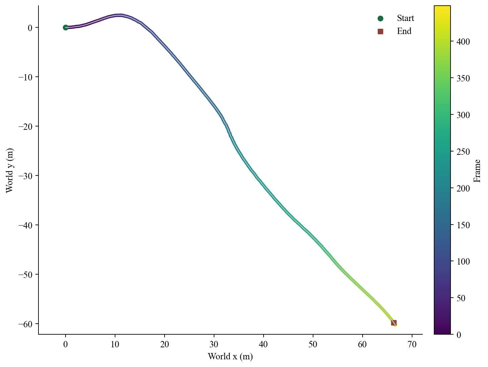
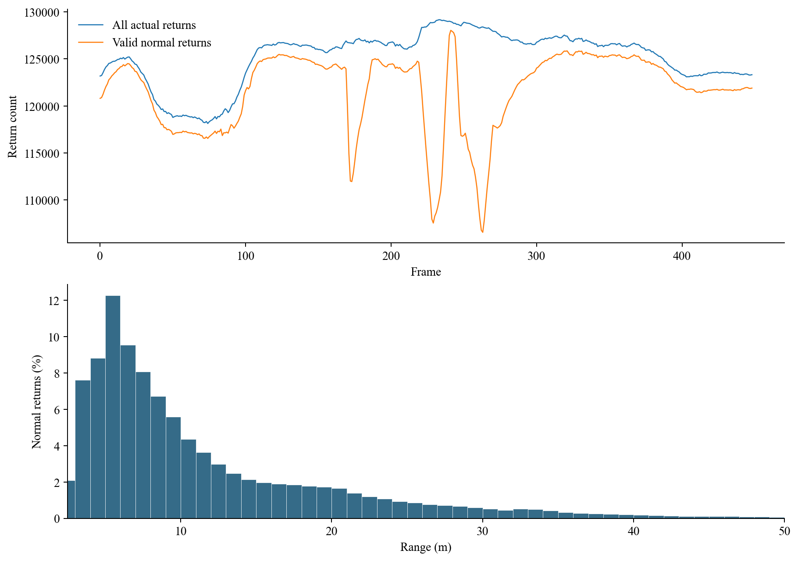
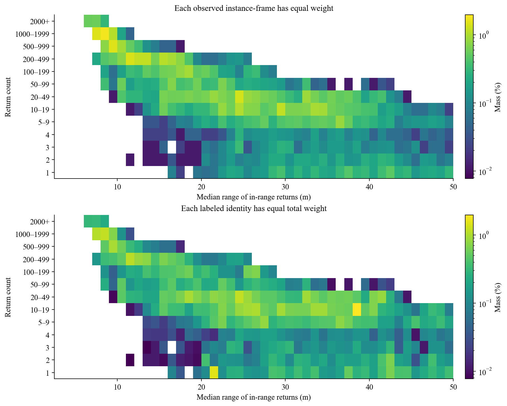
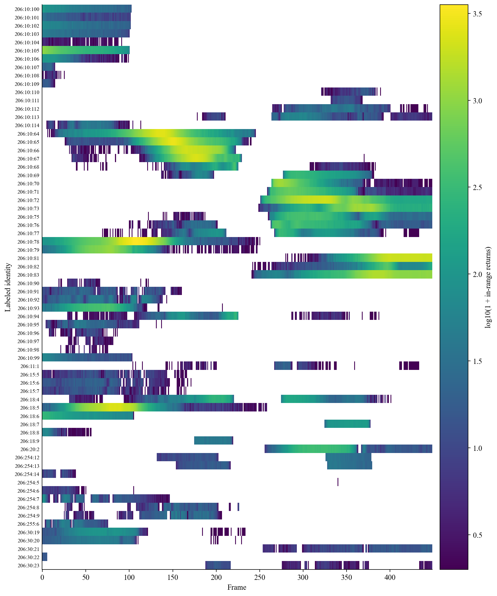
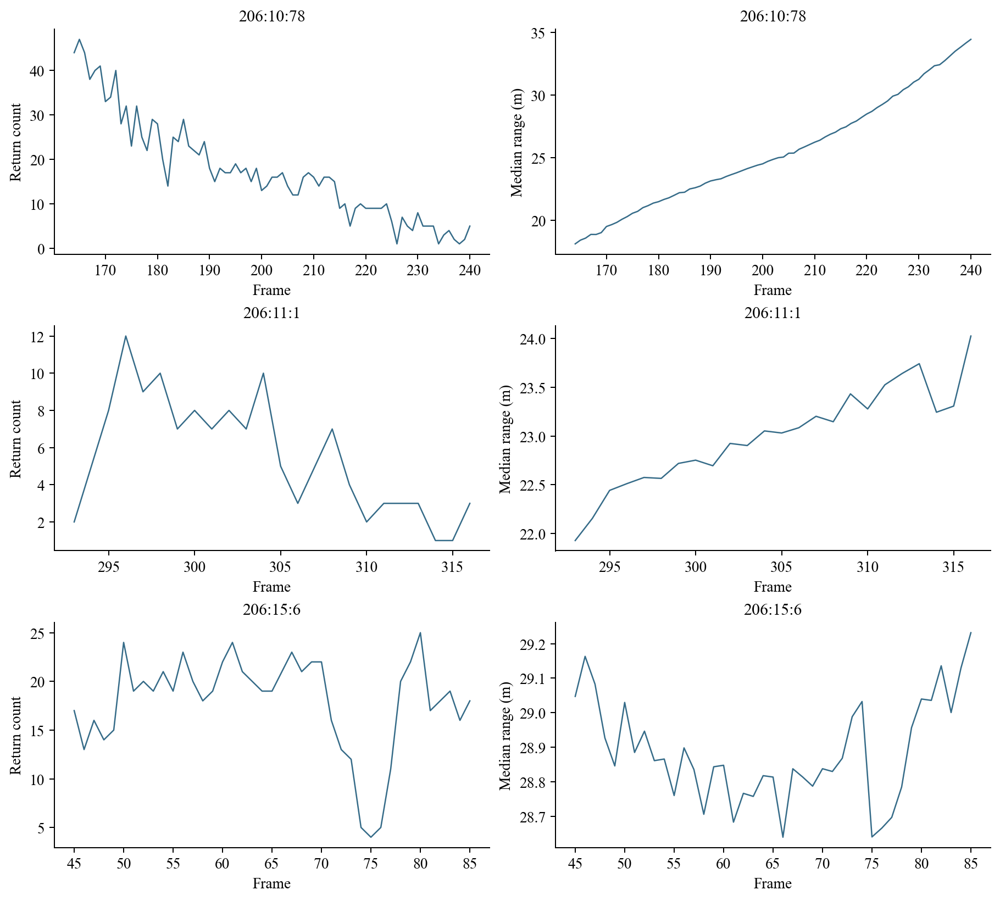

# 206 序列分析

## 数据基础与主要结论

本次读取 STU/train/206 的全部 449 帧原始扫描、标签、相机位姿和标定。统计服务于总方案的广覆盖数据构造、正常观测参照及单帧分割监督；没有生成异常、训练模型或计算异常检测成绩。

| 项目 | 全序列结果 |
| --- | --- |
| 原始文件记录 | 58,851,328 |
| 实际回波 | 56,196,767 |
| 坐标全零的空记录 | 2,654,561 |
| 2.5–50 米内实际回波 | 55,060,633 |
| 范围内有效正常点 | 54,631,044 |
| 范围内忽略标签点 | 429,589 |
| 全扫描原生异常回波 | 0 |
| 每帧实际回波最少／中位／最多 | 118,138 / 126,361 / 129,167 |

449 帧扫描、449 份标签和 449 个位姿逐帧对应，帧号为 0–448。扫描均为 131,072 条四维记录，坐标和强度均为有限数。未发现帧内相同坐标或相同四维记录的额外副本；统计保留原始文件记录，未按坐标删点。

全部 2,654,561 个空记录都具有非零强度，且原始标签为 0。判定实际回波必须检查坐标是否全零，不能仅检查强度。范围外的 1,136,134 个实际回波仍属于模型完整扫描输入。

206 的原生异常点数为零。当前 P1 数据先导允许可信零异常帧参加训练，449 帧原始正常扫描同时用于正常监督、背景构造与离线参照。有效异常总数为 1–4 的合成帧剔除，总数不少于 5 的帧保留。官方评价继续跳过异常不足 5 点的扫描。本文所称有效正常点，指坐标非全零、三维欧氏距离位于含边界的 2.5–50 米、原始标签非 0 且非 2 的点。

这些结果确认原始背景读取与离线参照统计，不能证明异常可学习、合成数据充分或模型性能提升。

## 语义组成与实例身份覆盖

下表列出实际出现的原始语义类别。比例以范围内有效正常点为分母；原始标签 0 不参与正常监督。实例身份必须同时包含序列、原始语义类别和非零编号。

| 原始标签 | 类别 | 范围内回波 | 正常占比 | 实例身份 |
| --- | --- | --- | --- | --- |
| 0 | 未标注 | 429,589 | — | 0 |
| 1 | 离群标签 | 314,838 | 0.58% | 0 |
| 10 | 汽车 | 1,486,631 | 2.72% | 43 |
| 11 | 自行车 | 596 | 0.00% | 1 |
| 15 | 摩托车 | 3,988 | 0.01% | 3 |
| 18 | 卡车 | 167,418 | 0.31% | 6 |
| 20 | 其他车辆 | 24,875 | 0.05% | 1 |
| 30 | 行人 | 13,575 | 0.02% | 5 |
| 40 | 道路 | 9,119,316 | 16.69% | 0 |
| 48 | 人行道 | 822,367 | 1.51% | 0 |
| 49 | 其他地面 | 43,899 | 0.08% | 0 |
| 50 | 建筑 | 22,735,334 | 41.62% | 0 |
| 51 | 围栏 | 3,584,456 | 6.56% | 0 |
| 52 | 其他结构 | 123,926 | 0.23% | 0 |
| 70 | 植被 | 11,900,778 | 21.78% | 0 |
| 71 | 树干 | 1,852,577 | 3.39% | 0 |
| 72 | 地形 | 788,135 | 1.44% | 0 |
| 80 | 杆状物 | 306,583 | 0.56% | 0 |
| 81 | 交通标志 | 177,891 | 0.33% | 0 |
| 99 | 其他物体 | 1,150,850 | 2.11% | 0 |
| 254 | 运动行人 | 11,306 | 0.02% | 8 |
| 255 | 运动骑摩托车者 | 1,705 | 0.00% | 1 |

有效正常点中，仅 1,710,002 点具有非零实例编号，占 3.13%。道路、建筑、植被、树干、杆状物、交通标志等在本序列中没有非零实例编号。它们继续提供正常背景监督，不能把整类点当成一个物体统计。

原始标签 1、52、99 分别有 314,838、123,926、1,150,850 个范围内回波。它们在官方二元口径中属于正常点，不能沿用旧语义训练映射将其丢弃。标签 1 缺乏明确正常结构语义，因此不据此构造实例参照。

## 轨迹、位姿与射线一致性

传感器沿原始位姿累计移动 97.172 米，首尾位移 89.317 米。每相邻帧的移动中位数为 0.232 米，最大为 0.380 米。文件没有时间戳，因此不将这些量换算为速度。



世界坐标采用 `inv(Tr) @ pose_camera @ Tr`，旋转矩阵的最大正交误差约为 4.44e-16。该世界坐标继承初始雷达参考轴，不代表地理方位；没有重新配准或改变原始轨迹。

已有射线标定包含 128 束、每圈 1,024 列，名义水平间隔 0.3515625 度。束仰角从 -21.500 至 20.810 度，相邻束仰角间隔中位数为 0.340 度。

本次对全部实际回波计算到对应标定射线的垂直距离，中位数 0.290 毫米，95 分位 2.398 毫米，99 分位 4.566 毫米，最大 34.693 毫米；没有回波位于射线原点后方。

这支持已有标定与 206 文件记录的几何一致性。该标定原本由 206 拟合，因此这不是独立传感器精度验证，也不自动确定 V4 允许的合成误差。

## 回波距离、强度与采样间距



范围内正常点的距离中位数为 8.237 米，75 分位为 14.441 米，95 分位为 29.735 米。全扫描中最远实际回波为 227.951 米。点数多集中在近处，不能用累计点数代替不同位置的覆盖。

有效正常点原始强度范围为 0.001143–1.636857，中位数 0.192000。强度可以超过 1；分析未截断或重新归一化。逐帧的相邻水平射线正常回波间距中位数再取中位数为 0.0716 米，垂直方向为 0.0891 米。

间距统计要求两条相邻射线均有范围内正常回波，但不要求属于同一表面；距离跳变可能跨越物体边界或遮挡边界，不能直接解释为表面粗糙度。

## 正常观测的回波数量与距离



有范围内回波的实例观测共 8,848 次，其中 1,698 次只有 1–4 个回波，占 19.19%，涉及 60 个标注身份。每个身份等权后，这一比例为 23.60%。

两图分别归一化为 100%。第一图容易受到长期可见物体的影响；第二图用于观察身份覆盖差异，不规定训练抽样权重。图中分箱只用于显示，不是 V4 的正式覆盖组合、远距定义或匹配容差。

## 全部标注身份的可见区间



68 个标注身份中，67 个跨帧出现，9 个带运动语义标签。全部实际观测有 8,937 次，其中 8,848 次具有范围内回波；按连续有范围内回波分成 411 段。多个片段仍属于原标注身份，不作为新增独立结构。

空白只表示该帧没有该标注身份的范围内回波，不能区分距离过远、遮挡、漏标或物体离开。时间片段应据这些真实观测安排，不能用插值补出回波。

## 跨帧关联的证据与限制

同一实例数字在不同语义类别间重复使用。本次发现同时复用的数字包括 5、6、7、8、9，因此仅使用实例数字会把不同对象混在一起。完整标识保留原始语义类别，运动与非运动标签也不自动合并。

对每个身份，将所有观测按原始位姿变换至世界坐标。相继两次观测分别计算双向最近点距离，再取两个方向中位数及 95 分位的较大值。另将按帧序排列的观测等分为三组，比较相邻两组汇集表面的距离。它们描述观测表面一致性，不是物体速度或身份真值。

| 标注身份 | 前帧→后帧 | 间隔帧数 | 双向中位距离 |
| --- | --- | --- | --- |
| `206:254:13` | 216→328 | 112 | 15.146 米 |
| `206:254:12` | 202→326 | 124 | 14.338 米 |
| `206:10:76` | 201→263 | 62 | 4.980 米 |
| `206:10:96` | 72→74 | 2 | 4.838 米 |
| `206:18:4` | 220→275 | 55 | 4.523 米 |
| `206:10:77` | 211→267 | 56 | 4.401 米 |

较大的跨帧距离并不自动表明标注错误。运动、长时间无回波、物体不同部位被观测以及位姿误差，都可能造成变化。反过来，重复编号和较小距离也不能单独认证固定物体。本次保留全部观测与间隔，不设自动通过或剔除阈值。

没有实例编号的杆状物、树干和交通标志等，仍提供正常点及同帧上下文。若后续需要把其中某片区域作为跨帧参照，必须在落实时明确具体区域及关联依据；当前不能把未定义的区域曲线补写成已测得结果。

可见点的世界包围范围只覆盖已观测表面，不能当作完整物体尺寸、真实高度、接地状态或可放置空间。206 的本轮分析没有把任何候选位置认定为已经满足异常接地与无穿插要求。

## 此前三个参照片段的全段复核



汽车 `206:10:78`，第 164–240 帧：1–47 个回波，距离中位数范围 18.11–34.47 米。

自行车 `206:11:1`，第 293–316 帧：1–12 个回波，距离中位数范围 21.93–24.03 米。

摩托车 `206:15:6`，第 45–85 帧：4–25 个回波，距离中位数范围 28.64–29.23 米。

三个片段共 142 次观测、19 次 1–4 点观测。摩托车例显示相近距离可以对应不同回波数量；原因尚不能归结为单一遮挡因素。三例不作为 V4 的唯一参照，也不构成总体代表性或已完成异常匹配的证据。

## 对两阶段数据构造的具体支持

**基础数据。** 206 提供完整正常背景、可用的位姿轨迹及多种语义结构。点分布明显偏向近处，而不同正常物体的可见区间和回波数量差异较大。首轮合成需要在整个数据池检查几何、位置与实际观测覆盖，不能用多次重复同一背景的累计点数替代多样性。

**针对性数据。** 本次为全部标注身份保留逐帧数量、距离、观测间隔和世界几何证据，并给出连续可见片段。后续可据具体可信参照选择异常几何、尺寸与世界位置，再由原始射线自然形成观测；本次没有确定匹配容差，也没有逐帧增删点来拟合曲线。

**少回波监督。** 60 个标注身份出现过范围内 1–4 点观测，说明少回波正常观测实际存在。它们保留在离线参照统计中，也可在可信零异常帧中提供正常监督；有异常的扫描须在联合遮挡后达到整帧至少 5 个有效异常点。合格帧内单个物体的 1–4 点观测仍参与监督。

**尚不能从原始序列给出的结论。** 没有植入异常，便没有异常引起的背景变化真值，也不能判断弱背景变化异常是否覆盖充分。缺少完整物体几何和具体放置，就不能给出低矮异常覆盖数或合法放置数量。没有模型预测，便不能计算 AP、AUROC、FPR95，也不能确认对 COVAL 的性能增益。

**独立性。** 206 始终只是一条原始背景序列。其不同帧、同一物体的多个片段以及未来的多个合成版本都有关联。本次没有读取 STU 真实异常评价集来构造训练分布，所得统计不构成独立泛化证据。

下一项能改变数据构造判断的动作，是在实际开展异常放置时，依据明确的正常参照和覆盖目标，核查自然生成的数量—距离变化、接地、穿插与联合遮挡。相关未定数值在落实时再逐项确认。

## 复算入口、统计单位与交付文件

原始输入：`/home/jasongao/Data/STU/train/206`。射线参考：`/home/jasongao/Study/AJAE-v4/assets/rays.npz`。[分析程序](../../src/analyze.py)与物理观测共用 [V4 数据读取实现](../../src/data.py)，没有导入旧训练代码、旧合成池或旧实验成绩。射线参数原始来源为 AJAE/assets/rays.npz，迁入 V4 后重新核对实际回波。

| 文件 | 统计单位与用途 |
| --- | --- |
| [frames.csv](frames.csv) | 449 行；完整扫描、标签、距离、强度、射线与位姿统计 |
| [labels.csv](labels.csv) | 原始语义类别；回波和实例身份覆盖 |
| [observations.csv](observations.csv) | 30,532 行；68 个标注身份 × 449 帧，含零观测 |
| [structures.csv](structures.csv) | 68 行；每个标注身份的观测与几何汇总 |
| [segments.csv](segments.csv) | 411 行；连续具有范围内回波的自然片段 |
| [summary.json](summary.json) | 总体统计、分箱数据、定义与执行信息 |

距离：原始 `float32` 坐标的三维欧氏距离，含 2.5 与 50 米边界。观测表同时保存全部回波距离与范围内距离的最小值、中位数和最大值；联合图用范围内距离中位数。中位数使用 `np.median`，其中 `float32` 距离保持原精度；其他分位数使用线性插值。观测之间存在相关性，本文不把分位数或相关系数解释为独立样本推断。

数量：按实际文件回波计数。零回波的距离、强度和几何字段为空，不能按数值 0 使用。连续片段由相邻帧是否至少有一个范围内回波直接确定，没有附加最短长度。标注身份、物理物体数、片段数和实例观测次数分别报告。

完整扫描的坐标、标签与文件长度已经逐帧核查；总体点数、距离分区、标签分区、实例观测与片段计数相互核对。图表使用同一批保存的统计表，不另行抽样计算。

正文和表格为可编辑的 Markdown，五组图片保存于同一目录并通过相对路径引用。图中文字使用已核对的 Times New Roman；正文的实际字体由 Markdown 阅读器控制，按项目要求阅读时应将中文设为宋体、英文设为 Times New Roman。

运行环境使用已有 AJAE Python 环境，在 AJAE-v4 根目录运行：

```bash
PYTHONDONTWRITEBYTECODE=1 /home/jasongao/Study/AJAE/.venv/bin/python -m src.analyze --workers 6
```

仅重建报告：在上述命令后加 `--report-only`；读取已保存统计表，生成 `report.md` 和文中图片，不重新分析原始扫描。

标签和评价依据：[STU 官方逐点评测代码](https://github.com/kumuji/stu_dataset/blob/main/compute_point_level_ood.py)与[官方语义标签配置](https://github.com/kumuji/stu_dataset/blob/main/Mask4Former3D/conf/semantic-kitti.yaml)。报告中的数字均来自本次 206 实际读取；没有模拟数字或预测成绩。
